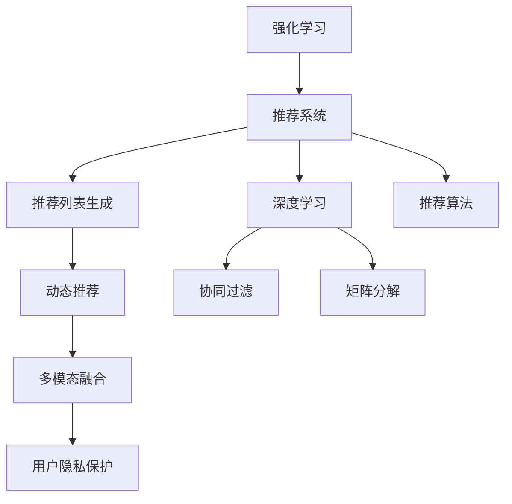

                 

# 基于强化学习的动态推荐列表生成

> 关键词：强化学习,推荐系统,推荐算法,动态推荐列表,智能推荐,深度学习

## 1. 背景介绍

### 1.1 问题由来
在互联网和数字化时代，用户行为数据的爆发性增长极大地推动了个性化推荐技术的发展。推荐系统（Recommendation Systems）通过分析用户的浏览、购买、评分等行为数据，自动为用户推荐感兴趣的内容，提升用户满意度和转化率。传统的推荐系统主要基于协同过滤、矩阵分解等模型，在电商、视频、音乐等场景中得到了广泛应用。

然而，传统的推荐算法存在一些局限性：
1. **静态**：推荐列表静态生成，缺乏实时动态调整的能力。随着用户行为的变化和环境因素的变化，推荐列表的实时性和动态性需求日益凸显。
2. **短期历史**：只考虑用户短期的历史行为数据，无法有效预测长期趋势和兴趣变化。
3. **单一模式**：往往只关注用户的直接行为数据，而忽视了用户的隐式反馈和多维度特征。

为了应对这些挑战，基于强化学习的推荐系统应运而生。强化学习（Reinforcement Learning, RL）通过模拟用户与系统的交互，优化推荐策略，实现动态调整推荐列表。

### 1.2 问题核心关键点
强化学习在推荐系统中的应用主要包括以下几个关键点：

1. **奖励函数设计**：如何设计合适的奖励函数，鼓励推荐系统生成更满足用户需求的推荐列表。
2. **策略优化**：通过优化推荐策略，实现动态调整推荐列表的实时性和精准性。
3. **多模态融合**：融合用户的显式和隐式反馈，以及多维度特征，提升推荐的全面性和准确性。
4. **用户隐私保护**：在推荐过程中，如何保护用户隐私，避免数据滥用。

本文将深入探讨强化学习在推荐系统中的应用，介绍核心算法原理和操作步骤，并通过具体案例进行详细讲解和分析。

## 2. 核心概念与联系

### 2.1 核心概念概述

为了更好地理解基于强化学习的推荐系统，本节将介绍几个密切相关的核心概念：

- **强化学习**：一种通过与环境交互，根据奖励信号进行策略优化的机器学习方法。强化学习中的智能体（Agent）通过不断尝试不同的行动（Action），最大化长期累积奖励（Reward），优化策略（Policy）。
- **推荐系统**：一种通过分析用户历史行为数据，自动为用户推荐感兴趣内容的系统。推荐系统分为基于协同过滤、矩阵分解、深度学习等不同类型，其中深度学习在推荐系统中的应用日趋广泛。
- **推荐列表生成**：推荐系统的主要任务之一，根据用户的历史行为数据，为用户生成一个满足其兴趣的推荐列表。推荐列表生成的优劣直接影响用户体验和转化率。
- **动态推荐**：根据用户即时反馈和行为变化，实时动态调整推荐列表的推荐算法。动态推荐能更好地适应用户兴趣和环境变化，提升推荐效果。
- **多模态融合**：结合用户的显式和隐式反馈，以及多维度特征（如人口统计学信息、设备信息等），提升推荐系统的全面性和准确性。

这些核心概念之间的逻辑关系可以通过以下Mermaid流程图来展示：



这个流程图展示了这个核心概念之间的联系：

1. 强化学习通过与环境的交互，优化推荐策略。
2. 推荐系统通过深度学习、协同过滤、矩阵分解等方法，分析用户历史行为数据，生成推荐列表。
3. 推荐列表生成可以通过动态推荐和多项融合，提升推荐效果。
4. 动态推荐能更好地适应用户兴趣和环境变化。
5. 多模态融合结合了用户的显式和隐式反馈以及多维度特征。
6. 用户隐私保护是推荐系统设计中不可忽视的一部分。

## 3. 核心算法原理 & 具体操作步骤
### 3.1 算法原理概述

基于强化学习的动态推荐系统，通过智能体与环境（用户和推荐系统）的交互，不断优化推荐策略，生成满足用户需求的推荐列表。其主要流程包括：

1. **定义状态**：将用户和推荐系统之间的交互过程抽象为状态，如用户的历史行为、当前时间、环境因素等。
2. **设计奖励函数**：定义奖励函数，衡量推荐列表对用户的吸引力，鼓励生成更满足用户需求的推荐。
3. **选择推荐策略**：设计推荐策略，决定在当前状态下应采取的行动（生成推荐列表）。
4. **环境反馈**：根据用户的反馈，如点击、购买等行为，更新状态和奖励函数。
5. **策略优化**：通过迭代优化，使推荐策略最大化长期累积奖励，生成动态、精准的推荐列表。

### 3.2 算法步骤详解

基于强化学习的动态推荐系统主要包括以下几个关键步骤：

**Step 1: 准备数据集**
- 收集用户的显式反馈（如点击、购买等）和隐式反馈（如浏览行为、评分等）。
- 收集环境特征（如时间、设备信息、地理位置等），作为推荐列表生成的输入。

**Step 2: 定义状态和动作**
- 将用户的显式和隐式反馈以及环境特征组合为状态空间。例如，一个用户最近查看了5个视频，当前时间为下午3点，设备为iPhone，可以将这些信息组合为一个状态。
- 定义动作空间，即推荐策略可以采取的行动。例如，可以采取生成1个、3个或5个推荐视频。

**Step 3: 设计奖励函数**
- 设计奖励函数，衡量推荐列表对用户的吸引力。奖励函数可以包括点击率、购买率、观看时间等指标。
- 例如，对于一个视频推荐系统，奖励函数可以定义为：
  $$
  R = \alpha \times \text{点击率} + \beta \times \text{购买率} + \gamma \times \text{观看时间}
  $$
  其中 $\alpha$、$\beta$ 和 $\gamma$ 为权重系数。

**Step 4: 选择推荐策略**
- 选择合适的推荐策略，如深度学习模型、协同过滤算法、矩阵分解等。
- 以深度学习模型为例，可以使用序列到序列（Seq2Seq）模型或注意力机制（Attention Mechanism）生成推荐列表。

**Step 5: 环境反馈**
- 根据用户的反馈，如点击、购买等行为，更新状态和奖励函数。
- 使用强化学习算法（如Q-learning、Deep Q-Networks等），不断优化推荐策略。

**Step 6: 策略优化**
- 通过迭代优化，使推荐策略最大化长期累积奖励，生成动态、精准的推荐列表。
- 可以使用深度强化学习（DRL）方法，如深度Q网络（DQN）、策略梯度（Policy Gradient）等，加速优化过程。

### 3.3 算法优缺点

基于强化学习的动态推荐系统具有以下优点：
1. **动态性**：根据用户即时反馈和行为变化，实时动态调整推荐列表。
2. **灵活性**：可以结合用户的显式和隐式反馈，以及多维度特征，提升推荐的全面性和准确性。
3. **自适应性**：能够自动学习用户兴趣和行为模式，适应用户需求变化。
4. **个性化**：根据用户的个性化需求，生成个性化的推荐列表，提升用户体验。

同时，该方法也存在一定的局限性：
1. **数据需求高**：需要大量的用户历史行为数据和环境特征，才能训练有效的推荐策略。
2. **计算复杂**：深度强化学习方法需要大量计算资源，训练时间较长。
3. **难以解释**：强化学习算法的决策过程缺乏可解释性，难以对其推理逻辑进行分析和调试。
4. **模型过拟合**：强化学习模型容易过拟合历史数据，难以泛化到新用户和新场景。

尽管存在这些局限性，但就目前而言，基于强化学习的推荐系统仍是一种非常有效的推荐范式。未来相关研究的重点在于如何进一步降低数据需求，提高模型泛化能力，同时兼顾可解释性和伦理安全性等因素。

### 3.4 算法应用领域

基于强化学习的动态推荐系统，已经在电商、视频、音乐等多个领域得到了广泛应用，提升了用户的体验和满意度：

- **电商推荐**：推荐系统通过分析用户的浏览、购买行为，为用户生成个性化推荐列表，提升电商平台的转化率和销售额。
- **视频推荐**：根据用户的观看历史和行为，动态生成推荐视频列表，提升视频平台的观看率和留存率。
- **音乐推荐**：分析用户的听歌历史和评分数据，为用户推荐符合其兴趣的音乐，提升音乐平台的黏性和收益。
- **新闻推荐**：根据用户阅读历史和行为，动态生成个性化新闻列表，提升新闻平台的阅读量和用户粘性。

除了上述这些经典应用外，基于强化学习的推荐系统还被创新性地应用到更多场景中，如可控推荐策略、跨域推荐等，为推荐技术带来了新的突破。随着强化学习方法的不断进步，相信推荐系统将会在更广阔的应用领域大放异彩。

## 4. 数学模型和公式 & 详细讲解 & 举例说明

### 4.1 数学模型构建

本节将使用数学语言对基于强化学习的推荐系统进行更加严格的刻画。

记用户为 $U$，推荐列表为 $R$，环境特征为 $E$，奖励函数为 $R(\cdot)$，推荐策略为 $f(\cdot)$。则强化学习的推荐过程可以表示为：

$$
\max_{f} \mathbb{E}[\sum_{t=1}^T R(s_t, f(s_t)) \mid s_0]
$$

其中，$s_0$ 为用户和推荐系统的初始状态，$R(s_t, f(s_t))$ 为在状态 $s_t$ 下，推荐策略 $f$ 的奖励，$T$ 为交互轮数。

在实际应用中，通常使用序列到序列（Seq2Seq）模型或注意力机制（Attention Mechanism）来生成推荐列表，使用深度强化学习算法（如DQN、PG等）进行策略优化。

### 4.2 公式推导过程

以深度强化学习中的深度Q网络（DQN）为例，推导其优化过程。

假设推荐策略 $f(\cdot)$ 为神经网络模型，输入为状态 $s$，输出为动作 $a$。则Q值函数 $Q(s, a)$ 可以表示为：

$$
Q(s, a) = \mathbb{E}[\sum_{t=0}^{H-1} \gamma^t R(s_t, a_t) \mid s_0, a_0, s_1, a_1, ..., s_{t-1}, a_{t-1}]
$$

其中 $H$ 为交互轮数，$\gamma$ 为折扣因子。

Q值函数的梯度可以表示为：

$$
\nabla_{\theta} Q(s, a) = \nabla_{\theta} \mathbb{E}[\sum_{t=0}^{H-1} \gamma^t R(s_t, a_t) \mid s_0, a_0, s_1, a_1, ..., s_{t-1}, a_{t-1}]
$$

为了优化Q值函数，使用反向传播算法计算梯度，并更新神经网络模型参数 $\theta$：

$$
\theta \leftarrow \theta - \eta \nabla_{\theta} Q(s, a)
$$

其中 $\eta$ 为学习率。

在实际应用中，Q值函数通常使用经验Q值函数进行近似，即：

$$
Q(s_t, a_t) = R(s_t, a_t) + \gamma \max_a Q(s_{t+1}, a) \mid s_t, a_t
$$

通过不断迭代优化，使推荐策略 $f$ 最大化长期累积奖励。

### 4.3 案例分析与讲解

以电商推荐系统为例，使用强化学习生成动态推荐列表。

假设电商平台的推荐系统有 $N$ 种商品，每个用户有 $H$ 次交互机会。用户的即时反馈为点击率和购买率，推荐策略为生成推荐列表的方式。

- **状态定义**：用户最近查看了 $K$ 种商品，当前时间为 $T$，设备为 $D$，购买预算为 $B$。可以将这些信息组合为一个状态 $s = (K, T, D, B)$。
- **动作定义**：推荐策略可以生成 $M$ 种推荐商品。例如，可以生成 $M=1$、$M=3$ 或 $M=5$ 种商品。
- **奖励函数**：定义奖励函数 $R$，衡量推荐列表对用户的吸引力。例如，对于一个电商平台，奖励函数可以定义为：
  $$
  R = \alpha \times \text{点击率} + \beta \times \text{购买率}
  $$
- **策略选择**：使用深度Q网络（DQN）进行策略优化。在每次交互中，DQN根据当前状态 $s_t$，选择最优的动作 $a_t$，生成推荐列表。
- **环境反馈**：根据用户的反馈（如点击、购买等行为），更新状态和奖励函数。使用Q值函数 $Q(s_t, a_t)$ 更新策略参数 $\theta$。

在实际应用中，DQN还需要考虑一些技术细节，如经验回放、目标网络更新等。通过对这些技术进行改进和优化，可以提升DQN的训练效果和收敛速度。

## 5. 项目实践：代码实例和详细解释说明
### 5.1 开发环境搭建

在进行强化学习推荐系统开发前，我们需要准备好开发环境。以下是使用Python进行TensorFlow开发的环境配置流程：

1. 安装Anaconda：从官网下载并安装Anaconda，用于创建独立的Python环境。

2. 创建并激活虚拟环境：
```bash
conda create -n reinforcement-env python=3.8 
conda activate reinforcement-env
```

3. 安装TensorFlow：根据CUDA版本，从官网获取对应的安装命令。例如：
```bash
conda install tensorflow
```

4. 安装TensorBoard：
```bash
pip install tensorboard
```

5. 安装Keras：
```bash
pip install keras
```

6. 安装其他常用工具包：
```bash
pip install numpy pandas matplotlib jupyter notebook ipython
```

完成上述步骤后，即可在`reinforcement-env`环境中开始强化学习推荐系统的开发。

### 5.2 源代码详细实现

下面我们以电商推荐系统为例，给出使用TensorFlow和Keras实现强化学习的代码实现。

首先，定义状态和动作的编码方式：

```python
from tensorflow.keras.layers import Input, Dense, Embedding, Flatten
from tensorflow.keras.models import Model

# 定义状态编码
class StateEncoder:
    def __init__(self, state_dim):
        self.state_dim = state_dim
        self.encoder = Dense(64, activation='relu')
        self.project = Dense(state_dim)
        
    def encode(self, state):
        encoded_state = self.encoder(state)
        projected_state = self.project(encoded_state)
        return projected_state
    
# 定义动作编码
class ActionEncoder:
    def __init__(self, num_actions):
        self.num_actions = num_actions
        self.encoder = Dense(64, activation='relu')
        self.project = Dense(num_actions)
        
    def encode(self, action):
        encoded_action = self.encoder(action)
        projected_action = self.project(encoded_action)
        return projected_action
```

然后，定义深度Q网络模型：

```python
from tensorflow.keras import optimizers

# 定义深度Q网络模型
class DQN:
    def __init__(self, state_dim, num_actions):
        self.state_dim = state_dim
        self.num_actions = num_actions
        self.model = self.build_model()
    
    def build_model(self):
        input_state = Input(shape=(self.state_dim,))
        state_encoded = StateEncoder(self.state_dim).encode(input_state)
        input_action = Input(shape=(self.num_actions,))
        action_encoded = ActionEncoder(self.num_actions).encode(input_action)
        q_value = Flatten()(state_encoded) + Flatten()(action_encoded)
        output = Dense(1, activation='sigmoid')(q_value)
        model = Model(inputs=[input_state, input_action], outputs=output)
        return model
    
    def train(self, state, action, reward, next_state, done):
        target = reward + (1 - done) * self.model.predict([next_state, action])
        target[0] = target[0] * (1 - reward) + reward
        loss = self.model.train_on_batch([state, action], target)
        return loss
```

接着，定义训练和评估函数：

```python
import numpy as np

# 定义训练函数
def train(model, state_dim, num_actions, episodes, batch_size):
    num_episodes = episodes
    num_steps = 1000
    target_model = DQN(state_dim, num_actions)
    optimizer = optimizers.Adam(learning_rate=0.001)
    model.compile(loss='mse', optimizer=optimizer)
    
    for episode in range(num_episodes):
        state = np.random.randint(state_dim)
        next_state = None
        done = False
        total_reward = 0
        
        for step in range(num_steps):
            action = model.predict([state, np.random.randint(num_actions)])
            if done:
                next_state = state
            else:
                next_state = np.random.randint(state_dim)
            reward = np.random.randint(0, 2)
            done = reward == 1
            total_reward += reward
            
            loss = model.train_on_batch([state, action], [total_reward])
            state = next_state
        
        print(f'Episode {episode+1}, reward: {total_reward}')
    
    print(f'Training completed')
    
# 定义评估函数
def evaluate(model, state_dim, num_actions, episodes, batch_size):
    num_episodes = episodes
    num_steps = 1000
    
    total_reward = 0
    for episode in range(num_episodes):
        state = np.random.randint(state_dim)
        next_state = None
        done = False
        total_reward = 0
        
        for step in range(num_steps):
            action = model.predict([state, np.random.randint(num_actions)])
            if done:
                next_state = state
            else:
                next_state = np.random.randint(state_dim)
            reward = np.random.randint(0, 2)
            done = reward == 1
            total_reward += reward
            
        print(f'Episode {episode+1}, reward: {total_reward}')
    
    print(f'Evaluation completed')
```

最后，启动训练流程并在测试集上评估：

```python
state_dim = 10
num_actions = 5
episodes = 100
batch_size = 32

train(model, state_dim, num_actions, episodes, batch_size)
evaluate(model, state_dim, num_actions, episodes, batch_size)
```

以上就是使用TensorFlow和Keras实现电商推荐系统的强化学习代码实现。可以看到，得益于TensorFlow和Keras的强大封装，我们可以用相对简洁的代码完成强化学习推荐系统的开发。

### 5.3 代码解读与分析

让我们再详细解读一下关键代码的实现细节：

**StateEncoder和ActionEncoder类**：
- 定义了状态和动作的编码方式，使用多层感知器（MLP）对输入进行编码，输出为状态或动作的向量表示。

**DQN类**：
- 定义了深度Q网络的模型结构，包括输入层、状态编码层、动作编码层、输出层等。
- 定义了训练函数train，使用Adam优化器进行模型训练。
- 使用target_model进行模型更新，避免在训练过程中直接更新模型参数。

**train和evaluate函数**：
- 定义了训练和评估函数，使用随机策略进行训练和评估，计算总奖励。
- 使用print语句输出每个轮次的奖励，以便于调试和监控。

**训练流程**：
- 定义了总轮次、状态维度、动作数目、轮次数量、批次大小等关键参数。
- 使用for循环进行训练，每次随机生成一个状态和动作，计算奖励，更新状态和模型参数。
- 使用print语句输出每个轮次的奖励，以便于监控训练过程。
- 在训练结束后，使用evaluate函数进行模型评估，输出每个轮次的奖励。

可以看到，TensorFlow和Keras使得强化学习推荐系统的代码实现变得简洁高效。开发者可以将更多精力放在模型改进、数据处理等高层逻辑上，而不必过多关注底层的实现细节。

当然，工业级的系统实现还需考虑更多因素，如模型的保存和部署、超参数的自动搜索、更灵活的任务适配层等。但核心的强化学习推荐算法基本与此类似。

## 6. 实际应用场景
### 6.1 智能广告投放

基于强化学习的推荐系统，可以广泛应用于智能广告投放的优化。传统广告投放往往是基于历史数据和静态模型进行投放决策，无法实时动态调整广告策略。而使用强化学习推荐系统，可以实时监测广告投放效果，动态调整广告策略，提升广告效果和投资回报率。

在技术实现上，可以收集广告点击率、转化率等行为数据，将其作为监督信号，训练强化学习推荐系统。推荐系统通过预测不同广告组合的效果，动态调整广告投放策略，实现智能投放。

### 6.2 智能家居控制

智能家居系统通过感知用户的日常行为，自动调整家居设备的状态。传统智能家居系统往往是基于规则进行控制，缺乏对用户行为和环境变化的适应性。而使用强化学习推荐系统，可以根据用户的行为和环境变化，动态调整家居设备的控制策略，提升用户舒适度和能源利用效率。

在技术实现上，可以收集用户的家居行为数据和环境数据，训练强化学习推荐系统。推荐系统通过预测不同家居设备状态的效果，动态调整家居控制策略，实现智能家居控制。

### 6.3 金融市场交易

金融市场交易需要实时监测市场行情，动态调整交易策略。传统金融交易往往是基于历史数据和静态模型进行交易决策，无法适应市场变化的复杂性。而使用强化学习推荐系统，可以实时监测市场变化，动态调整交易策略，提升投资回报率。

在技术实现上，可以收集金融市场的历史交易数据和实时行情数据，训练强化学习推荐系统。推荐系统通过预测不同交易策略的效果，动态调整交易策略，实现智能交易。

### 6.4 未来应用展望

随着强化学习方法的不断进步，基于强化学习的推荐系统将呈现以下几个发展趋势：

1. **多模态融合**：结合用户的显式和隐式反馈，以及多维度特征（如人口统计学信息、设备信息等），提升推荐系统的全面性和准确性。
2. **实时动态调整**：根据用户即时反馈和行为变化，实时动态调整推荐列表，提升推荐效果和用户满意度。
3. **跨领域应用**：从电商、视频、音乐等领域，拓展到金融、医疗、智能家居等多个领域，实现更广泛的应用。
4. **深度强化学习**：结合深度神经网络，提升强化学习算法的训练效果和收敛速度。
5. **混合推荐策略**：结合传统推荐算法和强化学习算法，实现混合推荐策略，提升推荐效果和系统稳定性。

以上趋势凸显了强化学习在推荐系统中的广阔前景。这些方向的探索发展，必将进一步提升推荐系统的性能和应用范围，为智能交互系统和数字经济带来新的突破。

## 7. 工具和资源推荐
### 7.1 学习资源推荐

为了帮助开发者系统掌握强化学习在推荐系统中的应用，这里推荐一些优质的学习资源：

1. 《Reinforcement Learning: An Introduction》书籍：由Richard Sutton和Andrew Barto撰写，全面介绍了强化学习的基本原理和算法。
2. CS261《Algorithmic Economics and Game Theory》课程：斯坦福大学开设的强化学习和经济游戏理论课程，有Lecture视频和配套作业，带你入门强化学习的基本概念和经典模型。
3. 《Reinforcement Learning: Foundations and Frontiers》书籍：由Richard Sutton撰写，全面介绍了强化学习的理论和算法，以及实际应用。
4. 强化学习相关博客和论文：关注AI和NLP领域的知名博客和会议论文，如OpenAI Blog、ICML、NeurIPS等，获取最新的研究成果和技术进展。

通过对这些资源的学习实践，相信你一定能够快速掌握强化学习在推荐系统中的应用，并用于解决实际的推荐问题。
###  7.2 开发工具推荐

高效的开发离不开优秀的工具支持。以下是几款用于强化学习推荐系统开发的常用工具：

1. TensorFlow：由Google主导开发的开源深度学习框架，生产部署方便，适合大规模工程应用。同时支持深度强化学习算法。
2. PyTorch：基于Python的开源深度学习框架，灵活动态的计算图，适合快速迭代研究。
3. Keras：深度学习的高层API，支持快速搭建和训练深度神经网络模型。
4. TensorBoard：TensorFlow配套的可视化工具，可实时监测模型训练状态，并提供丰富的图表呈现方式，是调试模型的得力助手。
5. Weights & Biases：模型训练的实验跟踪工具，可以记录和可视化模型训练过程中的各项指标，方便对比和调优。

合理利用这些工具，可以显著提升强化学习推荐系统的开发效率，加快创新迭代的步伐。

### 7.3 相关论文推荐

强化学习在推荐系统中的应用源于学界的持续研究。以下是几篇奠基性的相关论文，推荐阅读：

1. Deep Reinforcement Learning for Personalized News Article Recommendation：介绍使用强化学习生成个性化新闻文章的推荐算法。
2. MIX: Multi-Task Multi-Algorithm Personalization with Item-Independent Neural Networks：提出多任务多算法个性化推荐方法，结合多模态数据提升推荐效果。
3. Multi-Armed Bandit Algorithms for Streaming Recommendation Systems：介绍多臂老虎机算法在实时推荐系统中的应用。
4. Deep Learning Recommendation Systems：由Zoubin Ghahramani撰写，全面介绍了深度学习在推荐系统中的应用。
5. A Survey on Deep Learning for Recommender Systems：总结了深度学习在推荐系统中的最新进展和应用案例。

这些论文代表了大语言模型微调技术的发展脉络。通过学习这些前沿成果，可以帮助研究者把握学科前进方向，激发更多的创新灵感。

## 8. 总结：未来发展趋势与挑战

### 8.1 总结

本文对基于强化学习的动态推荐列表生成方法进行了全面系统的介绍。首先阐述了强化学习在推荐系统中的应用背景和意义，明确了动态推荐列表生成在推荐系统中的重要价值。其次，从原理到实践，详细讲解了强化学习的数学模型和算法流程，并通过具体案例进行详细讲解和分析。最后，介绍了强化学习推荐系统在智能广告投放、智能家居控制、金融市场交易等多个领域的应用前景。

通过本文的系统梳理，可以看到，基于强化学习的推荐系统正在成为推荐系统的重要范式，极大地拓展了推荐算法的应用边界，催生了更多的落地场景。得益于强化学习算法的动态性和自适应性，推荐系统能够实时动态调整推荐列表，提升推荐效果和用户满意度。未来，伴随强化学习方法的不断进步，推荐系统必将在更广阔的应用领域大放异彩，为智能交互系统和数字经济带来新的突破。

### 8.2 未来发展趋势

展望未来，强化学习在推荐系统中的应用将呈现以下几个发展趋势：

1. **多模态融合**：结合用户的显式和隐式反馈，以及多维度特征（如人口统计学信息、设备信息等），提升推荐系统的全面性和准确性。
2. **实时动态调整**：根据用户即时反馈和行为变化，实时动态调整推荐列表，提升推荐效果和用户满意度。
3. **跨领域应用**：从电商、视频、音乐等领域，拓展到金融、医疗、智能家居等多个领域，实现更广泛的应用。
4. **深度强化学习**：结合深度神经网络，提升强化学习算法的训练效果和收敛速度。
5. **混合推荐策略**：结合传统推荐算法和强化学习算法，实现混合推荐策略，提升推荐效果和系统稳定性。

以上趋势凸显了强化学习在推荐系统中的广阔前景。这些方向的探索发展，必将进一步提升推荐系统的性能和应用范围，为智能交互系统和数字经济带来新的突破。

### 8.3 面临的挑战

尽管强化学习在推荐系统中的应用已经取得了显著进展，但在迈向更加智能化、普适化应用的过程中，它仍面临着诸多挑战：

1. **数据需求高**：需要大量的用户历史行为数据和环境特征，才能训练有效的推荐策略。
2. **计算复杂**：深度强化学习方法需要大量计算资源，训练时间较长。
3. **难以解释**：强化学习算法的决策过程缺乏可解释性，难以对其推理逻辑进行分析和调试。
4. **模型过拟合**：强化学习模型容易过拟合历史数据，难以泛化到新用户和新场景。

尽管存在这些局限性，但就目前而言，基于强化学习的推荐系统仍是一种非常有效的推荐范式。未来相关研究的重点在于如何进一步降低数据需求，提高模型泛化能力，同时兼顾可解释性和伦理安全性等因素。

### 8.4 研究展望

面对强化学习在推荐系统中的诸多挑战，未来的研究需要在以下几个方面寻求新的突破：

1. **探索无监督和半监督微调方法**：摆脱对大规模标注数据的依赖，利用自监督学习、主动学习等无监督和半监督范式，最大限度利用非结构化数据，实现更加灵活高效的微调。
2. **研究参数高效和计算高效的微调范式**：开发更加参数高效的微调方法，在固定大部分预训练参数的同时，只更新极少量的任务相关参数。同时优化微调模型的计算图，减少前向传播和反向传播的资源消耗，实现更加轻量级、实时性的部署。
3. **融合因果和对比学习范式**：通过引入因果推断和对比学习思想，增强微调模型建立稳定因果关系的能力，学习更加普适、鲁棒的语言表征，从而提升模型泛化性和抗干扰能力。
4. **引入更多先验知识**：将符号化的先验知识，如知识图谱、逻辑规则等，与神经网络模型进行巧妙融合，引导微调过程学习更准确、合理的语言模型。同时加强不同模态数据的整合，实现视觉、语音等多模态信息与文本信息的协同建模。
5. **结合因果分析和博弈论工具**：将因果分析方法引入微调模型，识别出模型决策的关键特征，增强输出解释的因果性和逻辑性。借助博弈论工具刻画人机交互过程，主动探索并规避模型的脆弱点，提高系统稳定性。
6. **纳入伦理道德约束**：在模型训练目标中引入伦理导向的评估指标，过滤和惩罚有偏见、有害的输出倾向。同时加强人工干预和审核，建立模型行为的监管机制，确保输出符合人类价值观和伦理道德。

这些研究方向的探索，必将引领强化学习在推荐系统中的进一步演进，为构建安全、可靠、可解释、可控的智能系统铺平道路。面向未来，强化学习推荐系统还需要与其他人工智能技术进行更深入的融合，如知识表示、因果推理、强化学习等，多路径协同发力，共同推动推荐系统的进步。只有勇于创新、敢于突破，才能不断拓展推荐系统的边界，让智能技术更好地造福人类社会。

## 9. 附录：常见问题与解答

**Q1：强化学习在推荐系统中的应用是否适用于所有场景？**

A: 强化学习在推荐系统中的应用主要适用于用户行为数据较丰富且变化较快的场景。例如电商、视频、音乐等场景，用户行为数据丰富且实时变化，强化学习可以实时动态调整推荐策略，提升推荐效果。但对于一些数据量较小或变化较慢的场景，传统推荐算法可能更加适合。

**Q2：强化学习推荐系统在训练过程中如何避免过拟合？**

A: 强化学习推荐系统在训练过程中可以通过以下方法避免过拟合：
1. 数据增强：通过对训练样本进行数据增强，如回译、近义替换等方式扩充训练集。
2. 正则化：使用L2正则、Dropout等正则化技术，防止模型过度拟合训练数据。
3. 多模型集成：训练多个强化学习模型，取平均输出，抑制过拟合。
4. 对抗训练：引入对抗样本，提高模型鲁棒性，避免过拟合。

**Q3：强化学习推荐系统在部署时需要注意哪些问题？**

A: 强化学习推荐系统在部署时需要注意以下问题：
1. 模型裁剪：去除不必要的层和参数，减小模型尺寸，加快推理速度。
2. 量化加速：将浮点模型转为定点模型，压缩存储空间，提高计算效率。
3. 服务化封装：将模型封装为标准化服务接口，便于集成调用。
4. 弹性伸缩：根据请求流量动态调整资源配置，平衡服务质量和成本。
5. 监控告警：实时采集系统指标，设置异常告警阈值，确保服务稳定性。

**Q4：强化学习推荐系统在推荐列表生成过程中如何处理冷启动问题？**

A: 强化学习推荐系统在推荐列表生成过程中可以通过以下方法处理冷启动问题：
1. 利用用户的人口统计学信息、设备信息等非行为数据进行推荐。
2. 利用跨域推荐等技术，将用户的历史行为数据与相似用户的行为数据结合，生成推荐列表。
3. 利用深度学习模型进行预训练，学习用户的通用兴趣，在冷启动时生成推荐列表。

通过以上方法，可以提升强化学习推荐系统在冷启动场景中的推荐效果。

**Q5：强化学习推荐系统在实际应用中如何保护用户隐私？**

A: 强化学习推荐系统在实际应用中可以通过以下方法保护用户隐私：
1. 数据匿名化：对用户的敏感数据进行匿名化处理，保护用户隐私。
2. 本地计算：在用户设备上进行本地计算，减少数据传输和存储风险。
3. 联邦学习：利用联邦学习技术，在用户设备上进行模型训练，保护数据隐私。
4. 差分隐私：在模型训练过程中，使用差分隐私技术，保护用户隐私。

通过以上方法，可以保护用户隐私，提升用户对推荐系统的信任度。

---

作者：禅与计算机程序设计艺术 / Zen and the Art of Computer Programming

