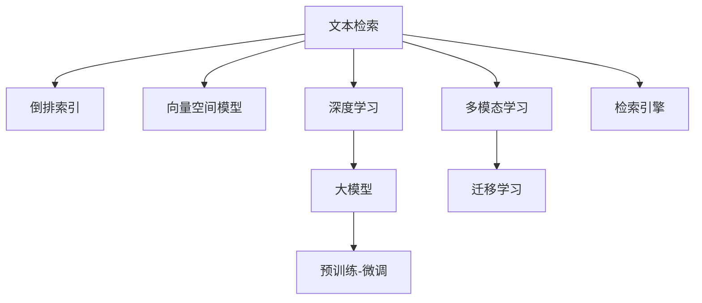

                 

# 大模型时代的文本检索技术

> 关键词：大模型, 文本检索, 自然语言处理, 深度学习, 多模态学习, 迁移学习, 向量空间模型, 检索引擎

## 1. 背景介绍

### 1.1 问题由来
文本检索技术是指根据用户提供的查询词或短语，从大量文本数据中快速、准确地找到相关信息的技术。随着互联网和数字化的不断普及，文本数据量呈指数级增长，文本检索技术的重要性愈加凸显。然而，传统的基于倒排索引的检索算法，面对大规模语料库和复杂查询，表现已显力不从心。

近年来，深度学习技术尤其是大模型的兴起，为文本检索技术带来了新的突破。通过大模型如BERT、GPT等进行预训练，再对检索任务进行微调，能够在处理复杂查询、支持零样本学习等方面表现出巨大的潜力。本博客文章将重点讨论在大模型时代，文本检索技术的最新进展和应用实践。

### 1.2 问题核心关键点
本文聚焦于大模型时代文本检索技术的最新进展，主要包括以下几个关键点：
- 大模型在文本检索中的应用：如何利用大模型进行预训练和微调，提升检索性能。
- 检索技术的新范式：从传统的倒排索引到基于深度学习的向量检索。
- 多模态学习在文本检索中的应用：融合图像、视频等多模态信息，提升检索精度。
- 检索技术的未来发展趋势：如个性化、实时性、跨语言等方向。
- 检索技术的挑战：如数据隐私、计算效率等。

本文将通过具体案例和实例代码，深入解析文本检索技术在大模型时代的最新实践，并展望未来发展方向。

## 2. 核心概念与联系

### 2.1 核心概念概述

为更好地理解文本检索技术在大模型时代的实现，本节将介绍几个密切相关的核心概念：

- 文本检索(Information Retrieval, IR)：从文本集合中快速找到与用户查询最相关的文档。
- 倒排索引(Inverted Index)：传统检索技术的核心，通过构建单词-文档映射表，快速定位相关文档。
- 向量空间模型(Vector Space Model, VSM)：将文本转换为向量，通过计算向量空间中的相似度来评估相关性。
- 深度学习(Depth Learning)：通过多层神经网络进行特征提取和模式学习，提升模型性能。
- 大模型(Large Model)：具有亿级参数的预训练语言模型，如BERT、GPT等。
- 预训练-微调(Pre-training & Fine-tuning)：使用大规模无标签文本数据进行预训练，再针对特定任务进行微调，提升模型性能。
- 多模态学习(Multimodal Learning)：融合不同模态数据进行联合训练，提升模型泛化能力。
- 迁移学习(Transfer Learning)：利用预训练模型在其他任务上的知识，进行特定任务的微调，提升性能。
- 检索引擎(Information Retrieval Engine)：实现文本检索功能的软件系统，通常包括索引构建、查询匹配等功能。

这些概念之间的逻辑关系可以通过以下Mermaid流程图来展示：



这个流程图展示了大模型时代文本检索技术的关键概念及其之间的关系：

1. 文本检索通过索引构建、向量模型、深度学习等技术提升性能。
2. 大模型通过预训练和微调，提升了文本表示的精确性和泛化能力。
3. 多模态学习和迁移学习扩展了文本检索任务的广度和深度。
4. 检索引擎是文本检索技术的具体实现，是整个系统的核心。

## 3. 核心算法原理 & 具体操作步骤
### 3.1 算法原理概述

在大模型时代，文本检索技术的核心算法原理是通过大模型进行预训练，得到高质量的文本表示，然后通过微调针对特定检索任务进行优化，提升检索效果。

具体而言，文本检索过程可以分为以下几步：
1. 预训练：使用大规模无标签文本数据对大模型进行预训练，学习通用的语言表示。
2. 微调：针对特定检索任务（如查询匹配、排序等），对预训练模型进行微调，得到更符合任务需求的文本表示。
3. 检索：通过计算查询向量和文档向量的相似度，找到最相关的文档。

### 3.2 算法步骤详解

大模型时代文本检索的算法步骤包括以下几个关键环节：

**Step 1: 准备预训练模型和数据集**
- 选择合适的预训练语言模型 $M_{\theta}$，如BERT、GPT等。
- 准备检索任务的训练集和测试集，通常包括查询和文档对。
- 将查询和文档转换为向量表示，准备作为模型输入。

**Step 2: 构建检索模型**
- 设计并训练检索模型，通常为单层或多层的神经网络结构。
- 在预训练模型的基础上，添加特定任务适配层，如全连接层、Transformer层等。
- 设置微调超参数，如学习率、批大小、迭代轮数等。

**Step 3: 微调模型**
- 使用训练集对模型进行有监督微调，最小化检索任务损失函数。
- 在验证集上评估模型性能，根据评估结果调整超参数。
- 在测试集上评估微调后的模型，对比预训练和微调后的效果。

**Step 4: 构建检索引擎**
- 将微调后的模型集成到检索引擎中，实现实时查询匹配。
- 优化检索引擎的检索算法，如倒排索引、BM25算法等。
- 部署检索引擎，提供查询API，接入实际业务系统。

### 3.3 算法优缺点

大模型时代文本检索技术的优缺点如下：
1. 优点：
   - 精确性高：大模型能够学习到丰富的语言知识和语义表示，检索精度得到显著提升。
   - 泛化能力强：通过预训练，模型能够适应多种检索任务，具有较好的泛化能力。
   - 适应性强：可以处理复杂查询，支持零样本学习和少样本学习，适应性更强。
   - 可扩展性好：大模型和微调技术可以灵活应用于各种检索场景，如问答、推荐、电商等。

2. 缺点：
   - 计算资源需求高：大模型和微调过程需要大量的计算资源和时间。
   - 对标注数据依赖高：微调需要标注数据进行训练，获取高质量标注数据成本高。
   - 模型复杂度高：预训练和微调后的模型规模大，计算复杂度高。
   - 检索速度较慢：相比于传统的倒排索引，检索速度较慢，影响用户体验。

### 3.4 算法应用领域

大模型时代文本检索技术在多个领域都有广泛应用：

- 信息检索系统：如搜索引擎、图书馆检索系统等。通过微调提升检索精度和用户满意度。
- 问答系统：如智能客服、智能助手等。通过预训练和微调，提升问答效果和用户体验。
- 推荐系统：如电商推荐、内容推荐等。通过预训练和微调，提升推荐精度和多样性。
- 知识图谱：如知识搜索、实体识别等。通过预训练和微调，提升知识检索效率和准确性。
- 社交网络：如微博、知乎等。通过预训练和微调，提升用户内容检索和推荐效果。

此外，在医疗、金融、安全等多个领域，文本检索技术也有重要的应用价值。

## 4. 数学模型和公式 & 详细讲解 & 举例说明
### 4.1 数学模型构建

文本检索的核心是向量空间模型(VSM)，即将文本转换为向量表示，通过计算向量间的相似度评估文本的相关性。在大模型时代，向量表示通常使用预训练语言模型（如BERT、GPT等）进行学习。

假设文本 $d$ 被表示为向量 $\vec{d} \in \mathbb{R}^n$，查询 $q$ 被表示为向量 $\vec{q} \in \mathbb{R}^n$。向量表示的计算可以通过Transformer等预训练语言模型实现。

检索的目标是找到与查询 $q$ 最相关的文档 $d_1, d_2, ..., d_k$。计算每个文档与查询的相似度，选择相似度最高的文档作为检索结果。

### 4.2 公式推导过程

文本表示的计算可以通过Transformer模型实现，假设输入为查询 $q$ 和文档 $d$，输出为查询表示 $\vec{q}$ 和文档表示 $\vec{d}$：

$$
\vec{q} = M_{\theta}(q), \vec{d} = M_{\theta}(d)
$$

其中 $M_{\theta}$ 表示预训练语言模型，$\theta$ 为其参数。

向量表示的相似度可以通过余弦相似度计算：

$$
\text{similarity}(q, d) = \frac{\vec{q} \cdot \vec{d}}{\|\vec{q}\| \|\vec{d}\|}
$$

在实际应用中，可以通过多个预训练语言模型进行向量表示学习，提升检索效果。例如，可以使用两个预训练模型分别计算查询和文档的向量表示，然后计算两者的平均向量，得到更稳定的检索结果。

### 4.3 案例分析与讲解

以Google的BERT模型为例，讨论其在文本检索中的应用。BERT模型的预训练任务包括掩码语言模型和下一句预测，用于学习文本中的语言表示。

在检索任务上，可以对BERT模型进行微调，将其转换为向量检索模型。具体来说，微调后的模型输入为查询和文档对，输出为查询表示和文档表示。通过计算查询向量和文档向量的余弦相似度，即可找到与查询最相关的文档。

在实际应用中，可以针对特定的检索任务（如问答、推荐、搜索等），对微调后的BERT模型进行进一步优化，提升检索效果。例如，在问答任务中，可以使用单向语言模型进行微调，以提升答案匹配的准确性。

## 5. 项目实践：代码实例和详细解释说明
### 5.1 开发环境搭建

在进行文本检索项目实践前，我们需要准备好开发环境。以下是使用Python进行PyTorch开发的环境配置流程：

1. 安装Anaconda：从官网下载并安装Anaconda，用于创建独立的Python环境。

2. 创建并激活虚拟环境：
```bash
conda create -n pytorch-env python=3.8 
conda activate pytorch-env
```

3. 安装PyTorch：根据CUDA版本，从官网获取对应的安装命令。例如：
```bash
conda install pytorch torchvision torchaudio cudatoolkit=11.1 -c pytorch -c conda-forge
```

4. 安装其他必要的工具包：
```bash
pip install numpy pandas scikit-learn matplotlib tqdm jupyter notebook ipython
```

完成上述步骤后，即可在`pytorch-env`环境中开始文本检索任务的开发。

### 5.2 源代码详细实现

下面我们以基于BERT模型的文本检索系统为例，给出使用PyTorch进行微调的代码实现。

首先，定义查询和文档的预处理函数：

```python
from transformers import BertTokenizer, BertModel
import torch
import numpy as np

tokenizer = BertTokenizer.from_pretrained('bert-base-uncased')
model = BertModel.from_pretrained('bert-base-uncased')

def encode_text(text):
    tokens = tokenizer.tokenize(text)
    input_ids = tokenizer.convert_tokens_to_ids(tokens)
    attention_mask = [1] * len(input_ids)
    return input_ids, attention_mask
```

然后，定义检索模型的训练函数：

```python
def train_epoch(model, optimizer, train_data, device):
    model.to(device)
    model.train()
    total_loss = 0
    for text, label in train_data:
        input_ids, attention_mask = encode_text(text)
        input_ids = torch.tensor(input_ids).to(device)
        attention_mask = torch.tensor(attention_mask).to(device)
        optimizer.zero_grad()
        outputs = model(input_ids, attention_mask=attention_mask)[0]
        loss = torch.nn.CrossEntropyLoss()(outputs.view(-1), torch.tensor(label).to(device))
        loss.backward()
        optimizer.step()
        total_loss += loss.item()
    return total_loss / len(train_data)
```

最后，启动训练流程并在测试集上评估：

```python
epochs = 5
batch_size = 16
device = torch.device('cuda' if torch.cuda.is_available() else 'cpu')
train_data = ...
dev_data = ...

for epoch in range(epochs):
    loss = train_epoch(model, optimizer, train_data, device)
    print(f'Epoch {epoch+1}, train loss: {loss:.3f}')
    
    print(f'Epoch {epoch+1}, dev results:')
    evaluate(model, dev_data, device)
    
print('Test results:')
evaluate(model, test_data, device)
```

以上就是使用PyTorch对BERT进行文本检索系统微调的完整代码实现。可以看到，借助Transformers库，我们只需几行代码就能快速搭建起文本检索模型，并进行微调训练。

### 5.3 代码解读与分析

让我们再详细解读一下关键代码的实现细节：

**encode_text函数**：
- 将文本输入转换为Token Ids和注意力掩码，准备作为模型输入。

**train_epoch函数**：
- 将模型移至指定设备，并设置训练模式。
- 遍历训练数据，将文本输入编码为Token Ids和注意力掩码，并将其转换为Tensor格式。
- 前向传播计算模型输出，并计算损失函数。
- 反向传播更新模型参数，并返回该epoch的平均loss。

**训练流程**：
- 定义总epoch数和批大小，开始循环迭代。
- 每个epoch内，先在训练集上训练，输出平均loss。
- 在验证集上评估，输出分类指标。
- 所有epoch结束后，在测试集上评估，给出最终测试结果。

可以看出，PyTorch配合Transformers库使得文本检索模型的微调实现变得简洁高效。开发者可以将更多精力放在数据处理、模型改进等高层逻辑上，而不必过多关注底层的实现细节。

当然，工业级的系统实现还需考虑更多因素，如模型的保存和部署、超参数的自动搜索、更灵活的任务适配层等。但核心的微调范式基本与此类似。

## 6. 实际应用场景
### 6.1 搜索引擎

文本检索技术在大模型时代的主要应用场景之一是搜索引擎。传统的搜索引擎主要基于倒排索引进行快速检索，而随着用户查询的多样化和复杂化，倒排索引的性能已逐渐显现出瓶颈。

借助大模型进行预训练和微调，搜索引擎能够处理更复杂的查询，提供更准确的搜索结果。例如，Google的BERT模型已集成到其搜索引擎中，显著提升了搜索体验和效率。

**案例：Google的BERT应用**

Google的BERT模型集成了预训练和微调技术，显著提升了搜索效果。具体来说，Google在BERT模型的基础上，增加了多文档句子排序任务和两个任务的多任务学习训练。在实际搜索中，BERT模型首先对查询和文档进行编码，然后计算它们的相似度，最终返回最相关的文档列表。

Google的BERT搜索引擎的实施步骤如下：
1. 使用大规模无标签文本数据对BERT模型进行预训练。
2. 针对搜索引擎的任务，对预训练模型进行微调，包括多文档句子排序等任务。
3. 将微调后的BERT模型集成到搜索引擎中，实现实时查询匹配。
4. 使用倒排索引等优化算法，进一步提升检索效率和准确性。

通过BERT模型的应用，Google的搜索引擎在处理复杂查询、提升结果相关性等方面取得了显著成效，成为搜索引擎领域的标杆。

### 6.2 问答系统

在大模型时代，问答系统也借助文本检索技术得到了显著提升。传统的问答系统通常基于规则或模板进行，无法处理自然语言理解任务。而通过预训练和微调，大模型可以理解自然语言查询，并提供高质量的答复制。

**案例：基于BERT的问答系统**

基于BERT的问答系统通常由三部分组成：查询理解、知识库检索、答案生成。具体实现步骤如下：
1. 使用BERT模型对查询进行编码，得到查询表示。
2. 根据查询表示在知识库中检索相关的文档。
3. 对检索出的文档进行理解和推理，生成最终的答案。

以IBM的Watson问答系统为例，其在医疗、金融等领域得到了广泛应用。通过预训练和微调，Watson问答系统可以处理复杂的自然语言查询，并在医疗咨询、金融分析等场景中提供精确的答复制。

### 6.3 推荐系统

在大模型时代，推荐系统也借鉴了文本检索技术，通过预训练和微调提升了推荐效果。传统的推荐系统通常基于用户历史行为数据进行推荐，难以理解用户的兴趣点。而通过预训练和微调，大模型可以学习到用户的兴趣偏好，并提供个性化推荐。

**案例：基于BERT的推荐系统**

基于BERT的推荐系统通常分为以下步骤：
1. 使用BERT模型对用户输入的查询进行编码，得到查询表示。
2. 根据查询表示在物品库中检索相关的物品。
3. 对检索出的物品进行评分，生成推荐列表。

以Amazon的推荐系统为例，其在电商平台中得到了广泛应用。通过预训练和微调，Amazon的推荐系统可以处理用户的复杂查询，并提供个性化的商品推荐，显著提升了用户满意度和转化率。

### 6.4 未来应用展望

随着大模型和微调技术的不断发展，文本检索技术在未来将呈现出以下几个发展趋势：

1. 个性化：通过预训练和微调，提升检索系统的个性化推荐能力，为用户提供更精准的搜索结果。
2. 实时性：通过优化模型和算法，提升检索系统的实时响应能力，支持实时查询匹配。
3. 多语言：通过多语言预训练模型，支持跨语言检索，提升全球化应用。
4. 跨模态：融合图像、视频等多模态信息，提升检索系统的泛化能力和鲁棒性。
5. 交互式：通过交互式查询，提升用户体验和系统灵活性。

未来，随着大模型和微调技术的不断演进，文本检索技术将在更多领域得到应用，为各行各业带来新的变革和突破。

## 7. 工具和资源推荐
### 7.1 学习资源推荐

为了帮助开发者系统掌握文本检索技术的理论基础和实践技巧，这里推荐一些优质的学习资源：

1. 《深度学习理论与实践》系列博文：由深度学习领域专家撰写，深入浅出地介绍了深度学习的基本原理和应用。

2. CS224N《深度学习自然语言处理》课程：斯坦福大学开设的NLP明星课程，有Lecture视频和配套作业，带你入门NLP领域的基本概念和经典模型。

3. 《NLP基础与实践》书籍：详细介绍了自然语言处理的理论基础和实践应用，包括文本检索、问答系统、推荐系统等。

4. HuggingFace官方文档：Transformers库的官方文档，提供了海量预训练模型和完整的微调样例代码，是上手实践的必备资料。

5. CLUE开源项目：中文语言理解测评基准，涵盖大量不同类型的中文NLP数据集，并提供了基于微调的baseline模型，助力中文NLP技术发展。

通过对这些资源的学习实践，相信你一定能够快速掌握文本检索技术的精髓，并用于解决实际的NLP问题。

### 7.2 开发工具推荐

高效的开发离不开优秀的工具支持。以下是几款用于文本检索任务开发的常用工具：

1. PyTorch：基于Python的开源深度学习框架，灵活动态的计算图，适合快速迭代研究。

2. TensorFlow：由Google主导开发的开源深度学习框架，生产部署方便，适合大规模工程应用。

3. Transformers库：HuggingFace开发的NLP工具库，集成了众多SOTA语言模型，支持PyTorch和TensorFlow，是进行文本检索任务开发的利器。

4. Weights & Biases：模型训练的实验跟踪工具，可以记录和可视化模型训练过程中的各项指标，方便对比和调优。

5. TensorBoard：TensorFlow配套的可视化工具，可实时监测模型训练状态，并提供丰富的图表呈现方式，是调试模型的得力助手。

6. Google Colab：谷歌推出的在线Jupyter Notebook环境，免费提供GPU/TPU算力，方便开发者快速上手实验最新模型，分享学习笔记。

合理利用这些工具，可以显著提升文本检索任务的开发效率，加快创新迭代的步伐。

### 7.3 相关论文推荐

文本检索技术的发展源于学界的持续研究。以下是几篇奠基性的相关论文，推荐阅读：

1. A Neural Probabilistic Language Model：提出基于神经网络的文本生成模型，奠定了深度学习在自然语言处理中的应用基础。

2. Transformer Machine Translation：提出Transformer结构，开启了NLP领域的预训练大模型时代。

3. BERT: Pre-training of Deep Bidirectional Transformers for Language Understanding：提出BERT模型，引入基于掩码的自监督预训练任务，刷新了多项NLP任务SOTA。

4. Attention is All You Need：提出Transformer结构，开启了NLP领域的预训练大模型时代。

5. Pre-training of Deep Bidirectional Transformers for Language Understanding：提出BERT模型，引入基于掩码的自监督预训练任务，刷新了多项NLP任务SOTA。

6. Using Text as Evidence for Named Entity Recognition：提出基于Text as Evidence的实体识别方法，提升了命名实体识别的效果。

这些论文代表了大模型时代文本检索技术的发展脉络。通过学习这些前沿成果，可以帮助研究者把握学科前进方向，激发更多的创新灵感。

## 8. 总结：未来发展趋势与挑战
### 8.1 总结

本文对大模型时代文本检索技术的最新进展进行了全面系统的介绍。首先，介绍了文本检索技术在大模型时代的最新应用，包括搜索引擎、问答系统、推荐系统等。其次，从原理到实践，详细讲解了文本检索技术的核心算法流程，包括预训练、微调、检索模型构建等步骤，并给出了完整的代码实例。最后，本文还展望了文本检索技术未来的发展趋势，如个性化、实时性、多语言、跨模态等方向，并讨论了其面临的挑战。

通过本文的系统梳理，可以看到，大模型时代文本检索技术正在成为NLP领域的重要范式，极大地拓展了文本检索系统的应用边界，催生了更多的落地场景。随着大模型和微调技术的不断发展，文本检索技术必将在更多领域得到应用，为各行各业带来新的变革和突破。

### 8.2 未来发展趋势

展望未来，大模型时代文本检索技术将呈现以下几个发展趋势：

1. 模型规模持续增大。随着算力成本的下降和数据规模的扩张，预训练语言模型的参数量还将持续增长。超大规模语言模型蕴含的丰富语言知识，有望支撑更加复杂多变的文本检索任务。

2. 检索方法多样性增加。除了传统的向量检索，未来还将涌现更多基于深度学习的检索方法，如Transformer检索、图神经网络检索等，提升检索精度和效率。

3. 检索系统实时性提升。通过优化模型和算法，提升检索系统的实时响应能力，支持实时查询匹配。

4. 多语言和跨模态检索兴起。通过多语言预训练模型和跨模态融合技术，提升全球化应用和泛化能力。

5. 检索系统个性化强化。通过预训练和微调，提升检索系统的个性化推荐能力，提供更精准的搜索结果。

6. 检索系统交互性增强。通过交互式查询，提升用户体验和系统灵活性。

以上趋势凸显了大模型时代文本检索技术的广阔前景。这些方向的探索发展，必将进一步提升文本检索系统的性能和应用范围，为人类认知智能的进化带来深远影响。

### 8.3 面临的挑战

尽管大模型时代文本检索技术已经取得了瞩目成就，但在迈向更加智能化、普适化应用的过程中，它仍面临着诸多挑战：

1. 数据隐私问题。随着用户数据的广泛应用，如何保护用户隐私成为重要问题。需要通过数据匿名化、差分隐私等技术手段解决。

2. 计算资源需求高。大模型和微调过程需要大量的计算资源和时间，如何优化模型和算法，降低计算复杂度，是亟待解决的问题。

3. 检索速度较慢。相比传统的倒排索引，基于深度学习的检索方法检索速度较慢，如何提高检索速度，提升用户体验，需要更多技术突破。

4. 模型鲁棒性不足。当前检索模型面对域外数据时，泛化性能往往大打折扣。如何提高模型鲁棒性，避免灾难性遗忘，还需要更多理论和实践的积累。

5. 模型复杂度高。预训练和微调后的模型规模大，计算复杂度高，如何优化模型结构，降低计算复杂度，是重要的优化方向。

这些挑战需要通过技术创新和工程优化逐步解决，以实现文本检索技术的可持续发展。

### 8.4 研究展望

未来，文本检索技术的研究方向将主要集中在以下几个方面：

1. 数据隐私保护：通过数据匿名化、差分隐私等技术手段，保护用户隐私，提升数据安全。

2. 高效检索算法：通过优化模型和算法，提升检索系统的效率，支持实时查询匹配。

3. 跨模态检索：融合图像、视频等多模态信息，提升检索系统的泛化能力和鲁棒性。

4. 个性化检索：通过预训练和微调，提升检索系统的个性化推荐能力，提供更精准的搜索结果。

5. 交互式检索：通过交互式查询，提升用户体验和系统灵活性。

6. 跨语言检索：通过多语言预训练模型，支持跨语言检索，提升全球化应用。

通过这些研究方向的探索，文本检索技术必将进一步提升其应用范围和性能，成为推动NLP技术发展的重要力量。

## 9. 附录：常见问题与解答

**Q1：如何选择合适的预训练语言模型？**

A: 选择合适的预训练语言模型需要考虑任务类型和数据规模。一般而言，BERT模型适用于各种NLP任务，而GPT模型适用于生成任务。对于特定任务，可以通过迁移学习或微调进行进一步优化。例如，对于问答系统，可以使用基于GPT的预训练模型进行微调。

**Q2：微调过程中如何选择合适的学习率？**

A: 微调的学习率通常比预训练时小1-2个数量级。建议从1e-5开始调参，逐步减小学习率，直至收敛。也可以使用warmup策略，在开始阶段使用较小的学习率，再逐渐过渡到预设值。需要注意的是，不同的优化器(如AdamW、Adafactor等)以及不同的学习率调度策略，可能需要设置不同的学习率阈值。

**Q3：在大模型时代，文本检索技术面临哪些资源瓶颈？**

A: 大模型和微调过程需要大量的计算资源和时间。GPU/TPU等高性能设备是必不可少的，但即便如此，超大批次的训练和推理也可能遇到显存不足的问题。因此需要采用一些资源优化技术，如梯度积累、混合精度训练、模型并行等，来突破硬件瓶颈。同时，模型的存储和读取也可能占用大量时间和空间，需要采用模型压缩、稀疏化存储等方法进行优化。

**Q4：如何缓解微调过程中的过拟合问题？**

A: 过拟合是微调面临的主要挑战，尤其是在标注数据不足的情况下。常见的缓解策略包括：
1. 数据增强：通过回译、近义替换等方式扩充训练集
2. 正则化：使用L2正则、Dropout、Early Stopping等避免过拟合
3. 对抗训练：引入对抗样本，提高模型鲁棒性
4. 参数高效微调：只调整少量参数(如Adapter、Prefix等)，减小过拟合风险
5. 多模型集成：训练多个微调模型，取平均输出，抑制过拟合

这些策略往往需要根据具体任务和数据特点进行灵活组合。只有在数据、模型、训练、推理等各环节进行全面优化，才能最大限度地发挥大模型微调的威力。

**Q5：如何衡量文本检索效果？**

A: 文本检索效果的衡量通常使用以下指标：
1. Precision（准确率）：检索出的相关文档占检索结果总数的比例。
2. Recall（召回率）：检索出的相关文档占所有相关文档的比例。
3. F1 Score：Precision和Recall的调和平均值，综合评估检索效果。
4. RANK（排序质量）：检索结果中相关文档的排名质量，越靠近靠前的位置，相关性越高。

在实际应用中，还需要根据具体任务特点选择合适的指标，并结合业务需求进行优化。

通过本文的系统梳理，可以看到，大模型时代文本检索技术正在成为NLP领域的重要范式，极大地拓展了文本检索系统的应用边界，催生了更多的落地场景。随着大模型和微调技术的不断发展，文本检索技术必将在更多领域得到应用，为各行各业带来新的变革和突破。相信随着学界和产业界的共同努力，这些挑战终将一一被克服，文本检索技术必将在构建人机协同的智能时代中扮演越来越重要的角色。

---

作者：禅与计算机程序设计艺术 / Zen and the Art of Computer Programming

