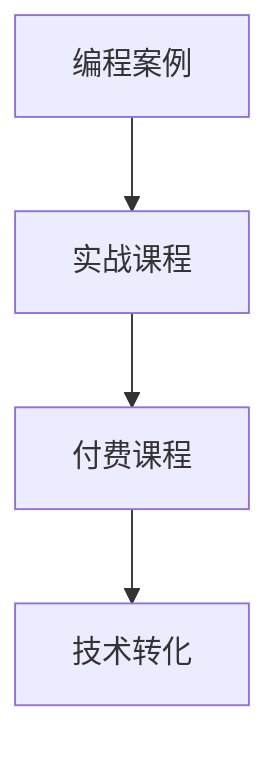

                 

# 如何将编程案例转化为付费实战课程

> 关键词：编程案例,实战课程,付费,技术转化

## 1. 背景介绍

在快速发展的互联网时代，编程技能成为了一种不可或缺的核心能力。无论是IT专业人士还是其他行业的从业者，掌握编程技能都成为了提升竞争力的重要手段。然而，编程技能的学习往往复杂而困难，许多人即使具备编程基础知识，也难以系统地掌握和应用各种技术。为了更好地帮助学习者掌握编程技能，将编程案例转化为可操作的实战课程变得尤为重要。本文将探讨如何将编程案例成功转化为付费实战课程，帮助学习者更好地掌握和应用编程技能。

## 2. 核心概念与联系

### 2.1 核心概念概述

为了更好地理解如何将编程案例转化为付费实战课程，本节将介绍几个关键概念：

- **编程案例**：即一个具体的编程问题，涉及特定的编程语言、工具和环境。这类问题往往来源于实际开发中的常见场景，能够帮助学习者掌握具体的编程技能。
- **实战课程**：指的是以解决实际问题为目的的编程学习课程。这类课程注重实践操作，通过逐步引导学习者解决具体问题，从而掌握相关编程技术。
- **付费课程**：指通过收费方式提供的学习资源，通常包括课程内容、视频讲解、作业练习等。付费课程具有较高的学习质量和持续更新的内容。
- **技术转化**：指的是将技术原理、工具使用和编程技巧等转化为易于学习者理解与应用的知识体系的过程。这一过程需要设计合理的课程结构，使用清晰的教学方法和丰富的示例。

### 2.2 核心概念联系

将这些关键概念联系起来，可以看出：编程案例通过转化为实战课程，再以付费的形式提供给学习者，是一个完整的技术转化过程。该过程不仅帮助学习者掌握具体的编程技能，还能提升其解决实际问题的能力。以下是这些概念之间的逻辑关系：



这一流程图展示了从编程案例到付费实战课程的转化过程，其中技术转化是这一过程的核心。

## 3. 核心算法原理 & 具体操作步骤

### 3.1 算法原理概述

将编程案例转化为付费实战课程的算法原理，主要基于以下三点：

1. **需求分析**：首先，需要深入了解目标受众的需求，包括他们的知识背景、学习目标和预期效果。
2. **问题分解**：将复杂的编程案例分解为一系列小任务，逐步引导学习者解决这些问题。
3. **知识迁移**：通过将复杂问题转化为简单易懂的小任务，并逐步构建起整个问题的解法，帮助学习者实现知识的迁移和掌握。

### 3.2 算法步骤详解

将编程案例转化为付费实战课程的具体步骤包括以下几个方面：

**Step 1: 需求分析与课程设计**
- 深入了解目标受众的背景和需求，明确学习者的知识水平和学习目标。
- 设计课程大纲，将复杂的编程案例分解为若干小任务，确保每个任务都是可操作的。

**Step 2: 内容编写与视频制作**
- 编写课程内容，包括理论讲解、编程示例和实践练习。内容需要由浅入深，逐步引导学习者解决具体问题。
- 制作视频讲解，通过实际演示和代码解释，帮助学习者更好地理解编程案例。

**Step 3: 实践练习与作业设计**
- 设计实践练习，让学习者在实际操作中应用所学知识。
- 提供作业和项目，鼓励学习者进行进一步的实践和探索。

**Step 4: 测试评估与反馈优化**
- 设计测试和评估机制，评估学习者的学习效果。
- 收集学习者的反馈，持续优化课程内容和教学方法。

### 3.3 算法优缺点

将编程案例转化为付费实战课程具有以下优点：
1. **系统性**：通过系统化的课程设计，帮助学习者全面掌握编程技能。
2. **实践性强**：通过实际编程案例和实践练习，帮助学习者将知识转化为实际应用能力。
3. **持续更新**：随着技术的不断发展，课程内容可以持续更新，保持最新状态。

然而，这一过程也存在一些缺点：
1. **设计复杂**：需要深入分析目标受众和问题，设计合理的课程结构和内容，工作量较大。
2. **资源投入大**：课程设计、内容编写和视频制作都需要大量的资源和时间。
3. **效果难以量化**：学习效果受多种因素影响，难以通过单一指标进行评估。

### 3.4 算法应用领域

将编程案例转化为付费实战课程的方法，适用于各种编程技能的教学。无论是在线教育、线下培训还是企业内部培训，这一方法都能帮助学习者系统掌握编程技能，提升解决实际问题的能力。

## 4. 数学模型和公式 & 详细讲解 & 举例说明

### 4.1 数学模型构建

假设我们要将一个复杂的编程案例（例如构建一个简单的Web应用）转化为付费实战课程。我们可以将这个案例分解为若干小任务，每个任务对应一个或多个子问题，并通过数学模型来表示这些任务和子问题之间的关系。

以Web应用开发为例，我们可以将其分解为以下任务：
- 任务1：选择编程语言和框架
- 任务2：搭建Web服务器
- 任务3：设计数据库模型
- 任务4：编写业务逻辑代码
- 任务5：实现用户界面

### 4.2 公式推导过程

以任务3为例，设计数据库模型的数学模型如下：

假设我们需要设计一个包含用户、订单和商品的Web应用，其中用户可以创建订单，订单可以包含商品。我们可以将这一关系建模为实体-关系模型：

- 用户实体（User）：id, name, email
- 订单实体（Order）：id, user_id, product_id, order_date
- 商品实体（Product）：id, name, price

关系模型为：
- User --> Order：一对一关系
- Order --> Product：一对多关系

基于这一模型，我们可以设计相应的数据库表结构，并使用SQL语言进行数据操作。

### 4.3 案例分析与讲解

在实际的教学过程中，我们可以通过以下案例来讲解如何将编程案例转化为付费实战课程：

**案例**：构建一个简单的Web应用，包括用户登录、订单管理和商品展示等功能。

**步骤**：
1. 分析问题：需求分析，明确需要构建的功能模块。
2. 分解任务：将大问题分解为多个小任务，如搭建Web服务器、设计数据库模型、编写业务逻辑代码等。
3. 编写课程内容：为每个任务编写详细的课程内容，包括理论讲解和实践练习。
4. 制作视频讲解：录制视频，通过实际演示和代码解释，帮助学习者理解编程案例。
5. 设计实践练习：提供实践练习，让学习者在实际操作中应用所学知识。
6. 反馈优化：收集学习者的反馈，持续优化课程内容和教学方法。

## 5. 项目实践：代码实例和详细解释说明

### 5.1 开发环境搭建

在进行课程开发前，需要准备好开发环境。以下是使用Python进行Flask开发的环境配置流程：

1. 安装Anaconda：从官网下载并安装Anaconda，用于创建独立的Python环境。

2. 创建并激活虚拟环境：
```bash
conda create -n flask-env python=3.8 
conda activate flask-env
```

3. 安装Flask：
```bash
conda install flask
```

4. 安装需要的其他库：
```bash
pip install Flask-SQLAlchemy Flask-Login Flask-WTF Flask-Mail
```

完成上述步骤后，即可在`flask-env`环境中开始课程开发。

### 5.2 源代码详细实现

下面以构建一个简单的Web应用为例，展示Flask开发的代码实现。

首先，定义Flask应用和路由：

```python
from flask import Flask, render_template, request, redirect, url_for
from flask_sqlalchemy import SQLAlchemy

app = Flask(__name__)
app.config['SQLALCHEMY_DATABASE_URI'] = 'sqlite:///test.db'
db = SQLAlchemy(app)

class User(db.Model):
    id = db.Column(db.Integer, primary_key=True)
    name = db.Column(db.String(50))
    email = db.Column(db.String(50))

class Order(db.Model):
    id = db.Column(db.Integer, primary_key=True)
    user_id = db.Column(db.Integer, db.ForeignKey('user.id'))
    product_id = db.Column(db.Integer, db.ForeignKey('product.id'))
    order_date = db.Column(db.DateTime)

class Product(db.Model):
    id = db.Column(db.Integer, primary_key=True)
    name = db.Column(db.String(50))
    price = db.Column(db.Float)

@app.route('/')
def index():
    return render_template('index.html')

@app.route('/login', methods=['GET', 'POST'])
def login():
    if request.method == 'POST':
        user = User.query.filter_by(email=request.form['email']).first()
        if user and user.check_password(request.form['password']):
            session['user_id'] = user.id
            return redirect(url_for('index'))
    return render_template('login.html')

@app.route('/logout')
def logout():
    session.pop('user_id', None)
    return redirect(url_for('index'))
```

然后，定义模型和视图：

```python
from flask_login import LoginManager, login_user, logout_user, login_required, current_user

login_manager = LoginManager()
login_manager.init_app(app)

@login_manager.user_loader
def load_user(user_id):
    return User.query.get(int(user_id))

@app.route('/profile')
@login_required
def profile():
    orders = Order.query.filter_by(user_id=current_user.id).all()
    products = Product.query.all()
    return render_template('profile.html', orders=orders, products=products)

@app.route('/order', methods=['GET', 'POST'])
@login_required
def order():
    if request.method == 'POST':
        product_id = int(request.form['product_id'])
        product = Product.query.get(product_id)
        order = Order(user_id=current_user.id, product_id=product_id)
        db.session.add(order)
        db.session.commit()
        return redirect(url_for('index'))
    return render_template('order.html')
```

最后，启动应用：

```python
if __name__ == '__main__':
    app.run(debug=True)
```

以上就是使用Flask构建Web应用的完整代码实现。可以看到，通过Flask框架，我们可以快速搭建一个包含用户登录、订单管理和商品展示等功能的Web应用。

### 5.3 代码解读与分析

让我们再详细解读一下关键代码的实现细节：

**Flask应用和数据库设置**：
- 定义Flask应用和SQLAlchemy数据库连接，并在应用中初始化数据库。
- 定义User、Order和Product模型，用于存储用户、订单和商品信息。

**路由定义**：
- 定义`index`路由，用于显示主页内容。
- 定义`login`路由，用于处理用户登录请求。
- 定义`logout`路由，用于用户登出请求。
- 定义`profile`和`order`路由，用于展示用户订单和生成订单。

**登录与认证**：
- 使用Flask-Login模块进行用户认证，定义`login_manager`并初始化应用。
- 实现`load_user`函数，用于根据用户ID加载用户信息。
- 实现`login`和`logout`函数，分别处理用户登录和登出请求。

**视图功能**：
- 实现`profile`和`order`视图函数，用于展示用户订单和生成订单。
- 在`order`函数中，将用户订单保存到数据库，并跳转到主页。

## 6. 实际应用场景

### 6.1 在线教育

在线教育平台需要提供大量的编程课程，帮助学习者掌握各种编程技能。通过将编程案例转化为付费实战课程，在线教育平台能够提供系统化、实践性强的编程学习资源，提升学习者的学习效果。

例如，Udacity等在线教育平台通过构建各种实战课程，帮助学习者掌握Python、Java等编程技能，从而满足不同学习者的需求。

### 6.2 企业内部培训

企业需要定期为员工提供技术培训，提升其编程技能和业务能力。通过将编程案例转化为付费实战课程，企业内部培训能够提供高质量、个性化的编程学习资源，帮助员工快速掌握所需技能。

例如，Google等企业内部培训系统通过构建各种编程课程，帮助员工掌握Google的各项技术，提升其工作效率和创新能力。

### 6.3 自学与自组织学习

自学和自组织学习是现代社会中常见的学习方式。通过将编程案例转化为付费实战课程，自学者和自组织学习者能够获得系统化、实践性强的编程学习资源，提升其学习效果。

例如，Coursera等在线学习平台通过构建各种实战课程，帮助自学者和自组织学习者掌握编程技能，从而实现自我提升和职业发展。

### 6.4 未来应用展望

未来，随着编程技能的学习需求不断增加，将编程案例转化为付费实战课程的方法将得到更广泛的应用。以下几点是未来应用的展望：

1. **多样化课程形式**：未来的课程将不仅限于视频讲解和代码实现，还将包括更多的互动式学习工具，如在线练习平台、虚拟实验室等，提升学习者的实践能力和学习体验。
2. **个性化学习路径**：通过数据分析和机器学习技术，为不同学习者提供个性化的学习路径，帮助其更高效地掌握编程技能。
3. **跨平台学习**：未来的课程将支持多种平台和设备，如PC、平板、手机等，方便学习者随时随地进行学习。
4. **开放与共享**：未来的课程将更加开放和共享，通过开源社区和协作平台，促进知识的传播和交流，提升编程技能的学习效率。

## 7. 工具和资源推荐

### 7.1 学习资源推荐

为了帮助开发者系统掌握将编程案例转化为付费实战课程的理论基础和实践技巧，这里推荐一些优质的学习资源：

1. **《Flask Web开发实战》**：通过本书，学习者可以系统掌握Flask框架的使用方法，并了解如何将复杂的编程案例转化为实战课程。
2. **Udacity《Python编程基础》课程**：斯坦福大学教授所授课程，帮助学习者从零开始掌握Python编程技能，并了解如何将编程案例转化为实战课程。
3. **Coursera《软件开发生命周期》课程**：由密歇根大学教授所授课程，涵盖软件开发生命周期的各个阶段，帮助学习者系统掌握编程技能，并了解如何将编程案例转化为实战课程。
4. **《Python编程：从入门到实践》书籍**：通过本书，学习者可以系统掌握Python编程技能，并了解如何将编程案例转化为实战课程。
5. **GitHub编程案例库**：GitHub上的编程案例库提供了大量的编程案例和实战课程，帮助学习者快速了解各种编程技能，并了解如何将编程案例转化为实战课程。

通过对这些资源的学习实践，相信你一定能够快速掌握将编程案例转化为实战课程的精髓，并用于解决实际的编程问题。

### 7.2 开发工具推荐

高效的开发离不开优秀的工具支持。以下是几款用于将编程案例转化为实战课程开发的常用工具：

1. **Flask框架**：轻量级的Python Web开发框架，灵活易用，适合快速迭代研究。
2. **GitHub**：全球最大的开源社区，提供丰富的编程案例和实战课程，支持协作开发和版本控制。
3. **Jupyter Notebook**：交互式的编程学习工具，支持代码编写、执行和注释，方便开发者进行研究和学习。
4. **Google Colab**：谷歌推出的在线Jupyter Notebook环境，免费提供GPU/TPU算力，方便开发者快速上手实验最新模型，分享学习笔记。
5. **Visual Studio Code**：流行的代码编辑器，支持多种编程语言和插件，提供丰富的代码辅助工具。

合理利用这些工具，可以显著提升将编程案例转化为实战课程的开发效率，加快创新迭代的步伐。

### 7.3 相关论文推荐

将编程案例转化为实战课程的研究源于学界的持续研究。以下是几篇奠基性的相关论文，推荐阅读：

1. **《Web开发实战：Flask框架教程》**：介绍Flask框架的使用方法和最佳实践，帮助学习者快速掌握Flask框架，并了解如何将编程案例转化为实战课程。
2. **《Python编程实战：从入门到实践》**：介绍Python编程技能的实用技巧和方法，帮助学习者系统掌握Python编程技能，并了解如何将编程案例转化为实战课程。
3. **《软件开发生命周期：实践与案例》**：介绍软件开发生命周期的各个阶段，帮助学习者系统掌握软件开发方法，并了解如何将编程案例转化为实战课程。

这些论文代表了大规模编程案例转化为实战课程的发展脉络。通过学习这些前沿成果，可以帮助研究者把握学科前进方向，激发更多的创新灵感。

## 8. 总结：未来发展趋势与挑战

### 8.1 总结

本文对将编程案例转化为付费实战课程的方法进行了全面系统的介绍。首先阐述了编程案例转化为实战课程的背景和意义，明确了该方法在提升编程技能学习效果方面的独特价值。其次，从原理到实践，详细讲解了该方法的核心算法和具体操作步骤，给出了具体案例和代码实现。同时，本文还广泛探讨了该方法在在线教育、企业培训、自学与自组织学习等多个领域的应用前景，展示了该方法的应用潜力。此外，本文精选了相关学习资源和开发工具，力求为开发者提供全方位的技术指引。

通过本文的系统梳理，可以看到，将编程案例转化为实战课程的方法不仅有助于提升编程技能学习效果，还能促进编程技能在实际应用中的广泛应用。未来，伴随编程技能的学习需求不断增加，这一方法将得到更广泛的应用，进一步推动编程技能在各个领域的发展和应用。

### 8.2 未来发展趋势

展望未来，将编程案例转化为实战课程的方法将呈现以下几个发展趋势：

1. **智能化与个性化**：通过人工智能和大数据分析技术，为不同学习者提供个性化的学习路径和推荐课程，提升学习效果。
2. **跨平台与移动化**：未来的课程将支持多种平台和设备，如PC、平板、手机等，方便学习者随时随地进行学习。
3. **虚拟现实与增强现实**：通过虚拟现实和增强现实技术，为学习者提供沉浸式学习体验，提升学习效果。
4. **微课程与模块化学习**：未来的课程将更加模块化，方便学习者根据自身需求和时间安排进行学习，提升学习效率。

这些趋势将进一步提升将编程案例转化为实战课程的方法，使其成为更加高效、灵活和便捷的学习工具，为学习者提供更好的学习体验。

### 8.3 面临的挑战

尽管将编程案例转化为实战课程的方法已经取得了显著成果，但在实际应用中仍面临一些挑战：

1. **课程设计复杂**：需要深入分析目标受众和问题，设计合理的课程结构和内容，工作量较大。
2. **学习效果难以量化**：学习效果受多种因素影响，难以通过单一指标进行评估。
3. **资源投入大**：课程设计、内容编写和视频制作都需要大量的资源和时间。
4. **学习者需求多样**：不同学习者的需求和背景不同，需要提供多样化的学习资源和支持。

### 8.4 研究展望

为了应对这些挑战，未来的研究需要在以下几个方面寻求新的突破：

1. **自动化课程设计**：通过人工智能和大数据分析技术，自动化设计和优化课程结构，提升课程设计效率。
2. **智能评估与反馈**：引入智能评估和反馈机制，实时监测学习效果，并提供个性化的学习建议。
3. **混合学习模式**：结合线上和线下学习模式，提供多样化的学习资源和支持，提升学习效果。
4. **跨平台协作与共享**：通过开放协作平台和资源库，促进知识传播和共享，提升学习效果。

这些研究方向将进一步提升将编程案例转化为实战课程的方法，使其成为更加高效、灵活和便捷的学习工具，为学习者提供更好的学习体验。

## 9. 附录：常见问题与解答

**Q1: 如何将编程案例转化为实战课程？**

A: 将编程案例转化为实战课程的过程包括以下几个步骤：
1. 分析问题：明确问题的需求和目标。
2. 分解任务：将大问题分解为多个小任务，逐步引导学习者解决。
3. 编写课程内容：为每个任务编写详细的课程内容，包括理论讲解和实践练习。
4. 制作视频讲解：通过实际演示和代码解释，帮助学习者理解编程案例。
5. 设计实践练习：提供实践练习，让学习者在实际操作中应用所学知识。
6. 反馈优化：收集学习者的反馈，持续优化课程内容和教学方法。

**Q2: 如何将课程内容呈现给学习者？**

A: 课程内容可以通过多种方式呈现给学习者，如视频讲解、在线练习、互动问答等。为了提升学习效果，可以采用以下方法：
1. 视频讲解：通过实际演示和代码解释，帮助学习者理解编程案例。
2. 在线练习：提供在线练习平台，让学习者通过实际操作掌握编程技能。
3. 互动问答：通过互动问答平台，解答学习者的疑问，提供个性化的学习支持。

**Q3: 如何评估学习效果？**

A: 评估学习效果可以通过多种方式进行，如在线测试、作业提交、项目评估等。为了提升评估效果，可以采用以下方法：
1. 在线测试：通过在线测试平台，评估学习者的理论知识和实践能力。
2. 作业提交：通过作业提交平台，评估学习者的编程能力和解决问题的能力。
3. 项目评估：通过项目评估平台，评估学习者的实际项目应用能力和创新能力。

**Q4: 如何应对学习者需求的多样性？**

A: 应对学习者需求的多样性，可以采用以下方法：
1. 提供多样化的学习资源：如视频、文章、代码示例等，满足不同学习者的需求。
2. 设计个性化的学习路径：通过数据分析和机器学习技术，为不同学习者提供个性化的学习路径。
3. 提供多样化的学习支持：如在线咨询、辅导答疑等，提供个性化的学习支持。

**Q5: 如何提高课程的学习效果？**

A: 提高课程的学习效果，可以采用以下方法：
1. 系统化设计课程结构：通过系统化的课程设计，帮助学习者全面掌握编程技能。
2. 注重实践操作：通过实际编程案例和实践练习，帮助学习者将知识转化为实际应用能力。
3. 持续更新课程内容：随着技术的不断发展，课程内容可以持续更新，保持最新状态。

通过这些方法，可以提升将编程案例转化为实战课程的学习效果，帮助学习者更好地掌握和应用编程技能。

---

作者：禅与计算机程序设计艺术 / Zen and the Art of Computer Programming

