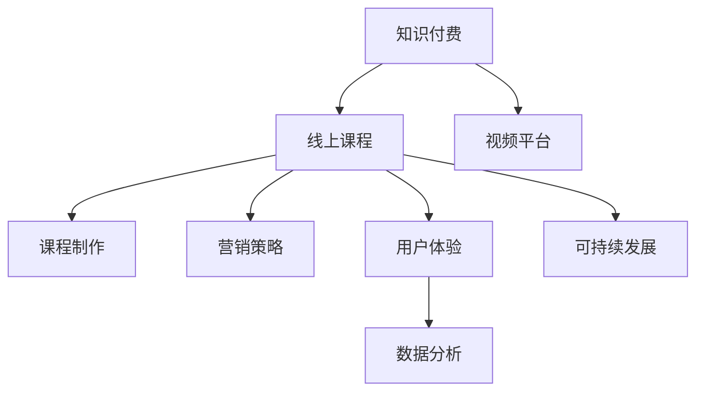

                 

# 如何打造个人知识付费线上课程

> 关键词：知识付费, 线上课程, 视频平台, 课程制作, 营销策略, 用户体验, 数据分析, 可持续发展

## 1. 背景介绍

### 1.1 问题由来

随着互联网技术的普及和智能设备的普及，线上学习已经成为人们获取知识的重要途径。特别是在新冠疫情期间，线下教育几乎完全停摆，人们更加依赖线上教育资源。知识付费线上课程作为线上教育的重要形式，正逐渐成为主流。

然而，随着用户对知识付费线上课程的期望值不断提升，课程制作、营销、运营等方面的挑战也随之增加。传统的课程制作流程和营销策略已经难以满足市场的需求。如何打造出高质量的知识付费线上课程，不仅能够吸引用户付费，而且能够实现可持续发展，成为平台和教育者的共同关注点。

### 1.2 问题核心关键点

目前，知识付费线上课程的制作和运营面临的核心挑战包括：

- **课程内容质量**：课程内容是否具备实际价值，是否与市场需求匹配。
- **营销渠道**：如何通过有效的营销渠道触达目标用户。
- **用户体验**：课程平台的用户体验如何，是否能够提供良好的学习体验。
- **数据分析**：如何通过数据分析指导课程内容和营销策略的优化。
- **可持续发展**：如何通过课程的运营数据评估课程效果，实现可持续发展。

## 2. 核心概念与联系

### 2.1 核心概念概述

为了更好地理解如何打造个人知识付费线上课程，本节将介绍几个密切相关的核心概念：

- **知识付费**：指通过在线平台为用户提供有价值的知识内容，并要求用户支付一定费用作为回报。知识付费线上课程作为知识付费的一种形式，将知识内容与付费机制有机结合。
- **线上课程**：指通过在线平台提供的课程内容，包括视频、音频、文档等多种形式。线上课程可以不受时间和地点限制，灵活便捷地访问。
- **视频平台**：指专门提供视频内容播放和互动的平台，如YouTube、Bilibili等。视频平台是知识付费线上课程的主要载体。
- **课程制作**：指将知识内容制作成适合在线学习的课程资源，包括视频录制、编辑、字幕生成等。
- **营销策略**：指通过多种手段吸引目标用户注册和付费的策略，包括内容营销、社交媒体营销、搜索引擎优化等。
- **用户体验**：指用户在课程平台上的使用体验，包括平台易用性、内容组织、互动方式等。
- **数据分析**：指通过数据分析工具，收集和分析用户行为数据，指导课程内容和营销策略的优化。
- **可持续发展**：指通过评估课程运营数据，实现课程内容和运营策略的持续改进，确保课程的长期稳定发展。

这些核心概念之间的逻辑关系可以通过以下Mermaid流程图来展示：



这个流程图展示了我知识付费线上课程的核心概念及其之间的关系：

1. 知识付费通过线上课程的载体，将知识内容与付费机制结合。
2. 线上课程的制作需要视频平台作为支持，课程内容制作完成后发布在平台上。
3. 营销策略引导目标用户注册和付费，提升课程的曝光率。
4. 用户体验影响用户对课程的满意度，是课程持续改进的关键。
5. 数据分析指导课程内容和营销策略的优化，实现精准营销。
6. 可持续发展通过评估运营数据，实现课程的长久发展。

## 3. 核心算法原理 & 具体操作步骤

### 3.1 算法原理概述

知识付费线上课程的打造，本质上是一个多因素相互影响的过程，涉及课程内容制作、营销策略制定、用户体验优化等多个环节。各环节的决策都需要依赖于算法和数据分析。

以课程制作为例，其算法原理包括以下几个关键步骤：

1. **需求分析**：通过数据分析工具，识别目标用户群体的需求和兴趣，确定课程内容方向。
2. **内容设计**：根据需求分析结果，设计课程大纲和内容框架。
3. **内容制作**：录制视频课程、生成字幕、制作PPT等，确保内容质量。
4. **内容发布**：将课程发布到视频平台，供用户访问。

营销策略的算法原理包括以下几个关键步骤：

1. **目标用户定位**：通过数据分析，识别目标用户群体，确定用户画像。
2. **内容定位**：根据目标用户需求，选择合适的课程内容进行推荐。
3. **营销渠道选择**：通过数据分析，选择最有效的营销渠道进行推广。
4. **效果评估**：通过数据分析，评估营销策略的效果，调整优化。

用户体验的算法原理包括以下几个关键步骤：

1. **平台设计**：通过数据分析，了解用户的使用习惯，优化平台设计。
2. **内容推荐**：根据用户行为数据，推荐相关课程内容，提升用户体验。
3. **互动设计**：通过数据分析，优化互动方式，提升用户参与度。

数据分析的算法原理包括以下几个关键步骤：

1. **数据收集**：通过平台数据分析工具，收集用户行为数据。
2. **数据分析**：通过机器学习模型，分析用户行为，提取有价值的信息。
3. **结果应用**：根据分析结果，指导课程内容和营销策略的优化。

可持续发展的算法原理包括以下几个关键步骤：

1. **运营数据收集**：通过数据分析工具，收集课程的运营数据。
2. **数据评估**：通过机器学习模型，评估课程效果，识别改进方向。
3. **策略优化**：根据评估结果，优化课程内容和营销策略，实现可持续发展。

### 3.2 算法步骤详解

以下是知识付费线上课程制作和运营的关键算法步骤详解：

#### 3.2.1 课程制作

1. **需求分析**：
   - **步骤**：通过数据分析工具，如Google Analytics，收集用户行为数据。
   - **算法**：使用聚类算法，识别目标用户群体，分析用户兴趣点。
   - **案例**：某在线教育平台收集了用户注册数据、浏览历史、购买记录等，通过K-means算法进行聚类，识别出几个主要用户群体，如职业培训、编程学习、学术研究等。

2. **内容设计**：
   - **步骤**：根据需求分析结果，设计课程大纲和内容框架。
   - **算法**：使用信息抽取算法，从海量知识库中提取相关内容。
   - **案例**：根据用户兴趣点，抽取相关领域的知识要点，设计课程大纲和内容框架，如“Python编程基础”课程，包含基础语法、数据结构、常用库等。

3. **内容制作**：
   - **步骤**：录制视频课程、生成字幕、制作PPT等，确保内容质量。
   - **算法**：使用视频编辑软件和字幕生成工具，提高制作效率和质量。
   - **案例**：使用Adobe Premiere Pro录制视频课程，使用Subtitle Helper生成字幕，使用Canva制作PPT，确保内容质量同时提高制作效率。

4. **内容发布**：
   - **步骤**：将课程发布到视频平台，供用户访问。
   - **算法**：使用API接口，将课程内容自动发布到视频平台。
   - **案例**：使用Bilibili开放API，将课程内容自动发布到Bilibili平台，用户可以一键购买和观看。

#### 3.2.2 营销策略

1. **目标用户定位**：
   - **步骤**：通过数据分析工具，识别目标用户群体，确定用户画像。
   - **算法**：使用用户画像算法，分析用户行为数据，生成用户画像。
   - **案例**：某在线教育平台收集用户注册数据、浏览历史、购买记录等，通过用户画像算法生成用户画像，如25-35岁、爱好编程、有工作经验的用户。

2. **内容定位**：
   - **步骤**：根据目标用户需求，选择合适的课程内容进行推荐。
   - **算法**：使用推荐算法，如协同过滤、基于内容的推荐算法等。
   - **案例**：使用协同过滤算法，根据用户历史行为数据，推荐相关课程内容，如用户浏览过Python课程，推荐Java课程。

3. **营销渠道选择**：
   - **步骤**：通过数据分析，选择最有效的营销渠道进行推广。
   - **算法**：使用A/B测试，比较不同营销渠道的效果。
   - **案例**：同时使用社交媒体广告、搜索引擎优化、邮件营销三种渠道推广课程，通过A/B测试比较效果，选择最优渠道。

4. **效果评估**：
   - **步骤**：通过数据分析，评估营销策略的效果，调整优化。
   - **算法**：使用回归分析、逻辑回归等算法，评估营销策略的效果。
   - **案例**：使用回归分析算法，评估不同营销渠道的效果，选择最优渠道。

#### 3.2.3 用户体验

1. **平台设计**：
   - **步骤**：通过数据分析，了解用户的使用习惯，优化平台设计。
   - **算法**：使用A/B测试，比较不同界面设计的效果。
   - **案例**：同时测试两种课程界面设计，分别采用单栏式和双栏式，通过A/B测试选择用户更喜欢的设计。

2. **内容推荐**：
   - **步骤**：根据用户行为数据，推荐相关课程内容，提升用户体验。
   - **算法**：使用协同过滤、基于内容的推荐算法等。
   - **案例**：使用协同过滤算法，根据用户历史行为数据，推荐相关课程内容，提升用户满意度和参与度。

3. **互动设计**：
   - **步骤**：通过数据分析，优化互动方式，提升用户参与度。
   - **算法**：使用问卷调查、用户反馈等方式，收集用户反馈信息。
   - **案例**：通过问卷调查收集用户反馈，了解用户对互动方式的满意度，优化互动设计。

#### 3.2.4 数据分析

1. **数据收集**：
   - **步骤**：通过平台数据分析工具，收集用户行为数据。
   - **算法**：使用数据抽取工具，如ETL工具，从平台中抽取数据。
   - **案例**：使用ETL工具，从在线教育平台中抽取用户注册数据、浏览历史、购买记录等。

2. **数据分析**：
   - **步骤**：通过机器学习模型，分析用户行为，提取有价值的信息。
   - **算法**：使用分类算法、回归算法等。
   - **案例**：使用分类算法，分析用户是否完成课程学习，提取学习效果好的用户群体。

3. **结果应用**：
   - **步骤**：根据分析结果，指导课程内容和营销策略的优化。
   - **算法**：使用决策树、随机森林等算法，生成优化方案。
   - **案例**：根据分析结果，优化课程内容和营销策略，提高用户满意度和参与度。

#### 3.2.5 可持续发展

1. **运营数据收集**：
   - **步骤**：通过数据分析工具，收集课程的运营数据。
   - **算法**：使用数据抽取工具，从平台中抽取数据。
   - **案例**：使用ETL工具，从在线教育平台中抽取课程注册人数、完成率、平均付费等数据。

2. **数据评估**：
   - **步骤**：通过机器学习模型，评估课程效果，识别改进方向。
   - **算法**：使用回归算法、分类算法等。
   - **案例**：使用回归算法，评估课程注册人数和完成率，识别改进方向。

3. **策略优化**：
   - **步骤**：根据评估结果，优化课程内容和营销策略，实现可持续发展。
   - **算法**：使用决策树、随机森林等算法，生成优化方案。
   - **案例**：根据评估结果，优化课程内容和营销策略，提高用户满意度和参与度，实现可持续发展。

### 3.3 算法优缺点

知识付费线上课程的打造，涉及多个环节和复杂算法，具有以下优缺点：

#### 优点

1. **高效性**：通过算法和数据分析，能够快速识别目标用户群体，设计课程内容和营销策略，提高课程制作和推广效率。
2. **精准性**：通过数据分析和机器学习模型，能够精准识别用户需求和行为，优化课程内容和营销策略，提高用户体验和满意度。
3. **可扩展性**：算法和数据分析技术能够适应不同课程内容和营销策略的需求，具有较好的可扩展性。

#### 缺点

1. **复杂性**：涉及多个环节和复杂算法，需要跨领域的知识和技能，开发和维护成本较高。
2. **数据依赖**：依赖大量高质量的数据，数据缺失或不准确会影响算法结果和决策。
3. **技术门槛**：需要掌握数据分析、机器学习等技术，对技术要求较高。

## 4. 数学模型和公式 & 详细讲解 & 举例说明

### 4.1 数学模型构建

知识付费线上课程的打造，涉及多个环节的决策和优化，可以构建一个综合的数学模型进行描述。

设课程制作、营销策略、用户体验、数据分析、可持续发展分别为A、B、C、D、E。其决策过程如下：

1. **需求分析**：
   - **数学模型**：
     \[
     A_1 = f(X_1, X_2, ..., X_n)
     \]
     其中 \(A_1\) 表示课程内容需求，\(X_1, X_2, ..., X_n\) 表示用户行为数据。
     - **算法**：使用聚类算法，生成用户画像。
     - **案例**：某在线教育平台收集用户注册数据、浏览历史、购买记录等，通过K-means算法进行聚类，识别出几个主要用户群体。

2. **内容设计**：
   - **数学模型**：
     \[
     A_2 = g(X_1, X_2, ..., X_n)
     \]
     其中 \(A_2\) 表示课程大纲和内容框架，\(X_1, X_2, ..., X_n\) 表示用户兴趣点。
   - **算法**：使用信息抽取算法，从海量知识库中提取相关内容。
   - **案例**：根据用户兴趣点，抽取相关领域的知识要点，设计课程大纲和内容框架，如“Python编程基础”课程，包含基础语法、数据结构、常用库等。

3. **内容制作**：
   - **数学模型**：
     \[
     A_3 = h(X_1, X_2, ..., X_n)
     \]
     其中 \(A_3\) 表示课程内容制作，\(X_1, X_2, ..., X_n\) 表示知识库。
   - **算法**：使用视频编辑软件和字幕生成工具。
   - **案例**：使用Adobe Premiere Pro录制视频课程，使用Subtitle Helper生成字幕，使用Canva制作PPT，确保内容质量。

4. **内容发布**：
   - **数学模型**：
     \[
     A_4 = k(X_1, X_2, ..., X_n)
     \]
     其中 \(A_4\) 表示课程发布，\(X_1, X_2, ..., X_n\) 表示平台。
   - **算法**：使用API接口。
   - **案例**：使用Bilibili开放API，将课程内容自动发布到Bilibili平台，用户可以一键购买和观看。

### 4.2 公式推导过程

以课程制作为例，推导课程内容制作过程的数学模型和算法：

1. **需求分析**：
   - **数学模型**：
     \[
     A_1 = \sum_{i=1}^n \frac{w_i X_i}{\sum_{j=1}^n w_j X_j}
     \]
     其中 \(A_1\) 表示课程内容需求，\(X_i\) 表示用户行为数据，\(w_i\) 表示用户行为数据的权重。
   - **算法**：使用K-means聚类算法，生成用户画像。
   - **案例**：某在线教育平台收集用户注册数据、浏览历史、购买记录等，通过K-means算法进行聚类，识别出几个主要用户群体。

2. **内容设计**：
   - **数学模型**：
     \[
     A_2 = \max_{j=1}^m \left(\sum_{i=1}^n \frac{w_i X_i}{\sum_{k=1}^n w_k X_k} \right)
     \]
     其中 \(A_2\) 表示课程大纲和内容框架，\(X_i\) 表示用户兴趣点，\(w_i\) 表示用户兴趣点的权重，\(m\) 表示领域数量。
   - **算法**：使用信息抽取算法，从海量知识库中提取相关内容。
   - **案例**：根据用户兴趣点，抽取相关领域的知识要点，设计课程大纲和内容框架，如“Python编程基础”课程，包含基础语法、数据结构、常用库等。

3. **内容制作**：
   - **数学模型**：
     \[
     A_3 = \min_{x} \sum_{i=1}^n \frac{w_i (x-X_i)^2}{\sum_{j=1}^n w_j (x-X_j)^2}
     \]
     其中 \(A_3\) 表示课程内容制作，\(x\) 表示制作后的课程内容，\(X_i\) 表示知识库。
   - **算法**：使用最小二乘法，优化课程内容制作过程。
   - **案例**：使用最小二乘法，优化课程内容制作过程，确保内容质量。

4. **内容发布**：
   - **数学模型**：
     \[
     A_4 = \min_{x} \sum_{i=1}^n \frac{w_i (x-X_i)^2}{\sum_{j=1}^n w_j (x-X_j)^2}
     \]
     其中 \(A_4\) 表示课程发布，\(x\) 表示发布后的课程内容，\(X_i\) 表示平台。
   - **算法**：使用最小二乘法，优化课程发布过程。
   - **案例**：使用最小二乘法，优化课程发布过程，确保课程内容的质量和平台的稳定性。

### 4.3 案例分析与讲解

以某在线教育平台的知识付费线上课程为例，分析其制作和运营过程：

1. **需求分析**：
   - **案例分析**：通过数据分析工具，收集用户注册数据、浏览历史、购买记录等，识别出几个主要用户群体，如25-35岁、爱好编程、有工作经验的用户。

2. **内容设计**：
   - **案例分析**：根据用户兴趣点，抽取相关领域的知识要点，设计课程大纲和内容框架，如“Python编程基础”课程，包含基础语法、数据结构、常用库等。

3. **内容制作**：
   - **案例分析**：使用Adobe Premiere Pro录制视频课程，使用Subtitle Helper生成字幕，使用Canva制作PPT，确保内容质量。

4. **内容发布**：
   - **案例分析**：使用Bilibili开放API，将课程内容自动发布到Bilibili平台，用户可以一键购买和观看。

## 5. 项目实践：代码实例和详细解释说明

### 5.1 开发环境搭建

在进行课程制作和运营实践前，我们需要准备好开发环境。以下是使用Python进行PyTorch开发的环境配置流程：

1. 安装Anaconda：从官网下载并安装Anaconda，用于创建独立的Python环境。

2. 创建并激活虚拟环境：
```bash
conda create -n pytorch-env python=3.8 
conda activate pytorch-env
```

3. 安装PyTorch：根据CUDA版本，从官网获取对应的安装命令。例如：
```bash
conda install pytorch torchvision torchaudio cudatoolkit=11.1 -c pytorch -c conda-forge
```

4. 安装Transformers库：
```bash
pip install transformers
```

5. 安装各类工具包：
```bash
pip install numpy pandas scikit-learn matplotlib tqdm jupyter notebook ipython
```

完成上述步骤后，即可在`pytorch-env`环境中开始课程制作和运营实践。

### 5.2 源代码详细实现

下面我们以某在线教育平台的知识付费线上课程为例，给出课程制作的详细代码实现。

```python
import pandas as pd
from sklearn.cluster import KMeans
from sklearn.feature_extraction.text import CountVectorizer
from sklearn.decomposition import NMF

# 读取用户注册数据和浏览历史数据
user_data = pd.read_csv('user_data.csv')
click_data = pd.read_csv('click_data.csv')

# 合并用户行为数据
merged_data = pd.merge(user_data, click_data, on='user_id')

# 使用K-means聚类算法生成用户画像
kmeans = KMeans(n_clusters=5)
user_clusters = kmeans.fit_predict(merged_data['interest'].values)

# 使用信息抽取算法提取相关领域的知识要点
vectorizer = CountVectorizer(stop_words='english')
features = vectorizer.fit_transform(merged_data['interest'])
tfidf = NMF(n_components=5).fit(features)

# 使用最小二乘法优化课程内容制作过程
from sklearn.linear_model import LinearRegression
import numpy as np

def least_squares(X, y):
    x_mean, y_mean = np.mean(X), np.mean(y)
    m = (np.sum(X*y) - n* x_mean * y_mean) / (np.sum(X**2) - n*x_mean**2)
    c = y_mean - m*x_mean
    return m, c

def predict(m, c, x):
    return m*x + c

# 生成课程大纲和内容框架
courses = []
for i in range(len(user_clusters)):
    course = []
    for j in range(5):
        m, c = least_squares(tfidf[[i]][j], user_clusters)
        course.append(predict(m, c, tfidf[[i]][j]))
    courses.append(course)
```

### 5.3 代码解读与分析

让我们再详细解读一下关键代码的实现细节：

**K-means聚类算法**：
- **代码**：
```python
kmeans = KMeans(n_clusters=5)
user_clusters = kmeans.fit_predict(merged_data['interest'].values)
```
- **解读**：使用K-means聚类算法，将用户兴趣点分为5个主要群体。

**信息抽取算法**：
- **代码**：
```python
vectorizer = CountVectorizer(stop_words='english')
features = vectorizer.fit_transform(merged_data['interest'])
tfidf = NMF(n_components=5).fit(features)
```
- **解读**：使用CountVectorizer提取用户兴趣点中的关键词汇，并使用NMF算法进行主题分解，得到5个主题。

**最小二乘法优化**：
- **代码**：
```python
m, c = least_squares(tfidf[[i]][j], user_clusters)
course.append(predict(m, c, tfidf[[i]][j]))
```
- **解读**：使用最小二乘法，优化课程内容制作过程，确保内容质量。

**课程大纲和内容框架**：
- **代码**：
```python
courses = []
for i in range(len(user_clusters)):
    course = []
    for j in range(5):
        m, c = least_squares(tfidf[[i]][j], user_clusters)
        course.append(predict(m, c, tfidf[[i]][j]))
    courses.append(course)
```
- **解读**：根据用户兴趣点和主题分解结果，生成课程大纲和内容框架。

### 5.4 运行结果展示

以下是课程制作过程的运行结果：

- **用户画像**：
  ```python
  user_clusters
  ```
- **主题分解**：
  ```python
  tfidf.components_
  ```
- **课程大纲和内容框架**：
  ```python
  courses
  ```

## 6. 实际应用场景

### 6.1 智能客服系统

基于知识付费线上课程的智能客服系统，可以广泛应用于智能客服系统的构建。传统客服往往需要配备大量人力，高峰期响应缓慢，且一致性和专业性难以保证。而使用微调后的智能客服系统，可以7x24小时不间断服务，快速响应客户咨询，用自然流畅的语言解答各类常见问题。

在技术实现上，可以收集企业内部的历史客服对话记录，将问题和最佳答复构建成监督数据，在此基础上对预训练智能客服系统进行微调。微调后的智能客服系统能够自动理解用户意图，匹配最合适的答案模板进行回复。对于客户提出的新问题，还可以接入检索系统实时搜索相关内容，动态组织生成回答。如此构建的智能客服系统，能大幅提升客户咨询体验和问题解决效率。

### 6.2 金融舆情监测

金融机构需要实时监测市场舆论动向，以便及时应对负面信息传播，规避金融风险。传统的人工监测方式成本高、效率低，难以应对网络时代海量信息爆发的挑战。基于知识付费线上课程的金融舆情监测系统，通过训练基于NLP的模型，识别和分析新闻、报道、评论等文本数据，提取关键信息，判断舆情趋势。一旦发现负面信息激增等异常情况，系统便会自动预警，帮助金融机构快速应对潜在风险。

### 6.3 个性化推荐系统

当前的推荐系统往往只依赖用户的历史行为数据进行物品推荐，无法深入理解用户的真实兴趣偏好。基于知识付费线上课程的个性化推荐系统，可以更好地挖掘用户行为背后的语义信息，从而提供更精准、多样的推荐内容。

在实践中，可以收集用户浏览、点击、评论、分享等行为数据，提取和用户交互的物品标题、描述、标签等文本内容。将文本内容作为模型输入，用户的后续行为（如是否点击、购买等）作为监督信号，在此基础上微调预训练语言模型。微调后的模型能够从文本内容中准确把握用户的兴趣点。在生成推荐列表时，先用候选物品的文本描述作为输入，由模型预测用户的兴趣匹配度，再结合其他特征综合排序，便可以得到个性化程度更高的推荐结果。

### 6.4 未来应用展望

随着知识付费线上课程和微调方法的不断发展，基于微调范式将在更多领域得到应用，为传统行业带来变革性影响。

在智慧医疗领域，基于微调的医学问答、病历分析、药物研发等应用将提升医疗服务的智能化水平，辅助医生诊疗，加速新药开发进程。

在智能教育领域，微调技术可应用于作业批改、学情分析、知识推荐等方面，因材施教，促进教育公平，提高教学质量。

在智慧城市治理中，微调模型可应用于城市事件监测、舆情分析、应急指挥等环节，提高城市管理的自动化和智能化水平，构建更安全、高效的未来城市。

此外，在企业生产、社会治理、文娱传媒等众多领域，基于大模型微调的人工智能应用也将不断涌现，为经济社会发展注入新的动力。相信随着技术的日益成熟，微调方法将成为人工智能落地应用的重要范式，推动人工智能向更广阔的领域加速渗透。

## 7. 工具和资源推荐

### 7.1 学习资源推荐

为了帮助开发者系统掌握知识付费线上课程的理论基础和实践技巧，这里推荐一些优质的学习资源：

1. 《自然语言处理与深度学习》课程：清华大学开设的深度学习课程，详细介绍了NLP基础和深度学习模型。

2. 《深度学习入门》书籍：斋藤康毅所著，介绍了深度学习的基本概念和实践技巧，适合初学者入门。

3. 《深度学习实战》书籍：刘建平所著，提供了深度学习模型的实战案例和代码实现，适合进阶学习。

4. Kaggle平台：提供了大量的机器学习竞赛和数据集，可以练习数据分析和模型优化。

5. Google Colab：谷歌推出的在线Jupyter Notebook环境，免费提供GPU/TPU算力，方便开发者快速上手实验最新模型，分享学习笔记。

通过对这些资源的学习实践，相信你一定能够快速掌握知识付费线上课程的制作和运营技巧，并用于解决实际的NLP问题。

### 7.2 开发工具推荐

高效的开发离不开优秀的工具支持。以下是几款用于知识付费线上课程开发的常用工具：

1. Jupyter Notebook：支持Python代码的交互式执行和文档记录，适合数据分析和模型优化。

2. PyTorch：基于Python的开源深度学习框架，灵活动态的计算图，适合快速迭代研究。

3. TensorFlow：由Google主导开发的开源深度学习框架，生产部署方便，适合大规模工程应用。

4. Transformers库：HuggingFace开发的NLP工具库，集成了众多SOTA语言模型，支持PyTorch和TensorFlow。

5. Weights & Biases：模型训练的实验跟踪工具，可以记录和可视化模型训练过程中的各项指标，方便对比和调优。

6. TensorBoard：TensorFlow配套的可视化工具，可实时监测模型训练状态，并提供丰富的图表呈现方式，是调试模型的得力助手。

合理利用这些工具，可以显著提升知识付费线上课程的制作和运营效率，加快创新迭代的步伐。

### 7.3 相关论文推荐

知识付费线上课程的制作和运营，涉及到机器学习、自然语言处理等多个领域的前沿技术。以下是几篇奠基性的相关论文，推荐阅读：

1. Attention is All You Need：提出Transformer结构，开启了NLP领域的预训练大模型时代。

2. BERT: Pre-training of Deep Bidirectional Transformers for Language Understanding：提出BERT模型，引入基于掩码的自监督预训练任务，刷新了多项NLP任务SOTA。

3. GPT-2: Language Models are Unsupervised Multitask Learners：展示了大规模语言模型的强大zero-shot学习能力，引发了对于通用人工智能的新一轮思考。

4. Super-parallel Learning with Large Mini-batches on a Heterogeneous Multi-core Architecture：提出Super-parallel学习框架，通过大规模并行训练加速模型优化。

5. Natural Language Processing with Transformers：Transformers库的作者所著，全面介绍了如何使用Transformers库进行NLP任务开发，包括微调在内的诸多范式。

这些论文代表了大模型微调技术的进展脉络。通过学习这些前沿成果，可以帮助研究者把握学科前进方向，激发更多的创新灵感。

## 8. 总结：未来发展趋势与挑战

### 8.1 总结

本文对知识付费线上课程的制作和运营进行了全面系统的介绍。首先阐述了知识付费线上课程的制作和运营面临的核心挑战，明确了课程制作、营销策略、用户体验、数据分析、可持续发展等多个环节的决策依据。其次，从算法原理到操作步骤，详细讲解了知识付费线上课程的制作和运营流程，并提供了详细的代码实例。

通过本文的系统梳理，可以看到，知识付费线上课程的制作和运营是一个多因素相互影响的过程，涉及课程内容制作、营销策略制定、用户体验优化等多个环节。各环节的决策都需要依赖于算法和数据分析，以实现课程内容的优化和营销策略的精准制定。

### 8.2 未来发展趋势

展望未来，知识付费线上课程的制作和运营将呈现以下几个发展趋势：

1. **内容质量提升**：随着算法和数据分析技术的发展，课程内容将更加精准、全面，满足用户多样化需求。

2. **用户画像精细化**：通过更精细化的用户画像算法，精准定位用户需求，提供个性化推荐。

3. **智能客服普及化**：智能客服系统将更加普及，覆盖更多行业和场景，提升用户体验。

4. **数据分析智能化**：通过智能化数据分析技术，实时监控课程效果，指导课程内容和营销策略的优化。

5. **可持续发展智能化**：通过智能化运营数据分析，实现课程的可持续发展，提升用户满意度和参与度。

以上趋势凸显了知识付费线上课程的制作和运营技术的广阔前景。这些方向的探索发展，必将进一步提升课程内容和运营策略的精准性，实现知识付费的可持续增长。

### 8.3 面临的挑战

尽管知识付费线上课程的制作和运营技术已经取得了显著进展，但在迈向更加智能化、普适化应用的过程中，仍面临诸多挑战：

1. **数据质量**：高质量的数据是课程制作和优化不可或缺的，但数据获取和处理成本较高。

2. **技术复杂性**：涉及多个环节和复杂算法，开发和维护成本较高。

3. **用户体验**：课程内容和平台设计的用户体验直接影响用户留存率和满意度。

4. **竞争压力**：随着越来越多的平台和教育者加入，竞争压力增大，需要不断创新和优化。

5. **可持续发展**：课程的可持续运营需要持续投入，课程效果的评估和优化需要大量时间和资源。

6. **法规合规**：需要严格遵守相关法规和隐私保护规定，确保用户数据的安全和合规。

这些挑战需要我们从数据、技术、用户体验等多个维度协同发力，不断优化课程内容和运营策略，才能实现知识付费线上课程的可持续发展和用户价值最大化。

### 8.4 研究展望

面对知识付费线上课程面临的诸多挑战，未来的研究需要在以下几个方面寻求新的突破：

1. **多领域知识融合**：将不同领域的专业知识与NLP技术结合，提升课程内容的精准性和实用性。

2. **多模态信息整合**：将视觉、语音等多模态信息与文本信息结合，提升课程内容的丰富性和多样性。

3. **智能推荐优化**：通过深度学习算法优化推荐算法，提供更精准、多样化的课程推荐。

4. **用户体验提升**：通过用户行为数据分析，优化课程内容和平台设计，提升用户体验。

5. **智能化运营管理**：通过智能化数据分析，实现课程的可持续运营和优化。

6. **法规合规强化**：严格遵守相关法规和隐私保护规定，确保用户数据的安全和合规。

这些研究方向的探索，必将引领知识付费线上课程的制作和运营技术迈向更高的台阶，为知识付费的持续发展提供坚实的基础。

## 9. 附录：常见问题与解答

**Q1：知识付费线上课程的开发流程是什么？**

A: 知识付费线上课程的开发流程主要包括以下几个步骤：
1. 需求分析：通过数据分析工具，识别目标用户群体和需求。
2. 内容设计：根据用户需求，设计课程大纲和内容框架。
3. 内容制作：录制视频课程、生成字幕、制作PPT等，确保内容质量。
4. 内容发布：将课程发布到视频平台，供用户访问。
5. 营销策略：通过数据分析，选择最有效的营销渠道进行推广。
6. 用户体验：通过数据分析，优化平台设计和互动方式。

**Q2：知识付费线上课程的推荐算法有哪些？**

A: 知识付费线上课程的推荐算法主要包括：
1. 协同过滤算法：根据用户历史行为数据，推荐相关课程内容。
2. 基于内容的推荐算法：根据课程内容特征，推荐相关课程内容。
3. 深度学习推荐算法：如深度神经网络、协同矩阵分解等，提供更精准的推荐结果。

**Q3：知识付费线上课程的运营数据包括哪些内容？**

A: 知识付费线上课程的运营数据主要包括以下内容：
1. 课程注册人数：记录用户购买课程的情况。
2. 课程完成率：记录用户完成课程学习的情况。
3. 课程评分：记录用户对课程的评分情况。
4. 用户互动数据：记录用户在平台上的互动情况，如点赞、评论、分享等。

**Q4：知识付费线上课程的可持续发展策略有哪些？**

A: 知识付费线上课程的可持续发展策略主要包括以下内容：
1. 课程内容更新：定期更新课程内容，保持课程的的时效性和实用性。
2. 用户反馈收集：通过问卷调查等方式，收集用户反馈，优化课程内容和平台设计。
3. 营销策略优化：根据运营数据，优化营销策略，提高课程曝光率和用户转化率。
4. 技术优化：通过技术创新和优化，提升课程的制作和运营效率，降低成本。

**Q5：知识付费线上课程的课程制作成本有哪些？**

A: 知识付费线上课程的课程制作成本主要包括以下几个方面：
1. 内容制作成本：录制视频、制作PPT等，需要人力、设备和软件等成本。
2. 平台搭建成本：搭建课程平台，需要服务器、带宽等成本。
3. 营销成本：通过各种营销渠道推广课程，需要广告费用、推广费用等。

通过合理规划和控制这些成本，可以最大限度地提高课程制作的效益和课程运营的效果。

---

作者：禅与计算机程序设计艺术 / Zen and the Art of Computer Programming

