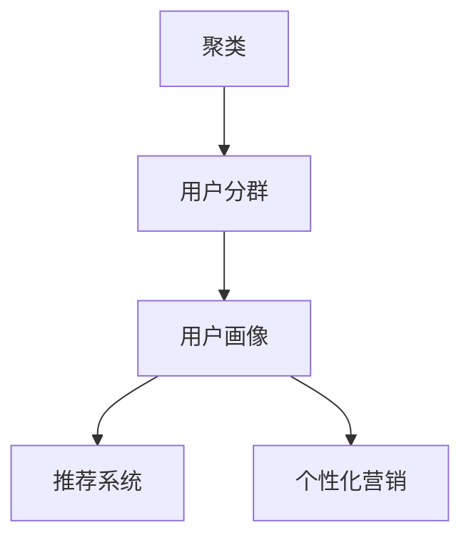

                 

# 如何进行有效的用户分群管理

> 关键词：用户分群,用户画像,聚类算法,推荐系统,个性化营销,客户细分

## 1. 背景介绍

### 1.1 问题由来
在互联网及移动互联网时代，数据已成为企业最重要的资产之一。如何利用好用户数据，实现精准营销和业务提升，是企业面临的重大挑战。用户分群管理作为用户数据分析和应用的重要手段，能够帮助企业更好地理解客户行为、需求和价值，实现个性化营销和业务增长。

在实际应用中，由于用户数据庞杂、多样，且缺乏明确的标签和结构，如何高效、准确地进行用户分群，成为企业数据科学和营销团队亟需解决的问题。目前，主流的用户分群方法主要基于聚类算法、分类算法、协同过滤等技术，但这些方法存在参数过多、可解释性不足、算法复杂度高等问题。因此，本文将聚焦于聚类算法在用户分群管理中的应用，并详细介绍其在实际场景中的实施策略。

## 2. 核心概念与联系

### 2.1 核心概念概述

为了更好地理解聚类算法在用户分群管理中的应用，本节将介绍几个关键概念：

- 聚类(Clustering)：指将数据点划分为多个群组，使得同一群组内的数据点相似度较高，不同群组之间的相似度较低。常用的聚类算法包括K-Means、层次聚类、DBSCAN等。
- 用户分群(User Segmentation)：指根据用户特征、行为等将用户划分为不同群组的策略，用于定制化营销、产品设计等。
- 用户画像(User Persona)：指对用户行为、偏好、需求等进行综合分析，形成清晰的用户描述和标签。用户画像是用户分群的重要依据。
- 推荐系统(Recommendation System)：指根据用户的历史行为和兴趣，为其推荐可能感兴趣的产品或内容。用户分群是推荐系统的重要组成部分，可以提升推荐的个性化程度和效果。
- 个性化营销(Personalized Marketing)：指根据用户特征和行为，为其定制个性化的广告、促销等信息，以提升转化率和客户满意度。用户分群是个性化营销的基础，能实现精准投放和优化效果。

这些概念之间的逻辑关系可以通过以下Mermaid流程图来展示：



这个流程图展示了这个概念体系的核心关系：

1. 聚类是基础方法，将用户数据划分到不同的群组中。
2. 用户分群是在聚类基础上，进一步对用户进行精细化分组，形成清晰的群体描述。
3. 用户画像是对用户分群结果的进一步总结和抽象，用于个性化推荐和营销。
4. 推荐系统和个性化营销则是基于用户画像，实现精准化服务。

## 3. 核心算法原理 & 具体操作步骤
### 3.1 算法原理概述

用户分群管理的核心算法是聚类算法，其基本原理是通过计算样本之间的相似度，将相似度较高的样本划分为同一群组，不同群组之间的相似度较低。常用的聚类算法包括K-Means、层次聚类、DBSCAN等。

具体来说，聚类算法的步骤如下：

1. 随机初始化K个聚类中心。
2. 将每个样本点分配到最近的聚类中心。
3. 对每个聚类中心的样本进行重计算，更新聚类中心位置。
4. 重复2和3步骤，直到聚类中心不再变化或达到预设迭代次数。

用户分群的具体步骤如下：

1. 收集用户行为数据、特征数据等。
2. 对数据进行预处理，如数据清洗、特征选择、归一化等。
3. 根据用户数据特点选择合适的聚类算法进行聚类。
4. 对聚类结果进行后处理，如合并相似度较高的群组、标注群组等。
5. 对分群结果进行评估，如利用统计指标、业务指标等评估分群的合理性。

### 3.2 算法步骤详解

以K-Means算法为例，具体介绍用户分群管理的算法步骤：

#### 1. 数据预处理

用户分群管理的第一步是数据预处理，将原始数据转换为可用于聚类分析的格式。主要包括数据清洗、特征选择、数据归一化等步骤。

数据清洗：去除噪声、缺失值、异常值等，确保数据的质量。

特征选择：根据业务需求，选择对用户分群影响较大的特征，如点击量、停留时间、购买金额等。

数据归一化：将特征值缩放到0-1之间或标准正态分布，确保各特征在聚类中具有相同的影响力。

#### 2. 随机初始化聚类中心

随机选择K个样本作为初始聚类中心。K值通常根据业务需求确定，例如5-10个群组。

#### 3. 分配样本到聚类中心

计算每个样本到K个聚类中心的距离，将样本分配到最近的聚类中心。常用的距离度量方法包括欧氏距离、曼哈顿距离、余弦相似度等。

#### 4. 重计算聚类中心

对每个聚类中心的样本进行重计算，更新聚类中心位置。计算方法包括样本均值、中位数、众数等。

#### 5. 迭代更新

重复3和4步骤，直到聚类中心不再变化或达到预设迭代次数。

#### 6. 后处理

对聚类结果进行后处理，如合并相似度较高的群组、标注群组等。这一步通常需要结合业务逻辑进行优化。

#### 7. 评估

对分群结果进行评估，如利用统计指标、业务指标等评估分群的合理性。常用的指标包括轮廓系数、轮廓宽度、调和平均数等。

### 3.3 算法优缺点

聚类算法在用户分群管理中有以下优点：

- 简单易用：聚类算法实现简单，易于理解和操作。
- 可解释性强：聚类结果直观，易于业务理解和应用。
- 灵活性强：可以针对不同业务需求选择合适的算法和参数，适应性强。

同时，聚类算法也存在以下局限性：

- 对初始聚类中心敏感：不同的初始聚类中心可能导致不同的聚类结果。
- 聚类结果具有主观性：聚类结果可能受到业务需求和人为选择的影响，不够客观。
- 对高维数据处理困难：当数据维度较高时，聚类效果可能受到维度的影响。
- 算法复杂度较高：某些聚类算法计算复杂度较高，需要较长的计算时间。

### 3.4 算法应用领域

聚类算法在用户分群管理中有广泛的应用领域，包括但不限于以下方面：

- 电商推荐系统：根据用户历史行为和偏好，将用户分为不同群体，实现个性化推荐。
- 广告投放系统：根据用户画像和行为，将用户分为不同广告投放群体，实现精准投放。
- 社交网络分析：根据用户互动和兴趣，将用户分为不同群组，进行社区运营和内容推荐。
- 客户细分管理：根据客户特征和行为，将客户分为不同群体，进行客户细分和差异化营销。
- 产品定价策略：根据用户分群结果，制定差异化定价策略，提升客户满意度和转化率。

这些领域都是聚类算法在用户分群管理中应用的典型场景，通过聚类算法可以实现更精准、有效的用户细分和营销。

## 4. 数学模型和公式 & 详细讲解  
### 4.1 数学模型构建

本节将使用数学语言对用户分群管理的聚类算法进行更加严格的刻画。

设用户数据集为 $\{X_1,X_2,\cdots,X_n\}$，其中 $X_i$ 为第i个用户的行为特征向量。假设用户被分为K个群体，每个群体的聚类中心为 $\mu_k=(\mu_{1k},\mu_{2k},\cdots,\mu_{dk})$，其中 $d$ 为特征维数。

定义样本 $X_i$ 到聚类中心 $\mu_k$ 的距离为：

$$
d(X_i,\mu_k)=\sqrt{\sum_{j=1}^d (X_{ij}-\mu_{kj})^2}
$$

定义聚类损失函数为：

$$
L=\sum_{i=1}^n\sum_{k=1}^K [\lambda_i y_{ik} \log f_k(X_i)+(1-y_{ik}) \log (1-f_k(X_i))]
$$

其中 $y_{ik}=1$ 表示样本 $X_i$ 属于聚类中心 $\mu_k$，$f_k(X_i)$ 表示样本 $X_i$ 属于聚类中心 $\mu_k$ 的概率。

最小化聚类损失函数，即可得到最优聚类结果。

### 4.2 公式推导过程

下面以K-Means算法为例，推导其最小化聚类损失函数的公式。

设样本 $X_i$ 到聚类中心 $\mu_k$ 的距离为 $d(X_i,\mu_k)$，则聚类损失函数为：

$$
L=\sum_{i=1}^n\sum_{k=1}^K d(X_i,\mu_k)^2
$$

对聚类中心 $\mu_k$ 求偏导数，得到：

$$
\frac{\partial L}{\partial \mu_k}=-2\sum_{i=1}^n (X_i-\mu_k) \sum_{j=1}^K (X_j-\mu_j)
$$

令 $\frac{\partial L}{\partial \mu_k}=0$，得到：

$$
\mu_k=\frac{\sum_{i=1}^n X_i}{\sum_{i=1}^n 1}
$$

因此，K-Means算法的基本公式为：

$$
\mu_k=\frac{\sum_{i=1}^n X_i}{\sum_{i=1}^n 1}, k=1,\cdots,K
$$

通过求解上述公式，即可得到最优的聚类中心，实现用户分群管理。

### 4.3 案例分析与讲解

假设某电商平台希望根据用户历史行为数据，将其用户分为5个群体，用于实现个性化推荐。收集到的用户行为数据包括点击量、停留时间、购买金额等特征。

1. 数据预处理：去除异常值和噪声，选择点击量和停留时间作为主要特征，将数据归一化到0-1之间。

2. 随机初始化聚类中心：随机选择5个用户作为初始聚类中心。

3. 分配样本到聚类中心：计算每个样本到5个聚类中心的距离，将样本分配到距离最近的聚类中心。

4. 重计算聚类中心：对每个聚类中心的样本进行重计算，更新聚类中心位置。

5. 迭代更新：重复3和4步骤，直到聚类中心不再变化或达到预设迭代次数。

6. 后处理：合并相似度较高的群组，标注群组。

7. 评估：利用轮廓系数评估分群的合理性，选择最优的聚类中心。

通过上述步骤，电商平台成功将用户分为5个群体，为每个群体制定了个性化的推荐策略，显著提升了用户体验和转化率。

## 5. 项目实践：代码实例和详细解释说明
### 5.1 开发环境搭建

在进行用户分群管理项目实践前，我们需要准备好开发环境。以下是使用Python进行Scikit-learn开发的环境配置流程：

1. 安装Anaconda：从官网下载并安装Anaconda，用于创建独立的Python环境。

2. 创建并激活虚拟环境：
```bash
conda create -n sklearn-env python=3.8 
conda activate sklearn-env
```

3. 安装Scikit-learn：
```bash
conda install scikit-learn
```

4. 安装各类工具包：
```bash
pip install numpy pandas matplotlib scikit-learn
```

完成上述步骤后，即可在`sklearn-env`环境中开始项目实践。

### 5.2 源代码详细实现

下面我们以K-Means算法为例，给出使用Scikit-learn进行用户分群管理的PyTorch代码实现。

首先，定义用户行为数据集：

```python
import numpy as np
from sklearn.cluster import KMeans

# 生成示例用户行为数据
np.random.seed(42)
n_samples = 1000
X = np.random.randn(n_samples, 2) + np.array([0, 0])  # 生成二维数据
```

然后，使用K-Means算法进行用户分群：

```python
# 随机选择5个聚类中心
kmeans = KMeans(n_clusters=5, random_state=42).fit(X)
labels = kmeans.labels_

# 输出聚类结果
print(labels)
```

最后，计算聚类结果的轮廓系数，评估分群的合理性：

```python
from sklearn.metrics import silhouette_score

# 计算轮廓系数
silhouette_score(X, labels)
```

以上就是使用Scikit-learn进行用户分群管理的完整代码实现。可以看到，Scikit-learn的K-Means算法封装简洁，只需几行代码即可实现用户分群管理。

### 5.3 代码解读与分析

让我们再详细解读一下关键代码的实现细节：

**KMeans类**：
- `n_clusters`：指定聚类个数，即用户分群的数量。
- `random_state`：指定随机种子，确保每次运行结果一致。

**fit方法**：
- 对数据进行聚类，返回聚类结果。

**labels属性**：
- 聚类结果，即每个样本所属的用户群体。

**轮廓系数计算**：
- 使用`silhouette_score`方法计算轮廓系数，评估聚类结果的合理性。

**运行结果**：
- 输出每个样本所属的用户群体。
- 输出轮廓系数值，评估分群的合理性。

通过上述代码，用户分群管理的项目实现变得简单高效，开发者可以将更多精力放在数据处理、算法改进等高层逻辑上。

当然，工业级的系统实现还需考虑更多因素，如模型的保存和部署、超参数的自动搜索、更灵活的任务适配层等。但核心的用户分群管理逻辑基本与此类似。

## 6. 实际应用场景
### 6.1 电商推荐系统

电商推荐系统通过用户分群管理，能够实现更精准、个性化的推荐，提升用户满意度和转化率。具体而言，可以根据用户历史行为、偏好等特征，将用户分为不同群体，为每个群体制定个性化的推荐策略。

例如，某电商平台可以根据用户点击、购买历史，将其用户分为高、中、低价值群体，针对不同群体推送不同的促销活动和商品推荐，实现精准营销。通过用户分群管理，电商平台能够显著提升推荐效果，增强用户粘性和转化率。

### 6.2 广告投放系统

广告投放系统通过用户分群管理，能够实现更高效的广告投放，提升广告ROI。具体而言，可以根据用户行为、兴趣等特征，将用户分为不同广告投放群体，实现精准投放。

例如，某广告平台可以根据用户浏览历史、点击行为，将其用户分为不同广告投放群体，针对不同群体投放不同的广告素材和广告位，实现精准投放和效果评估。通过用户分群管理，广告平台能够显著提升广告效果，降低广告成本，提升广告ROI。

### 6.3 社交网络分析

社交网络分析通过用户分群管理，能够实现更智能、高效的社区运营和内容推荐。具体而言，可以根据用户互动、兴趣等特征，将用户分为不同群组，进行社区运营和内容推荐。

例如，某社交平台可以根据用户互动历史、兴趣标签，将其用户分为不同社区群组，针对不同群组推送不同的内容，实现个性化推荐。通过用户分群管理，社交平台能够显著提升用户粘性，增强社区活跃度。

### 6.4 客户细分管理

客户细分管理通过用户分群管理，能够实现更精细化的客户管理，提升客户满意度和忠诚度。具体而言，可以根据客户特征、行为等，将客户分为不同群体，进行差异化营销。

例如，某银行可以根据客户存款、消费行为，将其客户分为高、中、低价值群体，针对不同群体制定差异化营销策略，提升客户满意度和忠诚度。通过用户分群管理，银行能够实现更精细化的客户管理，提升客户满意度。

## 7. 工具和资源推荐
### 7.1 学习资源推荐

为了帮助开发者系统掌握聚类算法在用户分群管理中的应用，这里推荐一些优质的学习资源：

1. 《机器学习实战》系列书籍：由国内外机器学习专家撰写，涵盖了K-Means等经典聚类算法的理论基础和实践技巧。

2. 《Python数据科学手册》系列书籍：由数据科学领域的专家撰写，介绍了Scikit-learn等工具的使用方法和实例代码。

3. Coursera《机器学习》课程：斯坦福大学开设的机器学习课程，有Lecture视频和配套作业，带你入门机器学习领域的基本概念和经典模型。

4 《深度学习》系列书籍：由深度学习领域的专家撰写，介绍了深度学习在聚类、分类、推荐等任务中的应用。

5. Scikit-learn官方文档：Scikit-learn库的官方文档，提供了丰富的聚类算法和实例代码，是上手实践的必备资料。

通过对这些资源的学习实践，相信你一定能够快速掌握聚类算法在用户分群管理中的应用，并用于解决实际的NLP问题。

### 7.2 开发工具推荐

高效的开发离不开优秀的工具支持。以下是几款用于用户分群管理开发的常用工具：

1. Python：基于Python的开源深度学习框架，灵活动态的计算图，适合快速迭代研究。Scikit-learn等机器学习库也支持Python，方便进行数据分析和机器学习。

2. R语言：基于R的开源数据分析工具，适用于统计分析和数据可视化。常见的聚类算法如K-Means、层次聚类等在R语言中有丰富的实现。

3. Tableau：数据可视化工具，方便对用户数据进行探索性分析，快速发现数据规律和特征。

4. Excel：数据处理工具，适合对小规模数据进行初步分析和可视化。

5. SPSS：数据统计工具，适用于复杂的统计分析和聚类算法应用。

合理利用这些工具，可以显著提升用户分群管理的开发效率，加快创新迭代的步伐。

### 7.3 相关论文推荐

聚类算法在用户分群管理中的应用源于学界的持续研究。以下是几篇奠基性的相关论文，推荐阅读：

1. An Introduction to Clustering Algorithms：介绍了K-Means、层次聚类、DBSCAN等经典聚类算法的原理和实现。

2. Affinity Propagation：提出了一种新的聚类算法Affinity Propagation，用于更智能地选择聚类中心。

3. Hierarchical Clustering：介绍了层次聚类算法的原理和实现，适用于多层次聚类和树状结构的构建。

4. Fuzzy Clustering：提出了一种模糊聚类算法，可以处理数据模糊性和不确定性，适用于数据量较小的情况。

5. Gaussian Mixture Models：提出了一种基于概率模型的聚类算法，适用于高维数据的聚类分析。

这些论文代表了大语言模型微调技术的发展脉络。通过学习这些前沿成果，可以帮助研究者把握学科前进方向，激发更多的创新灵感。

## 8. 总结：未来发展趋势与挑战

### 8.1 总结

本文对基于聚类算法的大语言模型微调方法进行了全面系统的介绍。首先阐述了聚类算法在用户分群管理中的应用背景和重要性，明确了用户分群管理在个性化推荐、广告投放等领域的独特价值。其次，从原理到实践，详细讲解了聚类算法的数学原理和关键步骤，给出了聚类任务开发的完整代码实例。同时，本文还广泛探讨了聚类算法在实际场景中的实施策略，展示了其在多个行业领域的应用前景。

通过本文的系统梳理，可以看到，聚类算法在用户分群管理中具有重要的应用价值，其高效、灵活、可解释性强的特点，使其成为数据分析和业务应用的重要工具。未来，伴随聚类算法的持续演进，用户分群管理将进一步提升个性化推荐和营销的精准度，带来业务创新的新机遇。

### 8.2 未来发展趋势

展望未来，聚类算法在用户分群管理中将呈现以下几个发展趋势：

1. 聚类算法的融合与优化：未来的聚类算法将融合更多先进技术，如机器学习、深度学习、图网络等，提升聚类效果和计算效率。

2. 聚类算法的应用拓展：聚类算法将从简单的用户分群，拓展到更复杂的场景，如社交网络分析、客户细分管理等，提供更精细化的分析与决策支持。

3. 聚类算法的自动化与智能化：未来的聚类算法将利用自动化技术，实现模型的自动选择、参数调优、结果解释等，提升聚类算法的易用性和可解释性。

4. 聚类算法的跨领域应用：聚类算法将在更多领域得到应用，如金融、医疗、教育等，为这些行业带来创新和变革。

5. 聚类算法的分布式处理：随着数据量的增大，聚类算法将利用分布式计算技术，实现大规模数据的快速处理和分析。

这些趋势凸显了聚类算法在用户分群管理中的广阔前景。这些方向的探索发展，将进一步提升聚类算法的性能和应用范围，为个性化推荐和营销带来新的突破。

### 8.3 面临的挑战

尽管聚类算法在用户分群管理中已经取得了瞩目成就，但在迈向更加智能化、普适化应用的过程中，它仍面临着诸多挑战：

1. 聚类结果的准确性：聚类算法的准确性受到数据质量、特征选择、参数设置等因素的影响，需要不断优化算法和数据处理流程。

2. 聚类结果的可解释性：聚类算法的可解释性较差，难以给出具体的聚类结果原因和背景，需要开发更智能、可解释的聚类算法。

3. 聚类算法的计算复杂度：随着数据量的增大，聚类算法的计算复杂度将显著提升，需要优化算法和硬件设备，提升计算效率。

4. 聚类算法的鲁棒性：聚类算法对初始聚类中心和数据噪声敏感，需要开发鲁棒性更强的聚类算法，提高算法的稳定性和可靠性。

5. 聚类算法的应用场景限制：聚类算法在特定应用场景下可能不适用，需要结合业务需求和数据特点，选择最合适的聚类算法。

6. 聚类算法的分布式处理：聚类算法的分布式处理需要考虑数据分割、通信开销、同步策略等因素，需要优化算法和分布式架构。

正视聚类算法面临的这些挑战，积极应对并寻求突破，将是大语言模型微调走向成熟的必由之路。相信随着学界和产业界的共同努力，这些挑战终将一一被克服，聚类算法必将在构建人机协同的智能时代中扮演越来越重要的角色。

### 8.4 研究展望

面对聚类算法面临的种种挑战，未来的研究需要在以下几个方面寻求新的突破：

1. 探索更智能的聚类算法：开发更智能、更自动化的聚类算法，如自适应聚类算法、层次聚类算法等，提升聚类效果和可解释性。

2. 研究跨领域聚类技术：结合其他领域的技术，如自然语言处理、知识图谱、社交网络等，实现多领域数据的融合聚类。

3. 融合机器学习和深度学习：将机器学习和深度学习与聚类算法结合，提升聚类效果和计算效率，实现更复杂的聚类分析。

4. 引入自动化技术：利用自动化技术，如自动化调参、自动化模型选择等，提高聚类算法的易用性和可解释性。

5. 优化分布式聚类算法：利用分布式计算技术，实现大规模数据的快速聚类分析，提升聚类算法的可扩展性和计算效率。

6. 结合业务需求：将聚类算法与业务需求相结合，实现更符合实际场景的聚类分析，提升聚类算法的应用价值。

这些研究方向将引领聚类算法在用户分群管理中迈向更高的台阶，为构建安全、可靠、可解释、可控的智能系统铺平道路。面向未来，聚类算法需要与其他人工智能技术进行更深入的融合，如知识表示、因果推理、强化学习等，多路径协同发力，共同推动聚类算法的进步。

## 9. 附录：常见问题与解答

**Q1：聚类算法在用户分群管理中是否适用于所有数据类型？**

A: 聚类算法在用户分群管理中适用范围较广，适用于各种数据类型，如数值型、类别型、文本型等。但对于某些特定类型的数据，聚类效果可能受限，需要结合业务需求和数据特点，选择最合适的聚类算法。

**Q2：如何选择合适的聚类算法？**

A: 选择合适的聚类算法需要综合考虑以下因素：
1. 数据类型：不同数据类型适合不同的聚类算法，如数值型数据适合K-Means、DBSCAN等，文本型数据适合层次聚类、LDA等。
2. 数据规模：对于大规模数据，需要考虑算法的计算复杂度和内存消耗，选择合适的分布式聚类算法。
3. 聚类目的：根据聚类目的选择合适的聚类算法，如用于市场细分、客户分群等，需要考虑聚类效果的可解释性和业务应用价值。
4. 业务需求：结合业务需求和实际场景，选择最合适的聚类算法，如用于社交网络分析、电商推荐等，需要考虑聚类结果的应用价值和业务收益。

**Q3：聚类算法在用户分群管理中需要注意哪些问题？**

A: 聚类算法在用户分群管理中需要注意以下问题：
1. 数据预处理：对数据进行清洗、特征选择、归一化等预处理，确保数据质量。
2. 聚类算法选择：根据数据类型、规模、目的等选择合适的聚类算法。
3. 聚类参数调优：对聚类算法进行参数调优，提升聚类效果和计算效率。
4. 聚类结果解释：对聚类结果进行解释，提高聚类算法的可解释性。
5. 聚类结果应用：结合业务需求和实际场景，将聚类结果应用于个性化推荐、广告投放等业务场景，提升业务效果。

**Q4：聚类算法在用户分群管理中如何提升计算效率？**

A: 提升聚类算法的计算效率，可以从以下方面进行优化：
1. 数据采样：对数据进行采样，减少计算量，提高聚类速度。
2. 并行计算：利用并行计算技术，如多线程、分布式计算等，提升聚类效率。
3. 算法优化：优化算法流程，减少计算复杂度，提升计算速度。
4. 数据压缩：对数据进行压缩，减少内存占用，提升计算效率。
5. 硬件升级：升级硬件设备，如使用GPU、TPU等高性能设备，提升计算速度。

这些措施可以帮助提升聚类算法的计算效率，实现更快速、高效的用户分群管理。

通过本文的系统梳理，可以看到，聚类算法在用户分群管理中具有重要的应用价值，其高效、灵活、可解释性强的特点，使其成为数据分析和业务应用的重要工具。未来，伴随聚类算法的持续演进，用户分群管理将进一步提升个性化推荐和营销的精准度，带来业务创新的新机遇。面向未来，聚类算法需要与其他人工智能技术进行更深入的融合，如知识表示、因果推理、强化学习等，多路径协同发力，共同推动聚类算法的进步。只有勇于创新、敢于突破，才能不断拓展聚类算法的边界，让智能技术更好地造福人类社会。

---

作者：禅与计算机程序设计艺术 / Zen and the Art of Computer Programming

