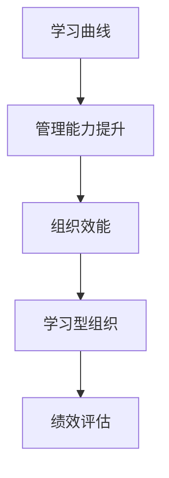

                 

# 学习曲线：管理能力提升的关键

> 关键词：学习曲线,管理能力提升,员工发展,组织效能,学习型组织

## 1. 背景介绍

### 1.1 问题由来
在快速变化、竞争激烈的市场环境中，企业面临的挑战越来越复杂。传统的基于经验和直觉的管理方式难以应对新形势下对创新和效率的需求。员工和管理者的管理能力提升，成为企业在竞争中脱颖而出的关键。然而，许多管理者缺乏系统化的管理知识，往往依赖于经验累积。如何科学地提升管理能力，成为当下企业面临的重要课题。

### 1.2 问题核心关键点
管理能力提升的核心在于持续学习和实践。通过科学的方法和工具，帮助管理者识别自身管理能力的短板，明确发展方向，制定个人学习计划，不断提升实战技能。而学习曲线，作为一种系统化的管理能力评估工具，能有效帮助管理者量化管理能力的提升轨迹，指导实践中的不断优化。

## 2. 核心概念与联系

### 2.1 核心概念概述

为更好地理解学习曲线在管理能力提升中的应用，本节将介绍几个密切相关的核心概念：

- 学习曲线(Learning Curve)：描述学习速度随练习次数变化的曲线，用来量化学习效果和进步速度。
- 管理能力(Management Skills)：管理者在规划、组织、领导、控制和创新等关键领域中展现出的能力。
- 组织效能(Organizational Performance)：通过科学管理实现的高效率、低成本和高质量。
- 学习型组织(Learning Organization)：持续学习、知识共享、创新能力强的组织文化。
- 绩效评估(Performance Evaluation)：通过系统的评估手段，衡量个人或团队的工作表现。

这些核心概念之间的逻辑关系可以通过以下Mermaid流程图来展示：



这个流程图展示的学习曲线与管理者能力提升的逻辑关系：

1. 通过学习曲线评估管理者的能力水平，识别需要提升的领域。
2. 结合实际工作场景，制定有针对性的提升计划。
3. 通过持续学习和实践，逐步提升组织效能。
4. 建立学习型组织，持续优化管理实践。
5. 通过绩效评估，检验学习效果，确保管理能力提升。

## 3. 核心算法原理 & 具体操作步骤
### 3.1 算法原理概述

学习曲线主要基于以下两个原理：

1. **学习理论**：通过科学研究和实践总结，不同能力提升所需的练习次数和时间存在规律性，可以用数学模型描述。
2. **数据驱动**：通过收集管理者的训练记录和反馈信息，量化学习效果，提供数据支撑。

通过学习曲线，管理者能够科学地规划学习路径，评估进步速度，指导实际工作中持续优化。

### 3.2 算法步骤详解

基于学习曲线的方法论，一般包括以下几个关键步骤：

**Step 1: 评估现有能力**

- 使用科学评估工具，如问卷调查、行为分析、360度反馈等，对管理者的现有管理能力进行全面评估。
- 确定关键能力指标，如沟通能力、决策能力、团队管理能力等。
- 生成初步的“能力-时间”图，描述当前能力水平与所需提升水平之间的差距。

**Step 2: 制定学习计划**

- 根据评估结果，结合个人职业发展规划，制定具体的学习目标和时间表。
- 分解关键能力指标，制定每个能力的具体提升计划。
- 选择适当的学习资源和方法，如课程培训、书籍阅读、导师指导等。

**Step 3: 跟踪学习进度**

- 定期收集和记录管理者的学习进度和反馈，包括培训课程完成情况、技能应用实践、自我评价等。
- 使用学习曲线工具，根据记录数据生成动态的“能力-时间”图，实时反映学习效果和进步轨迹。
- 及时调整学习计划，应对实践中的挑战和困难。

**Step 4: 评估和反馈**

- 通过定期绩效评估，检验管理者的实际工作表现，评估学习计划的效果。
- 结合360度反馈，综合评估管理者在实际工作中的表现和能力提升。
- 根据评估结果，生成新的学习曲线，指导后续的学习和改进。

以上是基于学习曲线的方法论进行管理能力提升的一般流程。在实际应用中，还需要根据管理者的实际情况和具体任务，对各个环节进行优化设计，以确保学习效果的最大化。

### 3.3 算法优缺点

学习曲线作为管理能力提升的工具，具有以下优点：

1. **量化评估**：通过科学评估工具和方法，量化管理者的能力水平，提供清晰的数据支撑。
2. **动态调整**：实时反映管理者的学习进度，动态调整学习计划，确保效果最大化。
3. **数据驱动**：基于实践反馈和实际数据，指导学习过程，提高学习效果。
4. **系统性规划**：通过系统化的评估和规划，确保管理能力提升的系统性和全面性。

同时，该方法也存在一定的局限性：

1. **数据获取困难**：获取全面的评估数据和实践反馈，需要投入较多的人力和时间。
2. **个性化不足**：通用性的评估工具可能难以充分反映个别管理者的独特需求。
3. **执行难度**：制定和执行详细的学习计划，需要管理者的自律和组织的支持。
4. **成本较高**：系统化的学习曲线评估和优化，需要一定的资金和资源投入。

尽管存在这些局限性，但就目前而言，学习曲线仍然是最有效的管理能力提升工具之一，为管理者提供了科学、系统化的提升路径。未来相关研究的重点在于如何进一步降低评估和优化成本，提高评估的个性化和实用性，同时兼顾成本效益，推动学习曲线方法在更多组织中的应用。

### 3.4 算法应用领域

基于学习曲线的方法论，在管理能力提升中得到了广泛的应用，覆盖了以下领域：

- **企业内部培训**：通过系统的评估和规划，提升企业中高管的领导力、战略规划能力等。
- **高管继任规划**：为高管继任者提供科学的评估工具，制定个性化的发展路径。
- **团队能力提升**：帮助团队成员识别能力提升的关键领域，制定协作发展的学习计划。
- **组织效能优化**：通过系统化的评估，识别影响组织效能的关键因素，优化组织管理实践。
- **企业文化建设**：推动组织内部的知识共享和学习氛围，提升整体管理能力。

除了上述这些典型应用外，学习曲线方法还被创新性地应用到更多场景中，如员工职业发展规划、跨部门协作、组织战略调整等，为企业的发展注入新的动力。

## 4. 数学模型和公式 & 详细讲解 & 举例说明（备注：数学公式请使用latex格式，latex嵌入文中独立段落使用 $$，段落内使用 $)
### 4.1 数学模型构建

本节将使用数学语言对学习曲线进行更加严格的刻画。

假设管理者初始能力为 $C_0$，经过 $n$ 次练习后，能力提升到 $C_n$。学习速度 $v$ 可以表示为 $C_n$ 关于 $n$ 的函数，即 $C_n = f(n, v)$。根据学习理论，学习速度 $v$ 与练习次数 $n$ 之间的关系可以描述为：

$$
C_n = C_0 + \int_0^n v(t) dt
$$

其中 $v(t)$ 为 $t$ 时刻的学习速度，可以通过实际数据进行拟合。

### 4.2 公式推导过程

假设学习速度 $v(t)$ 为指数函数，即 $v(t) = a \cdot b^t$。将此函数代入上述公式，得：

$$
C_n = C_0 + a \cdot \frac{b^n - 1}{b - 1}
$$

其中 $a$ 和 $b$ 为拟合参数，可以通过实验数据进行求解。根据实验数据，可以生成“能力-时间”图，反映管理者的能力提升轨迹，如下所示：

$$
C_n = C_0 + \frac{a}{b-1} \cdot (b^n - 1)
$$

### 4.3 案例分析与讲解

假设某企业高管初始沟通能力为 $C_0=3$，经过不同次数的沟通技能培训后，能力提升到 $C_n$。通过实验记录，可以拟合出学习速度 $v(t)$ 的指数函数模型，并计算得到 $a=0.2, b=1.1$。根据公式计算得到“能力-时间”图如下：

$$
C_n = 3 + \frac{0.2}{1.1-1} \cdot (1.1^n - 1)
$$

通过“能力-时间”图，可以直观反映该高管在沟通技能培训中的学习效果，指导后续的培训和实践。

## 5. 项目实践：代码实例和详细解释说明
### 5.1 开发环境搭建

在进行学习曲线实践前，我们需要准备好开发环境。以下是使用Python进行项目开发的环境配置流程：

1. 安装Python：从官网下载并安装最新版本的Python，确保环境的一致性和稳定性。
2. 安装相关库：安装必要的Python库，如numpy、pandas、matplotlib等。
3. 配置开发环境：创建虚拟环境，确保项目开发的隔离性和可控性。

### 5.2 源代码详细实现

下面，我们将通过一个简单的学习曲线计算案例，展示使用Python进行学习曲线计算的代码实现。

```python
import numpy as np
import matplotlib.pyplot as plt

# 初始能力值
C_0 = 3

# 学习速度拟合参数
a = 0.2
b = 1.1

# 学习次数
n = np.arange(1, 21)

# 计算能力值
C_n = C_0 + (a / (b - 1)) * (b ** n - 1)

# 绘制能力-时间图
plt.plot(n, C_n, label='能力-时间曲线')
plt.xlabel('练习次数')
plt.ylabel('能力值')
plt.title('学习曲线示例')
plt.legend()
plt.show()
```

这段代码实现了根据初始能力和学习速度拟合公式，生成“能力-时间”图的功能。可以看到，学习曲线能够直观反映管理者的学习效果和进步轨迹，为后续的实践改进提供数据支持。

### 5.3 代码解读与分析

让我们再详细解读一下关键代码的实现细节：

**import模块**：
- 导入numpy库，用于数组和数学运算。
- 导入matplotlib库，用于绘制图表。

**初始能力值和拟合参数**：
- 定义初始能力值 $C_0$ 和拟合参数 $a$ 和 $b$。

**学习次数数组**：
- 使用numpy的arange函数生成1到20的学习次数数组，用于计算能力值。

**能力值的计算**：
- 根据公式 $C_n = C_0 + \frac{a}{b-1} \cdot (b^n - 1)$，计算每个学习次数对应的能力值。

**图表绘制**：
- 使用matplotlib的plot函数绘制“能力-时间”图。
- 通过xlabel和ylabel设置横纵坐标标签。
- 通过title和legend添加图表标题和图例。

**运行结果展示**：
- 运行代码后，可以看到学习曲线图形，直观反映学习效果和进步轨迹。

可以看到，通过Python进行学习曲线计算，不仅代码简洁高效，还能快速生成直观的图形，辅助管理者进行数据理解和决策。

## 6. 实际应用场景
### 6.1 企业管理层培训

基于学习曲线的方法，可以帮助企业管理层系统化地提升领导力、战略规划等关键能力。通过科学的评估和规划，制定详细的培训计划，并结合实际工作的反馈，动态调整学习路径，确保管理能力的持续提升。

在具体实施中，可以采取以下步骤：

1. 进行全面的能力评估，生成初始的学习曲线。
2. 根据评估结果，制定具体的培训计划，分配学习资源。
3. 通过课程培训、案例研讨、模拟演练等手段，提升管理能力。
4. 定期收集反馈，调整培训计划，生成新的学习曲线。

通过这种方式，企业管理层能够持续优化管理实践，提高组织效能，增强企业的核心竞争力。

### 6.2 中层管理者能力提升

中层管理者在组织中扮演重要角色，其能力水平直接影响到团队协作和组织绩效。通过学习曲线，可以帮助中层管理者识别能力提升的关键领域，制定个性化的学习计划。

具体应用中，可以：

1. 对中层管理者进行全面的能力评估，确定能力短板。
2. 制定详细的学习计划，包括培训课程、导师指导、实践锻炼等。
3. 定期跟踪学习进度，评估学习效果，生成新的学习曲线。
4. 根据评估结果，调整学习计划，确保能力持续提升。

通过系统化的培训和学习，中层管理者能够全面提升管理能力，更好地领导团队，推动组织目标的实现。

### 6.3 新员工能力培养

新员工往往缺乏实际工作经验，需要通过系统的培训和学习，逐步提升工作能力。学习曲线方法可以帮助新员工识别能力提升的关键领域，制定详细的培训计划。

具体应用中，可以：

1. 对新员工进行全面的能力评估，确定能力短板。
2. 制定详细的培训计划，包括入职培训、岗位培训、导师辅导等。
3. 定期收集反馈，调整培训计划，生成新的学习曲线。
4. 根据评估结果，调整学习计划，确保能力持续提升。

通过科学化的培训和学习，新员工能够快速融入团队，提升工作能力，为组织注入新的活力。

### 6.4 未来应用展望

随着学习曲线方法的应用范围不断扩大，其将会在更多领域得到应用，为组织的发展注入新的动力：

1. **高等教育**：通过科学评估学生的学习能力和知识掌握情况，指导个性化学习计划的制定。
2. **企业培训体系**：将学习曲线方法引入企业培训体系，推动全员能力的持续提升。
3. **在线教育平台**：利用学习曲线分析用户的学习进度和效果，优化课程设计和教学方法。
4. **政府管理能力提升**：通过科学评估公务员的管理能力，指导其持续学习和发展。
5. **社区组织能力提升**：帮助社区管理者提升管理水平，推动社区建设和发展。

学习曲线方法将为各类组织提供系统化的管理能力提升工具，推动各行业管理的科学化和现代化进程。

## 7. 工具和资源推荐
### 7.1 学习资源推荐

为了帮助开发者系统掌握学习曲线方法的理论基础和实践技巧，这里推荐一些优质的学习资源：

1. **《管理学的数学原理》**：系统介绍管理学中的数学建模方法和工具，包括学习曲线等。
2. **《组织行为学》**：详细讲解组织管理和行为分析的基本原理和方法，提供丰富的实践案例。
3. **《学习型组织》**：介绍学习型组织的构建和运行机制，提供成功案例和实践指导。
4. **《绩效评估》**：系统讲解绩效评估的方法和工具，指导科学的量化评估。
5. **在线课程平台**：如Coursera、edX等，提供系统化的学习曲线和组织管理课程，方便灵活学习。

通过这些资源的学习实践，相信你一定能够快速掌握学习曲线方法，并将其应用于管理能力的提升。

### 7.2 开发工具推荐

高效的开发离不开优秀的工具支持。以下是几款用于学习曲线开发常用的工具：

1. **Python**：作为数据分析和科学计算的常用语言，Python在处理和可视化数据方面具有显著优势。
2. **R语言**：在统计分析和数据可视化方面具有强大功能，支持各类统计分析和图表绘制。
3. **Excel**：简单易用的办公软件，适合进行小规模的数据处理和图表绘制。
4. **Tableau**：数据可视化的专业工具，支持复杂数据集的分析和可视化。
5. **Power BI**：微软推出的数据可视化工具，适合企业级的数据分析和报告。

合理利用这些工具，可以显著提升学习曲线方法的开发效率，加快创新迭代的步伐。

### 7.3 相关论文推荐

学习曲线方法的发展源于学界的持续研究。以下是几篇奠基性的相关论文，推荐阅读：

1. **《学习曲线分析及其在管理能力提升中的应用》**：详细介绍学习曲线原理和应用，提供实际案例分析。
2. **《基于学习曲线的管理能力提升研究》**：系统总结学习曲线方法的理论和实践应用。
3. **《学习型组织和绩效评估》**：结合学习型组织理论，探讨学习曲线在组织绩效提升中的应用。
4. **《管理能力评估与学习曲线》**：研究不同管理能力提升所需的学习次数和时间，提供实验数据分析。

这些论文代表了大学习曲线方法的发展脉络。通过学习这些前沿成果，可以帮助研究者把握学科前进方向，激发更多的创新灵感。

## 8. 总结：未来发展趋势与挑战
### 8.1 研究成果总结

学习曲线方法在管理能力提升中展现了巨大的潜力，通过科学评估和系统规划，帮助管理者持续提升实战技能，优化管理实践，提升组织效能。经过多年的研究和实践，该方法已经形成较为成熟的技术体系和应用范式。

### 8.2 未来发展趋势

展望未来，学习曲线方法将呈现以下几个发展趋势：

1. **数据驱动化**：随着大数据和AI技术的进步，学习曲线方法将更多依赖数据驱动，提供更精准的能力评估和提升建议。
2. **个性化定制**：通过机器学习和个性化推荐算法，学习曲线方法将能够更精细地适配个体管理者的需求，提供量身定做的学习路径。
3. **智能学习系统**：引入AI技术，实现学习曲线的动态调整和优化，增强学习效果的个性化和实时性。
4. **跨领域应用**：学习曲线方法将不仅仅局限于管理领域，更多地应用到教育、医疗、政府等领域，推动各行业的科学化管理。
5. **国际化发展**：随着全球化的深入发展，学习曲线方法将在不同文化背景和国家环境下得到应用和优化，提升全球管理者的能力水平。

### 8.3 面临的挑战

尽管学习曲线方法已经取得了一定的进展，但在实际应用中，仍面临以下挑战：

1. **数据获取困难**：全面的评估数据获取需要耗费大量时间和人力，存在成本较高的缺点。
2. **个体差异大**：不同管理者的学习能力和需求差异较大，通用化的评估工具可能无法完全适配。
3. **执行难度高**：系统的学习曲线方法需要管理者的自律和组织的支持，执行难度较大。
4. **效果评估难**：管理能力的提升效果难以量化评估，存在主观性强的问题。
5. **技术门槛高**：学习曲线方法涉及数据处理、统计分析等技术，对技术人员要求较高。

### 8.4 研究展望

面对学习曲线方法面临的挑战，未来的研究需要在以下几个方面寻求新的突破：

1. **优化数据获取**：开发高效的数据采集和处理工具，降低评估成本，提高数据质量。
2. **增强个性化**：引入机器学习技术，提升学习曲线的个性化适配能力，更好地反映个体管理者的需求。
3. **简化执行流程**：设计易用性和可操作性更强的方法，降低执行难度，提高实施效果。
4. **提升效果评估**：引入更科学的量化评估方法，增强评估的客观性和准确性。
5. **降低技术门槛**：开发简单易用的工具和平台，降低技术门槛，推动学习曲线方法的普及应用。

这些研究方向的探索，将推动学习曲线方法向更广泛、更深入的领域拓展，为管理能力的提升提供更系统、更科学的支持。面向未来，学习曲线方法需要在技术创新和应用实践中不断优化，才能更好地适应管理能力提升的需求。

## 9. 附录：常见问题与解答

**Q1: 学习曲线方法是否适用于所有管理场景？**

A: 学习曲线方法适用于大多数管理场景，特别是对于需要系统化提升能力的管理者。但对于一些特殊场景，如战略决策、复杂问题解决等，可能需要结合其他方法，综合应用。

**Q2: 学习曲线如何适应不同行业和文化背景？**

A: 学习曲线方法可以通过本地化调整和适配，适应不同行业和文化背景的管理者。通过引入文化特质的考量，调整学习目标和路径，确保方法的有效性和适用性。

**Q3: 如何平衡数据驱动和个性化需求？**

A: 在实际应用中，可以通过结合机器学习和人工干预，实现数据驱动和个性化需求的平衡。利用数据生成初步的评估和建议，再结合管理者的反馈和实际需求，进行动态调整。

**Q4: 学习曲线方法是否需要定期更新？**

A: 学习曲线方法需要根据管理者的学习进度和反馈进行定期更新，确保评估结果和建议的时效性和准确性。通过动态调整，反映管理者的最新能力水平和学习效果。

通过系统性地回答这些常见问题，可以帮助管理者更好地理解和应用学习曲线方法，在管理能力提升中取得更好的效果。

---

作者：禅与计算机程序设计艺术 / Zen and the Art of Computer Programming

