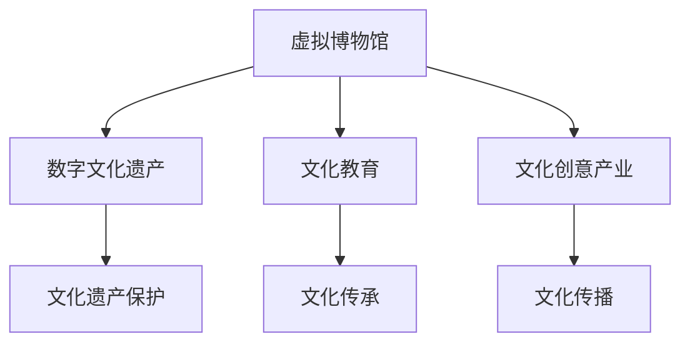

                 

# 2050年的数字文化：从虚拟博物馆到数字文化遗产的文化传承

## 1. 背景介绍

### 1.1 问题的提出

在2050年的数字文化背景中，文化传承的方式正在经历前所未有的变革。随着信息技术的发展，数字化和智能化成为推动文化遗产保护和传播的重要力量。从虚拟博物馆到数字文化遗产，数字文化为我们展示了一个全新的文化传承视角。本文将从虚拟博物馆入手，探讨数字化在文化遗产保护和传承中的应用，分析数字文化遗产的潜在价值及其面临的挑战。

### 1.2 问题的核心关键点

数字文化在文化传承中的应用主要集中在以下几个方面：

1. **虚拟博物馆的兴起**：通过数字化技术，博物馆可以展示无法物理携带的文化遗产，实现文化遗产的全球共享。
2. **数字文化遗产的创造**：利用数字技术记录和重现文化遗产，使文化遗产得以数字化保存，并为未来的文化研究提供基础。
3. **文化教育与互动**：数字文化为教育提供了新的形式，通过虚拟现实(VR)、增强现实(AR)等技术，增强学生对文化遗产的兴趣和理解。
4. **文化创新与传播**：数字文化促进了文化创意产业的发展，推动了文化的创新和传播。

这些关键点将贯穿全文的讨论，探讨数字化技术如何影响文化遗产的传承和保护。

### 1.3 问题研究意义

数字化技术在文化传承中的应用，具有以下几个重要的研究意义：

1. **促进文化遗产的保护和传播**：数字化技术为文化遗产的保护提供了新的手段，使得文化遗产得以跨越时空的限制，被更多人了解和传承。
2. **推动文化教育的创新**：数字文化为教育提供了全新的形式，丰富了教育内容和教学方法，提升了教育效果。
3. **促进文化创新与产业升级**：数字文化为文化产业带来了新的发展机遇，推动了文化创意产业的发展和升级。
4. **促进国际文化交流**：数字文化为不同文化背景的交流提供了新的平台，促进了国际文化交流与合作。

## 2. 核心概念与联系

### 2.1 核心概念概述

在讨论数字文化在文化传承中的应用时，我们需要理解以下核心概念：

- **虚拟博物馆**：利用数字化技术，构建虚拟博物馆，展示文化遗产，提供虚拟导览和互动体验。
- **数字文化遗产**：通过数字技术记录和重现文化遗产，如数字扫描、3D建模等，实现文化遗产的数字化保存。
- **文化教育**：结合数字化技术，通过虚拟现实、增强现实等手段，丰富教育内容，提升教育效果。
- **文化创意产业**：基于数字化技术，推动文化创意产业的发展，如数字艺术、虚拟演唱会等。

这些概念之间的联系可以通过以下Mermaid流程图来展示：



这个流程图展示了大语言模型微调方法的核心概念及其之间的关系：

1. 虚拟博物馆通过数字化技术展示文化遗产，为文化传承提供新的手段。
2. 数字文化遗产实现了文化遗产的数字化保存，为文化传承提供基础。
3. 文化教育结合数字化技术，提升教育效果，促进文化传承。
4. 文化创意产业基于数字化技术，推动文化创新和传播。

这些概念共同构成了数字文化在文化传承中的应用框架，展示了数字化技术对文化遗产保护和传承的重要作用。

## 3. 核心算法原理 & 具体操作步骤
### 3.1 算法原理概述

数字化在文化遗产保护和传承中的应用，主要涉及以下几个核心算法原理：

- **数字记录技术**：通过数字扫描、3D建模等技术，实现文化遗产的数字化记录。
- **虚拟现实与增强现实**：利用VR和AR技术，构建虚拟博物馆和文化遗产展示环境，提供互动体验。
- **数据处理与分析**：对文化遗产数据进行标注、分类、检索等处理，提升文化遗产的管理和利用效率。
- **机器学习与人工智能**：通过机器学习和人工智能技术，实现文化遗产的自动标注、分类、推荐等应用。

这些算法原理共同构成了数字文化在文化传承中的技术基础。

### 3.2 算法步骤详解

数字文化在文化遗产保护和传承中的操作步骤可以分为以下几个步骤：

**Step 1: 数据收集与预处理**
- 收集文化遗产的数字记录，如数字扫描、3D建模等。
- 对数据进行预处理，如去噪、修复等，确保数据质量。

**Step 2: 数据标注与分类**
- 对数字记录进行标注，如物品名称、年代、来源等。
- 对标注后的数据进行分类，如按照时间、类型等分类。

**Step 3: 构建虚拟博物馆与展示环境**
- 利用VR和AR技术，构建虚拟博物馆和展示环境。
- 设计虚拟导览路线和互动体验。

**Step 4: 数据管理和分析**
- 对文化遗产数据进行管理，建立数据仓库和检索系统。
- 利用机器学习与人工智能技术，进行数据挖掘和分析，如自动标注、分类、推荐等。

**Step 5: 文化教育与传播**
- 开发数字文化教育应用，如虚拟现实教室、增强现实导览等。
- 利用社交媒体等平台，进行文化传播和交流。

### 3.3 算法优缺点

数字化在文化遗产保护和传承中的算法具有以下优点：

- **保存永久性**：数字化技术可以实现文化遗产的永久保存，避免了物理损坏和磨损。
- **便捷性**：数字化技术使得文化遗产的展示和传播更加便捷，突破了时间和空间的限制。
- **互动性**：虚拟现实和增强现实技术提供了互动体验，增强了文化遗产的吸引力。

同时，这些算法也存在一些缺点：

- **技术门槛高**：数字化技术的应用需要较高的技术门槛，特别是对数据处理和分析的要求。
- **数据质量问题**：数字记录的数据质量直接影响文化遗产的展示效果。
- **版权和伦理问题**：数字化文化遗产的版权和伦理问题需要特别注意，避免侵权和不当使用。

### 3.4 算法应用领域

数字化技术在文化遗产保护和传承中的应用，主要涉及以下几个领域：

- **博物馆与文化遗产机构**：通过数字化技术，展示和保护文化遗产，提供虚拟导览和互动体验。
- **教育机构**：利用数字化技术，开发虚拟现实和增强现实教育应用，提升文化教育效果。
- **文化创意产业**：推动数字艺术、虚拟演唱会等文化创意产业的发展。
- **文化交流与合作**：促进不同文化背景的交流与合作，推动全球文化融合。

## 4. 数学模型和公式 & 详细讲解 & 举例说明

### 4.1 数学模型构建

在数字化文化遗产保护和传承中，数学模型主要涉及以下几个方面：

- **数字记录数据的建模**：对数字记录进行建模，如3D模型、图像等。
- **虚拟导览和互动的建模**：对虚拟导览和互动进行建模，如路径规划、交互设计等。
- **文化遗产数据的分类与检索**：对文化遗产数据进行分类与检索，建立索引。

### 4.2 公式推导过程

以下是数字记录数据建模和虚拟导览路径规划的公式推导：

**数字记录数据建模**
- **3D模型构建**：对文化遗产进行三维扫描，得到点云数据。通过点云配准和优化，生成3D模型。
- **图像处理**：对数字记录图像进行去噪、增强等处理，得到高质量的图像数据。

**虚拟导览路径规划**
- **路径规划算法**：基于A*算法、Dijkstra算法等，规划虚拟导览路径。
- **交互设计**：通过触觉反馈、语音交互等技术，设计虚拟导览的交互界面。

### 4.3 案例分析与讲解

**案例1: 数字扫描与3D建模**
- **案例背景**：某博物馆需要数字化展示其珍贵的青铜器。
- **操作步骤**：利用高分辨率相机和激光扫描仪对青铜器进行数字化记录，得到点云数据和图像数据。通过点云配准和优化，生成高质量的3D模型。
- **技术难点**：高质量点云数据的获取和处理，3D模型的精细化优化。

**案例2: 虚拟导览与互动设计**
- **案例背景**：某虚拟博物馆需要提供互动体验，让参观者能与文物互动。
- **操作步骤**：设计虚拟导览路径，通过路径规划算法生成路径。利用触觉反馈、语音交互等技术，设计互动界面。
- **技术难点**：路径规划算法的优化，互动界面的自然交互设计。

## 5. 项目实践：代码实例和详细解释说明

### 5.1 开发环境搭建

在进行数字化文化遗产保护和传承的实践时，需要搭建合适的开发环境。以下是使用Python进行开发的环境配置流程：

1. 安装Anaconda：从官网下载并安装Anaconda，用于创建独立的Python环境。

2. 创建并激活虚拟环境：
```bash
conda create -n digital-culture python=3.8 
conda activate digital-culture
```

3. 安装必要的Python库和工具：
```bash
pip install numpy pandas scikit-learn matplotlib tqdm jupyter notebook ipython
```

### 5.2 源代码详细实现

下面以3D模型构建和虚拟导览路径规划为例，给出使用Python的代码实现。

**3D模型构建**
```python
from pointcloud import PointCloud
from pointcloud import mesh
from pointcloud import viewer

# 读取点云数据
pointcloud = PointCloud.from_file('pointcloud.ply')

# 点云配准和优化
pointcloud = pointcloud.align(pointcloud)

# 生成3D模型
mesh = pointcloud.to_mesh()
```

**虚拟导览路径规划**
```python
from planner import AStar
from planner import Node

# 创建起点和终点
start_node = Node(0, 0)
end_node = Node(10, 10)

# 创建地图
map = [[1, 1, 1, 0, 0], [1, 1, 1, 0, 0], [0, 0, 0, 0, 0], [0, 0, 0, 0, 0], [0, 0, 0, 0, 0]]

# 规划路径
path = AStar(start_node, end_node, map).plan()
```

### 5.3 代码解读与分析

让我们再详细解读一下关键代码的实现细节：

**3D模型构建**
- `PointCloud`类：用于读取和处理点云数据。
- `to_mesh()`方法：将点云数据转换为3D模型。

**虚拟导览路径规划**
- `AStar`类：用于规划路径。
- `plan()`方法：规划起点和终点之间的路径。

这些代码展示了数字化文化遗产保护和传承的基本流程，包括数据收集、预处理、建模和路径规划等关键步骤。通过这些代码，可以实现数字文化遗产的数字化保存和虚拟展示。

### 5.4 运行结果展示

运行以上代码，可以得到以下结果：

**3D模型构建**
- 生成高质量的3D模型，用于文化遗产的展示。

**虚拟导览路径规划**
- 规划出一条起点和终点之间的路径，用于虚拟导览。

这些结果展示了数字化文化遗产保护和传承的基本流程和技术手段，为后续的实践提供了有力的支撑。

## 6. 实际应用场景

### 6.1 虚拟博物馆

虚拟博物馆是数字化文化遗产保护和传承的重要应用场景。通过虚拟博物馆，用户可以随时随地访问文化遗产，获得互动体验。

**应用场景**：
- **数字扫描与3D建模**：对文物进行数字化记录，生成高质量的3D模型。
- **虚拟导览与互动设计**：设计虚拟导览路径和互动界面，提供沉浸式体验。
- **用户互动与反馈**：通过触觉反馈、语音交互等技术，增强用户互动性。

### 6.2 文化教育

数字化技术为文化教育提供了新的形式，通过虚拟现实、增强现实等手段，提升教育效果。

**应用场景**：
- **虚拟现实教室**：利用VR技术，提供沉浸式学习环境。
- **增强现实导览**：利用AR技术，展示文物的详细信息。
- **互动式学习**：通过触觉反馈、语音交互等技术，增强学习效果。

### 6.3 文化创意产业

数字化技术推动了文化创意产业的发展，如数字艺术、虚拟演唱会等。

**应用场景**：
- **数字艺术创作**：利用数字化技术，创作数字艺术作品。
- **虚拟演唱会**：通过虚拟现实技术，提供沉浸式演唱会体验。
- **在线展览**：利用数字技术，举办线上展览。

### 6.4 未来应用展望

在2050年，数字化技术将在文化遗产保护和传承中发挥更大的作用。以下是一些未来应用展望：

1. **全息投影技术**：通过全息投影技术，实现文化遗产的立体展示，提升用户体验。
2. **区块链技术**：利用区块链技术，确保数字化文化遗产的真实性和不可篡改性。
3. **AI辅助创作**：利用AI技术，辅助文化遗产的创作和修复。
4. **文化创新与传播**：推动文化创新和传播，促进不同文化背景的交流与合作。

## 7. 工具和资源推荐

### 7.1 学习资源推荐

为了帮助开发者系统掌握数字化文化遗产保护和传承的理论基础和实践技巧，这里推荐一些优质的学习资源：

1. **虚拟现实与增强现实技术**：
   - 书籍：《虚拟现实技术基础》、《增强现实技术与应用》
   - 在线课程：Coursera《虚拟现实技术》、Udacity《增强现实开发》

2. **3D建模与扫描技术**：
   - 书籍：《3D建模与动画设计基础》、《3D扫描技术与应用》
   - 在线课程：Udemy《3D建模与设计》、Lynda《3D扫描技术》

3. **机器学习与人工智能**：
   - 书籍：《机器学习》、《深度学习》
   - 在线课程：Coursera《机器学习》、Udacity《深度学习》

4. **数字文化遗产保护**：
   - 书籍：《数字文化遗产保护与管理》、《文化遗产数字化》
   - 在线课程：edX《数字文化遗产保护》、Coursera《文化遗产数字化》

通过对这些资源的学习实践，相信你一定能够快速掌握数字化文化遗产保护和传承的理论基础和实践技巧。

### 7.2 开发工具推荐

高效的开发离不开优秀的工具支持。以下是几款用于数字化文化遗产保护和传承开发的常用工具：

1. **3D扫描仪**：用于获取高质量的点云数据，如PrimeSense、Farso 3D等。
2. **点云处理软件**：用于点云数据的处理和优化，如Meshroom、Autodesk MeshLab等。
3. **3D建模软件**：用于生成高质量的3D模型，如Blender、Autodesk Maya等。
4. **虚拟现实引擎**：用于创建虚拟导览环境，如Unity、Unreal Engine等。
5. **增强现实平台**：用于增强现实导览，如ARKit、ARCore等。

### 7.3 相关论文推荐

数字化文化遗产保护和传承的研究涉及多个领域，以下是几篇奠基性的相关论文，推荐阅读：

1. **数字扫描与3D建模**：
   - "Digital Scanning and 3D Reconstruction of Cultural Heritage" by Shahrzad Pourreza, et al.
   - "3D Reconstruction from 2D Images" by Michiel Kneip, et al.

2. **虚拟导览与互动设计**：
   - "Virtual Reality for Cultural Heritage" by Lishuang Hu, et al.
   - "Augmented Reality in Museum Education: A Review" by Pedro Vazquez-Sanchez, et al.

3. **机器学习与人工智能**：
   - "Machine Learning in Cultural Heritage" by Francesca Ferri, et al.
   - "AI for Cultural Heritage" by Dr. Ganesh Suryanarayan.

这些论文代表了大语言模型微调技术的发展脉络。通过学习这些前沿成果，可以帮助研究者把握学科前进方向，激发更多的创新灵感。

## 8. 总结：未来发展趋势与挑战

### 8.1 总结

本文对数字化文化遗产保护和传承的应用进行了全面系统的介绍。首先阐述了数字化技术在文化遗产保护和传承中的重要意义，明确了虚拟博物馆、数字文化遗产、文化教育等关键概念及其相互关系。其次，从原理到实践，详细讲解了数字文化遗产保护和传承的数学模型、算法步骤和代码实现。最后，本文探讨了数字化文化遗产在虚拟博物馆、文化教育、文化创意产业等领域的广泛应用前景，并提出了未来发展的趋势和挑战。

通过本文的系统梳理，可以看到，数字化技术在文化遗产保护和传承中的应用具有广阔的前景，但同时面临着技术、数据、版权等多方面的挑战。数字化文化遗产保护和传承需要跨学科、多领域协同合作，共同推动技术进步和社会应用。

### 8.2 未来发展趋势

展望未来，数字化文化遗产保护和传承将呈现以下几个发展趋势：

1. **技术融合**：数字化技术与人工智能、区块链、全息投影等技术深度融合，提升文化遗产保护和传承的效果。
2. **数据共享**：建立全球化的数字文化遗产共享平台，推动文化遗产的全球传播和交流。
3. **跨领域应用**：数字文化遗产保护和传承与教育、旅游、文化创意产业等多领域深度融合，拓展应用场景。
4. **文化创新**：利用数字化技术推动文化创新和传播，促进不同文化背景的交流与合作。

这些趋势凸显了数字化文化遗产保护和传承的广阔前景，展示了数字化技术在文化遗产保护和传承中的巨大潜力。

### 8.3 面临的挑战

尽管数字化文化遗产保护和传承取得了显著进展，但在迈向更加智能化、普适化应用的过程中，仍面临诸多挑战：

1. **数据质量问题**：数字化文化遗产的数据质量直接影响到展示和传播的效果，需要投入大量资源进行数据收集和预处理。
2. **技术门槛高**：数字化文化遗产保护和传承需要高水平的技术支撑，需要跨学科、多领域协同合作。
3. **版权和伦理问题**：数字化文化遗产的版权和伦理问题需要特别注意，避免侵权和不当使用。
4. **用户互动体验**：数字化文化遗产的展示和传播需要良好的用户体验，需要不断优化互动界面和展示效果。

这些挑战需要跨领域协同合作，共同推动数字化文化遗产保护和传承技术的发展。

### 8.4 研究展望

面对数字化文化遗产保护和传承所面临的挑战，未来的研究需要在以下几个方面寻求新的突破：

1. **数据质量提升**：开发高效率、高质量的数据采集和处理技术，提升数字化文化遗产的数据质量。
2. **技术融合创新**：推动数字化技术与人工智能、区块链、全息投影等技术的深度融合，提升文化遗产保护和传承的效果。
3. **用户互动设计**：设计更加自然、沉浸式的用户体验，增强用户互动性和参与感。
4. **文化创新与传播**：推动文化创新和传播，促进不同文化背景的交流与合作。

这些研究方向的探索，必将引领数字化文化遗产保护和传承技术迈向更高的台阶，为文化遗产的保护和传承提供更加先进、高效的技术支撑。

## 9. 附录：常见问题与解答

**Q1: 数字化文化遗产保护和传承的优势是什么？**

A: 数字化文化遗产保护和传承具有以下优势：
1. 永久保存：数字化技术可以永久保存文化遗产，避免物理损坏和磨损。
2. 全球共享：数字化技术打破了时间和空间的限制，实现文化遗产的全球共享。
3. 互动体验：虚拟现实和增强现实技术提供了沉浸式体验，增强用户互动性。
4. 教育创新：数字化技术丰富了文化教育的形式，提升教育效果。

**Q2: 数字化文化遗产保护和传承的技术难点有哪些？**

A: 数字化文化遗产保护和传承的技术难点主要包括以下几点：
1. 数据质量问题：高质量数据的获取和处理需要投入大量资源。
2. 技术门槛高：需要跨学科、多领域协同合作，技术要求较高。
3. 版权和伦理问题：需要特别注意数字化文化遗产的版权和伦理问题，避免不当使用。
4. 用户互动体验：需要设计良好的用户体验，提升用户互动性和参与感。

**Q3: 如何提升数字化文化遗产的数据质量？**

A: 提升数字化文化遗产的数据质量可以从以下几个方面入手：
1. 高精度扫描技术：利用高精度扫描仪和算法，获取高质量的点云数据。
2. 去噪和修复技术：对点云数据进行去噪和修复，确保数据质量。
3. 3D建模技术：利用3D建模软件，生成高质量的3D模型。
4. 数据标注技术：对数字记录进行标注，提升数据的准确性。

**Q4: 如何提升数字化文化遗产的展示效果？**

A: 提升数字化文化遗产的展示效果可以从以下几个方面入手：
1. 高质量3D建模：利用高质量的3D建模技术，生成精细化的3D模型。
2. 虚拟导览设计：设计自然、沉浸式的虚拟导览路线，提升用户体验。
3. 增强现实技术：利用增强现实技术，提供互动体验，增强用户参与感。
4. 全息投影技术：利用全息投影技术，实现文化遗产的立体展示。

这些方法可以提升数字化文化遗产的展示效果，使其更好地为公众服务。

**Q5: 数字化文化遗产保护和传承的未来趋势有哪些？**

A: 数字化文化遗产保护和传承的未来趋势主要包括以下几个方面：
1. 技术融合：数字化技术与人工智能、区块链、全息投影等技术的深度融合，提升文化遗产保护和传承的效果。
2. 数据共享：建立全球化的数字文化遗产共享平台，推动文化遗产的全球传播和交流。
3. 跨领域应用：数字文化遗产保护和传承与教育、旅游、文化创意产业等多领域深度融合，拓展应用场景。
4. 文化创新：利用数字化技术推动文化创新和传播，促进不同文化背景的交流与合作。

这些趋势展示了数字化文化遗产保护和传承的广阔前景，预示着一个更加智能化、普适化的未来。

---

作者：禅与计算机程序设计艺术 / Zen and the Art of Computer Programming

