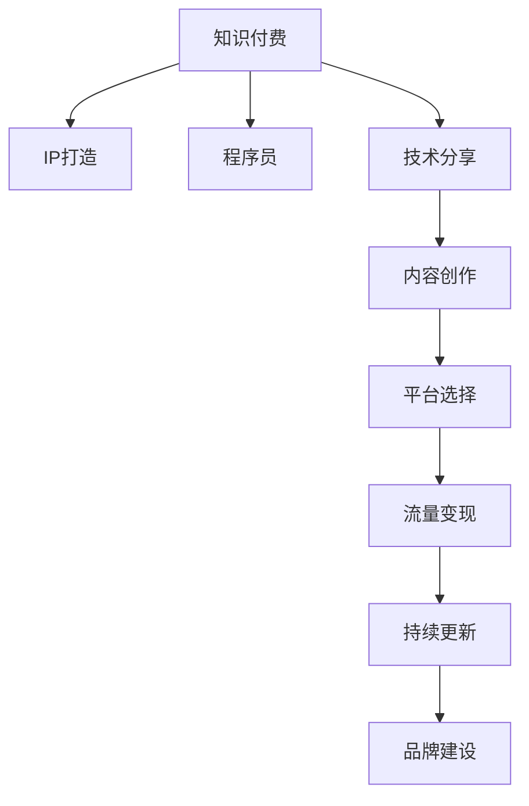

                 

# 打造专业型知识付费IP:程序员的机会

> 关键词：知识付费,IP打造,程序员,技术分享,价值创造,内容创作,平台选择,流量变现,持续更新,品牌建设

## 1. 背景介绍

随着互联网技术的快速发展和知识经济的崛起，知识付费作为一种新兴的商业模式，正迅速崛起。程序员作为技术含量高、市场需求大的人才群体，天然具备打造专业型知识付费IP的先天优势。然而，要想在激烈的市场竞争中脱颖而出，成功打造自己的知识付费IP，程序员们需要深入理解市场趋势、挖掘自身价值、利用好各种资源，方能成就一番事业。

本文将系统梳理知识付费市场现状、分析程序员在其中的定位与机会，并给出详细的方法论和步骤，帮助程序员顺利打造属于自己的专业型知识付费IP，实现个人品牌的价值最大化。

## 2. 核心概念与联系

### 2.1 核心概念概述

要打造知识付费IP，首先需要理解几个核心概念：

- **知识付费(Knowledge Paid)**：通过付费方式获取专有知识的商业模型，旨在为知识提供者提供合理回报，为知识消费者提供高效、优质的信息获取方式。
- **IP (Intellectual Property)**：知识产权，指创作者对其创作内容所享有的商业权利。在知识付费领域，IP通常指创作者通过内容建立的个人品牌影响力。
- **程序员**：掌握编程语言和软件开发技能的专业技术人员，具有较强的技术能力和问题解决能力。
- **技术分享**：程序员将自己的专业知识、编程经验、技术难题解决方案等通过各种方式分享给其他开发者，如博客、视频、公开课等。
- **内容创作**：在技术分享的基础上，进一步丰富内容形式，构建系统化的知识体系，创建具有深度和广度的内容作品。
- **平台选择**：根据自身内容和目标用户，选择合适的知识付费平台（如知乎、B站、小鹅通等）进行内容发布和变现。
- **流量变现**：通过各类付费机制，将内容消费转化为实际收入，包括单次付费、会员订阅、课程销售等。
- **持续更新**：保持内容的活跃度和时效性，不断优化和迭代，持续吸引和留住用户。
- **品牌建设**：通过长期的内容输出和品牌运营，建立专业、可信、有影响力的个人品牌形象。

这些概念之间的逻辑关系可以通过以下Mermaid流程图来展示：



这个流程图展示了几类核心概念之间的联系：知识付费是商业模式的顶层，程序员作为主体提供技术分享，内容创作是技术分享与品牌建设的中间环节，平台选择和流量变现则是知识付费商业化的关键步骤，而持续更新和品牌建设则是长期维护用户的关键。

## 3. 核心算法原理 & 具体操作步骤
### 3.1 算法原理概述

打造知识付费IP的核心算法原理，可以概括为：通过高效的内容创作和精心设计的内容传播机制，最大化知识付费的商业价值，实现程序员个人品牌的影响力和经济回报。

具体来说，就是将程序员的技术积累转化为有价值的内容，并通过合适的平台进行传播和变现，同时不断优化内容和运营策略，持续吸引用户并提高用户粘性，最终建立品牌影响力。

### 3.2 算法步骤详解

以下将详细讲解打造知识付费IP的各个步骤：

#### 3.2.1 定位与定位

1. **自我评估**：
   - 评估自身的技术水平和知识储备，确定自己擅长的技术领域和问题解决能力。
   - 分析市场热点和需求，确定目标受众群体。

2. **市场调研**：
   - 研究现有知识付费平台的受众分布、内容形式和商业模式。
   - 分析同类IP的成功案例，学习他们的内容风格、运营策略和用户互动方式。

#### 3.2.2 内容创作

1. **选题与规划**：
   - 根据市场调研结果，确定具有高价值潜力的主题。
   - 制定内容创作计划，包括选题、内容结构、发布频率等。

2. **内容制作**：
   - 以技术分享为基础，制作高质量的课程、博客、视频等。
   - 注重内容的原创性和深度，加入个人经验和案例分析，增强内容的实用性。

3. **品牌建设**：
   - 设计具有识别度的个人品牌标识，如头像、封面、签名等。
   - 建立个人网站或博客，定期发布内容，维护粉丝互动。

#### 3.2.3 平台选择

1. **平台调研**：
   - 分析各平台的受众特点、内容类型、收费模式、技术要求等。
   - 选择与自身内容定位和受众匹配度高的平台。

2. **账号注册与设置**：
   - 注册平台账号，完善个人资料和品牌形象。
   - 设置课程或文章价格、支付方式等。

#### 3.2.4 流量变现

1. **内容推广**：
   - 利用社交媒体、技术论坛等渠道进行内容推广，吸引流量。
   - 与相关社区和群体合作，扩大内容影响力。

2. **变现策略**：
   - 选择单次付费、会员订阅、课程销售等变现模式。
   - 根据不同平台特点，制定合适的定价策略。

#### 3.2.5 持续更新与优化

1. **用户反馈**：
   - 收集用户反馈，了解用户需求和偏好。
   - 根据反馈调整内容方向和发布计划。

2. **内容迭代**：
   - 定期更新内容，引入新主题和新知识。
   - 优化内容结构和传播形式，提升用户体验。

### 3.3 算法优缺点

#### 3.3.1 优点

1. **变现能力强**：知识付费IP拥有持续的知识输出和稳定的用户群体，变现渠道多样，收益稳定。
2. **品牌影响力大**：通过专业的内容创作和高质量的用户互动，IP可以快速建立权威性和信任度，形成品牌效应。
3. **职业发展快**：IP打造过程伴随着个人技术和品牌的提升，有助于程序员职业发展。
4. **多元化发展**：内容创作不仅限于技术分享，还可以扩展到教育、咨询等领域，实现多元化发展。

#### 3.3.2 缺点

1. **内容创作难度高**：需要高质量的内容创作能力和持续的创作动力。
2. **市场竞争激烈**：知识付费市场竞争激烈，需要不断创新和优化内容形式和运营策略。
3. **用户粘性难以保证**：用户获取和保留需要长期投入和运营。
4. **技术更新快**：技术领域快速变化，需要不断学习新知识以保持内容的时效性。

### 3.4 算法应用领域

知识付费IP打造的技术原理和操作流程，适用于各种技术领域的知识分享和变现。特别适用于以下领域：

1. **软件开发**：介绍编程语言、框架、工具的使用技巧和最佳实践。
2. **数据分析**：分享数据处理、统计分析、机器学习等技能和应用案例。
3. **网络安全**：讲解安全漏洞、防护措施和应急处理策略。
4. **人工智能**：探讨AI技术原理、应用场景和开发方法。
5. **区块链**：解析区块链技术原理、应用场景和开发技术。

## 4. 数学模型和公式 & 详细讲解  
### 4.1 数学模型构建

为了更好地理解知识付费IP的商业价值，我们需要构建数学模型来分析收入、成本、用户增长等关键指标。

设：
- 每期订阅人数为 $U$，单次付费课程售价为 $P$，单期订阅费用为 $S$，平均课程购买次数为 $C$，每次订阅获取新用户数为 $N$。
- 用户每期流失率为 $\alpha$，新用户转化率为 $\beta$，每期内容运营成本为 $C_{op}$。

目标是最小化总成本，最大化总收入。数学模型为：

$$
\min_{U,S} C_{total} = C_{op} \times (1-\alpha) \times U
$$

$$
\max_{U,S} I_{total} = U \times S + C \times P
$$

其中 $I_{total}$ 为总收入，$C_{total}$ 为总成本。

### 4.2 公式推导过程

1. **收入模型推导**：
   - 总收入 $I_{total} = U \times S + C \times P$
   - 假设每期订阅用户中，有 $C$ 人购买课程，则课程收入为 $C \times P$
   - 订阅收入为 $U \times S$

2. **成本模型推导**：
   - 总成本 $C_{total} = C_{op} \times (1-\alpha) \times U$
   - 每期运营成本为 $C_{op}$
   - 订阅用户流失 $U \times \alpha$ 的运营成本为 $C_{op} \times U \times \alpha$
   - 每期新增用户 $N = U \times \beta$，则新增运营成本为 $C_{op} \times N$

通过上述模型，可以清晰地分析知识付费IP的收入和成本构成，帮助程序员做出科学合理的运营决策。

### 4.3 案例分析与讲解

以《图解算法》课程为例，分析其知识付费IP的构建过程：

1. **内容创作**：通过视频、PPT、代码实现等形式，系统讲解算法原理和实践方法。
2. **平台选择**：通过知乎、B站、小鹅通等多平台分发内容，吸引不同兴趣的受众。
3. **流量变现**：通过单次付费和会员订阅相结合的定价策略，增加课程收入。
4. **用户反馈**：通过在线问答、评论互动等方式，及时获取用户反馈，优化课程内容。
5. **持续更新**：定期发布新的算法知识，更新课程内容，保持用户粘性。

## 5. 项目实践：代码实例和详细解释说明
### 5.1 开发环境搭建

以下是在Python环境下搭建知识付费IP开发环境的步骤：

1. **环境准备**：
   - 安装Python 3.x，推荐使用Anaconda。
   - 安装Jupyter Notebook或JupyterLab，用于在线编写和运行代码。

2. **工具安装**：
   - 安装Flask或Django等Web框架，搭建Web应用。
   - 安装MySQL或MongoDB等数据库，用于数据存储。
   - 安装GitHub或Gitee等代码托管平台，用于版本控制和代码发布。

3. **开发环境配置**：
   - 设置虚拟环境，推荐使用venv。
   - 安装Python依赖包，如Flask、Jinja2、SQLAlchemy等。

### 5.2 源代码详细实现

以一个简单的技术博客网站为例，展示Web应用的基本实现：

```python
from flask import Flask, render_template, request

app = Flask(__name__)

@app.route('/')
def index():
    return render_template('index.html')

@app.route('/post/<id>')
def post(id):
    post = get_post_by_id(id)
    return render_template('post.html', post=post)

@app.route('/submit', methods=['POST'])
def submit():
    title = request.form['title']
    content = request.form['content']
    # 将博客发布到数据库
    return '博客发布成功！'

if __name__ == '__main__':
    app.run(debug=True)
```

### 5.3 代码解读与分析

1. **Flask框架**：
   - Flask是一个轻量级的Web框架，易于上手。
   - 使用路由装饰器定义URL和视图函数，实现前后端交互。

2. **模板引擎**：
   - 使用Jinja2模板引擎，简化HTML代码。
   - 使用模板语言，动态渲染页面内容。

3. **数据存储**：
   - 使用SQLAlchemy进行数据库操作，支持MySQL、SQLite等。
   - 设计博客数据表，包含id、title、content等字段。

4. **用户交互**：
   - 通过表单处理，实现博客发布、编辑等功能。
   - 使用Session管理用户登录状态，保障数据安全。

5. **部署与扩展**：
   - 将应用部署到云服务器，如AWS、阿里云等。
   - 使用Docker容器化，方便管理和扩展。

### 5.4 运行结果展示

运行上述代码，启动Flask应用，即可在浏览器中访问http://127.0.0.1:5000/，访问博客首页。提交新博客后，即可在博客列表中看到新发布的文章。

## 6. 实际应用场景
### 6.1 技术博客网站

技术博客网站是一种常见的知识付费IP形式，通过发布高质量的技术文章，吸引技术爱好者关注。例如：

- 知乎专栏：利用知乎的流量和粉丝基础，发布技术分享、编程实践等内容。
- GitHub博客：利用GitHub的GitHub Pages功能，托管博客文章，展示代码和项目。
- Medium博客：利用Medium的全球读者群，发布英文技术文章，吸引海外技术爱好者。

### 6.2 技术社区平台

技术社区平台通过提供技术交流和讨论的空间，建立用户互动的生态。例如：

- Stack Overflow：全球最大的程序员社区，通过问答机制提供技术支持。
- GitHub：提供代码托管和版本控制，通过Pull Request机制促进代码贡献。
- 技术论坛：如CSDN论坛、开发者社区等，提供技术讨论和问题解决的空间。

### 6.3 在线课程平台

在线课程平台通过提供系统化、结构化的课程内容，帮助学员掌握技术技能。例如：

- Coursera：提供全球知名大学和企业的在线课程，涵盖广泛的技术领域。
- Udemy：提供各种技术课程，从入门到进阶，适合不同水平的学习者。
- 网易云课堂：提供国内企业的技术课程，贴近国内技术市场。

### 6.4 未来应用展望

未来，知识付费IP将向着多元化、社区化、个性化方向发展。以下是几个重要的发展趋势：

1. **多元化**：知识付费IP不再局限于单一技术领域，而是向更多领域扩展，如教育、金融、健康等。
2. **社区化**：建立技术社区，通过互动交流，提升用户粘性和品牌影响力。
3. **个性化**：利用AI和数据分析技术，实现内容推荐，提供个性化的学习体验。
4. **国际化**：拓展海外市场，提供多语言的内容和互动，提升国际影响力。

## 7. 工具和资源推荐
### 7.1 学习资源推荐

1. **Flask官方文档**：详细介绍了Flask框架的使用方法和最佳实践。
2. **SQLAlchemy官方文档**：介绍SQLAlchemy数据库操作的API和示例。
3. **GitHub教程**：GitHub官方提供的Git和GitHub Pages教程。
4. **Medium博客指南**：Medium官方提供的博客发布和运营指南。
5. **技术社区推荐**：如Stack Overflow、CSDN论坛、知乎等，获取技术交流和问题解决资源。

### 7.2 开发工具推荐

1. **PyCharm**：功能强大的Python IDE，支持代码调试和项目管理。
2. **VSCode**：轻量级但功能强大的代码编辑器，支持多种语言和插件。
3. **Git**：版本控制工具，支持远程仓库托管和协作开发。
4. **GitHub/Gitee**：代码托管平台，支持代码审查、Issue跟踪和项目管理。
5. **Docker**：容器化技术，方便应用部署和扩展。

### 7.3 相关论文推荐

1. **内容推荐算法**：如协同过滤、基于深度学习的推荐系统，提升个性化体验。
2. **用户行为分析**：通过数据分析，理解用户行为和需求，优化内容策略。
3. **社区互动模型**：建立社区互动模型，提升用户粘性和社区活跃度。
4. **内容治理技术**：保护内容版权和数据安全，维护良好的知识付费环境。

## 8. 总结：未来发展趋势与挑战
### 8.1 总结

本文详细分析了知识付费市场现状、程序员在其中的定位与机会，并给出打造知识付费IP的具体方法和步骤。知识付费IP的打造不仅需要高质量的内容创作，还需要选择合适的平台、有效的运营策略和持续的内容优化。通过不断学习和实践，程序员可以成功打造自己的专业型知识付费IP，实现个人品牌的价值最大化。

### 8.2 未来发展趋势

未来，知识付费IP将向着更加多元化、社区化、个性化方向发展。以下趋势值得关注：

1. **技术融合**：知识付费IP将与其他人工智能技术进行更深入的融合，如知识图谱、自然语言处理等。
2. **用户互动**：通过社区互动，提升用户粘性和品牌影响力。
3. **内容优化**：利用大数据和AI技术，优化内容形式和传播机制。
4. **全球化扩展**：拓展海外市场，提升国际影响力。

### 8.3 面临的挑战

在知识付费IP打造过程中，程序员需要面对以下挑战：

1. **内容创作**：高质量内容创作和持续创新是知识付费IP的核心，需要不断提升技术水平和内容输出能力。
2. **市场竞争**：知识付费市场竞争激烈，需要不断优化内容和运营策略，保持竞争力。
3. **用户获取与保留**：获取和保留用户需要长期投入和运营，需要有良好的用户体验和互动机制。
4. **技术更新**：技术领域快速变化，需要不断学习新知识以保持内容的时效性。

### 8.4 研究展望

未来，知识付费IP的研究方向包括：

1. **知识图谱构建**：利用知识图谱技术，构建更全面的技术知识体系。
2. **交互式学习**：利用AI技术，实现交互式学习，提升用户参与度和学习效果。
3. **数据驱动内容**：利用大数据分析，优化内容策略，提升内容质量和用户满意度。
4. **社区管理**：建立社区互动模型，提升社区活跃度和用户粘性。

总之，知识付费IP打造是一个复杂而系统的工程，需要程序员在内容创作、平台选择、运营策略等方面不断探索和创新。通过深入理解市场趋势和用户需求，利用现有工具和技术，程序员可以打造出有影响力的知识付费IP，实现个人品牌和职业发展。

## 9. 附录：常见问题与解答

**Q1: 如何选择合适的平台进行内容发布？**

A: 选择平台需要考虑以下几个方面：
1. **用户群体**：平台的用户群体是否与你的目标受众匹配。
2. **内容形式**：平台是否支持你希望发布的内容形式，如博客、视频、课程等。
3. **变现模式**：平台是否支持你期望的变现模式，如单次付费、会员订阅等。
4. **技术要求**：平台的技术要求是否与你的技术能力相匹配。

**Q2: 如何提升内容的用户粘性？**

A: 提升用户粘性需要以下几个策略：
1. **高质量内容**：提供高质量、有价值的内容，满足用户需求。
2. **互动机制**：建立社区互动机制，增加用户参与和交流。
3. **持续更新**：定期更新内容，保持内容的活跃度。
4. **用户反馈**：及时获取用户反馈，优化内容形式和发布计划。

**Q3: 如何利用大数据和AI技术优化内容？**

A: 利用大数据和AI技术优化内容需要以下几个步骤：
1. **数据收集**：收集用户行为数据，如阅读时间、点击率等。
2. **数据分析**：利用数据挖掘和机器学习技术，分析用户需求和内容偏好。
3. **内容推荐**：基于用户行为数据，推荐相关内容，提升用户满意度。
4. **内容优化**：根据分析结果，优化内容形式和发布策略，提升用户粘性。

**Q4: 如何进行内容变现？**

A: 内容变现需要以下几个策略：
1. **单次付费**：提供单次付费课程或文章，吸引用户一次性付费。
2. **会员订阅**：提供会员订阅服务，定期发布高质量内容，提升用户粘性。
3. **课程销售**：提供系统化、结构化的课程，帮助用户系统学习技术知识。
4. **广告分成**：在内容中插入广告，获取广告分成收入。

总之，打造知识付费IP是一个复杂而系统的工程，需要程序员在内容创作、平台选择、运营策略等方面不断探索和创新。通过深入理解市场趋势和用户需求，利用现有工具和技术，程序员可以打造出有影响力的知识付费IP，实现个人品牌和职业发展。

---

作者：禅与计算机程序设计艺术 / Zen and the Art of Computer Programming

