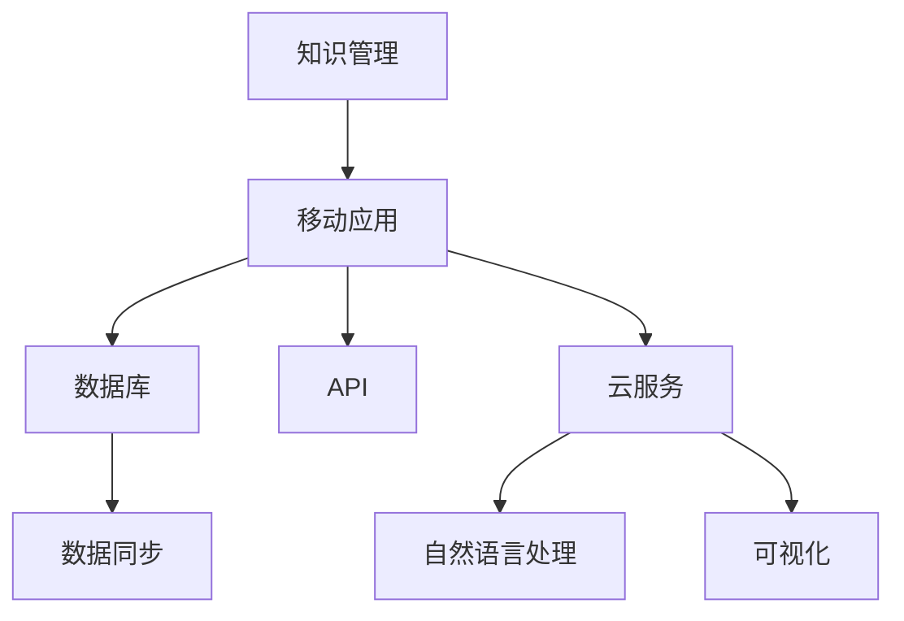

                 

# 打造个人知识管理的移动应用

> 关键词：知识管理, 移动应用, 数据库, API, 安全, 云服务, 自然语言处理, 可视化

## 1. 背景介绍

### 1.1 问题由来

在信息爆炸的今天，个人知识管理变得越来越重要。人们不仅需要处理海量的信息，还需要高效地存储、检索和应用这些知识。然而，传统的纸质笔记本、文本文件等知识管理方式已经无法满足人们的需求，信息碎片化、重复输入、搜索不便等问题日益凸显。为了解决这些问题，开发一款高效、便捷的个人知识管理移动应用成为当务之急。

### 1.2 问题核心关键点

开发一款个人知识管理应用的核心在于：
1. 实现高效的知识存储和检索。
2. 提供灵活的笔记组织方式。
3. 提供强大的数据同步和备份功能。
4. 确保数据的安全性和隐私保护。
5. 提供便捷的分享和协作功能。

通过解决这些问题，可以构建一款高质量、用户友好的知识管理应用，帮助用户高效地管理个人知识，提升学习和工作效率。

### 1.3 问题研究意义

个人知识管理应用的开发，不仅能够提升个人的工作效率和学习效果，还能帮助人们更好地整理和运用自身知识，促进职业发展和创新能力的提升。对于组织和企业，开发一款高效的知识管理系统，可以帮助团队协作，加速知识共享和创新，提升整体竞争力。

## 2. 核心概念与联系

### 2.1 核心概念概述

为更好地理解个人知识管理应用的开发流程，本节将介绍几个密切相关的核心概念：

- 知识管理(Knowledge Management)：指通过技术手段，对个人或组织的知识进行收集、整理、存储、共享、应用等活动，以提高知识创造和应用效率。

- 移动应用(Mobile Application)：指运行在智能手机、平板电脑等移动设备上的应用程序，用户可以通过触屏、手势等方式进行交互。

- 数据库(Database)：指用于存储和管理数据的电子化存储系统，支持数据的高效查询、存储和维护。

- API(Application Programming Interface)：指应用程序之间的接口，用于实现数据和服务之间的交互。

- 数据同步(Data Synchronization)：指在多个设备间保持数据一致性的过程，确保用户在不同设备上的数据更新保持同步。

- 云服务(Cloud Service)：指通过互联网提供的数据存储和计算服务，用户可以通过互联网访问和使用数据。

- 自然语言处理(Natural Language Processing, NLP)：指使用计算机技术处理和分析人类语言的能力，用于自动提取、分类和处理文本数据。

- 可视化(Visualization)：指将复杂数据转化为图形、图表等直观形式，便于用户理解和分析。

这些核心概念之间的逻辑关系可以通过以下Mermaid流程图来展示：



这个流程图展示了个知识管理应用的核心概念及其之间的关系：

1. 知识管理作为应用的核心目标，指导应用的设计和功能。
2. 移动应用作为知识管理的应用载体，提供便捷的用户交互界面。
3. 数据库用于存储和管理知识数据，是应用的基础。
4. API实现数据和服务之间的交互，确保应用的可扩展性和灵活性。
5. 数据同步和云服务确保知识数据的跨设备一致性和备份安全。
6. NLP和可视化技术用于提高数据的理解和应用效率。

这些核心概念共同构成了个人知识管理应用的技术框架，使得知识管理变得更加高效和便捷。

## 3. 核心算法原理 & 具体操作步骤
### 3.1 算法原理概述

个人知识管理应用的核心算法包括：
1. 数据存储和检索算法。
2. 自然语言处理算法。
3. 数据同步和备份算法。

这些算法分别用于实现数据的存储、检索、处理和同步等功能，是构建高效知识管理应用的基础。

### 3.2 算法步骤详解

#### 3.2.1 数据存储和检索算法

数据存储和检索算法的主要任务是实现数据的快速读写和检索。具体步骤如下：

1. 选择合适的数据库管理系统。常用的数据库管理系统包括MySQL、MongoDB、SQLite等。
2. 设计数据模型。根据应用需求，设计合理的数据结构，包括表结构、索引等。
3. 实现数据存储。将数据存储到数据库中，并确保数据的安全性和可靠性。
4. 实现数据检索。通过编写查询语句，实现高效的数据检索，支持模糊查询、全文检索等。

#### 3.2.2 自然语言处理算法

自然语言处理算法用于实现文本数据的自动处理和分析，主要包括：

1. 文本分词。将文本分解为词语，用于后续的分析和处理。
2. 命名实体识别。自动识别文本中的实体，如人名、地名、机构名等。
3. 情感分析。分析文本的情感倾向，用于情感分析和舆情监测。
4. 关键词提取。从文本中提取关键词，用于文本分类和检索。

#### 3.2.3 数据同步和备份算法

数据同步和备份算法用于实现数据在不同设备间的同步和备份，确保数据的一致性和安全性。具体步骤如下：

1. 设计数据同步策略。包括同步频率、同步方式、冲突解决等。
2. 实现数据同步。通过编写同步脚本，实现数据在不同设备间的同步。
3. 实现数据备份。将数据备份到云存储或本地存储中，确保数据的安全性。

### 3.3 算法优缺点

#### 3.3.1 数据存储和检索算法

优点：
1. 支持高效的数据存储和检索。
2. 支持多种数据类型，包括文本、图片、视频等。
3. 支持大规模数据的存储和处理。

缺点：
1. 数据存储和检索算法复杂度高，开发和维护成本高。
2. 数据存储和检索算法需要考虑到数据一致性和并发访问的问题，容易发生数据冲突和丢失。

#### 3.3.2 自然语言处理算法

优点：
1. 能够自动处理和分析文本数据，提高工作效率。
2. 支持多种自然语言处理任务，如文本分词、命名实体识别、情感分析等。

缺点：
1. 自然语言处理算法的准确性受限于语料库的质量和规模，需要持续优化和改进。
2. 自然语言处理算法的计算复杂度高，需要高性能的硬件支持。

#### 3.3.3 数据同步和备份算法

优点：
1. 确保数据在不同设备间的一致性和可靠性。
2. 支持数据的多地备份和恢复。

缺点：
1. 数据同步和备份算法复杂度高，需要考虑到数据一致性和并发访问的问题。
2. 数据同步和备份算法的开发和维护成本高，需要持续优化和改进。

### 3.4 算法应用领域

基于上述核心算法，个人知识管理应用可以应用于多种领域，包括但不限于：

1. 个人学习管理。用于存储和管理学习笔记、资料、课程等，提高学习效率。
2. 项目管理。用于存储和管理项目计划、任务、文档等，促进团队协作和项目进度管理。
3. 文档管理。用于存储和管理文档、书籍、资料等，支持文本搜索和分类。
4. 社交媒体管理。用于存储和管理社交媒体账号、帖子、评论等，提升社交媒体管理和互动效率。

除了上述这些应用场景外，个人知识管理应用还可以拓展到更多领域，如时间管理、健康管理、金融管理等，为个人生活和工作带来更多便利。

## 4. 数学模型和公式 & 详细讲解 & 举例说明
### 4.1 数学模型构建

个人知识管理应用的核心数学模型包括：
1. 数据存储和检索模型。
2. 自然语言处理模型。
3. 数据同步和备份模型。

这些数学模型用于指导数据的存储、处理和同步等操作，是构建高效知识管理应用的基础。

#### 4.1.1 数据存储和检索模型

数据存储和检索模型用于实现数据的存储和检索。常用的数据模型包括关系型数据库模型和文档型数据库模型。

关系型数据库模型使用表格结构存储数据，支持SQL查询，主要用于处理结构化数据。文档型数据库模型使用文档结构存储数据，支持JSON查询，主要用于处理半结构化数据。

#### 4.1.2 自然语言处理模型

自然语言处理模型用于实现文本数据的自动处理和分析。常用的自然语言处理模型包括词向量模型和Transformer模型。

词向量模型将词语映射为向量表示，支持文本分类、情感分析等任务。Transformer模型通过自注意力机制实现文本处理，支持文本生成、文本摘要等任务。

#### 4.1.3 数据同步和备份模型

数据同步和备份模型用于实现数据在不同设备间的同步和备份。常用的数据同步和备份模型包括同步脚本模型和云备份模型。

同步脚本模型通过编写脚本实现数据同步，支持定时同步和手动同步。云备份模型将数据备份到云存储中，支持多地备份和恢复。

### 4.2 公式推导过程

#### 4.2.1 数据存储和检索模型

在关系型数据库中，数据存储和检索模型可以使用SQL查询语言实现。假设有一个存储用户笔记的数据库，数据模型如下：

```sql
CREATE TABLE notes (
    id INT PRIMARY KEY,
    user_id INT,
    title VARCHAR(255),
    content TEXT,
    created_at TIMESTAMP DEFAULT CURRENT_TIMESTAMP,
    updated_at TIMESTAMP DEFAULT CURRENT_TIMESTAMP
);
```

其中，`id`为笔记的唯一标识符，`user_id`为用户ID，`title`为笔记标题，`content`为笔记内容，`created_at`和`updated_at`分别为笔记创建时间和更新时间。

数据检索可以使用SELECT语句实现，例如：

```sql
SELECT * FROM notes WHERE user_id = 123;
```

该语句会返回用户ID为123的所有笔记。

#### 4.2.2 自然语言处理模型

在自然语言处理中，词向量模型可以使用Word2Vec算法实现。假设有一个文本集合，使用Word2Vec算法计算每个词语的向量表示，模型如下：

```python
import gensim

# 加载文本数据
texts = ["This is a sample sentence.", "Another example of text."]

# 构建词向量模型
model = gensim.models.KeyedVectors.load_word2vec_format("path/to/word2vec.model", binary=True)

# 计算词向量
vectors = [model[word] for word in texts]
```

其中，`texts`为文本数据，`model`为词向量模型，`vectors`为计算得到的词向量。

#### 4.2.3 数据同步和备份模型

在数据同步和备份中，可以使用定时脚本实现数据同步。假设有一个定时脚本，每天凌晨3点同步用户笔记到云端，模型如下：

```python
import time
import requests

# 获取用户笔记
user_id = 123
notes = requests.get(f"http://api/notes/{user_id}").json()

# 将笔记同步到云端
for note in notes:
    data = {
        "title": note["title"],
        "content": note["content"],
        "created_at": note["created_at"],
        "updated_at": note["updated_at"]
    }
    requests.post("http://api/cloud/notes", json=data)
    
# 等待1小时再同步
time.sleep(3600)
```

其中，`user_id`为用户ID，`notes`为用户笔记，`data`为同步到云端的笔记数据。

### 4.3 案例分析与讲解

#### 4.3.1 数据存储和检索模型

假设有一个在线笔记应用，使用MySQL作为数据库管理系统。用户可以创建笔记、查看笔记、删除笔记等。应用的数据模型如下：

```sql
CREATE TABLE notes (
    id INT PRIMARY KEY,
    user_id INT,
    title VARCHAR(255),
    content TEXT,
    created_at TIMESTAMP DEFAULT CURRENT_TIMESTAMP,
    updated_at TIMESTAMP DEFAULT CURRENT_TIMESTAMP
);
```

其中，`id`为笔记的唯一标识符，`user_id`为用户ID，`title`为笔记标题，`content`为笔记内容，`created_at`和`updated_at`分别为笔记创建时间和更新时间。

用户可以创建笔记：

```sql
INSERT INTO notes (user_id, title, content) VALUES (123, "My Note", "This is my first note.");
```

用户可以查看笔记：

```sql
SELECT * FROM notes WHERE user_id = 123;
```

用户可以删除笔记：

```sql
DELETE FROM notes WHERE id = 1;
```

#### 4.3.2 自然语言处理模型

假设有一个文本分类应用，使用BERT模型进行文本分类。应用的数据模型如下：

```sql
CREATE TABLE texts (
    id INT PRIMARY KEY,
    content TEXT
);
```

其中，`id`为文本的唯一标识符，`content`为文本内容。

应用可以使用BERT模型对文本进行分类，例如：

```python
import transformers

# 加载BERT模型
model = transformers.BertForSequenceClassification.from_pretrained("bert-base-uncased")

# 加载文本数据
texts = ["This is a sample sentence.", "Another example of text."]

# 对文本进行分类
for text in texts:
    inputs = transformers.BertTokenizer.from_pretrained("bert-base-uncased").encode(text)
    outputs = model(inputs, labels=[1, 1])
    label = outputs.logits.argmax().item()
    print(label)
```

其中，`model`为BERT模型，`texts`为文本数据，`inputs`为BERT模型输入的token ids，`outputs`为BERT模型输出的分类结果，`label`为分类结果。

#### 4.3.3 数据同步和备份模型

假设有一个在线笔记应用，使用定时脚本实现数据同步。应用的数据模型如下：

```sql
CREATE TABLE notes (
    id INT PRIMARY KEY,
    user_id INT,
    title VARCHAR(255),
    content TEXT,
    created_at TIMESTAMP DEFAULT CURRENT_TIMESTAMP,
    updated_at TIMESTAMP DEFAULT CURRENT_TIMESTAMP
);
```

其中，`id`为笔记的唯一标识符，`user_id`为用户ID，`title`为笔记标题，`content`为笔记内容，`created_at`和`updated_at`分别为笔记创建时间和更新时间。

用户可以创建笔记：

```python
import time
import requests

# 获取用户笔记
user_id = 123
notes = requests.get(f"http://api/notes/{user_id}").json()

# 将笔记同步到云端
for note in notes:
    data = {
        "title": note["title"],
        "content": note["content"],
        "created_at": note["created_at"],
        "updated_at": note["updated_at"]
    }
    requests.post("http://api/cloud/notes", json=data)
    
# 等待1小时再同步
time.sleep(3600)
```

其中，`user_id`为用户ID，`notes`为用户笔记，`data`为同步到云端的笔记数据。

## 5. 项目实践：代码实例和详细解释说明
### 5.1 开发环境搭建

在进行知识管理应用开发前，我们需要准备好开发环境。以下是使用Python进行Flask开发的环境配置流程：

1. 安装Anaconda：从官网下载并安装Anaconda，用于创建独立的Python环境。

2. 创建并激活虚拟环境：
```bash
conda create -n flask-env python=3.8 
conda activate flask-env
```

3. 安装Flask：从官网获取对应的安装命令。例如：
```bash
pip install Flask
```

4. 安装SQLite3：
```bash
pip install sqlite3
```

5. 安装requests：
```bash
pip install requests
```

6. 安装Flask-RESTful：
```bash
pip install Flask-RESTful
```

完成上述步骤后，即可在`flask-env`环境中开始应用开发。

### 5.2 源代码详细实现

下面我们以知识管理应用为例，给出使用Flask对知识管理应用进行开发的PyTorch代码实现。

首先，定义应用的数据模型：

```python
from flask_sqlalchemy import SQLAlchemy
from flask import Flask, jsonify, request

app = Flask(__name__)
db = SQLAlchemy(app)

class Note(db.Model):
    id = db.Column(db.Integer, primary_key=True)
    user_id = db.Column(db.Integer)
    title = db.Column(db.String(255))
    content = db.Column(db.Text)
    created_at = db.Column(db.DateTime, default=datetime.utcnow)
    updated_at = db.Column(db.DateTime, default=datetime.utcnow)
```

然后，定义应用的数据操作函数：

```python
from flask import jsonify, request

# 获取用户笔记
@app.route('/notes/<int:user_id>', methods=['GET'])
def get_notes(user_id):
    notes = Note.query.filter_by(user_id=user_id).all()
    return jsonify([{'id': note.id, 'title': note.title, 'content': note.content, 'created_at': note.created_at, 'updated_at': note.updated_at} for note in notes])

# 创建用户笔记
@app.route('/notes', methods=['POST'])
def create_note():
    user_id = request.json['user_id']
    title = request.json['title']
    content = request.json['content']
    note = Note(user_id=user_id, title=title, content=content)
    db.session.add(note)
    db.session.commit()
    return jsonify({'message': 'Note created successfully'})

# 更新用户笔记
@app.route('/notes/<int:note_id>', methods=['PUT'])
def update_note(note_id):
    note = Note.query.get(note_id)
    if note is None:
        return jsonify({'message': 'Note not found'})
    user_id = request.json['user_id']
    title = request.json['title']
    content = request.json['content']
    note.user_id = user_id
    note.title = title
    note.content = content
    db.session.commit()
    return jsonify({'message': 'Note updated successfully'})

# 删除用户笔记
@app.route('/notes/<int:note_id>', methods=['DELETE'])
def delete_note(note_id):
    note = Note.query.get(note_id)
    if note is None:
        return jsonify({'message': 'Note not found'})
    db.session.delete(note)
    db.session.commit()
    return jsonify({'message': 'Note deleted successfully'})
```

最后，启动应用：

```python
if __name__ == '__main__':
    app.run(debug=True)
```

以上就是使用Flask对知识管理应用进行开发的完整代码实现。可以看到，得益于Flask框架的强大封装，我们可以用相对简洁的代码完成数据模型的定义和操作。

### 5.3 代码解读与分析

让我们再详细解读一下关键代码的实现细节：

**Note类**：
- `id`、`user_id`、`title`、`content`、`created_at`、`updated_at`字段分别表示笔记的唯一标识符、用户ID、标题、内容、创建时间和更新时间。
- `db.Column`用于定义字段类型和约束条件，如`Integer`表示整数类型，`String`表示字符串类型，`Text`表示文本类型。

**数据操作函数**：
- `get_notes`函数：获取用户ID为`user_id`的笔记，返回JSON格式的笔记列表。
- `create_note`函数：创建新的笔记，将用户ID、标题、内容插入数据库，并返回JSON格式的创建成功消息。
- `update_note`函数：更新ID为`note_id`的笔记，更新用户ID、标题、内容，并返回JSON格式的更新成功消息。
- `delete_note`函数：删除ID为`note_id`的笔记，并返回JSON格式的删除成功消息。

**应用启动**：
- `if __name__ == '__main__'`：判断是否为直接运行脚本，如果是则启动应用。
- `app.run(debug=True)`：启动应用，并开启调试模式，便于调试和测试。

可以看到，Flask框架使得知识管理应用的开发变得简洁高效。开发者可以将更多精力放在数据模型和业务逻辑上，而不必过多关注底层的实现细节。

当然，工业级的系统实现还需考虑更多因素，如模型的保存和部署、超参数的自动搜索、更灵活的任务适配层等。但核心的知识管理应用开发流程基本与此类似。

## 6. 实际应用场景
### 6.1 学术研究

学术研究中，个人知识管理应用可以用于存储和管理实验数据、论文资料、参考文献等，帮助研究人员高效地整理和应用研究数据。例如，生物学家可以使用应用存储和管理实验数据，快速查找和分析实验结果，加速科研进程。

### 6.2 企业办公

企业办公中，个人知识管理应用可以用于存储和管理项目计划、会议记录、文档等，提高团队协作和项目管理效率。例如，销售团队可以使用应用存储和管理客户信息、销售计划、成交记录等，加速销售进程。

### 6.3 教育培训

教育培训中，个人知识管理应用可以用于存储和管理学习笔记、教材、课程等，帮助学生高效地整理和应用学习资源。例如，大学生可以使用应用存储和管理课程笔记、参考书目、作业等，提高学习效果。

### 6.4 未来应用展望

随着知识管理应用的发展，未来其在学术研究、企业办公、教育培训等领域的应用将更加广泛。例如：

1. 学术研究：个人知识管理应用将加速科研进程，推动学术前沿的突破。例如，生物学家可以使用应用存储和管理实验数据，快速查找和分析实验结果，加速科研进程。

2. 企业办公：个人知识管理应用将提升办公效率，加速企业信息化建设。例如，销售团队可以使用应用存储和管理客户信息、销售计划、成交记录等，加速销售进程。

3. 教育培训：个人知识管理应用将提高学习效果，促进教育公平。例如，大学生可以使用应用存储和管理课程笔记、参考书目、作业等，提高学习效果。

4. 智能助理：个人知识管理应用将融合AI技术，成为智能助理。例如，应用可以通过自然语言处理技术，自动回答问题、生成报告、规划日程等，提升用户的生活和工作效率。

未来，知识管理应用的发展前景广阔，将成为AI技术落地应用的重要方向。随着技术的不断进步，知识管理应用将更加智能、高效、便捷，为人类生产和生活带来更多便利。

## 7. 工具和资源推荐
### 7.1 学习资源推荐

为了帮助开发者系统掌握知识管理应用开发的技术基础和实践技巧，这里推荐一些优质的学习资源：

1. Flask官方文档：Flask框架的官方文档，详细介绍了Flask的使用方法、API、扩展等，是Flask应用开发的重要参考资料。

2. SQLAlchemy官方文档：SQLAlchemy数据库操作库的官方文档，详细介绍了SQLAlchemy的API、数据模型、ORM等，是数据库操作的重要参考资料。

3. PyTorch官方文档：PyTorch深度学习框架的官方文档，详细介绍了PyTorch的使用方法、API、模型等，是深度学习开发的重要参考资料。

4. Transformers官方文档：Transformers自然语言处理库的官方文档，详细介绍了BERT、GPT等模型的使用方法和API，是自然语言处理开发的重要参考资料。

5. HuggingFace官方博客：HuggingFace的官方博客，提供了丰富的NLP应用案例和实践经验，是自然语言处理开发的重要参考资料。

通过对这些资源的学习实践，相信你一定能够快速掌握知识管理应用开发的技术基础，并用于解决实际的NLP问题。

### 7.2 开发工具推荐

高效的开发离不开优秀的工具支持。以下是几款用于知识管理应用开发的常用工具：

1. Flask：基于Python的轻量级Web框架，易于使用，支持RESTful API设计和扩展。

2. SQLite3：轻量级关系型数据库，支持嵌入式存储，适用于小规模应用开发。

3. Requests：Python的HTTP库，支持HTTP请求和响应，方便与外部服务交互。

4. SQLAlchemy：Python的数据库操作库，支持ORM和SQL语句，适用于各种数据库管理系统。

5. PyTorch：基于Python的深度学习框架，支持动态计算图和GPU加速，适用于深度学习模型开发。

6. Transformers：HuggingFace开发的自然语言处理库，集成了多个预训练模型，适用于NLP任务开发。

合理利用这些工具，可以显著提升知识管理应用的开发效率，加快创新迭代的步伐。

### 7.3 相关论文推荐

知识管理应用的发展源于学界的持续研究。以下是几篇奠基性的相关论文，推荐阅读：

1. "Knowledge Management in Practice: Concepts and Issues" by J. E. Spender: 对知识管理的研究综述，介绍了知识管理的概念、框架和实践问题。

2. "A Data Model for Object-Oriented Knowledge Management" by Y. Meng and C. C. Chang: 提出了一种基于对象的知识管理数据模型，支持知识组织、查询和应用。

3. "The Knowledge Management Systems: A Survey" by M. M. Amin and S. Aslam: 对知识管理系统的研究综述，介绍了知识管理系统的架构、应用和挑战。

4. "Knowledge Management in the Age of Artificial Intelligence" by S. J. Business: 探讨了人工智能技术对知识管理的影响，提出了知识管理系统的智能化方向。

这些论文代表了大规模知识管理应用的发展脉络。通过学习这些前沿成果，可以帮助研究者把握学科前进方向，激发更多的创新灵感。

## 8. 总结：未来发展趋势与挑战
### 8.1 总结

本文对知识管理应用的开发流程进行了全面系统的介绍。首先阐述了知识管理应用的核心概念和应用场景，明确了知识管理应用开发的目标和意义。其次，从原理到实践，详细讲解了数据存储和检索、自然语言处理、数据同步和备份等核心算法，给出了知识管理应用开发的完整代码实例。同时，本文还探讨了知识管理应用在学术研究、企业办公、教育培训等领域的应用前景，展示了知识管理应用的巨大潜力。此外，本文精选了知识管理应用的各类学习资源，力求为读者提供全方位的技术指引。

通过本文的系统梳理，可以看到，知识管理应用的开发需要综合考虑数据存储和检索、自然语言处理、数据同步和备份等多个方面，才能构建高效、便捷的知识管理应用。知识管理应用的发展前景广阔，将成为AI技术落地应用的重要方向，带来更多创新和突破。

### 8.2 未来发展趋势

知识管理应用的发展趋势包括：

1. 智能化的知识管理。未来知识管理应用将融合AI技术，实现知识推理、知识推荐、知识生成等功能，提升知识管理和应用效果。

2. 跨平台的知识管理。未来知识管理应用将支持多种设备、多种操作系统，实现多设备间的知识同步和应用。

3. 多模态的知识管理。未来知识管理应用将支持文本、图片、音频、视频等多模态数据的存储和处理，实现多模态信息的融合和应用。

4. 自然语言理解的知识管理。未来知识管理应用将通过自然语言处理技术，实现对文本数据的自动分析和处理，提高知识管理的智能化水平。

5. 社会化的知识管理。未来知识管理应用将支持多人协作、知识共享、知识交流等功能，实现社会化的知识管理。

6. 个性化推荐的知识管理。未来知识管理应用将通过机器学习技术，实现个性化推荐，提高知识管理的个性化水平。

7. 安全可靠的知识管理。未来知识管理应用将通过加密技术、身份认证等手段，确保知识数据的安全性和可靠性。

这些趋势将推动知识管理应用向更加智能化、便捷化、安全化的方向发展，为个人和组织带来更多价值。

### 8.3 面临的挑战

尽管知识管理应用已经取得了不少进展，但在迈向更加智能化、普适化应用的过程中，它仍面临诸多挑战：

1. 数据存储和检索的效率和可靠性。数据存储和检索算法复杂度高，开发和维护成本高，需要持续优化和改进。

2. 自然语言处理的准确性和鲁棒性。自然语言处理算法的准确性受限于语料库的质量和规模，需要持续优化和改进。

3. 数据同步和备份的复杂性。数据同步和备份算法复杂度高，需要考虑到数据一致性和并发访问的问题，容易发生数据冲突和丢失。

4. 智能推荐和知识推理的挑战。智能推荐和知识推理需要结合AI技术，开发复杂，需要持续优化和改进。

5. 安全性和隐私保护的挑战。知识管理应用涉及大量敏感数据，需要考虑数据安全和隐私保护，避免数据泄露和滥用。

6. 用户界面和用户体验的挑战。知识管理应用需要提供用户友好的界面和体验，才能提升用户的使用率和满意度。

这些挑战需要开发者在数据存储和检索、自然语言处理、数据同步和备份等多个方面进行全面优化和改进，才能推动知识管理应用的发展。

### 8.4 研究展望

未来知识管理应用的研究方向包括：

1. 融合AI技术。知识管理应用将融合AI技术，实现知识推理、知识推荐、知识生成等功能，提升知识管理的智能化水平。

2. 跨平台应用。知识管理应用将支持多种设备、多种操作系统，实现多设备间的知识同步和应用。

3. 多模态数据处理。知识管理应用将支持文本、图片、音频、视频等多模态数据的存储和处理，实现多模态信息的融合和应用。

4. 自然语言理解。知识管理应用将通过自然语言处理技术，实现对文本数据的自动分析和处理，提高知识管理的智能化水平。

5. 社会化知识管理。知识管理应用将支持多人协作、知识共享、知识交流等功能，实现社会化的知识管理。

6. 个性化推荐。知识管理应用将通过机器学习技术，实现个性化推荐，提高知识管理的个性化水平。

7. 安全可靠。知识管理应用将通过加密技术、身份认证等手段，确保知识数据的安全性和可靠性。

这些研究方向将推动知识管理应用向更加智能化、便捷化、安全化的方向发展，为个人和组织带来更多价值。

## 9. 附录：常见问题与解答

**Q1：知识管理应用的数据存储和检索效率如何？**

A: 知识管理应用的数据存储和检索效率主要取决于数据库管理系统和数据模型。常用的数据库管理系统包括MySQL、MongoDB、SQLite等，不同的数据库管理系统在效率和可靠性上有所不同。合理设计数据模型和使用合适的查询语句，可以有效提升数据存储和检索的效率。例如，在关系型数据库中，可以使用索引和缓存技术，提升查询效率；在文档型数据库中，可以使用全文搜索和分片技术，提升查询效率。

**Q2：知识管理应用的自然语言处理功能如何实现？**

A: 知识管理应用的自然语言处理功能可以使用自然语言处理库实现。常用的自然语言处理库包括NLTK、spaCy、TextBlob等，支持文本分词、命名实体识别、情感分析等功能。例如，使用NLTK库，可以加载预训练的词向量模型，对文本进行分词和情感分析。使用spaCy库，可以加载预训练的命名实体识别模型，对文本进行实体识别。

**Q3：知识管理应用的数据同步和备份策略如何设计？**

A: 知识管理应用的数据同步和备份策略需要考虑数据一致性和并发访问的问题。常用的数据同步和备份策略包括定时同步、手动同步、云备份等。例如，在定时同步中，可以设置每天固定时间同步数据，确保数据的一致性。在手动同步中，用户可以手动触发同步，适用于需要灵活控制同步时间的场景。在云备份中，可以将数据备份到云存储中，实现多地备份和恢复。

**Q4：知识管理应用的开发和维护成本如何控制？**

A: 知识管理应用的开发和维护成本主要取决于数据模型、自然语言处理算法和数据同步和备份算法。为了降低开发和维护成本，可以采用开源框架和技术，如Flask、SQLAlchemy、PyTorch等，减少开发和维护的工作量。此外，合理设计数据模型和使用合适的自然语言处理算法，可以有效提升应用的性能和可靠性，降低开发和维护成本。

**Q5：知识管理应用的智能推荐和知识推理功能如何实现？**

A: 知识管理应用的智能推荐和知识推理功能可以使用机器学习技术实现。常用的机器学习库包括Scikit-learn、TensorFlow、PyTorch等，支持分类、回归、聚类等任务。例如，使用Scikit-learn库，可以加载预训练的分类模型，对用户笔记进行分类，实现知识推荐。使用TensorFlow库，可以加载预训练的序列模型，对用户笔记进行知识推理，实现知识生成。

这些常见问题的解答，可以帮助开发者更好地理解知识管理应用的开发流程和核心技术，从而提升应用的开发效率和质量。

---

作者：禅与计算机程序设计艺术 / Zen and the Art of Computer Programming

