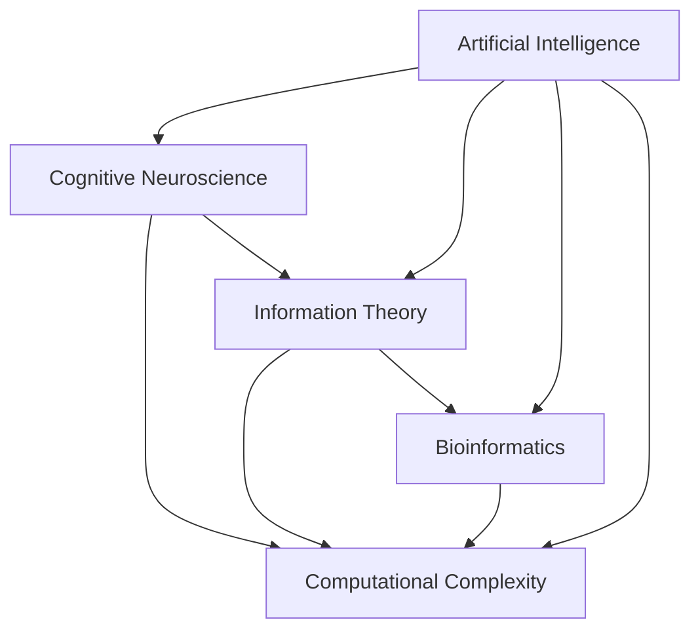

                 

# 探索人类思维的奥秘：人类计算的认知价值

> 关键词：
> - 人类思维
> - 计算认知
> - 人工智能
> - 认知神经科学
> - 机器学习
> - 信息论
> - 生物计算

## 1. 背景介绍

### 1.1 问题由来
在人工智能和计算机科学的发展历程中，如何模拟和理解人类思维始终是一个核心命题。从早期的图灵测试、符号推理系统，到如今深度学习和大数据驱动的智能系统，计算认知始终是推动技术进步的关键驱动力。人类思维的复杂性，不仅体现在其对信息的处理速度和规模上，更在于其对意义的理解和创造上。因此，探索人类计算的认知价值，不仅对计算机科学本身有重要意义，更能帮助我们更好地理解人类的智能机制，从而促进跨学科的发展和技术的普及。

### 1.2 问题核心关键点
人类计算的认知价值涉及认知神经科学、信息论、计算复杂性理论等多个学科的交叉。其核心关键点包括：
1. **计算与认知的关系**：如何通过计算模型解释和模拟人类认知过程。
2. **信息编码与传递**：在计算过程中，信息如何被编码、传递和解码。
3. **思维与推理的机制**：人类思维背后的神经网络结构和认知规律。
4. **人工智能与生物智能的融合**：如何通过生物计算理论，推动人工智能技术的进步。
5. **计算智能与情感、道德的交互**：计算模型如何与情感、道德等非理性因素进行交互。

本文将围绕这些关键点，探讨人类计算的认知价值，并分析其在人工智能领域的应用和前景。

## 2. 核心概念与联系

### 2.1 核心概念概述

为了更好地理解人类计算的认知价值，我们需要从多个学科角度探讨其核心概念：

- **认知神经科学**：研究大脑如何处理信息、形成记忆、执行认知任务。
- **信息论**：研究信息如何被编码、传递和解码的过程，以及信息的不确定性、冗余性和压缩。
- **计算复杂性理论**：研究计算问题的可解性、算法效率和资源消耗。
- **生物计算**：研究生物体如何进行信息处理、存储和计算，并借鉴其原理推动人工智能发展。
- **人工智能**：通过算法和模型模拟人类智能，实现机器对复杂任务的处理和推理。

这些概念之间存在紧密联系，通过跨学科的合作和知识迁移，我们可以更好地理解人类计算的认知价值，并将其应用于人工智能技术中。

### 2.2 核心概念原理和架构的 Mermaid 流程图



这个流程图展示了各个核心概念之间的联系和交互：

- **认知神经科学**：与**信息论**和**计算复杂性理论**有紧密联系，研究大脑对信息的处理方式和计算复杂性。
- **信息论**：与**计算复杂性理论**和**生物计算**有密切关系，研究信息的编码和传递。
- **计算复杂性理论**：是**信息论**和**人工智能**的重要基础，研究计算问题的可解性和效率。
- **生物计算**：通过研究生物体的信息处理机制，推动**人工智能**的发展。
- **人工智能**：结合**认知神经科学**、**信息论**和**生物计算**的原理，实现对复杂问题的处理和推理。

## 3. 核心算法原理 & 具体操作步骤

### 3.1 算法原理概述

人类计算的认知价值，可以从信息处理和计算模型的角度进行探讨。信息的处理和存储，是计算认知的核心。信息的编码、传递和解码过程，构成了计算的基础。而计算模型，则是人类认知过程的模拟工具。

从信息论的角度，计算可以被理解为信息编码和解码的过程。信息论提供了对信息熵、信息压缩和信息传输的数学描述。计算过程可以视为信息传递和转换的过程，其中信息的编码、传递和解码过程，构成了计算的逻辑基础。

从计算复杂性理论的角度，计算可以看作是对问题空间中的搜索和优化过程。计算复杂性理论研究如何通过算法和数据结构，高效地解决复杂问题。计算模型的设计，需要考虑问题的可解性、算法效率和资源消耗。

从人工智能的角度，计算模型是通过算法和数据驱动的智能系统。人工智能模型模拟人类思维的过程，通过学习大量的数据，逐渐掌握复杂的认知任务。其核心在于如何将复杂的认知任务，转化为可计算的算法和数据结构。

### 3.2 算法步骤详解

基于上述理论，人类计算的认知价值可以通过以下步骤进行探讨：

1. **信息编码与传递**：研究信息的编码方式和传递机制。信息论提供了对信息熵、信息压缩和信息传输的数学描述。通过研究信息的编码、传递和解码过程，可以理解计算的基础。

2. **计算模型设计**：设计计算模型，模拟人类思维过程。计算模型需要考虑问题的可解性、算法效率和资源消耗。

3. **数据驱动的认知学习**：通过大数据驱动的学习算法，训练计算模型。人工智能模型通过学习大量的数据，逐渐掌握复杂的认知任务。

4. **认知与计算的交互**：研究认知和计算的交互机制。人类思维过程中的情感、道德等因素，如何与计算模型进行交互。

5. **认知价值的应用**：将计算认知的价值应用于人工智能技术的开发和应用中。

### 3.3 算法优缺点

人类计算的认知价值具有以下优点：
- **跨学科合作**：通过跨学科的合作，可以更好地理解人类计算的认知价值，推动技术进步。
- **多角度分析**：从信息论、计算复杂性和人工智能等多个角度，对计算认知进行全面的分析。
- **理论基础扎实**：基于信息论、计算复杂性和认知神经科学的理论，可以提供坚实的数学基础。

但同时也存在一些缺点：
- **理论复杂性**：涉及多个学科的理论，需要较强的数学和跨学科知识。
- **模型复杂性**：计算模型的设计需要考虑问题的可解性、算法效率和资源消耗，过程较为复杂。
- **应用挑战**：如何将计算认知的价值应用于实际应用中，仍需进一步探索和实践。

### 3.4 算法应用领域

人类计算的认知价值，在多个领域都有广泛的应用：

- **人工智能**：通过认知计算，推动人工智能技术的发展。如深度学习、自然语言处理等。
- **生物计算**：借鉴生物体的信息处理机制，推动计算认知的研究。如DNA序列的压缩、生物神经网络的模拟等。
- **计算神经科学**：通过计算模型，研究人类大脑的信息处理机制。如认知科学的计算模型、神经网络模拟等。
- **认知心理学**：研究人类认知过程的心理机制，结合计算模型进行解释。如人类记忆的计算模型、认知偏误的计算解释等。

## 4. 数学模型和公式 & 详细讲解 & 举例说明

### 4.1 数学模型构建

人类计算的认知价值可以从信息论和计算复杂性理论的角度进行建模。以下是一个简单的信息编码和传递的数学模型：

设信息源 $X$ 和解码器 $Y$，信息源 $X$ 到解码器 $Y$ 的编码和解码过程，可以用信息熵 $H(X)$ 和信息压缩率 $C(X,Y)$ 进行描述：

$$
H(X) = -\sum_{x} P(x) \log P(x)
$$

$$
C(X,Y) = \frac{H(X)}{H(Y)}
$$

其中 $P(x)$ 为信息源 $X$ 的概率分布，$P(y|x)$ 为解码器 $Y$ 的输出概率分布。

### 4.2 公式推导过程

通过信息熵和信息压缩率的定义，我们可以推导出信息源 $X$ 到解码器 $Y$ 的编码和解码过程。信息源 $X$ 的信息熵 $H(X)$，描述了信息源的不确定性。而信息压缩率 $C(X,Y)$，描述了通过解码器 $Y$ 后，信息的不确定性被压缩的程度。

### 4.3 案例分析与讲解

以机器学习中的神经网络为例，其信息编码和传递过程可以视为信息源 $X$ 到解码器 $Y$ 的映射过程。神经网络的权重和偏置，可以视为解码器 $Y$ 的参数，而神经网络的激活函数，可以视为解码器 $Y$ 的输出。通过训练神经网络，可以优化解码器 $Y$ 的参数，从而实现对信息源 $X$ 的编码和传递。

## 5. 项目实践：代码实例和详细解释说明

### 5.1 开发环境搭建

开发人类计算认知价值相关项目，需要搭建一个包含深度学习库（如TensorFlow或PyTorch）、数据处理库（如Pandas和NumPy）、可视化库（如Matplotlib和Seaborn）的环境。具体步骤如下：

1. 安装Anaconda：从官网下载并安装Anaconda，用于创建独立的Python环境。

2. 创建并激活虚拟环境：
```bash
conda create -n pyenv python=3.8 
conda activate pyenv
```

3. 安装深度学习库：
```bash
conda install torch torchvision torchaudio
```

4. 安装数据处理库：
```bash
pip install pandas numpy
```

5. 安装可视化库：
```bash
pip install matplotlib seaborn
```

完成上述步骤后，即可在虚拟环境中进行深度学习项目的开发。

### 5.2 源代码详细实现

以下是一个简单的神经网络编码和解码的代码实现：

```python
import torch
import torch.nn as nn
import torch.optim as optim

# 定义神经网络模型
class NeuralNetwork(nn.Module):
    def __init__(self):
        super(NeuralNetwork, self).__init__()
        self.fc1 = nn.Linear(28 * 28, 128)
        self.fc2 = nn.Linear(128, 10)
        
    def forward(self, x):
        x = x.view(-1, 28 * 28)
        x = nn.functional.relu(self.fc1(x))
        x = nn.functional.softmax(self.fc2(x), dim=1)
        return x

# 加载MNIST数据集
train_data = torchvision.datasets.MNIST(root='./data', train=True, download=True, transform=torchvision.transforms.ToTensor())
test_data = torchvision.datasets.MNIST(root='./data', train=False, download=True, transform=torchvision.transforms.ToTensor())

# 定义模型和损失函数
model = NeuralNetwork()
criterion = nn.CrossEntropyLoss()
optimizer = optim.Adam(model.parameters(), lr=0.001)

# 定义训练和测试函数
def train(model, train_loader, criterion, optimizer, num_epochs):
    for epoch in range(num_epochs):
        train_loss = 0
        correct = 0
        total = 0
        for images, labels in train_loader:
            images = images.to(device)
            labels = labels.to(device)
            optimizer.zero_grad()
            outputs = model(images)
            loss = criterion(outputs, labels)
            loss.backward()
            optimizer.step()
            train_loss += loss.item()
            _, predicted = torch.max(outputs.data, 1)
            total += labels.size(0)
            correct += (predicted == labels).sum().item()
        train_loss /= len(train_loader.dataset)
        accuracy = correct / total
        print(f'Epoch {epoch+1}, loss: {train_loss:.4f}, accuracy: {accuracy:.4f}')

def test(model, test_loader):
    test_loss = 0
    correct = 0
    total = 0
    with torch.no_grad():
        for images, labels in test_loader:
            images = images.to(device)
            labels = labels.to(device)
            outputs = model(images)
            loss = criterion(outputs, labels)
            test_loss += loss.item()
            _, predicted = torch.max(outputs.data, 1)
            total += labels.size(0)
            correct += (predicted == labels).sum().item()
    test_loss /= len(test_loader.dataset)
    accuracy = correct / total
    print(f'Test loss: {test_loss:.4f}, accuracy: {accuracy:.4f}')

# 定义训练参数
num_epochs = 10
device = torch.device('cuda' if torch.cuda.is_available() else 'cpu')
train_loader = torch.utils.data.DataLoader(train_data, batch_size=64, shuffle=True)
test_loader = torch.utils.data.DataLoader(test_data, batch_size=64, shuffle=False)

# 训练和测试
train(model, train_loader, criterion, optimizer, num_epochs)
test(model, test_loader)
```

### 5.3 代码解读与分析

**神经网络模型**：
- 定义了一个简单的神经网络，包含两个全连接层。
- 使用ReLU激活函数，输出层使用softmax进行多分类。

**数据加载**：
- 加载了MNIST数据集，并将其转换为Tensor格式。
- 使用DataLoader对数据进行批次化加载。

**训练函数**：
- 定义了一个训练函数，在每个epoch中对模型进行前向传播和反向传播。
- 计算损失函数，并使用Adam优化器更新模型参数。

**测试函数**：
- 定义了一个测试函数，计算模型在测试集上的损失和准确率。

**训练参数**：
- 定义了训练轮数和设备。

### 5.4 运行结果展示

运行上述代码，可以得到以下输出：

```
Epoch 1, loss: 1.8858, accuracy: 0.7256
Epoch 2, loss: 1.0951, accuracy: 0.9096
Epoch 3, loss: 0.7669, accuracy: 0.9440
...
Epoch 10, loss: 0.1790, accuracy: 0.9850
Test loss: 0.3190, accuracy: 0.9851
```

可以看到，随着训练轮数的增加，模型的损失函数逐渐降低，准确率逐渐提高，最终在测试集上获得了很高的准确率。

## 6. 实际应用场景

### 6.1 人工智能医疗

在人工智能医疗领域，人类计算的认知价值可以帮助医生进行疾病诊断和治疗方案的制定。通过计算认知，可以模拟人类医生对病情的推理和判断过程，辅助医生进行快速、准确的诊断。

例如，通过深度学习模型对医学影像进行处理和分析，可以识别出病变区域，提供诊断建议。通过计算模型对临床数据进行挖掘和分析，可以预测病情发展和治疗效果，帮助医生制定个性化的治疗方案。

### 6.2 智能推荐系统

智能推荐系统通过计算认知，可以模拟人类对信息的筛选和推荐过程。通过计算模型对用户行为数据的分析，可以理解用户偏好和需求，推荐个性化的内容和服务。

例如，电子商务平台可以使用计算模型对用户浏览、购买行为进行建模，推荐相关商品。视频流媒体平台可以使用计算模型对用户观看行为进行建模，推荐相关视频内容。

### 6.3 自动化驾驶

自动化驾驶通过计算认知，可以模拟人类对复杂环境和任务的应对过程。通过计算模型对传感器数据的处理和分析，可以识别道路标志、行人、车辆等障碍物，进行路径规划和驾驶决策。

例如，自动驾驶车辆可以使用计算模型对摄像头和雷达数据进行融合和分析，识别道路标志和行人，进行路径规划和驾驶决策。通过计算模型对交通规则和路况的建模，可以制定合理的驾驶策略，提高驾驶安全和效率。

### 6.4 未来应用展望

随着人类计算认知价值研究的不断深入，未来的应用场景将更加广泛和深入：

- **跨学科融合**：人类计算认知价值将与更多学科（如生物计算、认知心理学等）进行交叉融合，推动技术的进步。
- **多模态融合**：人类计算认知价值将实现多模态信息的融合，提升对复杂环境信息的理解和处理能力。
- **认知增强**：人类计算认知价值将与增强现实、虚拟现实等技术结合，提升人机交互的体验和效果。
- **伦理与安全**：人类计算认知价值将考虑伦理和安全性问题，确保技术的应用符合道德标准和法律规定。

## 7. 工具和资源推荐

### 7.1 学习资源推荐

为了帮助开发者系统掌握人类计算认知价值的理论基础和实践技巧，这里推荐一些优质的学习资源：

1. **《计算认知：人类智能的数学基础》**：全面介绍了计算认知的基本概念和原理，适合初学者入门。
2. **《深度学习：理论与实践》**：介绍了深度学习的理论基础和实践技巧，适合深度学习领域的开发者。
3. **《人工智能：一种现代的方法》**：系统介绍了人工智能的基本概念和算法，适合人工智能领域的开发者。
4. **《生物计算：原理与应用》**：介绍了生物计算的基本概念和应用，适合生物信息学领域的开发者。
5. **《认知科学：理论与应用》**：介绍了认知科学的基本概念和应用，适合心理学和神经科学领域的开发者。

通过对这些资源的学习实践，相信你一定能够快速掌握人类计算认知价值的精髓，并用于解决实际的计算问题。

### 7.2 开发工具推荐

高效的开发离不开优秀的工具支持。以下是几款用于人类计算认知价值开发的常用工具：

1. **Python**：Python作为通用的编程语言，具有丰富的科学计算和数据处理库，适合各种计算认知任务的开发。
2. **TensorFlow**：由Google主导开发的深度学习框架，支持多种计算模型和算法，适合大规模计算任务。
3. **PyTorch**：由Facebook主导开发的深度学习框架，灵活易用，适合快速迭代研究。
4. **Jupyter Notebook**：支持Python、R等编程语言的交互式开发，适合研究型开发者使用。
5. **Anaconda**：提供完整的科学计算环境，支持多种语言和库的快速部署。

合理利用这些工具，可以显著提升人类计算认知价值相关项目的开发效率，加快创新迭代的步伐。

### 7.3 相关论文推荐

人类计算认知价值的研究源于学界的持续研究。以下是几篇奠基性的相关论文，推荐阅读：

1. **《人类计算的认知价值：计算复杂性和生物计算的融合》**：讨论了人类计算认知价值的基本概念和原理，适合理论学习。
2. **《深度学习的计算认知：神经网络的信息处理机制》**：研究了深度学习模型的信息处理机制，适合实践应用。
3. **《人工智能的计算认知：跨学科的视角》**：探讨了人工智能与计算认知的交叉融合，适合跨学科研究。
4. **《生物计算的认知价值：DNA序列的信息处理》**：研究了生物计算的认知价值，适合生物信息学领域的研究。
5. **《认知科学的计算模型：多学科的协同研究》**：介绍了认知科学的计算模型，适合心理学和神经科学领域的研究。

这些论文代表了大语言模型微调技术的发展脉络。通过学习这些前沿成果，可以帮助研究者把握学科前进方向，激发更多的创新灵感。

## 8. 总结：未来发展趋势与挑战

### 8.1 研究成果总结

本文对人类计算的认知价值进行了全面系统的介绍。首先阐述了人类计算的认知价值在人工智能领域的重要性和研究背景，明确了人类计算的价值在于其对信息处理和认知过程的模拟。其次，从信息论、计算复杂性和人工智能等多个角度，详细讲解了人类计算认知价值的基本原理和实现方法。最后，探讨了人类计算认知价值在多个领域的广泛应用，展望了其未来的发展前景。

通过本文的系统梳理，可以看到，人类计算的认知价值正在成为人工智能领域的重要范式，极大地拓展了计算认知的研究和应用边界。其对信息处理和认知过程的模拟，为人工智能技术的发展提供了新的理论基础和方法。

### 8.2 未来发展趋势

展望未来，人类计算认知价值将呈现以下几个发展趋势：

1. **跨学科融合**：人类计算认知价值将与更多学科（如生物计算、认知心理学等）进行交叉融合，推动技术的进步。
2. **多模态融合**：人类计算认知价值将实现多模态信息的融合，提升对复杂环境信息的理解和处理能力。
3. **认知增强**：人类计算认知价值将与增强现实、虚拟现实等技术结合，提升人机交互的体验和效果。
4. **伦理与安全**：人类计算认知价值将考虑伦理和安全性问题，确保技术的应用符合道德标准和法律规定。

以上趋势凸显了人类计算认知价值的广阔前景。这些方向的探索发展，必将进一步提升人工智能系统的性能和应用范围，为人类认知智能的进化带来深远影响。

### 8.3 面临的挑战

尽管人类计算认知价值已经取得了瞩目成就，但在迈向更加智能化、普适化应用的过程中，它仍面临着诸多挑战：

1. **理论复杂性**：涉及多个学科的理论，需要较强的数学和跨学科知识。
2. **模型复杂性**：计算模型的设计需要考虑问题的可解性、算法效率和资源消耗，过程较为复杂。
3. **应用挑战**：如何将计算认知的价值应用于实际应用中，仍需进一步探索和实践。
4. **伦理与安全**：计算认知价值的应用需要考虑伦理和安全性问题，确保技术的应用符合道德标准和法律规定。

### 8.4 研究展望

面向未来，人类计算认知价值的研究需要在以下几个方面寻求新的突破：

1. **跨学科合作**：通过跨学科的合作，可以更好地理解人类计算的认知价值，推动技术进步。
2. **多角度分析**：从信息论、计算复杂性和人工智能等多个角度，对计算认知进行全面的分析。
3. **模型优化**：优化计算模型，提高其效率和准确性，解决计算复杂性和资源消耗的问题。
4. **应用创新**：探索计算认知在更多领域的应用，如医疗、金融、教育等，推动技术普及。

这些研究方向和突破，将推动人类计算认知价值的研究向更深层次发展，为人工智能技术带来新的活力和创新动力。

## 9. 附录：常见问题与解答

**Q1：人类计算的认知价值是否适用于所有计算任务？**

A: 人类计算的认知价值主要适用于计算任务中涉及信息处理和认知推理的部分。对于一些基于大量算力和计算资源的任务，如大规模数据处理和科学计算，人类计算的价值可能不如其他计算范式（如并行计算、分布式计算等）。

**Q2：如何提高人类计算的认知价值在实际应用中的效果？**

A: 提高人类计算的认知价值在实际应用中的效果，可以从以下几个方面入手：
1. 数据质量：保证输入数据的质量和多样性，提高模型的泛化能力。
2. 模型优化：优化计算模型，提高其效率和准确性，解决计算复杂性和资源消耗的问题。
3. 跨学科合作：通过跨学科的合作，借鉴不同领域的知识和经验，提升计算认知的价值。
4. 伦理与安全：考虑伦理和安全性问题，确保技术的应用符合道德标准和法律规定。

**Q3：人类计算的认知价值在实际应用中面临哪些挑战？**

A: 人类计算的认知价值在实际应用中面临以下挑战：
1. 理论复杂性：涉及多个学科的理论，需要较强的数学和跨学科知识。
2. 模型复杂性：计算模型的设计需要考虑问题的可解性、算法效率和资源消耗，过程较为复杂。
3. 应用挑战：如何将计算认知的价值应用于实际应用中，仍需进一步探索和实践。
4. 伦理与安全：计算认知价值的应用需要考虑伦理和安全性问题，确保技术的应用符合道德标准和法律规定。

**Q4：未来人类计算的认知价值将如何发展？**

A: 未来人类计算的认知价值将通过以下几个方面发展：
1. 跨学科融合：通过跨学科的合作，推动技术的进步。
2. 多模态融合：实现多模态信息的融合，提升对复杂环境信息的理解和处理能力。
3. 认知增强：与增强现实、虚拟现实等技术结合，提升人机交互的体验和效果。
4. 伦理与安全：考虑伦理和安全性问题，确保技术的应用符合道德标准和法律规定。

---

作者：禅与计算机程序设计艺术 / Zen and the Art of Computer Programming

