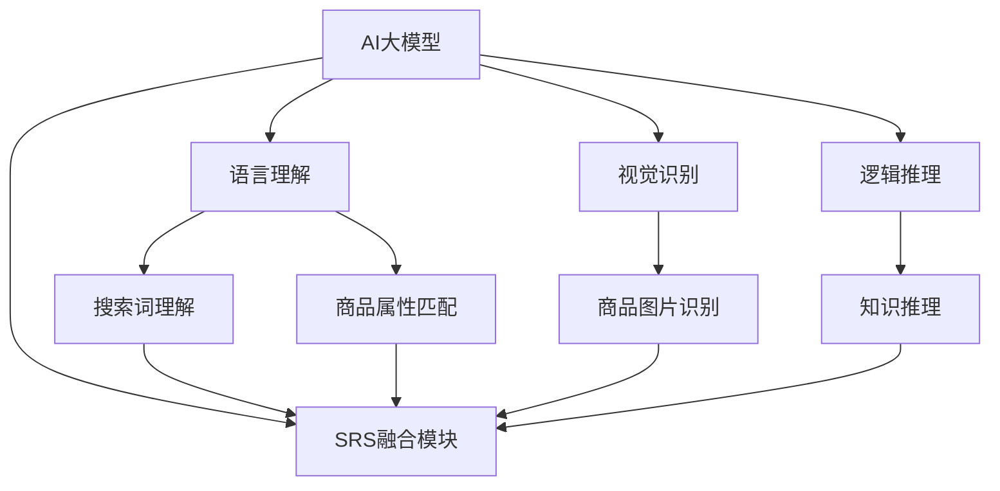

                 

# 搜索推荐系统的AI 大模型融合：电商平台的核心竞争优势与可持续发展

## 1. 背景介绍

随着电子商务的迅速发展，如何提升用户体验、优化交易转化，成为了电商平台的核心命题。搜索推荐系统（Search and Recommendation System, SRS）作为电商平台的核心组件，其核心目标是帮助用户快速准确地找到所需商品，同时引导用户发现潜在的购物需求，从而提升平台流量和交易转化率。

随着人工智能（AI）技术的发展，基于深度学习的推荐系统逐步替代传统的协同过滤等算法，成为推荐引擎的主流。大模型作为深度学习的重要形式，通过在海量数据上进行预训练，提取了丰富的数据表示，广泛应用于自然语言处理（NLP）、计算机视觉（CV）等领域的推荐任务中。本文将从AI大模型的融合角度出发，探讨其对电商平台搜索推荐系统的核心竞争优势与可持续发展，并给出实际应用场景与未来展望。

## 2. 核心概念与联系

### 2.1 核心概念概述

- **AI大模型**：基于深度学习技术，通过大规模数据训练得到的预训练模型，具备强大的特征提取能力和泛化能力。常见的AI大模型包括BERT、GPT、DALL·E等。
- **搜索推荐系统（SRS）**：电商平台的关键组件，通过理解用户搜索行为和商品特征，推荐给用户最相关和感兴趣的潜在商品。
- **深度学习**：一种基于神经网络的机器学习方法，通过多层非线性变换，从数据中提取高层次的特征表示。
- **强化学习（Reinforcement Learning, RL）**：通过与环境的互动，学习最优策略，从而实现自主决策和优化目标。
- **知识图谱（Knowledge Graph, KG）**：由节点和边构成的知识网络，用于描述实体和实体之间的关系，常用于增强推荐系统的逻辑推理能力。

通过AI大模型的融合，可以在搜索推荐系统中引入强大的语言理解、视觉识别和逻辑推理能力，提升推荐的准确性和个性化程度，从而更好地服务用户。

### 2.2 核心概念原理和架构的 Mermaid 流程图



这个流程图展示了AI大模型在搜索推荐系统中的作用：语言理解帮助解析搜索词和商品描述，视觉识别用于商品图片匹配，逻辑推理则用于复杂的用户行为和商品关联关系判断，最终通过SRS融合模块将这些能力有机地整合起来，提升推荐效果。

## 3. 核心算法原理 & 具体操作步骤

### 3.1 算法原理概述

AI大模型在搜索推荐系统中的应用，主要基于以下两个步骤：

1. **预训练**：通过大规模无标签数据训练，学习数据的隐含表示，提取高层次的特征。
2. **微调**：基于具体的应用场景和业务需求，对预训练模型进行微调，使其具备特定的任务能力。

### 3.2 算法步骤详解

1. **数据准备**：收集电商平台的搜索数据、商品数据、用户行为数据等，作为AI大模型的训练数据。
2. **模型选择与加载**：选择合适的AI大模型，如BERT、DALL·E等，通过库（如HuggingFace、OpenAI等）进行加载。
3. **数据预处理**：对收集到的数据进行清洗、归一化、分词等处理，准备好训练数据。
4. **微调训练**：将处理后的数据输入模型进行训练，不断调整模型参数，使其适应具体任务。
5. **模型评估**：在验证集上对微调后的模型进行评估，选择表现最好的模型进行后续应用。
6. **部署应用**：将微调后的模型部署到电商平台的搜索推荐系统中，进行实时推荐。

### 3.3 算法优缺点

#### 优点

- **提升推荐准确性**：大模型能够捕捉到数据中更深层次的语义和结构信息，提升推荐的准确性和个性化程度。
- **泛化能力强**：通过大规模预训练，大模型对数据变化的适应能力更强，能够在不同的应用场景中保持高效。
- **集成多样化能力**：大模型融合了语言理解、视觉识别、逻辑推理等多维度的能力，能够处理复杂的多模态数据。

#### 缺点

- **计算资源消耗大**：大模型的训练和微调需要大量的计算资源和存储资源。
- **数据依赖性强**：模型的效果很大程度上依赖于训练数据的质量和多样性，获取高质量标注数据成本较高。
- **模型复杂度高**：大模型参数量巨大，难以理解和调试，增加了系统实现的复杂度。

### 3.4 算法应用领域

AI大模型在搜索推荐系统中的应用领域非常广泛，包括但不限于以下几个方面：

- **文本推荐**：基于用户搜索词和商品描述，推荐最相关的商品。
- **图片推荐**：通过视觉识别技术，推荐与用户浏览图片相似的商品。
- **个性化推荐**：结合用户历史行为和当前搜索，提供个性化的商品推荐。
- **用户意图识别**：通过语言理解技术，识别用户搜索意图，优化推荐策略。
- **商品关系推理**：利用知识图谱，对商品进行复杂的逻辑推理，发现商品之间的潜在关系。

## 4. 数学模型和公式 & 详细讲解 & 举例说明

### 4.1 数学模型构建

以文本推荐为例，构建搜索推荐系统的数学模型：

假设用户输入搜索词为 $q$，商品集合为 $I$，每件商品的描述为 $d_i$，商品与用户历史行为的匹配度为 $s_i$。模型的目标是根据用户输入的搜索词，预测用户最可能感兴趣的商品 $i$，即最大化 $P(i|q)$。

### 4.2 公式推导过程

1. **嵌入表示**：将搜索词和商品描述转换为向量表示，使用BERT等大模型进行编码。
2. **匹配度计算**：计算每个商品与搜索词的匹配度，使用点积或其他相似度度量。
3. **softmax预测**：将每个商品的匹配度进行归一化，使用softmax函数得到商品 $i$ 被选择的概率。
4. **交叉熵损失**：定义损失函数为交叉熵，最小化预测值与真实标签之间的差异。

具体公式如下：

$$
\mathcal{L} = -\frac{1}{N} \sum_{i=1}^N \sum_{j=1}^M [y_{ij} \log P(i_j|q) + (1-y_{ij}) \log (1-P(i_j|q))]
$$

其中，$y_{ij}$ 为二进制标签，表示用户是否选择商品 $i_j$，$P(i_j|q)$ 为模型预测的商品选择概率。

### 4.3 案例分析与讲解

以电商平台为例，假设用户搜索“鞋子”，模型预测推荐商品1、2、3的概率分别为0.8、0.2、0.1。模型的预测结果为：

| 商品编号 | 推荐概率 |
|---|---|
| 1 | 0.8 |
| 2 | 0.2 |
| 3 | 0.1 |

最终选择商品1作为推荐结果。

## 5. 项目实践：代码实例和详细解释说明

### 5.1 开发环境搭建

1. **安装Python环境**：创建虚拟环境，安装所需的Python库，如TensorFlow、PyTorch、HuggingFace等。
2. **数据准备**：收集电商平台的搜索数据、商品数据、用户行为数据等，进行清洗和预处理。
3. **模型选择与加载**：选择BERT等预训练模型，使用HuggingFace等库进行加载。

### 5.2 源代码详细实现

以下是一个简单的基于BERT的文本推荐模型的代码实现：

```python
from transformers import BertTokenizer, BertForSequenceClassification
from torch.utils.data import DataLoader
from sklearn.metrics import accuracy_score
from transformers import AdamW

# 加载BERT模型和分词器
tokenizer = BertTokenizer.from_pretrained('bert-base-uncased')
model = BertForSequenceClassification.from_pretrained('bert-base-uncased', num_labels=2)

# 数据准备
train_dataset = ...
train_loader = DataLoader(train_dataset, batch_size=32, shuffle=True)

# 定义损失函数和优化器
criterion = CrossEntropyLoss()
optimizer = AdamW(model.parameters(), lr=2e-5)

# 模型训练
device = torch.device('cuda') if torch.cuda.is_available() else torch.device('cpu')
model.to(device)

for epoch in range(epochs):
    model.train()
    for batch in train_loader:
        inputs, labels = batch
        inputs = inputs.to(device)
        labels = labels.to(device)
        outputs = model(inputs)
        loss = criterion(outputs, labels)
        optimizer.zero_grad()
        loss.backward()
        optimizer.step()
```

### 5.3 代码解读与分析

上述代码中，首先加载了预训练的BERT模型和分词器，然后准备训练数据，定义损失函数和优化器，最后将模型迁移到GPU上，开始训练。训练过程中，使用AdamW优化器，交叉熵损失函数，通过反向传播更新模型参数。

### 5.4 运行结果展示

训练过程中，每轮迭代会输出当前的训练loss和验证loss，最终在验证集上评估模型的准确性。可以通过绘图工具（如Matplotlib）来可视化训练过程，找到最佳的训练轮数。

## 6. 实际应用场景

### 6.1 商品推荐

在商品推荐场景中，通过融合大模型的视觉识别能力，可以对商品图片进行特征提取，生成图像特征向量，从而在商品之间建立更强的关联。具体而言，可以在商品图片上应用CNN模型进行特征提取，然后将图像特征向量与文本特征向量拼接，输入到推荐模型中进行训练。

### 6.2 个性化推荐

个性化推荐系统能够根据用户的历史行为和当前搜索行为，推荐符合用户兴趣的商品。通过融合大模型的语言理解能力，可以对用户输入的搜索词进行语义分析，挖掘用户的潜在需求。例如，用户搜索“夏季运动鞋”，模型可以进一步推断出用户对户外运动鞋的需求，并推荐相关的商品。

### 6.3 用户意图识别

用户意图识别是推荐系统的重要组成部分，通过融合大模型的语言理解能力，可以更准确地理解用户的搜索意图，从而优化推荐策略。例如，用户搜索“iPhone 12”，模型可以推断出用户对手机配件的需求，并推荐相关的商品。

### 6.4 商品关系推理

商品关系推理是推荐系统中的高级功能，通过融合大模型的逻辑推理能力，可以在复杂的商品关系中发现潜在的联系。例如，基于知识图谱，模型可以推断出某个商品是另一个商品的核心组件，从而进行推荐。

## 7. 工具和资源推荐

### 7.1 学习资源推荐

1. **《深度学习》**：Ian Goodfellow等著，详细介绍了深度学习的基本原理和应用。
2. **《机器学习实战》**：Peter Harrington著，提供了大量的实践案例和代码示例。
3. **HuggingFace官方文档**：提供了各种预训练模型的文档和样例代码，是学习大模型的重要资源。
4. **DeepLearning.AI**：Andrew Ng等开设的深度学习课程，内容全面，适合初学者和进阶者。

### 7.2 开发工具推荐

1. **TensorFlow**：Google开源的深度学习框架，支持分布式训练，适用于大规模模型。
2. **PyTorch**：Facebook开源的深度学习框架，易用性强，适用于研究和原型开发。
3. **Keras**：高层次的深度学习框架，易于上手，适用于快速原型开发。
4. **Jupyter Notebook**：交互式编程环境，支持代码展示和可视化。
5. **GitHub**：代码托管平台，支持版本控制和协作开发。

### 7.3 相关论文推荐

1. **Attention Is All You Need**：Vaswani等著，提出Transformer模型，奠定了大模型的基础。
2. **BERT: Pre-training of Deep Bidirectional Transformers for Language Understanding**：Devlin等著，提出BERT模型，提升了自然语言处理的效果。
3. **FastText**：Joulin等著，提出FastText算法，用于文本分类和相似性计算。
4. **Wide & Deep Learning for Recommender Systems**：Chen等著，提出Wide & Deep模型，提升了推荐系统的效果。
5. **LSTM: A Search Space Odyssey**：Hochreiter等著，提出LSTM模型，适用于处理序列数据。

## 8. 总结：未来发展趋势与挑战

### 8.1 研究成果总结

AI大模型在搜索推荐系统中的应用，已经取得了显著的成效。通过融合大模型的语言理解、视觉识别和逻辑推理能力，提升了推荐的准确性和个性化程度。然而，仍然面临计算资源消耗大、数据依赖性强等挑战，需要进一步探索优化策略。

### 8.2 未来发展趋势

未来，AI大模型在搜索推荐系统中的应用将呈现以下几个趋势：

1. **多模态融合**：融合文本、图像、视频等多模态数据，提升推荐的综合能力。
2. **实时推荐**：通过流式计算和缓存技术，实现实时推荐，提升用户体验。
3. **自适应推荐**：结合强化学习等技术，实现动态调整推荐策略，提升推荐效果。
4. **知识图谱增强**：利用知识图谱进行逻辑推理，提升推荐的逻辑性和可靠性。

### 8.3 面临的挑战

AI大模型在搜索推荐系统中的应用仍然面临以下挑战：

1. **计算资源消耗大**：大模型的训练和微调需要大量的计算资源和存储资源。
2. **数据依赖性强**：模型的效果很大程度上依赖于训练数据的质量和多样性，获取高质量标注数据成本较高。
3. **模型复杂度高**：大模型参数量巨大，难以理解和调试，增加了系统实现的复杂度。

### 8.4 研究展望

未来的研究应重点关注以下几个方面：

1. **模型压缩与优化**：通过模型剪枝、量化等技术，降低模型参数量，提升计算效率。
2. **数据增强与清洗**：利用数据增强技术，扩充训练数据，提高模型泛化能力。
3. **自适应推荐算法**：结合强化学习等技术，实现动态调整推荐策略，提升推荐效果。
4. **跨模态推荐算法**：融合文本、图像、视频等多模态数据，提升推荐的综合能力。
5. **知识图谱增强**：利用知识图谱进行逻辑推理，提升推荐的逻辑性和可靠性。

通过这些研究方向的探索，AI大模型在搜索推荐系统中的应用将进一步提升，为电商平台带来更大的商业价值。

## 9. 附录：常见问题与解答

### Q1: AI大模型在搜索推荐系统中是如何进行微调的？

A: AI大模型在搜索推荐系统中的微调，主要基于以下步骤：

1. **数据准备**：收集电商平台的搜索数据、商品数据、用户行为数据等，作为AI大模型的训练数据。
2. **模型选择与加载**：选择合适的AI大模型，如BERT、DALL·E等，通过库（如HuggingFace、OpenAI等）进行加载。
3. **数据预处理**：对收集到的数据进行清洗、归一化、分词等处理，准备好训练数据。
4. **微调训练**：将处理后的数据输入模型进行训练，不断调整模型参数，使其适应具体任务。
5. **模型评估**：在验证集上对微调后的模型进行评估，选择表现最好的模型进行后续应用。

### Q2: 如何缓解AI大模型在搜索推荐系统中的过拟合问题？

A: 缓解AI大模型在搜索推荐系统中的过拟合问题，可以采取以下策略：

1. **数据增强**：通过回译、近义替换等方式扩充训练集，增加数据多样性。
2. **正则化**：使用L2正则、Dropout等技术，防止模型过拟合。
3. **对抗训练**：引入对抗样本，提高模型鲁棒性，避免过拟合。
4. **参数高效微调**：只调整少量参数，减小过拟合风险，提高模型泛化能力。

### Q3: 如何将AI大模型融入电商平台的搜索推荐系统？

A: 将AI大模型融入电商平台的搜索推荐系统，主要包括以下步骤：

1. **数据准备**：收集电商平台的搜索数据、商品数据、用户行为数据等，作为AI大模型的训练数据。
2. **模型选择与加载**：选择合适的AI大模型，如BERT、DALL·E等，通过库（如HuggingFace、OpenAI等）进行加载。
3. **数据预处理**：对收集到的数据进行清洗、归一化、分词等处理，准备好训练数据。
4. **微调训练**：将处理后的数据输入模型进行训练，不断调整模型参数，使其适应具体任务。
5. **模型评估**：在验证集上对微调后的模型进行评估，选择表现最好的模型进行后续应用。

### Q4: 如何在电商平台上实现多模态推荐？

A: 在电商平台上实现多模态推荐，主要包括以下步骤：

1. **融合多模态数据**：将文本、图像、视频等多模态数据进行融合，生成统一的特征表示。
2. **建立多模态模型**：使用多模态深度学习模型，如FAN模型、CrossNet等，进行特征融合和推荐。
3. **优化推荐策略**：结合用户历史行为和当前搜索行为，进行动态调整推荐策略。
4. **评估推荐效果**：使用用户反馈、点击率、转化率等指标，评估推荐效果。

### Q5: 如何在电商平台上实现实时推荐？

A: 在电商平台上实现实时推荐，主要包括以下步骤：

1. **流式数据处理**：使用流式计算技术，实时处理用户行为数据。
2. **缓存机制**：使用缓存技术，存储常用推荐结果，提升推荐速度。
3. **动态调整**：结合用户行为实时更新推荐策略，提升推荐效果。
4. **实时评估**：使用实时监控工具，评估推荐效果，动态调整策略。

---

作者：禅与计算机程序设计艺术 / Zen and the Art of Computer Programming

