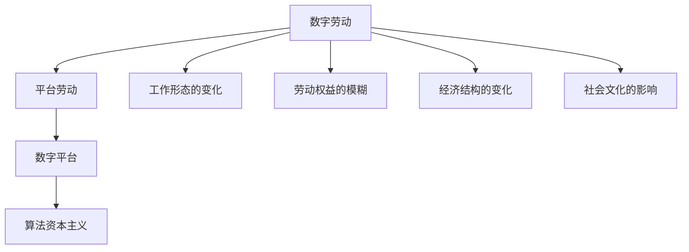

                 

# 数字劳动：人类计算的社会和经济影响

## 1. 背景介绍

### 1.1 问题由来

在数字化浪潮的推动下，现代经济正经历着深刻的结构变革。互联网、大数据、人工智能等技术的广泛应用，不仅改变了企业的生产方式，也重塑了人们的工作模式。在这一过程中，数字劳动的概念应运而生。

数字劳动是指通过数字工具和互联网平台，进行信息收集、数据处理、知识生产和创造性工作。它打破了传统的雇佣关系，形成了以平台为中心的“虚拟办公室”。数字劳动的兴起，不仅影响着个体的工作方式和心理状态，也对社会经济结构、劳动关系和文化价值提出了新的挑战。

### 1.2 问题核心关键点

当前，数字劳动现象已经成为全球关注的焦点。其核心问题在于：

1. **工作形态的变化**：数字劳动将个体嵌入到互联网平台和算法系统中，改变了传统的雇佣、协作和激励机制。
2. **劳动权益的模糊**：数字劳动者的身份和权利定义不明确，其劳动成果往往被平台和第三方算法所“劫持”，导致劳动权益难以保障。
3. **经济结构的变化**：数字劳动平台构建起新的生产关系，对传统的产业链和供应链产生了深刻影响。
4. **社会文化的影响**：数字劳动改变了人们的时间管理、消费行为和社交模式，对社会文化产生了深远影响。

本文将深入探讨数字劳动的概念、机制和影响，通过理论分析和实际案例，剖析数字劳动的社会和经济效应，为未来的劳动和社会政策提供参考。

## 2. 核心概念与联系

### 2.1 核心概念概述

为了更好地理解数字劳动现象，我们首先需要明确几个核心概念：

- **数字劳动**：指通过数字工具和互联网平台进行的信息收集、数据处理、知识生产和创造性工作。
- **平台劳动**：指个体通过互联网平台（如电商平台、内容平台、工作平台等）进行的工作形式，其劳动过程和劳动成果都在平台控制下完成。
- **数字平台**：指提供数字劳动资源和交易的互联网平台，如谷歌、亚马逊、Facebook等。
- **算法资本主义**：指以数据和算法为核心的新型资本形态，强调通过数据驱动的决策和自动化流程来优化资源配置和生产效率。

这些概念之间的逻辑关系可以通过以下Mermaid流程图来展示：



这个流程图展示了数字劳动从个体行为到社会经济结构的全过程。数字劳动通过平台劳动进入数字平台，在算法资本主义的框架下被组织和利用。同时，数字劳动的变化也引发了工作形态、劳动权益、经济结构和文化的深层次变动。

## 3. 核心算法原理 & 具体操作步骤

### 3.1 算法原理概述

数字劳动的算法原理主要体现在两个方面：平台资源调度和个体劳动管理。

**平台资源调度**：平台通过数据和算法，动态调配资源，优化生产流程。以亚马逊为例，通过推荐算法优化库存管理和订单处理，提高了物流效率和客户满意度。

**个体劳动管理**：平台通过算法，实时监控个体劳动效率，并根据完成任务的速度和质量进行激励或惩罚。以Uber为例，通过GPS数据和评价系统，平台可以精确控制司机的在线时间和服务质量。

### 3.2 算法步骤详解

数字劳动的算法步骤通常包括以下几个关键步骤：

**Step 1: 数据收集与处理**
- 平台收集用户行为数据、地理位置数据、交易数据等，通过数据清洗和预处理，形成可用的数据集。

**Step 2: 算法训练与部署**
- 使用机器学习算法（如决策树、深度学习等）对数据集进行训练，形成预测模型或优化算法。
- 将训练好的模型部署到生产环境，实时处理和分析用户行为。

**Step 3: 用户行为监控与反馈**
- 平台实时监控用户行为，生成反馈信息，根据用户表现调整任务分配和激励策略。
- 通过数据分析，识别用户需求和行为模式，优化产品和功能。

**Step 4: 用户激励与协作**
- 平台设计激励机制，如佣金、奖励、排行榜等，鼓励用户提高劳动效率和质量。
- 利用协作算法，如协同过滤、众包算法等，促进用户之间的合作与竞争。

### 3.3 算法优缺点

数字劳动的算法具有以下优点：

1. **高效性**：算法可以快速处理大量数据，优化资源配置，提高生产效率。
2. **实时性**：算法能够实时监控和调整劳动过程，提高劳动管理效率。
3. **精确性**：算法可以精确分析用户行为，提供个性化的服务体验。

但同时，算法也存在一些问题：

1. **依赖性强**：算法的效率和性能高度依赖于数据质量，数据偏差可能导致算法失效。
2. **透明性不足**：算法决策过程复杂，个体难以理解和解释，可能产生信任危机。
3. **公平性问题**：算法可能放大个体间的差距，导致资源分配不公平。
4. **隐私风险**：数据收集和处理过程中，可能泄露用户隐私，导致数据安全和隐私保护问题。

### 3.4 算法应用领域

数字劳动的算法应用广泛，涵盖各个行业，以下是几个典型应用领域：

- **电商领域**：电商平台通过推荐算法和库存管理系统，优化库存和物流，提升销售效率。
- **内容平台**：内容平台如YouTube、Bilibili通过个性化推荐算法，提高用户粘性和平台流量。
- **工作平台**：工作平台如Upwork、Freelancer通过任务分配和评估系统，优化人力资源配置。
- **物流领域**：物流公司通过GPS跟踪和调度算法，优化配送路径，提高物流效率。

这些应用领域展示了数字劳动算法的广泛性和实用性，但也带来了新的社会和经济问题。

## 4. 数学模型和公式 & 详细讲解

### 4.1 数学模型构建

数字劳动的数学模型可以分解为以下几个部分：

- **用户行为模型**：描述用户在平台上的行为模式和决策过程。
- **资源调度模型**：描述平台资源（如时间、人力、物流等）的分配和调度。
- **激励机制模型**：描述平台对个体劳动的激励和惩罚机制。
- **协作与竞争模型**：描述个体间协作和竞争的关系和模式。

### 4.2 公式推导过程

以推荐系统为例，推荐算法的核心在于用户行为模型和资源调度模型的融合。假设用户行为可以用向量$u$表示，商品特性可以用向量$i$表示，用户与商品的交互可以用矩阵$P$表示。则推荐算法可以表示为：

$$
\hat{u_i} = u \cdot P_i / \sqrt{\sum_j P_{ij}^2}
$$

其中，$\cdot$表示向量点积，$\sqrt{\cdot}$表示向量的欧几里得范数。

该公式展示了推荐系统通过用户行为和商品特性，预测用户对商品的兴趣度。通过不断迭代优化，算法能够精准地匹配用户和商品，提升推荐效果。

### 4.3 案例分析与讲解

以电商平台的推荐系统为例，算法通过分析用户浏览、购买、评价等行为，预测其对商品的兴趣度。算法会自动调整推荐列表，优先展示用户可能感兴趣的商品。通过用户点击和购买的反馈信息，算法不断优化模型参数，提高推荐的准确性。

## 5. 项目实践：代码实例和详细解释说明

### 5.1 开发环境搭建

在进行数字劳动算法实践前，我们需要准备好开发环境。以下是使用Python进行Scikit-learn和TensorFlow开发的环境配置流程：

1. 安装Anaconda：从官网下载并安装Anaconda，用于创建独立的Python环境。

2. 创建并激活虚拟环境：
```bash
conda create -n digital-labor python=3.8 
conda activate digital-labor
```

3. 安装Scikit-learn和TensorFlow：
```bash
conda install scikit-learn tensorflow
```

4. 安装各类工具包：
```bash
pip install numpy pandas scikit-learn matplotlib tqdm jupyter notebook ipython
```

完成上述步骤后，即可在`digital-labor`环境中开始数字劳动算法实践。

### 5.2 源代码详细实现

下面我们以电商平台推荐系统为例，给出使用Scikit-learn和TensorFlow进行用户行为预测的PyTorch代码实现。

首先，定义用户行为数据集：

```python
import pandas as pd
from sklearn.model_selection import train_test_split

# 加载用户行为数据集
df = pd.read_csv('user_behavior.csv')

# 定义特征和标签
features = ['浏览时间', '购买金额', '评价星级']
target = '购买商品'

# 划分训练集和测试集
X_train, X_test, y_train, y_test = train_test_split(df[features], df[target], test_size=0.2, random_state=42)
```

然后，定义模型和优化器：

```python
from tensorflow.keras.layers import Dense, Input, Embedding
from tensorflow.keras.models import Model

# 定义模型结构
input_layer = Input(shape=(features.shape[1],))
embedding_layer = Embedding(input_dim=features.shape[1], output_dim=64, input_length=features.shape[1])(input_layer)
hidden_layer = Dense(64, activation='relu')(embedding_layer)
output_layer = Dense(1, activation='sigmoid')(hidden_layer)

model = Model(inputs=input_layer, outputs=output_layer)
model.compile(optimizer='adam', loss='binary_crossentropy', metrics=['accuracy'])
```

接着，定义训练和评估函数：

```python
def train_epoch(model, X, y, batch_size, epochs):
    dataloader = tf.data.Dataset.from_tensor_slices((X, y)).shuffle(1000).batch(batch_size)
    for epoch in range(epochs):
        for batch in dataloader:
            X_batch, y_batch = batch
            with tf.GradientTape() as tape:
                logits = model(X_batch)
                loss = tf.losses.binary_crossentropy(y_batch, logits)
            grads = tape.gradient(loss, model.trainable_variables)
            optimizer.apply_gradients(zip(grads, model.trainable_variables))
        print(f'Epoch {epoch+1}, loss: {loss:.4f}, acc: {tf.keras.metrics.Accuracy()(y_batch, tf.round(logits)).numpy():.4f}')

def evaluate(model, X, y, batch_size):
    dataloader = tf.data.Dataset.from_tensor_slices((X, y)).batch(batch_size)
    accuracy = tf.keras.metrics.Accuracy()
    for batch in dataloader:
        X_batch, y_batch = batch
        logits = model(X_batch)
        accuracy.update_state(y_batch, tf.round(logits))
    print(f'Accuracy: {accuracy.result().numpy():.4f}')
```

最后，启动训练流程并在测试集上评估：

```python
epochs = 10
batch_size = 32

train_epoch(model, X_train, y_train, batch_size, epochs)
evaluate(model, X_test, y_test, batch_size)
```

以上就是使用Scikit-learn和TensorFlow对电商平台推荐系统进行用户行为预测的完整代码实现。可以看到，得益于Scikit-learn和TensorFlow的强大封装，我们可以用相对简洁的代码完成数字劳动算法的实现。

### 5.3 代码解读与分析

让我们再详细解读一下关键代码的实现细节：

**用户行为数据集定义**：
- `pd.read_csv`方法：用于从CSV文件中加载用户行为数据。
- `train_test_split`方法：用于将数据集划分为训练集和测试集。

**模型结构定义**：
- `Input`层：用于定义输入层，设置输入特征的维度和形状。
- `Embedding`层：用于将稀疏的输入特征转换为密集的向量表示。
- `Dense`层：用于定义隐藏层，使用ReLU激活函数。
- `Dense`层：用于定义输出层，使用Sigmoid激活函数，输出二分类结果。

**模型训练和评估函数**：
- `train_epoch`函数：用于训练模型，设置批量大小、迭代次数等参数。
- `evaluate`函数：用于评估模型，计算准确率等指标。

**训练流程**：
- 定义总的迭代次数和批量大小，开始循环迭代
- 在每个epoch内，对训练集进行前向传播和反向传播，更新模型参数
- 在每个epoch后，输出损失和准确率
- 所有epoch结束后，在测试集上评估模型性能

可以看到，Scikit-learn和TensorFlow结合使用，使得数字劳动算法的代码实现变得简洁高效。开发者可以将更多精力放在数据处理、模型改进等高层逻辑上，而不必过多关注底层的实现细节。

当然，工业级的系统实现还需考虑更多因素，如模型的保存和部署、超参数的自动搜索、更灵活的任务适配层等。但核心的算法范式基本与此类似。

## 6. 实际应用场景

### 6.1 电商推荐系统

数字劳动算法在电商推荐系统中得到了广泛应用。电商平台通过分析用户行为数据，精准预测用户需求，提供个性化推荐。这不仅提高了用户满意度，也提升了销售转化率。

以Amazon为例，通过用户浏览、购买、评价等行为数据，Amazon的推荐系统能够实时调整商品推荐列表，增加用户点击率和购买概率。Amazon的推荐系统采用协同过滤、基于内容的推荐等多种算法，结合用户画像和商品特性，为用户推荐最相关的商品。

### 6.2 内容推荐平台

内容推荐平台如YouTube、Netflix等，利用数字劳动算法为用户提供个性化视频和电影推荐。平台通过分析用户观看记录、评分数据等，预测用户对不同内容的偏好，优化推荐结果。

以YouTube为例，平台通过机器学习算法，分析用户观看历史和点击记录，预测用户可能感兴趣的视频内容。YouTube的推荐算法不仅能推荐单个视频，还能推荐相关的频道、播放列表和广告，形成完整的推荐生态。

### 6.3 工作平台

工作平台如Upwork、Freelancer等，利用数字劳动算法优化任务分配和人力资源配置。平台通过分析历史任务完成数据，预测用户完成任务的效率和质量，动态调整任务分配和激励策略。

以Upwork为例，平台通过机器学习算法，分析用户提交的任务和评价数据，预测用户完成任务的准确性和及时性。Upwork的推荐算法能够根据用户历史表现，推荐最适合的任务，提高任务完成率和用户满意度。

### 6.4 未来应用展望

随着数字劳动算法的不断发展，其在更多领域的应用前景广阔：

1. **智慧医疗**：数字劳动算法在医疗领域可以用于病历分析、药物研发等。通过分析患者数据，预测疾病发展趋势，推荐最佳治疗方案，提高医疗服务的智能化水平。
2. **教育领域**：数字劳动算法可以用于智能推荐、作业批改、学习路径优化等。通过分析学生数据，推荐最适合的学习资源，优化教学过程，提升学习效果。
3. **智慧城市**：数字劳动算法可以用于城市事件监测、交通管理、公共服务优化等。通过分析城市数据，优化城市资源配置，提升城市管理的智能化水平。
4. **金融领域**：数字劳动算法可以用于金融舆情监测、风险预测、投资分析等。通过分析金融数据，预测市场趋势，优化投资决策，降低金融风险。

数字劳动算法的广泛应用，必将带来新的产业变革和社会变化。未来，数字劳动算法将与更多的行业领域深度融合，推动数字化转型进程。

## 7. 工具和资源推荐

### 7.1 学习资源推荐

为了帮助开发者系统掌握数字劳动算法，以下是一些优质的学习资源：

1. 《深度学习入门：基于Python的理论与实现》书籍：该书系统介绍了深度学习的基础理论，并提供了丰富的代码示例，适合初学者入门。
2. 《机器学习实战》书籍：该书通过实际项目，讲解了机器学习算法的应用，提供了详细的代码实现，适合进阶学习。
3. Coursera《机器学习》课程：由斯坦福大学开设的机器学习课程，涵盖了机器学习的基本概念和常用算法。
4. Kaggle平台：提供了大量的数据集和比赛项目，适合学习数据处理和算法应用。
5. Scikit-learn官方文档：提供了Scikit-learn库的详细使用方法和案例分析，是学习数字劳动算法的必备资源。

通过这些资源的学习实践，相信你一定能够快速掌握数字劳动算法的精髓，并用于解决实际的NLP问题。

### 7.2 开发工具推荐

高效的开发离不开优秀的工具支持。以下是几款用于数字劳动算法开发的常用工具：

1. Scikit-learn：Python中的机器学习库，提供了丰富的算法实现和工具支持，是数字劳动算法开发的利器。
2. TensorFlow：Google主导的深度学习框架，提供了灵活的计算图和高效的训练工具，适合大规模工程应用。
3. Jupyter Notebook：免费的交互式编程环境，支持多种语言和库，方便开发者进行实验和展示。
4. Weights & Biases：模型训练的实验跟踪工具，可以记录和可视化模型训练过程中的各项指标，方便对比和调优。
5. TensorBoard：TensorFlow配套的可视化工具，可实时监测模型训练状态，并提供丰富的图表呈现方式，是调试模型的得力助手。

合理利用这些工具，可以显著提升数字劳动算法的开发效率，加快创新迭代的步伐。

### 7.3 相关论文推荐

数字劳动算法的研究源于学界的持续研究。以下是几篇奠基性的相关论文，推荐阅读：

1. "Recommender Systems Handbook"：系统总结了推荐系统的理论和算法，提供了全面的应用案例。
2. "Deep Learning for Recommender Systems"：介绍了深度学习在推荐系统中的应用，提供了算法实现的详细代码。
3. "Data-Driven Decision Making with Recommender Systems"：探讨了推荐系统在决策支持中的应用，提供了理论和实践的深入分析。
4. "Collaborative Filtering in Recommender Systems"：讲解了协同过滤算法的工作原理和实现方法，是推荐系统的重要基础。
5. "Adaptive Learning in Recommender Systems"：研究了推荐系统中的自适应学习算法，提供了提升推荐效果的新思路。

这些论文代表了大数据和数字劳动算法的发展脉络。通过学习这些前沿成果，可以帮助研究者把握学科前进方向，激发更多的创新灵感。

## 8. 总结：未来发展趋势与挑战

### 8.1 总结

本文对数字劳动的概念、机制和影响进行了全面系统的介绍。首先阐述了数字劳动的定义和背景，明确了其在现代社会中的重要地位。其次，从原理到实践，详细讲解了数字劳动算法的数学模型和具体实现步骤，给出了数字劳动算法开发的完整代码实例。同时，本文还广泛探讨了数字劳动算法在电商、内容平台、工作平台等多个领域的应用前景，展示了其广泛的应用价值。此外，本文精选了数字劳动算法的各类学习资源，力求为读者提供全方位的技术指引。

通过本文的系统梳理，可以看到，数字劳动算法正在成为推动现代社会变革的重要力量。它在提升生产效率、优化资源配置、改善用户体验等方面发挥了巨大作用，但也带来了新的社会和经济问题。未来，伴随数字劳动算法的不断发展，我们需在提高算法效率、保障劳动者权益、优化算法治理等方面不断努力，才能实现数字劳动的可持续发展。

### 8.2 未来发展趋势

展望未来，数字劳动算法将呈现以下几个发展趋势：

1. **智能化水平的提升**：随着深度学习和大数据技术的不断进步，数字劳动算法的智能化水平将进一步提高。通过更复杂的算法模型和多模态数据融合，数字劳动算法将能更准确地预测用户行为，提供更个性化的服务。
2. **跨领域应用的拓展**：数字劳动算法将从电商、内容平台等领域，向更多垂直行业扩展，如医疗、教育、金融等，形成广泛的应用生态。
3. **伦理道德的重视**：数字劳动算法将更加注重伦理道德问题，通过算法透明、数据保护和用户隐私等措施，保障用户的合法权益。
4. **隐私保护技术的进步**：数字劳动算法将结合隐私保护技术，如差分隐私、联邦学习等，保障用户数据安全和隐私权益。
5. **协作与竞争的新模式**：数字劳动算法将探索协作与竞争的新机制，通过公平激励和协作算法，促进用户之间的良性互动。

这些趋势凸显了数字劳动算法的广阔前景。这些方向的探索发展，必将进一步提升数字劳动算法的性能和应用范围，为构建更加智能、公平、安全的数字社会奠定基础。

### 8.3 面临的挑战

尽管数字劳动算法已经取得了显著成就，但在迈向更加智能化、普适化应用的过程中，它仍面临诸多挑战：

1. **数据隐私和安全**：数字劳动算法依赖大量用户数据，如何保障数据隐私和安全是一个重要问题。需要结合隐私保护技术，确保用户数据不被滥用。
2. **算法公平性**：数字劳动算法可能放大个体间的差距，导致资源分配不公平。如何设计公平的激励机制，保障用户权益，是一个重要课题。
3. **算法透明性**：数字劳动算法的决策过程复杂，个体难以理解和解释，可能产生信任危机。如何提高算法的透明度，增强用户信任，是未来的重要方向。
4. **用户依赖问题**：数字劳动算法依赖用户行为数据，如何缓解用户依赖，减少对平台算法的依赖，是未来的一个重要挑战。
5. **道德和伦理问题**：数字劳动算法可能带来新的伦理和道德问题，如数据歧视、算法偏见等。如何构建公平、透明的算法治理体系，是未来的重要任务。

### 8.4 研究展望

面对数字劳动算法所面临的种种挑战，未来的研究需要在以下几个方面寻求新的突破：

1. **隐私保护技术的研究**：结合差分隐私、联邦学习等隐私保护技术，保障用户数据安全和隐私权益。
2. **公平性算法的设计**：探索公平性算法，通过平衡算法参数和用户特征，设计更加公平的激励机制。
3. **透明性和可解释性**：提高算法的透明度和可解释性，使用户能够理解和解释算法的决策过程。
4. **用户依赖问题的缓解**：设计多样化的用户行为引导策略，减少对平台算法的依赖，提升用户自主性。
5. **伦理和道德的保障**：构建公平、透明的算法治理体系，保障数字劳动算法的道德和伦理。

这些研究方向的探索，必将引领数字劳动算法迈向更高的台阶，为构建智能、公平、安全的数字社会提供更多可能性。面向未来，数字劳动算法还需与其他人工智能技术进行更深入的融合，如知识表示、因果推理、强化学习等，多路径协同发力，共同推动数字社会的进步。

## 9. 附录：常见问题与解答

**Q1：数字劳动算法的应用范围有哪些？**

A: 数字劳动算法的应用范围广泛，涵盖了电商推荐、内容推荐、工作平台等多个领域。以下列举了几个典型的应用：

1. **电商推荐**：电商平台通过分析用户行为数据，预测用户需求，提供个性化推荐，提升销售转化率。
2. **内容推荐**：内容平台如YouTube、Netflix等，通过分析用户观看记录，预测用户对不同内容的偏好，优化推荐结果。
3. **工作平台**：工作平台如Upwork、Freelancer等，通过分析用户提交的任务和评价数据，优化任务分配和激励策略，提高任务完成率和用户满意度。
4. **智慧医疗**：数字劳动算法在医疗领域可以用于病历分析、药物研发等。通过分析患者数据，预测疾病发展趋势，推荐最佳治疗方案，提高医疗服务的智能化水平。
5. **教育领域**：数字劳动算法可以用于智能推荐、作业批改、学习路径优化等。通过分析学生数据，推荐最适合的学习资源，优化教学过程，提升学习效果。
6. **智慧城市**：数字劳动算法可以用于城市事件监测、交通管理、公共服务优化等。通过分析城市数据，优化城市资源配置，提升城市管理的智能化水平。

**Q2：数字劳动算法有哪些优势？**

A: 数字劳动算法具有以下优势：

1. **高效性**：算法可以快速处理大量数据，优化资源配置，提高生产效率。
2. **实时性**：算法能够实时监控和调整劳动过程，提高劳动管理效率。
3. **精确性**：算法可以精确分析用户行为，提供个性化的服务体验。

**Q3：数字劳动算法的局限性有哪些？**

A: 数字劳动算法也存在一些局限性：

1. **数据依赖性强**：算法的效率和性能高度依赖于数据质量，数据偏差可能导致算法失效。
2. **透明性不足**：算法的决策过程复杂，个体难以理解和解释，可能产生信任危机。
3. **公平性问题**：算法可能放大个体间的差距，导致资源分配不公平。
4. **隐私风险**：数据收集和处理过程中，可能泄露用户隐私，导致数据安全和隐私保护问题。

**Q4：数字劳动算法对社会经济的影响有哪些？**

A: 数字劳动算法对社会经济的影响主要体现在以下几个方面：

1. **生产效率的提升**：数字劳动算法通过优化资源配置和生产流程，提高了生产效率和劳动效率。
2. **商业模式的变化**：数字劳动算法改变了传统雇佣关系，形成了以平台为中心的“虚拟办公室”，对商业模式产生了深远影响。
3. **就业结构的变化**：数字劳动算法导致就业结构的变化，出现了更多灵活就业和自由职业者，但也带来了新的就业不稳定性。
4. **社会关系的变化**：数字劳动算法改变了人与人之间的交互方式，促进了信息共享和协作，但也带来了新的社会隔离问题。
5. **经济结构的变化**：数字劳动算法对经济结构产生了深刻影响，如金融、物流、医疗等行业的数字化转型。

**Q5：如何缓解数字劳动算法中的数据隐私和安全问题？**

A: 缓解数字劳动算法中的数据隐私和安全问题，需要结合隐私保护技术，如差分隐私、联邦学习等，保障用户数据安全和隐私权益。具体措施包括：

1. **差分隐私**：通过对数据进行扰动和噪声化，保护用户隐私，防止数据泄露。
2. **联邦学习**：将模型训练分布到多个设备上，避免数据集中存储，保护用户数据隐私。
3. **安全多方计算**：通过加密和隐私保护技术，实现多方协作计算，保障数据安全。
4. **数据匿名化**：对数据进行匿名化处理，防止用户被识别。
5. **访问控制**：通过身份验证和权限管理，限制数据的访问和使用范围。

这些措施能够有效保障用户数据安全和隐私权益，缓解数字劳动算法中的隐私和安全问题。

---

作者：禅与计算机程序设计艺术 / Zen and the Art of Computer Programming

