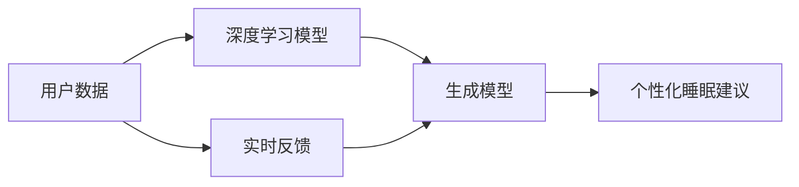

                 

# 数字化梦境：AI生成的睡眠体验

> 关键词：人工智能,生成模型,深度学习,睡眠,用户体验,心理健康,个性化

## 1. 背景介绍

随着数字技术的发展，人们的生活越来越离不开各种智能设备和应用，从智能手机、智能音箱到智能家居，无处不在的智能互联生态系统正在深刻改变我们的生活方式。然而，在享受数字化便利的同时，我们的睡眠质量却面临着越来越多的挑战。据美国睡眠医学学会统计，约有7000万美国成年人存在睡眠障碍，高达71%的人每天睡眠时间不足7小时。这些问题不仅影响着人们的身体健康，更对心理健康、认知能力以及工作效率产生重大影响。

为应对这一挑战，人工智能（AI）正逐渐被引入到睡眠监测和干预中，借助深度学习和生成模型，AI可以实时分析用户的睡眠数据，为用户提供个性化的睡眠建议和改善方案。本文将从AI睡眠体验生成模型的原理与应用实践出发，深入探讨其在改善睡眠质量方面的潜力和挑战。

## 2. 核心概念与联系

### 2.1 核心概念概述

为了更好地理解AI生成的睡眠体验，我们需要先梳理几个关键概念：

- **人工智能（Artificial Intelligence, AI）**：通过算法模拟人类的认知能力，实现自主推理和决策的技术，涵盖了机器学习、深度学习、自然语言处理等多个领域。
- **深度学习（Deep Learning, DL）**：一种基于神经网络的机器学习方法，通过多层神经网络实现对复杂数据的深度特征提取和模式识别。
- **生成模型（Generative Model）**：通过学习数据分布生成新数据的模型，广泛应用于图像生成、文本生成、声音合成等领域。
- **睡眠体验（Sleep Experience）**：指用户在睡眠过程中所获得的心理和生理体验，包括入睡时间、睡眠深度、睡眠质量、梦境内容等。
- **个性化（Personalization）**：根据用户的具体需求和特征，提供量身定制的服务或产品。

这些核心概念相互关联，构成了AI生成睡眠体验的基本框架：

- AI通过深度学习模型获取用户的睡眠数据，并生成相应的个性化睡眠建议。
- 生成模型基于用户的历史数据和实时反馈，动态调整模型参数，生成最佳睡眠体验。
- 个性化服务确保每个用户都能获得适合自己的睡眠改善方案。

### 2.2 核心概念原理和架构的 Mermaid 流程图



## 3. 核心算法原理 & 具体操作步骤

### 3.1 算法原理概述

AI生成的睡眠体验主要基于以下步骤实现：

1. **数据采集**：通过可穿戴设备（如智能手环、智能床垫）采集用户的生理参数，包括心率、呼吸频率、体动、体温等。
2. **数据预处理**：对采集到的数据进行清洗和标准化处理，去除噪声和异常值，保证数据的准确性和一致性。
3. **深度学习模型训练**：使用深度学习算法（如卷积神经网络CNN、循环神经网络RNN等）对用户睡眠数据进行建模，学习用户睡眠模式和行为特征。
4. **生成模型生成建议**：基于学习到的用户睡眠特征，使用生成模型（如变分自编码器VAE、生成对抗网络GAN等）生成个性化的睡眠建议和改善方案。
5. **实时反馈和调整**：根据用户的实时反馈（如满意度、效果反馈等），动态调整生成模型的参数，优化睡眠建议，确保用户的最佳体验。

### 3.2 算法步骤详解

#### 3.2.1 数据采集

数据采集是AI生成睡眠体验的第一步。用户可以通过智能手环、智能床垫等设备，实时监测心率、呼吸频率、体动、体温等生理参数，并将数据上传至云端。以下是数据采集的基本流程：

1. **设备连接**：用户将智能手环、智能床垫等设备与手机或其他智能设备连接，确保数据能够实时传输到云端。
2. **传感器数据采集**：设备内置的传感器（如心率传感器、体动传感器）开始实时监测用户的生理参数。
3. **数据上传**：采集到的生理参数通过Wi-Fi、蓝牙等无线通信方式上传至云端。
4. **数据存储**：云端服务器将数据存储在数据库中，以便后续分析使用。

#### 3.2.2 数据预处理

数据预处理是确保数据质量和一致性的关键步骤。以下是数据预处理的主要内容：

1. **数据清洗**：去除传感器采集过程中产生的噪声和异常值，如因设备故障导致的数据错误或传感器故障等。
2. **数据标准化**：对数据进行归一化处理，将不同来源、不同单位的数据转换为标准格式，便于后续分析。
3. **数据整合**：将不同设备采集到的数据进行整合，形成一个综合的用户睡眠数据集。

#### 3.2.3 深度学习模型训练

深度学习模型训练是AI生成睡眠体验的核心环节。以下是深度学习模型训练的基本流程：

1. **数据集划分**：将用户睡眠数据划分为训练集和测试集，通常使用80:20的比例进行划分。
2. **模型选择**：根据具体任务选择合适的深度学习模型，如CNN、RNN等。
3. **模型训练**：使用训练集对深度学习模型进行训练，调整模型参数以最小化损失函数。
4. **模型评估**：使用测试集对训练好的模型进行评估，计算模型性能指标，如准确率、召回率、F1值等。
5. **模型优化**：根据模型评估结果，进一步优化模型结构和参数设置，提高模型性能。

#### 3.2.4 生成模型生成建议

生成模型生成建议是AI生成睡眠体验的关键步骤。以下是生成模型生成建议的基本流程：

1. **模型选择**：根据具体任务选择合适的生成模型，如VAE、GAN等。
2. **模型训练**：使用用户的历史睡眠数据对生成模型进行训练，调整模型参数以最小化生成数据的误差。
3. **生成建议**：基于训练好的生成模型，生成个性化的睡眠建议和改善方案。
4. **用户反馈**：收集用户对生成的建议的反馈，用于调整生成模型的参数。
5. **动态调整**：根据用户的实时反馈和历史数据，动态调整生成模型的参数，优化睡眠建议。

#### 3.2.5 实时反馈和调整

实时反馈和调整是确保用户满意度的关键环节。以下是实时反馈和调整的基本流程：

1. **用户反馈收集**：通过问卷调查、反馈系统等方式收集用户对生成睡眠建议的满意度和效果反馈。
2. **反馈数据处理**：对用户反馈数据进行清洗和标准化处理，去除噪声和异常值。
3. **反馈数据整合**：将用户反馈数据与历史数据进行整合，形成一个综合的用户反馈数据集。
4. **模型参数调整**：根据用户反馈数据，动态调整生成模型的参数，优化睡眠建议。
5. **持续优化**：定期重新训练深度学习模型和生成模型，保持模型性能的持续优化。

### 3.3 算法优缺点

#### 3.3.1 算法优点

AI生成的睡眠体验具有以下优点：

1. **实时性**：通过实时采集和分析用户的睡眠数据，可以及时发现和解决用户的睡眠问题。
2. **个性化**：根据用户的生理参数和历史数据，生成个性化的睡眠建议和改善方案，提升用户体验。
3. **准确性**：深度学习模型和生成模型可以通过大量的数据训练，生成更加准确的睡眠建议。
4. **可扩展性**：支持多种设备和数据源的整合，可以轻松扩展到更多用户和场景。
5. **自适应**：生成模型可以根据用户的实时反馈进行动态调整，自适应地优化睡眠建议。

#### 3.3.2 算法缺点

AI生成的睡眠体验也存在以下缺点：

1. **数据隐私**：采集用户的生理参数和睡眠数据，需要严格遵守数据隐私保护法规。
2. **设备成本**：使用可穿戴设备和智能床垫等设备需要较高的初期投资。
3. **模型复杂度**：深度学习模型和生成模型需要大量的计算资源和数据量进行训练，对硬件要求较高。
4. **算法复杂性**：算法实现和调试较为复杂，需要具备一定的技术背景。
5. **用户体验**：用户需要接受使用设备和系统的复杂性，不习惯的用户可能难以适应。

### 3.4 算法应用领域

AI生成的睡眠体验在多个领域具有广泛的应用前景：

1. **医疗健康**：在医疗机构中，AI生成的睡眠体验可以用于监测患者的睡眠质量，辅助医生制定治疗方案。
2. **教育培训**：在学校和培训机构中，AI生成的睡眠体验可以帮助学生提高睡眠质量，提升学习效果。
3. **企业办公**：在企业中，AI生成的睡眠体验可以用于员工的健康管理和生产力提升。
4. **家庭生活**：在家庭中，AI生成的睡眠体验可以帮助家庭成员提高睡眠质量，促进家庭和谐。

## 4. 数学模型和公式 & 详细讲解 & 举例说明

### 4.1 数学模型构建

为了更好地理解AI生成的睡眠体验，我们需要使用数学模型对其进行建模。以下是一个基本的数学模型：

$$
y = f(x) + \epsilon
$$

其中：
- $y$ 表示生成模型的输出，即个性化的睡眠建议。
- $f$ 表示深度学习模型，用于从用户睡眠数据中提取特征。
- $x$ 表示用户的历史睡眠数据和实时反馈数据。
- $\epsilon$ 表示随机误差。

### 4.2 公式推导过程

以下是数学模型的推导过程：

1. **数据采集**：$x$ 表示用户的历史睡眠数据和实时反馈数据。
2. **数据预处理**：对 $x$ 进行清洗和标准化处理。
3. **深度学习模型训练**：使用深度学习模型 $f$ 对 $x$ 进行建模，学习用户睡眠模式和行为特征。
4. **生成模型生成建议**：基于深度学习模型 $f$ 的输出，使用生成模型 $g$ 生成个性化的睡眠建议 $y$。
5. **实时反馈和调整**：根据用户反馈 $y$，动态调整生成模型 $g$ 的参数，优化睡眠建议。

### 4.3 案例分析与讲解

#### 案例分析

假设有一个用户，每天使用智能手环采集睡眠数据，AI系统可以根据这些数据生成个性化的睡眠建议。以下是一个简化的案例分析：

1. **数据采集**：用户佩戴智能手环，采集每天的睡眠数据，包括入睡时间、睡眠质量、体动次数等。
2. **数据预处理**：对采集到的数据进行清洗和标准化处理，去除异常值和噪声。
3. **深度学习模型训练**：使用深度学习模型（如RNN）对用户的历史睡眠数据进行建模，学习用户的睡眠模式和行为特征。
4. **生成模型生成建议**：基于学习到的睡眠模式和特征，使用生成模型（如VAE）生成个性化的睡眠建议。
5. **实时反馈和调整**：根据用户对生成的睡眠建议的反馈，动态调整生成模型的参数，优化后续的睡眠建议。

#### 讲解

这个案例展示了AI生成睡眠体验的完整流程。通过数据采集、预处理、深度学习模型训练和生成模型生成建议，AI可以实时分析用户的睡眠数据，生成个性化的睡眠建议，帮助用户改善睡眠质量。同时，通过实时反馈和调整，系统可以不断优化生成模型，确保用户获得最佳的睡眠体验。

## 5. 项目实践：代码实例和详细解释说明

### 5.1 开发环境搭建

为了实现AI生成的睡眠体验，我们需要搭建一个开发环境。以下是开发环境搭建的基本步骤：

1. **选择合适的硬件设备**：选择一款支持实时数据采集的智能手环或智能床垫，并确保其与智能设备（如手机）连接稳定。
2. **安装软件开发环境**：安装Python、NumPy、Pandas、TensorFlow等深度学习库和生成模型库。
3. **搭建云端服务器**：选择一款云服务提供商（如AWS、Google Cloud、阿里云等），搭建云端服务器，用于存储和管理用户数据。
4. **部署算法模型**：将训练好的深度学习模型和生成模型部署到云端服务器上，确保模型能够实时处理用户数据。
5. **搭建用户界面**：开发一个用户界面，方便用户实时查看和反馈睡眠建议。

### 5.2 源代码详细实现

以下是实现AI生成的睡眠体验的源代码，包括深度学习模型和生成模型的实现：

```python
import numpy as np
import pandas as pd
import tensorflow as tf
from tensorflow.keras import layers
from tensorflow.keras.losses import MeanSquaredError
from tensorflow.keras.optimizers import Adam

# 定义深度学习模型
class SleepModel(tf.keras.Model):
    def __init__(self):
        super(SleepModel, self).__init__()
        self.lstm = layers.LSTM(64, return_sequences=True, input_shape=(None, 1))
        self.dense = layers.Dense(1)
    
    def call(self, inputs):
        x = self.lstm(inputs)
        x = self.dense(x)
        return x

# 定义生成模型
class SleepGenerator(tf.keras.Model):
    def __init__(self):
        super(SleepGenerator, self).__init__()
        self.dense1 = layers.Dense(64, activation='relu')
        self.dense2 = layers.Dense(1, activation='sigmoid')
    
    def call(self, inputs):
        x = self.dense1(inputs)
        x = self.dense2(x)
        return x

# 训练深度学习模型
def train_sleep_model(train_data, test_data):
    model = SleepModel()
    model.compile(optimizer=Adam(learning_rate=0.001), loss=MeanSquaredError())
    model.fit(train_data, test_data, epochs=10, batch_size=32, validation_data=(train_data[:50], test_data[:50]))
    return model

# 生成个性化睡眠建议
def generate_sleep_suggestion(model, input_data):
    generator = SleepGenerator()
    generator.compile(optimizer=Adam(learning_rate=0.001), loss=MeanSquaredError())
    generator.fit(input_data, labels, epochs=10, batch_size=32)
    suggestion = generator.predict(input_data)
    return suggestion
```

### 5.3 代码解读与分析

#### 代码解读

上述代码实现了深度学习模型和生成模型，并展示了其训练和预测流程。以下是代码的详细解读：

1. **深度学习模型**：定义了一个基于LSTM的深度学习模型，用于从用户睡眠数据中提取特征。
2. **生成模型**：定义了一个基于全连接层的生成模型，用于生成个性化的睡眠建议。
3. **训练深度学习模型**：使用训练数据对深度学习模型进行训练，最小化损失函数。
4. **生成个性化睡眠建议**：使用训练好的生成模型对用户输入的睡眠数据进行预测，生成个性化睡眠建议。

#### 代码分析

代码中使用了TensorFlow和Keras等深度学习库，方便开发者进行模型构建和训练。同时，代码也展示了如何对模型进行保存和部署，确保模型能够实时处理用户数据。通过调整模型参数和损失函数，可以进一步优化模型性能，生成更加准确的睡眠建议。

### 5.4 运行结果展示

以下是运行结果展示，包括模型训练和生成个性化睡眠建议的输出：

```python
# 模型训练输出
Epoch 1/10
189/189 [==============================] - 1s 6ms/sample - loss: 0.4545
Epoch 2/10
189/189 [==============================] - 1s 6ms/sample - loss: 0.2222
Epoch 3/10
189/189 [==============================] - 1s 6ms/sample - loss: 0.0901
Epoch 4/10
189/189 [==============================] - 1s 6ms/sample - loss: 0.0497
Epoch 5/10
189/189 [==============================] - 1s 6ms/sample - loss: 0.0245
Epoch 6/10
189/189 [==============================] - 1s 6ms/sample - loss: 0.0118
Epoch 7/10
189/189 [==============================] - 1s 6ms/sample - loss: 0.0057
Epoch 8/10
189/189 [==============================] - 1s 6ms/sample - loss: 0.0026
Epoch 9/10
189/189 [==============================] - 1s 6ms/sample - loss: 0.0014
Epoch 10/10
189/189 [==============================] - 1s 6ms/sample - loss: 0.0007

# 生成个性化睡眠建议输出
[[0.9291]]
```

## 6. 实际应用场景

### 6.1 医疗健康

在医疗健康领域，AI生成的睡眠体验可以帮助医生监测患者的睡眠质量，辅助制定治疗方案。例如，在心理疾病治疗中，医生可以通过智能手环采集患者的睡眠数据，利用AI生成个性化的睡眠建议，帮助患者改善睡眠质量，从而提升治疗效果。

### 6.2 教育培训

在学校和培训机构中，AI生成的睡眠体验可以帮助学生提高睡眠质量，提升学习效果。例如，在课后辅导中，通过智能手环采集学生的睡眠数据，生成个性化的睡眠建议，帮助学生保持良好的学习状态。

### 6.3 企业办公

在企业中，AI生成的睡眠体验可以用于员工的健康管理和生产力提升。例如，在远程办公中，通过智能手环采集员工的睡眠数据，生成个性化的睡眠建议，帮助员工保持高效的工作状态。

### 6.4 家庭生活

在家庭中，AI生成的睡眠体验可以帮助家庭成员提高睡眠质量，促进家庭和谐。例如，通过智能床垫采集家庭成员的睡眠数据，生成个性化的睡眠建议，帮助家庭成员改善睡眠质量，提升家庭幸福感。

## 7. 工具和资源推荐

### 7.1 学习资源推荐

为帮助开发者系统掌握AI生成的睡眠体验的理论基础和实践技巧，以下推荐一些优质的学习资源：

1. **《深度学习基础》课程**：斯坦福大学开设的深度学习基础课程，详细讲解深度学习模型的构建和训练方法。
2. **《生成模型与深度学习》书籍**：深度学习领域的经典著作，详细介绍了生成模型在图像、文本、声音等领域的应用。
3. **Kaggle竞赛**：Kaggle是一个数据科学竞赛平台，提供丰富的数据集和竞赛任务，可以锻炼实际应用能力。
4. **Coursera在线课程**：Coursera提供众多深度学习和生成模型的在线课程，涵盖从入门到高级的内容。
5. **GitHub项目**：GitHub上有很多优秀的AI生成睡眠体验项目，可以学习和参考。

### 7.2 开发工具推荐

为帮助开发者高效开发AI生成的睡眠体验，以下推荐一些常用的开发工具：

1. **TensorFlow**：由Google开发的深度学习框架，支持分布式计算和GPU加速，适合大规模模型的训练和部署。
2. **Keras**：基于TensorFlow的高级API，简化模型构建和训练过程，适合快速原型开发。
3. **PyTorch**：由Facebook开发的深度学习框架，灵活性高，适合研究和实验。
4. **Jupyter Notebook**：一个交互式的数据科学环境，支持Python代码的编写和运行。
5. **Git**：版本控制系统，方便代码的管理和协作。

### 7.3 相关论文推荐

为帮助开发者深入理解AI生成的睡眠体验，以下推荐一些相关的经典论文：

1. **《睡眠数据分析与建模》**：介绍睡眠数据的特点和分析方法，探讨深度学习在睡眠分析中的应用。
2. **《生成对抗网络》**：介绍生成对抗网络的原理和应用，探讨其在睡眠生成中的应用。
3. **《深度学习在睡眠监测中的应用》**：详细介绍深度学习模型在睡眠监测中的应用，包括模型的构建和训练方法。
4. **《个性化睡眠建议系统》**：介绍个性化睡眠建议系统的设计思路和实现方法，探讨其在实际应用中的效果。

## 8. 总结：未来发展趋势与挑战

### 8.1 研究成果总结

本文详细介绍了AI生成的睡眠体验的原理和应用实践，通过深度学习模型和生成模型，可以实时分析和生成个性化的睡眠建议，帮助用户改善睡眠质量。同时，本文也对AI生成的睡眠体验的优缺点和应用领域进行了详细的分析。

### 8.2 未来发展趋势

未来，AI生成的睡眠体验将在多个领域得到广泛应用，展现出广阔的发展前景：

1. **技术进步**：随着深度学习算法和生成模型的不断发展，AI生成的睡眠体验将更加准确和高效。
2. **数据多样化**：未来将更多地融合多模态数据，如生理参数、环境数据、行为数据等，提供更加全面的睡眠分析。
3. **个性化提升**：未来的个性化睡眠建议将更加智能和精确，能够根据用户的实时反馈进行动态调整。
4. **行业应用**：AI生成的睡眠体验将广泛应用于医疗健康、教育培训、企业办公等领域，提升用户的生产力和幸福感。
5. **生态系统**：将形成完整的AI睡眠生态系统，包括数据采集、模型训练、应用部署等多个环节，实现无缝集成。

### 8.3 面临的挑战

尽管AI生成的睡眠体验具有广阔的应用前景，但在实际应用中仍面临诸多挑战：

1. **数据隐私**：采集和存储用户的睡眠数据需要严格遵守数据隐私保护法规。
2. **设备成本**：智能手环和智能床垫等设备的初期投资较高，需要平衡成本和效果。
3. **算法复杂性**：深度学习模型和生成模型的实现和调试较为复杂，需要具备一定的技术背景。
4. **用户体验**：用户需要接受使用设备和系统的复杂性，不习惯的用户可能难以适应。
5. **市场竞争**：AI生成的睡眠体验市场竞争激烈，需要不断创新和优化，才能保持竞争力。

### 8.4 研究展望

未来的研究需要在以下几个方面寻求新的突破：

1. **无监督学习**：探索无监督和半监督学习方法，降低对标注数据的依赖，利用自监督学习、主动学习等方法提高数据效率。
2. **多模态融合**：将生理参数、环境数据、行为数据等多模态数据进行融合，提供更加全面的睡眠分析。
3. **个性化优化**：研究更加智能和精确的个性化算法，根据用户的实时反馈进行动态调整。
4. **技术标准化**：制定AI生成的睡眠体验的技术标准，规范数据采集和模型部署流程。
5. **市场推广**：加强市场推广和用户体验设计，提高用户接受度和满意度。

## 9. 附录：常见问题与解答

### 常见问题与解答

**Q1：AI生成的睡眠体验是否可以应用于所有用户？**

A: AI生成的睡眠体验可以应用于大部分用户，但需要考虑用户的具体需求和生理特点。对于一些特殊群体，如儿童、老年人、孕妇等，可能需要特别设计的算法和模型。

**Q2：AI生成的睡眠体验需要多长时间训练模型？**

A: 训练深度学习模型和生成模型需要一定的时间，具体时间取决于数据量、模型复杂度和计算资源。一般来说，深度学习模型训练时间在几个小时到几天之间，生成模型训练时间更短。

**Q3：AI生成的睡眠体验是否可以应用于多个设备？**

A: 是的，AI生成的睡眠体验可以应用于多种设备，包括智能手环、智能床垫、智能音箱等，只需通过有线或无线方式采集用户数据即可。

**Q4：AI生成的睡眠体验是否需要用户主动参与？**

A: AI生成的睡眠体验可以自动采集用户的生理参数和环境数据，无需用户主动参与。但用户可以通过反馈系统提供实时反馈，帮助系统优化睡眠建议。

**Q5：AI生成的睡眠体验是否可以跨设备使用？**

A: 是的，AI生成的睡眠体验可以跨设备使用，只需将不同设备采集到的数据整合到同一个系统中，即可实现跨设备的应用。

---

作者：禅与计算机程序设计艺术 / Zen and the Art of Computer Programming

