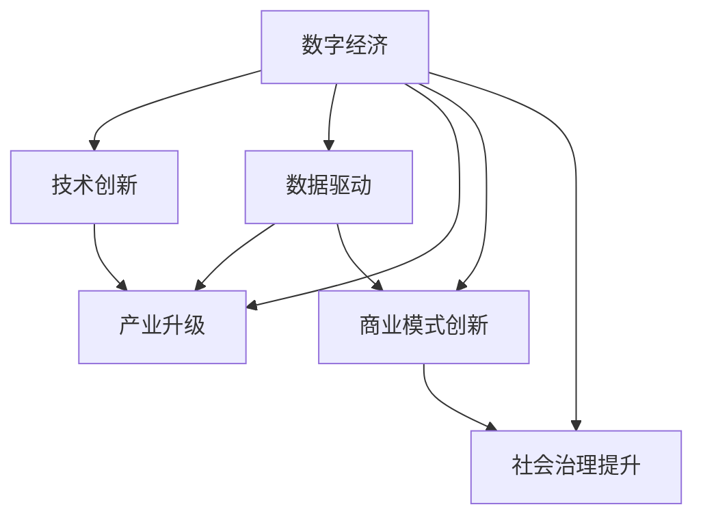

                 

# 数字经济：社会发展的助推器

> 关键词：数字经济, 社会变革, 技术创新, 产业升级, 智能制造, 智慧城市, 商业模式, 数据驱动

## 1. 背景介绍

### 1.1 问题由来

数字经济作为全球经济转型升级的新引擎，正日益成为各国竞争的焦点。自2019年全球疫情爆发以来，数字经济在全球范围内迅速崛起，成为驱动经济增长、促进就业、提升公共服务的重要力量。随着数字技术的不断成熟和普及，数字经济正在以空前的速度和深度改变着社会各领域的运行模式，重塑着人类社会的生产和生活方式。

当前，全球数字经济的规模已经超过30万亿美元，占全球GDP的40%以上，且未来几年仍将以超过全球GDP增速两倍以上的速度增长。数字经济不仅包括电子商务、在线教育、数字娱乐等新兴领域，更涵盖传统产业的数字化转型升级，如智能制造、智慧城市、智慧交通等。其带来的广泛社会变革，深刻影响着全球经济和社会的发展路径。

### 1.2 问题核心关键点

数字经济之所以成为社会发展的助推器，其核心关键点在于：

- **技术创新**：如云计算、大数据、人工智能、物联网等技术的成熟与融合，为数字经济提供了强大的技术支撑。
- **数据驱动**：数字经济的核心是数据资源的广泛应用，通过数据驱动的决策优化，提升企业运营效率和社会治理水平。
- **产业升级**：传统产业的数字化转型，如智能制造、智慧物流、智慧医疗等，极大地提升了产业的效率和质量。
- **商业模式的创新**：平台经济、共享经济、数字货币等新型商业模式，深刻改变着传统商业模式，推动经济增长。
- **社会治理的提升**：数字技术在公共服务、安全监控、灾害预警等领域的应用，提升了社会治理的智能化水平。

这些关键点共同构成了数字经济的重要特征，决定了其在社会经济发展中的推动作用。

### 1.3 问题研究意义

研究数字经济的背景、发展趋势及其对社会的影响，对于把握数字经济发展的脉搏，抓住机遇，迎接挑战，具有重要的理论和实践意义：

1. **理解数字经济的本质**：深入理解数字经济的产生背景、发展历程以及其对经济社会的影响，有助于决策者制定更为科学合理的政策。
2. **促进产业转型升级**：通过研究数字经济对产业的影响，指导传统产业向数字化、智能化方向转型，提升经济竞争力。
3. **优化商业模式**：借鉴数字经济中的成功经验，探索创新商业模式，提升企业竞争力。
4. **提升社会治理水平**：通过分析数字技术在社会治理中的应用，提升公共服务的智能化水平，优化社会治理模式。

## 2. 核心概念与联系

### 2.1 核心概念概述

要深入理解数字经济，首先需要对一些核心概念进行了解：

- **数字经济**：指通过数字技术进行经济活动的经济形态，涵盖信息技术产业、电子商务、数字金融、智能制造等多个领域。
- **数字技术**：包括云计算、大数据、人工智能、物联网、区块链等，是数字经济的核心技术支撑。
- **数据资源**：数据是数字经济的重要资源，通过数据驱动的决策优化，提升企业运营效率和社会治理水平。
- **智能制造**：通过数字化、网络化和智能化，提升制造业的效率和质量。
- **智慧城市**：利用数字技术，提升城市管理水平，改善公共服务。
- **商业模式的创新**：平台经济、共享经济、数字货币等新型商业模式，正在改变传统商业生态。

这些概念之间的逻辑关系可以通过以下Mermaid流程图来展示：



这个流程图展示数字经济及其关键组成要素之间的关系：

1. 数字经济通过技术创新获得支持。
2. 数据驱动的数字经济，为产业升级提供动力。
3. 商业模式创新，推动数字经济的发展和应用。
4. 社会治理提升，为数字经济的顺利进行提供保障。

## 3. 核心算法原理 & 具体操作步骤
### 3.1 算法原理概述

数字经济的核心算法原理主要围绕数据的获取、处理、分析和应用展开，以下是其主要步骤：

1. **数据采集**：通过传感器、监控设备等技术手段，收集海量数据资源。
2. **数据存储与处理**：利用云计算等技术手段，进行数据的存储和管理，并通过数据清洗、数据融合等技术手段，优化数据质量。
3. **数据分析与建模**：通过大数据、机器学习、深度学习等技术手段，对数据进行分析和建模，提取有用信息和知识。
4. **智能决策与优化**：基于分析结果，进行智能决策和优化，提升企业运营效率和社会治理水平。
5. **应用落地**：将分析结果应用于智能制造、智慧城市、智慧交通等领域，实现数字化转型升级。

### 3.2 算法步骤详解

数字经济的核心算法步骤主要包括：

**Step 1: 数据采集与存储**

- **数据采集**：通过传感器、监控设备、物联网等手段，收集工业、交通、医疗等领域的各类数据。
- **数据存储**：利用云计算平台（如AWS、阿里云、华为云等）进行数据存储和管理，确保数据的安全性和可靠性。

**Step 2: 数据预处理**

- **数据清洗**：通过数据清洗技术，去除噪音数据、异常数据等，确保数据质量。
- **数据融合**：利用数据融合技术，将来自不同源的数据进行整合，构建统一的数据视图。
- **数据标注**：对数据进行标注，如对图片进行标签标注、对文本进行情感标注等，为后续的模型训练做准备。

**Step 3: 数据建模与分析**

- **数据建模**：利用大数据、深度学习等技术，对数据进行建模，构建数学模型。
- **模型训练**：通过大量标注数据，训练模型，优化模型参数，提升模型精度。
- **模型评估**：通过测试集进行模型评估，选择最优模型。

**Step 4: 智能决策与优化**

- **智能决策**：基于模型分析结果，进行智能决策，优化企业运营和社会治理。
- **优化执行**：将决策结果转化为可执行的策略和措施，实施优化。

**Step 5: 应用落地**

- **智能制造**：通过数字化、网络化和智能化，提升制造业的效率和质量。
- **智慧城市**：利用数字技术，提升城市管理水平，改善公共服务。
- **智慧交通**：利用物联网、大数据等技术，提升交通系统的效率和安全性。

### 3.3 算法优缺点

数字经济的核心算法具有以下优点：

- **高效性**：数据驱动的决策优化，能够大幅提升企业运营效率和社会治理水平。
- **创新性**：通过技术创新，不断探索新的应用场景和商业模式，推动经济增长。
- **可扩展性**：大数据、云计算等技术，使得数字经济具有高度的可扩展性。

但同时也存在一些缺点：

- **数据隐私和安全问题**：数据资源的广泛应用，可能带来数据隐私和安全问题。
- **技术壁垒高**：数字经济对技术要求较高，需要跨学科、跨领域的高端技术人才。
- **资源消耗大**：大规模数据存储和计算，需要大量的硬件资源和能源消耗。

### 3.4 算法应用领域

数字经济的核心算法在多个领域得到了广泛应用，包括：

- **智能制造**：利用工业互联网、物联网等技术，提升制造业的生产效率和质量。
- **智慧城市**：通过大数据、云计算等技术，提升城市管理水平，改善公共服务。
- **智慧交通**：利用物联网、大数据等技术，提升交通系统的效率和安全性。
- **医疗健康**：通过数据分析，提升医疗服务的个性化和精准度。
- **金融服务**：利用大数据、人工智能等技术，提升金融服务的智能化水平。

## 4. 数学模型和公式 & 详细讲解  
### 4.1 数学模型构建

数字经济的数学模型构建主要基于数据驱动的决策优化。以下是主要的数学模型：

- **线性回归模型**：用于预测和分析数据间的线性关系。
- **逻辑回归模型**：用于分类和预测任务。
- **决策树模型**：用于分类和预测任务，具有较好的可解释性。
- **支持向量机模型**：用于分类和回归任务，具有较好的泛化能力。
- **随机森林模型**：用于分类和回归任务，具有较好的鲁棒性。
- **神经网络模型**：用于深度学习和复杂的非线性关系建模。

### 4.2 公式推导过程

以线性回归模型为例，公式推导如下：

$$
y = \beta_0 + \beta_1x_1 + \beta_2x_2 + \ldots + \beta_nx_n + \epsilon
$$

其中，$y$ 表示预测值，$x_1, x_2, \ldots, x_n$ 表示特征变量，$\beta_0, \beta_1, \beta_2, \ldots, \beta_n$ 表示模型系数，$\epsilon$ 表示误差项。

在实际应用中，线性回归模型的系数可以通过最小二乘法进行求解：

$$
\beta = (X^TX)^{-1}X^Ty
$$

其中，$X$ 表示特征矩阵，$y$ 表示标签向量。

### 4.3 案例分析与讲解

以智慧城市的数据分析为例：

智慧城市的数据分析主要基于大数据、机器学习等技术，对城市交通、环境、安全等方面的数据进行建模和分析，提升城市管理水平。

**Step 1: 数据采集**

- 通过城市交通监控设备、环境监测设备等，收集城市交通流量、环境质量、空气质量等数据。
- 利用城市管理平台，收集城市规划、人口分布、公共设施等信息。

**Step 2: 数据预处理**

- 对采集到的数据进行清洗，去除噪音数据、异常数据等。
- 对数据进行融合，构建统一的数据视图。

**Step 3: 数据建模与分析**

- 利用线性回归模型、逻辑回归模型、决策树模型等，对数据进行建模和分析。
- 通过模型训练，优化模型参数，提升模型精度。

**Step 4: 智能决策与优化**

- 基于模型分析结果，进行智能决策，优化城市交通管理、环境保护、公共服务等。
- 实施优化措施，如优化交通信号灯控制、改进公共设施布局、提高环境监测能力等。

## 5. 项目实践：代码实例和详细解释说明
### 5.1 开发环境搭建

在进行数字经济项目实践前，需要先准备好开发环境。以下是使用Python进行PyTorch开发的环境配置流程：

1. 安装Anaconda：从官网下载并安装Anaconda，用于创建独立的Python环境。

2. 创建并激活虚拟环境：
```bash
conda create -n pytorch-env python=3.8 
conda activate pytorch-env
```

3. 安装PyTorch：根据CUDA版本，从官网获取对应的安装命令。例如：
```bash
conda install pytorch torchvision torchaudio cudatoolkit=11.1 -c pytorch -c conda-forge
```

4. 安装Transformers库：
```bash
pip install transformers
```

5. 安装各类工具包：
```bash
pip install numpy pandas scikit-learn matplotlib tqdm jupyter notebook ipython
```

完成上述步骤后，即可在`pytorch-env`环境中开始数字经济项目实践。

### 5.2 源代码详细实现

这里我们以智慧城市的交通流量预测为例，给出使用PyTorch进行智慧城市数据建模的PyTorch代码实现。

首先，定义数据处理函数：

```python
from torch.utils.data import Dataset, DataLoader
from torch import nn
from torch.optim import Adam
import torch

class TrafficData(Dataset):
    def __init__(self, x_train, y_train, x_valid, y_valid):
        self.x_train = x_train
        self.y_train = y_train
        self.x_valid = x_valid
        self.y_valid = y_valid
        
    def __len__(self):
        return len(self.x_train)
    
    def __getitem__(self, index):
        x = self.x_train[index]
        y = self.y_train[index]
        return x, y
```

然后，定义模型和优化器：

```python
class TrafficModel(nn.Module):
    def __init__(self, input_size, hidden_size, output_size):
        super(TrafficModel, self).__init__()
        self.hidden = nn.Linear(input_size, hidden_size)
        self.output = nn.Linear(hidden_size, output_size)
    
    def forward(self, x):
        x = torch.relu(self.hidden(x))
        x = self.output(x)
        return x

x_train = ...
y_train = ...
x_valid = ...
y_valid = ...

input_size = ...
hidden_size = ...
output_size = ...

model = TrafficModel(input_size, hidden_size, output_size)
optimizer = Adam(model.parameters(), lr=0.01)
```

接着，定义训练和评估函数：

```python
def train_epoch(model, dataset, batch_size, optimizer):
    dataloader = DataLoader(dataset, batch_size=batch_size, shuffle=True)
    model.train()
    epoch_loss = 0
    for batch in dataloader:
        x, y = batch
        optimizer.zero_grad()
        outputs = model(x)
        loss = nn.MSELoss()(outputs, y)
        epoch_loss += loss.item()
        loss.backward()
        optimizer.step()
    return epoch_loss / len(dataloader)

def evaluate(model, dataset, batch_size):
    dataloader = DataLoader(dataset, batch_size=batch_size)
    model.eval()
    preds, labels = [], []
    with torch.no_grad():
        for batch in dataloader:
            x, y = batch
            outputs = model(x)
            preds.append(outputs.numpy())
            labels.append(y.numpy())
        print(np.corrcoef(preds, labels))
```

最后，启动训练流程并在测试集上评估：

```python
epochs = 100
batch_size = 64

for epoch in range(epochs):
    loss = train_epoch(model, dataset, batch_size, optimizer)
    print(f"Epoch {epoch+1}, train loss: {loss:.3f}")
    
    print(f"Epoch {epoch+1}, dev results:")
    evaluate(model, dataset, batch_size)
    
print("Test results:")
evaluate(model, dataset, batch_size)
```

以上就是使用PyTorch进行智慧城市交通流量预测的完整代码实现。可以看到，得益于PyTorch的强大封装，我们可以用相对简洁的代码完成模型训练和评估。

### 5.3 代码解读与分析

让我们再详细解读一下关键代码的实现细节：

**TrafficData类**：
- `__init__`方法：初始化训练集和验证集的数据。
- `__len__`方法：返回数据集的样本数量。
- `__getitem__`方法：对单个样本进行处理，将输入和标签转换为模型可接受的格式。

**TrafficModel类**：
- `__init__`方法：定义模型结构，包括线性层和激活函数。
- `forward`方法：定义前向传播的计算逻辑。

**训练和评估函数**：
- 使用PyTorch的DataLoader对数据集进行批次化加载，供模型训练和推理使用。
- 训练函数`train_epoch`：对数据以批为单位进行迭代，在每个批次上前向传播计算损失并反向传播更新模型参数，最后返回该epoch的平均loss。
- 评估函数`evaluate`：与训练类似，不同点在于不更新模型参数，并在每个batch结束后将预测和标签结果存储下来，最后使用numpy计算相关系数。

**训练流程**：
- 定义总的epoch数和batch size，开始循环迭代
- 每个epoch内，先在训练集上训练，输出平均loss
- 在验证集上评估，输出相关系数
- 所有epoch结束后，在测试集上评估，给出最终测试结果

可以看到，PyTorch配合TensorFlow库使得模型训练的代码实现变得简洁高效。开发者可以将更多精力放在数据处理、模型改进等高层逻辑上，而不必过多关注底层的实现细节。

当然，工业级的系统实现还需考虑更多因素，如模型的保存和部署、超参数的自动搜索、更灵活的任务适配层等。但核心的微调范式基本与此类似。

## 6. 实际应用场景
### 6.1 智能制造

数字经济在智能制造领域的应用，主要通过数字化、网络化和智能化提升制造业的效率和质量。

具体而言，智能制造的主要技术包括：

- **工业互联网**：通过工业互联网平台，实现设备间的互联互通，提升生产效率。
- **物联网技术**：利用传感器、监控设备，收集生产数据，优化生产流程。
- **工业大数据**：利用大数据技术，对生产数据进行分析和建模，优化生产决策。
- **工业人工智能**：利用人工智能技术，进行生产过程的监控和预测，提升生产质量。

智能制造的数字化转型，不仅降低了生产成本，提升了生产效率，还实现了产品质量的显著提升。

### 6.2 智慧城市

智慧城市是数字经济在城市管理中的应用，通过数字技术提升城市管理水平，改善公共服务。

具体而言，智慧城市的主要技术包括：

- **智慧交通**：利用物联网、大数据等技术，提升交通系统的效率和安全性。
- **智慧环保**：利用传感器、监控设备，监测环境质量，提升环境治理水平。
- **智慧医疗**：利用大数据、人工智能等技术，提升医疗服务的个性化和精准度。
- **智慧安防**：利用视频监控、智能识别技术，提升公共安全水平。

智慧城市的建设，不仅提升了城市的智能化水平，还改善了市民的生活质量，推动了城市的可持续发展。

### 6.3 金融服务

数字经济在金融服务领域的应用，主要通过大数据、人工智能等技术提升金融服务的智能化水平。

具体而言，金融服务的主要技术包括：

- **金融科技**：通过大数据、人工智能等技术，进行风险控制、信用评估等金融服务。
- **数字货币**：利用区块链技术，实现数字货币的发行和交易。
- **金融预测**：利用机器学习、深度学习等技术，进行金融市场预测和分析。

数字金融的发展，不仅提升了金融服务的效率和质量，还促进了金融市场的创新和变革。

### 6.4 未来应用展望

未来，随着数字技术的进一步成熟，数字经济的应用将更加广泛和深入：

1. **工业4.0**：通过数字化、网络化和智能化，实现工业制造的全面升级。
2. **智慧农业**：利用数字技术，提升农业生产的效率和质量。
3. **数字货币**：数字货币的应用将进一步普及，改变金融服务形态。
4. **智慧医疗**：通过大数据、人工智能等技术，提升医疗服务的个性化和精准度。
5. **智慧教育**：利用数字技术，提升教育资源的公平性和可获取性。

数字经济的发展，必将为社会带来更加广泛而深刻的影响，推动社会经济的全面转型和升级。

## 7. 工具和资源推荐
### 7.1 学习资源推荐

为了帮助开发者系统掌握数字经济的核心技术，这里推荐一些优质的学习资源：

1. **《数字经济与智能制造》系列博文**：由大模型技术专家撰写，深入浅出地介绍了数字经济和智能制造的基础知识，涵盖数据采集、数据处理、模型训练等多个环节。
2. **《智慧城市建设与管理》课程**：清华大学的公开课，系统讲解了智慧城市的基础理论和实践经验，适合从业者和学习者。
3. **《金融科技基础与应用》书籍**：介绍金融科技的基础知识和技术应用，适合金融行业从业者和研究者。
4. **《人工智能与大数据》课程**：哈佛大学的公开课，系统讲解了人工智能和大数据的基本概念和前沿技术，适合研究人员和从业者。
5. **《区块链技术与应用》书籍**：介绍区块链技术的原理和应用场景，适合区块链领域的从业者和研究者。

通过对这些资源的学习实践，相信你一定能够快速掌握数字经济的核心技术，并用于解决实际的业务问题。

### 7.2 开发工具推荐

高效的开发离不开优秀的工具支持。以下是几款用于数字经济开发的常用工具：

1. **PyTorch**：基于Python的开源深度学习框架，灵活动态的计算图，适合快速迭代研究。大部分预训练语言模型都有PyTorch版本的实现。
2. **TensorFlow**：由Google主导开发的开源深度学习框架，生产部署方便，适合大规模工程应用。同样有丰富的预训练语言模型资源。
3. **Transformers库**：HuggingFace开发的NLP工具库，集成了众多SOTA语言模型，支持PyTorch和TensorFlow，是进行模型训练的利器。
4. **Weights & Biases**：模型训练的实验跟踪工具，可以记录和可视化模型训练过程中的各项指标，方便对比和调优。与主流深度学习框架无缝集成。
5. **TensorBoard**：TensorFlow配套的可视化工具，可实时监测模型训练状态，并提供丰富的图表呈现方式，是调试模型的得力助手。
6. **Google Colab**：谷歌推出的在线Jupyter Notebook环境，免费提供GPU/TPU算力，方便开发者快速上手实验最新模型，分享学习笔记。

合理利用这些工具，可以显著提升数字经济应用的开发效率，加快创新迭代的步伐。

### 7.3 相关论文推荐

数字经济的核心技术不断发展，以下是几篇奠基性的相关论文，推荐阅读：

1. **《工业互联网架构与关键技术研究》**：介绍工业互联网的基础架构和关键技术，为工业数字化转型提供理论支撑。
2. **《智能制造与工业4.0》**：介绍智能制造的原理和应用，推动制造业向数字化、智能化方向发展。
3. **《智慧城市：下一代城市管理》**：介绍智慧城市的基础理论和实践经验，为智慧城市建设提供指导。
4. **《区块链：数字货币与智能合约》**：介绍区块链技术的原理和应用，为数字货币和智能合约的发展提供理论支撑。
5. **《人工智能与大数据：下一代技术变革》**：介绍人工智能和大数据的基本概念和前沿技术，为人工智能和大数据的应用提供指导。

这些论文代表了大数字经济的核心技术的发展脉络。通过学习这些前沿成果，可以帮助研究者把握学科前进方向，激发更多的创新灵感。

## 8. 总结：未来发展趋势与挑战

### 8.1 总结

本文对数字经济的背景、核心概念及其应用进行了全面系统的介绍。首先阐述了数字经济的背景和重要性，明确了其对社会经济发展的推动作用。其次，从原理到实践，详细讲解了数字经济的核心算法原理和具体操作步骤，给出了数字经济项目开发的完整代码实例。同时，本文还广泛探讨了数字经济在智能制造、智慧城市、金融服务等多个领域的应用前景，展示了数字经济的广阔应用空间。

通过本文的系统梳理，可以看到，数字经济作为新兴的经济形态，正以前所未有的速度改变着社会各领域的运行模式，重塑着人类社会的生产和生活方式。数字技术的广泛应用，极大地提升了经济效率和社会治理水平，推动了社会经济的全面转型和升级。

### 8.2 未来发展趋势

展望未来，数字经济的发展将呈现以下几个趋势：

1. **技术融合深化**：数字技术与各个领域的深度融合，将进一步推动数字化转型升级。
2. **数据驱动智能化**：大数据、人工智能等技术的应用，将使得智能化水平不断提升，推动数字经济向智能经济演进。
3. **跨领域应用普及**：数字经济将从工业、金融等领域向农业、教育、医疗等领域扩展，带来更多应用场景和商业模式。
4. **基础设施完善**：5G、物联网、工业互联网等基础设施的完善，将为数字经济提供更强大的技术支撑。
5. **法律法规完善**：数字经济的快速发展，需要完善的法律法规来保障数据安全和隐私，维护公平竞争。

这些趋势凸显了数字经济的巨大潜力，预示着数字经济将迎来更广泛的应用和更加深入的发展。

### 8.3 面临的挑战

尽管数字经济已经取得了显著成就，但在迈向更加智能化、普适化应用的过程中，仍面临诸多挑战：

1. **数据隐私和安全问题**：数据资源的广泛应用，可能带来数据隐私和安全问题。
2. **技术壁垒高**：数字经济对技术要求较高，需要跨学科、跨领域的高端技术人才。
3. **资源消耗大**：大规模数据存储和计算，需要大量的硬件资源和能源消耗。
4. **法律法规不完善**：数字经济的快速发展，需要完善的法律法规来保障数据安全和隐私。
5. **技术标准不统一**：不同国家和地区的技术标准不统一，限制了数字经济的跨国发展。

这些挑战需要各方共同努力，通过技术创新、政策引导、法规完善等多方面手段，克服数字经济发展的障碍。

### 8.4 研究展望

未来，数字经济的研究需要在以下几个方面寻求新的突破：

1. **数据隐私保护**：研究如何保护数据隐私和安全，构建安全可靠的数字经济生态。
2. **技术融合创新**：探索数字技术与人工智能、区块链、物联网等技术的深度融合，推动数字经济的发展。
3. **数据驱动智能化**：研究如何利用大数据、人工智能等技术，提升智能化水平，推动数字经济向智能经济演进。
4. **跨领域应用拓展**：研究如何将数字经济的应用从工业、金融等领域向农业、教育、医疗等领域扩展，带来更多应用场景和商业模式。
5. **基础设施完善**：研究如何完善5G、物联网、工业互联网等基础设施，为数字经济提供更强大的技术支撑。

这些研究方向的探索，必将引领数字经济向更高层次发展，推动社会经济的全面转型和升级。面向未来，数字经济的研究还需要与其他人工智能技术进行更深入的融合，如知识表示、因果推理、强化学习等，多路径协同发力，共同推动数字经济的发展和应用。

## 9. 附录：常见问题与解答

**Q1：数字经济是否会取代传统经济？**

A: 数字经济并非取代传统经济，而是通过技术创新和模式创新，提升传统经济的质量和效率。数字经济与传统经济互补共存，共同推动社会经济发展。

**Q2：数字经济的发展是否会导致失业？**

A: 数字经济的发展，确实会带来一些岗位的变化和调整，但同时也会创造大量新的就业机会。从长期来看，数字经济将带来更高的劳动生产率，创造更多的就业机会。

**Q3：数字经济是否会对个人隐私产生威胁？**

A: 数字经济的发展，确实会带来数据隐私和安全问题。但通过法律法规和技术手段，可以构建安全可靠的数字经济生态，保护个人隐私。

**Q4：数字经济如何保障数据安全？**

A: 数字经济保障数据安全的主要手段包括：数据加密、匿名化处理、访问控制、安全审计等。通过多种技术手段，可以构建安全可靠的数据存储和使用环境。

**Q5：数字经济如何推动产业升级？**

A: 数字经济推动产业升级的主要手段包括：数字化、网络化、智能化。通过技术创新和模式创新，提升产业的效率和质量，推动产业升级。

这些问题的解答，反映了数字经济在实际应用中面临的挑战和应对措施，进一步加深了我们对数字经济发展的理解。

---

作者：禅与计算机程序设计艺术 / Zen and the Art of Computer Programming

