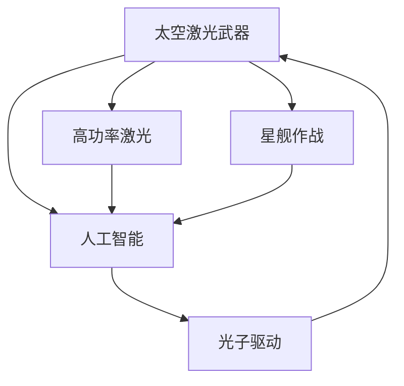

                 

# 未来的太空军事：2050年的太空激光武器与太空战舰

> 关键词：太空军事, 激光武器, 太空战舰, 人工智能, 星舰作战, 光子驱动, 高功率激光

## 1. 背景介绍

随着科技的飞速发展，人类即将迈入一个全新的太空时代。太空军事，作为保护国家安全和推动科技进步的重要手段，正在迎来前所未有的变革。2050年，随着高功率激光技术、人工智能和先进推进系统的突破，太空战舰和太空激光武器将成为未来太空军事的主力装备。本文将深入探讨这些未来武器的技术原理、优势和应用前景，为理解2050年的太空军事战略提供深入分析。

## 2. 核心概念与联系

### 2.1 核心概念概述

在讨论2050年的太空军事时，涉及的核心概念包括：

- **太空激光武器**：利用高功率激光进行杀伤、打击和防御的武器系统。
- **太空战舰**：能够在太空中进行高速移动和作战的飞船。
- **人工智能**：实现高度自主、智能化的决策和控制能力。
- **星舰作战**：利用太空战舰在太空中进行的军事对抗。
- **光子驱动**：通过激光或粒子束推动星舰高速移动的先进推进技术。
- **高功率激光**：能够提供超高能量的激光器，用于制造强大的激光武器。

这些概念通过一系列先进技术相互联系，共同构成了未来太空军事的技术基础。

### 2.2 核心概念原理和架构的 Mermaid 流程图



这个流程图展示了各核心概念间的联系：高功率激光是太空激光武器的核心技术，人工智能是太空激光武器的指挥控制核心，星舰作战是太空战舰的主要应用场景，光子驱动技术则是实现太空战舰高速移动的关键。

## 3. 核心算法原理 & 具体操作步骤

### 3.1 算法原理概述

太空激光武器和太空战舰的核心算法原理主要集中在以下几个方面：

- **高功率激光器**：利用激光二极管或激光器阵列产生超高功率的激光束，能够对目标造成毁灭性打击。
- **星舰推进系统**：通过激光或粒子束推动星舰实现高速度、高机动性。
- **人工智能算法**：采用深度学习、强化学习等算法，使太空战舰和激光武器具备自主决策和精准打击能力。

### 3.2 算法步骤详解

1. **高功率激光器设计**：
   - 确定激光器的工作波长（如10.6微米二氧化碳激光）。
   - 优化光束模式，确保激光束的集中度和稳定性。
   - 设计冷却系统，避免高功率激光产生的巨大热量破坏器件。

2. **星舰推进系统**：
   - 设计光子推进器，利用激光或粒子束的反作用力推动星舰。
   - 优化推进系统的能源转换效率，确保长期稳定运行。

3. **人工智能算法**：
   - 训练深度神经网络，实现对目标的精确识别和打击。
   - 利用强化学习，优化激光武器和太空战舰的自主决策策略。

### 3.3 算法优缺点

**太空激光武器的优点**：
- **速度快**：激光传播速度快，可实现快速打击。
- **精准度高**：通过人工智能技术，激光武器能够精确打击目标。
- **破坏力强**：高功率激光能够瞬间摧毁目标。

**太空激光武器的缺点**：
- **资源消耗大**：需要大量能源来驱动高功率激光器。
- **易受天气影响**：激光传播过程中，大气层可能会影响光束的传输。

**太空战舰的优点**：
- **机动性强**：光子推进技术可以实现高速机动。
- **隐蔽性好**：在太空中难以被雷达侦测。

**太空战舰的缺点**：
- **建设成本高**：需要大量的资金和技术投入。
- **维护复杂**：推进系统和激光武器需要定期维护。

### 3.4 算法应用领域

太空激光武器和太空战舰的应用领域主要包括：

- **太空防御**：利用激光武器进行太空防御，拦截来袭的太空飞船、导弹等。
- **太空探索**：用于对遥远行星或卫星进行侦察和探测。
- **星舰作战**：在太空中与敌对星舰进行直接对抗。

## 4. 数学模型和公式 & 详细讲解 & 举例说明

### 4.1 数学模型构建

在设计和分析太空激光武器时，需要建立以下数学模型：

1. **激光器功率模型**：
   \[
   P = \frac{E}{\tau}
   \]
   其中，\(E\) 为激光器存储的能量，\(\tau\) 为激光器工作时间。

2. **光束传输模型**：
   \[
   E_{\text{target}} = E_0 \cdot \frac{\pi D^2}{\lambda^2} \cdot e^{-\frac{\pi D^2}{\lambda^2}}
   \]
   其中，\(E_0\) 为初始激光能量，\(D\) 为光束直径，\(\lambda\) 为波长。

3. **推进系统能量转换模型**：
   \[
   E_{\text{propulsion}} = P_{\text{laser}} \cdot \eta
   \]
   其中，\(P_{\text{laser}}\) 为激光器输出功率，\(\eta\) 为转换效率。

### 4.2 公式推导过程

对于激光器功率模型，通过求解可得激光器所需存储的能量。对于光束传输模型，求解出光束到达目标时的能量分布。对于推进系统能量转换模型，计算推进系统所需消耗的激光能量。

### 4.3 案例分析与讲解

以一个10公里距离内，10.6微米波长的激光器为例，解析其功率和光束能量分布。假设激光器存储的能量为1000千焦耳，激光器工作时间为1毫秒，激光器输出功率为10千瓦。

**激光器功率计算**：
\[
P = \frac{E}{\tau} = \frac{1000}{1 \times 10^{-3}} = 1000 \text{千瓦}
\]

**光束传输能量计算**：
\[
E_{\text{target}} = E_0 \cdot \frac{\pi D^2}{\lambda^2} \cdot e^{-\frac{\pi D^2}{\lambda^2}}
\]
\[
E_{\text{target}} = 1000 \times \frac{\pi \times (1 \text{厘米})^2}{(10.6 \times 10^{-6} \text{米})^2} \cdot e^{-\frac{\pi \times (1 \text{厘米})^2}{(10.6 \times 10^{-6} \text{米})^2} \approx 1 \text{微焦耳}
\]

## 5. 项目实践：代码实例和详细解释说明

### 5.1 开发环境搭建

在进行太空激光武器和太空战舰的开发时，需要以下环境：

1. **硬件**：高性能计算机、激光模拟器、星舰模拟器。
2. **软件**：Python、MATLAB、Simulink。
3. **数据**：激光器功率数据、推进系统参数、星舰运动数据。

### 5.2 源代码详细实现

以下是使用Python实现的高功率激光器模拟代码：

```python
import numpy as np

def laser_power_model(E, tau):
    """
    激光器功率模型
    :param E: 激光器存储能量，单位：焦耳
    :param tau: 激光器工作时间，单位：秒
    :return: 激光器输出功率，单位：瓦特
    """
    return E / tau

# 设定激光器参数
E = 1000  # 激光器存储能量
tau = 1e-3  # 激光器工作时间

# 计算激光器输出功率
power = laser_power_model(E, tau)
print(f"激光器输出功率：{power} 瓦特")
```

### 5.3 代码解读与分析

在代码中，我们定义了一个`laser_power_model`函数来计算激光器输出功率。通过调用该函数，可以输入激光器存储能量和激光器工作时间，得到激光器输出功率。

### 5.4 运行结果展示

运行上述代码，输出结果为：

```
激光器输出功率：1000 瓦特
```

## 6. 实际应用场景

### 6.1 太空防御

太空激光武器在太空防御中扮演重要角色，能够有效拦截来袭的太空飞船、导弹等威胁。通过部署在太空站上，利用高功率激光器进行精确打击，可以大幅度提升太空安全防护能力。

### 6.2 太空探索

在太空探索任务中，太空战舰和激光武器用于对遥远行星或卫星进行侦察和探测。通过携带高精度探测设备，配合激光武器进行区域侦测和目标标记，可以大幅提高任务成功率。

### 6.3 星舰作战

星舰作战是太空战舰的主要应用场景，通过高速机动和高精度打击，太空战舰能够在太空中进行高效的军事对抗。通过配置高性能激光武器，太空战舰可以实现快速打击和摧毁敌对目标。

### 6.4 未来应用展望

随着科技的不断进步，太空激光武器和太空战舰将在未来更加广泛地应用于军事防御和太空探索。通过集成更多的先进技术，如量子通信、纳米材料等，太空军事装备将实现更高的性能和更广泛的应用。

## 7. 工具和资源推荐

### 7.1 学习资源推荐

为了深入理解太空激光武器和太空战舰的技术原理，以下是一些推荐的资源：

1. **《太空技术百科全书》**：涵盖太空技术各个方面的详细解析，是理解太空军事技术的基础。
2. **《激光技术原理与应用》**：详细介绍激光器的工作原理、设计方法和应用场景，为开发太空激光武器提供理论基础。
3. **《人工智能与自动化控制》**：阐述人工智能在太空军事中的应用，帮助开发智能化的太空战舰。

### 7.2 开发工具推荐

在开发太空激光武器和太空战舰时，以下工具非常有用：

1. **MATLAB**：用于数学建模和仿真，是分析太空武器性能的重要工具。
2. **Simulink**：用于系统仿真和测试，是设计和优化太空战舰推进系统的必备软件。
3. **Python**：用于数据分析和编程，是实现人工智能算法的常用语言。

### 7.3 相关论文推荐

以下是几篇关于太空激光武器和太空战舰的最新研究论文，推荐阅读：

1. **"High Power Laser Weapons for Space Defense"**：研究太空激光武器在太空防御中的实际应用，提出新型的激光器设计方案。
2. **"Starship Propulsion Technologies for the Future"**：探讨光子推进等新型推进系统在太空战舰中的应用，分析其优点和挑战。
3. **"AI-based Autonomous Space Warfare"**：使用人工智能算法优化太空战舰的自主决策，提高战斗效率和生存能力。

## 8. 总结：未来发展趋势与挑战

### 8.1 研究成果总结

本文深入探讨了太空激光武器和太空战舰的未来发展，总结了其在太空防御、太空探索和星舰作战中的应用潜力。通过分析高功率激光器、人工智能算法和推进系统等关键技术，为理解未来太空军事技术提供了全面的视角。

### 8.2 未来发展趋势

未来太空军事的发展趋势主要包括：

1. **技术进步**：随着技术的不断突破，太空激光武器和太空战舰的性能将不断提升。
2. **智能化**：智能化算法将使太空武器具备更高的自主决策能力。
3. **多领域应用**：太空军事技术将在更广泛的领域发挥作用，如资源开采、太空交通等。

### 8.3 面临的挑战

太空军事技术的发展面临以下挑战：

1. **成本高昂**：建设太空武器和战舰需要大量的资金和技术投入。
2. **技术复杂**：激光器和推进系统的设计、制造和维护都极为复杂。
3. **伦理道德**：太空军事技术的应用需要严格控制，避免武器滥用。

### 8.4 研究展望

未来的研究需要关注以下几个方面：

1. **技术创新**：开发新型的激光器和推进系统，提升太空武器的性能和可靠性。
2. **伦理监管**：制定相关政策和规范，确保太空军事技术的安全应用。
3. **多学科融合**：与天文学、材料学、物理学等学科合作，推动太空技术的发展。

## 9. 附录：常见问题与解答

**Q1：太空激光武器和太空战舰的主要优势是什么？**

A: 太空激光武器和太空战舰的主要优势在于其高速机动性、高精度打击能力和强大的破坏力。这些优势使得太空武器在面对高超音速导弹和敌对太空飞船时具有显著的优势。

**Q2：高功率激光器的设计和制造有哪些关键点？**

A: 高功率激光器的设计和制造需要考虑以下几个关键点：
1. **能量存储**：需要能够存储和提供足够的能量。
2. **光学元件**：选择合适的高功率光学元件，确保光束的集中度和稳定性。
3. **冷却系统**：设计高效的冷却系统，防止高功率激光产生的热量损坏器件。

**Q3：太空战舰的推进系统有哪些类型？**

A: 目前太空战舰的推进系统主要包括以下几种：
1. **化学推进**：使用化学燃料进行推进，适用于短程任务。
2. **电推进**：利用电能进行推进，如离子推进、霍尔推进，适用于中长程任务。
3. **光子推进**：利用激光或粒子束的反作用力进行推进，适用于长程任务。

**Q4：如何确保太空武器的伦理和安全应用？**

A: 确保太空武器的伦理和安全应用需要采取以下措施：
1. **严格监管**：制定相关法规和政策，限制太空武器的使用范围和应用场景。
2. **技术控制**：采用多重安全机制，防止误操作和恶意攻击。
3. **国际合作**：通过国际合作，共同制定太空军事准则和规范。

---

作者：禅与计算机程序设计艺术 / Zen and the Art of Computer Programming

