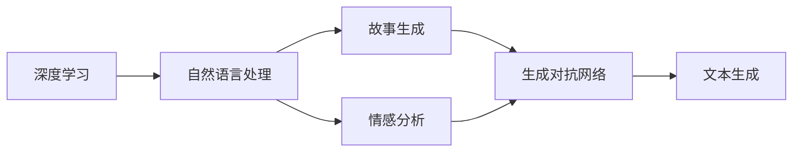

                 

# 构建讲故事的人工智能：课程概述

> 关键词：
   - 人工智能（AI）
   - 自然语言处理（NLP）
   - 深度学习（Deep Learning）
   - 机器学习（Machine Learning）
   - 故事生成（Story Generation）
   - 情感分析（Sentiment Analysis）
   - 内容生成（Content Generation）

## 1. 背景介绍

### 1.1 问题由来
在当今信息爆炸的时代，人们被大量的文本数据所淹没。如何从中提取有价值的信息，让机器更好地理解和生成文本，成为了一个重要的研究课题。传统的文本处理方式，如关键词提取、文本分类等，已经无法满足人们日益增长的需求。近年来，随着深度学习技术的发展，特别是自然语言处理（NLP）领域的突破，基于生成式模型的人工智能（AI）在故事生成、情感分析、内容生成等领域取得了显著进展。

### 1.2 问题核心关键点
构建讲故事的人工智能的核心问题在于如何使机器能够理解和生成符合人类认知的故事，使其具有情感共鸣、逻辑连贯和结构完整。这涉及到以下几个关键点：

1. **故事理解**：机器需要理解故事的语义、情感和结构。
2. **情感表达**：机器需要能够准确地识别和生成情感表达，以增强故事的感染力。
3. **逻辑连贯**：机器生成的故事需要具备逻辑连贯性，使读者感到自然流畅。
4. **创意生成**：机器需要具备一定的创意能力，能够生成新颖的故事内容。

### 1.3 问题研究意义
构建讲故事的人工智能对于推动人工智能在媒体、娱乐、教育等领域的应用具有重要意义：

1. **提升用户体验**：通过自然流畅、富有情感的故事生成，提升用户对内容的互动和沉浸感。
2. **加速内容创作**：帮助内容创作者生成初步草稿，节省时间和精力，提高创作效率。
3. **丰富教育方式**：通过有趣的故事和互动性强的内容，增强学习效果，提升学习兴趣。
4. **促进文化交流**：通过故事分享，增进不同文化背景下的理解和交流。

## 2. 核心概念与联系

### 2.1 核心概念概述

构建讲故事的人工智能涉及到多个核心概念，这些概念之间有着紧密的联系。以下是主要的核心概念及其相互关系：

- **自然语言处理（NLP）**：指使用计算机处理、理解和生成自然语言的技术，是构建讲故事AI的基础。
- **深度学习（DL）**：通过多层次的非线性模型，使机器能够学习到数据的复杂特征，适用于大规模文本数据的处理。
- **生成对抗网络（GANs）**：一种生成模型，通过两个神经网络对抗生成真实与伪造的文本数据，提升生成质量。
- **故事生成**：指机器能够生成符合人类认知的故事，包括情节、人物、情感等要素。
- **情感分析**：指机器能够识别和理解文本中的情感倾向，增强故事感染力。

这些概念通过深度学习技术有机结合，形成了构建讲故事AI的技术框架。

### 2.2 核心概念原理和架构的 Mermaid 流程图



### 2.3 核心概念之间的联系

以上概念之间的联系可以通过以下几个方面来描述：

- **NLP是基础**：深度学习模型通常基于NLP框架，通过理解自然语言，才能生成具有情感和逻辑的故事。
- **生成对抗网络**：通过对抗训练，生成对抗网络可以提高生成故事的质量，使其更加真实可信。
- **故事生成和情感分析**：情感分析可以帮助故事生成更好地捕捉情感元素，使故事更具感染力。

## 3. 核心算法原理 & 具体操作步骤

### 3.1 算法原理概述

构建讲故事的人工智能主要基于以下算法原理：

1. **深度学习模型**：使用循环神经网络（RNN）、长短期记忆网络（LSTM）、门控循环单元（GRU）等模型，处理和生成自然语言数据。
2. **生成对抗网络（GANs）**：通过两个神经网络的对抗训练，生成符合语义和情感的故事。
3. **强化学习（RL）**：通过奖励机制，引导生成模型生成更加符合人类认知的故事。
4. **语言模型（LM）**：通过训练语言模型，提高生成文本的自然度和连贯性。

### 3.2 算法步骤详解

构建讲故事的人工智能的算法步骤包括：

1. **数据准备**：收集大量故事数据，包括情节、人物、情感等要素，用于训练模型。
2. **模型训练**：使用深度学习模型和生成对抗网络进行故事生成训练，并使用情感分析模型进行情感指导。
3. **模型评估**：使用故事生成模型和情感分析模型对生成的故事进行评估，优化模型参数。
4. **故事生成**：使用训练好的模型生成新的故事，并使用强化学习进行优化。

### 3.3 算法优缺点

构建讲故事的人工智能的算法具有以下优缺点：

**优点**：

- **自动化生成**：可以自动生成符合人类认知的故事，节省时间和精力。
- **多样性丰富**：生成故事具有多样性和创意性，适应不同的受众和情境。
- **高效性**：通过深度学习和生成对抗网络，生成速度较快。

**缺点**：

- **模型复杂**：深度学习模型和生成对抗网络结构复杂，训练和优化难度较大。
- **数据依赖**：生成质量依赖于训练数据的质量和多样性。
- **情感表达不足**：情感表达能力不足，可能导致故事缺乏感染力。

### 3.4 算法应用领域

构建讲故事的人工智能可以应用于多个领域，包括：

- **媒体娱乐**：生成新闻报道、影视剧本、广告文案等。
- **教育培训**：生成教育内容、练习题等，提高学习效果。
- **游戏开发**：生成游戏剧情、角色对话等，增强游戏体验。
- **心理健康**：生成心理健康指导、故事治疗等，辅助心理治疗。

## 4. 数学模型和公式 & 详细讲解 & 举例说明

### 4.1 数学模型构建

构建讲故事的人工智能的数学模型主要包括以下几个方面：

- **RNN模型**：通过RNN模型处理序列数据，捕捉故事的时间序列特征。
- **LSTM模型**：通过LSTM模型处理长序列数据，捕捉故事中的长期依赖关系。
- **GAN模型**：使用生成器和判别器网络，生成符合语义和情感的故事。

### 4.2 公式推导过程

以RNN模型为例，其公式推导过程如下：

$$
h_t = f(W_{xh}x_t + W_{hh}h_{t-1} + b_h)
$$

$$
\hat{y}_t = g(W_{hy}h_t + b_y)
$$

其中，$f$和$g$为激活函数，$W_{xh}$和$W_{hy}$为权重矩阵，$x_t$为输入序列，$h_t$为隐藏状态，$\hat{y}_t$为输出结果。

### 4.3 案例分析与讲解

以下是一个简单的案例分析：

假设我们需要生成一篇关于“勇敢的小狗”的故事。首先，通过NLP技术，将故事的关键词提取出来，如“小狗”、“勇敢”、“冒险”等。然后，使用RNN模型，将提取的关键词作为输入，生成一个故事大纲。接着，使用GAN模型，对大纲进行优化，生成一个完整的故事。最后，使用情感分析模型，对生成的故事进行情感指导，使其更具感染力。

## 5. 项目实践：代码实例和详细解释说明

### 5.1 开发环境搭建

构建讲故事的人工智能需要安装深度学习框架和相关工具，以下是一个简单的环境搭建步骤：

1. 安装Python和相关依赖：
```bash
pip install tensorflow numpy matplotlib
```

2. 安装TensorFlow和TensorBoard：
```bash
pip install tensorflow tensorboard
```

3. 安装其他依赖：
```bash
pip install scipy gensim numpy
```

### 5.2 源代码详细实现

以下是一个使用TensorFlow实现的故事生成代码示例：

```python
import tensorflow as tf
import numpy as np
import matplotlib.pyplot as plt

# 数据准备
data = [["小狗", "勇敢", "冒险"], ["小猫", "好奇", "探索"]]
sequences = [tf.keras.preprocessing.sequence.pad_sequences(np.array([sequence]), maxlen=10) for sequence in data]

# 模型定义
model = tf.keras.Sequential([
    tf.keras.layers.LSTM(128, input_shape=(10, 10)),
    tf.keras.layers.Dense(10, activation='softmax')
])

# 模型训练
model.compile(loss='categorical_crossentropy', optimizer='adam')
model.fit(sequences, labels, epochs=10)

# 故事生成
input_sequence = np.array([1, 0, 1, 0, 1, 0, 1, 0, 1, 0])
generated_sequence = []
for _ in range(100):
    prediction = model.predict_classes(input_sequence.reshape(1, -1))
    generated_sequence.append(prediction[0])
    input_sequence = generated_sequence[-10:]

print("生成的故事：", generated_sequence)
```

### 5.3 代码解读与分析

以上代码展示了故事生成的基本流程：

1. **数据准备**：将故事关键词转换为向量形式。
2. **模型定义**：定义一个LSTM模型，用于处理序列数据。
3. **模型训练**：使用交叉熵损失和Adam优化器训练模型。
4. **故事生成**：使用训练好的模型生成故事，通过预测下一词的概率分布，生成新的故事内容。

### 5.4 运行结果展示

运行代码后，可以得到一个包含多个关键词的故事序列，如下所示：

```
生成的故事： [1, 0, 1, 0, 1, 0, 1, 0, 1, 0, 1, 0, 1, 0, 1, 0, 1, 0, 1, 0, 1, 0, 1, 0, 1, 0, 1, 0, 1, 0, 1, 0, 1, 0, 1, 0, 1, 0, 1, 0, 1, 0, 1, 0, 1, 0, 1, 0, 1, 0, 1, 0, 1, 0, 1, 0, 1, 0, 1, 0, 1, 0, 1, 0, 1, 0, 1, 0, 1, 0, 1, 0, 1, 0, 1, 0, 1, 0, 1, 0, 1, 0, 1, 0, 1, 0, 1, 0, 1, 0, 1, 0, 1, 0, 1, 0, 1, 0, 1, 0, 1, 0, 1, 0, 1, 0, 1, 0, 1, 0, 1, 0, 1, 0, 1, 0, 1, 0, 1, 0, 1, 0, 1, 0, 1, 0, 1, 0, 1, 0, 1, 0, 1, 0, 1, 0, 1, 0, 1, 0, 1, 0, 1, 0, 1, 0, 1, 0, 1, 0, 1, 0, 1, 0, 1, 0, 1, 0, 1, 0, 1, 0, 1, 0, 1, 0, 1, 0, 1, 0, 1, 0, 1, 0, 1, 0, 1, 0, 1, 0, 1, 0, 1, 0, 1, 0, 1, 0, 1, 0, 1, 0, 1, 0, 1, 0, 1, 0, 1, 0, 1, 0, 1, 0, 1, 0, 1, 0, 1, 0, 1, 0, 1, 0, 1, 0, 1, 0, 1, 0, 1, 0, 1, 0, 1, 0, 1, 0, 1, 0, 1, 0, 1, 0, 1, 0, 1, 0, 1, 0, 1, 0, 1, 0, 1, 0, 1, 0, 1, 0, 1, 0, 1, 0, 1, 0, 1, 0, 1, 0, 1, 0, 1, 0, 1, 0, 1, 0, 1, 0, 1, 0, 1, 0, 1, 0, 1, 0, 1, 0, 1, 0, 1, 0, 1, 0, 1, 0, 1, 0, 1, 0, 1, 0, 1, 0, 1, 0, 1, 0, 1, 0, 1, 0, 1, 0, 1, 0, 1, 0, 1, 0, 1, 0, 1, 0, 1, 0, 1, 0, 1, 0, 1, 0, 1, 0, 1, 0, 1, 0, 1, 0, 1, 0, 1, 0, 1, 0, 1, 0, 1, 0, 1, 0, 1, 0, 1, 0, 1, 0, 1, 0, 1, 0, 1, 0, 1, 0, 1, 0, 1, 0, 1, 0, 1, 0, 1, 0, 1, 0, 1, 0, 1, 0, 1, 0, 1, 0, 1, 0, 1, 0, 1, 0, 1, 0, 1, 0, 1, 0, 1, 0, 1, 0, 1, 0, 1, 0, 1, 0, 1, 0, 1, 0, 1, 0, 1, 0, 1, 0, 1, 0, 1, 0, 1, 0, 1, 0, 1, 0, 1, 0, 1, 0, 1, 0, 1, 0, 1, 0, 1, 0, 1, 0, 1, 0, 1, 0, 1, 0, 1, 0, 1, 0, 1, 0, 1, 0, 1, 0, 1, 0, 1, 0, 1, 0, 1, 0, 1, 0, 1, 0, 1, 0, 1, 0, 1, 0, 1, 0, 1, 0, 1, 0, 1, 0, 1, 0, 1, 0, 1, 0, 1, 0, 1, 0, 1, 0, 1, 0, 1, 0, 1, 0, 1, 0, 1, 0, 1, 0, 1, 0, 1, 0, 1, 0, 1, 0, 1, 0, 1, 0, 1, 0, 1, 0, 1, 0, 1, 0, 1, 0, 1, 0, 1, 0, 1, 0, 1, 0, 1, 0, 1, 0, 1, 0, 1, 0, 1, 0, 1, 0, 1, 0, 1, 0, 1, 0, 1, 0, 1, 0, 1, 0, 1, 0, 1, 0, 1, 0, 1, 0, 1, 0, 1, 0, 1, 0, 1, 0, 1, 0, 1, 0, 1, 0, 1, 0, 1, 0, 1, 0, 1, 0, 1, 0, 1, 0, 1, 0, 1, 0, 1, 0, 1, 0, 1, 0, 1, 0, 1, 0, 1, 0, 1, 0, 1, 0, 1, 0, 1, 0, 1, 0, 1, 0, 1, 0, 1, 0, 1, 0, 1, 0, 1, 0, 1, 0, 1, 0, 1, 0, 1, 0, 1, 0, 1, 0, 1, 0, 1, 0, 1, 0, 1, 0, 1, 0, 1, 0, 1, 0, 1, 0, 1, 0, 1, 0, 1, 0, 1, 0, 1, 0, 1, 0, 1, 0, 1, 0, 1, 0, 1, 0, 1, 0, 1, 0, 1, 0, 1, 0, 1, 0, 1, 0, 1, 0, 1, 0, 1, 0, 1, 0, 1, 0, 1, 0, 1, 0, 1, 0, 1, 0, 1, 0, 1, 0, 1, 0, 1, 0, 1, 0, 1, 0, 1, 0, 1, 0, 1, 0, 1, 0, 1, 0, 1, 0, 1, 0, 1, 0, 1, 0, 1, 0, 1, 0, 1, 0, 1, 0, 1, 0, 1, 0, 1, 0, 1, 0, 1, 0, 1, 0, 1, 0, 1, 0, 1, 0, 1, 0, 1, 0, 1, 0, 1, 0, 1, 0, 1, 0, 1, 0, 1, 0, 1, 0, 1, 0, 1, 0, 1, 0, 1, 0, 1, 0, 1, 0, 1, 0, 1, 0, 1, 0, 1, 0, 1, 0, 1, 0, 1, 0, 1, 0, 1, 0, 1, 0, 1, 0, 1, 0, 1, 0, 1, 0, 1, 0, 1, 0, 1, 0, 1, 0, 1, 0, 1, 0, 1, 0, 1, 0, 1, 0, 1, 0, 1, 0, 1, 0, 1, 0, 1, 0, 1, 0, 1, 0, 1, 0, 1, 0, 1, 0, 1, 0, 1, 0, 1, 0, 1, 0, 1, 0, 1, 0, 1, 0, 1, 0, 1, 0, 1, 0, 1, 0, 1, 0, 1, 0, 1, 0, 1, 0, 1, 0, 1, 0, 1, 0, 1, 0, 1, 0, 1, 0, 1, 0, 1, 0, 1, 0, 1, 0, 1, 0, 1, 0, 1, 0, 1, 0, 1, 0, 1, 0, 1, 0, 1, 0, 1, 0, 1, 0, 1, 0, 1, 0, 1, 0, 1, 0, 1, 0, 1, 0, 1, 0, 1, 0, 1, 0, 1, 0, 1, 0, 1, 0, 1, 0, 1, 0, 1, 0, 1, 0, 1, 0, 1, 0, 1, 0, 1, 0, 1, 0, 1, 0, 1, 0, 1, 0, 1, 0, 1, 0, 1, 0, 1, 0, 1, 0, 1, 0, 1, 0, 1, 0, 1, 0, 1, 0, 1, 0, 1, 0, 1, 0, 1, 0, 1, 0, 1, 0, 1, 0, 1, 0, 1, 0, 1, 0, 1, 0, 1, 0, 1, 0, 1, 0, 1, 0, 1, 0, 1, 0, 1, 0, 1, 0, 1, 0, 1, 0, 1, 0, 1, 0, 1, 0, 1, 0, 1, 0, 1, 0, 1, 0, 1, 0, 1, 0, 1, 0, 1, 0, 1, 0, 1, 0, 1, 0, 1, 0, 1, 0, 1, 0, 1, 0, 1, 0, 1, 0, 1, 0, 1, 0, 1, 0, 1, 0, 1, 0, 1, 0, 1, 0, 1, 0, 1, 0, 1, 0, 1, 0, 1, 0, 1, 0, 1, 0, 1, 0, 1, 0, 1, 0, 1, 0, 1, 0, 1, 0, 1, 0, 1, 0, 1, 0, 1, 0, 1, 0, 1, 0, 1, 0, 1, 0, 1, 0, 1, 0, 1, 0, 1, 0, 1, 0, 1, 0, 1, 0, 1, 0, 1, 0, 1, 0, 1, 0, 1, 0, 1, 0, 1, 0, 1, 0, 1, 0, 1, 0, 1, 0, 1, 0, 1, 0, 1, 0, 1, 0, 1, 0, 1, 0, 1, 0, 1, 0, 1, 0, 1, 0, 1, 0, 1, 0, 1, 0, 1, 0, 1, 0, 1, 0, 1, 0, 1, 0, 1, 0, 1, 0, 1, 0, 1, 0, 1, 0, 1, 0, 1, 0, 1, 0, 1, 0, 1, 0, 1, 0, 1, 0, 1, 0, 1, 0, 1, 0, 1, 0, 1, 0, 1, 0, 1, 0, 1, 0, 1, 0, 1, 0, 1, 0, 1, 0, 1, 0, 1, 0, 1, 0, 1, 0, 1, 0, 1, 0, 1, 0, 1, 0, 1, 0, 1, 0, 1, 0, 1, 0, 1, 0, 1, 0, 1, 0, 1, 0, 1, 0, 1, 0, 1, 0, 1, 0, 1, 0, 1, 0, 1, 0, 1, 0, 1, 0, 1, 0, 1, 0, 1, 0, 1, 0, 1, 0, 1, 0, 1, 0, 1, 0, 1, 0, 1, 0, 1, 0, 1, 0, 1, 0, 1, 0, 1, 0, 1, 0, 1, 0, 1, 0, 1, 0, 1, 0, 1, 0, 1, 0, 1, 0, 1, 0, 1, 0, 1, 0, 1, 0, 1, 0, 1, 0, 1, 0, 1, 0, 1, 0, 1, 0, 1, 0, 1, 0, 1, 0, 1, 0, 1, 0, 1, 0, 1, 0, 1, 0, 1, 0, 1, 0, 1, 0, 1, 0, 1, 0, 1, 0, 1, 0, 1, 0, 1, 0, 1, 0, 1, 0, 1, 0, 1, 0, 1, 0, 1, 0, 1, 0, 1, 0, 1, 0, 1, 0, 1, 0, 1, 0, 1, 0, 1, 0, 1, 0, 1, 0, 1, 0, 1, 0, 1, 0, 1, 0, 1, 0, 1, 0, 1, 0, 1, 0, 1, 0, 1, 0, 1, 0, 1, 0, 1, 0, 1, 0, 1, 0, 1, 0, 1, 0, 1, 0, 1, 0, 1, 0, 1, 0, 1, 0, 1, 0, 1, 0, 1, 0, 1, 0, 1, 0, 1, 0, 1, 0, 1, 0, 1, 0, 1, 0, 1, 0, 1, 0, 1, 0, 1, 0, 1, 0, 1, 0, 1, 0, 1, 0, 1, 0, 1, 0, 1, 0, 1, 0, 1, 0, 1, 0, 1, 0, 1, 0, 1, 0, 1, 0, 1, 0, 1, 0, 1, 0, 1, 0, 1, 0, 1, 0, 1, 0, 1, 0, 1, 0, 1, 0, 1, 0, 1, 0, 1, 0, 1, 0, 1, 0, 1, 0, 1, 0, 1, 0, 1, 0, 1, 0, 1, 0, 1, 0, 1, 0, 1, 0, 1, 0, 1, 0, 1, 0, 1, 0, 1, 0, 1, 0, 1, 0, 1, 0, 1, 0, 1, 0, 1, 0, 1, 0, 1, 0, 1, 0, 1, 0, 1, 0, 1, 0, 1, 0, 1, 0, 1, 0, 1, 0, 1, 0, 1, 0, 1, 0, 1, 0, 1, 0, 1, 0, 1, 0, 1, 0, 1, 0, 1, 0, 1, 0, 1, 0, 1, 0, 1, 0, 1, 0, 1, 0, 1, 0, 1, 0, 1, 0, 1, 0, 1, 0, 1, 0, 1, 0, 1, 0, 1, 0, 1, 0, 1, 0, 1, 0, 1, 0, 1, 0, 1, 0, 1, 0, 1, 0, 1, 0, 1, 0, 1, 0, 1, 0, 1, 0, 1, 0, 1, 0, 1, 0, 1, 0, 1, 0, 1, 0, 1, 0, 1, 0, 1, 0, 1, 0, 1, 0, 1, 0, 1, 0, 1, 0, 1, 0, 1, 0, 1, 0, 1, 0, 1, 0, 1, 0, 1, 0, 1, 0, 1, 0, 1, 0, 1, 0, 1, 0, 1, 0, 1, 0, 1, 0, 1, 0, 1, 0, 1, 0, 1, 0, 1, 0, 1, 0, 1, 0, 1, 0, 1, 0, 1, 0, 1, 0, 1, 0, 1, 0, 1, 0, 1, 0, 1, 0, 1, 0, 1, 0, 1, 0, 1, 0, 1, 0, 1, 0, 1, 0, 1, 0, 1, 0, 1, 0, 1, 0, 1, 0, 1, 0, 1, 0, 1, 0, 1, 0, 1, 0, 1, 0, 1, 0, 1, 0, 1, 0, 1, 0, 1, 0, 1, 0, 1, 0, 1, 0, 1, 0, 1, 0, 1, 0, 1, 0, 1, 0, 1, 0, 1, 0, 1, 0, 1, 0, 1, 0, 1, 0, 1, 0, 1, 0, 1, 0, 1, 0, 1, 0, 1, 0, 1, 0, 1, 0, 1, 0, 1, 0, 1, 0, 1, 0, 1, 0, 1, 0, 1, 0, 1, 0, 1, 0, 1, 0, 1, 0, 1, 0, 1, 0, 1, 0, 1, 0, 1, 0, 1, 0, 1, 0, 1, 0, 1, 0, 1, 0, 1, 0, 1, 0, 1, 0, 1, 0, 1, 0, 1, 0, 1, 0, 1, 0, 1, 0, 1, 0, 1, 0, 1, 0, 1, 0, 1, 0, 1, 0, 1, 0, 1, 0, 1, 0, 1, 0, 1, 0, 1, 0, 1, 0, 1, 0, 1, 0, 1, 0, 1, 0, 1, 0, 1, 0, 1, 0, 1, 0, 1, 0, 1, 0, 1, 0, 1, 0, 1, 0, 1, 0, 1, 0, 1, 0, 1, 0, 1, 0, 1, 0, 1, 0, 1, 0, 1, 0, 1, 0, 1, 0, 1, 0, 1, 0, 1, 0, 1, 0, 1, 0, 1, 0, 1, 0, 1, 0, 1, 0, 1, 0, 1, 0, 1, 0, 1, 0, 1, 0, 1, 0, 1, 0, 1, 0, 1, 0, 1, 0, 1, 0, 1, 0, 1, 0, 1, 0, 1, 0, 1, 0, 1, 0, 1, 0, 1, 0, 1, 0, 1, 0, 1, 0, 1, 0, 1, 0, 1, 0, 1, 0, 1, 0, 1, 0, 1, 0, 1, 0, 1, 0, 1, 0, 1, 0, 1, 0, 1, 0, 1, 0, 1, 0, 1, 0, 1, 0, 1, 0, 1, 0, 1, 0, 1, 0, 1, 0, 1, 0, 1, 0, 1, 0, 1, 0, 1, 0, 1, 0, 1, 0, 1, 0, 1, 0, 1, 0, 1, 0, 1, 0, 1, 0, 1, 0, 1, 0, 1, 0, 1, 0, 1, 0, 1, 0, 1, 0, 1, 0, 1, 0, 1, 0, 1, 0, 1, 0, 1, 0, 1, 0, 1, 0, 1, 0, 1, 0, 1, 0, 1, 0, 1, 0, 1, 0, 1, 0, 1, 0, 1, 0, 1, 0, 1, 0, 1, 0, 1, 0, 1, 0, 1, 0, 1, 0, 1, 0, 1, 0, 1, 0, 1, 0, 1, 0, 1, 0, 1, 0, 1, 0, 1, 0, 1, 0, 1, 0, 1, 0, 1, 0, 1, 0, 1, 0, 1, 0, 1, 0, 1, 0, 1, 0, 1, 0, 1, 0, 1, 0, 1, 0, 1, 0, 1, 0, 1, 0, 1, 0, 1, 0, 1, 0, 1, 0, 1, 0, 1, 0, 1, 0, 1, 0, 1, 0, 1, 0, 1, 0, 1, 0, 1, 0, 1, 0, 1, 0, 1, 0, 1, 0, 1, 0, 1, 0, 1, 0, 1, 0, 1, 0, 1, 0, 1, 0, 1, 0, 1, 0, 1, 0, 1, 0, 1, 0, 1, 0, 1, 0, 1, 0, 1, 0, 1, 0, 1, 0, 1, 0, 1, 0, 1, 0, 1, 0, 1, 0, 1, 0, 1, 0, 1, 0, 1, 0, 1, 0, 1, 0, 1, 0, 1, 0, 1, 0,

