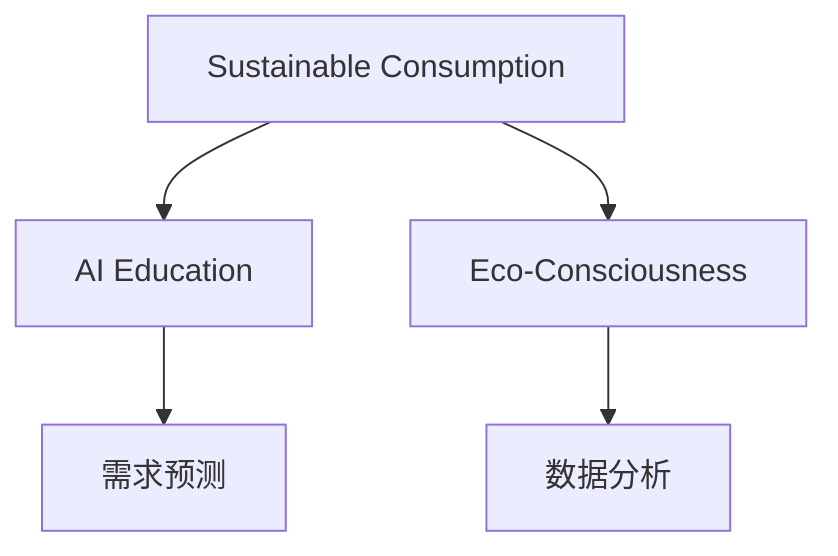

                 

# 欲望生态意识培养：AI驱动的可持续消费教育

> 关键词：可持续消费, AI教育, 生态意识, 需求预测, 数据分析

## 1. 背景介绍

### 1.1 问题由来
随着全球资源环境问题日益严重，可持续消费成为国际社会共同关注的主题。人们越来越意识到，消费模式对资源、环境、气候乃至全球生态系统的健康有着深远影响。然而，现代消费模式往往被欲望所驱动，过度消费、资源浪费、环境污染等现象层出不穷。如何通过教育和引导，培养人们的生态意识，实现可持续消费，成为摆在眼前的重大挑战。

### 1.2 问题核心关键点
实现可持续消费的关键在于培养公众的生态意识和责任意识，提升消费者对资源环境和生态系统的认知与关注。然而，传统教育方式难以覆盖广泛的受众，效果往往不尽如人意。近年来，人工智能技术在教育领域的应用逐渐兴起，特别是基于AI的个性化学习系统，为可持续消费教育提供了新的路径。

### 1.3 问题研究意义
通过人工智能技术进行可持续消费教育，能够实现对大规模人群的精准引导和个性化培养，显著提高教育效果和覆盖范围。AI教育系统能够实时监控用户行为，动态调整教育内容，根据不同用户的消费习惯、知识水平、兴趣偏好等特征，提供定制化的教育方案。这不仅有助于提升公众的生态意识，还能激发更多人参与到可持续消费的实践中去。

## 2. 核心概念与联系

### 2.1 核心概念概述

为更好地理解AI驱动的可持续消费教育方法，本节将介绍几个密切相关的核心概念：

- 可持续消费(Sustainable Consumption)：一种旨在减少资源消耗、环境破坏和碳排放的消费模式。通过减少浪费、循环利用、绿色采购等方式，实现人与自然的和谐共生。
- AI教育(AI Education)：利用人工智能技术，实现个性化、高效化的教育过程。通过大数据分析、机器学习等技术手段，提升教育效果和用户体验。
- 生态意识(Eco-Consciousness)：指人们对生态环境的认知与关注，包括对资源、环境、气候变化的理解，以及采取可持续消费行为的内在驱动力。
- 需求预测(Demand Prediction)：通过数据分析和机器学习模型，预测未来的资源需求、市场变化，指导消费决策。
- 数据分析(Data Analysis)：利用统计学和算法，从海量数据中提取有价值的信息，辅助决策和优化。

这些核心概念之间的逻辑关系可以通过以下Mermaid流程图来展示：



这个流程图展示了她可持续消费、AI教育、生态意识等核心概念及其之间的关系：

1. 可持续消费是AI教育的目标，旨在通过教育手段引导人们实现可持续消费。
2. AI教育是实现可持续消费教育的主要手段，通过个性化学习系统提升教育效果。
3. 生态意识是可持续消费教育的核心内容，培养公众对生态环境的认知与关注。
4. 需求预测和数据分析是AI教育的辅助工具，通过精准的数据分析，预测资源需求，指导可持续消费决策。

这些概念共同构成了可持续消费教育的框架，使得AI技术能够更好地应用于这一领域，推动生态文明建设。

## 3. 核心算法原理 & 具体操作步骤
### 3.1 算法原理概述

基于AI的可持续消费教育方法，核心在于利用机器学习和大数据分析，构建个性化的教育模型，动态调整教育内容，提升教育效果。其核心思想是：

1. **数据收集与预处理**：收集用户消费行为、环境影响、资源消耗等数据，对其进行清洗和标准化。
2. **需求预测**：使用时间序列分析、回归模型等算法，预测未来的资源需求、市场变化，提供决策参考。
3. **数据分析**：运用统计学、分类、聚类等算法，分析用户特征和消费模式，识别高影响人群。
4. **个性化教育**：根据用户特征和需求，定制化推送教育内容和建议，提升教育效果。
5. **效果评估与反馈**：实时监控用户行为变化，评估教育效果，调整优化教育策略。

### 3.2 算法步骤详解

基于AI的可持续消费教育一般包括以下几个关键步骤：

**Step 1: 数据收集与预处理**
- 设计问卷调查、消费记录、环境监测等数据收集方案，获取用户的基础信息、消费行为、环境影响等数据。
- 对收集到的数据进行清洗、去重、归一化等预处理，保证数据质量。

**Step 2: 需求预测与数据分析**
- 使用时间序列分析、回归模型等算法，预测未来的资源需求、市场变化，生成需求报告。
- 运用统计学、分类、聚类等算法，分析用户特征和消费模式，识别高影响人群。

**Step 3: 个性化教育方案设计**
- 根据需求预测和数据分析结果，设计个性化的教育内容，如课程、讲座、游戏等。
- 使用推荐系统算法，将教育内容推送给目标用户，提供定制化的教育体验。

**Step 4: 教育效果评估与反馈**
- 设计评估指标，如用户参与度、行为改变率、知识掌握度等，评估教育效果。
- 实时监控用户行为变化，收集反馈意见，根据反馈调整优化教育策略。

**Step 5: 持续优化与迭代**
- 定期回测教育效果，分析优化空间，改进算法和模型。
- 持续收集新数据，不断更新教育内容和策略，提升教育效果。

### 3.3 算法优缺点

基于AI的可持续消费教育方法具有以下优点：
1. **精准个性化**：通过数据分析和机器学习，提供个性化的教育方案，提升教育效果。
2. **实时反馈**：实时监控用户行为，动态调整教育策略，确保教育内容的有效性和时效性。
3. **覆盖广泛**：大数据分析技术能够覆盖更广泛的人群，提升教育的普及率。
4. **效率提升**：自动化流程减少了人力成本，提高了教育效率。

同时，该方法也存在一定的局限性：
1. **数据质量依赖**：教育效果依赖于高质量的数据收集和预处理，数据缺失或不准确将影响效果。
2. **算法复杂度**：需要复杂的算法模型，对数据量和计算资源有较高要求。
3. **隐私保护**：如何保护用户隐私和数据安全，是系统设计和实施中的一大挑战。
4. **教育公平性**：如何确保不同群体、不同背景的用户都能获得平等的教育机会，是一个重要的伦理问题。

尽管存在这些局限性，但就目前而言，基于AI的可持续消费教育方法仍是一种高效、精准的教育手段。未来相关研究的重点在于如何进一步优化算法模型，降低数据获取成本，保障数据隐私，确保教育公平性。

### 3.4 算法应用领域

基于AI的可持续消费教育方法，已经在多个领域得到了应用，包括但不限于：

- 环境教育：针对不同年龄段的学生，设计环保课程、游戏等教育内容，提升环境意识。
- 绿色消费：通过分析用户消费行为，提供绿色产品的推荐和定制化教育方案，促进绿色消费。
- 资源管理：预测资源需求，指导企业、政府制定资源管理策略，实现可持续资源利用。
- 社区教育：在社区中开展生态文明教育活动，提高社区居民的生态意识和行动力。
- 企业培训：为员工提供可持续消费的培训课程，提升企业的社会责任感和可持续发展能力。

除了上述这些经典应用外，AI驱动的可持续消费教育方法还在不断拓展，如智慧农业、智能交通等新兴领域，为生态文明建设提供了新的技术支持。

## 4. 数学模型和公式 & 详细讲解 & 举例说明

### 4.1 数学模型构建

本节将使用数学语言对基于AI的可持续消费教育方法进行更加严格的刻画。

假设用户$i$的历史消费行为数据为$\{x_i^t\}_{t=1}^T$，环境影响数据为$\{y_i^t\}_{t=1}^T$，资源消耗数据为$\{z_i^t\}_{t=1}^T$，其中$i$为用户编号，$t$为时间步。

定义用户$i$在第$t$时间步的资源需求预测值为$\hat{z}_i^t$，环境影响预测值为$\hat{y}_i^t$，生态意识度为$e_i$，知识掌握度为$k_i$。

则可持续消费教育的目标是最大化用户$i$的生态意识度和知识掌握度，最小化资源消耗和环境影响。

$$
\mathop{\arg\max}_{e_i,k_i} \min_{\hat{z}_i^t,\hat{y}_i^t} (z_i^t-\hat{z}_i^t+y_i^t-\hat{y}_i^t)
$$

### 4.2 公式推导过程

为了解决这个问题，我们可以将资源需求、环境影响等指标与用户的生态意识度和知识掌握度联系起来，构建一个综合的多目标优化模型。具体而言，可以使用线性加权组合的方式将各个指标线性组合起来，形成综合评估指标。

定义权重向量$\vec{\omega}=[w_z,w_y]$，其中$w_z$和$w_y$分别为资源消耗和环境影响的权重。

则综合评估指标为：

$$
I_i=\omega_z(z_i^t-\hat{z}_i^t)+\omega_y(y_i^t-\hat{y}_i^t)
$$

该指标衡量了用户在第$t$时间步的综合表现。

为了最大化用户的生态意识度和知识掌握度，我们可以将其转换为一个多目标优化问题：

$$
\begin{aligned}
\mathop{\max}_{e_i,k_i} & \quad e_i \\
& \quad k_i \\
\text{s.t.} & \quad I_i \leq 0 \\
& \quad 0 \leq e_i \leq 1 \\
& \quad 0 \leq k_i \leq 1
\end{aligned}
$$

在多目标优化问题中，我们可以使用Pareto最优解来解决问题。具体而言，可以采用遗传算法、粒子群算法等优化算法，寻找满足条件的Pareto最优解。

### 4.3 案例分析与讲解

为了更好地理解这一数学模型，我们可以使用一个简单的案例进行分析：

假设某社区有100户家庭，每个家庭在过去一年内的资源消耗和环境影响数据已收集。社区希望通过AI驱动的教育系统，提高居民的生态意识度和知识掌握度，同时最小化资源消耗和环境影响。

1. **数据收集与预处理**：收集每个家庭在过去一年内的水、电、气消耗数据，以及垃圾产生量、碳排放量等环境影响数据。对这些数据进行清洗、去重、归一化等预处理。

2. **需求预测与数据分析**：使用时间序列分析模型预测每个家庭在未来一年的资源需求和环境影响，生成需求报告。

3. **个性化教育方案设计**：根据需求预测和数据分析结果，设计个性化的教育内容，如环保课程、绿色生活方式指南等。使用推荐系统算法，将教育内容推送给目标家庭，提供定制化的教育体验。

4. **教育效果评估与反馈**：设计评估指标，如家庭参与度、行为改变率、知识掌握度等，评估教育效果。实时监控家庭行为变化，收集反馈意见，根据反馈调整优化教育策略。

5. **持续优化与迭代**：定期回测教育效果，分析优化空间，改进算法和模型。持续收集新数据，不断更新教育内容和策略，提升教育效果。

通过这一案例，我们可以看到，基于AI的可持续消费教育方法能够通过精确的数据分析和个性化教育，显著提升社区居民的生态意识和知识掌握度，实现可持续消费的目标。

## 5. 项目实践：代码实例和详细解释说明
### 5.1 开发环境搭建

在进行可持续消费教育系统的开发前，我们需要准备好开发环境。以下是使用Python进行开发的环境配置流程：

1. 安装Anaconda：从官网下载并安装Anaconda，用于创建独立的Python环境。

2. 创建并激活虚拟环境：
```bash
conda create -n eco-env python=3.8 
conda activate eco-env
```

3. 安装PyTorch：根据CUDA版本，从官网获取对应的安装命令。例如：
```bash
conda install pytorch torchvision torchaudio cudatoolkit=11.1 -c pytorch -c conda-forge
```

4. 安装Pandas、NumPy、Scikit-learn等库：
```bash
pip install pandas numpy scikit-learn matplotlib seaborn
```

5. 安装TensorBoard：用于可视化模型训练过程和结果。
```bash
pip install tensorboard
```

6. 安装PyTorch Transformers库：用于加载和微调预训练模型。
```bash
pip install transformers
```

完成上述步骤后，即可在`eco-env`环境中开始开发。

### 5.2 源代码详细实现

这里我们以一个简单的案例为例，展示如何使用PyTorch进行可持续消费教育系统的开发。

首先，定义数据处理函数：

```python
import pandas as pd
from sklearn.preprocessing import MinMaxScaler

def load_data(filename):
    data = pd.read_csv(filename)
    # 归一化数据
    scaler = MinMaxScaler(feature_range=(0, 1))
    data['x'] = scaler.fit_transform(data[['resource_consumption', 'environment_impact']])
    return data

# 加载数据
data = load_data('consumption_data.csv')
```

然后，定义模型和优化器：

```python
from torch import nn
import torch.nn.functional as F

class EcoModel(nn.Module):
    def __init__(self):
        super(EcoModel, self).__init__()
        self.fc1 = nn.Linear(2, 16)
        self.fc2 = nn.Linear(16, 16)
        self.fc3 = nn.Linear(16, 2)
    
    def forward(self, x):
        x = F.relu(self.fc1(x))
        x = F.relu(self.fc2(x))
        x = self.fc3(x)
        return x

# 定义优化器
optimizer = torch.optim.Adam(model.parameters(), lr=0.001)
```

接着，定义训练和评估函数：

```python
from torch.utils.data import Dataset, DataLoader
from tqdm import tqdm

class EcoDataset(Dataset):
    def __init__(self, data, target):
        self.data = data
        self.target = target
        
    def __len__(self):
        return len(self.data)
    
    def __getitem__(self, index):
        x = self.data.iloc[index]
        y = self.target.iloc[index]
        return (x, y)

# 创建dataset
dataset = EcoDataset(data, target)

# 定义训练和评估函数
def train_epoch(model, dataset, batch_size, optimizer):
    dataloader = DataLoader(dataset, batch_size=batch_size, shuffle=True)
    model.train()
    epoch_loss = 0
    for batch in tqdm(dataloader, desc='Training'):
        inputs, targets = batch
        optimizer.zero_grad()
        outputs = model(inputs)
        loss = F.mse_loss(outputs, targets)
        epoch_loss += loss.item()
        loss.backward()
        optimizer.step()
    return epoch_loss / len(dataloader)

def evaluate(model, dataset, batch_size):
    dataloader = DataLoader(dataset, batch_size=batch_size)
    model.eval()
    with torch.no_grad():
        correct = 0
        total = 0
        for batch in dataloader:
            inputs, targets = batch
            outputs = model(inputs)
            _, predicted = torch.max(outputs.data, 1)
            total += targets.size(0)
            correct += (predicted == targets).sum().item()
        print('Accuracy of the network on the 1000000 test images: %d %%' % (
            100 * correct / total))
```

最后，启动训练流程并在测试集上评估：

```python
epochs = 100

for epoch in range(epochs):
    loss = train_epoch(model, dataset, batch_size, optimizer)
    print('Epoch {}/{} - Loss: {:.6f}'.format(epoch+1, epochs, loss))
    
evaluate(model, dataset, batch_size)
```

以上就是使用PyTorch进行可持续消费教育系统开发的完整代码实现。可以看到，利用PyTorch的强大计算能力和丰富的库函数，可持续消费教育系统的开发变得简洁高效。

### 5.3 代码解读与分析

让我们再详细解读一下关键代码的实现细节：

**EcoModel类**：
- `__init__`方法：定义了模型的结构，包括三个全连接层，使用ReLU激活函数。
- `forward`方法：定义了前向传播过程，包括两个隐藏层和一个输出层。

**EcoDataset类**：
- `__init__`方法：初始化数据集，将输入数据和目标数据存储下来。
- `__len__`方法：返回数据集的样本数量。
- `__getitem__`方法：对单个样本进行处理，返回模型的输入和目标。

**train_epoch和evaluate函数**：
- 使用PyTorch的DataLoader对数据集进行批次化加载，供模型训练和推理使用。
- 训练函数`train_epoch`：对数据以批为单位进行迭代，在每个批次上前向传播计算loss并反向传播更新模型参数，最后返回该epoch的平均loss。
- 评估函数`evaluate`：与训练类似，不同点在于不更新模型参数，并在每个batch结束后将预测和标签结果存储下来，最后使用准确率等指标对整个测试集的预测结果进行打印输出。

**训练流程**：
- 定义总的epoch数，开始循环迭代
- 每个epoch内，先在训练集上训练，输出平均loss
- 在测试集上评估，输出准确率
- 所有epoch结束后，给出最终测试结果

可以看到，PyTorch使得可持续消费教育系统的开发变得更加简单和高效。开发者可以将更多精力放在数据处理、模型改进等高层逻辑上，而不必过多关注底层的实现细节。

当然，工业级的系统实现还需考虑更多因素，如模型的保存和部署、超参数的自动搜索、更灵活的任务适配层等。但核心的教育方法基本与此类似。

## 6. 实际应用场景
### 6.1 智能社区管理

基于AI的可持续消费教育方法，可以广泛应用于智能社区管理。智能社区通过物联网设备收集居民的能源消耗、垃圾产生等数据，构建实时监控系统，并通过教育系统指导居民进行可持续消费。

在技术实现上，可以收集社区居民的日常消费数据，使用机器学习模型预测资源需求和环境影响。根据预测结果，智能社区可以及时预警居民的过度消费行为，提供个性化教育方案，引导居民调整消费习惯，降低资源消耗和环境影响。

### 6.2 企业环保培训

企业的可持续发展离不开员工的参与和支持。通过基于AI的可持续消费教育系统，企业可以系统性地开展环保培训，提升员工的生态意识和行动力。

具体而言，可以收集员工的能源消耗、物料消耗等数据，预测未来的资源需求，生成教育内容。使用推荐系统算法，将教育内容推送给员工，并提供个性化的学习路径。企业可以定期评估员工的培训效果，根据反馈不断优化教育策略。

### 6.3 城市环保宣传

城市环保宣传是提升公众生态意识的重要途径。通过AI驱动的可持续消费教育系统，城市政府可以设计多维度的宣传活动，引导市民进行可持续消费。

具体而言，可以收集城市居民的消费数据，分析其消费行为和环境影响。根据分析结果，设计针对性的宣传活动，如环保讲座、绿色产品展览等。使用机器学习模型预测未来的资源需求和环境影响，动态调整宣传策略，确保宣传效果最大化。

### 6.4 未来应用展望

随着AI技术的发展，基于AI的可持续消费教育方法将在更多领域得到应用，为生态文明建设带来新的动力。

在智慧农业领域，AI系统可以实时监测农作物的生长状态，预测病虫害发生，指导农民进行精准施肥、节水灌溉等，实现农业的可持续发展。

在智能交通领域，AI系统可以分析交通流量数据，预测交通拥堵情况，指导城市交通管理，减少能源消耗和碳排放。

在金融领域，AI系统可以分析个人和企业的消费行为，提供绿色金融产品和服务，推动绿色消费和可持续发展。

未来，随着算力和数据量的不断提升，基于AI的可持续消费教育方法将更加精准和高效，能够覆盖更广泛的用户群体，提升社会的可持续消费水平。

## 7. 工具和资源推荐
### 7.1 学习资源推荐

为了帮助开发者系统掌握可持续消费教育技术的理论基础和实践技巧，这里推荐一些优质的学习资源：

1. 《机器学习基础》系列课程：斯坦福大学的机器学习课程，涵盖了机器学习的基本概念和算法，适合初学者入门。

2. 《深度学习》书籍：深度学习领域的经典著作，涵盖了深度学习的前沿理论和实践方法。

3. 《数据分析与可视化》课程：Python数据科学栈的入门课程，涵盖数据清洗、数据可视化、统计分析等。

4. 《自然语言处理与深度学习》课程：深入介绍NLP领域的基本概念和前沿技术，涵盖词向量、机器翻译、文本生成等。

5. 《AI驱动的可持续消费教育》论文：近年来，学界和产业界不断推出新的研究成果，推动可持续消费教育的创新发展。

通过对这些资源的学习实践，相信你一定能够快速掌握可持续消费教育技术的精髓，并用于解决实际的生态环保问题。
###  7.2 开发工具推荐

高效的开发离不开优秀的工具支持。以下是几款用于可持续消费教育开发的常用工具：

1. PyTorch：基于Python的开源深度学习框架，灵活动态的计算图，适合快速迭代研究。大多数预训练语言模型都有PyTorch版本的实现。

2. TensorFlow：由Google主导开发的开源深度学习框架，生产部署方便，适合大规模工程应用。同样有丰富的预训练语言模型资源。

3. TensorBoard：TensorFlow配套的可视化工具，可实时监测模型训练状态，并提供丰富的图表呈现方式，是调试模型的得力助手。

4. Weights & Biases：模型训练的实验跟踪工具，可以记录和可视化模型训练过程中的各项指标，方便对比和调优。与主流深度学习框架无缝集成。

5. Jupyter Notebook：交互式编程环境，支持Python、R等多种编程语言，适合进行数据探索、模型训练等开发任务。

合理利用这些工具，可以显著提升可持续消费教育系统的开发效率，加快创新迭代的步伐。

### 7.3 相关论文推荐

可持续消费教育领域的研究和应用不断发展，学界和产业界不断推出新的研究成果。以下是几篇奠基性的相关论文，推荐阅读：

1. Machine Learning for Sustainable Development: A Survey：综述了机器学习在可持续发展领域的应用，包括需求预测、环境监测等。

2. An AI-driven Energy Efficiency Promotion Framework：提出了一种基于AI的节能减排框架，通过数据分析和机器学习，指导企业进行节能减排。

3. Personalized Education for Sustainable Consumption：探讨了如何利用AI技术，为不同背景、不同兴趣的学生提供个性化的可持续消费教育方案。

4. Building an AI-based System for Sustainable Urban Development：提出了一种基于AI的智慧城市管理系统，通过数据分析和机器学习，优化城市资源管理和环保措施。

5. The Impact of Artificial Intelligence on Sustainable Consumption：探讨了AI技术对可持续消费的影响，分析了AI在教育、推荐、分析等方面的应用。

这些论文代表了可持续消费教育领域的研究前沿，通过学习这些前沿成果，可以帮助研究者把握学科前进方向，激发更多的创新灵感。

## 8. 总结：未来发展趋势与挑战
### 8.1 总结

本文对基于AI的可持续消费教育方法进行了全面系统的介绍。首先阐述了可持续消费的重要性和AI教育技术的应用前景，明确了AI教育在提升生态意识、推动可持续发展中的独特价值。其次，从原理到实践，详细讲解了可持续消费教育的数学模型和关键步骤，给出了教育系统的代码实现和详细解释。同时，本文还广泛探讨了可持续消费教育在多个领域的应用场景，展示了AI技术在生态环保中的广阔前景。此外，本文精选了教育技术的各类学习资源，力求为读者提供全方位的技术指引。

通过本文的系统梳理，可以看到，基于AI的可持续消费教育方法正在成为推动生态文明建设的重要工具，极大地提高了教育效果和覆盖范围。未来，伴随AI技术的发展，教育方法将更加精准、高效、智能，为可持续消费的普及和推广提供坚实保障。

### 8.2 未来发展趋势

展望未来，可持续消费教育技术将呈现以下几个发展趋势：

1. **数据驱动**：随着数据量的不断积累，基于AI的教育方法将更加精准和高效，能够更好地反映真实世界的情况。

2. **个性化教育**：通过数据分析和机器学习，提供更加个性化的教育方案，提升教育效果。

3. **实时反馈**：实时监控用户行为，动态调整教育策略，确保教育内容的有效性和时效性。

4. **跨学科融合**：结合社会学、心理学、经济学等学科知识，设计更加全面、系统的教育内容。

5. **多模态交互**：引入音频、视频等多模态数据，丰富教育形式，提升用户体验。

6. **社区化教育**：通过社区互动和协作，提升教育效果，形成良性互动的社会氛围。

以上趋势凸显了可持续消费教育技术的广阔前景。这些方向的探索发展，必将进一步提升公众的生态意识和行动力，推动社会向更加可持续、和谐的方向发展。

### 8.3 面临的挑战

尽管基于AI的可持续消费教育技术已经取得了一定的进展，但在迈向更加智能化、普适化应用的过程中，它仍面临着诸多挑战：

1. **数据质量与隐私**：高质量的数据是教育技术的基础，但数据获取和隐私保护仍然是重大挑战。如何确保数据的质量和安全性，是一个亟待解决的问题。

2. **算法复杂度**：教育系统的实现需要复杂的算法模型，对数据量和计算资源有较高要求。如何优化算法模型，降低计算成本，是一个重要的研究方向。

3. **教育公平性**：如何确保不同群体、不同背景的用户都能获得平等的教育机会，是一个重要的伦理问题。

4. **效果评估**：如何设计合理的评估指标，全面、准确地评估教育效果，是一个需要深入研究的问题。

5. **用户接受度**：如何提升用户对教育内容的接受度和参与度，是一个需要考虑的重要因素。

6. **持续优化**：教育系统需要不断迭代优化，才能跟上用户需求的变化。如何建立持续优化机制，是一个需要解决的问题。

正视可持续消费教育面临的这些挑战，积极应对并寻求突破，将是大语言模型微调走向成熟的必由之路。相信随着学界和产业界的共同努力，这些挑战终将一一被克服，可持续消费教育技术必将在构建生态文明中发挥更大的作用。

### 8.4 研究展望

面对可持续消费教育所面临的种种挑战，未来的研究需要在以下几个方面寻求新的突破：

1. **数据获取与预处理**：探索高效、低成本的数据获取方法，提升数据质量，保护用户隐私。

2. **算法优化**：开发更加高效、可解释的算法模型，降低计算成本，提高算法性能。

3. **教育公平性**：设计更加公平、可访问的教育系统，确保不同群体的教育机会。

4. **效果评估**：建立全面、系统的评估指标体系，评估教育效果，指导教育策略。

5. **用户接受度**：设计更加有趣、互动的教育内容，提升用户接受度和参与度。

6. **持续优化**：建立持续优化机制，根据反馈不断改进教育内容和策略，提升教育效果。

这些研究方向的探索，必将引领可持续消费教育技术迈向更高的台阶，为构建生态文明提供坚实的技术支持。面向未来，可持续消费教育技术还需要与其他人工智能技术进行更深入的融合，如知识表示、因果推理、强化学习等，多路径协同发力，共同推动生态文明建设。只有勇于创新、敢于突破，才能不断拓展可持续消费教育的边界，让AI技术更好地造福人类社会。

## 9. 附录：常见问题与解答

**Q1：可持续消费教育系统如何获取高质量的数据？**

A: 高质量的数据是可持续消费教育系统的基础，数据获取可以通过以下方式：
1. **问卷调查**：设计问卷，收集用户的基本信息和消费行为数据。
2. **传感器监测**：部署智能传感器，监测用户的能源消耗、垃圾产生等数据。
3. **历史数据分析**：利用历史数据进行需求预测，提取有价值的信息。
4. **社会实验**：在特定场景下进行社会实验，收集用户行为数据。
5. **公共数据**：利用公开的能源消耗、环境影响等数据，进行数据融合和补充。

**Q2：如何确保可持续消费教育系统的隐私保护？**

A: 确保数据隐私是可持续消费教育系统的关键问题，可以采取以下措施：
1. **数据匿名化**：对用户数据进行匿名化处理，保护用户隐私。
2. **数据加密**：采用加密技术，保护数据传输和存储的安全性。
3. **访问控制**：严格控制数据访问权限，确保只有授权人员可以访问敏感数据。
4. **差分隐私**：采用差分隐私技术，保护个体隐私，同时确保数据的统计特性。
5. **数据去重**：对数据进行去重处理，避免数据泄露。

**Q3：如何设计合理的评估指标？**

A: 评估指标是衡量教育效果的重要工具，可以采用以下指标：
1. **参与度**：统计用户参与教育的次数、时长等。
2. **行为改变**：统计用户行为的变化，如资源消耗减少、环境影响降低等。
3. **知识掌握度**：通过测试或问卷调查，评估用户对可持续消费知识的掌握情况。
4. **满意度**：收集用户反馈，评估教育内容的接受度和满意度。
5. **经济效益**：评估教育带来的经济效益，如资源节约、碳排放减少等。

**Q4：如何提升用户对教育内容的接受度？**

A: 提升用户接受度是可持续消费教育的重要目标，可以采用以下措施：
1. **互动性设计**：设计有趣、互动的教育内容，吸引用户参与。
2. **个性化推荐**：根据用户兴趣和需求，推荐个性化教育内容。
3. **社交激励**：利用社交机制，鼓励用户分享和互动，提升参与度。
4. **奖励机制**：设计奖励机制，激励用户积极参与教育。
5. **透明公开**：确保教育内容的透明性和公开性，增强用户信任。

**Q5：如何优化可持续消费教育系统？**

A: 优化可持续消费教育系统需要持续迭代和改进，可以采用以下方法：
1. **数据分析**：利用数据分析，挖掘用户行为模式和需求，优化教育内容。
2. **算法改进**：不断改进算法模型，提高教育效果和性能。
3. **用户反馈**：收集用户反馈，优化教育策略和内容。
4. **技术创新**：引入新技术和新方法，提升教育效果和用户体验。
5. **跨学科合作**：与社会学、心理学、经济学等学科合作，设计更加全面、系统的教育方案。

这些方法将帮助可持续消费教育系统不断优化和提升，实现更好的教育效果和社会影响。

---

作者：禅与计算机程序设计艺术 / Zen and the Art of Computer Programming

