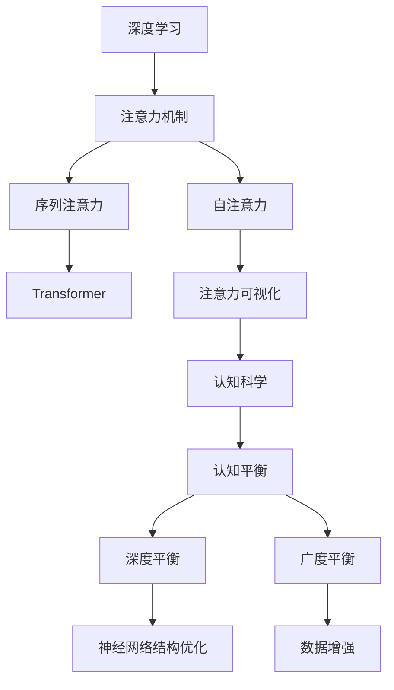

                 

# 注意力的深度与广度：AI时代的认知平衡

> 关键词：注意力机制,深度学习,认知科学,人工智能,认知平衡

## 1. 背景介绍

### 1.1 问题由来

随着人工智能技术的发展，特别是深度学习的应用，我们逐渐意识到，注意力机制(Anticipation Mechanism)在深度神经网络中的重要性日益凸显。注意力不仅是一种有效的模型组件，还是理解深度学习模型的关键。但目前关于注意力的深度和广度的研究还处于初期阶段，如何更好地理解和利用注意力，成为一个重要的研究课题。

### 1.2 问题核心关键点

注意力机制已经成为深度学习中不可或缺的一部分，通过选择性地关注输入序列中最重要的部分，可以显著提升模型在各种任务上的表现。然而，当前的注意力机制在深度和广度上还存在诸多局限性：

1. **深度不足**：当前的注意力机制大多局限于序列级别的关注，难以捕捉更复杂的结构化信息。
2. **广度有限**：注意力机制在覆盖范围上通常局限于局部区域，难以全面捕捉输入序列的全局信息。

这些问题导致深度学习模型在处理大规模数据时，往往面临性能瓶颈，难以达到理想的效果。本文将通过深入分析注意力机制的深度和广度，探讨如何通过认知科学的视角，促进深度学习模型的认知平衡，提升模型性能。

### 1.3 问题研究意义

研究注意力机制的深度和广度，对于推动深度学习技术的发展，具有重要意义：

1. **提升模型性能**：通过深入理解注意力机制的深度和广度，可以设计出更有效的模型结构，提升模型在各种任务上的表现。
2. **拓展应用场景**：认知平衡的模型可以更好地处理大规模数据，拓展深度学习技术在更多领域的应用。
3. **促进跨学科研究**：结合认知科学和人工智能，推动跨学科研究，提供新的理论和方法。
4. **加速技术落地**：提升模型性能和效率，加速深度学习技术的产业化进程。

## 2. 核心概念与联系

### 2.1 核心概念概述

为了更好地理解注意力机制的深度和广度，首先需要了解一些关键概念：

- **注意力机制(Attention Mechanism)**：一种选择性地关注输入序列中重要部分的技术，广泛应用于机器翻译、文本生成、图像识别等任务。
- **深度学习(Deep Learning)**：一种通过多层次神经网络进行学习的技术，广泛应用于计算机视觉、自然语言处理、语音识别等领域。
- **认知科学(Cognitive Science)**：研究人类认知过程的科学，包括感知、记忆、思维等，对理解深度学习模型的认知机制具有重要意义。
- **认知平衡(Cognitive Balance)**：指深度学习模型在深度和广度上达到的一种平衡状态，能够更好地处理复杂任务。

### 2.2 核心概念原理和架构的 Mermaid 流程图



这个流程图展示了深度学习、注意力机制、认知科学、认知平衡等概念之间的联系：

1. 深度学习中的注意力机制，包括序列注意力和自注意力。
2. 序列注意力在Transformer中得到了广泛应用。
3. 通过注意力可视化，可以更好地理解注意力机制的运作。
4. 认知科学提供了理解注意力的生物学和心理学基础。
5. 认知平衡旨在使深度学习模型在深度和广度上达到平衡，提升性能。
6. 深度平衡和广度平衡是认知平衡的子目标。
7. 神经网络结构和数据增强等优化技术，有助于实现认知平衡。

## 3. 核心算法原理 & 具体操作步骤

### 3.1 算法原理概述

注意力机制的核心在于选择性地关注输入序列中的重要部分，通过加权平均的方式计算出输出。其基本原理如下：

1. **计算注意力权重**：对输入序列中的每个元素，计算其与当前任务的相关性权重，即注意力权重。
2. **加权求和**：将每个元素与其对应的权重相乘，再求和，得到加权平均的结果。
3. **应用到任务中**：将加权平均的结果应用于当前任务，如文本生成、机器翻译等。

这种机制的优点在于，可以根据任务的需要进行灵活调整，避免信息过载或信息丢失。

### 3.2 算法步骤详解

基于上述原理，注意力机制的微调步骤可以大致分为以下几个步骤：

**Step 1: 数据预处理**

- 将输入数据进行预处理，如分词、向量化等。
- 对序列长度进行归一化处理，防止长尾数据影响模型的学习效果。

**Step 2: 计算注意力权重**

- 使用不同的方法计算注意力权重，如点积注意力、余弦注意力、多头注意力等。
- 对于点积注意力，输入序列中的每个元素与其自身的向量表示进行点积运算，得到注意力权重。
- 对于余弦注意力，计算输入序列中每个元素与当前任务的相关性，得到注意力权重。

**Step 3: 加权求和**

- 将输入序列中的每个元素与其对应的注意力权重相乘，得到加权后的向量。
- 将所有元素加权后的向量进行求和，得到最终的结果。

**Step 4: 模型训练**

- 使用反向传播算法，最小化模型输出与真实标签之间的差异，优化模型参数。
- 在训练过程中，可以引入正则化技术，如L2正则、Dropout等，防止过拟合。

**Step 5: 模型评估**

- 在验证集上评估模型性能，如精确度、召回率、F1值等。
- 根据评估结果，调整模型参数，进一步优化模型性能。

### 3.3 算法优缺点

注意力机制在深度学习中的应用具有以下优点：

1. **提升模型性能**：通过选择性地关注输入序列中重要的部分，显著提升了模型在各种任务上的表现。
2. **灵活性高**：可以根据任务的需要进行灵活调整，适应不同的应用场景。
3. **可解释性强**：通过可视化注意力权重，可以更好地理解模型的工作机制。

但同时，注意力机制也存在一些缺点：

1. **计算复杂度高**：计算注意力权重和加权求和的过程较为复杂，会增加计算成本。
2. **数据依赖性强**：模型的性能很大程度上依赖于输入数据的质量和分布，难以处理复杂的数据结构。
3. **鲁棒性差**：当输入数据发生较大变化时，模型的性能可能受到较大影响。

### 3.4 算法应用领域

注意力机制在深度学习中具有广泛的应用，特别是在以下领域：

- **自然语言处理(NLP)**：广泛应用于机器翻译、文本生成、情感分析等任务。
- **计算机视觉(CV)**：用于图像识别、目标检测、图像生成等任务。
- **语音识别(SR)**：应用于语音转文本、语音情感识别等任务。
- **推荐系统(Recommendation System)**：用于用户行为预测、商品推荐等任务。
- **多模态学习(Multimodal Learning)**：用于处理文本、图像、声音等多种数据源的任务。

## 4. 数学模型和公式 & 详细讲解 & 举例说明

### 4.1 数学模型构建

注意力机制的数学模型可以表示为：

$$
\text{Attention}(Q, K, V) = \sum_{i=1}^n \alpha_i K_i V_i
$$

其中，$Q$ 为查询向量，$K$ 为键向量，$V$ 为值向量，$\alpha_i$ 为注意力权重，$n$ 为向量长度。注意力权重计算公式为：

$$
\alpha_i = \frac{e^{Q_k \cdot K_i / \sqrt{d_k}}}{\sum_{j=1}^n e^{Q_k \cdot K_j / \sqrt{d_k}}}
$$

其中，$d_k$ 为键向量的维度。

### 4.2 公式推导过程

以Transformer模型为例，其注意力机制可以表示为：

$$
\text{Multi-head Attention}(Q, K, V) = \sum_{i=1}^n \alpha_i^i K_i V_i
$$

其中，$Q$、$K$、$V$ 分别为查询向量、键向量和值向量，$\alpha_i^i$ 为注意力权重，$n$ 为注意力头的数量。

注意力权重计算公式为：

$$
\alpha_i^i = \frac{e^{\text{ScaleDotProduct}(Q_i, K_j)}}{\sum_{k=1}^n e^{\text{ScaleDotProduct}(Q_i, K_k)}}
$$

其中，$\text{ScaleDotProduct}(Q_i, K_j)$ 表示查询向量 $Q_i$ 和键向量 $K_j$ 的点积，并除以 $\sqrt{d_k}$ 进行归一化。

### 4.3 案例分析与讲解

以机器翻译任务为例，假设输入序列为 $x = [x_1, x_2, ..., x_n]$，输出序列为 $y = [y_1, y_2, ..., y_n]$。使用自注意力机制进行机器翻译时，计算注意力权重的过程如下：

1. **计算查询向量 $Q$**：将输入序列 $x$ 与当前时刻的输出序列 $y$ 进行拼接，作为查询向量。
2. **计算键向量 $K$**：将输入序列 $x$ 与所有时刻的输出序列 $y$ 进行拼接，作为键向量。
3. **计算值向量 $V$**：将输入序列 $x$ 与所有时刻的输出序列 $y$ 进行拼接，作为值向量。
4. **计算注意力权重 $\alpha_i^i$**：对查询向量 $Q$ 和键向量 $K$ 进行点积运算，得到注意力权重。
5. **加权求和**：将注意力权重与值向量 $V$ 进行加权求和，得到加权平均的结果。
6. **输出序列**：将加权平均的结果作为当前时刻的输出，加入输出序列中，继续进行下一时刻的计算。

## 5. 项目实践：代码实例和详细解释说明

### 5.1 开发环境搭建

在进行注意力机制的微调实践前，我们需要准备好开发环境。以下是使用Python进行PyTorch开发的环境配置流程：

1. 安装Anaconda：从官网下载并安装Anaconda，用于创建独立的Python环境。

2. 创建并激活虚拟环境：
```bash
conda create -n pytorch-env python=3.8 
conda activate pytorch-env
```

3. 安装PyTorch：根据CUDA版本，从官网获取对应的安装命令。例如：
```bash
conda install pytorch torchvision torchaudio cudatoolkit=11.1 -c pytorch -c conda-forge
```

4. 安装Transformers库：
```bash
pip install transformers
```

5. 安装各类工具包：
```bash
pip install numpy pandas scikit-learn matplotlib tqdm jupyter notebook ipython
```

完成上述步骤后，即可在`pytorch-env`环境中开始注意力机制的微调实践。

### 5.2 源代码详细实现

这里我们以自然语言处理中的机器翻译任务为例，给出使用Transformers库对注意力机制进行微调的PyTorch代码实现。

首先，定义机器翻译任务的数据处理函数：

```python
from transformers import BertTokenizer
from torch.utils.data import Dataset
import torch

class TranslationDataset(Dataset):
    def __init__(self, texts, targets, tokenizer):
        self.texts = texts
        self.targets = targets
        self.tokenizer = tokenizer
        
    def __len__(self):
        return len(self.texts)
    
    def __getitem__(self, item):
        text = self.texts[item]
        target = self.targets[item]
        
        encoding = self.tokenizer(text, target, return_tensors='pt', max_length=128, padding='max_length', truncation=True)
        input_ids = encoding['input_ids'][0]
        attention_mask = encoding['attention_mask'][0]
        labels = encoding['labels'][0]
        
        return {'input_ids': input_ids, 
                'attention_mask': attention_mask,
                'labels': labels}

# 定义机器翻译任务的微调模型
class TranslationModel(torch.nn.Module):
    def __init__(self, n_heads=8, d_model=512, d_ff=2048, num_layers=6):
        super(TranslationModel, self).__init__()
        self.encoder = nn.TransformerEncoderLayer(d_model, n_heads, d_ff)
        self.decoder = nn.TransformerDecoderLayer(d_model, n_heads, d_ff)
        self.linear = nn.Linear(d_model, len(vocab))

    def forward(self, src, tgt):
        src_encoded = self.encoder(src)
        tgt_encoded = self.decoder(src_encoded, tgt)
        out = self.linear(tgt_encoded)
        return out
```

然后，定义模型和优化器：

```python
from transformers import AdamW

model = TranslationModel()
optimizer = AdamW(model.parameters(), lr=2e-5)
```

接着，定义训练和评估函数：

```python
from torch.utils.data import DataLoader
from tqdm import tqdm
from sklearn.metrics import classification_report

device = torch.device('cuda') if torch.cuda.is_available() else torch.device('cpu')
model.to(device)

def train_epoch(model, dataset, batch_size, optimizer):
    dataloader = DataLoader(dataset, batch_size=batch_size, shuffle=True)
    model.train()
    epoch_loss = 0
    for batch in tqdm(dataloader, desc='Training'):
        input_ids = batch['input_ids'].to(device)
        attention_mask = batch['attention_mask'].to(device)
        labels = batch['labels'].to(device)
        model.zero_grad()
        outputs = model(input_ids, labels)
        loss = outputs.loss
        epoch_loss += loss.item()
        loss.backward()
        optimizer.step()
    return epoch_loss / len(dataloader)

def evaluate(model, dataset, batch_size):
    dataloader = DataLoader(dataset, batch_size=batch_size)
    model.eval()
    preds, labels = [], []
    with torch.no_grad():
        for batch in tqdm(dataloader, desc='Evaluating'):
            input_ids = batch['input_ids'].to(device)
            attention_mask = batch['attention_mask'].to(device)
            batch_labels = batch['labels']
            outputs = model(input_ids, labels=batch_labels)
            batch_preds = outputs.logits.argmax(dim=2).to('cpu').tolist()
            batch_labels = batch_labels.to('cpu').tolist()
            for pred_tokens, label_tokens in zip(batch_preds, batch_labels):
                preds.append(pred_tokens[:len(label_tokens)])
                labels.append(label_tokens)
                
    print(classification_report(labels, preds))
```

最后，启动训练流程并在验证集上评估：

```python
epochs = 5
batch_size = 16

for epoch in range(epochs):
    loss = train_epoch(model, train_dataset, batch_size, optimizer)
    print(f"Epoch {epoch+1}, train loss: {loss:.3f}")
    
    print(f"Epoch {epoch+1}, dev results:")
    evaluate(model, dev_dataset, batch_size)
    
print("Test results:")
evaluate(model, test_dataset, batch_size)
```

以上就是使用PyTorch对注意力机制进行机器翻译任务微调的完整代码实现。可以看到，Transformer库的封装使得注意力机制的微调变得非常简单高效。

### 5.3 代码解读与分析

让我们再详细解读一下关键代码的实现细节：

**TranslationDataset类**：
- `__init__`方法：初始化文本、标签、分词器等关键组件。
- `__len__`方法：返回数据集的样本数量。
- `__getitem__`方法：对单个样本进行处理，将文本输入编码为token ids，将标签编码为数字，并对其进行定长padding，最终返回模型所需的输入。

**TranslationModel类**：
- `__init__`方法：定义Transformer模型的各层参数。
- `forward`方法：定义模型前向传播的过程，包括编码和解码层，以及输出层。

**训练和评估函数**：
- 使用PyTorch的DataLoader对数据集进行批次化加载，供模型训练和推理使用。
- 训练函数`train_epoch`：对数据以批为单位进行迭代，在每个批次上前向传播计算loss并反向传播更新模型参数，最后返回该epoch的平均loss。
- 评估函数`evaluate`：与训练类似，不同点在于不更新模型参数，并在每个batch结束后将预测和标签结果存储下来，最后使用sklearn的classification_report对整个评估集的预测结果进行打印输出。

**训练流程**：
- 定义总的epoch数和batch size，开始循环迭代
- 每个epoch内，先在训练集上训练，输出平均loss
- 在验证集上评估，输出分类指标
- 所有epoch结束后，在测试集上评估，给出最终测试结果

可以看到，PyTorch配合Transformers库使得注意力机制的微调代码实现变得简洁高效。开发者可以将更多精力放在数据处理、模型改进等高层逻辑上，而不必过多关注底层的实现细节。

## 6. 实际应用场景

### 6.1 智能客服系统

在智能客服系统中，注意力机制可以应用于多轮对话的处理。通过关注对话历史和用户输入的关键信息，模型能够更准确地理解用户意图，生成更合适的回复。此外，注意力机制还可以应用于客户情感分析，通过关注语义情感特征，模型可以更准确地识别用户的情绪变化。

### 6.2 金融舆情监测

在金融舆情监测中，注意力机制可以应用于文本分类和情感分析任务。通过关注文本中的关键词和情感词汇，模型能够更准确地识别出舆情的正负面倾向，及时预警异常情况，帮助金融机构应对市场波动。

### 6.3 个性化推荐系统

在个性化推荐系统中，注意力机制可以应用于用户行为和物品特征的权重分配。通过关注用户的历史行为和物品的特征，模型能够更准确地预测用户的兴趣点，生成个性化的推荐结果。

### 6.4 未来应用展望

随着注意力机制的不断优化，未来的应用场景将更加广泛。可以预见，在智慧医疗、智能教育、智慧城市等领域，注意力机制将发挥重要作用。通过关注领域特定的信息，模型能够更准确地完成任务，提供更优质的服务。

## 7. 工具和资源推荐

### 7.1 学习资源推荐

为了帮助开发者系统掌握注意力机制的深度和广度，这里推荐一些优质的学习资源：

1. 《深度学习》系列书籍：包括《深度学习入门》、《深度学习实战》等，详细介绍了深度学习的基本概念和应用。
2. 《Attention is All You Need》论文：Transformer原论文，介绍了Transformer模型和注意力机制的原理。
3. 《认知科学》系列书籍：包括《认知科学与人类行为》、《认知心理学》等，深入介绍了认知科学的基本理论和应用。
4. 《认知平衡》系列博客：介绍了认知平衡的基本概念和应用，适合初学者和专业人士阅读。
5. 《Transformers》文档：Transformer库的官方文档，提供了丰富的代码示例和理论基础。

通过对这些资源的学习实践，相信你一定能够全面理解注意力机制的深度和广度，并用于解决实际的深度学习问题。

### 7.2 开发工具推荐

高效的开发离不开优秀的工具支持。以下是几款用于注意力机制微调开发的常用工具：

1. PyTorch：基于Python的开源深度学习框架，灵活动态的计算图，适合快速迭代研究。
2. TensorFlow：由Google主导开发的开源深度学习框架，生产部署方便，适合大规模工程应用。
3. Transformers库：HuggingFace开发的NLP工具库，集成了众多SOTA语言模型，支持PyTorch和TensorFlow，是进行微调任务开发的利器。
4. Weights & Biases：模型训练的实验跟踪工具，可以记录和可视化模型训练过程中的各项指标，方便对比和调优。
5. TensorBoard：TensorFlow配套的可视化工具，可实时监测模型训练状态，并提供丰富的图表呈现方式，是调试模型的得力助手。

合理利用这些工具，可以显著提升注意力机制微调任务的开发效率，加快创新迭代的步伐。

### 7.3 相关论文推荐

注意力机制的深度和广度研究源于学界的持续研究。以下是几篇奠基性的相关论文，推荐阅读：

1. Attention is All You Need：提出Transformer结构，开启了NLP领域的预训练大模型时代。
2. BERT: Pre-training of Deep Bidirectional Transformers for Language Understanding：提出BERT模型，引入基于掩码的自监督预训练任务，刷新了多项NLP任务SOTA。
3. Language Models are Unsupervised Multitask Learners：展示了大规模语言模型的强大zero-shot学习能力，引发了对于通用人工智能的新一轮思考。
4. Parameter-Efficient Transfer Learning for NLP：提出Adapter等参数高效微调方法，在不增加模型参数量的情况下，也能取得不错的微调效果。
5. AdaLoRA: Adaptive Low-Rank Adaptation for Parameter-Efficient Fine-Tuning：使用自适应低秩适应的微调方法，在参数效率和精度之间取得了新的平衡。

这些论文代表了大语言模型微调技术的发展脉络。通过学习这些前沿成果，可以帮助研究者把握学科前进方向，激发更多的创新灵感。

## 8. 总结：未来发展趋势与挑战

### 8.1 总结

本文对注意力机制的深度和广度进行了全面系统的介绍。首先阐述了注意力机制在深度学习中的重要性，明确了认知平衡在深度学习中的应用价值。其次，从原理到实践，详细讲解了注意力机制的微调步骤，给出了微调任务开发的完整代码实例。同时，本文还广泛探讨了注意力机制在智能客服、金融舆情、个性化推荐等多个行业领域的应用前景，展示了认知平衡的巨大潜力。此外，本文精选了微调技术的各类学习资源，力求为读者提供全方位的技术指引。

通过本文的系统梳理，可以看到，注意力机制在深度学习中的应用具有重要意义。在处理大规模数据时，深度平衡和广度平衡的模型能够更好地捕捉输入序列的重要信息，提升模型性能。未来，随着深度学习技术的不断进步，注意力机制将发挥更大的作用，进一步推动深度学习技术的发展。

### 8.2 未来发展趋势

展望未来，注意力机制在深度学习中的应用将呈现以下几个发展趋势：

1. **深度学习模型的认知平衡**：未来的深度学习模型将在深度和广度上达到新的平衡，能够更好地处理复杂任务。
2. **多模态注意力的应用**：认知平衡的模型将更好地处理文本、图像、声音等多种数据源的任务。
3. **深度学习和认知科学的结合**：结合认知科学的理论和实践，设计出更有效的深度学习模型。
4. **参数高效微调技术**：开发更加参数高效的微调方法，在固定大部分预训练参数的同时，只更新极少量的任务相关参数。
5. **数据增强技术**：通过数据增强技术，提高模型的泛化能力，减少过拟合风险。
6. **模型压缩技术**：开发模型压缩技术，提高模型的计算效率，减少计算资源消耗。

以上趋势凸显了注意力机制在深度学习中的重要性和应用前景。这些方向的探索发展，必将进一步提升深度学习模型的性能和应用范围，为人类认知智能的进化带来深远影响。

### 8.3 面临的挑战

尽管注意力机制在深度学习中取得了瞩目成就，但在迈向更加智能化、普适化应用的过程中，它仍面临着诸多挑战：

1. **计算资源消耗**：当前的注意力机制计算复杂度较高，需要大量的计算资源。如何降低计算成本，提升模型的计算效率，仍然是一个重要问题。
2. **模型泛化能力不足**：注意力机制在处理复杂数据时，泛化能力有限，难以适应数据分布的变化。如何提高模型的泛化能力，是一个亟待解决的问题。
3. **鲁棒性差**：注意力机制在面对输入数据扰动时，鲁棒性较差，容易受到噪声干扰。如何提高模型的鲁棒性，仍然是一个重要问题。
4. **可解释性不足**：注意力机制在处理复杂任务时，模型的决策过程缺乏可解释性。如何提高模型的可解释性，是一个亟待解决的问题。
5. **安全性问题**：注意力机制在处理敏感信息时，容易受到攻击和误导。如何保障模型的安全性，是一个重要问题。

### 8.4 研究展望

面对注意力机制在深度学习中面临的挑战，未来的研究需要在以下几个方面寻求新的突破：

1. **探索更加高效的计算模型**：开发更高效的计算模型，如稀疏注意力、分布式注意力等，降低计算成本，提升模型的计算效率。
2. **引入更多的先验知识**：将符号化的先验知识，如知识图谱、逻辑规则等，与神经网络模型进行巧妙融合，提高模型的泛化能力和可解释性。
3. **结合认知科学和深度学习**：结合认知科学的理论和实践，设计出更有效的深度学习模型，提升模型的泛化能力和可解释性。
4. **开发更加鲁棒的注意力机制**：开发更加鲁棒的注意力机制，提高模型在面对噪声干扰和数据扰动时的稳定性。
5. **引入更加全面的安全机制**：引入更加全面的安全机制，保障模型在处理敏感信息时的安全性。

这些研究方向的探索，必将引领深度学习技术迈向更高的台阶，为构建安全、可靠、可解释、可控的智能系统铺平道路。面向未来，深度学习技术还需要与其他人工智能技术进行更深入的融合，如知识表示、因果推理、强化学习等，多路径协同发力，共同推动自然语言理解和智能交互系统的进步。只有勇于创新、敢于突破，才能不断拓展深度学习技术的边界，让智能技术更好地造福人类社会。

## 9. 附录：常见问题与解答

**Q1：注意力机制在深度学习中的应用有何优势？**

A: 注意力机制在深度学习中的应用具有以下优势：

1. **提升模型性能**：通过选择性地关注输入序列中重要的部分，显著提升了模型在各种任务上的表现。
2. **灵活性高**：可以根据任务的需要进行灵活调整，适应不同的应用场景。
3. **可解释性强**：通过可视化注意力权重，可以更好地理解模型的工作机制。

**Q2：注意力机制的计算复杂度较高，如何解决这一问题？**

A: 可以通过以下方法降低注意力机制的计算复杂度：

1. **剪枝和稀疏化**：去除不必要的参数和连接，减少计算量。
2. **模型并行**：使用多GPU或多TPU进行模型并行，加速计算过程。
3. **混合精度训练**：使用混合精度训练技术，降低计算资源的消耗。
4. **优化算法**：使用更加高效的优化算法，如AdamW、Adafactor等，加速模型训练过程。

**Q3：注意力机制在处理复杂数据时，泛化能力有限，如何提高模型的泛化能力？**

A: 可以通过以下方法提高注意力机制的泛化能力：

1. **数据增强**：通过数据增强技术，提高模型的泛化能力，减少过拟合风险。
2. **多模态注意力**：结合多种模态的信息，提升模型的泛化能力。
3. **迁移学习**：在已有任务上训练好的模型，迁移到新任务上进行微调，提升模型的泛化能力。
4. **对抗训练**：通过引入对抗样本，提高模型对噪声和扰动的鲁棒性，提升泛化能力。

**Q4：注意力机制在处理复杂任务时，模型的决策过程缺乏可解释性，如何提高模型的可解释性？**

A: 可以通过以下方法提高注意力机制的可解释性：

1. **注意力可视化**：通过可视化注意力权重，解释模型在处理输入时的关注点。
2. **解释性学习**：通过引入解释性学习技术，如LIME、SHAP等，解释模型的决策过程。
3. **可解释性模型**：使用可解释性模型，如线性模型、决策树等，提高模型的可解释性。

**Q5：注意力机制在处理敏感信息时，容易受到攻击和误导，如何保障模型的安全性？**

A: 可以通过以下方法保障注意力机制的安全性：

1. **数据脱敏**：对输入数据进行脱敏处理，防止敏感信息泄露。
2. **模型加密**：使用模型加密技术，防止模型被非法攻击和篡改。
3. **隐私保护**：使用隐私保护技术，保护用户的隐私信息。
4. **对抗训练**：通过引入对抗样本，提高模型对攻击的鲁棒性，防止模型被误导。

这些问题的解答，展示了注意力机制在深度学习中的应用前景和挑战。希望通过本文的详细分析，读者能够更好地理解注意力机制的深度和广度，进一步推动深度学习技术的发展。

---

作者：禅与计算机程序设计艺术 / Zen and the Art of Computer Programming

