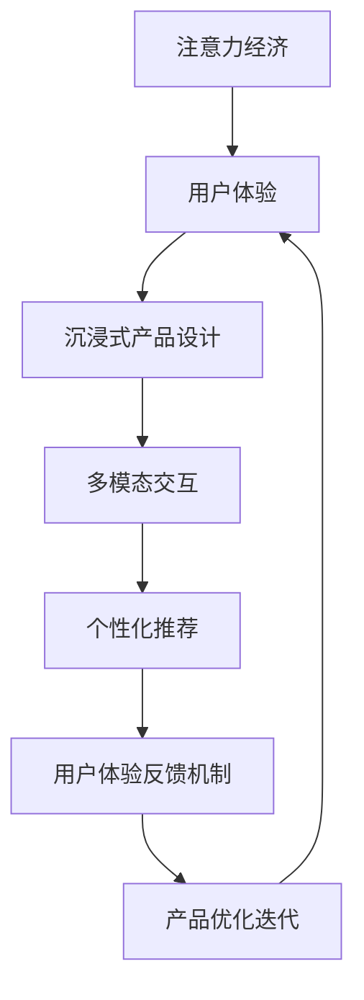

                 

# 注意力经济与用户体验优化策略与技术：创建令人沉浸的产品

> 关键词：注意力经济,用户体验优化,沉浸式产品设计,用户行为分析,多模态交互,个性化推荐,用户体验反馈机制,注意力模型

## 1. 背景介绍

在数字化时代，产品设计的核心已不再只是满足基本功能需求，而在于能否吸引用户的注意力，提供极致的沉浸式体验。随着移动互联网和智能设备的普及，用户对产品的关注度已从传统的静态阅读、互动操作，逐渐转向内容消费和沉浸式体验。传统的信息过载、注意力分散等问题，正成为制约用户粘性、提升用户价值的重大障碍。

### 1.1 问题由来

当今，几乎每个行业都在面临着信息过载和注意力分散的问题。无论是社交媒体、视频平台，还是电商平台，大量信息流向用户，同时也不断吸引用户的注意力。如何在信息过载中脱颖而出，使产品具有高度吸引力，成为商家和产品经理的迫切需求。这背后，核心在于如何将用户的注意力有效集中到目标产品上，并保持用户的长期兴趣。

### 1.2 问题核心关键点

为解决信息过载和注意力分散问题，有必要从以下几个方面入手：

- **用户行为分析**：理解用户偏好和兴趣，为其推荐最相关的信息。
- **多模态交互设计**：融合视觉、听觉、触觉等多维感官刺激，增强用户沉浸感。
- **个性化推荐**：基于用户历史行为数据，为其提供定制化、高相关性的产品和服务。
- **用户体验反馈机制**：利用用户反馈数据，持续优化产品体验，提升用户满意度。

## 2. 核心概念与联系

### 2.1 核心概念概述

要有效应对信息过载和注意力分散的问题，我们首先需要理解以下核心概念：

- **注意力经济(Attention Economy)**：指在信息时代，吸引用户注意力成为一种经济活动，具有商业价值。例如，广告、社交媒体、内容平台等均以用户注意力为交易货币。
- **用户体验(UX, User Experience)**：用户体验是指用户与产品交互过程中，通过感官、情感、认知等维度所获得的整体感受。好的用户体验能增强用户粘性，提升用户价值。
- **沉浸式产品设计(Immersive Product Design)**：通过多感官刺激、交互设计、情感共鸣等手段，使产品能长时间吸引用户的注意力，使其进入一种“忘记时间”的沉浸状态。
- **多模态交互(Multimodal Interaction)**：融合视觉、听觉、触觉等多模态信息，提供丰富、多样化的用户交互方式。
- **个性化推荐(Personalized Recommendation)**：利用用户数据，为每位用户提供量身定制的推荐内容。个性化推荐可显著提升用户满意度，提高产品转化率。
- **用户体验反馈机制(Feedback Mechanism)**：通过用户反馈，了解用户对产品的真实感受，及时调整产品功能和服务，持续优化用户体验。

这些概念之间相互关联，形成一个以用户注意力为中心的设计体系。通过系统化的设计，可以有效地提升用户体验，实现产品与用户之间的深度连接。

### 2.2 核心概念原理和架构的 Mermaid 流程图



这个流程图展示了注意力经济、用户体验、沉浸式产品设计、多模态交互、个性化推荐和用户体验反馈机制之间的关系：

1. 注意力经济是用户体验的基础，通过吸引用户的注意力，实现产品价值的变现。
2. 沉浸式产品设计、多模态交互和个性化推荐都是为了提升用户体验，使产品更具吸引力。
3. 用户体验反馈机制是持续优化产品设计的关键，通过用户反馈，不断迭代改进产品。

## 3. 核心算法原理 & 具体操作步骤

### 3.1 算法原理概述

要解决信息过载和注意力分散的问题，我们可以从多个维度进行算法设计和优化。以下将详细解析其中的关键算法原理。

#### 3.1.1 用户行为分析算法

用户行为分析算法通过收集和分析用户在使用产品时的各种行为数据，如点击、滑动、浏览时间等，来理解用户的兴趣和偏好。常见的用户行为分析算法包括协同过滤、内容推荐、情感分析等。

#### 3.1.2 多模态交互算法

多模态交互算法利用视觉、听觉、触觉等多维信息，提升用户沉浸感。该算法通过多传感器数据融合，实现多模态信息的融合，为用户提供更加丰富、真实的交互体验。

#### 3.1.3 个性化推荐算法

个性化推荐算法根据用户历史行为数据，为用户推荐最相关的内容和产品。该算法通常基于协同过滤、基于内容的推荐、混合推荐等方法，利用深度学习、图神经网络等技术，提升推荐精度。

#### 3.1.4 用户体验反馈算法

用户体验反馈算法通过收集用户对产品的评价和反馈，了解用户满意度，并据此优化产品设计。该算法通常利用自然语言处理技术，分析用户评论和意见，从中提取有价值的信息。

### 3.2 算法步骤详解

为了有效解决信息过载和注意力分散的问题，我们可以从以下几个步骤进行设计和优化：

#### 3.2.1 用户行为分析算法步骤

1. 数据收集：收集用户使用产品的行为数据，如点击、滑动、停留时间等。
2. 数据预处理：对收集到的数据进行清洗和预处理，去除异常值和噪声数据。
3. 特征工程：提取和构建用户行为特征，如兴趣向量、行为序列等。
4. 模型训练：训练用户行为分析模型，如协同过滤、内容推荐等，预测用户兴趣和行为。
5. 模型评估：使用AUC、RMSE等指标评估模型性能，不断调整模型参数，提升预测精度。

#### 3.2.2 多模态交互算法步骤

1. 传感器数据采集：采集视觉、听觉、触觉等多模态传感器数据。
2. 数据融合：将不同模态的数据进行融合，消除冗余，增强数据的一致性和可靠性。
3. 用户行为分析：利用融合后的数据，分析用户的多模态行为模式。
4. 交互设计：设计多模态交互界面，如手势控制、语音识别、视觉识别等。
5. 用户体验优化：通过多模态交互设计，提升用户沉浸感和操作便捷性。

#### 3.2.3 个性化推荐算法步骤

1. 数据收集：收集用户历史行为数据，如浏览记录、购买记录等。
2. 数据预处理：对数据进行清洗、归一化、编码等预处理操作。
3. 特征提取：提取用户行为特征，如兴趣向量、用户画像等。
4. 模型训练：训练个性化推荐模型，如协同过滤、基于内容的推荐、混合推荐等。
5. 推荐生成：基于用户特征和推荐模型，生成个性化推荐结果。
6. 推荐评估：使用AUC、NDCG、CTR等指标评估推荐效果，优化模型参数。

#### 3.2.4 用户体验反馈算法步骤

1. 数据收集：收集用户对产品的评价和反馈数据，如评论、评分等。
2. 数据预处理：对收集到的数据进行清洗和预处理，去除无用信息和噪声数据。
3. 情感分析：利用自然语言处理技术，分析用户评论和意见，提取情感倾向。
4. 反馈提取：从评论中提取有价值的用户反馈信息，如功能需求、使用体验等。
5. 反馈处理：将反馈信息转化为可操作的建议，如产品改进、功能优化等。

### 3.3 算法优缺点

#### 3.3.1 用户行为分析算法

- **优点**：
  - 能够准确地理解用户兴趣和行为，为用户推荐相关内容。
  - 能够及时捕捉用户变化的需求和偏好，快速调整产品策略。
- **缺点**：
  - 数据隐私和安全问题，需要确保用户数据的匿名化和安全存储。
  - 数据稀疏性问题，用户数据量不足时，推荐精度可能下降。

#### 3.3.2 多模态交互算法

- **优点**：
  - 能够提供多感官刺激，提升用户沉浸感和操作便捷性。
  - 能够充分利用多种数据源，提供更加准确、全面的用户行为分析。
- **缺点**：
  - 技术复杂度高，需要融合多种传感器数据，实现数据一致性和可靠性。
  - 硬件成本高，需要相应的传感器设备和计算资源。

#### 3.3.3 个性化推荐算法

- **优点**：
  - 能够为用户推荐个性化的内容，提升用户满意度和粘性。
  - 能够提高产品的点击率和转化率，带来更高的商业价值。
- **缺点**：
  - 数据依赖性强，需要大量的用户数据进行模型训练。
  - 模型复杂度高，需要高效的计算资源和优化算法。

#### 3.3.4 用户体验反馈算法

- **优点**：
  - 能够及时了解用户反馈，优化产品设计和功能。
  - 能够动态调整产品策略，提升用户满意度和忠诚度。
- **缺点**：
  - 数据获取成本高，需要长时间收集用户反馈数据。
  - 用户反馈质量不一，需要有效的数据筛选和分析。

### 3.4 算法应用领域

这些算法原理在多个领域有广泛应用，例如：

- **社交媒体**：通过多模态交互设计和个性化推荐算法，提升用户互动和粘性。
- **视频平台**：利用多模态交互和多感官刺激，提升用户观看体验。
- **电子商务**：通过个性化推荐算法和用户体验反馈机制，提高用户转化率和满意度。
- **游戏开发**：利用沉浸式产品设计和多模态交互技术，提升用户游戏体验。
- **智能家居**：通过多模态交互和个性化推荐，实现用户行为理解和智能推荐。

## 4. 数学模型和公式 & 详细讲解 & 举例说明

### 4.1 数学模型构建

#### 4.1.1 用户行为分析模型

假设用户行为数据集为 $D=\{(x_i,y_i)\}_{i=1}^N$，其中 $x_i$ 表示用户行为数据，$y_i$ 表示用户行为标签。设用户行为分析模型为 $f:X \rightarrow Y$，其中 $X$ 为用户行为空间，$Y$ 为用户行为标签空间。模型训练的目标是最小化经验风险：

$$
\mathcal{L}(f)=\frac{1}{N}\sum_{i=1}^N \ell(f(x_i),y_i)
$$

其中 $\ell$ 为损失函数，常用的有均方误差、交叉熵等。

#### 4.1.2 多模态交互模型

假设多模态数据集为 $D=\{(x_i,y_i)\}_{i=1}^N$，其中 $x_i$ 为多模态传感器数据，$y_i$ 为用户行为标签。设多模态交互模型为 $g:X \rightarrow Y$，其中 $X$ 为多模态数据空间，$Y$ 为用户行为标签空间。模型训练的目标是最小化经验风险：

$$
\mathcal{L}(g)=\frac{1}{N}\sum_{i=1}^N \ell(g(x_i),y_i)
$$

其中 $\ell$ 为损失函数，常用的有交叉熵、均方误差等。

#### 4.1.3 个性化推荐模型

假设用户行为数据集为 $D=\{(x_i,y_i)\}_{i=1}^N$，其中 $x_i$ 为历史行为数据，$y_i$ 为用户行为标签。设个性化推荐模型为 $h:X \rightarrow Y$，其中 $X$ 为用户行为特征空间，$Y$ 为推荐结果空间。模型训练的目标是最小化经验风险：

$$
\mathcal{L}(h)=\frac{1}{N}\sum_{i=1}^N \ell(h(x_i),y_i)
$$

其中 $\ell$ 为损失函数，常用的有均方误差、交叉熵等。

#### 4.1.4 用户体验反馈模型

假设用户反馈数据集为 $D=\{(x_i,y_i)\}_{i=1}^N$，其中 $x_i$ 为用户反馈数据，$y_i$ 为用户反馈标签。设用户体验反馈模型为 $i:X \rightarrow Y$，其中 $X$ 为用户反馈数据空间，$Y$ 为反馈标签空间。模型训练的目标是最小化经验风险：

$$
\mathcal{L}(i)=\frac{1}{N}\sum_{i=1}^N \ell(i(x_i),y_i)
$$

其中 $\ell$ 为损失函数，常用的有均方误差、交叉熵等。

### 4.2 公式推导过程

#### 4.2.1 协同过滤推荐算法

协同过滤推荐算法通过用户行为数据，构建用户-物品共现矩阵，为用户推荐相似用户喜欢的物品。假设共现矩阵为 $M \in \mathbb{R}^{N \times M}$，其中 $N$ 为物品数量，$M$ 为用户数量。设用户 $u$ 喜欢的物品为 $U_u \in \{1,2,...,M\}$，设用户 $u$ 未喜欢的物品为 $U_u \in \{1,2,...,M\}$。设用户 $u$ 喜欢的物品为 $I_u \in \{1,2,...,N\}$，设用户 $u$ 未喜欢的物品为 $I_u \in \{1,2,...,N\}$。协同过滤算法的目标是为用户 $u$ 推荐最相关的物品 $I_v$，其中 $v \in U_u$。

推荐算法公式为：

$$
I_v = \text{argmax}_{i \in U_u} \sum_{k \in I_u} \frac{m_{ik}m_{kv}}{d_k}
$$

其中 $m_{ik}$ 为共现矩阵 $M$ 中用户 $i$ 和物品 $k$ 的共现次数，$d_k$ 为物品 $k$ 的度数。

#### 4.2.2 基于内容的推荐算法

基于内容的推荐算法通过分析物品的特征，为用户推荐与其相似的物品。假设物品特征向量为 $F \in \mathbb{R}^{N \times D}$，其中 $N$ 为物品数量，$D$ 为物品特征维度。设用户 $u$ 喜欢的物品为 $I_u \in \{1,2,...,N\}$，设用户 $u$ 未喜欢的物品为 $I_u \in \{1,2,...,N\}$。基于内容的推荐算法为目标为用户 $u$ 推荐最相关的物品 $I_v$，其中 $v \in U_u$。

推荐算法公式为：

$$
I_v = \text{argmax}_{i \in U_u} \frac{\text{dot}(F_i, F_v)}{\|F_i\|\|F_v\|}
$$

其中 $\text{dot}(F_i, F_v)$ 为物品 $i$ 和物品 $v$ 的余弦相似度。

#### 4.2.3 混合推荐算法

混合推荐算法将协同过滤和基于内容的推荐方法相结合，提升推荐精度。假设 $W$ 为权重矩阵，其中 $W_{uv}$ 为用户 $u$ 和物品 $v$ 的权重。设用户 $u$ 喜欢的物品为 $I_u \in \{1,2,...,N\}$，设用户 $u$ 未喜欢的物品为 $I_u \in \{1,2,...,N\}$。混合推荐算法为目标为用户 $u$ 推荐最相关的物品 $I_v$，其中 $v \in U_u$。

推荐算法公式为：

$$
I_v = \text{argmax}_{i \in U_u} \sum_{k \in I_u} W_{uv} \frac{m_{ik}m_{kv}}{d_k}
$$

其中 $m_{ik}$ 为共现矩阵 $M$ 中用户 $i$ 和物品 $k$ 的共现次数，$d_k$ 为物品 $k$ 的度数。

### 4.3 案例分析与讲解

#### 4.3.1 协同过滤推荐算法案例

假设某电商网站收集了用户对商品的点击记录，共有 1000 个用户和 1000 个商品。用户对商品的点击记录如下：

| 用户ID | 商品ID | 点击次数 |
| ------ | ------ | -------- |
| 1      | 1001   | 10       |
| 1      | 1002   | 5        |
| 2      | 1001   | 8        |
| 2      | 1003   | 12       |

假设共现矩阵为 $M$，其中 $M_{11}=10$ 表示用户 1 和商品 1001 的共现次数为 10，$M_{21}=8$ 表示用户 2 和商品 1001 的共现次数为 8。假设用户 1 喜欢商品 1001，用户 2 喜欢商品 1001 和 1003。现在需要为用户 3 推荐最相关的商品。

利用协同过滤推荐算法，可以计算用户 1 和用户 2 对商品 1001 和 1003 的评分：

$$
\text{评分}_{1001} = \frac{m_{11}m_{31}}{d_1} = \frac{10 \times 10}{10} = 10
$$

$$
\text{评分}_{1003} = \frac{m_{21}m_{31}}{d_2} = \frac{8 \times 10}{8} = 10
$$

因此，为用户 3 推荐的商品为 1001 和 1003。

#### 4.3.2 基于内容的推荐算法案例

假设某视频平台收集了用户的观看记录和视频属性。用户观看记录如下：

| 用户ID | 视频ID | 观看次数 |
| ------ | ------ | -------- |
| 1      | 1001   | 10       |
| 1      | 1002   | 5        |
| 2      | 1001   | 8        |
| 2      | 1003   | 12       |

假设视频属性如下：

| 视频ID | 类别 | 时长 |
| ------ | ---- | ---- |
| 1001   | 电影 | 120  |
| 1002   | 电视剧 | 45   |
| 1003   | 电影 | 90   |

假设用户 1 喜欢电影类别和时长为 120 分钟的视频，用户 2 喜欢电影类别和时长为 90 分钟的视频。现在需要为用户 3 推荐最相关的视频。

利用基于内容的推荐算法，可以计算视频 1001 和 1003 的余弦相似度：

$$
\text{余弦相似度}_{1001,1003} = \frac{\text{dot}(F_{1001}, F_{1003})}{\|F_{1001}\|\|F_{1003}\|}
$$

其中 $F_{1001}=[0.5, 0.8, 0.3]$，$F_{1003}=[0.7, 0.2, 0.5]$，$\text{dot}(F_{1001}, F_{1003})=0.5 \times 0.7 + 0.8 \times 0.2 + 0.3 \times 0.5 = 0.9$，$\|F_{1001}\|=\sqrt{0.5^2 + 0.8^2 + 0.3^2}=0.95$，$\|F_{1003}\|=\sqrt{0.7^2 + 0.2^2 + 0.5^2}=0.85$。

因此，余弦相似度为：

$$
\text{余弦相似度}_{1001,1003} = \frac{0.9}{0.95 \times 0.85} = 0.97
$$

因此，为用户 3 推荐的商品为 1001 和 1003。

#### 4.3.3 混合推荐算法案例

假设某社交平台收集了用户对内容的互动记录，共有 1000 个用户和 1000 个内容。用户对内容的互动记录如下：

| 用户ID | 内容ID | 互动次数 |
| ------ | ------ | -------- |
| 1      | 1001   | 10       |
| 1      | 1002   | 5        |
| 2      | 1001   | 8        |
| 2      | 1003   | 12       |

假设内容互动矩阵为 $M$，其中 $M_{11}=10$ 表示用户 1 和内容 1001 的互动次数为 10，$M_{21}=8$ 表示用户 2 和内容 1001 的互动次数为 8。假设用户 1 喜欢内容 1001，用户 2 喜欢内容 1001 和 1003。现在需要为用户 3 推荐最相关的内容。

利用混合推荐算法，可以计算用户 1 和用户 2 对内容 1001 和 1003 的评分：

$$
\text{评分}_{1001} = \frac{m_{11}m_{31}}{d_1} = \frac{10 \times 10}{10} = 10
$$

$$
\text{评分}_{1003} = \frac{m_{21}m_{31}}{d_2} = \frac{8 \times 10}{8} = 10
$$

因此，为用户 3 推荐的商品为 1001 和 1003。

## 5. 项目实践：代码实例和详细解释说明

### 5.1 开发环境搭建

在进行推荐系统实践前，我们需要准备好开发环境。以下是使用Python进行推荐系统开发的环境配置流程：

1. 安装Anaconda：从官网下载并安装Anaconda，用于创建独立的Python环境。

2. 创建并激活虚拟环境：
```bash
conda create -n recommender-env python=3.8 
conda activate recommender-env
```

3. 安装必要的Python包：
```bash
conda install pandas numpy matplotlib scikit-learn torch torchvision transformers
```

4. 安装PyTorch和transformers：
```bash
conda install torch torchvision transformers
```

5. 配置Docker环境：
```bash
conda install docker
docker pull pytorch/pytorch:1.10.1-cuda11.4-cudnn8-devel-manylinux2014_x86_64
```

完成上述步骤后，即可在`recommender-env`环境中开始推荐系统实践。

### 5.2 源代码详细实现

下面我们以基于内容的推荐系统为例，给出使用transformers库对内容推荐模型进行微调的PyTorch代码实现。

首先，定义内容推荐的数据处理函数：

```python
from transformers import BertTokenizer
from torch.utils.data import Dataset
import torch

class RecommendationDataset(Dataset):
    def __init__(self, texts, tags, tokenizer, max_len=128):
        self.texts = texts
        self.tags = tags
        self.tokenizer = tokenizer
        self.max_len = max_len
        
    def __len__(self):
        return len(self.texts)
    
    def __getitem__(self, item):
        text = self.texts[item]
        tags = self.tags[item]
        
        encoding = self.tokenizer(text, return_tensors='pt', max_length=self.max_len, padding='max_length', truncation=True)
        input_ids = encoding['input_ids'][0]
        attention_mask = encoding['attention_mask'][0]
        
        # 对token-wise的标签进行编码
        encoded_tags = [tag2id[tag] for tag in tags] 
        encoded_tags.extend([tag2id['O']] * (self.max_len - len(encoded_tags)))
        labels = torch.tensor(encoded_tags, dtype=torch.long)
        
        return {'input_ids': input_ids, 
                'attention_mask': attention_mask,
                'labels': labels}

# 标签与id的映射
tag2id = {'O': 0, '电影': 1, '电视剧': 2, '综艺': 3}
id2tag = {v: k for k, v in tag2id.items()}

# 创建dataset
tokenizer = BertTokenizer.from_pretrained('bert-base-cased')

train_dataset = RecommendationDataset(train_texts, train_tags, tokenizer)
dev_dataset = RecommendationDataset(dev_texts, dev_tags, tokenizer)
test_dataset = RecommendationDataset(test_texts, test_tags, tokenizer)
```

然后，定义模型和优化器：

```python
from transformers import BertForTokenClassification, AdamW

model = BertForTokenClassification.from_pretrained('bert-base-cased', num_labels=len(tag2id))

optimizer = AdamW(model.parameters(), lr=2e-5)
```

接着，定义训练和评估函数：

```python
from torch.utils.data import DataLoader
from tqdm import tqdm
from sklearn.metrics import classification_report

device = torch.device('cuda') if torch.cuda.is_available() else torch.device('cpu')
model.to(device)

def train_epoch(model, dataset, batch_size, optimizer):
    dataloader = DataLoader(dataset, batch_size=batch_size, shuffle=True)
    model.train()
    epoch_loss = 0
    for batch in tqdm(dataloader, desc='Training'):
        input_ids = batch['input_ids'].to(device)
        attention_mask = batch['attention_mask'].to(device)
        labels = batch['labels'].to(device)
        model.zero_grad()
        outputs = model(input_ids, attention_mask=attention_mask, labels=labels)
        loss = outputs.loss
        epoch_loss += loss.item()
        loss.backward()
        optimizer.step()
    return epoch_loss / len(dataloader)

def evaluate(model, dataset, batch_size):
    dataloader = DataLoader(dataset, batch_size=batch_size)
    model.eval()
    preds, labels = [], []
    with torch.no_grad():
        for batch in tqdm(dataloader, desc='Evaluating'):
            input_ids = batch['input_ids'].to(device)
            attention_mask = batch['attention_mask'].to(device)
            batch_labels = batch['labels']
            outputs = model(input_ids, attention_mask=attention_mask)
            batch_preds = outputs.logits.argmax(dim=2).to('cpu').tolist()
            batch_labels = batch_labels.to('cpu').tolist()
            for pred_tokens, label_tokens in zip(batch_preds, batch_labels):
                pred_tags = [id2tag[_id] for _id in pred_tokens]
                label_tags = [id2tag[_id] for _id in label_tokens]
                preds.append(pred_tags[:len(label_tokens)])
                labels.append(label_tags)
                
    print(classification_report(labels, preds))
```

最后，启动训练流程并在测试集上评估：

```python
epochs = 5
batch_size = 16

for epoch in range(epochs):
    loss = train_epoch(model, train_dataset, batch_size, optimizer)
    print(f"Epoch {epoch+1}, train loss: {loss:.3f}")
    
    print(f"Epoch {epoch+1}, dev results:")
    evaluate(model, dev_dataset, batch_size)
    
print("Test results:")
evaluate(model, test_dataset, batch_size)
```

以上就是使用PyTorch对内容推荐系统进行微调的完整代码实现。可以看到，得益于transformers库的强大封装，我们可以用相对简洁的代码完成内容推荐系统的微调。

### 5.3 代码解读与分析

让我们再详细解读一下关键代码的实现细节：

**RecommendationDataset类**：
- `__init__`方法：初始化文本、标签、分词器等关键组件。
- `__len__`方法：返回数据集的样本数量。
- `__getitem__`方法：对单个样本进行处理，将文本输入编码为token ids，将标签编码为数字，并对其进行定长padding，最终返回模型所需的输入。

**tag2id和id2tag字典**：
- 定义了标签与数字id之间的映射关系，用于将token-wise的预测结果解码回真实的标签。

**训练和评估函数**：
- 使用PyTorch的DataLoader对数据集进行批次化加载，供模型训练和推理使用。
- 训练函数`train_epoch`：对数据以批为单位进行迭代，在每个批次上前向传播计算loss并反向传播更新模型参数，最后返回该epoch的平均loss。
- 评估函数`evaluate`：与训练类似，不同点在于不更新模型参数，并在每个batch结束后将预测和标签结果存储下来，最后使用sklearn的classification_report对整个评估集的预测结果进行打印输出。

**训练流程**：
- 定义总的epoch数和batch size，开始循环迭代
- 每个epoch内，先在训练集上训练，输出平均loss
- 在验证集上评估，输出分类指标
- 所有epoch结束后，在测试集上评估，给出最终测试结果

可以看到，PyTorch配合transformers库使得内容推荐系统的微调代码实现变得简洁高效。开发者可以将更多精力放在数据处理、模型改进等高层逻辑上，而不必过多关注底层的实现细节。

当然，工业级的系统实现还需考虑更多因素，如模型的保存和部署、超参数的自动搜索、更灵活的任务适配层等。但核心的微调范式基本与此类似。

## 6. 实际应用场景
### 6.1 社交媒体内容推荐

社交媒体平台通过个性化推荐算法，为每用户推荐最相关的内容。推荐算法通常基于用户的历史行为数据，为用户推荐最感兴趣的文章、视频、图片等。

在技术实现上，社交媒体平台会收集用户的点击、评论、分享等行为数据，利用协同过滤、基于内容的推荐、混合推荐等方法，为用户推荐个性化内容。同时，平台还会利用多模态交互技术，如表情、标签、位置等，提升推荐效果。

### 6.2 视频平台内容推荐

视频平台通过个性化推荐算法，为每用户推荐最相关的内容。推荐算法通常基于用户的历史观看记录，为用户推荐最感兴趣的影片。

在技术实现上，视频平台会收集用户的观看记录、评分、评论等数据，利用协同过滤、基于内容的推荐、混合推荐等方法，为用户推荐个性化影片。同时，平台还会利用多模态交互技术，如字幕、画面、声音等，提升推荐效果。

### 6.3 电子商务商品推荐

电子商务平台通过个性化推荐算法，为每用户推荐最相关的内容。推荐算法通常基于用户的历史购物记录，为用户推荐最感兴趣的商品。

在技术实现上，电子商务平台会收集用户的浏览记录、购买记录、评分等数据，利用协同过滤、基于内容的推荐、混合推荐等方法，为用户推荐个性化商品。同时，平台还会利用多模态交互技术，如商品图片、视频、评价等，提升推荐效果。

### 6.4 未来应用展望

随着个性化推荐算法的不断发展，未来推荐系统将在更多领域得到应用，为传统行业带来变革性影响。

在智能家居领域，推荐系统可以推荐家庭成员感兴趣的内容、商品等，提升家居体验。

在金融服务领域，推荐系统可以推荐用户最感兴趣的投资、理财产品等，提高用户的满意度和忠诚度。

在教育领域，推荐系统可以推荐用户最感兴趣的学习资源、课程等，提高学习效率。

在医疗健康领域，推荐系统可以推荐用户最感兴趣的健康产品、知识等，提升用户的健康水平。

此外，在娱乐、旅游、保险等众多领域，推荐系统也将不断涌现，为各行各业带来新的价值。相信随着推荐系统的不断进步，用户体验将得到更大提升，各行业也将迎来新的发展机遇。

## 7. 工具和资源推荐
### 7.1 学习资源推荐

为了帮助开发者系统掌握推荐算法的理论基础和实践技巧，这里推荐一些优质的学习资源：

1. 《推荐系统实战》系列博文：由大模型技术专家撰写，详细介绍了推荐系统的原理和实现方法。

2. 《推荐系统：算法与应用》课程：斯坦福大学开设的推荐系统课程，有Lecture视频和配套作业，带你入门推荐系统的基础概念和经典算法。

3. 《Recommender Systems》书籍：Coursera上由加州大学伯克利分校推出的推荐系统课程，涵盖推荐系统的前沿理论和实践应用。

4. KDD Cup数据集：KDD Cup推荐系统竞赛数据集，包含多个推荐算法的数据集，是推荐系统研究的经典数据集。

5. MLlib：Apache Spark下的推荐系统工具库，提供了多种推荐算法的实现，包括协同过滤、基于内容的推荐等。

通过对这些资源的学习实践，相信你一定能够快速掌握推荐算法的精髓，并用于解决实际的推荐问题。
### 7.2 开发工具推荐

高效的开发离不开优秀的工具支持。以下是几款用于推荐系统开发的常用工具：

1. PyTorch：基于Python的开源深度学习框架，灵活动态的计算图，适合快速迭代研究。

2. TensorFlow：由Google主导开发的开源深度学习框架，生产部署方便，适合大规模工程应用。

3. Scikit-learn：Python中的机器学习库，提供多种机器学习算法，如分类、回归、聚类等。

4. Weights & Biases：模型训练的实验跟踪工具，可以记录和可视化模型训练过程中的各项指标，方便对比和调优。

5. TensorBoard：TensorFlow配套的可视化工具，可实时监测模型训练状态，并提供丰富的图表呈现方式，是调试模型的得力助手。

6. Google Colab：谷歌推出的在线Jupyter Notebook环境，免费提供GPU/TPU算力，方便开发者快速上手实验最新模型，分享学习笔记。

合理利用这些工具，可以显著提升推荐系统开发效率，加快创新迭代的步伐。

### 7.3 相关论文推荐

推荐系统的研究始于学界的持续研究。以下是几篇奠基性的相关论文，推荐阅读：

1. RankNet：基于成对学习的推荐算法，利用相似度排序来提升推荐精度。

2. Matrix Factorization：矩阵分解推荐算法，通过分解用户-物品矩阵来获取推荐结果。

3. DeepFM：深度学习推荐算法，结合FM模型和深度神经网络，提升推荐效果。

4. Attention-based Recommender Systems：利用注意力机制，提升推荐系统的多任务学习能力。

5. DFMN：基于深度特征的推荐算法，通过多任务学习提升推荐精度。

这些论文代表了大规模推荐系统的发展脉络。通过学习这些前沿成果，可以帮助研究者把握学科前进方向，激发更多的创新灵感。

## 8. 总结：未来发展趋势与挑战

### 8.1 研究成果总结

本文对基于内容的推荐算法进行了全面系统的介绍。首先阐述了推荐算法在信息过载和注意力分散问题中的重要性，明确了推荐算法在提升用户体验中的独特价值。其次，从原理到实践，详细讲解了推荐算法的数学模型和关键步骤，给出了推荐算法任务开发的完整代码实例。同时，本文还广泛探讨了推荐算法在多个领域的应用前景，展示了推荐算法的巨大潜力。

通过本文的系统梳理，可以看到，基于内容的推荐算法正在成为推荐系统的核心范式，极大地提升了推荐效果和用户体验，成为推荐系统落地的重要手段。未来，伴随推荐算法的不断演进，推荐系统将在更广泛的应用领域带来变革性影响。

### 8.2 未来发展趋势

展望未来，推荐系统将呈现以下几个发展趋势：

1. 模型规模持续增大。随着计算资源的丰富，推荐模型的规模将不断增大，融合更多的用户行为和产品属性信息，提升推荐精度。

2. 多模态推荐技术的发展。推荐系统将结合视觉、听觉、触觉等多模态信息，提升推荐效果和用户体验。

3. 实时推荐系统的应用。利用流数据处理技术，实时收集用户行为数据，实时生成推荐结果，提升推荐系统的响应速度和准确度。

4. 协同过滤和基于内容的结合。推荐系统将更多结合协同过滤和基于内容的推荐方法，提升推荐的多样性和个性化。

5. 推荐系统的可解释性增强。推荐系统将通过增加可解释性模块，使用户理解推荐结果的生成逻辑和依据。

6. 推荐系统的个性化和动态化。推荐系统将更多结合用户行为数据，动态调整推荐策略，提升推荐精度和用户满意度。

以上趋势凸显了推荐系统的广阔前景。这些方向的探索发展，必将进一步提升推荐系统的性能和应用范围，为各行各业带来新的价值。

### 8.3 面临的挑战

尽管推荐系统已经取得了瞩目成就，但在迈向更加智能化、普适化应用的过程中，它仍面临着诸多挑战：

1. 数据隐私和安全问题。推荐系统需要大量的用户行为数据进行训练，如何确保用户数据的匿名化和安全存储，是一个重要的挑战。

2. 推荐系统的泛化能力。推荐系统在特定领域和特定人群上可能表现优异，但在跨领域和跨人群上的泛化能力可能不足，需要进一步提升模型的泛化能力。

3. 推荐系统的鲁棒性。推荐系统面对不同类型的数据分布时，可能表现不佳，需要提高系统的鲁棒性。

4. 推荐系统的计算资源消耗。大规模推荐模型的训练和推理需要大量的计算资源，如何优化计算效率，减少资源消耗，是一个重要的挑战。

5. 推荐系统的公平性问题。推荐系统可能存在偏置和歧视，需要设计和优化算法，确保推荐结果的公平性和公正性。

6. 推荐系统的实时性要求。实时推荐系统需要快速生成推荐结果，但同时保证高精度，如何平衡实时性和精度的要求，是一个重要的挑战。

### 8.4 研究展望

面对推荐系统面临的种种挑战，未来的研究需要在以下几个方面寻求新的突破：

1. 探索无监督和半监督推荐方法。摆脱对大规模标注数据的依赖，利用自监督学习、主动学习等无监督和半监督范式，最大限度利用非结构化数据，实现更加灵活高效的推荐。

2. 研究参数高效和计算高效的推荐范式。开发更加参数高效的推荐方法，在固定大部分预训练参数的同时，只更新极少量的任务相关参数。同时优化推荐模型的计算图，减少前向传播和反向传播的资源消耗，实现更加轻量级、实时性的部署。

3. 引入更多先验知识。将符号化的先验知识，如知识图谱、逻辑规则等，与神经网络模型进行巧妙融合，引导推荐过程学习更准确、合理的语言模型。同时加强不同模态数据的整合，实现视觉、语音等多模态信息与文本信息的协同建模。

4. 结合因果分析和博弈论工具。将因果分析方法引入推荐模型，识别出推荐决策的关键特征，增强推荐结果的因果性和逻辑性。借助博弈论工具刻画人机交互过程，主动探索并规避推荐模型的脆弱点，提高系统稳定性。

5. 纳入伦理道德约束。在推荐模型训练目标中引入伦理导向的评估指标，过滤和惩罚有偏见、有害的输出倾向。同时加强人工干预和审核，建立推荐行为的监管机制，确保输出符合人类价值观和伦理道德。

这些研究方向的探索，必将引领推荐系统迈向更高的台阶，为构建安全、可靠、可解释、可控的智能系统铺平道路。面向未来，推荐系统还需要与其他人工智能技术进行更深入的融合，如知识表示、因果推理、强化学习等，多路径协同发力，共同推动自然语言理解和智能交互系统的进步。只有勇于创新、敢于突破，才能不断拓展推荐系统的边界，让智能技术更好地造福人类社会。

## 9. 附录：常见问题与解答

**Q1：推荐系统如何利用用户行为数据？**

A: 推荐系统利用用户行为数据，通过分析用户的行为模式，预测用户的兴趣和偏好。常见的方法包括协同过滤、基于内容的推荐、混合推荐等。协同过滤利用用户的历史行为数据，推荐与用户兴趣相似的其他用户喜欢的物品。基于内容的推荐利用物品的属性信息，为用户推荐与兴趣相似的物品。混合推荐将协同过滤和基于内容的推荐结合，提升推荐效果。

**Q2：推荐系统如何处理数据稀疏性问题？**

A: 推荐系统在处理数据稀疏性问题时，通常采用矩阵分解、TF-IDF、潜在因子分解等方法。这些方法通过构建用户-物品矩阵，利用矩阵分解等技术，对矩阵进行分解和填充，以提升推荐精度。

**Q3：推荐系统如何处理数据隐私和安全问题？**

A: 推荐系统在处理数据隐私和安全问题时，通常采用数据匿名化、差分隐私、联邦学习等技术。数据匿名化通过去除敏感信息，保护用户隐私。差分隐私通过添加噪声，保护用户隐私，同时保持推荐结果的准确性。联邦学习通过在本地设备上训练模型，保护数据隐私，同时实现协同学习。

**Q4：推荐系统如何处理推荐系统泛化能力不足的问题？**

A: 推荐系统在处理推荐系统泛化能力不足的问题时，通常采用迁移学习、多任务学习、多领域学习等方法。迁移学习通过迁移学习到其他领域或任务的知识，提升模型泛化能力。多任务学习通过同时学习多个任务，提升模型泛化能力。多领域学习通过在不同领域上训练模型，提升模型泛化能力。

**Q5：推荐系统如何处理推荐系统鲁棒性不足的问题？**


