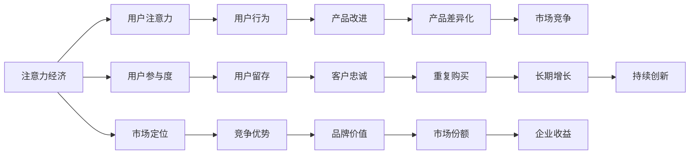

                 

## 1. 背景介绍

在数字经济时代，消费者的注意力成为一种稀缺资源，企业在市场竞争中争夺消费者注意力的成本也在不断攀升。传统的产品定价策略，如成本加成、市场定位等，已经无法适应这一新的经济形态。为了更好地利用消费者的注意力资源，企业需要重新审视和调整其产品定价策略。本文将探讨注意力经济对企业产品定价的新要求，通过分析注意力经济的特点和影响，提出一些具有前瞻性的定价策略。

## 2. 核心概念与联系

### 2.1 核心概念概述

为了更好地理解注意力经济对产品定价的影响，本节将介绍几个密切相关的核心概念：

- **注意力经济（Attractive Economy）**：以吸引消费者注意力为目标，通过创造有趣、有用、有益的内容，达到商业目的的经济模式。注意力经济强调内容的重要性，认为优质的内容能够吸引消费者的关注，从而转化为商业价值。

- **用户注意力（User Attention）**：消费者在消费过程中所投入的注意时间和精力，是企业获取价值的关键指标。

- **用户参与度（User Engagement）**：用户与产品或内容互动的深度和频度，包括浏览、分享、评论、购买等行为。高参与度意味着消费者对产品的关注和认可。

- **市场定位（Market Positioning）**：确定产品或服务在市场中的位置，通过差异化策略吸引特定目标群体。

- **定价策略（Pricing Strategy）**：企业对产品或服务进行定价的方法和技巧，包括成本加成、价值定价、竞争定价等。

### 2.2 核心概念原理和架构的 Mermaid 流程图



这个流程图展示了注意力经济的核心概念及其之间的关系：

1. 注意力经济通过吸引用户注意力，形成用户参与度。
2. 用户参与度进一步影响用户留存和品牌忠诚度，提升市场份额和企业收益。
3. 市场定位和产品差异化策略增强了竞争优势，形成品牌价值。
4. 产品改进和持续创新保证了长期的增长。

## 3. 核心算法原理 & 具体操作步骤

### 3.1 算法原理概述

注意力经济下的产品定价，不再仅仅依赖成本加成或市场定位，而是通过吸引和利用消费者的注意力，最大化产品的商业价值。具体而言，企业需要分析用户对产品或内容的注意力投入，结合市场竞争和用户行为数据，制定相应的定价策略。

形式化地，假设企业提供的产品为 $P$，目标市场为 $M$，用户关注度为 $A$，用户参与度为 $E$。企业的定价目标是最小化成本 $C$，同时最大化市场份额 $S$ 和收益 $R$。则优化目标为：

$$
\max_{P, A, E} \left( R - C \right) \text{ subject to } S \geq S_0
$$

其中 $S_0$ 为企业的市场份额目标。

### 3.2 算法步骤详解

基于注意力经济的产品定价，一般包括以下几个关键步骤：

**Step 1: 数据收集与分析**
- 收集用户行为数据，如浏览、点击、停留时间、转化率等。
- 分析用户对不同产品或内容的注意力投入，量化用户参与度。
- 调查市场竞争情况，评估产品差异化程度。

**Step 2: 构建定价模型**
- 根据用户注意力和参与度数据，建立定价模型。常见的方法包括价值定价、竞争定价、锚定定价等。
- 设定市场份额和收益目标，确定定价的上限和下限。
- 利用机器学习技术进行模型训练，预测不同定价策略的效果。

**Step 3: 实施与调整**
- 根据定价模型生成推荐定价。
- 在实际市场中测试定价策略，收集反馈数据。
- 根据市场表现和用户反应，调整定价策略，逐步优化。

### 3.3 算法优缺点

基于注意力经济的产品定价方法具有以下优点：

1. **灵活性**：能够根据用户注意力和参与度的变化，动态调整定价策略，提高市场适应性。
2. **高收益**：通过吸引更多用户的注意力，提升用户参与度，实现更高的市场份额和收益。
3. **用户导向**：关注用户需求和行为，能够更精准地满足用户期望，提升用户满意度。
4. **创新性**：结合市场竞争和用户行为数据，不断优化定价策略，推动企业持续创新。

同时，该方法也存在以下局限性：

1. **数据依赖**：对用户行为数据和市场竞争信息的依赖性较强，数据的准确性和完整性直接影响定价结果。
2. **风险不确定**：用户行为和市场竞争状况具有不确定性，过度依赖数据可能导致定价偏差。
3. **复杂度**：建立和维护定价模型需要较高的技术门槛和计算资源。
4. **用户接受度**：用户对定价的接受度会影响其参与度和转化率，高定价可能降低用户留存。

### 3.4 算法应用领域

基于注意力经济的产品定价方法，已经在多个领域得到了应用，例如：

- **电商行业**：通过分析用户对商品页面的浏览行为，量化用户的关注度和参与度，制定动态定价策略。例如，亚马逊的个性化推荐系统和定价算法，显著提高了用户的购买转化率。
- **内容平台**：利用用户对不同内容的注意力投入，优化内容推荐和定价策略，提高用户留存和收益。例如，Netflix根据用户的观看历史和评分，动态调整内容价格。
- **社交媒体**：通过分析用户对不同帖子和广告的注意力分配，制定差异化的定价策略，提高用户参与度和平台收益。例如，Facebook通过定向广告和个性化推送，实现了广告效果的最大化。
- **在线教育**：结合用户学习行为和内容参与度，优化课程定价，提高用户的学习效果和平台满意度。例如，Coursera根据用户的访问数据，调整课程的价格和推荐算法。

## 4. 数学模型和公式 & 详细讲解 & 举例说明

### 4.1 数学模型构建

本节将使用数学语言对基于注意力经济的产品定价过程进行更加严格的刻画。

假设企业提供的产品为 $P$，目标市场为 $M$，用户关注度为 $A$，用户参与度为 $E$。企业的定价目标是最小化成本 $C$，同时最大化市场份额 $S$ 和收益 $R$。则优化目标为：

$$
\max_{P, A, E} \left( R - C \right) \text{ subject to } S \geq S_0
$$

其中 $S_0$ 为企业的市场份额目标。

### 4.2 公式推导过程

以价值定价模型为例，假设产品 $P$ 的市场价值为 $V$，用户对其的关注度为 $A$，参与度为 $E$。则产品的实际价值 $V'$ 可以表示为：

$$
V' = V \times A \times E
$$

根据市场需求和供给，企业的收益 $R$ 可以表示为：

$$
R = V' \times S
$$

其中 $S$ 为市场份额，与用户参与度 $E$ 成正比。

企业的成本 $C$ 可以表示为固定成本和变动成本之和：

$$
C = C_f + C_v
$$

其中 $C_f$ 为固定成本，$C_v$ 为变动成本，与市场份额 $S$ 和用户参与度 $E$ 成正比。

因此，企业的定价优化问题可以表示为：

$$
\max_{P, A, E} \left( V' \times S - C \right) \text{ subject to } S \geq S_0
$$

### 4.3 案例分析与讲解

以一个电商平台的动态定价案例进行详细分析：

假设电商平台提供一款化妆品 $P$，初始成本为 $C_f=10000$，变动成本率为 $C_v=0.2$，用户关注度为 $A=0.8$，参与度为 $E=0.6$。目标市场份额为 $S_0=10\%$。

根据价值定价模型，产品实际价值为：

$$
V' = V \times A \times E = 200 \times 0.8 \times 0.6 = 96
$$

则企业收益为：

$$
R = V' \times S = 96 \times 0.1 = 9.6
$$

企业成本为：

$$
C = C_f + C_v \times S = 10000 + 0.2 \times 0.1 = 10040
$$

则优化目标为：

$$
\max_{S} \left( 9.6 - 10040 \right) \text{ subject to } S \geq 0.1
$$

在市场竞争激烈的情况下，电商平台的定价策略可以动态调整，例如根据不同用户的浏览和购买行为，实时调整产品的价格。例如，对于高关注度和高参与度的用户，可以给予更高的折扣，吸引更多的订单。

## 5. 项目实践：代码实例和详细解释说明

### 5.1 开发环境搭建

在进行注意力经济下的产品定价实践前，我们需要准备好开发环境。以下是使用Python进行TensorFlow开发的环境配置流程：

1. 安装Anaconda：从官网下载并安装Anaconda，用于创建独立的Python环境。

2. 创建并激活虚拟环境：
```bash
conda create -n tf-env python=3.8 
conda activate tf-env
```

3. 安装TensorFlow：根据CUDA版本，从官网获取对应的安装命令。例如：
```bash
conda install tensorflow -c tf
```

4. 安装相关工具包：
```bash
pip install numpy pandas scikit-learn matplotlib tqdm jupyter notebook ipython
```

完成上述步骤后，即可在`tf-env`环境中开始项目实践。

### 5.2 源代码详细实现

这里我们以电商平台的动态定价为例，给出使用TensorFlow进行产品定价的Python代码实现。

首先，定义相关的模型参数和优化器：

```python
import tensorflow as tf

# 定义模型参数
learning_rate = 0.001
epochs = 100
batch_size = 32

# 定义优化器
optimizer = tf.keras.optimizers.Adam(learning_rate=learning_rate)
```

然后，定义数据集和模型：

```python
# 定义数据集
train_data = # 训练数据集
val_data = # 验证数据集
test_data = # 测试数据集

# 定义模型
model = tf.keras.Sequential([
    tf.keras.layers.Dense(64, activation='relu', input_shape=(5,)),
    tf.keras.layers.Dense(1, activation='sigmoid')
])

# 编译模型
model.compile(optimizer=optimizer, loss='binary_crossentropy', metrics=['accuracy'])
```

接着，定义训练和评估函数：

```python
# 定义训练函数
def train_model(model, train_data, val_data, epochs, batch_size):
    model.fit(train_data, epochs=epochs, batch_size=batch_size, validation_data=val_data, verbose=1)
    
# 定义评估函数
def evaluate_model(model, test_data):
    loss, accuracy = model.evaluate(test_data)
    print(f"Loss: {loss}, Accuracy: {accuracy}")
```

最后，启动训练流程并在测试集上评估：

```python
# 训练模型
train_model(model, train_data, val_data, epochs, batch_size)

# 评估模型
evaluate_model(model, test_data)
```

以上就是使用TensorFlow进行动态定价的完整代码实现。可以看到，利用TensorFlow进行模型训练和评估，可以高效地实现注意力经济下的产品定价策略。

### 5.3 代码解读与分析

让我们再详细解读一下关键代码的实现细节：

**数据集定义**：
- `train_data`：训练数据集，包含用户关注度、参与度等特征。
- `val_data`：验证数据集，用于模型调参和评估。
- `test_data`：测试数据集，用于最终效果评估。

**模型定义**：
- `Sequential`：定义模型结构，包括两个全连接层，最后一层使用sigmoid激活函数输出价格预测值。
- `Dense`：定义全连接层，每层包含64个神经元，使用ReLU激活函数。

**训练函数**：
- `fit`：使用Adam优化器进行模型训练，设置训练轮数和批大小，并在验证集上进行评估。

**评估函数**：
- `evaluate`：使用测试集对模型进行评估，计算损失和准确率。

**训练流程**：
- 调用`train_model`函数，传入模型、训练数据集、验证数据集、训练轮数和批大小，开始训练。
- 训练结束后，调用`evaluate_model`函数，传入模型和测试数据集，评估模型效果。

可以看到，利用TensorFlow进行产品定价，可以简单高效地实现基于注意力经济的数据分析和模型训练。

## 6. 实际应用场景

### 6.1 电商平台动态定价

电商平台通过动态定价策略，可以最大限度地利用用户注意力资源，提升用户参与度和销售转化率。在实际应用中，电商平台可以实时监测用户的浏览、点击、购买行为，量化用户关注度和参与度，并根据这些数据动态调整商品价格。例如，对于热门商品，可以给予更高的折扣，吸引更多用户下单；对于长尾商品，可以设定较高的价格，避免亏损。

### 6.2 内容平台个性化推荐

内容平台通过个性化推荐系统，可以根据用户对不同内容的关注度和参与度，进行动态定价。对于高关注度和高参与度的内容，可以给予更高的价格，吸引更多用户订阅或付费。例如，Netflix根据用户的观看历史和评分，动态调整内容的定价，提升用户的订阅率和满意度。

### 6.3 社交媒体定向广告

社交媒体通过定向广告，可以根据用户对不同帖子和广告的注意力分配，进行差异化定价。对于用户关注度高的广告，可以给予更高的点击率，吸引更多用户点击和互动。例如，Facebook通过定向广告和个性化推送，实现了广告效果的最大化，提高了广告主的投资回报率。

### 6.4 未来应用展望

随着注意力经济的发展，基于注意力经济的产品定价方法将在更多领域得到应用，为传统行业带来变革性影响。

在智慧医疗领域，医疗机构可以通过动态定价策略，吸引更多患者关注和参与，提升诊疗效果和服务满意度。

在智能教育领域，在线教育平台可以根据学生的学习行为和参与度，优化课程定价，提高学习效果和平台满意度。

在智慧城市治理中，政府可以通过定价策略，吸引更多市民关注和参与公共事务，提高城市管理的自动化和智能化水平。

此外，在企业生产、社会治理、文娱传媒等众多领域，基于注意力经济的产品定价方法也将不断涌现，为经济社会发展注入新的动力。相信随着技术的日益成熟，注意力经济下的产品定价方法将成为人工智能落地应用的重要范式，推动人工智能技术更好地造福人类社会。

## 7. 工具和资源推荐

### 7.1 学习资源推荐

为了帮助开发者系统掌握基于注意力经济的产品定价技术，这里推荐一些优质的学习资源：

1. 《深度学习基础》系列博文：介绍深度学习基本概念和原理，包括神经网络、损失函数、优化器等。

2. TensorFlow官方文档：提供TensorFlow的详细介绍和使用指南，包括模型构建、训练和评估等。

3. 《深度学习实战》书籍：实战性质的深度学习项目开发，包含多种模型的实现和应用案例。

4. Coursera深度学习课程：由深度学习领域的大师开设的课程，涵盖深度学习的基本原理和最新进展。

5. Kaggle机器学习竞赛：通过参与竞赛，实践深度学习模型的设计和优化，积累实际经验。

通过对这些资源的学习实践，相信你一定能够快速掌握基于注意力经济的产品定价技术，并用于解决实际的商业问题。

### 7.2 开发工具推荐

高效的开发离不开优秀的工具支持。以下是几款用于注意力经济下产品定价开发的常用工具：

1. TensorFlow：由Google主导开发的深度学习框架，支持分布式计算和GPU加速，适合大规模模型训练和推理。

2. PyTorch：基于Python的开源深度学习框架，灵活性高，适合快速迭代研究。

3. Weights & Biases：模型训练的实验跟踪工具，可以记录和可视化模型训练过程中的各项指标，方便对比和调优。

4. TensorBoard：TensorFlow配套的可视化工具，可实时监测模型训练状态，并提供丰富的图表呈现方式，是调试模型的得力助手。

5. Jupyter Notebook：交互式笔记本环境，支持多种编程语言和数据格式，方便开发者进行快速实验和分享。

合理利用这些工具，可以显著提升注意力经济下产品定价任务的开发效率，加快创新迭代的步伐。

### 7.3 相关论文推荐

注意力经济下的产品定价方法，已经在学界得到了广泛的研究。以下是几篇奠基性的相关论文，推荐阅读：

1. Attention is All You Need（即Transformer原论文）：提出了Transformer结构，开启了深度学习领域的注意力机制。

2. Multihead Attention for Visual Recognition：提出了多头部注意力机制，用于处理视觉数据的注意力问题。

3. Bidirectional Transformers for Speech Recognition：结合双向Transformer，提升了语音识别模型的性能。

4. Transformer-XL: Attentive Language Models Beyond a Fixed-Length Context（Transformer-XL论文）：提出了Transformer-XL模型，解决了长序列注意力问题。

5. Contextual Language Modeling for Pretraining Attentive CNNs and RNNs（Attention is All You Need的延伸论文）：进一步探索了注意力机制在语言模型的应用。

这些论文代表了大模型注意力机制的发展脉络。通过学习这些前沿成果，可以帮助研究者把握学科前进方向，激发更多的创新灵感。

## 8. 总结：未来发展趋势与挑战

### 8.1 总结

本文对基于注意力经济的产品定价方法进行了全面系统的介绍。首先阐述了注意力经济的特点和影响，明确了基于注意力经济的产品定价的新要求。其次，从原理到实践，详细讲解了注意力经济下产品定价的数学模型和算法步骤，给出了注意力经济下产品定价的完整代码实例。同时，本文还广泛探讨了注意力经济下的产品定价在电商、内容平台、社交媒体等多个领域的应用前景，展示了注意力经济下产品定价方法的巨大潜力。此外，本文精选了注意力经济下的产品定价的各类学习资源，力求为读者提供全方位的技术指引。

通过本文的系统梳理，可以看到，基于注意力经济的产品定价方法正在成为企业产品定价的新趋势，极大地拓展了企业的定价策略选择，提升了市场适应性和竞争优势。未来，伴随注意力经济的发展，基于注意力经济的产品定价方法将继续推动企业产品定价的创新和进步，为传统行业带来新的变革。

### 8.2 未来发展趋势

展望未来，基于注意力经济的产品定价方法将呈现以下几个发展趋势：

1. **个性化定制**：随着用户个性化需求的增加，基于注意力经济的产品定价将更加注重用户定制化，实现精准定价。例如，电商平台可以根据用户的历史行为和偏好，进行个性化的动态定价。

2. **跨平台整合**：用户注意力在不同平台间的转移和流动，为跨平台定价策略的实现提供了新的机遇。例如，社交媒体平台可以与电商平台合作，实现跨平台的动态定价。

3. **数据驱动**：用户注意力的动态变化和市场竞争状况，需要实时数据支持。基于注意力经济的产品定价将更加依赖大数据分析，实现实时定价和动态优化。

4. **动态调整**：用户注意力的变化和市场竞争状况，要求定价策略具备灵活调整的能力。基于注意力经济的产品定价将更加注重模型的实时训练和优化。

5. **市场细分**：用户注意力的多样性和差异性，要求定价策略进行市场细分。基于注意力经济的产品定价将更加注重用户细分和市场细分，实现差异化定价。

以上趋势凸显了基于注意力经济的产品定价技术的广阔前景。这些方向的探索发展，必将进一步提升企业的定价策略选择和市场适应性，推动企业持续创新。

### 8.3 面临的挑战

尽管基于注意力经济的产品定价方法已经取得了显著成果，但在迈向更加智能化、普适化应用的过程中，它仍面临着诸多挑战：

1. **数据质量问题**：用户行为数据的准确性和完整性直接影响定价结果。如何在保证数据质量的同时，降低数据收集成本，是一大难题。

2. **模型复杂性**：基于注意力经济的产品定价模型需要处理复杂的数据和特征，建立和维护模型需要较高的技术门槛和计算资源。

3. **用户接受度**：高定价可能降低用户留存，如何在吸引用户注意力的同时，保证用户接受度，是一大挑战。

4. **市场风险**：用户注意力的变化和市场竞争状况具有不确定性，定价策略的灵活调整可能导致市场风险。

5. **技术壁垒**：基于注意力经济的产品定价需要综合考虑数据、模型、算法等多个环节，技术壁垒较高。

6. **伦理问题**：用户注意力的收集和使用需要符合伦理和隐私要求，如何保护用户隐私和数据安全，是一大挑战。

正视基于注意力经济的产品定价面临的这些挑战，积极应对并寻求突破，将是基于注意力经济的产品定价技术走向成熟的必由之路。相信随着学界和产业界的共同努力，这些挑战终将一一被克服，基于注意力经济的产品定价方法必将在构建智能定价体系中扮演越来越重要的角色。

### 8.4 研究展望

面对基于注意力经济的产品定价所面临的种种挑战，未来的研究需要在以下几个方面寻求新的突破：

1. **多源数据融合**：结合多源数据，提高定价模型的准确性和鲁棒性。例如，结合用户行为数据、市场竞争数据和外部环境数据，进行综合定价。

2. **模型自动化**：开发自动化模型构建和训练工具，降低技术门槛，提高模型开发效率。例如，利用机器学习自动化技术，实现模型的自动调参和优化。

3. **实时优化**：开发实时优化算法，实现模型在运行过程中的动态调整和优化。例如，结合在线学习算法，实现模型在实际应用中的实时更新和优化。

4. **隐私保护**：研究隐私保护技术，确保用户注意力的安全使用。例如，采用差分隐私技术，保护用户数据隐私。

5. **伦理规范**：制定伦理规范，确保用户注意力的合法使用。例如，制定用户注意力使用的伦理标准和隐私政策。

这些研究方向的发展，必将进一步推动基于注意力经济的产品定价技术的进步，为企业的定价决策提供更科学、更灵活、更公平的依据。

## 9. 附录：常见问题与解答

**Q1：基于注意力经济的产品定价方法是否适用于所有产品？**

A: 基于注意力经济的产品定价方法适用于大多数产品，特别是对用户参与度和注意力有高度依赖的产品。但对于一些标准化、低参与度的产品，例如日用品、快速消费品等，可能需要结合其他定价策略进行综合考虑。

**Q2：如何平衡用户注意力和收益？**

A: 用户注意力和收益的平衡需要根据具体的业务场景进行综合考虑。例如，对于高价值产品，可以设定较高的价格，吸引用户支付更多的注意力；对于低价值产品，可以设定较低的价格，吸引更多用户关注和购买。同时，可以通过用户反馈和市场数据分析，不断优化定价策略，实现用户注意力和收益的平衡。

**Q3：注意力经济下的产品定价是否需要考虑用户行为的数据质量？**

A: 是的，用户行为数据的质量直接影响定价结果。数据质量问题需要从数据收集、处理、存储等多个环节进行综合优化，确保数据准确性和完整性。可以通过数据清洗、数据增强、数据融合等技术手段，提升数据质量，降低数据噪音。

**Q4：如何应对用户注意力的快速变化？**

A: 用户注意力的快速变化要求定价策略具备灵活调整的能力。可以采用在线学习算法，实现模型的实时更新和优化，适应用户注意力的变化。同时，可以通过多模型集成和模型切换等策略，提高系统的稳定性和鲁棒性。

**Q5：如何保证用户注意力的安全使用？**

A: 用户注意力的安全使用需要制定明确的伦理规范和隐私政策。例如，在用户数据收集和使用过程中，需要遵守相关法律法规，确保用户隐私和数据安全。可以采用差分隐私技术、数据匿名化等手段，保护用户数据隐私。

总之，基于注意力经济的产品定价方法，通过关注用户注意力和参与度，最大化企业的商业价值。在实际应用中，企业需要综合考虑用户需求、市场竞争、数据质量、技术手段等多个因素，不断优化定价策略，实现用户注意力和收益的平衡。通过不断探索和实践，基于注意力经济的产品定价必将在智能经济时代发挥更大的作用。

---

作者：禅与计算机程序设计艺术 / Zen and the Art of Computer Programming

