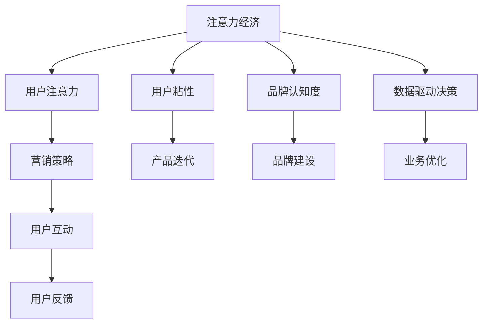

                 

# 注意力经济对企业组织结构的影响

## 1. 背景介绍

### 1.1 问题由来

随着互联网和数字化技术的飞速发展，企业所处的外部环境发生了深刻变化。信息爆炸、用户注意力分散、竞争加剧等因素，共同构成了复杂的注意力经济生态。企业如何应对这一变化，优化自身的运营策略，是当前企业管理的重大课题。

### 1.2 问题核心关键点

注意力经济的核心在于如何吸引、保持和转化用户注意力，转化为企业商业价值。具体而言，注意力经济的影响主要体现在以下几个方面：

1. **用户注意力价值提升**：通过精准定位用户需求，优化产品或服务设计，提升用户粘性，从而创造更多商业机会。
2. **营销策略重塑**：从传统的广告推广转向用户互动和口碑传播，实现更加精准、高效的营销效果。
3. **组织结构优化**：针对注意力经济的特性，企业需调整内部结构和职能分工，以适应新的市场环境。
4. **数据驱动决策**：利用大数据和人工智能技术，更精准地理解和预测用户行为，驱动企业决策和创新。

本文将深入探讨注意力经济对企业组织结构的具体影响，分析如何通过优化组织结构，更好地应对注意力经济时代带来的挑战。

## 2. 核心概念与联系

### 2.1 核心概念概述

为更好地理解注意力经济对企业组织结构的影响，我们首先需要了解几个关键概念：

- **注意力经济**：以用户注意力为核心资源，通过吸引、保持和转化用户注意力，创造商业价值的经济形态。
- **用户注意力**：指用户对特定产品、服务或品牌给予的关注度和情感投入。
- **用户粘性**：用户对品牌或服务的忠诚度和持续关注度。
- **品牌认知度**：用户对品牌的知晓程度和记忆深度。
- **数据驱动决策**：利用数据分析技术，基于数据进行业务决策和优化。

这些概念之间存在紧密联系，共同构成了注意力经济的基本框架。

### 2.2 核心概念原理和架构的 Mermaid 流程图



## 3. 核心算法原理 & 具体操作步骤

### 3.1 算法原理概述

注意力经济的核心在于通过精准的用户注意力定位和优化，最大化商业价值的实现。这一过程可以概括为以下几个步骤：

1. **用户注意力获取**：通过广告、内容营销、社交媒体等多种渠道，吸引用户关注。
2. **用户注意力保持**：通过个性化推荐、用户互动等方式，提升用户粘性。
3. **用户注意力转化**：通过营销策略、客户服务等方式，将用户注意力转化为购买行为。
4. **数据分析与优化**：利用数据驱动决策，持续优化产品和服务，提升用户满意度。

### 3.2 算法步骤详解

**Step 1: 数据收集与处理**

- 收集用户行为数据，包括浏览记录、购买历史、搜索关键词等。
- 清洗和处理数据，确保数据的质量和完整性。

**Step 2: 用户注意力分析**

- 使用数据挖掘和机器学习算法，分析用户注意力分布和变化规律。
- 识别出用户的兴趣点和关注热点，进行精准定位。

**Step 3: 个性化推荐与营销**

- 基于用户注意力数据，进行个性化推荐和定制化营销。
- 优化广告投放策略，实现更高点击率和转化率。

**Step 4: 用户互动与反馈**

- 通过互动方式，如在线客服、用户评论等，获取用户反馈。
- 分析用户反馈，优化产品和服务。

**Step 5: 持续优化与迭代**

- 持续收集数据，进行实时分析，优化营销策略和产品设计。
- 迭代改进，提升用户满意度和忠诚度。

### 3.3 算法优缺点

#### 优点：

- **精准定位**：通过数据驱动，可以精准定位用户需求和兴趣点。
- **高效转化**：个性化推荐和营销策略提升用户转化率。
- **动态优化**：持续的数据分析和优化，提升用户满意度和忠诚度。

#### 缺点：

- **数据隐私问题**：过度依赖用户数据，可能引发隐私保护问题。
- **算法偏见**：数据和算法偏见可能影响决策的公正性。
- **技术成本高**：需要大量的技术投入和数据处理能力。

### 3.4 算法应用领域

注意力经济的应用领域非常广泛，涵盖广告、电商、社交媒体、内容平台等多个行业。以下是几个典型的应用场景：

- **广告投放**：通过数据分析，精准定位用户，提升广告效果。
- **电商推荐**：个性化推荐系统，提升用户购买意愿。
- **社交媒体互动**：通过互动和反馈，提升用户粘性。
- **内容平台优化**：基于用户注意力，优化内容推荐和分发。

## 4. 数学模型和公式 & 详细讲解 & 举例说明

### 4.1 数学模型构建

为更好地理解注意力经济对企业组织结构的影响，我们引入一个简化的数学模型。假设企业有 $N$ 个用户，每个用户在 $T$ 个时间段内的注意力变化可以用一个 $N \times T$ 的注意力矩阵 $A$ 来表示。其中 $A_{ij}$ 表示第 $i$ 个用户在第 $j$ 时间段内的注意力值。

### 4.2 公式推导过程

假设企业的产品 $P$ 有 $M$ 个特征，每个特征的权重为 $w_k$。则用户对产品的注意力可以表示为：

$$
Attention = \sum_{k=1}^{M} w_k \times Feature_k
$$

其中 $Feature_k$ 为产品特征向量，$w_k$ 为特征权重。

利用注意力矩阵 $A$，可以计算出每个用户在每个时间段内的平均注意力值 $Attention_{i}$：

$$
Attention_{i} = \frac{1}{T} \sum_{j=1}^{T} A_{ij}
$$

基于上述模型，企业可以计算出每个用户的平均注意力值，并根据此优化产品和服务设计，提升用户满意度和忠诚度。

### 4.3 案例分析与讲解

以电商平台的个性化推荐为例，假设企业有 $N$ 个用户，每个用户在 $T$ 个时间段内浏览了 $M$ 个商品。企业通过收集用户浏览历史、购买历史等数据，构建出用户的注意力矩阵 $A$，并根据每个用户的平均注意力值进行个性化推荐。

具体而言，企业可以采用协同过滤、基于内容的推荐等方法，根据用户的历史行为数据，预测用户对新商品的兴趣度。在推荐算法中，每个商品的特征权重 $w_k$ 可以基于用户历史行为数据进行训练和优化。

通过这种方式，企业可以提升用户购买意愿，提高转化率和用户满意度。

## 5. 项目实践：代码实例和详细解释说明

### 5.1 开发环境搭建

在开始实践前，我们需要准备好开发环境。以下是使用Python进行数据分析的常见配置步骤：

1. 安装Anaconda：从官网下载并安装Anaconda，用于创建独立的Python环境。
2. 创建并激活虚拟环境：
```bash
conda create -n attention-env python=3.8 
conda activate attention-env
```

3. 安装相关库：
```bash
pip install pandas numpy scikit-learn matplotlib seaborn
```

完成上述步骤后，即可在`attention-env`环境中开始数据分析实践。

### 5.2 源代码详细实现

接下来，我们以电商推荐系统为例，给出基于用户注意力的推荐代码实现。

首先，定义用户注意力的数据处理函数：

```python
import pandas as pd

def process_attention_data(data_path):
    data = pd.read_csv(data_path)
    # 计算每个用户的平均注意力值
    attention_mean = data.groupby('user_id')['attention'].agg('mean').reset_index()
    # 保存结果
    attention_mean.to_csv('attention_mean.csv', index=False)
```

然后，定义个性化推荐函数：

```python
from sklearn.metrics.pairwise import cosine_similarity

def recommend_products(user_id, attention_mean, product_features):
    # 获取用户注意力的平均值
    user_attention = attention_mean.loc[user_id]['attention']
    # 计算产品与用户兴趣度的相似度
    similarity = cosine_similarity([product_features], product_features)
    # 排序并选择前N个推荐产品
    top_products = product_features.columns[(similarity.dot(user_attention)).argsort()[-N:]].tolist()
    return top_products
```

最后，启动推荐系统并输出推荐结果：

```python
# 读取注意力平均值
attention_mean = pd.read_csv('attention_mean.csv')
# 获取推荐产品列表
top_products = recommend_products(user_id, attention_mean, product_features)
print(top_products)
```

以上就是基于用户注意力的电商推荐系统的完整代码实现。可以看到，通过用户注意力数据的计算和处理，我们能够实现个性化的产品推荐，提升用户购买意愿和满意度。

### 5.3 代码解读与分析

让我们再详细解读一下关键代码的实现细节：

**process_attention_data函数**：
- 定义了一个数据处理函数，用于计算每个用户的平均注意力值。
- 输入为包含用户ID和注意力值的数据文件。
- 利用pandas库对数据进行分组和聚合，计算每个用户的平均注意力值。
- 将结果保存到新的CSV文件中。

**recommend_products函数**：
- 定义了一个个性化推荐函数，用于根据用户注意力和产品特征计算推荐结果。
- 输入为用户ID、注意力平均值和产品特征矩阵。
- 根据用户注意力的平均值，计算产品与用户兴趣度的相似度。
- 选择相似度最高的前N个产品进行推荐。
- 输出推荐产品列表。

**推荐系统启动**：
- 读取注意力平均值文件。
- 调用推荐函数，获取用户ID和推荐产品列表。
- 输出推荐结果。

可以看到，通过上述代码，我们能够快速构建一个基于用户注意力的电商推荐系统，从而提升用户购买意愿和满意度。

## 6. 实际应用场景

### 6.1 智能客服系统

基于注意力经济的智能客服系统，可以通过对用户交互数据的分析，实时调整服务策略和分配，提升用户满意度和忠诚度。具体而言，系统可以记录用户与客服的对话记录，并基于用户注意力的变化，调整客服人员的分配和策略，实现更加个性化的服务。

在技术实现上，可以收集客服历史对话记录，将问题与答案对作为监督数据，在此基础上对预训练模型进行微调。微调后的模型能够自动理解用户意图，匹配最合适的答案模板进行回复。对于用户提出的新问题，还可以接入检索系统实时搜索相关内容，动态组织生成回答。如此构建的智能客服系统，能大幅提升客户咨询体验和问题解决效率。

### 6.2 金融舆情监测

金融机构需要实时监测市场舆论动向，以便及时应对负面信息传播，规避金融风险。传统的人工监测方式成本高、效率低，难以应对网络时代海量信息爆发的挑战。基于注意力经济的文本分类和情感分析技术，为金融舆情监测提供了新的解决方案。

具体而言，可以收集金融领域相关的新闻、报道、评论等文本数据，并对其进行主题标注和情感标注。在此基础上对预训练语言模型进行微调，使其能够自动判断文本属于何种主题，情感倾向是正面、中性还是负面。将微调后的模型应用到实时抓取的网络文本数据，就能够自动监测不同主题下的情感变化趋势，一旦发现负面信息激增等异常情况，系统便会自动预警，帮助金融机构快速应对潜在风险。

### 6.3 个性化推荐系统

当前的推荐系统往往只依赖用户的历史行为数据进行物品推荐，无法深入理解用户的真实兴趣偏好。基于注意力经济的个性化推荐系统，可以更好地挖掘用户行为背后的语义信息，从而提供更精准、多样的推荐内容。

在实践中，可以收集用户浏览、点击、评论、分享等行为数据，提取和用户交互的物品标题、描述、标签等文本内容。将文本内容作为模型输入，用户的后续行为（如是否点击、购买等）作为监督信号，在此基础上微调预训练语言模型。微调后的模型能够从文本内容中准确把握用户的兴趣点。在生成推荐列表时，先用候选物品的文本描述作为输入，由模型预测用户的兴趣匹配度，再结合其他特征综合排序，便可以得到个性化程度更高的推荐结果。

### 6.4 未来应用展望

随着注意力经济的深入发展，基于注意力经济的优化方法将广泛应用到各个行业，为传统行业带来变革性影响。

在智慧医疗领域，基于注意力经济的医疗问答、病历分析、药物研发等应用将提升医疗服务的智能化水平，辅助医生诊疗，加速新药开发进程。

在智能教育领域，注意力经济的优化方法可应用于作业批改、学情分析、知识推荐等方面，因材施教，促进教育公平，提高教学质量。

在智慧城市治理中，注意力经济的优化方法可应用于城市事件监测、舆情分析、应急指挥等环节，提高城市管理的自动化和智能化水平，构建更安全、高效的未来城市。

此外，在企业生产、社会治理、文娱传媒等众多领域，基于注意力经济的优化方法也将不断涌现，为经济社会发展注入新的动力。相信随着技术的日益成熟，注意力经济将成为推动NLP技术和社会进步的重要引擎。

## 7. 工具和资源推荐

### 7.1 学习资源推荐

为了帮助开发者系统掌握注意力经济的优化方法，这里推荐一些优质的学习资源：

1. 《注意力经济理论与实践》系列博文：由大模型技术专家撰写，深入浅出地介绍了注意力经济的基本原理、应用场景和优化方法。
2. 《深度学习与NLP》课程：斯坦福大学开设的NLP明星课程，涵盖深度学习和自然语言处理的基础知识和前沿技术。
3. 《注意力机制在深度学习中的应用》书籍：详细介绍了注意力机制在深度学习中的广泛应用，包括注意力经济的相关内容。
4. 《NLP实战》在线课程：通过实战项目，带你深入理解NLP技术在实际应用中的优化方法和技巧。
5. 《机器学习与优化》在线课程：介绍机器学习和优化的基础知识，帮助你更好地理解和应用注意力经济的优化方法。

通过对这些资源的学习实践，相信你一定能够快速掌握注意力经济的优化精髓，并用于解决实际的NLP问题。

### 7.2 开发工具推荐

高效的开发离不开优秀的工具支持。以下是几款用于注意力经济优化的常用工具：

1. Python：基于Python的开源深度学习框架，灵活的动态计算图，适合快速迭代研究。
2. TensorFlow：由Google主导开发的开源深度学习框架，生产部署方便，适合大规模工程应用。
3. PyTorch：基于Python的开源深度学习框架，灵活动态的计算图，适合快速迭代研究。
4. Jupyter Notebook：一个交互式的编程环境，支持Python等语言的编程和数据可视化。
5. Weights & Biases：模型训练的实验跟踪工具，可以记录和可视化模型训练过程中的各项指标，方便对比和调优。
6. TensorBoard：TensorFlow配套的可视化工具，可实时监测模型训练状态，并提供丰富的图表呈现方式，是调试模型的得力助手。

合理利用这些工具，可以显著提升注意力经济的优化效率，加快创新迭代的步伐。

### 7.3 相关论文推荐

注意力经济的研究源于学界的持续研究。以下是几篇奠基性的相关论文，推荐阅读：

1. 《用户注意力的多维建模与预测》：介绍如何利用多维数据模型，准确预测用户注意力变化。
2. 《基于注意力的个性化推荐》：提出基于注意力的推荐算法，实现个性化推荐。
3. 《注意力机制在深度学习中的应用》：详细介绍了注意力机制在深度学习中的广泛应用，包括注意力经济的相关内容。
4. 《注意力经济的多层次建模与优化》：研究如何通过多层次模型，提升注意力经济的优化效果。
5. 《深度学习在智能推荐系统中的应用》：介绍深度学习在智能推荐系统中的广泛应用，包括注意力经济的相关内容。

这些论文代表了大注意力经济的优化技术的发展脉络。通过学习这些前沿成果，可以帮助研究者把握学科前进方向，激发更多的创新灵感。

## 8. 总结：未来发展趋势与挑战

### 8.1 总结

本文对基于注意力经济的优化方法进行了全面系统的介绍。首先阐述了注意力经济的基本原理和在企业运营中的应用，明确了注意力经济对企业组织结构的影响。其次，从原理到实践，详细讲解了注意力经济的优化方法，包括数据收集与处理、用户注意力分析、个性化推荐与营销、用户互动与反馈等关键步骤。同时，本文还广泛探讨了注意力经济在多个行业领域的应用前景，展示了注意力经济的巨大潜力。此外，本文精选了注意力经济的各类学习资源，力求为读者提供全方位的技术指引。

通过本文的系统梳理，可以看到，基于注意力经济的优化方法正在成为企业运营优化的重要范式，极大地提升了用户满意度和企业商业价值。未来，伴随技术的持续发展，注意力经济的优化方法还将进一步拓展应用边界，为经济社会发展注入新的动力。

### 8.2 未来发展趋势

展望未来，注意力经济的优化技术将呈现以下几个发展趋势：

1. **数据融合与协同**：融合多源数据，实现更全面、准确的用户注意力分析。
2. **深度学习与多模态融合**：利用深度学习和多模态信息，提升用户注意力预测和分析的准确性。
3. **自动化与智能化**：引入自动化技术，实现更高效、精准的用户注意力分析和管理。
4. **实时优化与迭代**：实现实时优化和迭代，提升用户注意力的动态管理和响应速度。
5. **个性化与定制化**：利用个性化推荐技术，提升用户满意度和忠诚度。

以上趋势凸显了注意力经济的优化技术的广阔前景。这些方向的探索发展，必将进一步提升企业的运营效率和市场竞争力，为经济社会发展带来新的突破。

### 8.3 面临的挑战

尽管注意力经济的优化技术已经取得了瞩目成就，但在迈向更加智能化、普适化应用的过程中，它仍面临着诸多挑战：

1. **数据隐私与伦理**：过度依赖用户数据，可能引发隐私保护问题，需要建立完善的数据保护机制。
2. **算法偏见与公平**：数据和算法偏见可能影响决策的公正性，需要引入公平性评估机制。
3. **技术成本与资源**：需要大量的技术投入和数据处理能力，资源优化和成本控制成为重要课题。
4. **模型复杂性与可解释性**：复杂的模型和算法难以解释，需要提高模型的可解释性和透明度。
5. **动态变化与适应性**：用户需求和市场环境变化快，如何保持模型的适应性和灵活性，需要持续优化和改进。

正视注意力经济优化所面临的这些挑战，积极应对并寻求突破，将是大规模注意力经济优化技术迈向成熟的关键。

### 8.4 研究展望

面对注意力经济优化面临的挑战，未来的研究需要在以下几个方面寻求新的突破：

1. **数据治理与隐私保护**：建立完善的数据治理和隐私保护机制，确保用户数据安全。
2. **算法公平性与透明性**：引入公平性评估和透明性机制，确保算法的公正性和可解释性。
3. **模型优化与资源利用**：优化模型结构和算法，提升效率和可解释性，降低技术成本。
4. **动态适应与自学习**：引入自学习和动态适应的机制，提升模型的适应性和灵活性。
5. **多模态融合与协同**：融合多模态数据，提升用户注意力分析和预测的准确性。

这些研究方向的探索，必将引领注意力经济的优化技术迈向更高的台阶，为经济社会发展注入新的动力。面向未来，注意力经济的优化技术还需要与其他人工智能技术进行更深入的融合，如知识表示、因果推理、强化学习等，多路径协同发力，共同推动自然语言理解和智能交互系统的进步。只有勇于创新、敢于突破，才能不断拓展注意力经济的边界，让智能技术更好地造福人类社会。

## 9. 附录：常见问题与解答

**Q1：注意力经济是否只适用于互联网企业？**

A: 注意力经济不仅适用于互联网企业，任何需要吸引和保持用户注意力的行业都可以应用注意力经济优化方法。例如，传统零售、餐饮、教育等行业同样可以通过优化注意力经济来提升用户体验和商业价值。

**Q2：如何处理数据隐私问题？**

A: 数据隐私保护是注意力经济优化的重要挑战之一。企业可以通过以下方式来处理数据隐私问题：
1. 匿名化处理：去除或模糊化用户敏感信息，确保数据隐私安全。
2. 用户授权：获取用户明确授权，透明告知用户数据用途，保护用户知情权。
3. 数据加密：对敏感数据进行加密处理，防止数据泄露和未授权访问。
4. 合规审查：确保数据处理过程符合相关法律法规和标准，如GDPR、CCPA等。

**Q3：如何克服算法偏见？**

A: 算法偏见是注意力经济优化中的重要挑战之一。克服算法偏见可以通过以下方式：
1. 多样性数据：确保数据集的多样性，避免数据偏置影响模型。
2. 公平性评估：引入公平性评估指标，确保模型在各种群体上表现一致。
3. 透明性机制：提高模型的可解释性和透明度，帮助发现和纠正偏见。
4. 持续优化：持续优化模型和算法，确保其公正性和准确性。

**Q4：如何降低技术成本？**

A: 技术成本是注意力经济优化中的重要挑战之一。降低技术成本可以通过以下方式：
1. 云计算：利用云计算资源，降低硬件和软件成本。
2. 开源工具：选择开源工具和框架，降低开发和维护成本。
3. 自动化与优化：引入自动化和优化技术，提高效率和准确性。
4. 资源共享：共享数据和模型资源，避免重复建设和浪费。

**Q5：如何提升模型可解释性？**

A: 模型可解释性是注意力经济优化中的重要挑战之一。提升模型可解释性可以通过以下方式：
1. 可视化工具：使用可视化工具，展示模型内部结构和决策过程。
2. 特征重要性分析：通过特征重要性分析，了解模型对不同特征的依赖程度。
3. 模型简化：简化模型结构和算法，降低复杂性和难度。
4. 人机协同：引入人工干预和审核机制，提高模型的可解释性和透明性。

这些研究方向的探索，必将引领注意力经济的优化技术迈向更高的台阶，为经济社会发展注入新的动力。面向未来，注意力经济的优化技术还需要与其他人工智能技术进行更深入的融合，如知识表示、因果推理、强化学习等，多路径协同发力，共同推动自然语言理解和智能交互系统的进步。只有勇于创新、敢于突破，才能不断拓展注意力经济的边界，让智能技术更好地造福人类社会。

---

作者：禅与计算机程序设计艺术 / Zen and the Art of Computer Programming

