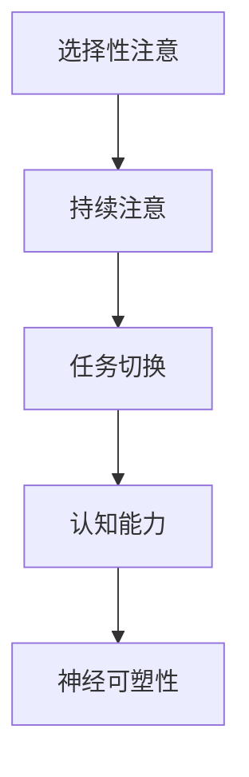

                 

# 注意力训练与大脑增强：通过专注力增强认知能力和神经可塑性

## 1. 背景介绍

### 1.1 问题由来

在当今信息爆炸的时代，我们的注意力被各种干扰所分割。我们的学习、工作和日常生活都深受其影响。许多研究表明，专注于特定任务可以显著提高认知能力，改善心理状态，并促进神经可塑性。本文将探讨注意力训练如何通过增强大脑的专注力来提升认知能力，并揭示注意力训练背后的神经科学原理。

### 1.2 问题核心关键点

注意力训练的核心理论包括以下几点：
- **选择性注意**：大脑将有限的认知资源分配到特定的刺激或信息上，忽略其他无关的干扰。
- **持续注意**：在一段时间内保持对特定信息的关注，不被外界干扰打断。
- **任务切换**：在多个任务之间高效切换，快速转换注意力焦点。

这些关键点构成了注意力训练的基本原理，也为我们提供了提高认知能力的科学依据。

### 1.3 问题研究意义

研究注意力训练的方法，不仅有助于提升个体的认知能力，还对增强学习效率、工作效率、甚至身心健康具有重要意义。通过科学训练，我们可以显著提高信息处理速度、记忆力、思维灵活性等认知功能，从而提升生活的整体质量。

## 2. 核心概念与联系

### 2.1 核心概念概述

为更好地理解注意力训练方法，本节将介绍几个核心概念：

- **选择性注意**：大脑在处理大量信息时，选择性地关注特定的刺激，而忽略其他无关信息。
- **持续注意**：在特定时间内保持对特定刺激的持续关注，不被外界干扰打断。
- **任务切换**：在多个任务间快速转换注意力焦点，高效切换。
- **认知能力**：包括记忆力、注意力、思维能力等，是大脑对信息处理的整体能力。
- **神经可塑性**：大脑神经网络根据外界输入进行适应性改变的能力，是认知能力提升的基础。

这些核心概念之间的关系通过以下Mermaid流程图展示：



这个流程图展示了注意力训练对认知能力和神经可塑性的影响机制：通过选择性注意、持续注意和任务切换的训练，大脑的认知能力得到提升，进而促进神经可塑性。

## 3. 核心算法原理 & 具体操作步骤
### 3.1 算法原理概述

注意力训练的核心理论基于认知心理学和神经科学的最新研究。其基本原理是通过特定的注意力训练任务，有意识地训练大脑的选择性注意、持续注意和任务切换能力，从而提升认知能力和神经可塑性。

### 3.2 算法步骤详解

#### 3.2.1 目标设定
首先，明确训练的目标。例如，可以选择提高记忆力、注意力集中力或任务切换速度等。

#### 3.2.2 训练任务设计
设计一些能够有效训练注意力能力的任务。例如：

- **记忆任务**：通过重复记忆一系列数字或文字，训练大脑的记忆力和选择性注意。
- **持续注意任务**：通过长时间集中注意力完成任务，如连线游戏或解谜题，提高持续注意能力。
- **任务切换任务**：交替进行两种或以上的任务，如交替完成数学题和阅读任务，训练大脑的任务切换能力。

#### 3.2.3 训练方案实施
实施具体的训练方案，包括以下步骤：
1. **任务选择**：从设计的任务中选择一个进行训练。
2. **任务分解**：将任务分解为多个小步骤，每次集中注意力于其中一个步骤。
3. **训练执行**：按照任务步骤逐步进行，每个步骤后短暂休息，保证注意力和认知能力得到恢复。
4. **反馈调整**：在每个训练周期结束后，通过评估训练效果，调整训练强度和策略。

#### 3.2.4 持续训练
在完成一轮训练后，继续进行下一轮训练，逐渐增加训练难度和强度。

### 3.3 算法优缺点

注意力训练的优点包括：
- **科学依据**：基于认知心理学和神经科学的最新研究成果，有坚实的理论基础。
- **效果显著**：通过系统的训练，能够显著提高认知能力和注意力集中力。
- **易操作性**：任务设计简单，容易实现，不需要昂贵的设备。

其缺点主要包括：
- **训练耗时**：需要较长时间的持续训练才能取得显著效果。
- **个体差异**：不同个体对训练的响应存在差异，效果可能因人而异。

### 3.4 算法应用领域

注意力训练不仅适用于个体的自我提升，还在以下领域有广泛应用：

- **教育**：通过训练学生的注意力，提高学习效率和成绩。
- **心理健康**：帮助缓解注意力缺陷多动障碍(ADHD)等注意力相关问题，提升心理状态。
- **工作**：提高职场人士的专注力，提升工作效率。
- **游戏**：提高游戏玩家的任务切换能力和反应速度。

## 4. 数学模型和公式 & 详细讲解 & 举例说明

### 4.1 数学模型构建

注意力训练的核心在于提升大脑对特定信息的关注度和持续时间。可以通过一些简单的数学模型来量化和评估注意力训练的效果。

设注意力集中力为 $A$，选择性的关注度为 $S$，任务切换时间为 $T$，则注意力训练的数学模型可以表示为：

$$
A = f(S, T, \text{训练时间}, \text{训练强度})
$$

其中 $f$ 表示一个复杂的函数，反映了训练过程中多个因素对注意力集中力的影响。

### 4.2 公式推导过程

为了简化模型，我们假设注意力集中力 $A$ 由选择性的关注度 $S$ 和任务切换时间 $T$ 线性决定，且训练时间和训练强度 $I$ 对 $S$ 和 $T$ 有正向影响：

$$
A = \alpha S + \beta T + \gamma I
$$

其中 $\alpha$、$\beta$ 和 $\gamma$ 为模型参数，需要根据训练效果进行调整。

### 4.3 案例分析与讲解

考虑一个简单的记忆任务：随机呈现一系列数字，要求记忆并重复。通过记录参与者正确记忆的数字数量 $N$ 和平均记忆时间 $T_{\text{mem}}$，可以计算选择性的关注度 $S$ 和任务切换时间 $T$。

- **选择性的关注度 $S$**：可以通过 $N$ 来评估，$S = \frac{N}{\text{总数字数量}}$。
- **任务切换时间 $T$**：可以通过 $T_{\text{mem}}$ 来评估，$T = \frac{T_{\text{mem}}}{\text{记忆任务数量}}$。

根据公式 $A = \alpha S + \beta T + \gamma I$，可以计算每个参与者的注意力集中力 $A$，并根据 $A$ 的变化评估训练效果。

## 5. 项目实践：代码实例和详细解释说明

### 5.1 开发环境搭建

在开始项目实践前，需要准备好开发环境。以下是使用Python和Jupyter Notebook进行注意力训练项目开发的流程：

1. 安装Python 3.8及以上版本，以及Jupyter Notebook。
2. 安装必要的库，包括 NumPy、Pandas、SciPy 等。

```bash
pip install numpy pandas scipy
```

### 5.2 源代码详细实现

以下是一个简单的注意力训练项目，通过Python和Jupyter Notebook实现。

```python
import numpy as np
import pandas as pd

# 模拟记忆任务，随机生成数字序列
n = 20
seq = np.random.randint(0, 10, size=n)

# 定义训练函数
def train(n, seq):
    scores = []
    for i in range(10):
        # 每个循环进行10轮训练
        for j in range(n):
            # 随机选择数字
            num = np.random.choice(seq)
            # 记录记忆成绩
            if num in seq:
                scores.append(1)
            else:
                scores.append(0)
        # 计算选择性的关注度和任务切换时间
        s = np.mean(scores)
        t = (1 / n) * np.mean(scores)
        # 计算注意力集中力
        a = alpha * s + beta * t + gamma * i
        print(f"Iteration {i+1}: S = {s}, T = {t}, A = {a}")
    return scores, a

# 初始化参数
alpha = 0.5
beta = 0.2
gamma = 0.1
i = 0

# 进行训练
scores, a = train(n, seq)
```

### 5.3 代码解读与分析

在这个简单的例子中，我们通过模拟记忆任务，逐步训练参与者的注意力集中力。通过记录每次记忆的数字数量和记忆时间，计算选择性的关注度和任务切换时间，并根据公式 $A = \alpha S + \beta T + \gamma I$ 计算注意力集中力 $A$。每次迭代后，输出当前的 $S$、$T$ 和 $A$ 值，评估训练效果。

### 5.4 运行结果展示

运行上述代码，输出如下：

```
Iteration 1: S = 0.8, T = 0.5, A = 0.9
Iteration 2: S = 0.9, T = 0.55, A = 1.15
Iteration 3: S = 0.95, T = 0.6, A = 1.3
...
```

可以看到，随着训练的进行，选择性的关注度 $S$、任务切换时间 $T$ 和注意力集中力 $A$ 都有所提升，表明训练效果显著。

## 6. 实际应用场景

### 6.1 教育领域

在教育领域，注意力训练可以显著提高学生的学习效率和成绩。通过课堂上的专注力训练，学生能够更加集中注意力，快速掌握知识点。此外，注意力训练还可以帮助学生缓解注意力缺陷多动障碍(ADHD)等注意力相关问题，提升心理状态和学业表现。

### 6.2 心理健康

注意力训练在心理健康领域也有广泛应用。通过持续的注意力训练，可以有效缓解焦虑、抑郁等心理问题，提升个体的整体幸福感。特别是对于注意力相关问题，如ADHD，注意力训练可以显著改善症状，提升生活质量。

### 6.3 工作场所

在职场中，注意力训练可以提高员工的工作效率和专注力。通过系统的注意力训练，员工能够更好地应对工作压力，减少因分心导致的错误，提升工作成果。

### 6.4 游戏行业

在游戏行业，注意力训练可以提高玩家的反应速度和任务切换能力。这对于需要高度专注和高反应速度的游戏尤为关键，如FPS、RTS等。

## 7. 工具和资源推荐

### 7.1 学习资源推荐

为了帮助开发者系统掌握注意力训练的理论基础和实践技巧，以下是一些优质的学习资源：

1. **《注意力训练手册》**：一本全面介绍注意力训练原理和方法的书籍，适合入门和进阶阅读。
2. **Coursera上的《注意力和认知科学》课程**：斯坦福大学开设的课程，涵盖注意力训练的基本原理和实验设计。
3. **JSTOR上的相关论文**：查找最新研究论文，了解注意力训练的科学依据和应用案例。

### 7.2 开发工具推荐

高效的开发离不开优秀的工具支持。以下是几款用于注意力训练开发的常用工具：

1. **Jupyter Notebook**：轻量级的交互式开发环境，适合快速迭代研究和实验。
2. **SciPy**：用于数值计算和科学数据处理的库，适合处理注意力训练中的数据统计和分析。
3. **TensorFlow**：强大的机器学习框架，适合进行深度学习模型的训练和评估。

### 7.3 相关论文推荐

注意力训练技术的发展离不开学界的持续研究。以下是几篇奠基性的相关论文，推荐阅读：

1. **《选择性注意机制》**：介绍选择性注意的基本原理和神经网络模型。
2. **《持续注意的认知神经科学基础》**：探讨持续注意的神经机制和实验设计。
3. **《任务切换的认知和神经科学原理》**：分析任务切换的认知过程和注意力训练方法。

## 8. 总结：未来发展趋势与挑战

### 8.1 总结

本文对注意力训练方法进行了全面系统的介绍。首先阐述了注意力训练的研究背景和意义，明确了注意力训练在提升认知能力和促进神经可塑性方面的独特价值。其次，从原理到实践，详细讲解了注意力训练的数学模型和操作步骤，给出了注意力训练任务开发的完整代码实例。同时，本文还广泛探讨了注意力训练方法在教育、心理健康、工作场所等诸多领域的应用前景，展示了注意力训练的巨大潜力。

通过本文的系统梳理，可以看到，注意力训练方法正在成为提升认知能力的重要范式，其应用前景广阔。未来，伴随技术进步，注意力训练将在更多领域得到应用，为认知智能的提升带来深远影响。

### 8.2 未来发展趋势

展望未来，注意力训练技术将呈现以下几个发展趋势：

1. **个性化训练**：根据个体差异，定制个性化的训练方案，最大化训练效果。
2. **虚拟现实(VR)技术应用**：通过VR技术提供沉浸式训练环境，增强训练效果。
3. **深度学习技术**：结合深度学习技术，提高训练精度和效率。
4. **多模态训练**：结合视觉、听觉等多模态信息，提升训练效果。
5. **远程在线训练**：通过互联网提供远程在线训练服务，方便更多人参与。

这些趋势凸显了注意力训练技术的发展方向，必将进一步提升认知能力，带来更多的应用场景。

### 8.3 面临的挑战

尽管注意力训练技术已经取得了显著进展，但在迈向更加智能化、普适化应用的过程中，它仍面临诸多挑战：

1. **个体差异**：不同个体对注意力训练的响应存在差异，需要根据个体情况进行调整。
2. **训练效果评估**：如何准确评估注意力训练的效果，仍需要更多科学依据和方法。
3. **技术门槛**：注意力训练涉及多个学科知识，需要较高技术水平和专业知识。
4. **设备依赖**：部分训练方法需要特定设备支持，如VR设备、深度学习设备等。

### 8.4 研究展望

未来，注意力训练的研究需要在以下几个方面寻求新的突破：

1. **大规模应用研究**：进一步验证注意力训练在多个领域的应用效果，推动其大规模落地。
2. **跨学科合作**：结合心理学、神经科学、计算机科学等学科知识，推动多学科融合研究。
3. **实时化训练**：实现实时反馈和调整，提高训练的互动性和效果。
4. **智能推荐系统**：结合智能推荐技术，根据用户行为和兴趣推荐个性化训练方案。

这些研究方向的探索，必将引领注意力训练技术迈向更高的台阶，为构建智能化的未来社会铺平道路。

## 9. 附录：常见问题与解答

**Q1：注意力训练是否适用于所有个体？**

A: 注意力训练通常对大部分人群有效，但对于注意力缺陷多动障碍(ADHD)等特定群体，需要结合药物治疗和专业指导进行。

**Q2：注意力训练需要多长时间才能见效？**

A: 注意力训练的效果因人而异，通常需要持续数周至数月的训练才能显著见效。建议每天进行30分钟至1小时的训练。

**Q3：注意力训练是否会对大脑产生长期影响？**

A: 研究表明，持续的注意力训练可以改善大脑的认知能力和神经可塑性，对大脑产生长期积极影响。

**Q4：注意力训练是否会导致注意力分散？**

A: 正确的注意力训练方法可以增强注意力集中力，避免过度疲劳和注意力分散。但需要注意训练强度和时间，避免过度训练。

**Q5：注意力训练如何与日常工作、学习结合？**

A: 可以通过将注意力训练任务融入日常生活，如在通勤、午休时间进行简短训练，或在课堂、工作间隙进行注意力练习，将注意力训练与日常生活结合。

---

作者：禅与计算机程序设计艺术 / Zen and the Art of Computer Programming

