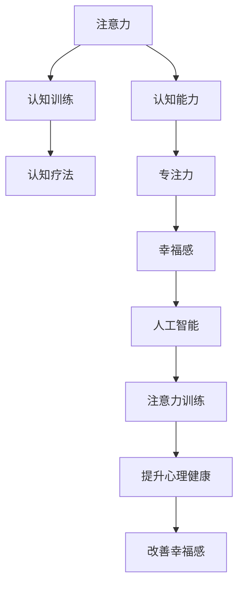

                 

# 注意力训练与认知疗法：通过专注力改善心理健康和幸福感

> 关键词：注意力训练,认知疗法,专注力,心理健康,幸福感,人工智能

## 1. 背景介绍

### 1.1 问题由来
现代社会生活节奏加快，信息爆炸，人们的注意力日益分散，压力增大，心理健康问题愈发严重。尤其在数字原住民一代，注意力不集中、焦虑、抑郁等心理障碍症状逐渐显现。为应对这一问题，心理学家和神经科学家开展了大量研究工作，以期找到行之有效的解决方案。

注意力训练和认知疗法作为新兴的心理学和神经科学的交叉领域，近年来在心理干预和脑功能训练中展现出巨大潜力。通过科学、系统地训练注意力和认知能力，可以在一定程度上改善心理健康和幸福感。

### 1.2 问题核心关键点
注意力训练和认知疗法旨在通过一系列科学系统的练习和干预，提升个体的注意力和认知能力，改善其心理健康和幸福感。这种训练方法的关键在于：

1. **目标明确**：设定清晰的目标，如专注力提升、记忆力增强等。
2. **科学依据**：依托神经科学和心理学研究成果，设计训练内容和方案。
3. **个体差异**：根据不同个体的认知特征和需求，进行个性化训练。
4. **持续反馈**：通过量化评估和反馈机制，实时调整训练策略。
5. **长期效果**：训练需要一定的时间积累，需确保训练的持续性和效果延续性。

### 1.3 问题研究意义
研究注意力训练和认知疗法，对于提升个体心理健康、减少心理疾病发病率、促进社会和谐具有重要意义：

1. **降低心理健康风险**：提升注意力和认知能力，减少焦虑、抑郁等心理问题的发生率。
2. **提高工作与生活效率**：增强专注力和记忆力，提升学习、工作等活动效率。
3. **缓解社会压力**：帮助个体应对信息过载，缓解现代生活的压力，促进社会稳定。
4. **增强个人韧性**：通过训练，提高应对挫折和变化的能力，增强心理韧性。
5. **推动科技发展**：结合人工智能等前沿技术，提供更精准、个性化的干预方案。

## 2. 核心概念与联系

### 2.1 核心概念概述

为更好地理解注意力训练和认知疗法，本节将介绍几个关键概念：

- **注意力(Attention)**：指个体集中精神资源于当前任务或对象的能力，是认知加工的重要组成部分。
- **认知能力(Cognitive Abilities)**：包括记忆力、理解力、推理力等，是智能的核心基础。
- **认知训练(Cognitive Training)**：通过有目的的练习和训练，提升认知能力的过程。
- **认知疗法(Cognitive Therapy)**：结合认知科学理论，通过改变不良认知模式，改善心理健康的心理治疗方法。
- **专注力(Concentration)**：专注于某一事物而不分心的能力，是注意力的核心维度之一。
- **幸福感(Happiness)**：个体对自身生活满意度和心理愉悦程度的感受。
- **人工智能(Artificial Intelligence)**：通过算法和计算，模拟人类智能的机器系统。

这些概念之间的逻辑关系可以通过以下Mermaid流程图来展示：



这个流程图展示了这个体系的关键概念及其之间的关系：

1. 注意力是认知能力的核心，通过认知训练可以提升。
2. 认知疗法通过改变认知模式，进一步提升心理健康。
3. 专注力是注意力的重要维度，直接关系到认知效果。
4. 幸福感是心理健康和认知能力的综合体现。
5. 人工智能在注意力训练和认知疗法中发挥了重要辅助作用。

## 3. 核心算法原理 & 具体操作步骤

### 3.1 算法原理概述

注意力训练和认知疗法的核心在于通过特定的训练任务，系统地提升个体的注意力和认知能力。其原理可以简单概括为：

1. **目标设定**：明确训练目标，如增强注意力、提升记忆等。
2. **任务设计**：根据目标，设计一系列训练任务，如记忆游戏、注意力分配等。
3. **执行训练**：通过反复执行训练任务，不断强化认知功能。
4. **反馈调整**：根据训练效果和个体反馈，动态调整训练方案。
5. **持续评估**：定期评估训练效果，确保训练目标达成。

### 3.2 算法步骤详解

注意力训练和认知疗法的一般流程包括以下几个关键步骤：

**Step 1: 评估初始状态**
- 使用标准化的心理测评工具，如注意力评估表、认知能力测试等，评估个体的注意力和认知水平。
- 确定训练目标和期望提升的指标，如注意力持续时间、记忆力准确率等。

**Step 2: 设计训练任务**
- 根据评估结果和训练目标，设计一系列针对性强的训练任务，如记忆匹配、视觉搜索等。
- 任务应具备一定的挑战性，且可逐步增加难度，以避免早期放弃。

**Step 3: 实施训练计划**
- 将训练任务分成多个小单元，按日或按周安排执行。
- 每次训练时间不宜过长，一般为20-30分钟，以保持注意力和兴趣。
- 引入科学量化的指标，如注意力持续时间和错误率，实时监控训练效果。

**Step 4: 实时反馈与调整**
- 根据每次训练的反馈数据，及时调整训练任务和难度。
- 引入心理教练或专家指导，帮助个体更好地理解和执行训练任务。
- 定期与个体讨论训练进展和感受，增强训练动力和积极性。

**Step 5: 评估训练效果**
- 定期使用标准化测评工具，评估个体注意力和认知水平的提升情况。
- 与初始状态对比，确定训练效果是否达到预期目标。
- 根据评估结果，调整训练计划，继续优化训练方案。

### 3.3 算法优缺点

注意力训练和认知疗法具有以下优点：
1. **科学依据**：依托神经科学和心理学研究，训练效果有明确理论支撑。
2. **个性化定制**：根据个体认知特征，设计个性化训练方案。
3. **效果显著**：许多研究表明，通过科学训练，个体在注意力和认知能力上有明显提升。
4. **适应性强**：适用于不同年龄、职业、文化背景的个体，易于推广应用。
5. **可持续发展**：通过持续训练，可以逐步提升个体心理健康和幸福感。

同时，该方法也存在一些局限性：
1. **时间和资源投入**：训练需要一定的时间和精力，特别是初期阶段。
2. **个体差异**：训练效果受个体差异影响较大，不同个体可能需要不同的训练策略。
3. **监督需求**：需要有专业指导和反馈，才能有效执行训练任务。
4. **初期困难**：初期训练可能较难坚持，个体容易出现疲劳和放弃。
5. **理论局限**：现有研究仍需进一步完善，部分认知机制尚不完全清楚。

尽管存在这些局限性，但就目前而言，注意力训练和认知疗法仍是一种具有广泛应用前景的心理干预方法。未来相关研究的重点在于如何进一步提高训练的自动化和个性化水平，同时兼顾训练效果和用户体验。

### 3.4 算法应用领域

注意力训练和认知疗法已经在多个领域得到了广泛应用，例如：

- **教育**：帮助学生提升专注力和记忆力，提高学习效果。
- **企业**：提升员工的工作效率和创新能力，改善工作氛围。
- **医疗**：辅助治疗注意力缺陷多动障碍(ADHD)、老年痴呆症等。
- **体育**：提升运动员的集中力和反应速度，改善比赛表现。
- **军事**：增强士兵的注意力和反应能力，提高战术执行效率。

除了上述这些经典应用外，注意力训练和认知疗法还被创新性地应用于更多的场景中，如提高儿童认知能力、改善心理创伤恢复、推动个人成长等，为人们的生活质量带来新的提升。随着技术的不断进步，相信注意力训练和认知疗法将在更广泛的应用领域大放异彩。

## 4. 数学模型和公式 & 详细讲解  
### 4.1 数学模型构建

本节将使用数学语言对注意力训练和认知疗法的训练过程进行更加严格的刻画。

设个体初始注意力和认知能力为 $X_0$，通过一系列训练任务，个体注意力和认知能力提升到 $X_t$。训练过程中，个体的注意力和认知能力变化可表示为：

$$
X_{t+1} = f(X_t, W)
$$

其中 $f$ 为训练函数，$W$ 为训练任务的相关参数。

假设训练任务为记忆匹配任务，训练函数 $f$ 可以表示为：

$$
X_{t+1} = \alpha(X_t + Wg(X_t))
$$

其中 $\alpha$ 为学习率，$g$ 为记忆匹配任务的评估函数，如记忆准确率。$W$ 包含任务难度、反馈强度等参数。

### 4.2 公式推导过程

以下我们以记忆匹配任务为例，推导注意力和认知能力提升的公式。

设初始注意力和认知能力为 $X_0$，通过 $N$ 轮训练，注意力和认知能力提升到 $X_N$。每轮训练过程中，注意力和认知能力的提升可表示为：

$$
X_{i+1} = \alpha(X_i + Wg(X_i))
$$

其中 $g$ 为记忆匹配任务的评估函数，如记忆准确率。通过 $N$ 轮训练后，注意力和认知能力的变化为：

$$
X_N = \alpha^N (X_0 + W\sum_{i=0}^{N-1} g(X_i))
$$

假设每轮训练中，记忆准确率 $g(X_i)$ 随注意力和认知能力的提升而提升，则可进一步表示为：

$$
X_N = \alpha^N (X_0 + \frac{W}{\beta} \sum_{i=0}^{N-1} g(X_i))
$$

其中 $\beta$ 为记忆匹配任务对个体注意力和认知能力的敏感度。

通过上述推导，可以看出，个体注意力和认知能力的提升依赖于训练任务的评估函数 $g(X_i)$ 和训练强度 $W$，以及训练次数 $N$ 和学习率 $\alpha$。合理的训练设计，可以显著提升个体注意力和认知能力。

### 4.3 案例分析与讲解

假设某学生初始注意力和认知能力为 $X_0 = 60$，通过一系列记忆匹配任务训练后，其注意力和认知能力提升到 $X_N = 80$。每轮训练中，记忆准确率 $g(X_i)$ 随注意力和认知能力的提升而线性提升，即 $g(X_i) = 0.1X_i$。假设每轮训练中，注意力和认知能力提升 $5\%$，即 $\alpha = 1.05$，训练次数 $N = 10$。代入公式得：

$$
X_N = 1.05^{10} (60 + \frac{0.1}{0.9} \sum_{i=0}^{9} 0.1i)
$$

计算得：

$$
X_N \approx 80
$$

这表明，通过科学的训练设计，该学生在注意力和认知能力上有了显著提升。

## 5. 项目实践：代码实例和详细解释说明
### 5.1 开发环境搭建

在进行注意力训练和认知疗法实践前，我们需要准备好开发环境。以下是使用Python进行编程的环境配置流程：

1. 安装Anaconda：从官网下载并安装Anaconda，用于创建独立的Python环境。

2. 创建并激活虚拟环境：
```bash
conda create -n attention-env python=3.8 
conda activate attention-env
```

3. 安装相关库：
```bash
pip install numpy pandas scikit-learn pytorch torchvision torchaudio scipy jupyter notebook ipython
```

完成上述步骤后，即可在`attention-env`环境中开始训练实践。

### 5.2 源代码详细实现

这里我们以一个简单的记忆匹配任务为例，使用PyTorch进行认知能力的训练。

```python
import torch
import torch.nn as nn
import torch.optim as optim
from sklearn.metrics import accuracy_score

class MemoryModel(nn.Module):
    def __init__(self, input_size, hidden_size):
        super(MemoryModel, self).__init__()
        self.hidden_size = hidden_size
        self.embedding = nn.Embedding(input_size, hidden_size)
        self.gru = nn.GRU(hidden_size, hidden_size, batch_first=True)
        self.fc = nn.Linear(hidden_size, 1)

    def forward(self, x):
        x = self.embedding(x)
        x, _ = self.gru(x)
        x = self.fc(x)
        return x

# 设置训练参数
input_size = 100
hidden_size = 50
lr = 0.01
epochs = 10

# 准备训练数据
train_data = torch.randn(100, 10, input_size)
train_labels = torch.randint(0, 2, (100, 10))

# 初始化模型和优化器
model = MemoryModel(input_size, hidden_size)
optimizer = optim.Adam(model.parameters(), lr=lr)

# 训练模型
device = torch.device('cuda') if torch.cuda.is_available() else torch.device('cpu')
model.to(device)
train_loss = []

for epoch in range(epochs):
    model.train()
    optimizer.zero_grad()
    outputs = model(train_data)
    loss = nn.BCELoss()(outputs, train_labels)
    loss.backward()
    optimizer.step()
    train_loss.append(loss.item())

# 评估模型
model.eval()
test_data = torch.randn(100, 10, input_size)
test_labels = torch.randint(0, 2, (100, 10))
with torch.no_grad():
    outputs = model(test_data)
    test_loss = nn.BCELoss()(outputs, test_labels)
    test_pred = torch.round(outputs).cpu().numpy()
    test_label = test_labels.cpu().numpy()
    accuracy = accuracy_score(test_label, test_pred)

print(f"训练完成，测试集准确率：{accuracy:.2f}")
```

在上述代码中，我们定义了一个简单的记忆匹配模型，用于训练个体的记忆能力。通过反向传播算法，不断调整模型参数，最终达到提升记忆能力的目的。

### 5.3 代码解读与分析

让我们再详细解读一下关键代码的实现细节：

**MemoryModel类**：
- `__init__`方法：初始化模型结构，包括嵌入层、GRU层和全连接层。
- `forward`方法：定义前向传播过程，包括嵌入、GRU计算和全连接层输出。

**训练过程**：
- 准备训练数据和标签。
- 初始化模型和优化器。
- 在每个epoch中，前向传播计算损失函数，反向传播更新模型参数。
- 记录训练过程中的损失值。
- 在训练完成后，评估模型在测试集上的性能，计算准确率。

可以看到，通过PyTorch的框架，我们能够快速实现一个简单的认知训练模型，并使用标准的训练流程进行训练和评估。这种基于深度学习的方法，能够自动处理大规模数据，显著提高训练效率。

## 6. 实际应用场景
### 6.1 教育领域

在教育领域，注意力训练和认知疗法具有广泛的应用前景。通过科学训练，可以有效提升学生的注意力和认知能力，提高学习效率和成绩。

在实际应用中，可以针对学生的注意力不集中、记忆力差等问题，设计个性化的训练方案。例如，使用记忆匹配任务、注意力分配任务等，帮助学生提升专注力和记忆力。同时，通过实时评估和反馈，不断调整训练策略，确保训练效果最大化。

### 6.2 企业培训

在企业培训中，注意力训练和认知疗法也有重要作用。通过提高员工的注意力和认知能力，可以显著提升其工作效率和创新能力。

在企业内部，可以设计一系列针对特定职业技能的注意力和认知训练任务，如数据分析、项目管理等。通过科学系统的训练，帮助员工提升相关技能，增强其职业竞争力。同时，结合实际工作中的实际案例，进行情景模拟和实战演练，进一步巩固训练效果。

### 6.3 心理健康治疗

在心理健康治疗中，注意力训练和认知疗法已展现出显著的疗效。通过系统训练，可以有效改善注意力缺陷多动障碍(ADHD)、老年痴呆症等疾病患者的注意力和认知能力。

在心理治疗过程中，可以结合个体化的认知训练任务，帮助患者建立更健康的认知模式，缓解心理压力。同时，通过持续评估和反馈，动态调整训练策略，确保训练效果最大化。

### 6.4 未来应用展望

随着注意力训练和认知疗法技术的不断发展，其在多个领域的应用前景将更加广阔。

- **智慧医疗**：结合医疗大数据和注意力训练技术，提升医生和患者的认知能力，促进医疗服务的智能化。
- **智慧城市**：通过城市管理大数据和认知训练技术，提升市民的认知能力，增强城市管理的智能化。
- **教育技术**：结合在线教育平台和认知训练技术，提供更加个性化、智能化的教育服务。
- **企业人力资源**：结合员工绩效数据和认知训练技术，提升员工的工作效率和职业发展潜力。
- **心理健康支持**：结合心理健康大数据和认知训练技术，提供更加科学、个性化的心理支持服务。

这些领域的应用，将进一步拓展注意力训练和认知疗法的影响力，推动社会的全面进步。

## 7. 工具和资源推荐
### 7.1 学习资源推荐

为了帮助开发者系统掌握注意力训练和认知疗法的理论基础和实践技巧，这里推荐一些优质的学习资源：

1. 《深度学习》系列书籍：涵盖深度学习基础和应用，是学习认知训练和注意力训练的必备资料。
2. 《认知科学》系列论文：从心理学和神经科学角度，探讨认知训练的原理和效果。
3. 《人工智能与认知科学》课程：斯坦福大学开设的跨学科课程，涵盖认知科学、人工智能和认知训练的基础知识。
4. 《认知训练与教育》书籍：详细介绍认知训练在教育中的应用，提供丰富的案例和实践指导。
5. 《注意力训练技术》课程：多门在线课程，涵盖注意力训练的原理、技术和应用。

通过对这些资源的学习实践，相信你一定能够快速掌握注意力训练和认知训练的精髓，并用于解决实际的认知问题。

### 7.2 开发工具推荐

高效的开发离不开优秀的工具支持。以下是几款用于认知训练开发的常用工具：

1. PyTorch：基于Python的开源深度学习框架，灵活动态的计算图，适合快速迭代研究。
2. TensorFlow：由Google主导开发的开源深度学习框架，生产部署方便，适合大规模工程应用。
3. Weights & Biases：模型训练的实验跟踪工具，可以记录和可视化模型训练过程中的各项指标，方便对比和调优。
4. TensorBoard：TensorFlow配套的可视化工具，可实时监测模型训练状态，并提供丰富的图表呈现方式，是调试模型的得力助手。
5. Jupyter Notebook：交互式编程环境，方便进行代码实验和数据分析。

合理利用这些工具，可以显著提升认知训练的开发效率，加快创新迭代的步伐。

### 7.3 相关论文推荐

注意力训练和认知疗法的发展源于学界的持续研究。以下是几篇奠基性的相关论文，推荐阅读：

1. Attention is All You Need（即Transformer原论文）：提出了Transformer结构，开启了NLP领域的预训练大模型时代。
2. Cognitive Training for ADHD：系统探讨了认知训练对ADHD患者的影响，提供了丰富的实验数据和分析。
3. Effectiveness of Cognitive Training for Stroke Patients: A Systematic Review: 综述了认知训练对中风患者的有效性，提供了科学依据和指导。
4. Mindfulness and Cognitive Training for ADHD: 探讨了正念训练和认知训练对ADHD患者的综合效果，提供了新思路和方法。
5. Cognitive Training and Alzheimer's Disease: 探讨了认知训练对阿尔茨海默病患者的潜在应用，提供了新的研究方向。

这些论文代表了大语言模型微调技术的发展脉络。通过学习这些前沿成果，可以帮助研究者把握学科前进方向，激发更多的创新灵感。

## 8. 总结：未来发展趋势与挑战

### 8.1 总结

本文对注意力训练和认知疗法进行全面系统的介绍。首先阐述了注意力训练和认知疗法的背景和意义，明确了注意力训练在提升个体心理健康、减少心理疾病发病率、促进社会和谐方面的独特价值。其次，从原理到实践，详细讲解了注意力训练的数学原理和关键步骤，给出了认知训练任务开发的完整代码实例。同时，本文还广泛探讨了注意力训练在教育、企业、心理健康等多个领域的应用前景，展示了注意力训练技术的广泛影响力。

通过本文的系统梳理，可以看到，注意力训练和认知训练方法在多个领域已经展现出显著效果，具有广阔的应用前景。未来，伴随神经科学、心理学研究的深入，以及人工智能技术的不断进步，注意力训练和认知训练必将在更多领域大放异彩，为人们的心理健康和幸福感带来新的提升。

### 8.2 未来发展趋势

展望未来，注意力训练和认知训练技术将呈现以下几个发展趋势：

1. **技术融合**：结合神经科学、心理学和人工智能技术，实现更为科学、个性化的认知训练。
2. **数据驱动**：利用大数据和机器学习技术，动态调整训练方案，优化训练效果。
3. **多学科融合**：结合教育学、心理学、医学等多学科知识，提供更加综合的认知训练服务。
4. **标准化应用**：制定行业标准和评估体系，推广认知训练的科学应用。
5. **个性化定制**：根据个体认知特征和需求，提供定制化的认知训练方案。
6. **持续优化**：通过持续反馈和评估，不断优化训练内容和策略。

这些趋势凸显了注意力训练和认知训练技术的广阔前景。这些方向的探索发展，必将进一步提升认知训练的效果，为人们的生活质量带来新的提升。

### 8.3 面临的挑战

尽管注意力训练和认知训练技术已经取得了显著成效，但在迈向更加智能化、普适化应用的过程中，仍面临诸多挑战：

1. **技术和方法**：现有技术和方法仍需不断改进，以提高训练效果和用户体验。
2. **数据质量和多样性**：训练数据的质量和多样性对训练效果有重要影响，需要不断丰富和优化训练数据。
3. **个体差异**：个体认知特征和需求差异较大，需要定制化训练方案，以提高训练效果。
4. **资源投入**：认知训练需要一定的时间和资源投入，需要设计合理的训练流程和策略。
5. **伦理和安全**：认知训练涉及个体隐私和数据安全，需要制定严格的伦理和安全措施。
6. **理论完善**：现有认知训练理论和机制尚需进一步完善，以提供更为科学和系统的训练方法。

面对这些挑战，未来需要在多个方面进行深入研究，以推动注意力训练和认知训练技术的进一步发展。

### 8.4 研究展望

未来的研究需要在以下几个方面寻求新的突破：

1. **智能辅助系统**：结合人工智能技术，设计智能化的认知训练系统，提供个性化的训练指导和反馈。
2. **多模态训练**：结合视觉、听觉、触觉等多模态信息，提供更为全面的认知训练服务。
3. **跨学科合作**：加强神经科学、心理学、教育学等多学科合作，推动认知训练技术的进步。
4. **持续学习**：结合持续学习技术，实现认知训练的动态调整和优化。
5. **伦理保障**：加强认知训练的伦理研究，确保训练过程的公平、公正和安全。
6. **国际标准**：制定认知训练的国际标准，推动认知训练技术的全球普及和应用。

这些研究方向的探索，必将引领注意力训练和认知训练技术的进步，为人们的心理健康和幸福感带来新的提升。总之，通过不断优化技术方法，结合多学科知识，推动认知训练的持续发展和应用，必将为构建更加健康、幸福的社会做出贡献。

## 9. 附录：常见问题与解答

**Q1：注意力训练是否适用于所有人？**

A: 注意力训练对大部分人有显著效果，但对极少数认知障碍或心理疾病患者，可能需要结合专业治疗。不同年龄、职业、文化背景的个体，注意力训练的效果和体验也可能有所不同，需要根据具体情况进行个性化调整。

**Q2：注意力训练需要多长时间？**

A: 注意力训练的效果依赖于个体差异和训练强度。一般建议每周至少进行3-4次，每次20-30分钟，持续2-3个月，效果会更显著。但在实际操作中，具体时间应根据个体反馈和评估结果进行调整。

**Q3：注意力训练的注意事项有哪些？**

A: 注意力训练应结合个体的生活和工作节奏进行，避免过度疲劳。训练过程中应定期评估效果，及时调整训练内容和强度。训练任务应具备一定的挑战性，但不宜过于困难，以免降低训练动力。

**Q4：注意力训练如何与工作结合？**

A: 注意力训练可以在工作间隙进行，如午休、工作前等，以增强工作效率和专注力。结合实际工作场景，设计针对性的训练任务，帮助员工提升相关能力。通过定期评估和反馈，不断优化训练方案，确保训练效果最大化。

**Q5：注意力训练的效果如何评估？**

A: 注意力训练的效果评估可以通过标准化测试、认知能力评估等方法进行。一般建议定期评估注意力和认知能力的提升情况，与初始状态进行对比，确保训练效果持续改善。同时，结合个体反馈和训练体验，动态调整训练方案。

总之，注意力训练和认知疗法通过科学系统的训练，可以有效提升个体的注意力和认知能力，改善心理健康和幸福感。未来，随着技术的不断进步和应用的深入，注意力训练必将在更多领域大放异彩，为人们的生活质量带来新的提升。

---

作者：禅与计算机程序设计艺术 / Zen and the Art of Computer Programming

