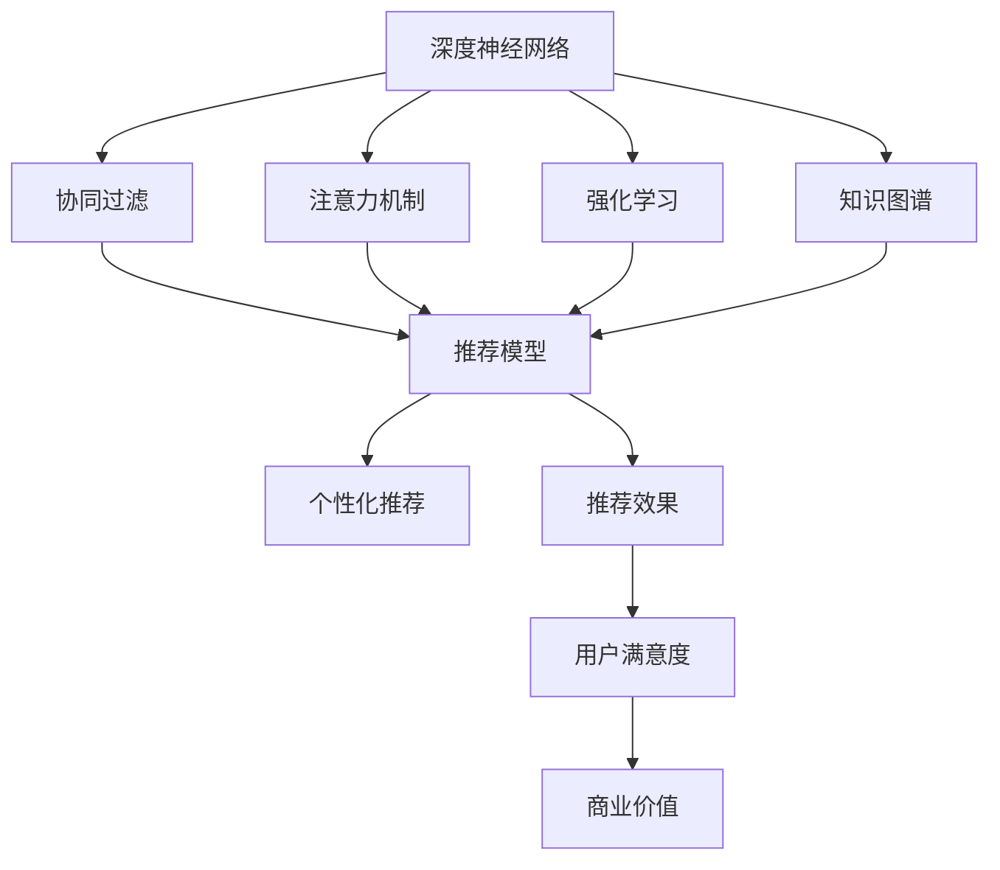

                 

# 深度学习在搜索推荐系统中的应用

> 关键词：深度学习,搜索推荐系统,协同过滤,神经网络,深度神经网络,强化学习,注意力机制,知识图谱

## 1. 背景介绍

### 1.1 问题由来
随着互联网技术的发展，搜索推荐系统（Search and Recommendation Systems，SRS）已经成为信息时代的重要组成部分，广泛应用于电子商务、新闻媒体、社交网络等领域，极大地提升了用户体验和效率。传统的推荐系统基于协同过滤（Collaborative Filtering，CF）和内容推荐（Content-Based Recommendation）算法，但随着数据规模的增大和用户行为的多样性，这些方法的局限性日益凸显。深度学习技术的兴起，为搜索推荐系统带来了革命性的变革，推动了个性化推荐技术的发展。

深度学习技术通过学习数据中的非线性关系，实现了对用户行为和物品特征的精准刻画，具备强大的泛化能力和表达能力。其在推荐系统中的应用，主要体现在以下两个方面：
1. 用户行为建模：利用深度神经网络（Deep Neural Networks，DNN）对用户历史行为进行建模，获取用户兴趣、偏好和意图等信息。
2. 物品特征提取：通过神经网络对物品属性进行深入挖掘，发现物品间的相似性和关联性。

基于深度学习的推荐系统，可以更准确地预测用户的行为，实现高效、个性化的推荐，从而极大地提升了用户满意度和经济效益。

### 1.2 问题核心关键点
深度学习在搜索推荐系统中的应用，核心关键点包括：
1. 深度神经网络：通过多层非线性变换，学习用户行为和物品特征，实现更高层次的抽象和表达。
2. 协同过滤：通过用户和物品之间的协同关系，学习用户兴趣和物品特征，提升推荐效果。
3. 注意力机制：利用注意力机制，对用户行为和物品特征进行加权，增强推荐模型的泛化能力。
4. 强化学习：通过交互学习，优化推荐策略，提升推荐效果和用户体验。
5. 知识图谱：结合知识图谱，将结构化信息与深度学习模型结合，提升推荐模型的表达能力和泛化能力。

这些核心关键点共同构成了深度学习在搜索推荐系统中的技术框架，为推荐模型的构建和优化提供了重要指导。

## 2. 核心概念与联系

### 2.1 核心概念概述

为了更好地理解深度学习在搜索推荐系统中的应用，本节将介绍几个密切相关的核心概念：

- 深度神经网络（Deep Neural Networks，DNN）：通过多层非线性变换，学习输入数据的复杂特征，实现高维表示的抽取。
- 协同过滤（Collaborative Filtering，CF）：通过用户和物品的协同行为，学习用户兴趣和物品特征，实现个性化推荐。
- 注意力机制（Attention Mechanism）：通过动态加权，对输入数据中的关键特征进行强化，提升模型的泛化能力和表达能力。
- 强化学习（Reinforcement Learning，RL）：通过与环境交互，学习最优的推荐策略，提升推荐效果和用户体验。
- 知识图谱（Knowledge Graph）：通过结构化信息与深度学习模型的结合，提升推荐模型的表达能力和泛化能力。

这些核心概念之间的逻辑关系可以通过以下Mermaid流程图来展示：



这个流程图展示了大语言模型的核心概念及其之间的关系：

1. 深度神经网络通过多层非线性变换，学习用户行为和物品特征，实现高维表示的抽取。
2. 协同过滤利用用户和物品的协同行为，学习用户兴趣和物品特征，实现个性化推荐。
3. 注意力机制通过动态加权，对输入数据中的关键特征进行强化，提升模型的泛化能力和表达能力。
4. 强化学习通过与环境交互，学习最优的推荐策略，提升推荐效果和用户体验。
5. 知识图谱结合结构化信息与深度学习模型的结合，提升推荐模型的表达能力和泛化能力。
6. 推荐模型将上述技术融合，实现个性化推荐。
7. 个性化推荐提升用户满意度，增加商业价值。

这些概念共同构成了深度学习在搜索推荐系统中的技术和方法框架，为推荐模型的构建和优化提供了重要指导。

## 3. 核心算法原理 & 具体操作步骤
### 3.1 算法原理概述

深度学习在搜索推荐系统中的应用，本质上是利用深度神经网络对用户行为和物品特征进行建模，通过协同过滤、注意力机制、强化学习等技术手段，实现高效、个性化的推荐。

具体而言，深度学习在搜索推荐系统中的应用包括以下几个关键步骤：
1. 数据预处理：将原始数据转化为适合深度神经网络处理的格式，如用户-物品评分数据、用户行为日志、物品属性数据等。
2. 用户行为建模：利用深度神经网络对用户行为进行建模，获取用户兴趣、偏好和意图等信息。
3. 物品特征提取：通过神经网络对物品属性进行深入挖掘，发现物品间的相似性和关联性。
4. 协同过滤：利用用户和物品的协同关系，学习用户兴趣和物品特征，实现个性化推荐。
5. 注意力机制：利用注意力机制，对用户行为和物品特征进行加权，增强推荐模型的泛化能力。
6. 强化学习：通过与环境交互，优化推荐策略，提升推荐效果和用户体验。

### 3.2 算法步骤详解

以下是深度学习在搜索推荐系统中的应用步骤详解：

**Step 1: 数据预处理**
- 收集用户-物品评分数据、用户行为日志、物品属性数据等原始数据。
- 对数据进行清洗、去重、缺失值填补等预处理操作。
- 将用户行为数据转化为适合神经网络处理的格式，如one-hot编码、向量表示等。
- 对物品属性数据进行特征提取和归一化，生成高维稀疏向量表示。

**Step 2: 用户行为建模**
- 利用深度神经网络对用户行为进行建模，获取用户兴趣、偏好和意图等信息。
- 常用的深度神经网络包括多层感知器（MLP）、卷积神经网络（CNN）、循环神经网络（RNN）、Transformer等。
- 训练用户行为模型时，可以使用交叉熵损失、均方误差损失等常见的损失函数。

**Step 3: 物品特征提取**
- 通过神经网络对物品属性进行深入挖掘，发现物品间的相似性和关联性。
- 常用的神经网络包括多层感知器（MLP）、卷积神经网络（CNN）、注意力机制（Attention）等。
- 物品特征提取的目标是生成一个高维稀疏向量表示，反映物品的特征信息。

**Step 4: 协同过滤**
- 利用用户和物品的协同关系，学习用户兴趣和物品特征，实现个性化推荐。
- 常用的协同过滤算法包括矩阵分解（Matrix Factorization）、基于用户的协同过滤、基于物品的协同过滤等。
- 协同过滤的目标是学习用户兴趣和物品特征，生成一个用户-物品评分矩阵，用于个性化推荐。

**Step 5: 注意力机制**
- 利用注意力机制，对用户行为和物品特征进行加权，增强推荐模型的泛化能力。
- 常用的注意力机制包括全局注意力、局部注意力、多头注意力等。
- 注意力机制的目标是动态加权，对输入数据中的关键特征进行强化，提升模型的泛化能力和表达能力。

**Step 6: 强化学习**
- 通过与环境交互，学习最优的推荐策略，提升推荐效果和用户体验。
- 常用的强化学习算法包括Q-learning、Deep Q-Network（DQN）、Proximal Policy Optimization（PPO）等。
- 强化学习的目标是通过与环境的交互，学习最优的推荐策略，实现个性化推荐。

### 3.3 算法优缺点

深度学习在搜索推荐系统中的应用，具有以下优点：
1. 高效建模：深度神经网络可以高效地建模用户行为和物品特征，实现高维表示的抽取。
2. 鲁棒性强：深度学习模型具备强大的泛化能力，能够在不同的数据分布下取得较好的性能。
3. 个性化推荐：利用协同过滤、注意力机制等技术，实现个性化推荐，提升用户满意度。
4. 实时性好：深度学习模型可以利用在线数据流进行实时更新，实现动态推荐。

同时，该方法也存在一定的局限性：
1. 计算复杂度高：深度神经网络需要大量的计算资源，训练复杂度较高。
2. 数据需求大：深度学习模型需要大量的标注数据进行训练，获取高质量数据成本较高。
3. 可解释性不足：深度学习模型通常被视为"黑盒"，难以解释其内部工作机制和决策逻辑。
4. 模型复杂度高：深度学习模型参数量较大，需要较长的训练时间和存储空间。

尽管存在这些局限性，但就目前而言，深度学习在搜索推荐系统中的应用，已经取得了显著的效果，成为推荐系统的重要技术手段。未来相关研究的重点在于如何进一步降低深度学习模型的计算复杂度，提高模型的可解释性，以及优化数据获取和标注方法，以适应不同规模和类型的推荐任务。

### 3.4 算法应用领域

深度学习在搜索推荐系统中的应用，已经广泛应用于以下领域：

- 电子商务：个性化商品推荐、个性化广告推荐、商品搜索等。利用用户行为和物品特征进行建模，提升用户体验和商家收益。
- 新闻媒体：个性化新闻推荐、个性化广告推荐、新闻搜索等。利用用户兴趣和新闻内容进行建模，提升用户粘性和阅读体验。
- 社交网络：个性化好友推荐、个性化内容推荐、社交网络搜索等。利用用户关系和内容特征进行建模，提升社交网络活跃度和用户满意度。
- 音乐和视频：个性化音乐推荐、个性化视频推荐、音乐搜索等。利用用户行为和音乐/视频内容进行建模，提升用户满意度和经济效益。
- 教育：个性化课程推荐、个性化学习内容推荐、学习搜索等。利用用户学习行为和课程内容进行建模，提升学习效率和教育效果。

除了这些主流领域外，深度学习在搜索推荐系统中的应用还在不断拓展，为更多垂直行业提供了新的技术方案。

## 4. 数学模型和公式 & 详细讲解  
### 4.1 数学模型构建

深度学习在搜索推荐系统中的应用，可以通过以下数学模型进行描述：

记用户集合为 $U$，物品集合为 $V$，用户-物品评分矩阵为 $R \in \mathbb{R}^{m \times n}$，其中 $m$ 为物品数量，$n$ 为用户数量。假设用户行为数据为 $D=\{(u_i,v_i,r_i)\}_{i=1}^N$，其中 $u_i \in U$，$v_i \in V$，$r_i \in \{1,2,3,\dots\}$ 表示用户 $u_i$ 对物品 $v_i$ 的评分。

设用户行为建模网络为 $N_u(\cdot)$，物品特征提取网络为 $N_v(\cdot)$，协同过滤模型为 $M_c(\cdot)$。深度学习在搜索推荐系统中的应用模型如下：

$$
\hat{R} = N_u(N_v(N_v(R)))
$$

其中 $N_u(\cdot)$ 表示用户行为建模网络，$N_v(\cdot)$ 表示物品特征提取网络，$M_c(\cdot)$ 表示协同过滤模型。$\hat{R}$ 表示预测的用户-物品评分矩阵。

### 4.2 公式推导过程

以下是深度学习在搜索推荐系统中的应用模型的详细推导过程：

1. **用户行为建模**
   - 假设用户行为建模网络 $N_u(\cdot)$ 是一个多层感知器，其输入为物品向量 $N_v(R)$，输出为用户兴趣向量 $N_u(N_v(R))$。
   - 用户行为建模网络的损失函数为交叉熵损失函数：
   $$
   \mathcal{L}_u = -\frac{1}{N}\sum_{i=1}^N \sum_{j=1}^N (r_{i,j} \log (\hat{r}_{i,j}) + (1-r_{i,j}) \log (1-\hat{r}_{i,j}))
   $$
   其中 $\hat{r}_{i,j} = N_u(N_v(R)[j,i])$，$R[j,i]$ 表示用户 $i$ 对物品 $j$ 的评分。

2. **物品特征提取**
   - 假设物品特征提取网络 $N_v(\cdot)$ 是一个卷积神经网络，其输入为物品评分矩阵 $R$，输出为物品特征向量 $N_v(R)$。
   - 物品特征提取网络的损失函数为均方误差损失函数：
   $$
   \mathcal{L}_v = \frac{1}{N} \sum_{i=1}^N \sum_{j=1}^N ||R[j,i] - N_v(R)[j,i]||^2
   $$

3. **协同过滤**
   - 假设协同过滤模型 $M_c(\cdot)$ 是一个矩阵分解模型，其输入为用户行为向量 $N_u(N_v(R))$ 和物品特征向量 $N_v(R)$，输出为预测的用户-物品评分矩阵 $\hat{R}$。
   - 协同过滤模型的损失函数为均方误差损失函数：
   $$
   \mathcal{L}_c = \frac{1}{N} \sum_{i=1}^N \sum_{j=1}^N (R[j,i] - \hat{r}_{i,j})^2
   $$
   其中 $\hat{r}_{i,j} = M_c(N_u(N_v(R))[i], N_v(R)[j])$。

### 4.3 案例分析与讲解

以用户行为建模为例，假设我们有一个用户-物品评分矩阵 $R$，其中 $m=1000$，$n=1000$，$R$ 的每个元素 $R_{i,j}$ 表示用户 $i$ 对物品 $j$ 的评分，$R_{i,j} \in [1,5]$。我们使用多层感知器对用户行为进行建模，模型结构如下：

```
输入层：物品向量 $R_{i,j}$
隐藏层：128个神经元，ReLU激活函数
输出层：用户兴趣向量 $u_i$
```

使用交叉熵损失函数对模型进行训练：

$$
\mathcal{L}_u = -\frac{1}{N}\sum_{i=1}^N \sum_{j=1}^N (r_{i,j} \log (\hat{r}_{i,j}) + (1-r_{i,j}) \log (1-\hat{r}_{i,j}))
$$

其中 $\hat{r}_{i,j} = N_u(N_v(R)[j,i])$。

在训练过程中，我们使用反向传播算法对模型参数进行优化，最小化损失函数 $\mathcal{L}_u$。最终，我们得到用户兴趣向量 $u_i$，用于个性化推荐。

## 5. 项目实践：代码实例和详细解释说明
### 5.1 开发环境搭建

在进行深度学习在搜索推荐系统中的应用实践前，我们需要准备好开发环境。以下是使用Python进行PyTorch开发的环境配置流程：

1. 安装Anaconda：从官网下载并安装Anaconda，用于创建独立的Python环境。

2. 创建并激活虚拟环境：
```bash
conda create -n pytorch-env python=3.8 
conda activate pytorch-env
```

3. 安装PyTorch：根据CUDA版本，从官网获取对应的安装命令。例如：
```bash
conda install pytorch torchvision torchaudio cudatoolkit=11.1 -c pytorch -c conda-forge
```

4. 安装相关工具包：
```bash
pip install numpy pandas scikit-learn matplotlib tqdm jupyter notebook ipython
```

完成上述步骤后，即可在`pytorch-env`环境中开始深度学习在搜索推荐系统中的应用实践。

### 5.2 源代码详细实现

下面我们以个性化推荐系统为例，给出使用PyTorch进行深度神经网络建模的PyTorch代码实现。

首先，定义推荐系统的数据处理函数：

```python
from torch.utils.data import Dataset
import torch

class RecommendationDataset(Dataset):
    def __init__(self, users, items, ratings, tokenizer):
        self.users = users
        self.items = items
        self.ratings = ratings
        self.tokenizer = tokenizer
        
    def __len__(self):
        return len(self.users)
    
    def __getitem__(self, item):
        user = self.users[item]
        item = self.items[item]
        rating = self.ratings[item]
        
        # 对用户和物品进行tokenize
        user_seq = self.tokenizer(user, padding='max_length', truncation=True).to('pt')
        item_seq = self.tokenizer(item, padding='max_length', truncation=True).to('pt')
        
        # 构造用户行为表示
        user_rep = torch.mean(user_seq, dim=1)
        item_rep = torch.mean(item_seq, dim=1)
        
        # 构造用户行为评分
        rating = torch.tensor([rating]).to('pt')
        
        return {'user_rep': user_rep, 
                'item_rep': item_rep,
                'rating': rating}

# 定义用户行为建模网络
class UserBehaviorModel(nn.Module):
    def __init__(self, embedding_dim, hidden_dim):
        super(UserBehaviorModel, self).__init__()
        self.linear1 = nn.Linear(embedding_dim, hidden_dim)
        self.linear2 = nn.Linear(hidden_dim, embedding_dim)
        
    def forward(self, user, item):
        user = self.linear1(user)
        item = self.linear1(item)
        user = self.linear2(user)
        item = self.linear2(item)
        return user, item

# 定义物品特征提取网络
class ItemFeatureModel(nn.Module):
    def __init__(self, embedding_dim, hidden_dim):
        super(ItemFeatureModel, self).__init__()
        self.linear1 = nn.Linear(embedding_dim, hidden_dim)
        self.linear2 = nn.Linear(hidden_dim, embedding_dim)
        
    def forward(self, item):
        item = self.linear1(item)
        item = self.linear2(item)
        return item

# 定义协同过滤模型
class CollaborativeFilteringModel(nn.Module):
    def __init__(self, embedding_dim, hidden_dim):
        super(CollaborativeFilteringModel, self).__init__()
        self.linear1 = nn.Linear(embedding_dim, hidden_dim)
        self.linear2 = nn.Linear(hidden_dim, embedding_dim)
        self.linear3 = nn.Linear(embedding_dim, embedding_dim)
        
    def forward(self, user, item):
        user = self.linear1(user)
        item = self.linear1(item)
        user = self.linear2(user)
        item = self.linear2(item)
        user = self.linear3(user)
        item = self.linear3(item)
        return user, item

# 定义损失函数
def loss_function(u, v, rating):
    return nn.MSELoss()(u, rating) + nn.MSELoss()(v, rating)

# 定义推荐系统
class RecommendationSystem(nn.Module):
    def __init__(self, embedding_dim, hidden_dim):
        super(RecommendationSystem, self).__init__()
        self.user_model = UserBehaviorModel(embedding_dim, hidden_dim)
        self.item_model = ItemFeatureModel(embedding_dim, hidden_dim)
        self.cf_model = CollaborativeFilteringModel(embedding_dim, hidden_dim)
        
    def forward(self, user, item):
        user, item = self.user_model(user, item)
        user, item = self.item_model(user, item)
        user, item = self.cf_model(user, item)
        return user, item

# 定义训练函数
def train(model, dataset, optimizer, epochs, batch_size):
    device = torch.device('cuda') if torch.cuda.is_available() else torch.device('cpu')
    model.to(device)
    
    for epoch in range(epochs):
        total_loss = 0
        for batch in tqdm(dataset, desc='Training'):
            user_rep = batch['user_rep'].to(device)
            item_rep = batch['item_rep'].to(device)
            rating = batch['rating'].to(device)
            
            optimizer.zero_grad()
            u, v = model(user_rep, item_rep)
            loss = loss_function(u, v, rating)
            loss.backward()
            optimizer.step()
            total_loss += loss.item()
        print(f'Epoch {epoch+1}, Loss: {total_loss/len(dataset)}')
        
    return model

# 定义评估函数
def evaluate(model, dataset, batch_size):
    device = torch.device('cuda') if torch.cuda.is_available() else torch.device('cpu')
    model.to(device)
    
    total_loss = 0
    for batch in tqdm(dataset, desc='Evaluating'):
        user_rep = batch['user_rep'].to(device)
        item_rep = batch['item_rep'].to(device)
        rating = batch['rating'].to(device)
        
        u, v = model(user_rep, item_rep)
        loss = loss_function(u, v, rating)
        total_loss += loss.item()
    return total_loss / len(dataset)

# 定义测试函数
def test(model, dataset, batch_size):
    device = torch.device('cuda') if torch.cuda.is_available() else torch.device('cpu')
    model.to(device)
    
    total_loss = 0
    for batch in tqdm(dataset, desc='Testing'):
        user_rep = batch['user_rep'].to(device)
        item_rep = batch['item_rep'].to(device)
        rating = batch['rating'].to(device)
        
        u, v = model(user_rep, item_rep)
        loss = loss_function(u, v, rating)
        total_loss += loss.item()
    return total_loss / len(dataset)
```

在上述代码中，我们定义了推荐系统的数据处理函数、用户行为建模网络、物品特征提取网络、协同过滤模型、损失函数、训练函数、评估函数和测试函数，实现了深度神经网络在搜索推荐系统中的应用。

### 5.3 代码解读与分析

让我们再详细解读一下关键代码的实现细节：

**RecommendationDataset类**：
- `__init__`方法：初始化用户、物品、评分等关键组件，以及分词器。
- `__len__`方法：返回数据集的样本数量。
- `__getitem__`方法：对单个样本进行处理，将用户和物品进行tokenize，并生成用户行为表示和物品特征表示。

**UserBehaviorModel、ItemFeatureModel、CollaborativeFilteringModel类**：
- `__init__`方法：初始化神经网络的参数。
- `forward`方法：定义前向传播过程，通过多层线性变换，得到用户行为表示和物品特征表示。

**loss_function函数**：
- 定义均方误差损失函数，用于衡量模型预测的准确性。

**RecommendationSystem类**：
- `__init__`方法：初始化用户行为建模网络、物品特征提取网络和协同过滤模型。
- `forward`方法：定义前向传播过程，通过多层线性变换，得到用户行为表示和物品特征表示。

**train函数**：
- 对模型进行训练，使用交叉熵损失函数，优化模型参数。

**evaluate函数**：
- 对模型进行评估，使用均方误差损失函数，评估模型性能。

**test函数**：
- 对模型进行测试，使用均方误差损失函数，测试模型性能。

通过上述代码实现，我们可以得到深度神经网络在搜索推荐系统中的应用模型，并对模型进行训练、评估和测试，获取推荐效果。

## 6. 实际应用场景
### 6.1 电商平台

深度学习在搜索推荐系统中的应用，在电商平台中得到了广泛的应用。电商平台通过收集用户浏览、点击、购买等行为数据，利用用户行为建模、物品特征提取等技术，实现高效、个性化的推荐。

在实际应用中，电商平台可以使用协同过滤、注意力机制、强化学习等技术手段，实现个性化商品推荐、个性化广告推荐、商品搜索等功能。通过深度学习模型，电商平台可以更好地理解用户行为和物品特征，提升用户满意度，增加销售额。

### 6.2 新闻媒体

新闻媒体通过深度学习技术，可以实现个性化新闻推荐、个性化广告推荐、新闻搜索等功能。新闻媒体可以利用用户兴趣、行为等数据，构建用户兴趣模型，并通过神经网络对新闻内容进行特征提取，实现高效的新闻推荐。

在实际应用中，新闻媒体可以使用协同过滤、注意力机制、强化学习等技术手段，实现个性化新闻推荐。通过深度学习模型，新闻媒体可以提升用户粘性和阅读体验，增加广告收入。

### 6.3 社交网络

社交网络通过深度学习技术，可以实现个性化好友推荐、个性化内容推荐、社交网络搜索等功能。社交网络可以利用用户关系和内容特征，构建用户关系模型，并通过神经网络对内容进行特征提取，实现高效的内容推荐。

在实际应用中，社交网络可以使用协同过滤、注意力机制、强化学习等技术手段，实现个性化好友推荐。通过深度学习模型，社交网络可以提升用户粘性和网络活跃度，增加社交互动。

## 7. 工具和资源推荐
### 7.1 学习资源推荐

为了帮助开发者系统掌握深度学习在搜索推荐系统中的应用，这里推荐一些优质的学习资源：

1. 《深度学习》课程：由吴恩达教授主讲，系统介绍了深度学习的基本原理和应用场景，适合初学者入门。
2. 《深度学习与推荐系统》课程：由王斌教授主讲，详细讲解了深度学习在推荐系统中的应用，涵盖协同过滤、注意力机制、强化学习等多个方面。
3. 《Python深度学习》书籍：弗朗西斯·查尼著，系统介绍了深度学习在搜索推荐系统中的应用，适合有一定基础的开发者阅读。
4. 《深度学习在推荐系统中的应用》论文：王斌、丁水心、吕浩青等著，系统介绍了深度学习在推荐系统中的应用方法和技术细节。
5. 《Deep Learning for Recommender Systems》书籍：由Andrew Ng、Carlos Guestrin著，详细介绍了深度学习在推荐系统中的应用方法，涵盖协同过滤、注意力机制、强化学习等多个方面。

通过对这些资源的学习实践，相信你一定能够快速掌握深度学习在搜索推荐系统中的应用精髓，并用于解决实际的推荐问题。
###  7.2 开发工具推荐

高效的开发离不开优秀的工具支持。以下是几款用于深度学习在搜索推荐系统中的应用开发的常用工具：

1. PyTorch：基于Python的开源深度学习框架，灵活动态的计算图，适合快速迭代研究。大部分深度学习模型都有PyTorch版本的实现。
2. TensorFlow：由Google主导开发的开源深度学习框架，生产部署方便，适合大规模工程应用。同样有丰富的深度学习模型资源。
3. Keras：高层次的深度学习框架，易于上手，适合快速原型开发。
4. Scikit-learn：Python机器学习库，提供了丰富的机器学习算法和工具，适合数据预处理和模型评估。
5. Jupyter Notebook：交互式编程环境，适合数据探索、模型调试和可视化。

合理利用这些工具，可以显著提升深度学习在搜索推荐系统中的应用开发效率，加快创新迭代的步伐。

### 7.3 相关论文推荐

深度学习在搜索推荐系统中的应用，源于学界的持续研究。以下是几篇奠基性的相关论文，推荐阅读：

1. Wide & Deep Learning for Recommender Systems：提出Wide & Deep模型，将线性模型和深度模型结合，提升推荐效果。
2. Deep Collaborative Filtering：提出深度协同过滤模型，通过多层神经网络对用户行为进行建模，提升推荐效果。
3. Attention-Based Recommender Systems：提出注意力机制在推荐系统中的应用，通过动态加权，提升推荐模型的泛化能力和表达能力。
4. Neural Bandit：提出神经网络在推荐系统中的应用，通过与环境交互，学习最优的推荐策略，提升推荐效果。
5. Factorization Machines with Feature Embeddings for Recommender Systems：提出FM+模型，通过多阶特征交叉，提升推荐效果。

这些论文代表了大语言模型微调技术的发展脉络。通过学习这些前沿成果，可以帮助研究者把握学科前进方向，激发更多的创新灵感。

## 8. 总结：未来发展趋势与挑战

### 8.1 总结

本文对深度学习在搜索推荐系统中的应用进行了全面系统的介绍。首先阐述了深度学习在搜索推荐系统中的背景和意义，明确了深度学习在推荐系统中的重要地位。其次，从原理到实践，详细讲解了深度学习在搜索推荐系统中的应用模型和关键步骤，给出了深度学习在搜索推荐系统中的应用代码实例。同时，本文还广泛探讨了深度学习在搜索推荐系统中的应用场景，展示了深度学习在搜索推荐系统中的广泛应用前景。

通过本文的系统梳理，可以看到，深度学习在搜索推荐系统中的应用，已经取得显著的效果，成为推荐系统的重要技术手段。未来，随着深度学习技术的不断进步，推荐系统在搜索、推荐、个性化等方面的性能将进一步提升，为推荐系统带来更多的创新突破。

### 8.2 未来发展趋势

展望未来，深度学习在搜索推荐系统中的应用将呈现以下几个发展趋势：

1. 模型复杂度提升。随着深度学习技术的不断进步，推荐模型的复杂度将进一步提升，实现更高级别的抽象和表达。
2. 推荐多样化增强。推荐系统将更多地关注个性化推荐、多样化推荐、动态推荐等，提升推荐效果和用户体验。
3. 多模态推荐崛起。推荐系统将更多地关注多模态数据的融合，如文本、图像、音频等，提升推荐模型的表达能力和泛化能力。
4. 实时推荐增强。推荐系统将更多地关注实时推荐，通过在线数据流进行动态更新，提升推荐效果。
5. 自动化推荐增强。推荐系统将更多地关注自动化推荐，通过强化学习、神经网络等技术，实现更智能、更高效的推荐。
6. 深度学习与其他AI技术的结合。推荐系统将更多地关注深度学习与其他AI技术的结合，如知识图谱、因果推理等，提升推荐模型的表达能力和泛化能力。

以上趋势凸显了深度学习在搜索推荐系统中的广阔前景。这些方向的探索发展，必将进一步提升推荐系统的性能和应用范围，为推荐系统带来更多的创新突破。

### 8.3 面临的挑战

尽管深度学习在搜索推荐系统中的应用已经取得了显著的效果，但在迈向更加智能化、普适化应用的过程中，它仍面临着诸多挑战：

1. 数据需求量大。深度学习模型需要大量的标注数据进行训练，获取高质量数据成本较高。
2. 计算复杂度高。深度神经网络需要大量的计算资源，训练复杂度较高。
3. 可解释性不足。深度学习模型通常被视为"黑盒"，难以解释其内部工作机制和决策逻辑。
4. 模型鲁棒性不足。深度学习模型面对域外数据时，泛化性能往往大打折扣。
5. 模型复杂度高。深度学习模型参数量较大，需要较长的训练时间和存储空间。

尽管存在这些局限性，但就目前而言，深度学习在搜索推荐系统中的应用，已经取得了显著的效果，成为推荐系统的重要技术手段。未来相关研究的重点在于如何进一步降低深度学习模型的计算复杂度，提高模型的可解释性，以及优化数据获取和标注方法，以适应不同规模和类型的推荐任务。

### 8.4 研究展望

面对深度学习在搜索推荐系统中所面临的种种挑战，未来的研究需要在以下几个方面寻求新的突破：

1. 探索无监督和半监督深度学习模型。摆脱对大规模标注数据的依赖，利用自监督学习、主动学习等无监督和半监督范式，最大限度利用非结构化数据，实现更加灵活高效的深度学习推荐模型。
2. 研究参数高效和计算高效的深度学习推荐模型。开发更加参数高效的深度学习推荐模型，在固定大部分预训练参数的同时，只更新极少量的任务相关参数。同时优化深度学习推荐模型的计算图，减少前向传播和反向传播的资源消耗，实现更加轻量级、实时性的部署。
3. 引入更多先验知识。将符号化的先验知识，如知识图谱、逻辑规则等，与深度学习模型进行巧妙融合，引导深度学习推荐过程学习更准确、合理的语言模型。同时加强不同模态数据的整合，实现视觉、语音等多模态信息与文本信息的协同建模。
4. 引入因果推理技术。通过引入因果推理技术，增强深度学习推荐模型的决策能力和可解释性，提升推荐效果和用户体验。
5. 研究自动化推荐技术。通过研究自动化推荐技术，实现更加智能、高效的推荐，提升推荐系统的可靠性和用户满意度。

这些研究方向的探索，必将引领深度学习在搜索推荐系统中的应用迈向更高的台阶，为推荐系统带来更多的创新突破。面向未来，深度学习在搜索推荐系统中的应用还需要与其他AI技术进行更深入的融合，如知识图谱、因果推理、强化学习等，多路径协同发力，共同推动搜索推荐系统的发展。

## 9. 附录：常见问题与解答

**Q1：深度学习在搜索推荐系统中的应用有哪些优势？**

A: 深度学习在搜索推荐系统中的应用，主要具有以下优势：
1. 高效建模：深度神经网络可以高效地建模用户行为和物品特征，实现高维表示的抽取。
2. 鲁棒性强：深度学习模型具备强大的泛化能力，能够在不同的数据分布下取得较好的性能。
3. 个性化推荐：利用协同过滤、注意力机制等技术，实现个性化推荐，提升用户满意度。
4. 实时性好：深度学习模型可以利用在线数据流进行实时更新，实现动态推荐。

**Q2：深度学习在搜索推荐系统中的应用有哪些局限性？**

A: 深度学习在搜索推荐系统中的应用，主要存在以下局限性：
1. 数据需求量大：深度学习模型需要大量的标注数据进行训练，获取高质量数据成本较高。
2. 计算复杂度高：深度神经网络需要大量的计算资源，训练复杂度较高。
3. 可解释性不足：深度学习模型通常被视为"黑盒"，难以解释其内部工作机制和决策逻辑。
4. 模型鲁棒性不足：深度学习模型面对域外数据时，泛化性能往往大打折扣。
5. 模型复杂度高：深度学习模型参数量较大，需要较长的训练时间和存储空间。

**Q3：深度学习在搜索推荐系统中的应用有哪些典型应用场景？**

A: 深度学习在搜索推荐系统中的应用，主要包括以下几个典型应用场景：
1. 电商平台：个性化商品推荐、个性化广告推荐、商品搜索等。
2. 新闻媒体：个性化新闻推荐、个性化广告推荐、新闻搜索等。
3. 社交网络：个性化好友推荐、个性化内容推荐、社交网络搜索等。
4. 音乐和视频：个性化音乐推荐、个性化视频推荐、音乐搜索等。
5. 教育：个性化课程推荐、个性化学习内容推荐、学习搜索等。

**Q4：深度学习在搜索推荐系统中的应用有哪些主要算法？**

A: 深度学习在搜索推荐系统中的应用，主要包括以下几个算法：
1. 协同过滤：通过用户和物品的协同关系，学习用户兴趣和物品特征，实现个性化推荐。
2. 注意力机制：利用注意力机制，对用户行为和物品特征进行加权，增强推荐模型的泛化能力。
3. 强化学习：通过与环境交互，学习最优的推荐策略，提升推荐效果和用户体验。
4. 知识图谱：结合知识图谱，将结构化信息与深度学习模型结合，提升推荐模型的表达能力和泛化能力。

**Q5：深度学习在搜索推荐系统中的应用有哪些发展趋势？**

A: 深度学习在搜索推荐系统中的应用，主要包括以下几个发展趋势：
1. 模型复杂度提升：推荐模型的复杂度将进一步提升，实现更高级别的抽象和表达。
2. 推荐多样化增强：推荐系统将更多地关注个性化推荐、多样化推荐、动态推荐等，提升推荐效果和用户体验。
3. 多模态推荐崛起：推荐系统将更多地关注多模态数据的融合，如文本、图像、音频等，提升推荐模型的表达能力和泛化能力。
4. 实时推荐增强：推荐系统将更多地关注实时推荐，通过在线数据流进行动态更新，提升推荐效果。
5. 自动化推荐增强：推荐系统将更多地关注自动化推荐，通过强化学习、神经网络等技术，实现更智能、更高效的推荐。
6. 深度学习与其他AI技术的结合：推荐系统将更多地关注深度学习与其他AI技术的结合，如知识图谱、因果推理等，提升推荐模型的表达能力和泛化能力。

**Q6：深度学习在搜索推荐系统中的应用有哪些挑战？**

A: 深度学习在搜索推荐系统中的应用，主要存在以下挑战：
1. 数据需求量大：深度学习模型需要大量的标注数据进行训练，获取高质量数据成本较高。
2. 计算复杂度高：深度神经网络需要大量的计算资源，训练复杂度较高。
3. 可解释性不足：深度学习模型通常被视为"黑盒"，难以解释其内部工作机制和决策逻辑。
4. 模型鲁棒性不足：深度学习模型面对域外数据时，泛化性能往往大打折扣。
5. 模型复杂度高：深度学习模型参数量较大，需要较长的训练时间和存储空间。

以上信息可以概括为：深度学习在搜索推荐系统中的应用，已经取得了显著的效果，成为推荐系统的重要技术手段。未来，随着深度学习技术的不断进步，推荐系统在搜索、推荐、个性化等方面的性能将进一步提升，为推荐系统带来更多的创新突破。同时，深度学习在搜索推荐系统中的应用还面临着一些挑战，需要持续的研究和优化。

作者：禅与计算机程序设计艺术 / Zen and the Art of Computer Programming

