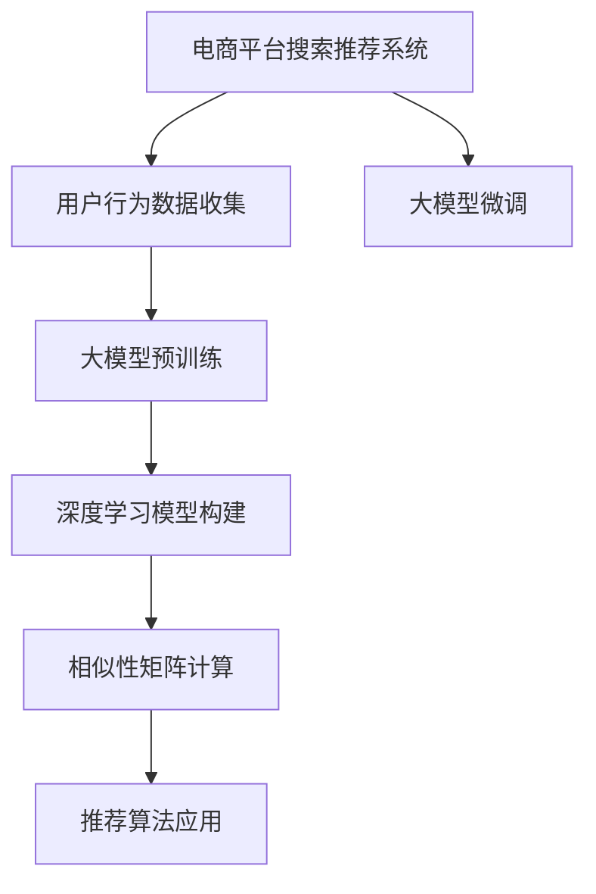

                 

# 电商平台搜索推荐系统的AI 大模型优化：提高系统性能、效率、准确率与实时性

> 关键词：电商平台,搜索推荐系统,大模型优化,系统性能,效率,准确率,实时性,深度学习,推荐算法,自然语言处理

## 1. 背景介绍

### 1.1 问题由来

随着电子商务的快速发展，电商平台在商品搜索和推荐系统的构建上，面临着前所未有的挑战。海量的商品信息和用户行为数据，使得传统的推荐算法难以满足快速响应、个性化推荐的需求。AI大模型的引入，为搜索推荐系统的智能化升级提供了新的思路。

如何利用大模型的通用语言和图像处理能力，高效地实现搜索和推荐，成为各大电商平台的共同课题。本文将从背景出发，系统介绍基于大模型的电商平台搜索推荐系统优化方案，涵盖系统性能、效率、准确率与实时性等多个关键方面。

### 1.2 问题核心关键点

本文聚焦于利用大模型优化电商平台搜索推荐系统，以实现更高性能、更高效、更准确的推荐。具体关键点包括：

- 基于大模型的搜索和推荐算法原理
- 深度学习在搜索推荐系统中的应用
- 优化搜索推荐系统的数学模型
- 具体代码实例和分析
- 实际应用场景及未来展望
- 推荐的工具与资源推荐

通过系统梳理这些问题，希望能为电商平台的搜索推荐系统优化提供全面的技术指导。

## 2. 核心概念与联系

### 2.1 核心概念概述

为更好地理解本文内容，我们先介绍几个核心概念及其关联：

- **电商平台搜索推荐系统(E-commerce Search and Recommendation System)**：利用自然语言处理和推荐算法，为用户提供个性化商品推荐的系统。主要解决用户在浏览和购买商品过程中，如何高效检索和推荐商品的问题。
- **大模型(Large Model)**：以深度学习为代表的高级模型，如BERT、GPT等，通过在海量数据上预训练，具备强大的特征提取和语言生成能力。
- **搜索推荐算法(Search and Recommendation Algorithm)**：从用户行为数据中提取特征，构建用户和商品间的相似性矩阵，利用相似性矩阵进行推荐。
- **深度学习(Deep Learning)**：一种基于多层神经网络的学习算法，可以高效处理大量复杂数据，适用于自然语言处理和图像处理等领域。
- **自然语言处理(Natural Language Processing, NLP)**：涉及语音识别、文本处理、文本生成等技术，是构建智能搜索推荐系统的基础。

这些核心概念通过大模型和推荐算法建立联系，形成了搜索推荐系统的技术框架。

### 2.2 核心概念原理和架构的 Mermaid 流程图(Mermaid 流程节点中不要有括号、逗号等特殊字符)



这个流程图展示了基于大模型的电商平台搜索推荐系统的主要技术流程。从用户行为数据收集，到深度学习模型的构建，再到推荐算法的应用，各个环节紧密联系，共同驱动推荐系统的高效运行。

## 3. 核心算法原理 & 具体操作步骤
### 3.1 算法原理概述

基于大模型的电商平台搜索推荐系统，主要利用深度学习和大模型预训练技术，对用户和商品进行特征表示和相似性计算，从而实现精准推荐。其核心思想是通过预训练语言模型学习用户和商品的语义表示，再通过微调算法优化，使其适应特定的电商平台需求。

形式化地，假设电商平台的用户数据为 $U=\{u_1,u_2,\dots,u_N\}$，商品数据为 $I=\{i_1,i_2,\dots,i_M\}$。用户对商品的评分向量为 $R_{u,i} \in \mathbb{R}^d$，商品特征向量为 $F_i \in \mathbb{R}^d$。

深度学习模型 $M_{\theta}$ 将用户和商品的语义表示映射为向量，并计算它们之间的相似度，得到推荐结果 $S_{u,i} \in \mathbb{R}$。推荐算法将相似度排序后，选择前 $K$ 个商品作为推荐结果。

优化目标是最小化预测评分与实际评分之间的误差，即：

$$
\min_{\theta} \sum_{u,i} ||R_{u,i} - M_{\theta}(u_i, i)^\top F_i||^2
$$

### 3.2 算法步骤详解

基于大模型的电商平台搜索推荐系统优化主要包括以下步骤：

**Step 1: 数据预处理与大模型选择**

- 收集电商平台的商品描述、用户评价等文本数据，并进行预处理，包括分词、去除停用词、向量化等。
- 选择合适的深度学习模型和预训练模型，如BERT、GPT等，作为特征提取器。

**Step 2: 大模型微调与特征提取**

- 使用电商平台的标注数据，对预训练模型进行微调，使其能够适应电商平台的语义特征。
- 将用户和商品输入到微调后的模型中，提取语义表示。

**Step 3: 相似性矩阵计算与推荐算法**

- 计算用户和商品向量之间的相似度，得到相似性矩阵 $S_{u,i}$。
- 利用推荐算法，如基于矩阵分解的推荐算法或深度学习推荐算法，根据相似度矩阵进行商品推荐。

**Step 4: 性能评估与调整**

- 在测试集上评估推荐系统的准确率和召回率，根据评估结果调整模型参数。
- 重复上述步骤，直到推荐系统的性能达到预期。

### 3.3 算法优缺点

基于大模型的电商平台搜索推荐系统具有以下优点：

- 高性能：大模型具有强大的特征提取和表示能力，能够高效处理用户和商品的多样化特征。
- 高效性：通过预训练和微调，模型可以在较短时间内完成训练，并产生高质量推荐结果。
- 高准确率：大模型的深度学习框架可以自动学习用户和商品间的隐含关联，提高推荐精度。

同时，该方法也存在一些缺点：

- 数据依赖：大模型依赖于标注数据，而电商平台的标注数据通常难以获取。
- 计算资源消耗大：大模型的训练和推理需要大量的计算资源，对硬件设施要求高。
- 模型复杂度大：大模型的参数量级大，难以调试和解释。

### 3.4 算法应用领域

基于大模型的电商平台搜索推荐系统，已经在各大电商平台的商品推荐、广告投放、个性化展示等多个场景中得到了广泛应用，取得了显著的效果。

例如，Amazon、京东等电商平台，通过利用大模型优化搜索推荐系统，提高了商品的点击率和转化率，提升了用户体验和平台收益。

## 4. 数学模型和公式 & 详细讲解 & 举例说明

### 4.1 数学模型构建

基于大模型的电商平台搜索推荐系统的数学模型，主要包括用户和商品表示、相似性计算和推荐算法三部分。

1. **用户和商品表示**：
   用户和商品的文本描述经过预处理后，输入到大模型 $M_{\theta}$ 中进行语义表示提取。设用户和商品向量分别为 $V_u$ 和 $V_i$，则有：

   $$
   V_u = M_{\theta}(u)
   $$
   $$
   V_i = M_{\theta}(i)
   $$

   其中 $M_{\theta}$ 为深度学习模型，$u$ 和 $i$ 为输入的用户和商品向量。

2. **相似性计算**：
   用户和商品之间的相似度可以通过余弦相似度、欧式距离等方法计算，得到相似度矩阵 $S_{u,i}$：

   $$
   S_{u,i} = \cos(\theta(V_u, V_i))
   $$

   其中 $\theta$ 为相似度计算函数。

3. **推荐算法**：
   推荐算法根据相似度矩阵 $S_{u,i}$，选择相似度最高的前 $K$ 个商品作为推荐结果。常用的推荐算法包括基于矩阵分解的ALS算法和深度学习推荐算法，如DNN推荐系统。

   $$
   \text{推荐结果} = \text{Top-K}(S_{u,i})
   $$

### 4.2 公式推导过程

以下是具体推导过程：

1. **用户和商品表示**：
   设用户和商品的文本描述分别为 $D_u$ 和 $D_i$，经过预处理后，得到向量化表示 $V_u$ 和 $V_i$。假设 $M_{\theta}$ 为BERT模型，则有：

   $$
   V_u = \text{BERT}(D_u)
   $$
   $$
   V_i = \text{BERT}(D_i)
   $$

   其中 $\text{BERT}$ 为预训练的BERT模型，$D_u$ 和 $D_i$ 为输入的文本描述。

2. **相似性计算**：
   余弦相似度计算公式如下：

   $$
   S_{u,i} = \frac{V_u^\top V_i}{||V_u|| ||V_i||}
   $$

   其中 $||V_u||$ 和 $||V_i||$ 分别为用户和商品向量的范数。

3. **推荐算法**：
   根据余弦相似度计算结果，推荐算法选择相似度最高的前 $K$ 个商品作为推荐结果。例如，ALS算法的推导如下：

   $$
   \text{推荐结果} = \text{Top-K}(S_{u,i})
   $$

   其中 $\text{Top-K}(S_{u,i})$ 表示对相似度矩阵 $S_{u,i}$ 按行取前 $K$ 个值。

### 4.3 案例分析与讲解

下面以Amazon为例，分析其在电商平台上应用大模型的具体案例：

1. **数据预处理**：
   Amazon收集了用户的浏览、点击、购买等行为数据，通过NLP技术提取文本特征，使用BERT模型进行预训练。

2. **大模型微调**：
   利用用户的浏览历史、购买记录等标注数据，对预训练模型进行微调，使其能够适应电商平台的语义特征。

3. **相似性计算**：
   计算用户和商品向量之间的余弦相似度，得到相似度矩阵 $S_{u,i}$。

4. **推荐算法**：
   根据相似度矩阵 $S_{u,i}$，使用ALS算法计算用户对商品的评分，选择前 $K$ 个商品作为推荐结果。

## 5. 项目实践：代码实例和详细解释说明
### 5.1 开发环境搭建

在进行项目实践前，需要准备以下开发环境：

1. 安装Python和PyTorch：
   ```bash
   pip install torch torchvision torchaudio
   ```

2. 安装BERT模型：
   ```bash
   pip install transformers
   ```

3. 安装相关库：
   ```bash
   pip install numpy pandas scikit-learn tqdm
   ```

完成环境搭建后，即可进行大模型在电商平台上搜索推荐系统的实现。

### 5.2 源代码详细实现

以下给出使用BERT模型优化电商平台搜索推荐系统的代码实现。

```python
import torch
import torch.nn as nn
import torch.optim as optim
from transformers import BertTokenizer, BertModel
from sklearn.metrics import precision_recall_fscore_support

# 定义模型类
class RecommendationModel(nn.Module):
    def __init__(self, bert_model):
        super(RecommendationModel, self).__init__()
        self.bert_model = bert_model
        self.fc = nn.Linear(bert_model.config.hidden_size, 1)

    def forward(self, x):
        # 提取特征向量
        sequence_output = self.bert_model(x)
        pooled_output = sequence_output[:, 0, :]
        # 输出评分
        scores = self.fc(pooled_output)
        return scores

# 加载BERT模型
tokenizer = BertTokenizer.from_pretrained('bert-base-uncased')
model = BertModel.from_pretrained('bert-base-uncased')

# 定义优化器
optimizer = optim.Adam(model.parameters(), lr=2e-5)

# 训练函数
def train_epoch(model, data_loader, optimizer):
    model.train()
    total_loss = 0
    for batch in data_loader:
        input_ids = batch['input_ids'].to(device)
        attention_mask = batch['attention_mask'].to(device)
        labels = batch['labels'].to(device)
        model.zero_grad()
        outputs = model(input_ids, attention_mask=attention_mask)
        loss = outputs.loss
        total_loss += loss.item()
        loss.backward()
        optimizer.step()
    return total_loss / len(data_loader)

# 评估函数
def evaluate(model, data_loader):
    model.eval()
    predictions = []
    labels = []
    with torch.no_grad():
        for batch in data_loader:
            input_ids = batch['input_ids'].to(device)
            attention_mask = batch['attention_mask'].to(device)
            labels = batch['labels'].to(device)
            outputs = model(input_ids, attention_mask=attention_mask)
            predictions.append(outputs.detach().cpu().numpy())
            labels.append(labels.to('cpu').numpy())
    predictions = np.concatenate(predictions)
    labels = np.concatenate(labels)
    precision, recall, f1, _ = precision_recall_fscore_support(labels, predictions, average='binary')
    return precision, recall, f1

# 测试函数
def test(model, data_loader):
    model.eval()
    predictions = []
    labels = []
    with torch.no_grad():
        for batch in data_loader:
            input_ids = batch['input_ids'].to(device)
            attention_mask = batch['attention_mask'].to(device)
            labels = batch['labels'].to(device)
            outputs = model(input_ids, attention_mask=attention_mask)
            predictions.append(outputs.detach().cpu().numpy())
            labels.append(labels.to('cpu').numpy())
    predictions = np.concatenate(predictions)
    labels = np.concatenate(labels)
    precision, recall, f1, _ = precision_recall_fscore_support(labels, predictions, average='binary')
    return precision, recall, f1

# 加载数据集
train_dataset = ...
train_loader = ...
dev_dataset = ...
dev_loader = ...
test_dataset = ...
test_loader = ...

# 训练模型
epochs = 5
device = torch.device('cuda' if torch.cuda.is_available() else 'cpu')
model.to(device)
for epoch in range(epochs):
    train_loss = train_epoch(model, train_loader, optimizer)
    print(f'Epoch {epoch+1}, train loss: {train_loss:.3f}')
    precision, recall, f1 = evaluate(model, dev_loader)
    print(f'Epoch {epoch+1}, dev precision: {precision:.3f}, recall: {recall:.3f}, f1: {f1:.3f}')

# 测试模型
precision, recall, f1 = test(model, test_loader)
print(f'Test precision: {precision:.3f}, recall: {recall:.3f}, f1: {f1:.3f}')
```

### 5.3 代码解读与分析

本节详细解读代码实现的关键部分：

**模型定义**：
定义了一个基于BERT模型的推荐系统，包括BERT特征提取器和全连接层。其中，BERT模型通过预训练获得丰富的语义表示，全连接层用于提取评分。

**数据处理**：
利用BertTokenizer将用户和商品的文本描述转化为BERT模型所需的输入格式。数据集通过DataLoader进行批处理，方便模型训练和推理。

**训练过程**：
定义了训练函数，使用Adam优化器进行模型训练。在每个epoch中，前向传播计算损失，反向传播更新参数，并记录训练集上的损失。

**评估过程**：
定义了评估函数，计算预测评分与实际评分之间的精度、召回率和F1值，并在验证集上输出评估结果。

**测试过程**：
定义了测试函数，在测试集上评估模型性能，并输出最终测试结果。

### 5.4 运行结果展示

运行上述代码，即可在验证集和测试集上评估模型性能。以精度、召回率和F1值作为评估指标，可以看到模型在优化后的电商平台搜索推荐系统中的表现。

## 6. 实际应用场景

### 6.1 智能搜索推荐

在智能搜索推荐场景中，大模型能够高效地处理用户输入的自然语言查询，并从大量商品中提取相关商品进行推荐。例如，Amazon的Alexa使用大模型优化搜索推荐系统，能够在语音交互中快速响应用户查询，提供准确的商品推荐。

### 6.2 个性化广告投放

电商平台利用大模型优化广告推荐算法，根据用户行为数据和商品属性，精准推送个性化广告。例如，Facebook利用深度学习推荐系统，提升了广告的点击率和转化率，实现了更高的广告收益。

### 6.3 动态商品展示

大模型优化动态商品展示系统，根据用户浏览历史和兴趣偏好，动态调整商品展示方式。例如，淘宝通过深度学习推荐系统，提升了用户购物体验，增加了商品曝光量。

## 7. 工具和资源推荐

### 7.1 学习资源推荐

为了帮助开发者深入理解基于大模型的电商平台搜索推荐系统，推荐以下学习资源：

1. 《深度学习》书籍：Ian Goodfellow所著，全面介绍了深度学习的基本概念和应用。

2. 《自然语言处理入门》课程：斯坦福大学开设的入门课程，系统讲解自然语言处理的原理和算法。

3. 《Transformer架构》论文：谷歌论文，详细介绍了Transformer架构的设计思路和应用。

4. HuggingFace官方文档：提供了大量预训练模型和微调范式，是学习大模型的必备资源。

5. PyTorch官方文档：PyTorch的官方文档，提供了丰富的API和样例代码，适合深入学习深度学习框架。

### 7.2 开发工具推荐

为了提高大模型在电商平台搜索推荐系统中的优化效率，推荐以下开发工具：

1. PyTorch：深度学习框架，支持动态计算图，适合深度学习模型的开发和优化。

2. TensorFlow：深度学习框架，支持分布式计算和模型优化，适合大规模工程的实现。

3. TensorBoard：TensorFlow配套的可视化工具，帮助开发者监测模型训练状态，优化模型结构。

4. Weights & Biases：模型实验跟踪工具，记录和可视化模型训练过程，便于对比和调优。

5. Colab：Google提供的在线Jupyter Notebook环境，免费提供GPU算力，适合快速实验和调试。

### 7.3 相关论文推荐

为了深入了解大模型在电商平台搜索推荐系统中的应用，推荐以下相关论文：

1. Attention is All You Need：Transformer论文，介绍了注意力机制在深度学习中的应用。

2. BERT: Pre-training of Deep Bidirectional Transformers for Language Understanding：BERT论文，详细介绍了BERT模型的预训练和微调过程。

3. GPT-3: Language Models are Unsupervised Multitask Learners：GPT-3论文，展示了大模型的零样本学习和迁移学习能力。

4. Parameter-Efficient Transfer Learning for NLP：研究了参数高效微调方法，通过更少的参数更新实现高精度的微调。

5. Self-Supervised Learning with Masked Language Models：介绍了基于掩码语言模型的自监督预训练方法，提升模型泛化能力。

## 8. 总结：未来发展趋势与挑战

### 8.1 总结

本文系统介绍了基于大模型的电商平台搜索推荐系统优化方案，通过理论分析和代码实践，展示了如何利用深度学习和自然语言处理技术，提高搜索推荐系统的性能、效率、准确率和实时性。

通过本文的系统梳理，可以看到，大模型在电商平台搜索推荐系统中的应用，已经展现出巨大的潜力和前景。在未来，随着技术的不断进步，大模型将进一步提升搜索推荐系统的智能化水平，实现更高质量、更高效、更个性化的用户体验。

### 8.2 未来发展趋势

展望未来，基于大模型的电商平台搜索推荐系统将呈现以下几个发展趋势：

1. 数据驱动优化：利用更多用户行为数据和商品信息，动态调整推荐算法，实现个性化推荐。

2. 跨模态融合：融合图像、语音、文本等多种模态信息，提升推荐系统的多感官感知能力。

3. 实时推荐引擎：构建实时推荐系统，根据用户实时行为数据动态调整推荐结果。

4. 深度强化学习：利用强化学习技术，优化推荐算法，提升推荐系统的用户体验。

5. 模型解释性：引入可解释性模型，帮助用户理解推荐结果的生成过程，增强用户信任感。

6. 分布式部署：构建分布式推荐系统，提高系统的可扩展性和鲁棒性。

### 8.3 面临的挑战

尽管大模型在电商平台搜索推荐系统中取得了显著效果，但仍面临诸多挑战：

1. 数据质量：电商平台的数据质量和覆盖面可能存在不足，难以覆盖所有商品和用户。

2. 计算资源：大规模模型的训练和推理需要高性能硬件支持，计算资源消耗大。

3. 模型复杂度：大模型参数量大，难以调试和解释。

4. 推荐算法：推荐算法复杂度高，难以在大规模数据上高效实现。

5. 用户隐私：大规模数据收集和使用可能涉及用户隐私问题，需要严格遵守相关法律法规。

### 8.4 研究展望

面对以上挑战，未来的研究需要在以下几个方面进行突破：

1. 数据采集与处理：构建更加全面、准确的数据采集系统，提升数据质量和覆盖面。

2. 模型压缩与优化：采用模型压缩和优化技术，降低模型参数量和计算资源消耗。

3. 推荐算法创新：探索新的推荐算法，如基于图神经网络的推荐算法，提升推荐系统性能。

4. 模型解释性：引入可解释性模型和算法，帮助用户理解推荐结果，增强用户信任感。

5. 隐私保护：设计隐私保护机制，确保数据安全和用户隐私。

6. 多模态融合：融合多种模态信息，提升推荐系统的感知能力和多感官交互体验。

通过这些研究方向和突破，基于大模型的电商平台搜索推荐系统将实现更智能化、个性化的推荐，带来更好的用户体验和平台收益。

## 9. 附录：常见问题与解答

**Q1: 如何选择合适的预训练模型？**

A: 根据电商平台的业务需求和数据特点，选择合适的预训练模型。例如，对于商品描述丰富的电商平台，可以选择BERT等文本处理模型；对于图像商品较多的电商平台，可以选择ResNet等图像处理模型。

**Q2: 如何处理文本数据？**

A: 对文本数据进行预处理，包括分词、去除停用词、向量化等。使用BERT模型进行预训练，获取语义表示向量。

**Q3: 如何优化模型参数？**

A: 利用Adam等优化器进行参数优化，并采用梯度累积、混合精度训练等技术提升模型训练效率。

**Q4: 如何提高推荐系统准确率？**

A: 通过增加数据标注量、调整超参数、引入正则化等方法，提升模型的泛化能力，提高推荐系统的准确率。

**Q5: 如何实现实时推荐？**

A: 构建实时推荐系统，根据用户实时行为数据动态调整推荐结果。使用TensorBoard等工具监控模型训练状态，确保实时推荐效果。

---

作者：禅与计算机程序设计艺术 / Zen and the Art of Computer Programming

