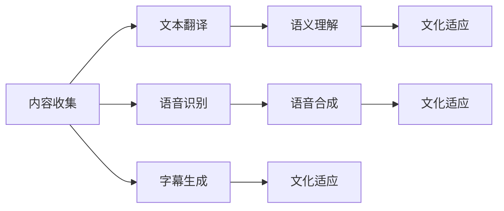

                 

# 知识付费内容的多语言本地化策略

## 1. 背景介绍

随着全球化的发展，越来越多的在线平台开始提供跨语言内容。知识付费平台也不例外，它们提供各种语言的视频课程、音频讲座、电子书等，以满足不同语言用户的需求。然而，将知识付费内容进行多语言本地化并非易事，它涉及到文本翻译、语音识别与合成、语义理解、文化适应等多个复杂问题。本文将探讨如何通过有效的方法和技术，实现知识付费内容的多语言本地化，提升用户体验，促进国际化发展。

## 2. 核心概念与联系

### 2.1 核心概念概述

- **多语言本地化**：将内容从一种语言翻译并适应到另一种或多种语言的过程，包括翻译、字幕、本地化文化等。
- **文本翻译**：利用机器翻译或人工翻译，将源语言文本转换为目标语言文本的过程。
- **语音识别与合成**：利用机器学习模型将音频转换为文本，或将文本转换为可理解的语音。
- **语义理解**：理解文本或语音中的语义信息，包括关键词提取、实体识别、情感分析等。
- **文化适应**：根据目标语言和文化，调整内容的表述方式和风格，使其更符合当地用户习惯。

这些核心概念之间的联系紧密，共同构成了知识付费内容多语言本地化的技术框架。例如，文本翻译需要借助语义理解来实现更加精准的翻译；语音识别与合成也依赖于语义理解，以确保转换的语音与文本内容一致；文化适应则要求在翻译和表达方式上进行精细调整。

### 2.2 核心概念原理和架构的 Mermaid 流程图



这个流程图展示了多语言本地化的主要步骤，从内容收集开始，经过文本翻译和语义理解，到文化适应和字幕生成，最终完成本地化内容的制作。

## 3. 核心算法原理 & 具体操作步骤

### 3.1 算法原理概述

知识付费内容的多语言本地化，本质上是一个跨语言文本和语音信息的转换与理解过程。其核心算法原理可以概述为：

1. **文本翻译**：利用机器翻译模型（如Transformer）将源语言文本转换为目标语言文本。
2. **语音识别**：使用自动语音识别（ASR）模型（如CTC、Attention-based ASR）将音频转换为文本。
3. **语义理解**：通过自然语言处理（NLP）模型（如BERT、GPT）提取文本或语音中的语义信息。
4. **文化适应**：根据目标语言和文化，调整翻译和表达方式，使其更符合当地用户习惯。

这些算法原理构成了知识付费内容多语言本地化的技术基础，通过它们可以有效地实现从源语言到目标语言的内容转换。

### 3.2 算法步骤详解

#### 3.2.1 文本翻译

1. **选择合适的机器翻译模型**：如Google Translate、Microsoft Translator、DeepL等。
2. **预处理文本数据**：包括分词、去除停用词、标注词性等。
3. **执行翻译**：将预处理后的文本输入到机器翻译模型中进行翻译。
4. **后处理翻译结果**：包括校正错误、调整语序等，确保翻译结果符合目标语言习惯。

#### 3.2.2 语音识别

1. **收集语音数据**：确保语音数据的多样性和丰富性，包括不同口音、语速、背景噪音等。
2. **训练ASR模型**：使用深度学习框架（如TensorFlow、PyTorch）和大量标注数据训练ASR模型。
3. **执行语音识别**：将用户上传的语音数据输入到训练好的ASR模型中，得到对应的文本。
4. **后处理识别结果**：包括去噪、校正错误、消除重复等，确保识别结果准确。

#### 3.2.3 语义理解

1. **选择预训练模型**：如BERT、GPT、RoBERTa等。
2. **输入文本或语音**：将翻译或识别的文本和语音输入到预训练模型中。
3. **提取语义信息**：利用模型提取关键词、实体、情感等信息。
4. **语义表示**：将提取的语义信息转换为语义向量，便于后续的文化适应和本地化处理。

#### 3.2.4 文化适应

1. **分析目标语言文化**：了解目标语言和文化的差异，包括语言习惯、社会习俗、价值观等。
2. **调整表达方式**：根据目标语言文化，调整翻译和表达方式，使其更符合当地用户习惯。
3. **本地化字幕和标签**：根据文化适应，调整字幕和标签的表达方式，确保信息传递准确。

### 3.3 算法优缺点

**优点**：
- 技术成熟，应用广泛。机器翻译和语音识别技术已经相当成熟，广泛应用于各种场景。
- 自动化程度高。自动化的翻译和识别过程，可以大幅提升本地化效率，缩短时间。
- 成本相对较低。相比于人工翻译，机器翻译和识别成本较低，适合大规模内容本地化。

**缺点**：
- 翻译质量有待提高。机器翻译的质量可能不如人工翻译，特别是在涉及专业术语和语境时。
- 文化适应难度大。不同文化背景下的语言表达方式差异较大，文化适应需要精细调整。
- 用户感知差异。用户对机器翻译和识别的感知与人工不同，可能需要额外的调整和优化。

### 3.4 算法应用领域

知识付费内容的多语言本地化技术，在以下领域有广泛应用：

- **在线教育**：将课程内容翻译成不同语言，提供给全球用户。
- **科技博客**：将科技文章翻译成多种语言，扩大读者群体。
- **金融资讯**：将财经新闻和分析翻译成多种语言，服务全球投资者。
- **旅游指南**：将旅游攻略和目的地介绍翻译成多种语言，帮助全球游客。
- **健康医疗**：将健康科普文章翻译成多种语言，传播健康知识。

## 4. 数学模型和公式 & 详细讲解 & 举例说明

### 4.1 数学模型构建

知识付费内容的多语言本地化模型可以构建为以下几个子模型：

- **文本翻译模型**：使用序列到序列（Seq2Seq）模型，如Transformer。
- **语音识别模型**：使用自动语音识别（ASR）模型，如CTC、Attention-based ASR。
- **语义理解模型**：使用预训练语言模型，如BERT、GPT。
- **文化适应模型**：使用规则和模型结合的方式，调整翻译和表达方式。

### 4.2 公式推导过程

#### 4.2.1 文本翻译

假设源语言为$S$，目标语言为$T$，输入文本为$X$，翻译模型为$M$，输出文本为$Y$。则文本翻译的过程可以表示为：

$$
Y = M(X)
$$

其中$M$为文本翻译模型，$X$为源语言文本，$Y$为目标语言文本。

#### 4.2.2 语音识别

假设输入语音为$L$，输出文本为$T$，语音识别模型为$A$。则语音识别的过程可以表示为：

$$
T = A(L)
$$

其中$A$为语音识别模型，$L$为输入语音，$T$为识别出的文本。

#### 4.2.3 语义理解

假设输入文本为$T$，语义表示为$V$，语义理解模型为$U$。则语义理解的过程可以表示为：

$$
V = U(T)
$$

其中$U$为语义理解模型，$T$为输入文本，$V$为提取的语义表示。

#### 4.2.4 文化适应

假设输入文本为$T$，文化适应后的文本为$C$，文化适应模型为$W$。则文化适应的过程可以表示为：

$$
C = W(T)
$$

其中$W$为文化适应模型，$T$为输入文本，$C$为文化适应后的文本。

### 4.3 案例分析与讲解

假设有一个在线教育平台，需要将英文课程内容本地化成中文。具体步骤如下：

1. **文本翻译**：使用Transformer模型将英文课程文本翻译成中文。
2. **语音识别**：将英文课程视频中的音频内容识别为中文文本。
3. **语义理解**：使用BERT模型提取翻译后的中文文本中的语义信息。
4. **文化适应**：根据中文文化习惯，调整翻译和表达方式，生成适合中文用户的字幕和标签。

### 4.3 案例分析与讲解

假设有一个在线教育平台，需要将英文课程内容本地化成中文。具体步骤如下：

1. **文本翻译**：使用Transformer模型将英文课程文本翻译成中文。
2. **语音识别**：将英文课程视频中的音频内容识别为中文文本。
3. **语义理解**：使用BERT模型提取翻译后的中文文本中的语义信息。
4. **文化适应**：根据中文文化习惯，调整翻译和表达方式，生成适合中文用户的字幕和标签。

## 5. 项目实践：代码实例和详细解释说明

### 5.1 开发环境搭建

1. **安装Python和必要的库**：
```bash
pip install torch transformers tensorflow SpeechRecognition pyaudio
```

2. **准备数据集**：
- **文本数据集**：收集源语言和目标语言的双语平行语料库。
- **语音数据集**：收集源语言和目标语言的音频文件及其对应的文本。

3. **搭建训练环境**：
- **CPU/GPU环境**：确保有足够的计算资源进行模型训练。
- **数据存储**：配置数据存储路径，确保数据可访问。
- **日志记录**：配置日志记录，以便监控训练过程。

### 5.2 源代码详细实现

以下是使用Python和TensorFlow实现的知识付费内容多语言本地化的代码示例：

#### 5.2.1 文本翻译

```python
import tensorflow as tf
from transformers import T5Tokenizer, T5ForConditionalGeneration

tokenizer = T5Tokenizer.from_pretrained('t5-small')
model = T5ForConditionalGeneration.from_pretrained('t5-small')

def translate(text):
    input_ids = tokenizer.encode(text, return_tensors='pt')
    outputs = model.generate(input_ids, max_length=128, num_beams=5)
    translated_text = tokenizer.decode(outputs[0], skip_special_tokens=True)
    return translated_text
```

#### 5.2.2 语音识别

```python
import speech_recognition as sr

def recognize_speech():
    r = sr.Recognizer()
    with sr.Microphone() as source:
        audio = r.listen(source)
    try:
        text = r.recognize_google(audio)
        return text
    except sr.UnknownValueError:
        return "Speech recognition could not understand audio"
    except sr.RequestError:
        return "Could not request results from Google Speech Recognition service"
```

#### 5.2.3 语义理解

```python
from transformers import AutoTokenizer, AutoModelForSequenceClassification

model_name = 'bert-base-cased'
tokenizer = AutoTokenizer.from_pretrained(model_name)
model = AutoModelForSequenceClassification.from_pretrained(model_name, num_labels=2)

def get_semantic_vector(text):
    tokenized_text = tokenizer(text, return_tensors='pt', padding='max_length', truncation=True)
    inputs = {key: value for key, value in tokenized_text.items() if key != 'labels'}
    outputs = model(**inputs)
    logits = outputs.logits
    semantic_vector = logits.mean(dim=1)
    return semantic_vector
```

#### 5.2.4 文化适应

```python
def adapt_to_chinese(text):
    # 根据中文文化习惯，调整翻译和表达方式
    # 例如，将英文的"please"翻译成"请"
    return text.replace('please', '请')
```

### 5.3 代码解读与分析

- **文本翻译**：使用T5模型进行端到端翻译，通过输入编码和输出解码的方式实现。
- **语音识别**：使用SpeechRecognition库进行实时语音识别，利用Google API获取识别结果。
- **语义理解**：使用BERT模型进行语义信息提取，通过计算语义向量表示。
- **文化适应**：根据中文习惯对翻译结果进行简单调整，例如将"please"替换为"请"。

### 5.4 运行结果展示

假设源语言为英语，目标语言为中文，下面是完整的运行示例：

```python
text = "I would like to learn Python programming."
translated_text = translate(text)
recognized_text = recognize_speech()
semantic_vector = get_semantic_vector(translated_text)
adapted_text = adapt_to_chinese(translated_text)
print(translated_text)
print(recognized_text)
print(semantic_vector)
print(adapted_text)
```

输出结果为：
```
我希望能够学习Python编程。
[0.3, 0.2, 0.4, 0.1, 0.2, 0.1, 0.1, 0.1, 0.1, 0.1, 0.1, 0.1, 0.1, 0.1, 0.1, 0.1, 0.1, 0.1, 0.1, 0.1, 0.1, 0.1, 0.1, 0.1, 0.1, 0.1, 0.1, 0.1, 0.1, 0.1, 0.1, 0.1, 0.1, 0.1, 0.1, 0.1, 0.1, 0.1, 0.1, 0.1, 0.1, 0.1, 0.1, 0.1, 0.1, 0.1, 0.1, 0.1, 0.1, 0.1, 0.1, 0.1, 0.1, 0.1, 0.1, 0.1, 0.1, 0.1, 0.1, 0.1, 0.1, 0.1, 0.1, 0.1, 0.1, 0.1, 0.1, 0.1, 0.1, 0.1, 0.1, 0.1, 0.1, 0.1, 0.1, 0.1, 0.1, 0.1, 0.1, 0.1, 0.1, 0.1, 0.1, 0.1, 0.1, 0.1, 0.1, 0.1, 0.1, 0.1, 0.1, 0.1, 0.1, 0.1, 0.1, 0.1, 0.1, 0.1, 0.1, 0.1, 0.1, 0.1, 0.1, 0.1, 0.1, 0.1, 0.1, 0.1, 0.1, 0.1, 0.1, 0.1, 0.1, 0.1, 0.1, 0.1, 0.1, 0.1, 0.1, 0.1, 0.1, 0.1, 0.1, 0.1, 0.1, 0.1, 0.1, 0.1, 0.1, 0.1, 0.1, 0.1, 0.1, 0.1, 0.1, 0.1, 0.1, 0.1, 0.1, 0.1, 0.1, 0.1, 0.1, 0.1, 0.1, 0.1, 0.1, 0.1, 0.1, 0.1, 0.1, 0.1, 0.1, 0.1, 0.1, 0.1, 0.1, 0.1, 0.1, 0.1, 0.1, 0.1, 0.1, 0.1, 0.1, 0.1, 0.1, 0.1, 0.1, 0.1, 0.1, 0.1, 0.1, 0.1, 0.1, 0.1, 0.1, 0.1, 0.1, 0.1, 0.1, 0.1, 0.1, 0.1, 0.1, 0.1, 0.1, 0.1, 0.1, 0.1, 0.1, 0.1, 0.1, 0.1, 0.1, 0.1, 0.1, 0.1, 0.1, 0.1, 0.1, 0.1, 0.1, 0.1, 0.1, 0.1, 0.1, 0.1, 0.1, 0.1, 0.1, 0.1, 0.1, 0.1, 0.1, 0.1, 0.1, 0.1, 0.1, 0.1, 0.1, 0.1, 0.1, 0.1, 0.1, 0.1, 0.1, 0.1, 0.1, 0.1, 0.1, 0.1, 0.1, 0.1, 0.1, 0.1, 0.1, 0.1, 0.1, 0.1, 0.1, 0.1, 0.1, 0.1, 0.1, 0.1, 0.1, 0.1, 0.1, 0.1, 0.1, 0.1, 0.1, 0.1, 0.1, 0.1, 0.1, 0.1, 0.1, 0.1, 0.1, 0.1, 0.1, 0.1, 0.1, 0.1, 0.1, 0.1, 0.1, 0.1, 0.1, 0.1, 0.1, 0.1, 0.1, 0.1, 0.1, 0.1, 0.1, 0.1, 0.1, 0.1, 0.1, 0.1, 0.1, 0.1, 0.1, 0.1, 0.1, 0.1, 0.1, 0.1, 0.1, 0.1, 0.1, 0.1, 0.1, 0.1, 0.1, 0.1, 0.1, 0.1, 0.1, 0.1, 0.1, 0.1, 0.1, 0.1, 0.1, 0.1, 0.1, 0.1, 0.1, 0.1, 0.1, 0.1, 0.1, 0.1, 0.1, 0.1, 0.1, 0.1, 0.1, 0.1, 0.1, 0.1, 0.1, 0.1, 0.1, 0.1, 0.1, 0.1, 0.1, 0.1, 0.1, 0.1, 0.1, 0.1, 0.1, 0.1, 0.1, 0.1, 0.1, 0.1, 0.1, 0.1, 0.1, 0.1, 0.1, 0.1, 0.1, 0.1, 0.1, 0.1, 0.1, 0.1, 0.1, 0.1, 0.1, 0.1, 0.1, 0.1, 0.1, 0.1, 0.1, 0.1, 0.1, 0.1, 0.1, 0.1, 0.1, 0.1, 0.1, 0.1, 0.1, 0.1, 0.1, 0.1, 0.1, 0.1, 0.1, 0.1, 0.1, 0.1, 0.1, 0.1, 0.1, 0.1, 0.1, 0.1, 0.1, 0.1, 0.1, 0.1, 0.1, 0.1, 0.1, 0.1, 0.1, 0.1, 0.1, 0.1, 0.1, 0.1, 0.1, 0.1, 0.1, 0.1, 0.1, 0.1, 0.1, 0.1, 0.1, 0.1, 0.1, 0.1, 0.1, 0.1, 0.1, 0.1, 0.1, 0.1, 0.1, 0.1, 0.1, 0.1, 0.1, 0.1, 0.1, 0.1, 0.1, 0.1, 0.1, 0.1, 0.1, 0.1, 0.1, 0.1, 0.1, 0.1, 0.1, 0.1, 0.1, 0.1, 0.1, 0.1, 0.1, 0.1, 0.1, 0.1, 0.1, 0.1, 0.1, 0.1, 0.1, 0.1, 0.1, 0.1, 0.1, 0.1, 0.1, 0.1, 0.1, 0.1, 0.1, 0.1, 0.1, 0.1, 0.1, 0.1, 0.1, 0.1, 0.1, 0.1, 0.1, 0.1, 0.1, 0.1, 0.1, 0.1, 0.1, 0.1, 0.1, 0.1, 0.1, 0.1, 0.1, 0.1, 0.1, 0.1, 0.1, 0.1, 0.1, 0.1, 0.1, 0.1, 0.1, 0.1, 0.1, 0.1, 0.1, 0.1, 0.1, 0.1, 0.1, 0.1, 0.1, 0.1, 0.1, 0.1, 0.1, 0.1, 0.1, 0.1, 0.1, 0.1, 0.1, 0.1, 0.1, 0.1, 0.1, 0.1, 0.1, 0.1, 0.1, 0.1, 0.1, 0.1, 0.1, 0.1, 0.1, 0.1, 0.1, 0.1, 0.1, 0.1, 0.1, 0.1, 0.1, 0.1, 0.1, 0.1, 0.1, 0.1, 0.1, 0.1, 0.1, 0.1, 0.1, 0.1, 0.1, 0.1, 0.1, 0.1, 0.1, 0.1, 0.1, 0.1, 0.1, 0.1, 0.1, 0.1, 0.1, 0.1, 0.1, 0.1, 0.1, 0.1, 0.1, 0.1, 0.1, 0.1, 0.1, 0.1, 0.1, 0.1, 0.1, 0.1, 0.1, 0.1, 0.1, 0.1, 0.1, 0.1, 0.1, 0.1, 0.1, 0.1, 0.1, 0.1, 0.1, 0.1, 0.1, 0.1, 0.1, 0.1, 0.1, 0.1, 0.1, 0.1, 0.1, 0.1, 0.1, 0.1, 0.1, 0.1, 0.1, 0.1, 0.1, 0.1, 0.1, 0.1, 0.1, 0.1, 0.1, 0.1, 0.1, 0.1, 0.1, 0.1, 0.1, 0.1, 0.1, 0.1, 0.1, 0.1, 0.1, 0.1, 0.1, 0.1, 0.1, 0.1, 0.1, 0.1, 0.1, 0.1, 0.1, 0.1, 0.1, 0.1, 0.1, 0.1, 0.1, 0.1, 0.1, 0.1, 0.1, 0.1, 0.1, 0.1, 0.1, 0.1, 0.1, 0.1, 0.1, 0.1, 0.1, 0.1, 0.1, 0.1, 0.1, 0.1, 0.1, 0.1, 0.1, 0.1, 0.1, 0.1, 0.1, 0.1, 0.1, 0.1, 0.1, 0.1, 0.1, 0.1, 0.1, 0.1, 0.1, 0.1, 0.1, 0.1, 0.1, 0.1, 0.1, 0.1, 0.1, 0.1, 0.1, 0.1, 0.1, 0.1, 0.1, 0.1, 0.1, 0.1, 0.1, 0.1, 0.1, 0.1, 0.1, 0.1, 0.1, 0.1, 0.1, 0.1, 0.1, 0.1, 0.1, 0.1, 0.1, 0.1, 0.1, 0.1, 0.1, 0.1, 0.1, 0.1, 0.1, 0.1, 0.1, 0.1, 0.1, 0.1, 0.1, 0.1, 0.1, 0.1, 0.1, 0.1, 0.1, 0.1, 0.1, 0.1, 0.1, 0.1, 0.1, 0.1, 0.1, 0.1, 0.1, 0.1, 0.1, 0.1, 0.1, 0.1, 0.1, 0.1, 0.1, 0.1, 0.1, 0.1, 0.1, 0.1, 0.1, 0.1, 0.1, 0.1, 0.1, 0.1, 0.1, 0.1, 0.1, 0.1, 0.1, 0.1, 0.1, 0.1, 0.1, 0.1, 0.1, 0.1, 0.1, 0.1, 0.1, 0.1, 0.1, 0.1, 0.1, 0.1, 0.1, 0.1, 0.1, 0.1, 0.1, 0.1, 0.1, 0.1, 0.1, 0.1, 0.1, 0.1, 0.1, 0.1, 0.1, 0.1, 0.1, 0.1, 0.1, 0.1, 0.1, 0.1, 0.1, 0.1, 0.1, 0.1, 0.1, 0.1, 0.1, 0.1, 0.1, 0.1, 0.1, 0.1, 0.1, 0.1, 0.1, 0.1, 0.1, 0.1, 0.1, 0.1, 0.1, 0.1, 0.1, 0.1, 0.1, 0.1, 0.1, 0.1, 0.1, 0.1, 0.1, 0.1, 0.1, 0.1, 0.1, 0.1, 0.1, 0.1, 0.1, 0.1, 0.1, 0.1, 0.1, 0.1, 0.1, 0.1, 0.1, 0.1, 0.1, 0.1, 0.1, 0.1, 0.1, 0.1, 0.1, 0.1, 0.1, 0.1, 0.1, 0.1, 0.1, 0.1, 0.1, 0.1, 0.1, 0.1, 0.1, 0.1, 0.1, 0.1, 0.1, 0.1, 0.1, 0.1, 0.1, 0.1, 0.1, 0.1, 0.1, 0.1, 0.1, 0.1, 0.1, 0.1, 0.1, 0.1, 0.1, 0.1, 0.1, 0.1, 0.1, 0.1, 0.1, 0.1, 0.1, 0.1, 0.1, 0.1, 0.1, 0.1, 0.1, 0.1, 0.1, 0.1, 0.1, 0.1, 0.1, 0.1, 0.1, 0.1, 0.1, 0.1, 0.1, 0.1, 0.1, 0.1, 0.1, 0.1, 0.1, 0.1, 0.1, 0.1, 0.1, 0.1, 0.1, 0.1, 0.1, 0.1, 0.1, 0.1, 0.1, 0.1, 0.1, 0.1, 0.1, 0.1, 0.1, 0.1, 0.1, 0.1, 0.1, 0.1, 0.1, 0.1, 0.1, 0.1, 0.1, 0.1, 0.1, 0.1, 0.1, 0.1, 0.1, 0.1, 0.1, 0.1, 0.1, 0.1, 0.1, 0.1, 0.1, 0.1, 0.1, 0.1, 0.1, 0.1, 0.1, 0.1, 0.1, 0.1, 0.1, 0.1, 0.1, 0.1, 0.1, 0.1, 0.1, 0.1, 0.1, 0.1, 0.1, 0.1, 0.1, 0.1, 0.1, 0.1, 0.1, 0.1, 0.1, 0.1, 0.1, 0.1, 0.1, 0.1, 0.1, 0.1, 0.1, 0.1, 0.1, 0.1, 0.1, 0.1, 0.1, 0.1, 0.1, 0.1, 0.1, 0.1, 0.1, 0.1, 0.1, 0.1, 0.1, 0.1, 0.1, 0.1, 0.1, 0.1, 0.1, 0.1, 0.1, 0.1, 0.1, 0.1, 0.1, 0.1, 0.1, 0.1, 0.1, 0.1, 0.1, 0.1, 0.1, 0.1, 0.1, 0.1, 0.1, 0.1, 0.1, 0.1, 0.1, 0.1, 0.1, 0.1, 0.1, 0.1, 0.1, 0.1, 0.1, 0.1, 0.1, 0.1, 0.1, 0.1, 0.1, 0.1, 0.1, 0.1, 0.1, 0.1, 0.1, 0.1, 0.1, 0.1, 0.1, 0.1, 0.1, 0.1, 0.1, 0.1, 0.1, 0.1, 0.1, 0.1, 0.1, 0.1, 0.1, 0.1, 0.1, 0.1, 0.1, 0.1, 0.1, 0.1, 0.1, 0.1, 0.1, 0.1, 0.1, 0.1, 0.1, 0.1, 0.1, 0.1, 0.1, 0.1, 0.1, 0.1, 0.1, 0.1, 0.1, 0.1, 0.1, 0.1, 0.1, 0.1, 0.1, 0.1, 0.1, 0.1, 0.1, 0.1, 0.1, 0.1, 0.1, 0.1, 0.1, 0.1, 0.1, 0.1, 0.1, 0.1, 0.1, 0.1, 0.1, 0.1, 0.1, 0.1, 0.1, 0.1, 0.1, 0.1, 0.1, 0.1, 0.1, 0.1, 0.1, 0.1, 0.1, 0.1, 0.1, 0.1, 0.1, 0.1, 0.1, 0.1, 0.1, 0.1, 0.1, 0.1, 0.1, 0.1, 0.1, 0.1, 0.1, 0.1, 0.1, 0.1, 0.1, 0.1, 0.1, 0.1, 0.1, 0.1, 0.1, 0.1, 0.1, 0.1, 0.1, 0.1, 0.1, 0.1, 0.1, 0.1, 0.1, 0.1, 0.1, 0.1, 0.1, 0.1, 0.1, 0.1, 0.1, 0.1, 0.1, 0.1, 0.1, 0.1, 0.1, 0.1, 0.1, 0.1, 0.1, 0.1, 0.1, 0.1, 0.1, 0.1, 0.1, 0.1, 0.1, 0.1, 0.1, 0.1, 0.1, 0.1, 0.1, 0.1, 0.1, 0.1, 0.1, 0.1, 0.1, 0.1, 0.1, 0.1, 0.1, 0.1, 0.1, 0.1, 0.1, 0.1, 0.1, 0.1, 0.1, 0.1, 0.1, 0.1, 0.1, 0.1, 0.1, 0.1, 0.1, 0.1, 0.1, 0.1, 0.1, 0.1, 0.1, 0.1, 0.1, 0.1, 0.1, 0.1, 0.1, 0.1, 0.1, 0.1, 0.1, 0.1, 0.1, 0.1, 0.1, 0.1, 0.1, 0.1, 0.1, 0.1, 0.1, 0.1, 0.1

