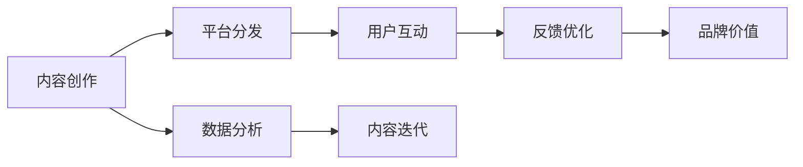

                 

# 知识付费创业中的个人品牌塑造

## 1. 背景介绍

### 1.1 问题由来
知识付费行业作为移动互联网时代的新兴产物，吸引了大量高质量内容生产者和创业公司。随着用户付费意愿的提升和知识需求的多样化，知识付费行业正处于高速成长阶段。然而，在信息爆炸的互联网环境中，用户选择内容的依据早已从单一的“信息获取”转变为多元的“内容价值”和“用户体验”。在这样的背景下，个人品牌建设显得尤为重要，其不仅能提升内容生产者的市场竞争力，还能驱动知识付费平台的商业价值增长。

### 1.2 问题核心关键点
个人品牌塑造的核心关键点包括以下几个方面：
- **内容价值**：通过提供高质量、深度化的内容，形成独特的内容风格和知识体系。
- **用户互动**：与用户建立信任关系，通过在线课程、讲座、直播等形式增加互动频率。
- **平台合作**：与知识付费平台建立深度合作关系，通过平台分发和推荐机制提升内容覆盖面。
- **数据分析**：通过数据分析工具对用户行为进行深入研究，持续优化内容和推广策略。

### 1.3 问题研究意义
个人品牌塑造在知识付费创业中的研究意义如下：
- **提高市场竞争力**：通过个人品牌塑造，可以提升内容生产者在激烈的市场竞争中的突出地位。
- **增强用户黏性**：优秀的个人品牌能增强用户对内容生产者的信任感，提高用户长期留存率。
- **促进商业转化**：建立强大的个人品牌有助于提升内容的商业价值，加速知识付费产品的销售和收益。
- **驱动行业发展**：个人品牌的成功案例能为整个知识付费行业树立标杆，推动行业标准和实践的提升。

## 2. 核心概念与联系

### 2.1 核心概念概述

以下是对个人品牌塑造中关键概念的简要介绍：

- **个人品牌**：指的是个人通过其独特价值和风格，在目标受众中建立的认知与认同。个人品牌不仅仅局限于名称和logo，更体现在内容、价值观、风格等多方面。

- **内容价值**：高质量、有深度的内容是个人品牌的重要组成部分，包括文字、视频、音频等多种形式。内容价值的关键在于深度、新颖性和实用性。

- **用户互动**：与用户建立互动关系，通过解答问题、评论回复、社群活动等方式提升用户参与度，增强品牌黏性。

- **平台合作**：与知识付费平台合作，借助平台的力量进行内容分发、市场推广和用户获取，提升品牌影响力和市场覆盖面。

- **数据分析**：通过分析用户行为数据，了解用户偏好，优化内容策略，提升用户体验和品牌效应。

### 2.2 核心概念原理和架构的 Mermaid 流程图



这个流程图展示了个人品牌塑造的逻辑关系：
- 内容创作是个人品牌塑造的基础，是所有后续步骤的前提。
- 平台分发通过提升内容的曝光率，扩大品牌影响力。
- 用户互动通过增强用户参与度，提升品牌黏性。
- 数据分析通过挖掘用户行为数据，优化内容策略和品牌定位。
- 最终，通过不断迭代优化，构建具有高价值、高互动性的个人品牌。

## 3. 核心算法原理 & 具体操作步骤
### 3.1 算法原理概述

个人品牌塑造的核心算法主要涉及内容推荐、用户互动分析和个性化推荐等。这些算法基于机器学习和数据分析技术，通过对用户行为数据的分析和挖掘，帮助内容生产者优化其内容策略，提升用户参与度和品牌影响力。

### 3.2 算法步骤详解

以下是个人品牌塑造的具体操作步骤：

1. **数据收集与预处理**：
   - 收集用户的行为数据，包括观看时长、互动评论、订阅情况等。
   - 对数据进行清洗和预处理，去除噪声和异常值，确保数据质量。

2. **用户画像构建**：
   - 使用聚类算法对用户进行分类，构建用户画像。
   - 根据用户画像，划分用户群体，确定不同的推广策略。

3. **内容推荐**：
   - 使用协同过滤、基于内容的推荐算法，为用户推荐与其兴趣相关的内容。
   - 通过实时分析用户反馈，调整推荐算法参数，提升推荐效果。

4. **互动分析**：
   - 利用自然语言处理技术，分析用户评论和反馈内容，识别情感倾向和主题。
   - 通过情感分析和主题模型，理解用户的关注点和需求。

5. **个性化内容生成**：
   - 根据用户画像和互动分析结果，生成个性化的推荐内容和互动策略。
   - 持续迭代优化内容生成算法，提升内容的相关性和吸引力。

6. **品牌推广与市场活动**：
   - 利用SEO、SEM等手段提升内容的搜索引擎排名，增加曝光率。
   - 策划品牌活动，如线上讲座、直播互动等，增强用户参与度和品牌黏性。

### 3.3 算法优缺点

个人品牌塑造算法的优点包括：
- **高效性**：通过数据分析和推荐算法，能快速为用户提供个性化内容。
- **精准性**：基于用户行为数据进行分析和推荐，能够精确捕捉用户需求。
- **可扩展性**：算法可以适用于不同的平台和内容类型，具有较强的灵活性。

缺点则包括：
- **数据隐私**：用户数据的收集和使用可能涉及隐私问题，需注意合规和伦理。
- **用户行为偏差**：用户行为数据可能存在偏差，影响算法的准确性。
- **用户互动质量**：高互动性的内容生成依赖于用户的积极参与，可能受到用户行为的影响。

### 3.4 算法应用领域

个人品牌塑造算法在知识付费创业中主要应用于以下几个领域：

- **内容推荐系统**：通过推荐系统提升内容曝光率，吸引更多用户关注。
- **用户互动分析**：通过分析用户互动数据，提升用户参与度和品牌忠诚度。
- **个性化内容生成**：基于用户画像生成个性化内容，提升用户满意度和转化率。
- **品牌推广与市场活动**：策划品牌活动，增强品牌影响力和市场曝光度。

## 4. 数学模型和公式 & 详细讲解 & 举例说明

### 4.1 数学模型构建

个人品牌塑造的数学模型主要涉及用户行为数据的分析与处理。假设有$N$个用户，每个用户对应一个特征向量$\mathbf{x}_i$，通过学习模型$\mathbf{y}_i$来预测用户对内容的评分。设训练集为$D=\{(\mathbf{x}_i, y_i)\}_{i=1}^N$。模型的目标是最小化预测误差，即：

$$
\min_{\theta} \frac{1}{N} \sum_{i=1}^N (y_i - \mathbf{y}_i)^2
$$

其中$\theta$为模型的参数。

### 4.2 公式推导过程

以线性回归模型为例，预测用户评分的公式为：

$$
\mathbf{y}_i = \theta_0 + \theta_1 x_{i1} + \cdots + \theta_p x_{ip}
$$

其中$x_{ij}$为第$i$个用户第$j$个特征的值。模型参数$\theta = (\theta_0, \theta_1, \cdots, \theta_p)$。

为了求解模型参数，需要对模型进行最小二乘法拟合，求解以下目标函数：

$$
\min_{\theta} \frac{1}{N} \sum_{i=1}^N (y_i - (\theta_0 + \theta_1 x_{i1} + \cdots + \theta_p x_{ip}))^2
$$

通过求解目标函数的极小值，得到最优模型参数$\hat{\theta}$：

$$
\hat{\theta} = (X^T X)^{-1} X^T y
$$

其中$X = [1, x_{11}, \cdots, x_{1p}, \cdots, 1, x_{N1}, \cdots, x_{Np}]$。

### 4.3 案例分析与讲解

以视频内容推荐为例，设视频内容特征为$(x_{i1}, x_{i2}, \cdots, x_{ip})$，用户历史评分数据为$y_i$。通过线性回归模型预测用户对新视频的评分：

$$
\hat{y} = \hat{\theta}_0 + \hat{\theta}_1 x_{i1} + \cdots + \hat{\theta}_p x_{ip}
$$

其中$\hat{\theta}_j$为对应特征的系数。通过最小二乘法求解最优参数$\hat{\theta}$，得到用户对新视频的评分预测。

## 5. 项目实践：代码实例和详细解释说明

### 5.1 开发环境搭建

1. **环境准备**：安装Python 3.6或更高版本，安装NumPy、Pandas、Scikit-Learn、Matplotlib等常用科学计算库。
2. **数据集准备**：收集用户观看历史数据，并进行数据清洗和预处理。
3. **算法实现**：使用Scikit-Learn的线性回归模型进行用户评分预测。

### 5.2 源代码详细实现

以下是一个使用Scikit-Learn进行线性回归模型训练的Python代码示例：

```python
import pandas as pd
from sklearn.linear_model import LinearRegression

# 读取数据集
data = pd.read_csv('user_history.csv')

# 划分训练集和测试集
train_data = data.sample(frac=0.8, random_state=1)
test_data = data.drop(train_data.index)

# 训练模型
X_train = train_data.drop('score', axis=1)
y_train = train_data['score']
model = LinearRegression()
model.fit(X_train, y_train)

# 预测测试集评分
X_test = test_data.drop('score', axis=1)
y_pred = model.predict(X_test)
```

### 5.3 代码解读与分析

**数据准备**：
- 使用Pandas库读取数据集。
- 划分训练集和测试集，确保模型在未见过的数据上进行测试。

**模型训练**：
- 使用Scikit-Learn的LinearRegression模型进行训练，最小化预测误差。
- 通过`fit`方法，训练模型，得到最优参数$\hat{\theta}$。

**预测评分**：
- 使用训练好的模型，对测试集进行评分预测，得到$\hat{y}$。

### 5.4 运行结果展示

```python
import matplotlib.pyplot as plt

# 绘制预测结果
plt.plot(test_data['score'], label='Actual Scores')
plt.plot(y_pred, label='Predicted Scores')
plt.legend()
plt.show()
```

绘制预测结果图，对比实际评分与预测评分，评估模型效果。

## 6. 实际应用场景

### 6.1 视频内容推荐

知识付费平台利用内容推荐系统，根据用户观看历史和兴趣标签，向用户推荐相关视频内容。通过内容推荐，提高用户观看时长和内容满意度，增加平台的用户黏性。

### 6.2 讲座互动分析

知识付费平台通过分析用户互动数据，如讲座评分、评论内容等，了解用户对讲师和内容的反馈。根据分析结果，调整讲师内容策略，提升用户参与度和满意度。

### 6.3 个性化讲座生成

知识付费平台根据用户画像，生成个性化讲座内容。利用用户行为数据和互动分析结果，定制符合用户兴趣和需求的讲座主题和形式，提升用户购买转化率。

### 6.4 品牌推广活动

知识付费平台策划品牌推广活动，如线上讲座、直播互动等，增强用户参与度和品牌黏性。通过活动营销，提升品牌知名度和市场影响力。

## 7. 工具和资源推荐

### 7.1 学习资源推荐

1. **《数据科学导论》**：书籍介绍了数据收集、数据预处理、数据分析等多个方面，适合初学者入门。
2. **Coursera《数据科学专业证书》**：由斯坦福大学开设，涵盖机器学习、统计学、数据可视化等多个领域，内容权威且系统。
3. **Kaggle**：数据科学竞赛平台，提供大量公开数据集和代码示例，是学习和实践数据分析的好地方。
4. **Google Colab**：谷歌提供的免费在线Jupyter Notebook环境，支持GPU/TPU算力，方便开发者快速实验和分享。

### 7.2 开发工具推荐

1. **Python**：作为数据科学的主流语言，Python凭借其丰富的科学计算库和便捷的开发环境，成为个人品牌塑造的核心工具。
2. **Scikit-Learn**：机器学习库，提供了多种经典算法的实现，易于上手。
3. **Pandas**：数据处理库，支持高效的数据清洗和预处理。
4. **Matplotlib**：绘图库，支持绘制各种图表，方便数据分析和结果展示。
5. **Jupyter Notebook**：交互式开发环境，支持代码实时执行和文档编辑，适合原型开发和团队协作。

### 7.3 相关论文推荐

1. **《Python数据科学手册》**：书籍详细介绍了Python在数据科学中的应用，适合新手和进阶开发者。
2. **《机器学习实战》**：书籍通过大量案例和代码示例，讲解机器学习算法的实现和应用。
3. **《深度学习》**：书籍由Ian Goodfellow、Yoshua Bengio和Aaron Courville撰写，全面介绍了深度学习的基础和应用。

## 8. 总结：未来发展趋势与挑战

### 8.1 研究成果总结

本文对知识付费创业中个人品牌塑造的各个方面进行了系统介绍。通过内容创作、平台分发、用户互动和数据分析，构建了完整的个人品牌塑造框架。

### 8.2 未来发展趋势

未来个人品牌塑造的趋势包括：
- **多模态数据融合**：结合图像、视频等多模态数据，提升内容的丰富性和多样性。
- **人工智能增强**：引入深度学习、自然语言处理等技术，提升内容的智能化水平。
- **社区互动优化**：通过社区平台，增强用户间的互动和知识共享，提升品牌影响力。
- **内容个性化推荐**：利用机器学习和数据分析技术，提供更加精准的内容推荐，提升用户满意度和转化率。

### 8.3 面临的挑战

个人品牌塑造面临的挑战包括：
- **数据隐私和安全**：用户数据的收集和使用可能涉及隐私和安全问题，需注意合规和伦理。
- **用户行为多样性**：不同用户的行为和偏好差异较大，个性化推荐算法需具备高度适应性。
- **内容质量控制**：高质量的内容生产成本高，需建立有效的激励机制，提升内容质量。
- **品牌影响力扩散**：如何通过多种渠道和手段，扩大品牌的影响力和覆盖面，仍是一大挑战。

### 8.4 研究展望

未来研究可以关注以下几个方向：
- **智能推荐算法**：结合深度学习、强化学习等技术，提升推荐算法的智能化水平，提供更加精准的推荐结果。
- **社交网络分析**：利用社交网络分析技术，理解用户之间的互动关系，提升内容的传播效果。
- **多渠道推广**：通过SEO、SEM、社交媒体等多种渠道，提升品牌的曝光率和市场影响力。
- **品牌价值评估**：建立品牌价值评估模型，量化品牌的影响力和市场价值。

## 9. 附录：常见问题与解答

**Q1：个人品牌塑造是否适用于所有内容生产者？**

A：个人品牌塑造的核心在于内容价值和用户互动，适用于任何形式的内容生产者，包括知识付费讲师、自媒体、博主等。

**Q2：如何评估个人品牌的价值？**

A：个人品牌价值的评估可以从品牌知名度、用户参与度、内容转化率等多个维度进行。通过建立品牌价值评估模型，可以量化品牌的影响力和市场价值。

**Q3：如何提升用户互动频率？**

A：可以通过互动活动、直播讲座、社群运营等方式，增加与用户的互动频率，提升用户参与度和品牌黏性。

**Q4：如何应对用户行为多样性？**

A：需要建立多模态数据融合的推荐算法，结合用户行为数据、社交网络数据等，提供更加个性化和精准的内容推荐。

**Q5：如何保护用户数据隐私？**

A：需注意数据收集和使用的合规性，通过加密和匿名化等手段保护用户隐私，建立用户数据隐私保护机制。

通过本文的系统介绍，相信你对知识付费创业中的个人品牌塑造有了更深入的理解。未来，个人品牌塑造将成为知识付费领域的重要竞争力之一，提升内容生产者的市场影响力，驱动行业健康发展。

