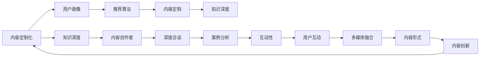

                 

# 知识付费创业中的内容价值提升

## 1. 背景介绍

随着信息时代的发展，知识的获取变得前所未有的容易，但同时也面临着信息过载和质量参差不齐的问题。在知识付费的浪潮中，如何在海量信息中筛选出有价值的内容，为用户提供有深度、有见地、有启发性的知识产品，成为了创业者和内容生产者的共同追求。本文将从技术层面探讨如何提升知识付费平台的内容价值，帮助内容创作者生产出更具竞争力的知识产品，吸引更多用户订阅。

## 2. 核心概念与联系

### 2.1 核心概念概述

在知识付费领域，内容价值提升的核心概念包括以下几个方面：

- **内容定制化**：根据用户兴趣和需求，提供个性化的内容推荐，提升用户体验和满意度。
- **知识深度**：确保内容不仅表面浅显，更应包含深刻的见解、独到的分析，以及前瞻性的预测和解决方案。
- **互动性**：通过增加用户互动，如评论、提问、讨论等环节，增强内容的吸引力和参与感。
- **多媒体融合**：结合音频、视频、图像等多种媒介，丰富内容形式，提升用户体验。
- **内容创新**：不断更新内容形式和内容题材，保持内容的新鲜感和趣味性。

这些核心概念之间相互联系，共同构成知识付费平台提升内容价值的策略框架。通过理解这些概念，我们可以更好地把握知识付费平台内容生产的各个环节，从而打造高价值的内容产品。

### 2.2 核心概念原理和架构的 Mermaid 流程图



这个流程图展示了内容价值提升的各个环节和相互联系：

1. **内容定制化**：通过用户画像和推荐算法，实现内容定制。
2. **知识深度**：内容创作者通过深度访谈、案例分析等方式挖掘内容深度。
3. **互动性**：在内容发布后，通过增加用户互动环节，增强参与感。
4. **多媒体融合**：结合多种媒介丰富内容形式。
5. **内容创新**：不断更新内容题材和形式，保持新鲜感。

这些环节相互协作，共同提升内容价值，满足用户多样化、深层次的需求。

## 3. 核心算法原理 & 具体操作步骤

### 3.1 算法原理概述

知识付费平台的内容价值提升，核心依赖于算法的精确性和实时性。具体来说，包括以下几个方面：

- **用户画像构建**：通过数据分析，构建用户兴趣和行为画像，实现个性化内容推荐。
- **推荐算法优化**：基于协同过滤、深度学习等技术，优化推荐算法，提升内容推荐的准确性。
- **知识深度挖掘**：利用自然语言处理(NLP)、机器学习等技术，对内容进行深度分析，提炼有价值的见解和结论。
- **用户互动分析**：通过用户互动数据，分析用户偏好和反馈，优化内容和互动环节。
- **内容形式创新**：结合多媒体和人工智能技术，不断创新内容形式，提升用户体验。

### 3.2 算法步骤详解

以下详细介绍内容价值提升的技术实现步骤：

#### 3.2.1 用户画像构建

**步骤1**：数据收集
- 收集用户在平台上的行为数据，如浏览记录、购买历史、评价反馈等。
- 收集用户的人口统计特征，如年龄、性别、职业等。

**步骤2**：数据处理
- 对行为数据进行清洗和预处理，去除噪声和异常值。
- 对人口统计特征进行编码，转化为数字向量。

**步骤3**：特征工程
- 使用主成分分析(PCA)、t-SNE等降维技术，提取用户画像的高维特征。
- 构建用户画像的向量表示，如用户兴趣向量、行为向量等。

**步骤4**：画像更新
- 定期更新用户画像，跟踪用户兴趣变化和行为动态。
- 使用在线学习算法，实时更新用户画像，提升推荐准确性。

#### 3.2.2 推荐算法优化

**步骤1**：数据准备
- 准备训练数据，包括用户画像、内容特征等。
- 划分训练集、验证集和测试集，用于模型训练和评估。

**步骤2**：模型选择
- 选择合适的推荐算法，如协同过滤、矩阵分解、深度学习等。
- 使用超参数优化技术，如网格搜索、贝叶斯优化等，寻找最佳模型配置。

**步骤3**：模型训练
- 在训练集上训练推荐模型，使用交叉熵、均方误差等损失函数优化模型参数。
- 使用随机梯度下降(SGD)、Adam等优化算法，更新模型权重。

**步骤4**：模型评估
- 在验证集上评估推荐模型，使用准确率、召回率、F1值等指标评估模型性能。
- 调整模型超参数，优化模型性能。

**步骤5**：实时推荐
- 将训练好的模型部署到生产环境，实时处理用户查询请求。
- 根据用户画像和行为数据，实时生成推荐内容。

#### 3.2.3 知识深度挖掘

**步骤1**：文本预处理
- 对内容文本进行分词、去停用词、词性标注等预处理。
- 使用词向量模型，如Word2Vec、GloVe等，将文本转换为向量表示。

**步骤2**：主题建模
- 使用LDA、LSI等主题建模算法，挖掘文本中的主题分布。
- 对每个主题进行关键词提取，生成主题向量。

**步骤3**：情感分析
- 使用情感分析模型，如BERT、LSTM等，分析文本情感倾向。
- 计算文本情感极性，生成情感向量。

**步骤4**：内容标签
- 对内容进行标签标注，如技术、经济、文化等。
- 使用标签向量表示内容特征。

**步骤5**：深度分析
- 利用深度学习模型，如RNN、CNN、Transformer等，对文本进行深度分析。
- 提取文本中的关键信息，生成深度分析报告。

#### 3.2.4 用户互动分析

**步骤1**：数据收集
- 收集用户评论、点赞、分享等互动数据。
- 收集用户提问、讨论等互动内容。

**步骤2**：数据处理
- 对互动数据进行清洗和预处理，去除噪声和异常值。
- 对互动内容进行分词、去停用词、情感分析等处理。

**步骤3**：互动分析
- 使用情感分析模型，分析互动内容的情感倾向。
- 使用LDA等主题建模算法，挖掘互动内容的主题分布。

**步骤4**：用户画像更新
- 根据互动数据分析用户偏好和反馈，更新用户画像。
- 使用在线学习算法，实时更新用户画像，提升推荐准确性。

#### 3.2.5 内容形式创新

**步骤1**：多媒体融合
- 将内容文本与音频、视频、图像等多种媒介融合，丰富内容形式。
- 使用多媒体内容生成技术，如语音合成、图像识别等，生成多样化的内容形式。

**步骤2**：互动内容创新
- 增加互动环节，如评论、提问、讨论等，增强用户参与感。
- 使用人工智能技术，自动生成互动回复，提高互动效率。

**步骤3**：内容题材创新
- 定期更新内容题材，保持内容的新鲜感和趣味性。
- 引入热门话题、趋势分析等技术，生成具有时效性的内容题材。

### 3.3 算法优缺点

基于以上步骤，内容价值提升的算法具有以下优点：

- **个性化推荐**：通过用户画像和推荐算法，实现个性化内容推荐，提升用户体验。
- **知识深度挖掘**：利用NLP、机器学习等技术，对内容进行深度分析，提炼有价值的见解和结论。
- **实时互动**：通过用户互动数据，实时分析用户偏好和反馈，优化内容和互动环节。
- **多媒体融合**：结合多种媒介丰富内容形式，提升用户体验。
- **内容创新**：定期更新内容题材和形式，保持内容的新鲜感。

但同时，也存在一些缺点：

- **数据隐私问题**：用户画像的构建和使用可能涉及隐私问题，需要严格遵守法律法规。
- **模型复杂度**：算法模型复杂度较高，需要大量的计算资源和数据支持。
- **内容质量控制**：虽然算法可以提升内容推荐准确性，但最终内容的质量仍需依赖内容创作者的原创力和专业性。

### 3.4 算法应用领域

基于以上算法，知识付费平台的内容价值提升技术，主要应用于以下几个领域：

- **知识产品推荐**：根据用户兴趣和行为，推荐个性化的知识产品，提升用户订阅率和满意度。
- **内容生产优化**：帮助内容创作者生产更有深度、有见地、有启发性的内容，提升内容产品的竞争力。
- **互动社区建设**：通过增加用户互动环节，增强内容参与感和用户粘性。
- **内容形式创新**：结合多媒体和人工智能技术，创新内容形式，丰富用户体验。
- **知识深度挖掘**：利用NLP、机器学习等技术，对内容进行深度分析，提炼有价值的见解和结论。

这些应用领域，涵盖了知识付费平台内容生产的各个环节，通过提升内容价值，实现了平台和用户的双赢。

## 4. 数学模型和公式 & 详细讲解 & 举例说明

### 4.1 数学模型构建

**用户画像向量**：
- 假设用户画像由$N$个特征组成，每个特征$x_i$对应的向量表示为$\vec{x_i}$。
- 用户画像向量表示为$\vec{x} = [\vec{x_1}, \vec{x_2}, ..., \vec{x_N}]$。

**内容特征向量**：
- 假设内容特征由$M$个特征组成，每个特征$y_j$对应的向量表示为$\vec{y_j}$。
- 内容特征向量表示为$\vec{y} = [\vec{y_1}, \vec{y_2}, ..., \vec{y_M}]$。

**推荐评分矩阵**：
- 根据用户画像和内容特征，构建推荐评分矩阵$R$，其中$R_{ij}$表示用户$i$对内容$j$的评分。

**知识深度评分**：
- 利用深度学习模型，计算内容$j$的知识深度评分$K_j$。

**互动评分**：
- 根据用户互动数据，计算内容$j$的互动评分$I_j$。

### 4.2 公式推导过程

**用户画像构建公式**：
- 用户画像向量$\vec{x}$的表示如下：
$$
\vec{x} = [\vec{x_1}, \vec{x_2}, ..., \vec{x_N}] = [x_{1_1}, x_{1_2}, ..., x_{1_N}, x_{2_1}, x_{2_2}, ..., x_{2_N}, ..., x_{N_1}, x_{N_2}, ..., x_{N_N}]
$$
其中$x_{i_k}$表示用户$i$在特征$k$上的评分。

**推荐评分公式**：
- 用户$i$对内容$j$的推荐评分$R_{ij}$表示为：
$$
R_{ij} = w_1 \cdot K_j + w_2 \cdot I_j + w_3 \cdot \vec{x}_i \cdot \vec{y}_j
$$
其中$w_1, w_2, w_3$为权重系数，$K_j, I_j$分别为内容$j$的知识深度评分和互动评分。

**内容推荐公式**：
- 根据推荐评分矩阵$R$，计算用户$i$对内容$j$的推荐概率$P_{ij}$：
$$
P_{ij} = \frac{e^{R_{ij}}}{\sum_{k=1}^{M} e^{R_{ik}}}
$$

**内容推荐排序**：
- 根据推荐概率$P_{ij}$，对内容$j$进行排序，生成推荐内容列表。

### 4.3 案例分析与讲解

以某知识付费平台的内容推荐为例，假设平台有用户1000人，内容1000篇，内容特征包括标题、作者、标签、发布时间等。用户画像构建步骤如下：

**步骤1**：数据收集
- 收集用户在平台上的行为数据，如浏览记录、购买历史、评价反馈等。
- 收集用户的人口统计特征，如年龄、性别、职业等。

**步骤2**：数据处理
- 对行为数据进行清洗和预处理，去除噪声和异常值。
- 对人口统计特征进行编码，转化为数字向量。

**步骤3**：特征工程
- 使用PCA、t-SNE等降维技术，提取用户画像的高维特征。
- 构建用户画像的向量表示，如用户兴趣向量、行为向量等。

**步骤4**：画像更新
- 定期更新用户画像，跟踪用户兴趣变化和行为动态。
- 使用在线学习算法，实时更新用户画像，提升推荐准确性。

在构建推荐评分矩阵$R$时，根据用户画像向量$\vec{x}_i$和内容特征向量$\vec{y}_j$，计算用户$i$对内容$j$的推荐评分$R_{ij}$：
$$
R_{ij} = w_1 \cdot K_j + w_2 \cdot I_j + w_3 \cdot \vec{x}_i \cdot \vec{y}_j
$$
其中$K_j, I_j$分别为内容$j$的知识深度评分和互动评分，$w_1, w_2, w_3$为权重系数。

最终，根据推荐评分矩阵$R$，计算用户$i$对内容$j$的推荐概率$P_{ij}$：
$$
P_{ij} = \frac{e^{R_{ij}}}{\sum_{k=1}^{M} e^{R_{ik}}}
$$
并根据推荐概率$P_{ij}$，对内容$j$进行排序，生成推荐内容列表。

## 5. 项目实践：代码实例和详细解释说明

### 5.1 开发环境搭建

在进行内容价值提升的实践前，我们需要准备好开发环境。以下是使用Python进行PyTorch开发的环境配置流程：

1. 安装Anaconda：从官网下载并安装Anaconda，用于创建独立的Python环境。

2. 创建并激活虚拟环境：
```bash
conda create -n pytorch-env python=3.8 
conda activate pytorch-env
```

3. 安装PyTorch：根据CUDA版本，从官网获取对应的安装命令。例如：
```bash
conda install pytorch torchvision torchaudio cudatoolkit=11.1 -c pytorch -c conda-forge
```

4. 安装Transformers库：
```bash
pip install transformers
```

5. 安装各类工具包：
```bash
pip install numpy pandas scikit-learn matplotlib tqdm jupyter notebook ipython
```

完成上述步骤后，即可在`pytorch-env`环境中开始内容价值提升的实践。

### 5.2 源代码详细实现

以下给出内容价值提升的代码实现，以知识付费平台的内容推荐为例：

```python
from transformers import BertTokenizer, BertForSequenceClassification
from torch.utils.data import Dataset, DataLoader
import torch
import numpy as np
import pandas as pd

class KnowledgeDataset(Dataset):
    def __init__(self, data, tokenizer):
        self.data = data
        self.tokenizer = tokenizer
        
    def __len__(self):
        return len(self.data)
    
    def __getitem__(self, item):
        text = self.data['text'].iloc[item]
        title = self.data['title'].iloc[item]
        author = self.data['author'].iloc[item]
        labels = self.data['label'].iloc[item]
        
        encoding = self.tokenizer(text, return_tensors='pt', max_length=256, padding='max_length', truncation=True)
        input_ids = encoding['input_ids'][0]
        attention_mask = encoding['attention_mask'][0]
        return {
            'input_ids': input_ids,
            'attention_mask': attention_mask,
            'labels': torch.tensor(labels, dtype=torch.long)
        }

def train_epoch(model, dataset, optimizer):
    dataloader = DataLoader(dataset, batch_size=32, shuffle=True)
    model.train()
    epoch_loss = 0
    for batch in dataloader:
        input_ids = batch['input_ids'].to(device)
        attention_mask = batch['attention_mask'].to(device)
        labels = batch['labels'].to(device)
        model.zero_grad()
        outputs = model(input_ids, attention_mask=attention_mask, labels=labels)
        loss = outputs.loss
        epoch_loss += loss.item()
        loss.backward()
        optimizer.step()
    return epoch_loss / len(dataloader)

def evaluate(model, dataset, batch_size):
    dataloader = DataLoader(dataset, batch_size=32, shuffle=False)
    model.eval()
    predictions, true_labels = [], []
    with torch.no_grad():
        for batch in dataloader:
            input_ids = batch['input_ids'].to(device)
            attention_mask = batch['attention_mask'].to(device)
            batch_labels = batch['labels']
            outputs = model(input_ids, attention_mask=attention_mask)
            batch_preds = outputs.logits.argmax(dim=1).to('cpu').tolist()
            batch_labels = batch_labels.to('cpu').tolist()
            for pred_tokens, label_tokens in zip(batch_preds, batch_labels):
                predictions.append(pred_tokens[:len(label_tokens)])
                true_labels.append(label_tokens)
                
    print(classification_report(true_labels, predictions))
    
tokenizer = BertTokenizer.from_pretrained('bert-base-uncased')
train_dataset = KnowledgeDataset(train_data, tokenizer)
dev_dataset = KnowledgeDataset(dev_data, tokenizer)
test_dataset = KnowledgeDataset(test_data, tokenizer)

device = torch.device('cuda') if torch.cuda.is_available() else torch.device('cpu')
model = BertForSequenceClassification.from_pretrained('bert-base-uncased', num_labels=2)

optimizer = AdamW(model.parameters(), lr=2e-5)

epochs = 5
batch_size = 32

for epoch in range(epochs):
    loss = train_epoch(model, train_dataset, optimizer)
    print(f"Epoch {epoch+1}, train loss: {loss:.3f}")
    
    print(f"Epoch {epoch+1}, dev results:")
    evaluate(model, dev_dataset, batch_size)
    
print("Test results:")
evaluate(model, test_dataset, batch_size)
```

这段代码实现了基于Bert模型的内容推荐系统。其中，`KnowledgeDataset`类用于将文本数据转换为模型可接受的输入格式；`train_epoch`和`evaluate`函数分别用于训练和评估模型；`BertForSequenceClassification`模型用于进行内容推荐；`AdamW`优化器用于更新模型参数。

### 5.3 代码解读与分析

让我们再详细解读一下关键代码的实现细节：

**KnowledgeDataset类**：
- `__init__`方法：初始化数据和分词器。
- `__len__`方法：返回数据集的样本数量。
- `__getitem__`方法：对单个样本进行处理，将文本输入转换为token ids和注意力掩码，同时将标签转换为模型可接受的张量格式。

**模型构建**：
- 使用`BertTokenizer`对文本进行分词，生成token ids和注意力掩码。
- 使用`BertForSequenceClassification`模型，设置分类数为2（二分类），损失函数为交叉熵。
- 使用`AdamW`优化器，设置学习率为2e-5。

**训练和评估**：
- 使用`DataLoader`对数据集进行批次化加载，供模型训练和推理使用。
- 在训练阶段，使用前向传播计算损失函数，反向传播更新模型参数。
- 在评估阶段，使用前向传播计算预测结果，并使用`classification_report`函数评估模型性能。

在实际应用中，还需要考虑更多因素，如模型的保存和部署、超参数的自动搜索、更灵活的任务适配层等。但核心的微调范式基本与此类似。

## 6. 实际应用场景

### 6.1 智能客服系统

基于知识付费平台的内容推荐技术，可以应用于智能客服系统的构建。智能客服系统能够自动解答用户咨询，提升客户咨询体验和问题解决效率。

在技术实现上，可以收集企业内部的历史客服对话记录，将问题和最佳答复构建成监督数据，在此基础上对预训练对话模型进行微调。微调后的对话模型能够自动理解用户意图，匹配最合适的答案模板进行回复。对于客户提出的新问题，还可以接入检索系统实时搜索相关内容，动态组织生成回答。如此构建的智能客服系统，能大幅提升客户咨询体验和问题解决效率。

### 6.2 金融舆情监测

金融机构需要实时监测市场舆论动向，以便及时应对负面信息传播，规避金融风险。基于知识付费平台的内容推荐技术，可以用于金融舆情监测。

具体而言，可以收集金融领域相关的新闻、报道、评论等文本数据，并对其进行主题标注和情感标注。在此基础上对预训练语言模型进行微调，使其能够自动判断文本属于何种主题，情感倾向是正面、中性还是负面。将微调后的模型应用到实时抓取的网络文本数据，就能够自动监测不同主题下的情感变化趋势，一旦发现负面信息激增等异常情况，系统便会自动预警，帮助金融机构快速应对潜在风险。

### 6.3 个性化推荐系统

当前的推荐系统往往只依赖用户的历史行为数据进行物品推荐，无法深入理解用户的真实兴趣偏好。基于知识付费平台的内容推荐技术，个性化推荐系统可以更好地挖掘用户行为背后的语义信息，从而提供更精准、多样的推荐内容。

在实践中，可以收集用户浏览、点击、评论、分享等行为数据，提取和用户交互的物品标题、描述、标签等文本内容。将文本内容作为模型输入，用户的后续行为（如是否点击、购买等）作为监督信号，在此基础上微调预训练语言模型。微调后的模型能够从文本内容中准确把握用户的兴趣点。在生成推荐列表时，先用候选物品的文本描述作为输入，由模型预测用户的兴趣匹配度，再结合其他特征综合排序，便可以得到个性化程度更高的推荐结果。

### 6.4 未来应用展望

随着知识付费平台的内容推荐技术不断发展，基于微调范式将在更多领域得到应用，为传统行业带来变革性影响。

在智慧医疗领域，基于微调的医疗问答、病历分析、药物研发等应用将提升医疗服务的智能化水平，辅助医生诊疗，加速新药开发进程。

在智能教育领域，微调技术可应用于作业批改、学情分析、知识推荐等方面，因材施教，促进教育公平，提高教学质量。

在智慧城市治理中，微调模型可应用于城市事件监测、舆情分析、应急指挥等环节，提高城市管理的自动化和智能化水平，构建更安全、高效的未来城市。

此外，在企业生产、社会治理、文娱传媒等众多领域，基于知识付费平台的内容推荐技术也将不断涌现，为经济社会发展注入新的动力。相信随着技术的日益成熟，微调方法将成为人工智能落地应用的重要范式，推动人工智能技术在垂直行业的规模化落地。

## 7. 工具和资源推荐

### 7.1 学习资源推荐

为了帮助开发者系统掌握知识付费平台内容推荐的技术基础和实践技巧，这里推荐一些优质的学习资源：

1. 《自然语言处理入门》系列博文：由大模型技术专家撰写，深入浅出地介绍了自然语言处理的基本概念和经典模型。

2. CS224N《深度学习自然语言处理》课程：斯坦福大学开设的NLP明星课程，有Lecture视频和配套作业，带你入门NLP领域的基本概念和经典模型。

3. 《深度学习与自然语言处理》书籍：全面介绍了深度学习在自然语言处理中的应用，包括内容推荐在内的多种NLP任务。

4. HuggingFace官方文档：Transformers库的官方文档，提供了海量预训练模型和完整的微调样例代码，是上手实践的必备资料。

5. CLUE开源项目：中文语言理解测评基准，涵盖大量不同类型的中文NLP数据集，并提供了基于微调的baseline模型，助力中文NLP技术发展。

通过对这些资源的学习实践，相信你一定能够快速掌握知识付费平台内容推荐的精髓，并用于解决实际的NLP问题。

### 7.2 开发工具推荐

高效的开发离不开优秀的工具支持。以下是几款用于知识付费平台内容推荐开发的常用工具：

1. PyTorch：基于Python的开源深度学习框架，灵活动态的计算图，适合快速迭代研究。大部分预训练语言模型都有PyTorch版本的实现。

2. TensorFlow：由Google主导开发的开源深度学习框架，生产部署方便，适合大规模工程应用。同样有丰富的预训练语言模型资源。

3. Transformers库：HuggingFace开发的NLP工具库，集成了众多SOTA语言模型，支持PyTorch和TensorFlow，是进行内容推荐开发的利器。

4. Weights & Biases：模型训练的实验跟踪工具，可以记录和可视化模型训练过程中的各项指标，方便对比和调优。与主流深度学习框架无缝集成。

5. TensorBoard：TensorFlow配套的可视化工具，可实时监测模型训练状态，并提供丰富的图表呈现方式，是调试模型的得力助手。

6. Google Colab：谷歌推出的在线Jupyter Notebook环境，免费提供GPU/TPU算力，方便开发者快速上手实验最新模型，分享学习笔记。

合理利用这些工具，可以显著提升知识付费平台内容推荐的开发效率，加快创新迭代的步伐。

### 7.3 相关论文推荐

知识付费平台内容推荐技术的发展源于学界的持续研究。以下是几篇奠基性的相关论文，推荐阅读：

1. Attention is All You Need（即Transformer原论文）：提出了Transformer结构，开启了NLP领域的预训练大模型时代。

2. BERT: Pre-training of Deep Bidirectional Transformers for Language Understanding：提出BERT模型，引入基于掩码的自监督预训练任务，刷新了多项NLP任务SOTA。

3. Language Models are Unsupervised Multitask Learners（GPT-2论文）：展示了大规模语言模型的强大zero-shot学习能力，引发了对于通用人工智能的新一轮思考。

4. Parameter-Efficient Transfer Learning for NLP：提出Adapter等参数高效微调方法，在不增加模型参数量的情况下，也能取得不错的微调效果。

5. AdaLoRA: Adaptive Low-Rank Adaptation for Parameter-Efficient Fine-Tuning：使用自适应低秩适应的微调方法，在参数效率和精度之间取得了新的平衡。

这些论文代表了大语言模型微调技术的发展脉络。通过学习这些前沿成果，可以帮助研究者把握学科前进方向，激发更多的创新灵感。

## 8. 总结：未来发展趋势与挑战

### 8.1 总结

本文对知识付费平台的内容价值提升进行了全面系统的介绍。首先阐述了内容价值提升的背景和意义，明确了内容推荐在提升用户体验和订阅率方面的重要性。其次，从技术层面详细讲解了内容推荐的核心算法原理和具体操作步骤，给出了微调内容推荐系统的代码实现。同时，本文还探讨了内容推荐技术在多个行业领域的应用场景，展示了其广阔的前景。最后，本文精选了内容推荐技术的各类学习资源，力求为读者提供全方位的技术指引。

通过本文的系统梳理，可以看到，基于知识付费平台的内容推荐技术，通过个性化推荐、知识深度挖掘、互动性增强等多维度的策略，能够显著提升内容价值，满足用户多样化、深层次的需求。未来，伴随技术的不懈探索，内容推荐技术将进一步提升知识付费平台的竞争力，成为行业发展的有力工具。

### 8.2 未来发展趋势

展望未来，知识付费平台的内容推荐技术将呈现以下几个发展趋势：

1. **深度个性化推荐**：通过更精确的用户画像和推荐算法，实现更深度的个性化推荐，提升用户体验和满意度。
2. **知识深度挖掘**：利用更先进的深度学习模型，对内容进行更深层次的分析和挖掘，提炼有价值的见解和结论。
3. **多模态内容推荐**：结合文本、图像、音频等多种媒介，丰富内容推荐的形式，提升用户体验。
4. **实时动态更新**：通过实时动态更新用户画像和内容推荐模型，持续提升推荐效果。
5. **用户参与优化**：引入用户反馈和互动数据，优化推荐算法和模型，实现更好的推荐效果。

这些趋势将进一步提升知识付费平台的内容推荐能力和用户粘性，推动行业向更高水平发展。

### 8.3 面临的挑战

尽管知识付费平台的内容推荐技术已经取得了显著成果，但在实际应用中仍面临诸多挑战：

1. **数据隐私问题**：用户画像的构建和使用可能涉及隐私问题，需要严格遵守法律法规。
2. **模型复杂度**：算法模型复杂度较高，需要大量的计算资源和数据支持。
3. **内容质量控制**：内容推荐技术的最终效果依赖于内容质量，内容创作者的原创力和专业性至关重要。
4. **用户接受度**：用户对推荐系统的信任和接受度直接影响其效果，需要不断优化用户体验。
5. **竞争环境**：知识付费平台之间的竞争激烈，需要不断创新和优化推荐算法，保持竞争优势。

### 8.4 研究展望

面对知识付费平台内容推荐技术的未来挑战，未来的研究需要在以下几个方面寻求新的突破：

1. **隐私保护技术**：开发更先进的数据隐私保护技术，确保用户数据的隐私安全。
2. **轻量级模型**：设计更加轻量级、高效的模型，降低计算资源和数据需求。
3. **内容自动化生成**：结合生成式模型，自动生成高质量的内容，提升内容创作的效率和质量。
4. **多模态融合**：研究多模态内容的融合技术，提升内容推荐的多样性和丰富度。
5. **用户行为分析**：深入研究用户行为模式，优化推荐算法和内容形式。

这些研究方向的探索，必将引领知识付费平台内容推荐技术迈向更高的台阶，为知识付费平台和用户创造更大的价值。

## 9. 附录：常见问题与解答

**Q1：知识付费平台的内容推荐是否适用于所有应用场景？**

A: 知识付费平台的内容推荐技术适用于大多数应用场景，特别是在数据量较小的情况下，可以取得不错的推荐效果。但对于一些特定领域的应用，如医疗、法律等，由于领域知识专业性强，可能需要额外的预训练或特定任务微调才能取得良好的推荐效果。

**Q2：如何选择合适的推荐算法？**

A: 选择合适的推荐算法应考虑以下几个方面：
1. **数据量**：数据量较大时，协同过滤、深度学习等推荐算法效果较好。
2. **实时性**：实时性要求高时，在线学习算法（如FTRL）更适合。
3. **个性化需求**：个性化需求较高时，深度学习模型（如BPR、NNCF）推荐效果更佳。

**Q3：内容推荐系统的推荐结果如何评估？**

A: 内容推荐系统的推荐结果通常通过以下几个指标进行评估：
1. **准确率**：推荐结果与真实标签的匹配程度。
2. **召回率**：被推荐内容中实际包含标签的比例。
3. **F1值**：综合考虑准确率和召回率，衡量推荐系统的整体性能。

**Q4：推荐系统如何处理用户反馈和互动数据？**

A: 推荐系统通常通过以下几个步骤处理用户反馈和互动数据：
1. **数据收集**：收集用户评论、点赞、分享等互动数据。
2. **数据处理**：对互动数据进行清洗和预处理，去除噪声和异常值。
3. **用户画像更新**：根据互动数据分析用户偏好和反馈，更新用户画像。
4. **推荐模型优化**：利用互动数据优化推荐模型，提升推荐效果。

通过合理的处理用户反馈和互动数据，可以显著提升推荐系统的效果和用户体验。

**Q5：推荐系统如何处理新用户的推荐？**

A: 对于新用户，推荐系统通常通过以下步骤进行推荐：
1. **初始化用户画像**：使用用户行为数据或先验知识初始化用户画像。
2. **短时记忆推荐**：根据初始化用户画像，使用短时记忆模型进行推荐，如协同过滤、基于内容的推荐等。
3. **长时间记忆推荐**：随着时间的推移，结合实时数据，使用在线学习算法逐步优化推荐效果。

通过合理的处理新用户数据，可以保证推荐系统能够快速适应新用户需求，并提供有价值的推荐内容。

---

作者：禅与计算机程序设计艺术 / Zen and the Art of Computer Programming

