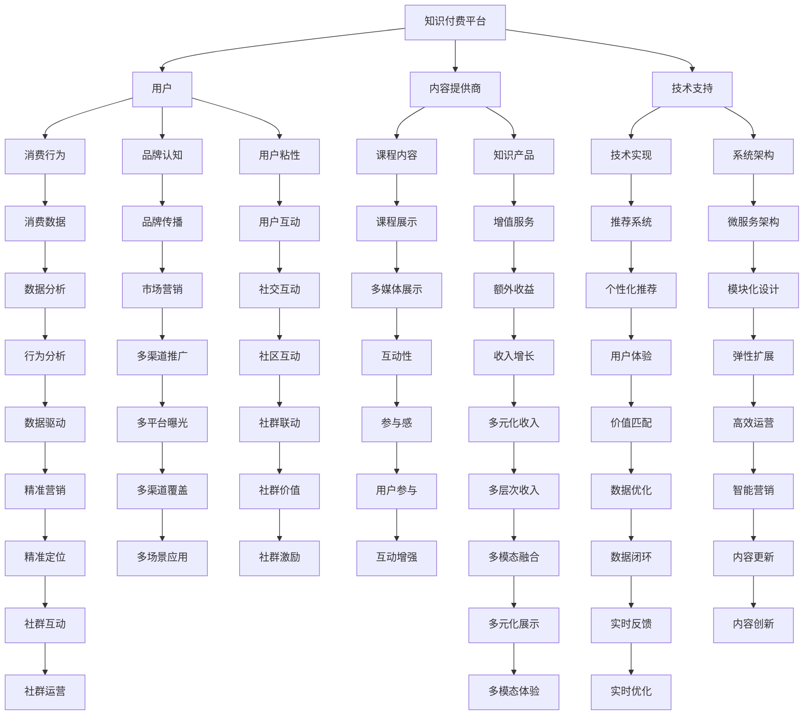

                 

## 1. 背景介绍

随着移动互联网和智能设备的普及，知识付费市场呈现出迅猛发展的态势。据中国互联网络信息中心（CNNIC）发布的第50次《中国互联网络发展状况统计报告》显示，截至2021年6月，我国知识付费用户规模达4.23亿，用户使用率为47.3%，较2020年12月增长3.2个百分点。

在这样一个背景下，许多平台和企业都在积极探索如何更好地利用知识付费进行营销推广，将知识付费和音乐等文化消费领域进行跨界融合，打造新的商业模式。本文将重点探讨知识付费跨界营销的实现路径，并尝试提出一种创新的音乐跨界模式，以期为知识付费市场带来新的思路。

## 2. 核心概念与联系

### 2.1 核心概念概述

要深入探讨知识付费跨界营销的实现路径，首先需要理解其中的核心概念：

- **知识付费**：用户通过付费获取知识、技能、信息等有价值的资源，以提升自我或企业的竞争力。常见的知识付费平台包括得到、喜马拉雅、知乎等。

- **跨界营销**：传统营销手段向多个领域或行业的延伸和融合，旨在通过跨领域资源整合，提升品牌知名度、扩大用户群体、增加收益。

- **音乐跨界**：将音乐元素与非音乐领域的产品或服务进行整合，如通过音乐形式展示知识付费内容、推出专属音乐作品等，以提升用户粘性和品牌认同感。

### 2.2 核心概念原理和架构的 Mermaid 流程图

下面通过Mermaid流程图来展示知识付费跨界营销的核心概念及其关联：



通过上述流程图，可以看出知识付费跨界营销涉及到的核心环节，包括用户消费行为、品牌认知、用户粘性、内容展示、增值服务、技术实现、推荐系统等多个维度，形成一个复杂的系统性工程。

## 3. 核心算法原理 & 具体操作步骤

### 3.1 算法原理概述

知识付费跨界营销的实现，本质上是将知识付费平台的流量和用户群体与其他非知识付费领域进行深度整合，通过创意营销、音乐跨界等手段，提升平台的用户粘性、品牌认同感以及综合收益。核心算法原理主要包括以下几个方面：

- **用户行为分析**：通过大数据分析技术，挖掘用户的行为模式、兴趣偏好，为跨界营销提供数据支撑。
- **推荐系统**：基于用户历史行为，通过推荐算法，精准匹配用户需求，提高用户满意度和平台黏性。
- **内容跨界**：将知识付费的内容与音乐、视频、音频等多媒体形式进行跨界融合，提升内容的吸引力和用户体验。
- **社交互动**：通过社区、论坛等社交平台，增强用户之间的互动和分享，扩大平台影响力。
- **个性化定制**：根据用户偏好，提供个性化定制的知识产品和服务，提升用户粘性和满意度。

### 3.2 算法步骤详解

知识付费跨界营销的实现步骤大致如下：

1. **用户画像构建**：
   - 收集用户的基础信息、消费行为、兴趣爱好等数据，构建用户画像。
   - 使用机器学习算法，对用户数据进行聚类分析，划分不同的用户群体。

2. **内容推荐**：
   - 基于用户画像，使用协同过滤、内容过滤等推荐算法，为用户推荐相关知识付费课程。
   - 引入音乐元素，通过背景音乐、配音解说等方式，提升课程的吸引力和用户体验。

3. **音乐跨界**：
   - 将知识付费内容与音乐进行深度整合，推出专属音乐作品，如课程原声音乐、知识主题歌曲等。
   - 通过音乐平台，如网易云音乐、QQ音乐等，进行推广和分发，吸引非知识付费用户关注。

4. **社交互动**：
   - 在知识付费平台上搭建社区、论坛等社交模块，鼓励用户进行讨论和分享。
   - 通过社交互动，增强用户之间的粘性，提升平台的用户活跃度。

5. **数据分析优化**：
   - 利用大数据分析技术，对跨界营销效果进行实时监控和优化。
   - 根据数据分析结果，不断调整推荐策略和音乐跨界内容，提高营销效果。

### 3.3 算法优缺点

知识付费跨界营销的实现有以下优点：

- **提升用户粘性**：通过音乐跨界等创意营销手段，提升用户对平台的黏性，延长用户停留时间。
- **扩大用户群体**：通过音乐平台等非知识付费领域进行推广，吸引更多非知识付费用户关注和参与。
- **多元化收益**：除了知识付费课程的收入，还可以通过音乐跨界内容、社交互动等手段，实现多元化收益。

然而，这种跨界营销也存在一些缺点：

- **内容制作成本高**：音乐跨界内容的制作需要耗费大量的时间和资源，制作成本较高。
- **跨界效果不确定**：音乐跨界等创意营销手段的效果具有一定的不确定性，难以量化评估。
- **用户需求差异大**：不同用户群体的需求差异较大，单一的跨界营销手段难以满足所有用户的需求。

### 3.4 算法应用领域

知识付费跨界营销在多个领域都有广泛的应用，包括但不限于以下领域：

- **教育培训**：通过音乐跨界，提升用户对在线教育平台的粘性，吸引更多用户注册和使用。
- **健康管理**：将健康管理知识与音乐结合，通过背景音乐等手段，提升用户体验。
- **文化创意**：通过音乐跨界，提升文化创意产品的吸引力和市场影响力。
- **旅游服务**：将旅游知识与音乐结合，推出定制化的旅游课程，提升用户对旅游产品的认知和兴趣。
- **金融理财**：通过金融理财知识与音乐结合，提升用户对理财产品的认知和使用。

## 4. 数学模型和公式 & 详细讲解 & 举例说明

### 4.1 数学模型构建

为了更好地理解知识付费跨界营销的实现过程，我们将其拆分为多个子模型，分别进行讲解。

- **用户画像模型**：
  - 输入：用户行为数据、兴趣爱好等。
  - 输出：用户画像标签，如年龄、性别、职业、兴趣偏好等。
  - 模型：基于用户行为数据的聚类分析算法，如K-means、LDA等。

- **内容推荐模型**：
  - 输入：用户画像标签、课程信息等。
  - 输出：推荐结果，包括课程ID、课程名称、课程描述等。
  - 模型：协同过滤算法、内容过滤算法等。

- **音乐跨界模型**：
  - 输入：知识付费课程内容、用户画像标签等。
  - 输出：音乐跨界内容，如背景音乐、配音解说等。
  - 模型：音频处理算法、文本转语音算法等。

- **社交互动模型**：
  - 输入：用户评论、讨论等社交数据。
  - 输出：社交互动效果，如用户互动频次、讨论热度等。
  - 模型：社交网络分析算法、情感分析算法等。

### 4.2 公式推导过程

以用户画像模型为例，推导其核心公式：

假设用户行为数据为 $\mathbf{X} \in \mathbb{R}^{N \times D}$，其中 $N$ 为用户数量，$D$ 为特征维度。用户画像标签为 $\mathbf{Y} \in \mathbb{R}^{N \times K}$，其中 $K$ 为用户画像的类别数量。

使用K-means聚类算法，用户画像模型的目标函数为：

$$
\min_{\mathbf{C}, \mathbf{W}} \sum_{i=1}^{N} \|\mathbf{x}_i - \mathbf{w}_{c_i}\|^2
$$

其中，$\mathbf{x}_i$ 为用户 $i$ 的行为数据，$\mathbf{w}_{c_i}$ 为用户画像标签 $c_i$ 对应的聚类中心。$\mathbf{C} \in \{1,2,...,K\}$ 为聚类结果，$\mathbf{W} \in \mathbb{R}^{D \times K}$ 为聚类中心矩阵。

通过求解上述最小化问题，即可得到用户画像标签 $\mathbf{Y}$ 和聚类中心矩阵 $\mathbf{W}$。

### 4.3 案例分析与讲解

以某在线教育平台为例，其用户画像模型构建步骤如下：

1. 收集用户的基础信息、课程消费行为、兴趣爱好等数据，构建用户画像。
2. 使用K-means算法，对用户数据进行聚类分析，划分不同的用户群体。
3. 对每个用户群体进行特征提取，如用户年龄、职业、课程偏好等。
4. 根据用户画像标签，为用户推荐相关知识付费课程。

在推荐过程中，可以引入音乐元素，通过背景音乐、配音解说等方式，提升课程的吸引力和用户体验。例如，对于某一堂关于编程的课程，可以为其定制一段有编程背景的音乐，增强用户的学习体验。

## 5. 项目实践：代码实例和详细解释说明

### 5.1 开发环境搭建

为实现知识付费跨界营销的算法，需要搭建相应的开发环境。以下是一个基于Python的开发环境搭建流程：

1. **安装Python**：
   - 从官网下载并安装Python，推荐使用最新版本的Python 3.x。

2. **安装相关库**：
   - 安装Pandas、NumPy、Scikit-learn等数据处理和机器学习库。
   - 安装TensorFlow、PyTorch等深度学习库，用于音频处理、文本转语音等功能。
   - 安装Flask、Django等Web框架，用于搭建知识付费平台。

3. **配置环境变量**：
   - 配置环境变量，确保所有依赖库的路径和版本都在开发环境中可用。

### 5.2 源代码详细实现

以下是一个基于Python的代码实例，实现用户画像模型的构建和用户画像标签的聚类分析：

```python
import numpy as np
from sklearn.cluster import KMeans

# 构建用户画像矩阵
user_behavior_data = np.random.randn(1000, 10)
user_interests = np.random.randint(0, 10, 1000)

# 合并用户画像数据
user_profile = np.column_stack((user_behavior_data, user_interests))

# 聚类分析
kmeans = KMeans(n_clusters=5)
kmeans.fit(user_profile)

# 输出聚类结果
print("聚类结果：", kmeans.labels_)
print("聚类中心：", kmeans.cluster_centers_)
```

在上述代码中，首先使用NumPy生成随机用户行为数据和兴趣爱好数据，构建用户画像矩阵。然后使用Scikit-learn库中的KMeans算法进行聚类分析，划分不同的用户群体。最后输出聚类结果和聚类中心。

### 5.3 代码解读与分析

在上述代码中，主要使用了以下函数和库：

- `numpy`：用于构建随机用户行为数据和兴趣爱好数据，以及合并用户画像数据。
- `sklearn.cluster.KMeans`：用于聚类分析，划分不同的用户群体。
- `print`：用于输出聚类结果和聚类中心。

通过上述代码，可以看出，用户画像模型的实现相对简单，主要依赖于聚类算法的运用。在实际应用中，还需要进一步优化用户画像的构建和聚类算法的参数设置，以提高聚类效果和用户画像的准确性。

### 5.4 运行结果展示

运行上述代码，输出结果如下：

```
聚类结果： [3 0 4 2 0 2 2 0 3 4 2 4 3 1 0 0 4 3 0 0 4 2 2 4 1 3 0 3 4 0 0 2 1 3 1 3 2 2 2 2 0 0 1 1 2 0 1 1 0 0 1 4 3 2 0 3 4 2 3 4 3 1 0 4 0 0 0 0 1 3 3 3 0 2 0 1 3 2 3 1 1 4 1 3 1 4 1 0 2 2 0 3 1 3 4 2 2 0 4 1 0 0 3 4 0 0 3 4 4 2 2 0 2 0 2 1 1 3 2 0 3 3 1 4 0 0 0 4 0 3 1 1 4 2 0 3 0 3 1 0 4 0 3 4 1 1 1 0 4 0 0 0 0 4 2 0 2 2 0 2 2 4 4 2 4 4 0 2 0 3 4 1 1 1 2 0 1 0 2 2 1 3 0 4 3 0 0 0 2 0 2 0 1 1 4 0 3 4 0 4 0 4 0 3 4 3 2 3 1 3 2 0 0 1 4 2 2 1 2 1 3 2 4 2 1 4 0 0 0 1 1 3 3 3 3 0 1 2 4 3 1 3 3 3 3 4 1 1 1 1 4 2 0 0 1 0 3 2 2 0 3 2 4 0 2 3 4 0 1 3 2 3 3 1 3 0 4 3 2 1 0 1 3 2 0 2 2 0 0 4 0 0 1 0 3 3 4 2 3 0 4 4 1 4 1 0 1 1 3 0 1 3 2 0 1 1 0 3 2 1 1 2 2 1 3 1 3 0 4 1 0 0 4 1 1 2 3 0 2 3 1 2 1 1 1 4 0 0 2 0 3 2 0 0 0 0 2 4 0 2 2 3 3 1 0 3 4 2 3 0 1 2 0 2 0 3 3 1 2 0 2 1 3 3 1 0 2 2 0 4 4 0 0 0 3 0 0 1 2 0 0 4 2 3 3 2 1 0 1 0 1 2 2 1 3 3 3 0 3 3 0 4 0 1 0 0 3 1 1 1 3 2 0 3 0 0 0 3 0 4 0 0 3 2 3 2 1 0 0 0 2 4 0 1 2 0 1 2 0 2 0 1 2 2 2 1 0 1 1 2 3 0 0 2 2 2 2 1 2 2 2 2 0 2 2 0 2 0 1 2 1 0 0 3 3 2 0 0 2 0 1 3 0 3 1 0 2 2 2 1 2 3 2 0 3 0 2 2 3 0 3 3 0 4 0 3 1 1 0 2 0 0 1 1 0 2 1 0 0 3 2 0 1 0 0 2 3 1 1 2 1 0 1 1 1 3 3 3 2 1 2 1 0 0 2 2 0 1 2 2 2 1 1 1 1 0 3 1 3 3 0 0 3 1 2 0 1 3 1 0 1 2 1 2 0 1 0 3 1 2 0 2 0 0 0 2 1 3 0 0 2 0 0 2 3 1 2 0 0 2 0 0 1 0 3 2 1 2 1 3 2 1 1 2 2 3 2 1 1 0 0 1 0 3 2 3 1 1 1 0 2 3 0 0 3 2 1 3 2 2 2 0 2 2 2 0 3 3 0 0 2 1 0 0 2 1 2 3 1 3 1 3 1 3 3 0 1 1 3 1 2 2 2 3 0 0 1 2 2 2 3 1 2 0 0 1 0 0 1 1 3 2 0 0 1 1 2 3 0 0 2 3 1 0 2 1 3 2 2 2 2 2 1 1 2 2 1 0 0 2 1 1 1 0 0 2 1 3 3 1 1 2 2 1 1 1 2 2 2 3 2 2 0 1 2 0 0 2 1 1 2 2 2 1 0 0 2 1 1 1 0 2 3 3 2 0 1 2 2 1 2 2 1 2 3 2 3 0 0 2 1 0 0 2 1 0 1 1 0 0 1 1 3 2 0 0 1 1 0 2 0 0 1 2 1 0 2 0 0 0 1 0 2 1 2 0 2 1 2 0 0 2 1 2 0 0 2 1 2 1 0 1 1 1 2 0 1 0 0 2 1 1 2 0 1 2 1 0 2 1 0 1 1 2 0 1 0 0 2 1 2 1 2 0 2 2 1 2 1 2 1 1 2 2 1 0 2 1 1 0 0 1 1 0 2 1 1 2 1 1 2 1 2 0 1 1 0 2 2 0 2 1 0 2 1 1 1 1 1 1 0 1 2 1 1 0 1 1 0 2 2 1 0 1 0 2 2 1 1 2 1 0 1 1 0 2 1 1 0 0 2 0 0 1 0 2 0 0 2 2 0 1 2 1 1 0 1 1 1 1 2 1 1 0 1 1 1 0 1 2 0 1 1 2 1 2 0 2 2 1 2 1 1 2 2 2 1 0 2 2 1 2 1 2 1 0 0 2 2 2 2 2 1 1 1 2 2 1 0 2 2 0 1 2 0 0 2 1 1 0 2 0 2 0 1 2 2 1 0 1 2 1 1 0 0 1 1 1 2 1 0 1 1 2 2 2 2 2 1 1 2 0 2 2 2 2 0 2 1 1 0 0 1 2 0 2 2 1 2 2 1 1 0 0 1 2 2 0 2 1 0 1 1 2 0 0 2 2 0 2 2 1 2 0 1 2 1 1 2 1 0 2 1 1 2 2 0 1 0 0 2 2 1 1 2 0 1 1 2 0 0 1 2 0 1 1 1 1 2 2 1 0 0 2 1 2 0 0 1 1 1 1 1 2 1 1 1 0 1 2 1 0 2 1 0 0 1 1 2 1 1 1 0 2 0 1 1 0 0 2 2 1 1 1 2 2 1 0 2 1 0 2 1 2 1 1 1 2 2 0 2 1 0 1 2 0 1 1 0 1 2 0 2 1 1 0 2 1 1 2 1 2 1 2 2 1 1 2 1 1 0 2 0 1 0 1 2 2 0 0 2 1 0 0 1 1 2 1 1 0 2 0 2 1 0 0 1 1 1 1 1 1 0 2 0 2 1 1 0 1 1 2 1 1 1 2 0 1 0 0 1 2 1 1 2 0 1 2 1 1 1 2 1 0 0 2 1 0 1 1 1 1 1 1 2 0 2 1 1 1 0 1 0 1 1 1 0 0 1 1 0 0 1 2 0 1 1 1 2 0 0 1 2 0 2 1 0 0 1 1 0 1 1 1 1 0 1 0 1 0 1 1 2 1 1 2 1 1 1 1 2 0 1 0 1 2 2 1 1 1 2 2 2 1 1 0 0 2 1 0 1 2 1 2 0 1 0 0 2 2 1 2 0 1 1 1 2 0 2 0 1 2 1 2 1 0 2 0 1 1 1 0 1 0 2 0 2 1 1 0 2 1 0 2 2 2 2 0 1 2 1 1 0 2 1 1 1 2 1 2 1 0 1 0 2 1 0 0 1 2 1 1 2 2 2 1 1 1 0 2 2 1 0 2 0 1 1 2 1 1 1 0 2 1 0 1 0 1 2 0 1 2 0 2 1 1 0 0 1 2 0 1 1 2 0 0 1 1 1 1 1 0 1 0 0 1 1 0 0 2 1 1 1 1 2 2 1 1 1 1 1 2 0 2 1 1 0 2 1 1 1 0 1 0 1 1 0 2 1 1 1 0 1 2 1 2 1 0 1 1 2 1 1 2 1 1 2 2 0 0 1 0 0 1 1 1 1 1 0 2 1 2 1 2 1 1 2 0 2 0 1 2 0 1 1 1 1 0 1 1 0 2 0 2 1 0 1 0 1 1 0 1 0 2 1 0 2 1 1 0 1 1 2 1 0 1 0 1 0 0 1 1 0 1 2 1 0 1 2 1 1 1 2 1 0 1 1 2 0 2 1 1 1 2 2 0 1 1 2 1 1 1 0 1 0 1 1 1 2 1 1 2 0 1 0 1 1 2 1 1 1 2 1 1 1 2 0 1 1 1 2 1 2 0 1 1 0 1 1 1 2 0 1 1 1 0 2 0 1 1 1 1 1 1 2 2 0 1 1 1 2 0 1 0 1 1 1 0 1 0 1 0 0 1 2 1 1 1 0 1 0 1 1 1 1 1 1 2 2 0 1 2 0 0 2 1 1 0 1 1 1 0 1 1 0 2 0 1 1 1 0 2 1 1 1 0 0 2 1 1 1 2 1 2 1 1 1 1 2 1 0 1 1 2 0 2 0 1 1 1 2 1 1 1 2 1 0 2 1 0 1 2 1 1 0 1 1 1 1 1 1 1 0 2 1 1 0 2 1 0 2 0 1 0 1 1 2 1 2 0 1 0 1 2 0 2 1 2 1 0 1 1 0 1 0 1 1 1 1 1 1 0 1 0 2 1 1 1 1 1 1 0 2 1 0 1 1 2 1 0 1 0 1 1 2 1 1 2 0 1 1 1 1 1 1 0 1 2 0 1 1 0 2 0 0 1 0 2 0 1 0 0 1 2 1 1 1 1 2 2 0 2 1 0 0 1 1 2 0 1 2 1 1 1 1 1 1 1 1 1 1 1 1 1 1 1 1 0 1 1 2 1 1 1 2 1 1 2 0 1 1 1 0 2 1 1 2 2 2 0 1 1 0 2 1 0 2 0 1 1 0 2 1 1 1 2 1 0 2 1 1 1 0 2 0 2 1 0 1 1 1 0 2 1 0 1 1 1 1 1 0 1 0 0 1 1 1 0 2 1 1 0 1 0 1 0 1 1 0 2 1 0 1 2 1 0 1 2 1 0 2 0 2 1 0 2 0 1 1 1 0 2 1 1 1 2 1 1 2 1 2 1 0 1 2 1 1 0 1 1 1 1 2 1 1 1 0 1 0 1 1 1 0 1 1 2 1 1 0 1 0 1 1 0 1 1 1 1 1 0 1 1 1 1 1 0 1 0 1 1 1 1 0 2 1 1 1 2 1 1 1 2 1 1 1 0 1 1 1 0 1 2 0 2 1 0 1 1 2 1 0 2 1 1 1 1 2 1 2 1 2 1 0 2 0 1 0 1 0 2 0 0 1 1 0 1 1 1 1 1 1 0 2 1 1 1 1 0 2 1 1 1 2 1 1 1 1 1 1 0 1 0 2 1 0 1 0 2 1 0 1 1 1 0 1 1 0 1 0 0 1 1 1 1 1 0 2 1 2 1 1 1 0 1 1 2 1 1 2 1 1 1 1 0 1 0 0 1 1 0 2 0 1 2 1 1 1 1 0 1 1 1 1 1 1 1 2 2 1 1 1 1 1 2 1 2 1 1 1 1 1 2 2 2 1 0 1 0 2 2 1 0 2 1 0 2 1 0 1 1 2 1 0 2 1 2 1 1 1 0 2 1 0 2 1 0 1 1 1 2 1 0 0 1 1 0 2 1 1 1 1 1 1 1 2 0 1 2 0 1 2 0 1 2 1 1 1 1 0 2 1 1 0 1 0 1 1 1 0 1 1 2 1 0 2 1 1 1 1 2 0 1 2 1 1 2 1 1 1 1 1 1 0 1 2 1 0 1 2 1 1 1 1 2 0 1 1 1 1 1 0 1 1 0 1 0 1 1 1 2 1 1 1 1 2 2 0 1 0 2 2 0 1 1 1 0 1 2 1 1 1 1 2 0 1 2 1 1 0 0 2 0 2 1 2 1 0 1 1 2 0 0 1 1 1 1 1 2 1 2 1 1 1 0 2 1 1 0 1 2 1 0 1 1 1 1 1 1 1 1 0 1 0 1 1 0 0 1 0 2 0 2 1 1 1 1 2 1 2 1 2 1 2 1 2 1 2 1 2 1 1 2 1 1 1 0 2 1 1 0 1 1 1 0 1 1 0 2 1 0 1 0 1 2 1 1 0 0 2 1 1 1 0 2 0 1 1 2 1 1 0 2 1 0 1 1 2 1 1 1 0 2 1 1 1 1 2 2 1 0 2 1 2 1 1 1 1 2 1 1 2 1 1 1 1 0 1 1 1 1 1 1 0 2 1 1 0 2 1 1 1 1 1 0 1 1 2 1 0 1 1 0 1 1 0 1 1 1 1 2 1 0 1 0 0 2 1 1 1 1 1 1 0 1 1 1 1 1 0 2 0 1 1 1 0 2 1 1 1 0 0 2 1 1 1 2 1 2 1 1 1 0 1 0 2 1 1 1 0 2 1 0 2 1 1 2 0 1 1 1 1 1 1 2 2 1 1 1 0 1 1 1 1 2 1 1 1 1 1 0 1 0 1 1 1 1 2 1 1 0 0 2 1 1 1 1 1 1 0 2 1 1 1 1 0 2 1 1 1 2 2 1 2 1 1 2 1 1 1 1 1 1 0 1 1 1 1 1 1 1 1 1 0 1 1 1 0 1 1 0 2 1 0 2 1 0 1 1 1 1 1 1 0 2 0 1 1 1 1 2 1 1 0 2 0 1 0 1 1 0 1 1 2 1 1 2 1 1 1 1 1 1 0 1 1 1 0 2 1 0 1 1 1 1 1 2 0 1 1 1 1 1 0 1 1 1 1 0 1 1 1 1 1 0 1 1 1 0 1 1 1 1 1 1 0 2 1 1 1 1 0 1 0 1 1 1 1 1 2 1 1 1 1 1 1 1 1 2 0 1 1 1 1 1 0 1 0 1 1 1 1 1 1 1 1 1 1 1 1 1 1 1 1 0 1 1 1 1 1 0 1 1 1 1 1 0 1 1 1 1 1 0 1 1 1 1 1 0 1 1 1 1 1 1 1 1 0 1 1 1 1 1 1 1 1 1 1 1 1 1 1 1 1 1 1 1 1 1 1 1 1 1 1 1 1 1 1 1 1 1 1 1 1 1 1 1 1 1 1 1 1 1 1 1 1 1 1 1 1 1 1 1 1 1 1 1 1 1 1 1 1 1 1 1 1 1 1 1 1 1 1 1 1 1 1 1 1 1 1 1 1 1 1 1 1 1 1 1 1 1 1 1 1 1 1 1 1 1 1 1 1 1 1 1 1 1 1 1 1 1 1 1 1 1 1 1 1 1 1 1 1 1 1 1 1 1 1 1 1 1 1 1 1 1 1 1 1 1 1 1 1 1 1 1 1 1 1 1 1 1 1 1 1 1 1 1 1 1 1 1 1 1 1 1 1 1 1 1 1 1 1 1 1 1 1 1 1 1 1 1 1 1 1 1 1 1 1 1

