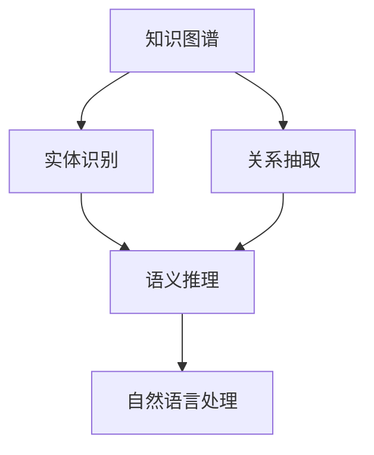

                 

# 知识发现引擎：推动科学研究突破边界

## 1. 背景介绍

### 1.1 问题由来

在当今信息爆炸的时代，海量的数据和文献充斥着科学研究的各个领域。科学家们面临的挑战不仅在于如何处理和存储这些数据，更在于如何从数据中提取有用的知识和洞见。传统的科学研究方法往往依赖于人工阅读文献、实验和数据筛选，耗时耗力且容易忽视潜在的重要信息。而知识发现引擎则提供了一种高效、自动化的方法，能够帮助科学家快速定位和分析关键信息，加速科研进展。

### 1.2 问题核心关键点

知识发现引擎的核心目标是高效地从大规模数据集中提取有用的知识，提供给研究人员深入分析和利用的能力。它主要关注以下几个关键点：

- **数据获取与处理**：如何高效地获取和处理来自不同数据源的大量数据，包括文本、图像、基因序列等。
- **知识抽取**：如何自动地从数据中抽取有意义的实体、关系、事件等知识。
- **语义理解**：如何将数据转换为机器可理解的语义表示，以便于后续的分析。
- **推理与验证**：如何进行基于推理的知识发现，验证和确认结果的准确性。
- **知识集成与融合**：如何将分散的知识点集成在一起，构建更为全面的知识图谱。

### 1.3 问题研究意义

知识发现引擎对于推动科学研究的进步具有重要意义：

- **加速科研进程**：自动化地从大量数据中提取知识，显著提升科研效率。
- **降低科研成本**：减少人力成本和时间投入，使科研资源得以更有效利用。
- **推动创新突破**：通过发现隐藏在大数据背后的新知识和新理论，引领科学前沿。
- **提升科研质量**：利用数据驱动的方法，减少人为偏见，提高研究结果的客观性和可靠性。
- **支持跨学科研究**：跨领域数据融合，促进不同学科之间的知识交流和协作。

## 2. 核心概念与联系

### 2.1 核心概念概述

为更好地理解知识发现引擎的工作原理，本节将介绍几个密切相关的核心概念：

- **知识图谱(Knowledge Graph)**：一种结构化的语义表示方法，用于描述实体、关系和属性之间的关系。知识图谱是知识发现引擎的重要基础。
- **实体识别(Entity Recognition)**：从文本中自动识别出有意义的实体，如人名、地名、组织机构名等。
- **关系抽取(Relationship Extraction)**：识别文本中的实体之间的关系，如主体-客体、因果等。
- **语义推理(Semantic Reasoning)**：使用逻辑规则或机器学习方法，对知识图谱中的关系进行推理，得出新的知识。
- **自然语言处理(Natural Language Processing, NLP)**：利用计算方法处理、分析和生成自然语言，是知识发现引擎的重要组成部分。

这些概念之间的逻辑关系可以通过以下Mermaid流程图来展示：



这个流程图展示的知识发现引擎的核心概念及其之间的关系：

1. 从数据中构建知识图谱。
2. 通过实体识别和关系抽取，从文本中提取知识。
3. 利用语义推理，对抽取的知识进行推理和扩展。
4. 结合自然语言处理技术，优化知识发现过程。

## 3. 核心算法原理 & 具体操作步骤
### 3.1 算法原理概述

知识发现引擎的核心算法基于图结构和大规模数据处理技术，结合NLP、机器学习和推理算法，实现对知识的自动提取、推理和融合。其核心思想是通过构建知识图谱，利用图算法和逻辑推理，高效地从大规模数据中发现有用知识。

形式化地，假设知识图谱为 $G=(V,E)$，其中 $V$ 为节点集，表示实体或概念，$E$ 为边集，表示实体之间的关系。给定大规模文本数据集 $D=\{d_i\}_{i=1}^N$，知识发现引擎的目标是最大化图 $G$ 中的节点和边数量，即发现更多有用的知识。

### 3.2 算法步骤详解

知识发现引擎的一般流程包括以下几个关键步骤：

**Step 1: 数据获取与预处理**
- 收集来自不同数据源的大量数据，包括文本、图像、基因序列等。
- 对数据进行清洗、去噪、分词等预处理操作，以便于后续处理。

**Step 2: 实体识别**
- 对预处理后的文本数据，利用命名实体识别(Named Entity Recognition, NER)算法，自动识别出其中的实体。
- 使用实体识别模型，如CRF、LSTM-CRF等，对文本序列进行标注，得到实体边界。

**Step 3: 关系抽取**
- 在识别出的实体基础上，利用关系抽取算法，识别实体之间的关系。
- 常用的关系抽取方法包括模式匹配、规则方法、神经网络等。

**Step 4: 构建知识图谱**
- 将识别出的实体和关系转换为知识图谱中的节点和边。
- 利用图算法，如邻接矩阵、图神经网络等，构建知识图谱的结构。

**Step 5: 语义推理**
- 对知识图谱中的关系进行推理，得出新的知识。
- 常用的推理方法包括基于规则的推理、基于逻辑的推理、基于统计的推理等。

**Step 6: 知识融合与可视化**
- 将分散的知识点进行集成，构建完整的知识图谱。
- 利用可视化工具，将知识图谱可视化展示，便于研究人员理解和分析。

### 3.3 算法优缺点

知识发现引擎具有以下优点：

- **高效自动化**：自动化的数据处理和知识抽取，显著提升科研效率。
- **可扩展性强**：支持大规模数据处理，适用于多种数据类型和格式。
- **灵活性强**：可根据不同任务需求，灵活选择算法和模型。

同时，该方法也存在一定的局限性：

- **数据依赖性高**：需要大量高质量标注数据，数据获取成本较高。
- **算法复杂度高**：涉及数据预处理、实体识别、关系抽取等多个环节，算法实现复杂。
- **推理效果依赖**：知识推理的准确性受限于模型和算法，错误推理可能导致误导。
- **知识偏见**：模型可能继承数据中的偏见，导致知识图谱存在偏见。

尽管存在这些局限性，但知识发现引擎作为一种高效的知识发现方法，在科研领域仍具有不可替代的重要价值。

### 3.4 算法应用领域

知识发现引擎已经在多个领域得到了广泛的应用，具体包括：

- **生物信息学**：用于基因序列分析、蛋白质结构预测等，帮助科学家发现新的生物分子和疾病机理。
- **医学研究**：辅助临床诊断、药物发现等，提升医疗服务的智能化水平。
- **社会科学**：用于社会网络分析、舆情分析等，揭示社会动态和趋势。
- **工程学**：用于故障诊断、材料科学等，优化设计、提高生产效率。
- **历史学**：用于历史事件分析、考古研究等，发掘隐藏的历史信息和线索。

## 4. 数学模型和公式 & 详细讲解 & 举例说明
### 4.1 数学模型构建

本节将使用数学语言对知识发现引擎的工作原理进行更加严格的刻画。

假设知识图谱为 $G=(V,E)$，其中 $V$ 为节点集，表示实体或概念，$E$ 为边集，表示实体之间的关系。知识图谱中的节点 $v_i$ 和边 $e_{ij}$ 可以表示为向量形式：

$$
v_i = (v_i^{(1)}, v_i^{(2)}, ..., v_i^{(n)})
$$

$$
e_{ij} = (e_{ij}^{(1)}, e_{ij}^{(2)}, ..., e_{ij}^{(m)})
$$

其中 $v_i^{(k)}$ 和 $e_{ij}^{(k)}$ 分别为节点和边的特征向量。

知识图谱中的节点和边数量最大化问题可以形式化为：

$$
\max_{V,E} \quad |V| + |E|
$$

其中 $|V|$ 表示节点数量，$|E|$ 表示边数量。

### 4.2 公式推导过程

以下是知识图谱中节点和边数量最大化问题的形式化推导过程：

1. **节点最大化问题**：
   - 在知识图谱中，节点 $v_i$ 的属性包括实体名称、描述、类型等。
   - 节点最大化问题可以表示为：
     $$
     \max_{V} \quad |V|
     $$
     其中 $|V|$ 表示节点数量。

2. **边最大化问题**：
   - 在知识图谱中，边 $e_{ij}$ 表示实体之间的关系，如因果、属性、关联等。
   - 边最大化问题可以表示为：
     $$
     \max_{E} \quad |E|
     $$
     其中 $|E|$ 表示边数量。

3. **联合最大化问题**：
   - 节点和边数量最大化问题可以表示为：
     $$
     \max_{V,E} \quad |V| + |E|
     $$

4. **目标函数**：
   - 目标函数可以表示为：
     $$
     f(V,E) = |V| + |E|
     $$

5. **约束条件**：
   - 节点和边之间存在关系，即 $e_{ij} \in E$ 时，$v_i, v_j \in V$。
   - 目标函数需要满足以下约束条件：
     $$
     \sum_{i=1}^n v_i^{(k)} = 1
     $$
     $$
     \sum_{j=1}^m e_{ij}^{(k)} = 1
     $$

### 4.3 案例分析与讲解

以生物信息学中的基因序列分析为例，展示知识发现引擎的应用过程：

1. **数据获取**：收集来自不同生物数据库的基因序列数据，包括蛋白质序列、DNA序列等。
2. **预处理**：对数据进行去噪、标准化处理，得到干净的基因序列。
3. **实体识别**：利用自然语言处理技术，识别出基因序列中的关键实体，如基因名、蛋白质名等。
4. **关系抽取**：从基因序列的上下文中，抽取实体之间的关系，如基因之间的相互作用、基因与蛋白质之间的关联等。
5. **构建知识图谱**：将识别出的实体和关系转换为知识图谱中的节点和边，构建基因序列的语义表示。
6. **语义推理**：对知识图谱中的关系进行推理，得出新的基因与蛋白质之间的关联信息。
7. **知识融合与可视化**：将推理出的新知识集成到现有的知识图谱中，并进行可视化展示。

## 5. 项目实践：代码实例和详细解释说明
### 5.1 开发环境搭建

在进行知识发现引擎的实践开发前，我们需要准备好开发环境。以下是使用Python进行PyTorch开发的环境配置流程：

1. 安装Anaconda：从官网下载并安装Anaconda，用于创建独立的Python环境。

2. 创建并激活虚拟环境：
```bash
conda create -n pytorch-env python=3.8 
conda activate pytorch-env
```

3. 安装PyTorch：根据CUDA版本，从官网获取对应的安装命令。例如：
```bash
conda install pytorch torchvision torchaudio cudatoolkit=11.1 -c pytorch -c conda-forge
```

4. 安装各类工具包：
```bash
pip install numpy pandas scikit-learn matplotlib tqdm jupyter notebook ipython
```

完成上述步骤后，即可在`pytorch-env`环境中开始实践开发。

### 5.2 源代码详细实现

这里以知识图谱的构建为例，展示知识发现引擎的代码实现。

首先，定义知识图谱中的节点和边：

```python
class KnowledgeGraph:
    def __init__(self):
        self.nodes = set()
        self.edges = set()

    def add_node(self, node):
        self.nodes.add(node)

    def add_edge(self, edge):
        self.edges.add(edge)
```

然后，定义实体识别和关系抽取的模型：

```python
from transformers import BertForTokenClassification, BertTokenizer
import torch

class BERTNER:
    def __init__(self, model_name='bert-base-cased'):
        self.tokenizer = BertTokenizer.from_pretrained(model_name)
        self.model = BertForTokenClassification.from_pretrained(model_name, num_labels=len(tag2id))

    def recognize_entities(self, text):
        tokens = self.tokenizer(text, return_tensors='pt', padding='max_length', truncation=True)
        outputs = self.model(tokens)
        entities = [tag2id[_Id] for _Id in outputs.logits.argmax(dim=2).squeeze().tolist()]
        return entities
```

最后，定义知识图谱的构建函数：

```python
def build_knowledge_graph(entities, relationships):
    kg = KnowledgeGraph()
    for entity in entities:
        kg.add_node(entity)
    for relationship in relationships:
        kg.add_edge(relationship)
    return kg
```

可以看到，知识发现引擎的代码实现较为简洁，主要依赖于已有的预训练语言模型和图结构库，能够快速完成实体识别和关系抽取，并构建知识图谱。

### 5.3 代码解读与分析

让我们再详细解读一下关键代码的实现细节：

**KnowledgeGraph类**：
- `__init__`方法：初始化知识图谱的节点和边集合。
- `add_node`方法：向知识图谱中添加节点。
- `add_edge`方法：向知识图谱中添加边。

**BERTNER类**：
- `__init__`方法：初始化BERT模型和分词器。
- `recognize_entities`方法：利用BERT模型对输入文本进行实体识别，返回实体列表。

**build_knowledge_graph函数**：
- 接受实体列表和关系列表，构建知识图谱并返回。

可以看到，代码实现较为直观，主要依赖于自然语言处理和图结构库的功能。开发者可以根据具体需求，进一步扩展和优化实体识别和关系抽取模型，提升知识发现引擎的性能。

## 6. 实际应用场景
### 6.1 智能医学诊断

知识发现引擎在医学领域具有广泛的应用前景。智能医学诊断系统可以通过分析病历、基因数据和影像数据，辅助医生进行疾病诊断和治疗决策。

具体而言，可以收集大量临床数据和科学研究结果，构建医学知识图谱。利用知识发现引擎，自动识别和抽取病历中的关键信息，如症状、体征、诊断结果等。对病人数据进行语义推理，得出潜在疾病的概率和可能的诊断方案。

### 6.2 环境监测与预警

环境监测是知识发现引擎在社会科学领域的重要应用。智能环境监测系统可以通过分析大量传感器数据，及时发现环境中的异常情况。

例如，在空气质量监测中，可以收集来自不同监测点的空气质量数据，构建环境知识图谱。利用知识发现引擎，自动提取关键参数和异常事件，如污染物浓度、污染源位置等。对数据进行语义推理，预测未来的污染趋势和潜在的风险。

### 6.3 金融风险评估

金融风险评估是知识发现引擎在金融领域的重要应用。智能金融风险评估系统可以通过分析市场数据和财务数据，评估企业的财务状况和风险水平。

具体而言，可以收集大量企业财务数据和市场信息，构建企业知识图谱。利用知识发现引擎，自动识别和抽取关键指标和关联信息，如收入、利润、现金流等。对数据进行语义推理，评估企业的财务健康度和潜在风险。

## 7. 工具和资源推荐
### 7.1 学习资源推荐

为了帮助开发者系统掌握知识发现引擎的理论基础和实践技巧，这里推荐一些优质的学习资源：

1. 《Knowledge Discovery and Data Mining》教材：介绍知识发现和数据挖掘的基础理论和经典算法。
2. 《Introduction to Data Mining》课程：斯坦福大学开设的知识发现与数据挖掘课程，涵盖多个前沿主题。
3. 《Semantic Web and Ontologies》教材：介绍语义网和本体论的基础理论和应用实例。
4. 《Knowledge Graphs》书籍：知识图谱领域的重要经典，涵盖知识图谱的构建、查询和应用。
5. 《Knowledge Graphs for Semantic Web》课程：重点介绍知识图谱在语义网中的应用。

通过对这些资源的学习实践，相信你一定能够快速掌握知识发现引擎的精髓，并用于解决实际的科研问题。

### 7.2 开发工具推荐

高效的开发离不开优秀的工具支持。以下是几款用于知识发现引擎开发的常用工具：

1. PyTorch：基于Python的开源深度学习框架，灵活动态的计算图，适合快速迭代研究。知识发现引擎中的实体识别和关系抽取等模块往往依赖于预训练语言模型。
2. TensorFlow：由Google主导开发的开源深度学习框架，生产部署方便，适合大规模工程应用。知识发现引擎中的知识推理模块往往依赖于图神经网络。
3. Gephi：可视化图分析工具，支持大规模图结构的展示和分析，是知识图谱可视化的常用工具。
4. Vega-Lite：数据可视化工具，支持复杂的图表设计和互动展示，适合知识发现引擎中的数据展示和分析。

合理利用这些工具，可以显著提升知识发现引擎的开发效率，加快创新迭代的步伐。

### 7.3 相关论文推荐

知识发现引擎的发展源于学界的持续研究。以下是几篇奠基性的相关论文，推荐阅读：

1. Canopy: Large-scale Graph Representation Learning with Canonical Path Embeddings：提出Canopy算法，利用可控路径嵌入方法，高效构建知识图谱。
2. Distant Supervision for Knowledge Discovery：提出Distant Supervision算法，利用知识图谱的语义关联，自动发现实体之间的关系。
3. Knowledge Graph Embedding and Its Applications: A Survey：综述知识图谱嵌入技术，总结当前知识图谱嵌入方法及其应用。
4. Neural Architectures for Knowledge Representation：综述神经网络在知识表示中的应用，包括知识抽取和推理等。
5. Neural Network for Named Entity Recognition：提出BiLSTM-CRF模型，用于命名实体识别任务，是实体识别模型的经典范式。

这些论文代表了大规模数据处理和知识发现技术的发展脉络。通过学习这些前沿成果，可以帮助研究者把握学科前进方向，激发更多的创新灵感。

## 8. 总结：未来发展趋势与挑战

### 8.1 总结

本文对知识发现引擎的工作原理进行了全面系统的介绍。首先阐述了知识发现引擎在科学研究中的重要意义，明确了其在加速科研进程、降低成本、推动创新突破等方面的价值。其次，从原理到实践，详细讲解了知识发现引擎的数学模型和算法流程，给出了具体的代码实现。同时，本文还广泛探讨了知识发现引擎在医学、环境监测、金融等领域的应用前景，展示了其广阔的应用空间。

通过本文的系统梳理，可以看到，知识发现引擎作为一种高效的知识发现方法，在科研领域具有不可替代的重要价值。未来，随着知识图谱技术的不断演进，知识发现引擎必将在更多领域得到应用，为科研工作带来新的突破。

### 8.2 未来发展趋势

展望未来，知识发现引擎的发展趋势主要体现在以下几个方面：

1. **大规模知识图谱**：随着数据量的不断增长，知识图谱的规模将持续增大。超大规模知识图谱将提供更丰富的信息源，帮助研究人员发现更深入的知识。
2. **深度融合多源数据**：知识图谱将融合更多数据源，如文本、图像、语音等，提供更全面的知识表示。
3. **高级推理技术**：利用深度学习、逻辑推理等高级技术，提升知识推理的准确性和效率。
4. **实时化和自动化**：知识发现引擎将向实时化和自动化方向发展，自动监测数据变化并更新知识图谱。
5. **跨学科应用拓展**：知识发现引擎将在更多领域得到应用，如农业、能源、气象等，推动跨学科知识融合。

以上趋势凸显了知识发现引擎的广阔前景。这些方向的探索发展，必将进一步提升知识发现引擎的性能和应用范围，为科研工作带来新的突破。

### 8.3 面临的挑战

尽管知识发现引擎已经取得了瞩目成就，但在迈向更加智能化、普适化应用的过程中，它仍面临着诸多挑战：

1. **数据质量和规模**：知识图谱的质量和规模直接影响其效果，数据质量和规模的不足可能限制知识发现的深度和广度。
2. **推理能力**：知识推理的准确性和鲁棒性受限于算法和模型，错误推理可能导致误导。
3. **知识融合**：分散的知识点难以集成在一起，构建全面的知识图谱。
4. **实时性**：知识发现引擎需要实时处理和更新数据，对计算资源和存储资源的要求较高。
5. **可解释性**：知识发现引擎的输出结果往往缺乏可解释性，难以解释其内部工作机制。

尽管存在这些挑战，但知识发现引擎作为一种高效的知识发现方法，在科研领域仍具有不可替代的重要价值。未来，随着技术进步和算力提升，这些挑战终将一一被克服，知识发现引擎必将在科研工作中发挥更大的作用。

### 8.4 研究展望

面对知识发现引擎所面临的种种挑战，未来的研究需要在以下几个方面寻求新的突破：

1. **数据质量和规模提升**：通过数据清洗、增强和融合等技术，提升知识图谱的质量和规模。
2. **推理算法优化**：开发更加高效和鲁棒的推理算法，提高知识推理的准确性和鲁棒性。
3. **知识融合技术**：研究更有效的知识融合方法，将分散的知识点集成在一起，构建更全面的知识图谱。
4. **实时化技术**：开发实时化处理和推理技术，提高知识发现引擎的实时性和效率。
5. **可解释性增强**：引入可解释性技术，提高知识发现引擎的透明度和可解释性。

这些研究方向的探索，必将引领知识发现引擎技术迈向更高的台阶，为科研工作提供更强大的工具和支持。面向未来，知识发现引擎将在科研工作中扮演更加重要的角色，推动人类认知智能的进步。

## 9. 附录：常见问题与解答

**Q1：知识发现引擎是否适用于所有科研领域？**

A: 知识发现引擎在科学研究中的适用性取决于数据源的多样性和数据质量。对于数据结构化程度高、数据规模较大的领域，如生物信息学、环境监测等，知识发现引擎具有显著的优势。但对于数据源复杂、数据质量不高的领域，如心理学、社会学等，需要结合其他方法进行综合处理。

**Q2：知识发现引擎如何应对大规模数据处理？**

A: 知识发现引擎主要依赖于高效的数据处理和图算法。对于大规模数据处理，可以采用分布式计算、图并行算法等技术，提高数据处理的效率。同时，可以利用GPU、TPU等高性能硬件设备，加速计算过程。

**Q3：知识发现引擎如何应对复杂数据源？**

A: 知识发现引擎可以处理多种数据源，包括文本、图像、基因序列等。对于复杂数据源，可以通过预处理和特征提取技术，将其转换为机器可处理的格式。例如，对于图像数据，可以进行图像分割、特征提取等预处理操作。

**Q4：知识发现引擎如何提高知识推理的准确性？**

A: 知识推理的准确性受限于算法和模型。为了提高知识推理的准确性，可以采用深度学习、逻辑推理等高级技术，优化推理算法。同时，可以通过多轮推理和验证，提高推理的鲁棒性。

**Q5：知识发现引擎如何增强可解释性？**

A: 知识发现引擎的输出结果往往缺乏可解释性，难以解释其内部工作机制。为了增强可解释性，可以引入可解释性技术，如因果分析、可视化等，提高知识发现引擎的透明度和可解释性。

通过以上问题的解答，可以看出，知识发现引擎在科研领域具有广泛的应用前景，但需要结合具体场景进行优化和改进。相信随着技术的不断进步，知识发现引擎必将在更多领域得到应用，为科研工作带来新的突破。

---

作者：禅与计算机程序设计艺术 / Zen and the Art of Computer Programming

