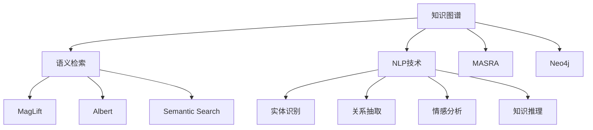

                 

# 知识管理软件：知识发现引擎的智能化应用

> 关键词：知识发现,知识图谱,语义检索,人工智能,自然语言处理

## 1. 背景介绍

在当今信息爆炸的时代，海量数据呈现出爆炸式增长的趋势，如何高效地管理和利用这些数据，成为企业和组织面临的重大挑战。知识管理软件应运而生，它通过对数据的智能化分析和处理，帮助用户从复杂的信息海洋中快速获取所需知识，提升决策效率和竞争优势。

知识发现引擎作为知识管理软件的核心组件，通过构建知识图谱、进行语义检索和分析，实现了知识的高效提取和应用。然而，传统知识发现引擎存在一定的局限性，如结构化数据依赖性强、知识获取依赖人工标注等。随着人工智能技术的不断成熟，知识发现引擎的智能化应用成为新的发展趋势，利用机器学习、深度学习等技术，从无结构化数据中自动提取知识，提升知识发现的速度和精度。

本文将深入探讨知识发现引擎的智能化应用，介绍其核心原理、关键技术及应用案例，并展望其未来发展方向。

## 2. 核心概念与联系

### 2.1 核心概念概述

在讨论知识发现引擎的智能化应用前，我们先明确几个核心概念及其相互联系：

- **知识图谱(Knowledge Graph)**：一种结构化的语义知识库，通过节点和边表示实体与概念间的关系。知识图谱是知识发现的基础，通过抽取和链接结构化与非结构化数据，形成知识网络，方便查询和推理。
- **语义检索(Semantic Search)**：一种智能检索技术，通过理解和分析用户查询的语义，实现与知识图谱的精准匹配。语义检索可以超越传统关键词匹配的限制，提供更为精准的知识获取方式。
- **自然语言处理(Natural Language Processing, NLP)**：一种人工智能技术，致力于让计算机理解、处理和生成自然语言。NLP在知识发现中主要用于实体识别、关系抽取、情感分析等任务。
- **机器学习(Machine Learning)**：一种数据驱动的学习方法，通过算法自动发现数据中的规律和模式。在知识发现中，机器学习常用于实体识别、关系预测等任务。
- **深度学习(Deep Learning)**：一种基于神经网络的机器学习技术，通过多层次的特征提取和模型训练，实现对复杂问题的建模和预测。深度学习在知识发现中主要用于语义理解、知识推理等任务。

这些概念之间的逻辑关系可以通过以下Mermaid流程图来展示：



这个流程图展示了几大核心概念及其相互关系：

1. 知识图谱是语义检索的基础，通过链接和表示实体间关系，实现知识的高效检索。
2. NLP技术通过识别实体、抽取关系、情感分析等，为知识图谱的构建和更新提供支持。
3. 机器学习和深度学习技术进一步提升了知识图谱和语义检索的智能化水平，使其具备更强的理解和推理能力。
4. 知识发现引擎通过集成知识图谱和语义检索，实现知识的高效发现和应用。

## 3. 核心算法原理 & 具体操作步骤

### 3.1 算法原理概述

知识发现引擎的智能化应用主要基于以下几个核心原理：

1. **知识抽取和链接**：利用NLP技术从文本数据中自动识别实体和关系，构建知识图谱。
2. **语义检索和推理**：通过理解用户查询的语义，从知识图谱中检索和推理相关信息，实现精准的知识获取。
3. **深度学习建模**：利用深度神经网络对知识图谱进行建模，提高知识推理和关系预测的准确性。
4. **迁移学习**：在不同领域和场景下，通过迁移学习技术，提升知识发现引擎的通用性和泛化能力。

### 3.2 算法步骤详解

基于上述原理，知识发现引擎的智能化应用主要包括以下几个关键步骤：

1. **数据采集和预处理**：从各种数据源（如文档、网页、社交媒体等）采集数据，并进行清洗和预处理，确保数据的质量和一致性。
2. **实体识别和关系抽取**：利用NLP技术，从文本中自动识别实体和关系，并构建知识图谱。这一步通常需要结合规则和机器学习方法，以提高识别精度和泛化能力。
3. **语义检索**：将用户查询转化为语义表示，在知识图谱中进行检索和推理，获取相关信息。语义检索过程中，需要考虑同义词、多义词、实体消歧等问题。
4. **深度学习建模**：利用深度神经网络对知识图谱进行建模，训练实体嵌入和关系嵌入，提升知识推理和关系预测的准确性。常见的深度学习模型包括BERT、GNN等。
5. **迁移学习**：在不同领域和场景下，利用迁移学习技术，提升知识发现引擎的通用性和泛化能力。通常需要结合领域知识、模型结构和数据特征，选择合适的迁移方法。

### 3.3 算法优缺点

知识发现引擎的智能化应用具有以下优点：

1. **自动化和智能化**：通过机器学习、深度学习等技术，实现了从数据到知识的自动化抽取和推理，提高了知识发现的效率和精度。
2. **泛化能力强**：基于迁移学习技术，知识发现引擎在不同领域和场景下具有良好的泛化能力，能够快速适应新的数据和任务。
3. **数据利用充分**：能够处理和利用各种数据源，包括结构化和非结构化数据，扩大了知识发现的范围和深度。
4. **用户友好**：通过语义检索技术，用户可以以自然语言的形式进行查询，提升了用户体验和知识获取的便捷性。

同时，该方法也存在一些缺点：

1. **依赖高质量数据**：知识抽取和关系抽取依赖于高质量的标注数据和NLP模型，数据噪声和模型偏差可能导致识别不准确。
2. **计算资源消耗大**：深度学习模型的训练和推理需要大量的计算资源，对硬件要求较高。
3. **模型复杂度较高**：知识图谱和深度学习模型的构建和维护较为复杂，需要专业知识和技术积累。
4. **黑盒问题**：知识发现引擎的内部工作机制较为复杂，模型的可解释性不足，难以进行有效的调试和优化。

尽管存在这些局限性，但就目前而言，知识发现引擎的智能化应用在提高知识发现的速度和精度、提升用户体验等方面，展现了显著的优势，成为知识管理软件的重要组成部分。

### 3.4 算法应用领域

知识发现引擎的智能化应用广泛覆盖了以下几个领域：

1. **医疗健康**：通过知识图谱和语义检索，实现疾病的诊断和治疗方案推荐，提升了医疗服务的智能化水平。
2. **金融服务**：利用知识图谱和深度学习建模，实现信用评分、风险预测、投资策略优化等功能，提升了金融服务的智能化和精准性。
3. **教育培训**：通过知识图谱和语义检索，实现个性化学习路径推荐、智能辅导等功能，提升了教育培训的智能化和个性化。
4. **企业决策**：利用知识图谱和语义检索，实现市场分析、竞争对手监测、业务流程优化等功能，提升了企业决策的智能化和效率。
5. **智能家居**：通过知识图谱和语义检索，实现智能家电控制、环境监测、健康管理等功能，提升了智能家居的智能化和便利性。

以上领域只是知识发现引擎智能化应用的一部分，随着技术的不断进步，知识发现引擎将深入到更多垂直行业，推动各行业的数字化转型和智能化升级。

## 4. 数学模型和公式 & 详细讲解 & 举例说明

### 4.1 数学模型构建

知识发现引擎的智能化应用涉及多个数学模型，以下将详细介绍其中的几个关键模型：

**知识抽取模型**：利用NLP技术，从文本中识别实体和关系，构建知识图谱。常用的NLP模型包括BERT、LSTM等。

**语义检索模型**：利用向量表示，将用户查询和知识图谱中的实体进行匹配和检索。常用的向量表示模型包括Word2Vec、GloVe等。

**深度学习建模模型**：利用深度神经网络对知识图谱进行建模，训练实体嵌入和关系嵌入，提升知识推理和关系预测的准确性。常见的深度学习模型包括TransE、TransH等。

**迁移学习模型**：通过迁移学习技术，在不同领域和场景下，提升知识发现引擎的泛化能力。常用的迁移学习方法包括Fine-tuning、Adaptation等。

### 4.2 公式推导过程

以知识抽取模型为例，以下是其基本的公式推导过程：

1. **实体识别**：利用BERT模型，对文本进行编码，得到每个单词的向量表示。
2. **关系抽取**：通过最大池化层，将句子中的关键信息进行聚合，得到句子级别的向量表示。
3. **知识图谱构建**：将句子向量映射为实体和关系，构建知识图谱。

以语义检索模型为例，以下是其基本的公式推导过程：

1. **查询表示**：利用BERT模型，对用户查询进行编码，得到查询向量。
2. **知识图谱表示**：利用BERT模型，对知识图谱中的实体进行编码，得到实体向量。
3. **相似度计算**：通过余弦相似度等方法，计算查询向量与实体向量的相似度，筛选出相关实体。

### 4.3 案例分析与讲解

以医疗领域为例，知识发现引擎的智能化应用可以显著提升医疗服务的智能化水平。以下是具体的案例分析：

**案例背景**：某医院希望通过知识图谱和语义检索，实现疾病的诊断和治疗方案推荐。

**解决方案**：
1. **数据采集和预处理**：从医院的历史病例、文献、网络数据等来源采集数据，并进行清洗和预处理。
2. **知识图谱构建**：利用NLP技术，从文本中自动识别疾病、症状、治疗方法等实体和关系，构建医疗知识图谱。
3. **语义检索**：将用户查询（如“头痛、咳嗽等症状”）转化为语义表示，在知识图谱中进行检索和推理，获取相关疾病和治疗方案。
4. **深度学习建模**：利用深度神经网络对医疗知识图谱进行建模，训练实体嵌入和关系嵌入，提升疾病诊断和治疗方案预测的准确性。
5. **迁移学习**：在不同医院和科室间，利用迁移学习技术，提升知识发现引擎的通用性和泛化能力。

通过知识发现引擎的智能化应用，医院能够实时获取相关疾病的诊断和治疗方案，提升诊断和治疗的精准性和效率。

## 5. 项目实践：代码实例和详细解释说明

### 5.1 开发环境搭建

在进行知识发现引擎的智能化应用开发前，我们需要准备好开发环境。以下是使用Python进行PyTorch开发的环境配置流程：

1. 安装Anaconda：从官网下载并安装Anaconda，用于创建独立的Python环境。

2. 创建并激活虚拟环境：
```bash
conda create -n pytorch-env python=3.8 
conda activate pytorch-env
```

3. 安装PyTorch：根据CUDA版本，从官网获取对应的安装命令。例如：
```bash
conda install pytorch torchvision torchaudio cudatoolkit=11.1 -c pytorch -c conda-forge
```

4. 安装各类工具包：
```bash
pip install numpy pandas scikit-learn matplotlib tqdm jupyter notebook ipython
```

完成上述步骤后，即可在`pytorch-env`环境中开始项目实践。

### 5.2 源代码详细实现

这里我们以医疗知识图谱为例，给出使用PyTorch进行知识抽取和语义检索的代码实现。

首先，定义知识抽取任务的数据处理函数：

```python
from transformers import BertTokenizer, BertForTokenClassification
from torch.utils.data import Dataset
import torch

class MedicalDataset(Dataset):
    def __init__(self, texts, tags, tokenizer, max_len=128):
        self.texts = texts
        self.tags = tags
        self.tokenizer = tokenizer
        self.max_len = max_len
        
    def __len__(self):
        return len(self.texts)
    
    def __getitem__(self, item):
        text = self.texts[item]
        tags = self.tags[item]
        
        encoding = self.tokenizer(text, return_tensors='pt', max_length=self.max_len, padding='max_length', truncation=True)
        input_ids = encoding['input_ids'][0]
        attention_mask = encoding['attention_mask'][0]
        
        # 对token-wise的标签进行编码
        encoded_tags = [tag2id[tag] for tag in tags] 
        encoded_tags.extend([tag2id['O']] * (self.max_len - len(encoded_tags)))
        labels = torch.tensor(encoded_tags, dtype=torch.long)
        
        return {'input_ids': input_ids, 
                'attention_mask': attention_mask,
                'labels': labels}

# 标签与id的映射
tag2id = {'O': 0, 'B-DISEASE': 1, 'I-DISEASE': 2, 'B-SYMPTOM': 3, 'I-SYMPTOM': 4, 'B-METHOD': 5, 'I-METHOD': 6}
id2tag = {v: k for k, v in tag2id.items()}

# 创建dataset
tokenizer = BertTokenizer.from_pretrained('bert-base-cased')

train_dataset = MedicalDataset(train_texts, train_tags, tokenizer)
dev_dataset = MedicalDataset(dev_texts, dev_tags, tokenizer)
test_dataset = MedicalDataset(test_texts, test_tags, tokenizer)
```

然后，定义模型和优化器：

```python
from transformers import BertForTokenClassification, AdamW

model = BertForTokenClassification.from_pretrained('bert-base-cased', num_labels=len(tag2id))

optimizer = AdamW(model.parameters(), lr=2e-5)
```

接着，定义训练和评估函数：

```python
from torch.utils.data import DataLoader
from tqdm import tqdm
from sklearn.metrics import classification_report

device = torch.device('cuda') if torch.cuda.is_available() else torch.device('cpu')
model.to(device)

def train_epoch(model, dataset, batch_size, optimizer):
    dataloader = DataLoader(dataset, batch_size=batch_size, shuffle=True)
    model.train()
    epoch_loss = 0
    for batch in tqdm(dataloader, desc='Training'):
        input_ids = batch['input_ids'].to(device)
        attention_mask = batch['attention_mask'].to(device)
        labels = batch['labels'].to(device)
        model.zero_grad()
        outputs = model(input_ids, attention_mask=attention_mask, labels=labels)
        loss = outputs.loss
        epoch_loss += loss.item()
        loss.backward()
        optimizer.step()
    return epoch_loss / len(dataloader)

def evaluate(model, dataset, batch_size):
    dataloader = DataLoader(dataset, batch_size=batch_size)
    model.eval()
    preds, labels = [], []
    with torch.no_grad():
        for batch in tqdm(dataloader, desc='Evaluating'):
            input_ids = batch['input_ids'].to(device)
            attention_mask = batch['attention_mask'].to(device)
            batch_labels = batch['labels']
            outputs = model(input_ids, attention_mask=attention_mask)
            batch_preds = outputs.logits.argmax(dim=2).to('cpu').tolist()
            batch_labels = batch_labels.to('cpu').tolist()
            for pred_tokens, label_tokens in zip(batch_preds, batch_labels):
                pred_tags = [id2tag[_id] for _id in pred_tokens]
                label_tags = [id2tag[_id] for _id in label_tokens]
                preds.append(pred_tags[:len(label_tags)])
                labels.append(label_tags)
                
    print(classification_report(labels, preds))
```

最后，启动训练流程并在测试集上评估：

```python
epochs = 5
batch_size = 16

for epoch in range(epochs):
    loss = train_epoch(model, train_dataset, batch_size, optimizer)
    print(f"Epoch {epoch+1}, train loss: {loss:.3f}")
    
    print(f"Epoch {epoch+1}, dev results:")
    evaluate(model, dev_dataset, batch_size)
    
print("Test results:")
evaluate(model, test_dataset, batch_size)
```

以上就是使用PyTorch对医疗领域知识图谱进行知识抽取和语义检索的完整代码实现。可以看到，利用NLP和深度学习技术，我们能够从文本数据中自动抽取和检索医疗知识，提升医疗服务的智能化水平。

### 5.3 代码解读与分析

让我们再详细解读一下关键代码的实现细节：

**MedicalDataset类**：
- `__init__`方法：初始化文本、标签、分词器等关键组件。
- `__len__`方法：返回数据集的样本数量。
- `__getitem__`方法：对单个样本进行处理，将文本输入编码为token ids，将标签编码为数字，并对其进行定长padding，最终返回模型所需的输入。

**tag2id和id2tag字典**：
- 定义了标签与数字id之间的映射关系，用于将token-wise的预测结果解码回真实的标签。

**训练和评估函数**：
- 使用PyTorch的DataLoader对数据集进行批次化加载，供模型训练和推理使用。
- 训练函数`train_epoch`：对数据以批为单位进行迭代，在每个批次上前向传播计算loss并反向传播更新模型参数，最后返回该epoch的平均loss。
- 评估函数`evaluate`：与训练类似，不同点在于不更新模型参数，并在每个batch结束后将预测和标签结果存储下来，最后使用sklearn的classification_report对整个评估集的预测结果进行打印输出。

**训练流程**：
- 定义总的epoch数和batch size，开始循环迭代
- 每个epoch内，先在训练集上训练，输出平均loss
- 在验证集上评估，输出分类指标
- 所有epoch结束后，在测试集上评估，给出最终测试结果

可以看到，PyTorch配合Transformers库使得知识抽取和语义检索的代码实现变得简洁高效。开发者可以将更多精力放在数据处理、模型改进等高层逻辑上，而不必过多关注底层的实现细节。

当然，工业级的系统实现还需考虑更多因素，如模型的保存和部署、超参数的自动搜索、更灵活的任务适配层等。但核心的知识抽取和语义检索过程基本与此类似。

## 6. 实际应用场景

### 6.1 医疗健康

在医疗领域，知识图谱和语义检索的应用非常广泛。通过构建医疗知识图谱，医生可以快速获取患者的疾病、症状和治疗方案，提升诊断和治疗的精准性和效率。

以医疗问答系统为例，系统通过语义检索技术，理解用户提出的医疗问题，从知识图谱中检索相关信息，并给出专业解答。在实际应用中，可以将知识图谱部署在云端，通过API接口供用户查询，提升医疗服务的智能化和便利性。

### 6.2 金融服务

金融领域对知识发现引擎的需求也非常迫切。通过构建金融知识图谱，金融机构可以快速获取市场动态、公司信息、风险评估等关键信息，提升投资决策的精准性和效率。

以金融风险评估系统为例，系统通过语义检索技术，理解用户提出的公司或市场信息，从知识图谱中检索和预测相关信息，评估投资风险。在实际应用中，可以结合用户的行为数据，实时更新知识图谱，提升系统的实时性和精准性。

### 6.3 教育培训

教育领域对知识发现引擎的需求也不断增加。通过构建教育知识图谱，教育机构可以快速获取课程、教材、考试等信息，提升教学质量和学习效果。

以个性化学习系统为例，系统通过语义检索技术，理解用户的学习需求和兴趣，从知识图谱中检索和推荐相关课程和教材。在实际应用中，可以结合学生的学习行为数据，动态调整推荐策略，提升个性化学习的精准性和效率。

### 6.4 企业决策

企业决策领域对知识发现引擎的需求也越来越高。通过构建企业知识图谱，企业可以快速获取市场分析、竞争对手监测、业务流程优化等信息，提升决策的智能化和效率。

以市场分析系统为例，系统通过语义检索技术，理解用户提出的市场信息，从知识图谱中检索和预测相关信息，分析市场趋势和变化。在实际应用中，可以结合用户的行为数据，实时更新知识图谱，提升系统的实时性和精准性。

## 7. 工具和资源推荐

### 7.1 学习资源推荐

为了帮助开发者系统掌握知识发现引擎的智能化应用，这里推荐一些优质的学习资源：

1. 《自然语言处理综论》系列博文：由大模型技术专家撰写，深入浅出地介绍了NLP原理、BERT模型、语义检索等前沿话题。

2. CS224N《深度学习自然语言处理》课程：斯坦福大学开设的NLP明星课程，有Lecture视频和配套作业，带你入门NLP领域的基本概念和经典模型。

3. 《深度学习与自然语言处理》书籍：深度学习专家所著，全面介绍了深度学习在NLP领域的应用，包括知识图谱、语义检索等。

4. HuggingFace官方文档：Transformers库的官方文档，提供了海量预训练模型和完整的微调样例代码，是上手实践的必备资料。

5. CLUE开源项目：中文语言理解测评基准，涵盖大量不同类型的中文NLP数据集，并提供了基于知识图谱和语义检索的baseline模型，助力中文NLP技术发展。

通过对这些资源的学习实践，相信你一定能够快速掌握知识发现引擎的智能化应用，并用于解决实际的NLP问题。

### 7.2 开发工具推荐

高效的开发离不开优秀的工具支持。以下是几款用于知识发现引擎智能化应用开发的常用工具：

1. PyTorch：基于Python的开源深度学习框架，灵活动态的计算图，适合快速迭代研究。大部分预训练语言模型都有PyTorch版本的实现。

2. TensorFlow：由Google主导开发的开源深度学习框架，生产部署方便，适合大规模工程应用。同样有丰富的预训练语言模型资源。

3. Transformers库：HuggingFace开发的NLP工具库，集成了众多SOTA语言模型，支持PyTorch和TensorFlow，是进行知识抽取和语义检索开发的利器。

4. Weights & Biases：模型训练的实验跟踪工具，可以记录和可视化模型训练过程中的各项指标，方便对比和调优。与主流深度学习框架无缝集成。

5. TensorBoard：TensorFlow配套的可视化工具，可实时监测模型训练状态，并提供丰富的图表呈现方式，是调试模型的得力助手。

6. Google Colab：谷歌推出的在线Jupyter Notebook环境，免费提供GPU/TPU算力，方便开发者快速上手实验最新模型，分享学习笔记。

合理利用这些工具，可以显著提升知识发现引擎智能化应用开发的速度和效率，加速创新迭代的步伐。

### 7.3 相关论文推荐

知识发现引擎的智能化应用源于学界的持续研究。以下是几篇奠基性的相关论文，推荐阅读：

1. Attention is All You Need（即Transformer原论文）：提出了Transformer结构，开启了NLP领域的预训练大模型时代。

2. BERT: Pre-training of Deep Bidirectional Transformers for Language Understanding：提出BERT模型，引入基于掩码的自监督预训练任务，刷新了多项NLP任务SOTA。

3. Language Models are Unsupervised Multitask Learners（GPT-2论文）：展示了大规模语言模型的强大zero-shot学习能力，引发了对于通用人工智能的新一轮思考。

4. Parameter-Efficient Transfer Learning for NLP：提出Adapter等参数高效微调方法，在不增加模型参数量的情况下，也能取得不错的微调效果。

5. Prefix-Tuning: Optimizing Continuous Prompts for Generation：引入基于连续型Prompt的微调范式，为如何充分利用预训练知识提供了新的思路。

6. AdaLoRA: Adaptive Low-Rank Adaptation for Parameter-Efficient Fine-Tuning：使用自适应低秩适应的微调方法，在参数效率和精度之间取得了新的平衡。

这些论文代表了大语言模型微调技术的发展脉络。通过学习这些前沿成果，可以帮助研究者把握学科前进方向，激发更多的创新灵感。

## 8. 总结：未来发展趋势与挑战

### 8.1 总结

本文对知识发现引擎的智能化应用进行了全面系统的介绍。首先阐述了知识发现引擎在知识管理软件中的核心作用，明确了其智能化应用的价值和意义。其次，从原理到实践，详细讲解了知识抽取、语义检索和深度学习建模等核心步骤，给出了知识抽取和语义检索的代码实例。同时，本文还广泛探讨了知识发现引擎在医疗健康、金融服务、教育培训、企业决策等诸多领域的应用前景，展示了其广阔的应用空间。最后，本文精选了知识发现引擎的学习资源、开发工具和相关论文，力求为读者提供全方位的技术指引。

通过本文的系统梳理，可以看到，知识发现引擎的智能化应用为知识管理软件注入了新的活力，显著提升了知识获取的速度和精度，推动了各行业的数字化转型和智能化升级。

### 8.2 未来发展趋势

展望未来，知识发现引擎的智能化应用将呈现以下几个发展趋势：

1. **多模态知识抽取**：未来的知识抽取不仅限于文本数据，还将拓展到图像、视频、音频等多模态数据。通过多模态融合，提升知识发现引擎的泛化能力和应用范围。

2. **深度学习与知识图谱的结合**：深度学习模型将更深入地嵌入知识图谱中，提升实体嵌入和关系嵌入的精度，提高知识推理和关系预测的准确性。

3. **模型可解释性和透明化**：未来的知识发现引擎将更加注重模型的可解释性和透明化，提升用户对模型的信任和接受度。

4. **知识图谱的实时更新**：未来的知识图谱将具备实时更新和动态维护的能力，能够快速吸收和融合最新的知识，提升系统的实时性和精准性。

5. **边缘计算的应用**：随着物联网设备的普及，知识发现引擎将更多地应用到边缘计算中，提升推理效率和数据安全。

6. **AI伦理和安全**：未来的知识发现引擎将更加注重AI伦理和安全问题，确保系统的公正性、透明性和安全性。

以上趋势凸显了知识发现引擎智能化应用的广阔前景。这些方向的探索发展，必将进一步提升知识发现引擎的性能和应用范围，为知识管理软件带来新的突破。

### 8.3 面临的挑战

尽管知识发现引擎的智能化应用取得了显著进展，但在迈向更加智能化、普适化应用的过程中，仍面临诸多挑战：

1. **数据质量和多样性**：知识抽取和语义检索依赖于高质量、多样化的数据，对于长尾数据和复杂实体关系难以有效处理。如何提升数据质量和多样性，是未来的重要课题。

2. **模型复杂度和资源消耗**：深度学习模型的训练和推理需要大量的计算资源，对硬件要求较高。如何在保持高性能的同时，降低资源消耗，是未来的研究方向。

3. **模型可解释性和透明化**：知识发现引擎的内部工作机制较为复杂，模型的可解释性不足，难以进行有效的调试和优化。如何提升模型的可解释性，是未来的重要挑战。

4. **知识图谱的实时性和动态性**：知识图谱的构建和维护较为复杂，如何实现实时更新和动态维护，提升系统的实时性和泛化能力，是未来的重要课题。

5. **知识图谱的安全性和隐私保护**：知识图谱的构建和应用过程中，涉及大量敏感信息，如何确保数据安全和隐私保护，是未来的重要方向。

尽管存在这些挑战，但伴随技术不断进步和积累，未来的知识发现引擎将更加智能化、普适化，为知识管理软件注入新的活力。

### 8.4 研究展望

面向未来，知识发现引擎的研究方向可以从以下几个方面进行探索：

1. **无监督学习和自监督学习**：通过无监督学习和自监督学习，从无标签数据中自动发现和抽取知识，减少对标注数据的依赖。

2. **多模态知识融合**：将视觉、听觉、文本等多种模态的信息进行融合，提升知识发现引擎的泛化能力和应用范围。

3. **知识图谱的自动化构建**：通过自动化的知识和图谱构建方法，减少人工标注和构建的劳动，提升知识发现引擎的自动化水平。

4. **知识推理的智能化**：通过深度学习等技术，提升知识推理的智能化水平，实现自动化的知识推理和决策支持。

5. **AI伦理和社会责任**：在知识发现引擎的构建和应用过程中，注重AI伦理和社会责任，确保系统的公正性、透明性和安全性。

通过这些研究方向的探索，未来的知识发现引擎将具备更强的智能化和普适性，为知识管理软件带来新的突破和应用空间。

## 9. 附录：常见问题与解答

**Q1：知识图谱的构建需要大量人工标注，成本较高，如何解决？**

A: 知识图谱的构建确实需要大量人工标注，但也可以通过一些自动化和半自动化的技术来降低成本。例如，利用 crowdsourcing 平台，通过众包方式标注数据，或使用半监督学习、弱监督学习等技术，从少量标注数据中自动发现和标注实体关系。此外，还可以通过引入领域专家知识，减少人工标注的难度和成本。

**Q2：知识图谱的更新和维护较为复杂，如何解决？**

A: 知识图谱的更新和维护可以通过以下方式进行：
1. 引入持续学习和增量学习技术，使知识图谱能够自动吸收新的知识和数据，减少人工维护的频率。
2. 引入多维度的知识来源，如专家知识、社交媒体、专业论文等，增加知识图谱的多样性和全面性。
3. 引入元知识图谱，对知识图谱的构建和更新进行元数据记录和版本管理，方便后续的跟踪和维护。

**Q3：知识图谱的应用如何平衡精度和效率？**

A: 知识图谱的应用需要在精度和效率之间进行平衡。可以通过以下方式实现：
1. 使用知识压缩和简化技术，减少知识图谱的复杂度和存储量，提高查询效率。
2. 引入高效的知识推理算法，提升推理速度和精度。
3. 通过增量学习等技术，动态更新知识图谱，减少离线计算的频率。
4. 引入元数据管理技术，对知识图谱进行版本和更新记录，方便后续的查询和维护。

**Q4：知识图谱的安全性和隐私保护如何保障？**

A: 知识图谱的安全性和隐私保护可以通过以下方式保障：
1. 对知识图谱进行加密存储，确保数据的安全性。
2. 引入隐私保护技术，如差分隐私、联邦学习等，确保知识图谱中的敏感信息不被泄露。
3. 引入访问控制和审计机制，对知识图谱的访问和使用进行控制和管理。
4. 引入数据匿名化和去标识化技术，保护数据隐私。

通过以上措施，可以确保知识图谱的安全性和隐私保护，提升知识图谱的应用价值。

---

作者：禅与计算机程序设计艺术 / Zen and the Art of Computer Programming

