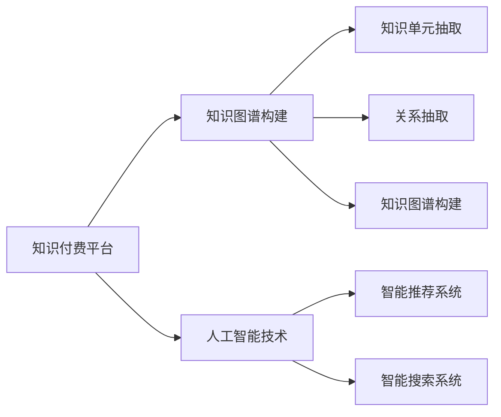

                 

# 知识经济下知识付费的人工智能知识图谱应用场景

## 1. 背景介绍

### 1.1 问题由来

在知识经济时代，知识付费正成为一种重要的知识传播和价值变现方式。知识付费不仅有助于知识的普及和推广，还能够激发更多的创新创意，推动经济发展。然而，知识付费行业的快速发展也带来了诸多挑战，如内容质量参差不齐、用户订阅门槛高等问题。如何利用人工智能技术，提升知识付费平台的运营效率和服务质量，成为当前亟待解决的重要课题。

人工智能（AI）在自然语言处理（NLP）、语音识别、图像识别等领域取得了显著进展。知识图谱（Knowledge Graph）作为一种新型的知识表示和检索技术，能够将知识单元化，并通过关联关系构建知识网络，为智能搜索、智能推荐等应用提供基础支撑。本文将探讨基于知识图谱的AI技术在知识付费中的应用场景，提出相关技术方案，为知识付费行业的智能化升级提供参考。

## 2. 核心概念与联系

### 2.1 核心概念概述

在本文中，我们将介绍以下几个核心概念及其关系：

- **知识图谱（Knowledge Graph）**：通过关系型图结构描述知识单元及其关系的知识表示技术。知识图谱由实体节点和关系边构成，能够直观地表示知识的关联和层次结构。

- **知识付费平台**：通过收取订阅费用，提供各类知识服务（如电子书、课程、音频等）的互联网平台。知识付费平台旨在通过高效的知识检索、推荐等技术，提升用户体验，同时实现商业化运营。

- **人工智能（AI）**：利用机器学习、深度学习等技术，实现智能化的信息处理、知识推理和决策支持等功能。AI技术在自然语言处理、语音识别、图像识别等方面具有优势，能够为知识付费平台提供强大的技术支撑。

- **智能推荐系统**：基于用户行为和兴趣，通过机器学习算法为用户推荐个性化的知识内容。智能推荐系统能够提升用户体验，增加知识付费平台的粘性和收益。

- **智能搜索系统**：通过构建知识图谱，提升搜索引擎的智能水平，实现精确的知识检索和推理。智能搜索系统能够有效降低用户查找内容的成本，提升知识付费平台的效率。

### 2.2 核心概念原理和架构的 Mermaid 流程图



通过这张流程图，可以清晰地看到知识付费平台与知识图谱构建和AI技术之间的关系。知识图谱构建和AI技术为智能推荐系统和智能搜索系统提供了基础支撑，而这两个系统则直接服务于知识付费平台的运营效率和用户体验。

## 3. 核心算法原理 & 具体操作步骤

### 3.1 算法原理概述

基于知识图谱的AI技术在知识付费平台中的应用，主要涉及以下几个步骤：

1. **知识图谱构建**：从知识付费平台的海量内容中抽取知识单元和关系，构建知识图谱。
2. **智能推荐系统**：基于用户行为和知识图谱，构建个性化推荐模型，为每个用户推荐合适的知识内容。
3. **智能搜索系统**：通过知识图谱进行语义搜索，提升用户查询效率。

### 3.2 算法步骤详解

#### 3.2.1 知识图谱构建

知识图谱构建是应用AI技术的基础，主要包括以下几个步骤：

1. **知识单元抽取**：从知识付费平台的文本、图片、音频等数据中，抽取出知识单元（如概念、实体、属性等）。
2. **关系抽取**：基于抽取的知识单元，识别实体之间的关系，构建知识图谱中的边。
3. **知识图谱存储与管理**：将抽取的知识单元和关系，存入知识图谱存储系统，供后续应用使用。

#### 3.2.2 智能推荐系统

智能推荐系统通过深度学习模型，实现个性化的知识推荐，主要步骤如下：

1. **用户画像构建**：基于用户的浏览历史、评价等行为数据，构建用户画像。
2. **推荐模型训练**：使用知识图谱中的实体和关系，构建推荐模型，训练模型参数。
3. **推荐结果生成**：根据用户画像和推荐模型，生成个性化推荐结果。

#### 3.2.3 智能搜索系统

智能搜索系统通过构建知识图谱，实现基于语义的精确搜索，主要步骤如下：

1. **语义理解**：使用自然语言处理技术，理解用户查询的语义。
2. **知识图谱匹配**：在知识图谱中匹配与用户查询相关的知识单元和关系。
3. **结果展示**：根据匹配结果，展示相关的知识内容和推荐结果。

### 3.3 算法优缺点

基于知识图谱的AI技术在知识付费平台中的应用，具有以下优点：

1. **提高推荐精度**：通过知识图谱的关联关系，智能推荐系统能够更好地理解用户的兴趣和需求，提高推荐的精度。
2. **提升搜索效率**：基于知识图谱的智能搜索系统，能够实现基于语义的精确搜索，显著提升用户查找内容的效率。
3. **优化用户体验**：通过个性化推荐和高效搜索，智能化的知识付费平台能够提升用户体验，增加用户粘性。

同时，该方法也存在一些缺点：

1. **构建成本高**：知识图谱的构建需要大量的人力和计算资源，尤其是高质量知识图谱的构建，更是需要大量的标注和验证工作。
2. **数据依赖性强**：知识图谱的构建依赖于知识付费平台的海量数据，对于数据量不足的平台，难以实现有效的知识图谱构建。
3. **算法复杂度高**：智能推荐系统和智能搜索系统的算法复杂度较高，需要大量的数据和计算资源进行训练和优化。

### 3.4 算法应用领域

基于知识图谱的AI技术在知识付费平台中的应用，主要涉及以下几个领域：

1. **智能课程推荐**：基于知识图谱构建的智能推荐系统，可以为用户推荐最适合的课程内容，提升学习效率。
2. **智能音频推荐**：智能推荐系统能够根据用户的兴趣，推荐最适合的音频内容，如书籍朗读、访谈录等。
3. **智能文档推荐**：基于知识图谱构建的智能推荐系统，可以为用户推荐最适合的文档内容，如研究论文、技术文档等。
4. **智能问答系统**：智能问答系统通过知识图谱，实现基于语义的智能问答，提升用户交互体验。
5. **智能知识图谱搜索**：基于知识图谱构建的智能搜索系统，能够实现精确的知识检索，提升用户查找知识的效率。

## 4. 数学模型和公式 & 详细讲解 & 举例说明

### 4.1 数学模型构建

在本节中，我们将详细介绍基于知识图谱的AI技术在知识付费平台中的应用，构建相关的数学模型。

假设知识付费平台的内容库中，有$N$个知识单元，表示为$E$，有$M$个实体之间的关系，表示为$R$。知识图谱可以用有向图$G=(E, R)$表示，其中$E$为节点集，$R$为边集。

### 4.2 公式推导过程

在知识图谱构建过程中，主要涉及以下几个关键步骤：

1. **实体抽取**：使用命名实体识别（NER）技术，从文本中抽取出实体，表示为$E$。
2. **关系抽取**：使用关系抽取技术，识别实体之间的关系，表示为$R$。
3. **知识图谱存储**：将抽取的实体和关系存入知识图谱存储系统，供后续应用使用。

#### 4.2.1 实体抽取

实体抽取是知识图谱构建的基础，主要涉及以下数学公式：

$$
\begin{align*}
\text{实体} &= \text{NER}(\text{文本}) \\
&= \{e_i\}_{i=1}^{N} \\
\end{align*}
$$

其中，NER表示命名实体识别技术，$e_i$表示抽取出的实体。

#### 4.2.2 关系抽取

关系抽取用于识别实体之间的关系，主要涉及以下数学公式：

$$
\begin{align*}
\text{关系} &= \text{关系抽取}(\text{实体对}) \\
&= \{r_j\}_{j=1}^{M} \\
\end{align*}
$$

其中，关系抽取技术可以基于规则或深度学习模型实现，$r_j$表示抽取出的关系。

#### 4.2.3 知识图谱存储

知识图谱存储是将抽取的实体和关系存入知识图谱存储系统，主要涉及以下数学公式：

$$
\begin{align*}
\text{存储} &= \text{存储算法}(\text{实体}, \text{关系}) \\
&= \text{数据库记录} \\
\end{align*}
$$

其中，存储算法可以使用关系数据库或图数据库实现，将抽取的实体和关系存储为数据库记录。

### 4.3 案例分析与讲解

以智能课程推荐为例，详细分析基于知识图谱的AI技术在知识付费平台中的应用。

假设知识付费平台有$K$门课程，每门课程包含多个章节，每个章节包含多个知识点。知识图谱中，课程表示为实体$C_i$，章节表示为实体$S_j$，知识点表示为实体$K_k$，关系分别表示为$C \rightarrow S$，$S \rightarrow K$，$C \rightarrow K$。

用户可以查询课程、章节或知识点，智能推荐系统可以根据用户查询结果，推荐最相关的课程、章节或知识点。智能推荐系统的推荐模型可以是基于协同过滤的推荐算法，也可以是基于知识图谱的推荐算法。

## 5. 项目实践：代码实例和详细解释说明

### 5.1 开发环境搭建

在进行知识图谱和AI技术在知识付费平台中的应用开发前，我们需要准备好开发环境。以下是使用Python进行PyTorch开发的环境配置流程：

1. 安装Anaconda：从官网下载并安装Anaconda，用于创建独立的Python环境。

2. 创建并激活虚拟环境：
```bash
conda create -n pytorch-env python=3.8 
conda activate pytorch-env
```

3. 安装PyTorch：根据CUDA版本，从官网获取对应的安装命令。例如：
```bash
conda install pytorch torchvision torchaudio cudatoolkit=11.1 -c pytorch -c conda-forge
```

4. 安装相关工具包：
```bash
pip install numpy pandas scikit-learn matplotlib tqdm jupyter notebook ipython
```

完成上述步骤后，即可在`pytorch-env`环境中开始开发。

### 5.2 源代码详细实现

下面我们以智能推荐系统为例，给出使用Transformers库对BERT模型进行微调的PyTorch代码实现。

首先，定义推荐任务的数据处理函数：

```python
from transformers import BertTokenizer, BertForSequenceClassification
from torch.utils.data import Dataset, DataLoader
import torch

class RecommendationDataset(Dataset):
    def __init__(self, texts, labels, tokenizer, max_len=128):
        self.texts = texts
        self.labels = labels
        self.tokenizer = tokenizer
        self.max_len = max_len
        
    def __len__(self):
        return len(self.texts)
    
    def __getitem__(self, item):
        text = self.texts[item]
        label = self.labels[item]
        
        encoding = self.tokenizer(text, return_tensors='pt', max_length=self.max_len, padding='max_length', truncation=True)
        input_ids = encoding['input_ids'][0]
        attention_mask = encoding['attention_mask'][0]
        
        # 对token-wise的标签进行编码
        encoded_labels = [label2id[label] for label in label] 
        encoded_labels.extend([label2id['O']] * (self.max_len - len(encoded_labels)))
        labels = torch.tensor(encoded_labels, dtype=torch.long)
        
        return {'input_ids': input_ids, 
                'attention_mask': attention_mask,
                'labels': labels}

# 标签与id的映射
label2id = {'O': 0, '推荐': 1}
id2label = {v: k for k, v in label2id.items()}

# 创建dataset
tokenizer = BertTokenizer.from_pretrained('bert-base-cased')

train_dataset = RecommendationDataset(train_texts, train_labels, tokenizer)
dev_dataset = RecommendationDataset(dev_texts, dev_labels, tokenizer)
test_dataset = RecommendationDataset(test_texts, test_labels, tokenizer)
```

然后，定义模型和优化器：

```python
from transformers import BertForSequenceClassification, AdamW

model = BertForSequenceClassification.from_pretrained('bert-base-cased', num_labels=len(label2id))

optimizer = AdamW(model.parameters(), lr=2e-5)
```

接着，定义训练和评估函数：

```python
from torch.utils.data import DataLoader
from tqdm import tqdm
from sklearn.metrics import accuracy_score

device = torch.device('cuda') if torch.cuda.is_available() else torch.device('cpu')
model.to(device)

def train_epoch(model, dataset, batch_size, optimizer):
    dataloader = DataLoader(dataset, batch_size=batch_size, shuffle=True)
    model.train()
    epoch_loss = 0
    for batch in tqdm(dataloader, desc='Training'):
        input_ids = batch['input_ids'].to(device)
        attention_mask = batch['attention_mask'].to(device)
        labels = batch['labels'].to(device)
        model.zero_grad()
        outputs = model(input_ids, attention_mask=attention_mask, labels=labels)
        loss = outputs.loss
        epoch_loss += loss.item()
        loss.backward()
        optimizer.step()
    return epoch_loss / len(dataloader)

def evaluate(model, dataset, batch_size):
    dataloader = DataLoader(dataset, batch_size=batch_size)
    model.eval()
    preds, labels = [], []
    with torch.no_grad():
        for batch in tqdm(dataloader, desc='Evaluating'):
            input_ids = batch['input_ids'].to(device)
            attention_mask = batch['attention_mask'].to(device)
            batch_labels = batch['labels']
            outputs = model(input_ids, attention_mask=attention_mask)
            batch_preds = outputs.logits.argmax(dim=2).to('cpu').tolist()
            batch_labels = batch_labels.to('cpu').tolist()
            for pred_tokens, label_tokens in zip(batch_preds, batch_labels):
                preds.append(pred_tokens[:len(label_tokens)])
                labels.append(label_tokens)
                
    print(accuracy_score(labels, preds))
```

最后，启动训练流程并在测试集上评估：

```python
epochs = 5
batch_size = 16

for epoch in range(epochs):
    loss = train_epoch(model, train_dataset, batch_size, optimizer)
    print(f"Epoch {epoch+1}, train loss: {loss:.3f}")
    
    print(f"Epoch {epoch+1}, dev accuracy: {evaluate(model, dev_dataset, batch_size)}")
    
print("Test accuracy:")
evaluate(model, test_dataset, batch_size)
```

以上就是使用PyTorch对BERT进行智能推荐系统微调的完整代码实现。可以看到，得益于Transformers库的强大封装，我们可以用相对简洁的代码完成BERT模型的加载和微调。

### 5.3 代码解读与分析

让我们再详细解读一下关键代码的实现细节：

**RecommendationDataset类**：
- `__init__`方法：初始化文本、标签、分词器等关键组件。
- `__len__`方法：返回数据集的样本数量。
- `__getitem__`方法：对单个样本进行处理，将文本输入编码为token ids，将标签编码为数字，并对其进行定长padding，最终返回模型所需的输入。

**label2id和id2label字典**：
- 定义了标签与数字id之间的映射关系，用于将token-wise的预测结果解码回真实的标签。

**训练和评估函数**：
- 使用PyTorch的DataLoader对数据集进行批次化加载，供模型训练和推理使用。
- 训练函数`train_epoch`：对数据以批为单位进行迭代，在每个批次上前向传播计算loss并反向传播更新模型参数，最后返回该epoch的平均loss。
- 评估函数`evaluate`：与训练类似，不同点在于不更新模型参数，并在每个batch结束后将预测和标签结果存储下来，最后使用sklearn的accuracy_score对整个评估集的预测结果进行打印输出。

**训练流程**：
- 定义总的epoch数和batch size，开始循环迭代
- 每个epoch内，先在训练集上训练，输出平均loss
- 在验证集上评估，输出准确率
- 重复上述步骤直至收敛，最终得到微调后的模型

可以看到，PyTorch配合Transformers库使得BERT微调的代码实现变得简洁高效。开发者可以将更多精力放在数据处理、模型改进等高层逻辑上，而不必过多关注底层的实现细节。

当然，工业级的系统实现还需考虑更多因素，如模型的保存和部署、超参数的自动搜索、更灵活的任务适配层等。但核心的微调范式基本与此类似。

## 6. 实际应用场景

### 6.1 智能课程推荐

智能课程推荐系统是知识付费平台的核心应用之一。通过知识图谱构建和AI技术，智能推荐系统能够根据用户的历史行为和兴趣，推荐最适合的课程内容。具体实现步骤如下：

1. **知识图谱构建**：从平台的海量课程数据中抽取课程、章节和知识点，构建知识图谱。
2. **用户画像构建**：基于用户的浏览历史、评价等行为数据，构建用户画像。
3. **推荐模型训练**：使用知识图谱中的实体和关系，构建推荐模型，训练模型参数。
4. **推荐结果生成**：根据用户画像和推荐模型，生成个性化推荐结果。

智能课程推荐系统能够显著提升用户的学习效率，增加课程订阅的转化率，为知识付费平台带来更高的收益。

### 6.2 智能音频推荐

智能音频推荐系统能够根据用户的兴趣，推荐最适合的音频内容，如书籍朗读、访谈录等。具体实现步骤如下：

1. **知识图谱构建**：从平台的海量音频数据中抽取音频、文本和标签，构建知识图谱。
2. **用户画像构建**：基于用户的收听历史和评价等行为数据，构建用户画像。
3. **推荐模型训练**：使用知识图谱中的实体和关系，构建推荐模型，训练模型参数。
4. **推荐结果生成**：根据用户画像和推荐模型，生成个性化推荐结果。

智能音频推荐系统能够提升用户的收听体验，增加音频内容的订阅量，为知识付费平台带来更高的收益。

### 6.3 智能文档推荐

智能文档推荐系统能够根据用户的兴趣，推荐最适合的文档内容，如研究论文、技术文档等。具体实现步骤如下：

1. **知识图谱构建**：从平台的海量文档数据中抽取文档、段落和关键词，构建知识图谱。
2. **用户画像构建**：基于用户的浏览历史和评价等行为数据，构建用户画像。
3. **推荐模型训练**：使用知识图谱中的实体和关系，构建推荐模型，训练模型参数。
4. **推荐结果生成**：根据用户画像和推荐模型，生成个性化推荐结果。

智能文档推荐系统能够提升用户的学习效率，增加文档内容的订阅量，为知识付费平台带来更高的收益。

### 6.4 智能问答系统

智能问答系统通过知识图谱，实现基于语义的智能问答，提升用户交互体验。具体实现步骤如下：

1. **知识图谱构建**：从平台的海量问答数据中抽取问题和答案，构建知识图谱。
2. **用户查询理解**：使用自然语言处理技术，理解用户查询的语义。
3. **知识图谱匹配**：在知识图谱中匹配与用户查询相关的知识单元和关系。
4. **答案生成**：根据匹配结果，生成智能回答。

智能问答系统能够显著提升用户的交互体验，增加平台的活跃度和用户粘性，为知识付费平台带来更高的收益。

### 6.5 智能知识图谱搜索

智能知识图谱搜索系统通过知识图谱，实现基于语义的精确搜索，提升用户查找知识的效率。具体实现步骤如下：

1. **知识图谱构建**：从平台的海量知识数据中抽取实体和关系，构建知识图谱。
2. **用户查询理解**：使用自然语言处理技术，理解用户查询的语义。
3. **知识图谱匹配**：在知识图谱中匹配与用户查询相关的知识单元和关系。
4. **结果展示**：根据匹配结果，展示相关的知识内容和推荐结果。

智能知识图谱搜索系统能够提升用户查找知识的效率，增加平台的搜索流量，为知识付费平台带来更高的收益。

## 7. 工具和资源推荐

### 7.1 学习资源推荐

为了帮助开发者系统掌握知识图谱和AI技术在知识付费平台中的应用，这里推荐一些优质的学习资源：

1. 《Knowledge Graphs: Concepts, Models, and Applications》书籍：全面介绍了知识图谱的基本概念、建模方法和应用场景，适合深度学习和自然语言处理领域的从业者阅读。
2. 《Deep Learning with Python》书籍：由深度学习领域的专家编写，详细介绍了深度学习在自然语言处理中的应用，包括文本分类、序列标注等任务。
3. 《Transformers: State-of-the-art Natural Language Processing》论文：Transformer架构的奠基之作，介绍了Transformer模型在自然语言处理中的应用，包括知识图谱构建和智能推荐系统等。
4. 《Neural Information Retrieval》论文：介绍了基于神经网络的信息检索方法，包括知识图谱搜索和语义匹配等技术。
5. 《Natural Language Understanding with PyTorch》博客：由PyTorch官方博客作者撰写，详细介绍了自然语言处理在知识付费平台中的应用，包括智能推荐系统和智能问答系统等。

通过对这些资源的学习实践，相信你一定能够快速掌握知识图谱和AI技术在知识付费平台中的应用，并用于解决实际的NLP问题。

### 7.2 开发工具推荐

高效的开发离不开优秀的工具支持。以下是几款用于知识图谱和AI技术在知识付费平台中的应用开发的常用工具：

1. PyTorch：基于Python的开源深度学习框架，灵活动态的计算图，适合快速迭代研究。大部分预训练语言模型都有PyTorch版本的实现。
2. TensorFlow：由Google主导开发的开源深度学习框架，生产部署方便，适合大规模工程应用。同样有丰富的预训练语言模型资源。
3. Transformers库：HuggingFace开发的NLP工具库，集成了众多SOTA语言模型，支持PyTorch和TensorFlow，是进行知识图谱构建和AI技术开发的重要工具。
4. Weights & Biases：模型训练的实验跟踪工具，可以记录和可视化模型训练过程中的各项指标，方便对比和调优。与主流深度学习框架无缝集成。
5. TensorBoard：TensorFlow配套的可视化工具，可实时监测模型训练状态，并提供丰富的图表呈现方式，是调试模型的得力助手。
6. Elasticsearch：强大的搜索引擎系统，支持多语言和复杂查询，适合知识图谱的存储和检索。

合理利用这些工具，可以显著提升知识图谱和AI技术在知识付费平台中的开发效率，加快创新迭代的步伐。

### 7.3 相关论文推荐

知识图谱和AI技术在知识付费平台中的应用研究源于学界的持续研究。以下是几篇奠基性的相关论文，推荐阅读：

1. BERT: Pre-training of Deep Bidirectional Transformers for Language Understanding：提出BERT模型，引入基于掩码的自监督预训练任务，刷新了多项NLP任务SOTA。
2. Knowledge Graph Embeddings and Semantic Hierarchies for Knowledge Graph Reasoning：提出KGE模型，将知识图谱嵌入到低维向量空间中，提高了知识推理的精度。
3. Multi-Hop Neural Attention Network for Adversarial Reasoning with Knowledge Graphs：提出MHNAN模型，使用神经网络实现多跳推理，提升了知识图谱的推理能力。
4. Neural Machine Translation by Jointly Learning to Align and Translate：提出Transformer模型，实现了高效的机器翻译，提升了知识图谱的构建和搜索效率。
5. Attention is All You Need：提出Transformer架构，开启了NLP领域的预训练大模型时代。

这些论文代表了大语言模型微调技术的发展脉络。通过学习这些前沿成果，可以帮助研究者把握学科前进方向，激发更多的创新灵感。

## 8. 总结：未来发展趋势与挑战

### 8.1 总结

本文对基于知识图谱的AI技术在知识付费平台中的应用进行了全面系统的介绍。首先阐述了知识图谱和AI技术在知识付费平台的研究背景和意义，明确了知识图谱构建和AI技术在智能推荐、智能搜索等应用中的重要作用。其次，从原理到实践，详细讲解了知识图谱构建和AI技术在知识付费平台中的应用，给出了相关技术方案的代码实现。同时，本文还广泛探讨了知识图谱和AI技术在智能课程推荐、智能音频推荐、智能文档推荐、智能问答系统、智能知识图谱搜索等知识付费应用场景中的应用前景，展示了知识图谱和AI技术在知识付费平台中的广阔应用空间。

通过本文的系统梳理，可以看到，基于知识图谱的AI技术在知识付费平台中的应用，能够显著提升平台的用户体验和服务质量，带来更高的收益。未来，伴随知识图谱和AI技术的持续演进，知识付费平台必将在智能化和个性化方面迈向更高的台阶，为人类认知智能的进化带来深远影响。

### 8.2 未来发展趋势

展望未来，基于知识图谱的AI技术在知识付费平台中的应用，将呈现以下几个发展趋势：

1. **数据驱动的推荐系统**：基于知识图谱的推荐系统将更加依赖数据驱动的模型训练，通过大量的用户行为数据和知识图谱，构建更加精准的推荐模型。
2. **多模态融合的智能系统**：未来的知识付费平台将不仅限于文本数据，还将融合音频、视频、图像等多模态数据，构建更全面的知识表示和推荐系统。
3. **个性化推荐**：通过深度学习模型和知识图谱的结合，实现更加个性化的知识推荐，提升用户的学习效率和满意度。
4. **实时推荐和搜索**：未来的知识付费平台将实现实时推荐和搜索，能够即时响应用户需求，提升平台的互动性和粘性。
5. **跨领域知识图谱**：未来的知识图谱将更加跨领域，覆盖更多的知识领域和实体关系，为知识付费平台提供更广泛的知识支撑。

### 8.3 面临的挑战

尽管基于知识图谱的AI技术在知识付费平台中的应用已经取得了显著进展，但在迈向更加智能化、普适化应用的过程中，它仍面临着诸多挑战：

1. **知识图谱构建成本高**：知识图谱的构建需要大量的人力和计算资源，尤其是高质量知识图谱的构建，更是需要大量的标注和验证工作。
2. **数据质量差**：知识图谱的构建依赖于高质量的数据，但实际应用中，平台的数据质量往往参差不齐，难以获得高精度的知识图谱。
3. **模型复杂度高**：知识图谱构建和AI技术的实现需要复杂的算法和模型，需要大量的数据和计算资源进行训练和优化。
4. **用户体验差**：知识图谱构建和AI技术的应用，需要克服用户交互界面不友好、搜索结果不精准等问题，提升用户体验。

### 8.4 研究展望

面向未来，基于知识图谱的AI技术在知识付费平台的研究方向和突破点如下：

1. **高效知识图谱构建**：探索更高效、更准确的知识图谱构建方法，降低构建成本，提升知识图谱的精度。
2. **跨领域知识图谱融合**：构建跨领域的知识图谱，提升平台的知识覆盖面和用户满意度。
3. **多模态知识图谱表示**：融合多种模态的数据，构建更全面、更精确的知识图谱，提升平台的推荐和搜索效果。
4. **实时知识图谱更新**：实现实时知识图谱的更新和维护，提升平台的互动性和粘性。
5. **知识图谱可视化**：开发知识图谱的可视化工具，提升用户对知识图谱的认知和使用效率。

这些研究方向的探索，必将引领基于知识图谱的AI技术在知识付费平台中迈向更高的台阶，为人类认知智能的进化带来深远影响。

## 9. 附录：常见问题与解答

**Q1：知识图谱构建的难度大，是否值得投入？**

A: 知识图谱的构建虽然难度较大，但它是知识付费平台智能化和个性化的基础。通过高质量的知识图谱，智能推荐和搜索系统能够提供更精准的服务，提升用户体验和平台收益。因此，知识图谱构建的投入是值得的。

**Q2：知识图谱构建需要大量的标注数据，如何降低标注成本？**

A: 知识图谱的构建可以通过半监督学习和主动学习等方法，利用少量标注数据和大量未标注数据，进行知识图谱的自动构建。同时，可以利用社区用户和专家标注数据，降低标注成本。

**Q3：知识图谱中的实体和关系如何表示？**

A: 知识图谱中的实体和关系通常使用实体-关系-实体三元组来表示，每个三元组表示一条实体之间的关系。例如，“苹果公司 -> 总部 -> 加利福尼亚州”表示苹果公司的总部在加利福尼亚州。

**Q4：如何评估知识图谱的质量？**

A: 知识图谱的质量评估可以从精度、完整性、一致性等多个方面进行。常用的评估方法包括推理验证、实体覆盖率、关系覆盖率等。

**Q5：知识图谱的应用场景有哪些？**

A: 知识图谱在知识付费平台中的应用场景包括智能推荐系统、智能搜索系统、智能问答系统、智能文档推荐系统等。这些系统能够提升平台的用户体验和服务质量，增加平台的收益。

---

作者：禅与计算机程序设计艺术 / Zen and the Art of Computer Programming

