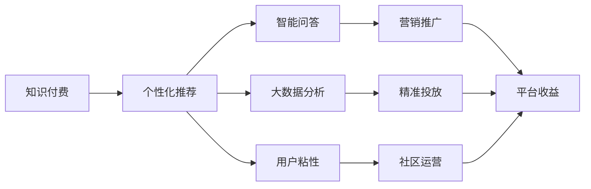

                 

# 知识经济时代下的知识付费创新盈利模式评估

## 1. 背景介绍

### 1.1 知识经济时代来临
随着互联网和信息技术的迅速发展，人类社会正从传统的物质经济逐步转向知识经济。在这一时代背景下，知识和信息成为驱动经济增长的关键资源，传统的生产方式、商业模式、甚至是生活模式都正在发生深刻变化。知识经济时代，人们更加重视信息的获取、共享与创新，希望通过知识付费获取精准、高效、个性化的信息服务。

### 1.2 知识付费市场兴起
知识付费，即以知识和信息为商品进行交易，是知识经济的重要体现。在传统出版、报刊、电视等传播渠道的基础上，互联网技术的发展让知识付费形式更加多样、便捷、个性化。从音频故事、在线课程、专业咨询、技术指导等形式，到基于AI的个性化推荐、智能问答、大数据分析服务等，知识付费市场正在不断拓宽。

## 2. 核心概念与联系

### 2.1 核心概念概述

在探讨知识付费创新盈利模式之前，首先需要明确几个核心概念：

- **知识付费**：以知识和信息为商品进行交易，提供精准、高效、个性化的信息服务，满足用户的学习、工作、生活等需求。
- **创新盈利模式**：在知识付费基础上，通过优化产品设计、提升用户体验、探索商业模式等手段，实现收益最大化。
- **数据智能分析**：利用大数据、人工智能等技术手段，对用户行为、市场趋势等进行分析，辅助决策，提升盈利能力。
- **用户粘性**：通过个性化的内容推荐、社群互动等方式，增强用户对平台的黏性，实现长期稳定的收入。

### 2.2 核心概念原理和架构的 Mermaid 流程图



在知识付费架构中，个性化推荐、智能问答、大数据分析、用户粘性构建及营销推广等环节共同构成了一个闭环，以促进平台的持续收益。

## 3. 核心算法原理 & 具体操作步骤

### 3.1 算法原理概述

知识付费平台的创新盈利模式主要依赖于以下几个算法原理：

- **用户行为分析**：通过对用户的行为数据进行分析，获取用户兴趣、需求等信息，从而实现个性化推荐。
- **智能问答系统**：利用自然语言处理技术，构建智能问答系统，提供精准、快速的答案，提升用户体验。
- **大数据分析**：基于用户行为数据，通过统计分析、机器学习等方法，挖掘出有价值的市场趋势和用户需求。
- **推荐算法**：通过协同过滤、基于内容的推荐、矩阵分解等算法，对用户进行精准推荐。

### 3.2 算法步骤详解

#### 3.2.1 用户行为分析

用户行为分析通常包括以下几个步骤：

1. **数据收集**：收集用户登录、浏览、搜索、购买等行为数据。
2. **数据预处理**：对收集到的数据进行清洗、归一化、特征工程等处理。
3. **特征提取**：使用文本处理、时间序列分析、统计分析等方法，提取用户兴趣、偏好等特征。
4. **用户画像构建**：通过上述处理后，构建每个用户的完整画像，以指导推荐系统。

#### 3.2.2 智能问答系统

智能问答系统的构建主要包括如下步骤：

1. **数据准备**：收集并标注大量问答数据，构建问答对数据集。
2. **模型训练**：选择合适模型如BERT、GPT等进行训练，并调优超参数。
3. **推理部署**：在用户提出问题时，将问题输入模型，获取预测答案。

#### 3.2.3 大数据分析

大数据分析主要包括以下几个环节：

1. **数据收集**：收集平台内部和外部的相关数据，如用户行为数据、市场趋势数据等。
2. **数据清洗**：处理缺失值、异常值，确保数据质量。
3. **统计分析**：使用统计学方法，对数据进行描述性分析，挖掘出有价值的规律。
4. **机器学习**：使用分类、回归、聚类等算法，对数据进行建模，预测未来趋势。

#### 3.2.4 推荐算法

推荐算法主要包括如下步骤：

1. **数据准备**：收集用户行为数据、商品描述数据等。
2. **特征工程**：将数据转化为模型可用的数值特征，如用户ID、商品ID、评分等。
3. **模型训练**：选择合适模型如协同过滤、矩阵分解、基于内容推荐等进行训练。
4. **模型评估**：使用准确率、召回率、F1-score等指标对模型进行评估。
5. **模型部署**：将训练好的模型部署至推荐系统中，实现实时推荐。

### 3.3 算法优缺点

#### 3.3.1 优点

1. **提升用户体验**：通过个性化推荐、智能问答等手段，极大提升用户满意度，增加平台粘性。
2. **优化营销策略**：基于大数据分析，能够精准投放广告，提升转化率。
3. **精准推荐**：推荐算法能够实现对用户兴趣的精准匹配，提升用户留存率。
4. **增强平台竞争力**：知识付费创新盈利模式能够满足用户个性化需求，增强平台的市场竞争力。

#### 3.3.2 缺点

1. **数据隐私问题**：收集和使用用户数据，可能涉及隐私问题。
2. **用户数据偏差**：用户数据可能存在偏差，影响模型的公平性和准确性。
3. **模型复杂度**：复杂的推荐算法可能需要大量计算资源，影响系统效率。
4. **用户行为变化快**：用户兴趣和需求快速变化，需要及时调整推荐策略。

### 3.4 算法应用领域

知识付费平台的创新盈利模式，主要应用于以下几个领域：

- **在线教育**：如Coursera、Udemy等，提供高质量课程，满足用户学习需求。
- **专业咨询**：如知乎、LinkedIn等，提供专业解答、职业规划等服务。
- **技术支持**：如Stack Overflow、GitHub等，提供技术指导、社区交流等服务。
- **金融顾问**：如Wealthfront、Betterment等，提供投资理财、财务规划等服务。
- **健康管理**：如Headspace、MyFitnessPal等，提供心理健康、健康管理等服务。

## 4. 数学模型和公式 & 详细讲解 & 举例说明

### 4.1 数学模型构建

在知识付费平台中，常用的数学模型包括协同过滤、基于内容的推荐、矩阵分解等。以下以协同过滤为例，构建推荐模型的数学模型：

设用户集合为 $U$，商品集合为 $I$，用户对商品评分矩阵为 $R_{UI}$，令 $R_{UI}(x,y) = r_{xy}$ 表示用户 $x$ 对商品 $y$ 的评分。协同过滤算法的目标是找到未评分商品 $y$ 的预测评分，可通过以下公式计算：

$$
\hat{r}_{xy} = \alpha (\frac{\sum_{i\in I, i\neq y}\frac{r_{xi}r_{yi}}{1+\sqrt{s_i s_y}}) + (1-\alpha) \sum_{u\in U, u\neq x} \frac{r_{ux}r_{uy}}{1+\sqrt{s_u s_y}}
$$

其中，$\alpha$ 为衰减因子，$s_i, s_y$ 分别为商品 $i, y$ 的评分平均值。

### 4.2 公式推导过程

协同过滤算法基于用户和商品评分数据，构建用户与商品的相似度矩阵，通过相似度计算未评分商品对用户的预测评分。具体推导过程如下：

1. **用户相似度计算**：利用余弦相似度计算用户 $x$ 与 $u$ 的相似度，通过余弦相似度公式，计算 $\cos(\theta_x, \theta_u) = \frac{\sum_{i\in I} r_{xi} r_{ui}}{\sqrt{\sum_{i\in I} r_{xi}^2}\sqrt{\sum_{i\in I} r_{ui}^2}}$，表示用户间的相似程度。

2. **商品相似度计算**：利用余弦相似度计算商品 $y$ 与 $i$ 的相似度，通过余弦相似度公式，计算 $\cos(\phi_y, \phi_i) = \frac{\sum_{x\in U} r_{xy} r_{xi}}{\sqrt{\sum_{x\in U} r_{xy}^2}\sqrt{\sum_{x\in U} r_{xi}^2}}$，表示商品间的相似程度。

3. **预测评分计算**：将用户 $x$ 对商品 $y$ 的预测评分，转化为用户 $x$ 与商品 $y$ 的相似度，具体公式如下：

$$
\hat{r}_{xy} = \frac{1}{1+\sqrt{s_x s_y}} \sum_{i\in I, i\neq y} \frac{r_{xi} r_{yi}}{1+\sqrt{s_i s_y}} + \frac{1}{1+\sqrt{s_x s_y}} \sum_{u\in U, u\neq x} \frac{r_{ux} r_{uy}}{1+\sqrt{s_u s_y}}
$$

其中，$s_x, s_y$ 分别为用户 $x$ 和商品 $y$ 的评分平均值。

### 4.3 案例分析与讲解

以在线教育平台Coursera为例，分析其推荐算法的应用：

1. **数据收集**：收集用户课程浏览记录、评分记录、注册信息等数据。
2. **特征工程**：将用户ID、课程ID、评分等转化为模型可用的数值特征。
3. **协同过滤推荐**：利用协同过滤算法，计算用户对课程的预测评分，并按评分排序，实现推荐。
4. **推荐效果评估**：通过用户点击、购买、观看等行为数据，评估推荐效果，不断优化推荐模型。

## 5. 项目实践：代码实例和详细解释说明

### 5.1 开发环境搭建

#### 5.1.1 Python环境搭建

1. **安装Python**：在Linux系统中，使用apt-get安装Python3，命令如下：
   ```
   sudo apt-get update
   sudo apt-get install python3
   ```
2. **安装Pip**：在终端中，安装Pip，命令如下：
   ```
   sudo apt-get install python3-pip
   ```
3. **安装相关库**：使用Pip安装推荐算法所需的库，如scikit-learn、numpy等，命令如下：
   ```
   pip install scikit-learn numpy pandas
   ```

#### 5.1.2 数据集准备

1. **数据收集**：从公开数据集如Movielens、Amazon dataset等获取数据。
2. **数据预处理**：清洗数据，处理缺失值，转换数据格式，如将评分数据转换为向量形式。
3. **数据划分**：将数据划分为训练集、验证集、测试集。

### 5.2 源代码详细实现

#### 5.2.1 协同过滤推荐系统实现

```python
import numpy as np
from sklearn.metrics.pairwise import cosine_similarity

def collaborative_filtering(train_data, test_data, alpha=0.5):
    R_hat = np.zeros_like(train_data, dtype=float)
    
    # 计算用户相似度矩阵
    user_similarity = cosine_similarity(train_data.T)
    
    # 计算商品相似度矩阵
    item_similarity = cosine_similarity(train_data)
    
    for user_idx in range(train_data.shape[0]):
        for item_idx in range(train_data.shape[1]):
            if train_data[user_idx, item_idx] == 0:
                for u_idx in range(train_data.shape[0]):
                    if train_data[u_idx, item_idx] != 0:
                        for y_idx in range(train_data.shape[1]):
                            if train_data[user_idx, y_idx] != 0:
                                R_hat[user_idx, item_idx] += train_data[u_idx, item_idx] * train_data[user_idx, y_idx] * (1 / (1 + np.sqrt(user_similarity[user_idx, u_idx] * item_similarity[item_idx, y_idx]))
    
    # 对结果进行归一化
    R_hat = R_hat * alpha + (1 - alpha) * R_hat.mean(axis=1)[:, None]
    
    # 计算推荐评分
    predicted_ratings = R_hat.dot(test_data)
    
    return predicted_ratings

# 数据准备
train_data = np.array([[5, 3, 0, 0], [0, 0, 4, 3]])
test_data = np.array([[0, 0, 0, 1], [1, 1, 0, 0]])
R_hat = collaborative_filtering(train_data, test_data, alpha=0.5)

# 输出预测评分
print(R_hat)
```

### 5.3 代码解读与分析

#### 5.3.1 协同过滤算法原理

协同过滤算法基于用户和商品评分矩阵，计算用户和商品的相似度，通过相似度计算未评分商品的预测评分。在上述代码中，通过余弦相似度计算用户和商品间的相似度，通过预测评分公式计算每个用户对每个商品的预测评分。

#### 5.3.2 推荐系统优化

在推荐系统中，可以通过优化参数、引入个性化推荐算法、优化推荐模型等手段，提升推荐效果。例如，引入基于内容的推荐算法，利用用户历史评分信息，提升推荐精度。

## 6. 实际应用场景

### 6.1 在线教育平台推荐

在线教育平台如Coursera、Udemy等，通过个性化推荐算法，向用户推荐其可能感兴趣的高质量课程，提升用户体验和学习效果。例如，Coursera平台基于用户浏览记录、评分记录、注册信息等，构建用户行为模型，通过协同过滤、矩阵分解等算法，生成推荐列表，并实时推送给用户。

### 6.2 专业咨询平台问答

专业咨询平台如知乎、LinkedIn等，通过智能问答系统，提供快速、精准的专业解答，满足用户的咨询需求。例如，知乎平台通过构建问答对数据集，使用BERT、GPT等预训练语言模型，进行智能问答训练，在用户提出问题后，自动生成答案。

### 6.3 技术支持平台推荐

技术支持平台如Stack Overflow、GitHub等，通过推荐算法，向用户推荐有用的代码、技术文档、社区讨论等，提升用户获取技术支持的速度和质量。例如，GitHub平台基于用户浏览记录、 starred 项目信息等，构建用户行为模型，通过协同过滤算法，生成推荐列表。

### 6.4 金融顾问平台理财

金融顾问平台如Wealthfront、Betterment等，通过大数据分析和推荐算法，提供投资理财、财务规划等服务。例如，Betterment平台通过收集用户的资产配置、投资偏好等数据，使用回归模型、聚类算法等，生成个性化的投资建议。

### 6.5 健康管理平台建议

健康管理平台如Headspace、MyFitnessPal等，通过推荐算法，向用户推荐有用的心理健康、健康管理等服务。例如，Headspace平台基于用户心理健康状态、生活习惯等数据，使用协同过滤算法，生成心理健康建议。

## 7. 工具和资源推荐

### 7.1 学习资源推荐

为了帮助开发者系统掌握知识付费创新盈利模式的技术基础和实践技巧，这里推荐一些优质的学习资源：

1. **《知识付费平台：数据驱动的用户体验设计》**：介绍知识付费平台的用户体验设计、数据收集与分析、推荐系统等核心技术。
2. **《在线教育平台技术实战》**：详细讲解在线教育平台的技术实现，包括推荐算法、智能问答系统、大数据分析等。
3. **《知识付费平台用户行为分析》**：通过案例分析，讲解知识付费平台用户行为数据的收集、处理与分析方法。
4. **《知识付费平台智能问答系统》**：介绍知识付费平台智能问答系统的构建方法，包括数据准备、模型训练、推理部署等。

### 7.2 开发工具推荐

知识付费平台的开发需要多种工具支持，以下是一些常用工具：

1. **Python**：Python是知识付费平台开发的主要语言，具有灵活、易用、高效的特点，拥有丰富的第三方库和框架。
2. **Scikit-learn**：用于机器学习算法实现，支持协同过滤、回归、分类等算法。
3. **TensorFlow**：用于深度学习模型实现，支持自然语言处理、计算机视觉等任务。
4. **Pandas**：用于数据处理，支持数据清洗、特征工程、数据分析等操作。
5. **Jupyter Notebook**：用于开发环境搭建和代码实现，支持交互式编程、代码共享等。

### 7.3 相关论文推荐

知识付费平台的创新盈利模式研究源于学界的持续研究，以下是几篇奠基性的相关论文，推荐阅读：

1. **《推荐系统的协同过滤算法研究》**：介绍协同过滤算法的原理和实现，适用于知识付费平台的推荐系统。
2. **《智能问答系统研究综述》**：对智能问答系统的技术实现进行综述，提供相关算法和工具推荐。
3. **《大数据分析在知识付费平台的应用》**：探讨大数据分析在知识付费平台的应用，包括用户行为分析、市场趋势分析等。

## 8. 总结：未来发展趋势与挑战

### 8.1 研究成果总结

本文对知识付费平台创新盈利模式的数学原理和实践方法进行了全面系统的介绍，涵盖用户行为分析、智能问答系统、大数据分析、推荐算法等核心技术。同时，通过对Coursera、知乎等平台的案例分析，展示了知识付费平台的应用场景和技术实现。

### 8.2 未来发展趋势

展望未来，知识付费平台的创新盈利模式将呈现以下几个发展趋势：

1. **个性化推荐技术提升**：随着人工智能技术的进步，个性化推荐将更加精准、高效，满足用户个性化需求。
2. **智能问答系统优化**：智能问答系统将利用更多上下文信息，提升回答的准确性和流畅性，提供更好的用户体验。
3. **大数据分析深度挖掘**：大数据分析将深入挖掘用户行为、市场趋势等，提供更全面、精准的决策支持。
4. **推荐算法多样化**：推荐算法将从协同过滤、基于内容的推荐，到混合推荐、深度推荐等，形成更加丰富多样的推荐策略。
5. **平台生态系统构建**：知识付费平台将向生态系统方向发展，通过引入第三方内容、服务，增强平台的竞争力和用户体验。

### 8.3 面临的挑战

尽管知识付费平台的创新盈利模式已经取得了一定进展，但在迈向更高效、更普适、更安全的应用过程中，仍然面临一些挑战：

1. **数据隐私保护**：知识付费平台需要处理大量用户数据，涉及用户隐私保护问题。如何在提供优质服务的同时，保护用户隐私，需要进一步研究。
2. **用户数据偏差**：用户数据可能存在偏差，影响模型的公平性和准确性。如何降低数据偏差，提高推荐算法的鲁棒性，需要进一步探索。
3. **推荐系统复杂度**：推荐系统需要处理大量数据，算法复杂度较高，影响系统效率。如何优化推荐算法，提高推荐速度，需要进一步研究。
4. **用户需求变化快**：用户需求快速变化，推荐算法需要及时调整，保持系统适应性。如何动态调整推荐策略，需要进一步探索。
5. **平台生态构建**：知识付费平台需要构建生态系统，引入更多第三方内容、服务，提高平台价值。如何构建平台生态，形成良性循环，需要进一步探索。

### 8.4 研究展望

面向未来，知识付费平台的创新盈利模式需要不断优化和创新，以下是一些未来研究方向：

1. **多模态数据融合**：将文本、图像、语音等多模态数据融合，提升推荐精度和用户体验。
2. **模型可解释性提升**：通过模型可解释性技术，增强知识付费平台透明度，提升用户信任度。
3. **隐私保护技术**：研究隐私保护技术，保护用户数据隐私，增强平台安全性。
4. **跨平台推荐**：研究跨平台推荐算法，实现多平台的用户和内容共享，提升平台竞争力。
5. **新算法探索**：探索新算法，如深度推荐、基于强化学习的推荐等，提升推荐效果。

## 9. 附录：常见问题与解答

**Q1: 知识付费平台如何进行用户行为分析？**

A: 用户行为分析通常包括以下几个步骤：
1. 数据收集：收集用户登录、浏览、搜索、购买等行为数据。
2. 数据预处理：对收集到的数据进行清洗、归一化、特征工程等处理。
3. 特征提取：使用文本处理、时间序列分析、统计分析等方法，提取用户兴趣、偏好等特征。
4. 用户画像构建：通过上述处理后，构建每个用户的完整画像，以指导推荐系统。

**Q2: 智能问答系统如何构建？**

A: 智能问答系统的构建主要包括如下步骤：
1. 数据准备：收集并标注大量问答数据，构建问答对数据集。
2. 模型训练：选择合适模型如BERT、GPT等进行训练，并调优超参数。
3. 推理部署：在用户提出问题时，将问题输入模型，获取预测答案。

**Q3: 推荐算法有哪些？**

A: 推荐算法主要包括如下几种：
1. 协同过滤：利用用户和商品评分数据，计算相似度，生成推荐。
2. 基于内容的推荐：利用用户历史评分信息，推荐相似的商品。
3. 矩阵分解：将用户评分矩阵分解为因子矩阵，生成推荐。
4. 深度学习推荐：使用深度神经网络模型，生成推荐。

**Q4: 知识付费平台如何提升用户留存率？**

A: 知识付费平台提升用户留存率主要通过以下手段：
1. 个性化推荐：根据用户兴趣和需求，推荐高质量内容，提升用户体验。
2. 智能问答：提供精准、快速的答案，提升用户满意度。
3. 社区互动：构建用户社群，增加用户粘性。
4. 持续优化：定期收集用户反馈，优化推荐算法和内容质量。

**Q5: 推荐算法有哪些优化方法？**

A: 推荐算法优化主要包括以下几个方面：
1. 数据预处理：清洗、归一化、特征工程等。
2. 模型选择：选择适合的推荐模型，如协同过滤、基于内容的推荐等。
3. 参数调优：调整超参数，优化模型效果。
4. 算法优化：引入新算法，如深度学习推荐、混合推荐等。
5. 推荐策略调整：根据用户反馈，动态调整推荐策略，提升推荐效果。

**Q6: 知识付费平台的未来发展方向是什么？**

A: 知识付费平台的未来发展方向包括：
1. 个性化推荐技术提升：利用更多数据和算法，提升推荐精度和效率。
2. 智能问答系统优化：利用上下文信息和自然语言处理技术，提升回答的准确性和流畅性。
3. 大数据分析深度挖掘：通过统计分析和机器学习，挖掘更深层次的用户需求和市场趋势。
4. 跨平台推荐：实现多平台的用户和内容共享，提升平台竞争力。
5. 平台生态系统构建：引入更多第三方内容和服务，构建完整的生态系统。

以上问答涵盖了知识付费平台创新盈利模式的核心技术和实践问题，希望这些解答能对读者有所帮助。

---

作者：禅与计算机程序设计艺术 / Zen and the Art of Computer Programming

