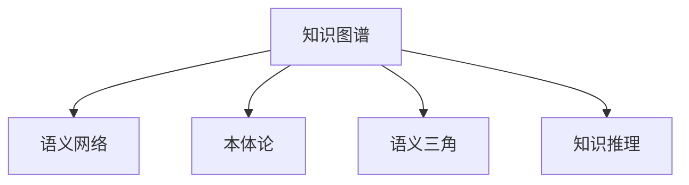

                 

# 知识输出与管理经验的系统化

## 1. 背景介绍

### 1.1 问题由来

在现代信息爆炸的时代，知识和经验的积累与传播成为了企业发展的关键驱动力。然而，知识和经验的系统化管理仍然是一个巨大的挑战。知识无法有效地从个人或团队中提取、共享和复用，导致重复劳动、知识孤岛和创新能力不足等问题频现。尤其在大型企业中，知识管理系统的设计和实施，常常需要耗费大量的时间和资源。

### 1.2 问题核心关键点

1. **知识输出的效率**：如何高效地从个人经验中提取知识，并输出成可共享的格式，是知识管理的首要任务。
2. **知识管理的可维护性**：如何在动态变化的环境下，持续维护和更新知识库，保持其时效性和准确性。
3. **知识共享的便利性**：如何降低知识共享的门槛，促进团队之间的知识流动和协作。
4. **知识复用的灵活性**：如何在不同情境下，灵活地复用已有知识，提升工作效率和创新能力。

### 1.3 问题研究意义

系统化管理知识和经验，对于提升企业竞争力、加快创新速度、降低知识获取成本具有重要意义。它不仅能有效降低重复劳动，减少知识孤岛，还能促进跨部门、跨团队的协作，驱动企业持续发展。

## 2. 核心概念与联系

### 2.1 核心概念概述

为了系统化地管理和输出知识与经验，本文将介绍以下几个关键概念：

1. **知识图谱(Knowledge Graph)**：一种以图的形式表示实体和实体之间的关系，用于存储和检索知识的网络模型。
2. **语义网络(Semantic Network)**：以符号表示的逻辑形式，描述实体之间的关系和属性。
3. **本体论(Ontology)**：定义了一组概念、属性和约束，用于描述特定领域内的知识。
4. **语义三角(Semantic Triangle)**：由个体、属性和值组成的结构，用于表示简单的事实。
5. **知识推理(Knowledge Reasoning)**：利用知识库中的信息，通过逻辑推理得出新知识的过程。

这些概念之间的逻辑关系可以通过以下Mermaid流程图来展示：



这个流程图展示了一系列关键概念及其之间的关系：

1. 知识图谱是存储和管理知识的主要方式，通过语义网络和本体论来定义和表示知识。
2. 语义网络用于描述实体之间的关系和属性。
3. 本体论定义了领域内的概念、属性和约束，为知识图谱提供结构化的框架。
4. 语义三角是知识表示的基本单元，用于表达简单的事实。
5. 知识推理是利用知识图谱中的信息，通过逻辑推理生成新知识的过程。

## 3. 核心算法原理 & 具体操作步骤

### 3.1 算法原理概述

知识输出的系统化管理，本质上是一个从个人经验到组织知识库的转化过程。通过定义适当的知识图谱模型，利用语义网络、本体论和知识推理等技术，可以将个人的经验与组织的知识库紧密结合，实现知识的系统化和复用。

具体而言，知识管理的过程可以分为以下几个步骤：

1. **知识采集**：从个人和团队的经验中提取有用的知识。
2. **知识建模**：将知识表示为语义网络或知识图谱的形式。
3. **知识存储**：将知识图谱存储在知识库中，并进行适当的分类和标注。
4. **知识检索**：从知识库中检索出相关的知识，供用户参考和复用。
5. **知识更新**：持续更新知识库中的信息，确保其时效性和准确性。
6. **知识应用**：在实际工作中应用知识，提升工作效率和创新能力。

### 3.2 算法步骤详解

以下详细介绍知识管理的具体操作步骤：

**Step 1: 知识采集**

知识采集是知识管理的基础。知识可以从以下几个渠道进行采集：

1. **文档记录**：将个人和团队的文档、会议纪要、电子邮件等，通过OCR等技术转换为电子文本。
2. **经验总结**：将个人的工作经验、项目总结、技术分享等内容进行整理，形成标准化的知识文档。
3. **专家访谈**：通过访谈企业中的专家，获取专业领域的知识和见解。

**Step 2: 知识建模**

知识建模是将采集到的知识表示为语义网络或知识图谱的过程。具体的建模步骤包括：

1. **实体识别**：使用NLP技术识别知识文档中的实体，如人名、地名、组织名等。
2. **关系抽取**：从知识文档中抽取实体之间的关系，如“开发”、“使用”等。
3. **属性定义**：定义实体的属性，如人名的时间、地点、职位等。
4. **知识表示**：将实体、关系和属性表示为语义网络或知识图谱的形式。

**Step 3: 知识存储**

知识存储是将知识图谱存储在知识库中的过程。存储步骤包括：

1. **分类与标注**：对知识图谱进行分类和标注，方便后续检索。
2. **数据库设计**：设计合适的数据库结构，存储知识图谱中的实体、关系和属性。
3. **数据同步**：定期同步知识图谱的变化，确保知识库的时效性。

**Step 4: 知识检索**

知识检索是从知识库中检索出相关知识的过程。检索步骤包括：

1. **查询构建**：根据用户的查询需求，构建查询语句。
2. **图谱搜索**：在知识图谱中搜索匹配的实体和关系。
3. **结果展示**：将搜索结果展示给用户，并提供推荐相关知识。

**Step 5: 知识更新**

知识更新是持续维护和更新知识库的过程。更新步骤包括：

1. **数据清洗**：定期清洗知识库中的过时、错误信息。
2. **新知识录入**：及时录入新采集到的知识，保持知识库的时效性。
3. **知识推理**：利用知识推理技术，从已有知识中生成新的知识。

**Step 6: 知识应用**

知识应用是将知识应用于实际工作的过程。应用步骤包括：

1. **知识整合**：将知识与实际工作流程整合，形成可操作的指导。
2. **知识复用**：在项目中复用已有知识，提升工作效率和创新能力。
3. **知识分享**：在团队中进行知识分享，促进跨部门的协作。

### 3.3 算法优缺点

系统化管理知识的优点：

1. **高效性**：通过标准化和系统化的知识管理，能够高效地从个人经验中提取知识，并输出成可共享的格式。
2. **可维护性**：利用知识图谱和本体论，能够持续维护和更新知识库，保持其时效性和准确性。
3. **可复用性**：通过语义网络和知识推理技术，能够灵活地复用已有知识，提升工作效率和创新能力。

系统化管理知识的缺点：

1. **技术门槛高**：需要掌握NLP、图数据库等先进技术，对技术要求较高。
2. **数据质量要求高**：需要高质量的知识采集和标准化文档，数据质量直接影响知识管理的成果。
3. **资源投入大**：知识管理系统的设计和实施需要大量的时间和资源投入，初期成本较高。

### 3.4 算法应用领域

知识管理的系统化方法在多个领域中得到了广泛应用，例如：

1. **企业知识管理**：通过系统化管理企业内部的知识，提升工作效率，降低重复劳动。
2. **科研项目管理**：通过管理科研项目的知识，提高科研效率，促进知识传承和创新。
3. **教育领域**：通过知识管理，提升教师和学生的知识获取和共享能力。
4. **医疗领域**：通过知识管理，提高医生的诊疗水平，促进医疗知识的传承和创新。
5. **金融领域**：通过知识管理，提升金融分析和决策能力，促进金融创新。

## 4. 数学模型和公式 & 详细讲解  
### 4.1 数学模型构建

知识管理的数学模型主要基于图论和语义网络理论。以下是知识图谱的数学模型构建：

**知识图谱G**：表示为三元组集合 $G=(E,R,V)$，其中 $E$ 为实体集合，$R$ 为关系集合，$V$ 为属性集合。三元组形式为 $(e_1, r, e_2)$，表示实体 $e_1$ 和 $e_2$ 之间存在关系 $r$。

**本体论O**：定义为一组概念、属性和约束的集合，表示为 $O=(N, P, C)$，其中 $N$ 为概念集合，$P$ 为属性集合，$C$ 为约束集合。

**语义网络SN**：表示为概念、属性和关系的集合，形式为 $SN=(N, P, R)$，其中 $N$ 为概念集合，$P$ 为属性集合，$R$ 为关系集合。

### 4.2 公式推导过程

知识推理是知识管理的重要组成部分。以下是知识推理的公式推导过程：

1. **推理规则**：
   - **封闭世界假设**：假设知识库中的信息是完备的，不存在未知实体和关系。
   - **一致性约束**：知识库中的信息应满足逻辑一致性，不存在矛盾和歧义。
   - **推理规则**：通过逻辑推理，从已有知识中生成新的知识。

2. **推理算法**：
   - **规则推理**：基于规则进行推理，如“如果实体 $e_1$ 与 $e_2$ 存在关系 $r$，则 $e_1$ 与 $e_2$ 具有属性 $p$”。
   - **模型推理**：基于模型进行推理，如神经网络推理模型。
   - **逻辑推理**：基于逻辑代数进行推理，如一阶逻辑推理。

3. **推理结果**：
   - **生成新知识**：通过推理生成新的实体、关系和属性。
   - **更新知识库**：将推理结果更新到知识库中，进行持续维护和更新。

### 4.3 案例分析与讲解

以下以金融领域的知识管理为例，详细讲解知识管理的应用：

**案例背景**：某金融公司需要管理大量的金融产品信息和市场数据，以便快速响应市场变化，提升决策效率。

**知识采集**：通过自动爬取和手动录入的方式，采集金融产品和市场数据，形成电子文档。

**知识建模**：使用NLP技术对电子文档进行实体识别和关系抽取，构建金融知识图谱，定义金融本体论，形成金融语义网络。

**知识存储**：将金融知识图谱存储在图数据库中，并进行分类和标注，确保知识的时效性和准确性。

**知识检索**：根据用户的查询需求，从金融知识图谱中检索出相关的金融产品和市场数据，提供推荐和参考。

**知识更新**：定期清洗金融知识库中的过时信息，及时录入新的金融产品和市场数据，进行持续维护和更新。

**知识应用**：在金融决策中应用金融知识，提升金融分析和决策能力，促进金融创新。

## 5. 项目实践：代码实例和详细解释说明
### 5.1 开发环境搭建

在进行知识管理项目实践前，我们需要准备好开发环境。以下是使用Python进行知识图谱开发的的环境配置流程：

1. 安装Anaconda：从官网下载并安装Anaconda，用于创建独立的Python环境。

2. 创建并激活虚拟环境：
```bash
conda create -n graph-env python=3.8 
conda activate graph-env
```

3. 安装Python依赖包：
```bash
conda install numpy pandas py2neo networkx spacy
```

4. 下载语义网络数据集：
```bash
wget https://example.com/semantic_network.zip
unzip semantic_network.zip
```

5. 安装GraphDB：
```bash
pip install graphdb
```

完成上述步骤后，即可在`graph-env`环境中开始知识图谱开发。

### 5.2 源代码详细实现

下面我们以知识图谱构建为例，给出使用Python和PyTorch进行语义网络构建的代码实现。

```python
from py2neo import Graph, Node, Relationship

# 连接到GraphDB数据库
graph = Graph('http://localhost:7474/db/data/', user='neo4j', password='password')

# 定义概念、属性和关系
concept = Node('Concept', name='Finance')
attribute = Node('Attribute', name='Interest Rate')
relation = Relationship(concept, 'HAS_ATTRIBUTE', attribute)

# 将概念、属性和关系添加到GraphDB中
graph.create(concept)
graph.create(attribute)
graph.create(relation)

# 查询知识图谱
concept_node = graph.nodes.match('Concept', name='Finance').first()
relation_node = graph.relations.match(concept_node, 'HAS_ATTRIBUTE').first()
attribute_node = relation_node.end_node

# 输出查询结果
print(f"Concept: {concept_node.name}")
print(f"Attribute: {attribute_node.name}")
```

在上述代码中，我们首先连接到GraphDB数据库，定义了一个名为“Finance”的概念节点，一个名为“Interest Rate”的属性节点，以及一个表示“Finance”概念具有“Interest Rate”属性的关系节点。然后，将这些节点和关系添加到GraphDB中，并进行了简单的查询操作，最终输出了查询结果。

### 5.3 代码解读与分析

让我们再详细解读一下关键代码的实现细节：

**GraphDB**：用于管理知识图谱的数据库，支持Python接口和多种查询语言。

**Node类**：表示知识图谱中的实体节点，包含属性和关系。

**Relationship类**：表示知识图谱中的关系，连接两个实体节点。

**查询操作**：使用GraphDB提供的查询语言进行知识图谱的查询，可以获取实体节点和关系节点的信息。

**知识图谱构建**：通过定义概念、属性和关系，并添加到知识库中，构建语义网络。

通过以上代码，我们可以实现知识图谱的基本构建和管理。后续还可以在此基础上进行更多的查询和推理操作。

## 6. 实际应用场景

### 6.1 金融领域

在金融领域，知识管理的应用尤为关键。通过构建金融知识图谱，金融机构可以实时掌握市场动态，快速响应市场变化，提升决策效率和风险控制能力。

**应用示例**：某银行通过构建金融知识图谱，实时监测市场舆情、利率变化、信用评级等关键信息，从而快速调整投资策略和风险控制措施。

**技术实现**：
- 采集金融市场数据，构建金融知识图谱。
- 通过关系抽取和推理，实时监测市场变化。
- 根据市场变化，调整投资策略和风险控制措施。

### 6.2 医疗领域

在医疗领域，知识管理可以帮助医生快速获取病历、临床指南等信息，提升诊疗效率和诊断准确性。

**应用示例**：某医院通过构建医疗知识图谱，快速查询病历信息、临床指南和最新研究，提高医生的诊疗水平。

**技术实现**：
- 采集病历、临床指南和最新研究，构建医疗知识图谱。
- 通过实体识别和关系抽取，快速查询病历信息、临床指南和最新研究。
- 根据查询结果，辅助医生进行诊断和决策。

### 6.3 科研领域

在科研领域，知识管理可以帮助研究人员快速获取文献、实验数据等信息，促进科研创新和知识传承。

**应用示例**：某大学通过构建科研知识图谱，快速查询科研文献、实验数据和最新研究成果，加速科研进程。

**技术实现**：
- 采集科研文献、实验数据和最新研究成果，构建科研知识图谱。
- 通过关系抽取和推理，快速查询科研文献、实验数据和最新研究成果。
- 根据查询结果，辅助研究人员进行科研创新和知识传承。

### 6.4 未来应用展望

随着知识图谱和语义网络技术的发展，知识管理的应用将更加广泛和深入。未来，知识管理将在以下几个方面取得突破：

1. **跨领域知识融合**：通过跨领域知识图谱的构建，促进不同领域知识之间的融合和应用。
2. **实时知识更新**：通过自动化工具和实时数据采集，实现知识库的持续更新和维护。
3. **知识推理与预测**：利用知识推理技术，从已有知识中生成新的预测和推理结果，提升知识的应用价值。
4. **多模态知识融合**：结合文本、图像、语音等多种模态的数据，实现多模态知识的融合和应用。
5. **智能知识检索**：利用智能算法和NLP技术，提升知识检索的准确性和效率。

## 7. 工具和资源推荐
### 7.1 学习资源推荐

为了帮助开发者系统掌握知识图谱和语义网络技术，这里推荐一些优质的学习资源：

1. **《知识图谱：设计与实现》**：详细介绍了知识图谱的设计和实现方法，涵盖实体识别、关系抽取、推理等关键技术。

2. **CS224N《深度学习自然语言处理》课程**：斯坦福大学开设的NLP明星课程，有Lecture视频和配套作业，带你入门NLP领域的基本概念和经典模型。

3. **《知识图谱与语义网络》**：介绍了知识图谱和语义网络的基本概念和应用，适合初学者系统学习。

4. **《Python知识图谱》**：介绍如何使用Python进行知识图谱的构建和管理，涵盖多种知识和推理技术。

5. **PyTorch Geometric**：用于构建图网络（Graph Network）的库，适合进行知识图谱的建模和推理。

通过对这些资源的学习实践，相信你一定能够快速掌握知识图谱和语义网络技术的精髓，并用于解决实际的NLP问题。

### 7.2 开发工具推荐

高效的开发离不开优秀的工具支持。以下是几款用于知识图谱开发的常用工具：

1. **PyTorch Geometric**：用于构建图网络（Graph Network）的库，适合进行知识图谱的建模和推理。
2. **GraphDB**：用于管理和查询知识图谱的数据库，支持Python接口和多种查询语言。
3. **Neo4j**：一款流行的图数据库，适合存储和查询复杂的知识图谱。
4. **NetworkX**：用于构建和操作图结构的数据库，支持多种图算法和模型。
5. **SPARQL**：一种用于查询RDF（资源描述框架）数据的查询语言，适合查询知识图谱中的信息。

合理利用这些工具，可以显著提升知识图谱开发的效率，加快创新迭代的步伐。

### 7.3 相关论文推荐

知识图谱和语义网络技术的发展源于学界的持续研究。以下是几篇奠基性的相关论文，推荐阅读：

1. **《知识图谱的构建与管理》**：介绍了知识图谱的构建和管理方法，涵盖实体识别、关系抽取、推理等关键技术。

2. **《语义网络与知识推理》**：详细介绍了语义网络的基本概念和推理方法，适合深入学习。

3. **《知识图谱与深度学习》**：介绍如何使用深度学习技术进行知识图谱的构建和管理，涵盖多种知识和推理技术。

4. **《基于知识图谱的问答系统》**：介绍如何构建基于知识图谱的问答系统，利用知识推理生成答案。

5. **《多模态知识图谱》**：介绍如何将文本、图像、语音等多种模态的数据进行融合，构建多模态知识图谱。

这些论文代表了大规模知识图谱和语义网络技术的发展脉络。通过学习这些前沿成果，可以帮助研究者把握学科前进方向，激发更多的创新灵感。

## 8. 总结：未来发展趋势与挑战

### 8.1 总结

本文对知识输出与管理的经验系统化方法进行了全面系统的介绍。首先阐述了知识管理的重要性和核心关键点，明确了知识管理在提高企业竞争力、加快创新速度、降低知识获取成本方面的重要价值。其次，从原理到实践，详细讲解了知识图谱和语义网络的基本概念和实现方法，给出了知识图谱构建的完整代码实例。同时，本文还广泛探讨了知识管理在金融、医疗、科研等多个行业领域的应用前景，展示了知识管理技术的广阔前景。

通过本文的系统梳理，可以看到，知识图谱和语义网络技术正在成为知识管理的重要范式，极大地拓展了知识管理的边界，提升了知识管理的效率和精度。未来，伴随知识图谱和语义网络技术的不断演进，相信知识管理必将在更多领域得到广泛应用，为人类认知智能的进化带来深远影响。

### 8.2 未来发展趋势

展望未来，知识图谱和语义网络技术将呈现以下几个发展趋势：

1. **跨领域知识融合**：通过跨领域知识图谱的构建，促进不同领域知识之间的融合和应用。
2. **实时知识更新**：通过自动化工具和实时数据采集，实现知识库的持续更新和维护。
3. **知识推理与预测**：利用知识推理技术，从已有知识中生成新的预测和推理结果，提升知识的应用价值。
4. **多模态知识融合**：结合文本、图像、语音等多种模态的数据，实现多模态知识的融合和应用。
5. **智能知识检索**：利用智能算法和NLP技术，提升知识检索的准确性和效率。

### 8.3 面临的挑战

尽管知识图谱和语义网络技术已经取得了瞩目成就，但在迈向更加智能化、普适化应用的过程中，它仍面临着诸多挑战：

1. **技术门槛高**：需要掌握NLP、图数据库等先进技术，对技术要求较高。
2. **数据质量要求高**：需要高质量的知识采集和标准化文档，数据质量直接影响知识管理的成果。
3. **资源投入大**：知识管理系统的设计和实施需要大量的时间和资源投入，初期成本较高。

### 8.4 研究展望

面向未来，知识图谱和语义网络技术需要在以下几个方面寻求新的突破：

1. **跨领域知识融合**：结合多种领域的知识图谱，实现多领域知识的融合和应用。
2. **实时知识更新**：开发自动化的知识图谱更新工具，实现知识的实时维护和更新。
3. **知识推理与预测**：引入机器学习技术，提升知识推理的精度和效率。
4. **多模态知识融合**：结合文本、图像、语音等多种模态的数据，实现多模态知识的融合和应用。
5. **智能知识检索**：利用智能算法和NLP技术，提升知识检索的准确性和效率。

这些研究方向的探索，必将引领知识图谱和语义网络技术迈向更高的台阶，为人类认知智能的进化带来深远影响。总之，知识图谱和语义网络技术需要在技术、数据、应用等多个维度协同发力，才能真正实现知识管理系统的智能化和普适化。

## 9. 附录：常见问题与解答

**Q1：知识图谱的构建和维护需要哪些关键技术？**

A: 知识图谱的构建和维护需要以下关键技术：

1. **实体识别（Entity Recognition）**：从文本中识别出实体，如人名、地名、机构名等。
2. **关系抽取（Relation Extraction）**：从文本中抽取实体之间的关系，如“开发”、“使用”等。
3. **属性定义（Attribute Definition）**：定义实体的属性，如人名的时间、地点、职位等。
4. **知识推理（Knowledge Reasoning）**：利用知识库中的信息，通过逻辑推理生成新的知识。
5. **知识存储（Knowledge Storage）**：将知识图谱存储在知识库中，并进行适当的分类和标注。

**Q2：知识图谱的查询和推理有哪些常用技术？**

A: 知识图谱的查询和推理需要以下常用技术：

1. **RDF（资源描述框架）**：一种用于描述知识图谱的标准化语言。
2. **SPARQL（查询语言）**：一种用于查询RDF数据的标准化语言。
3. **Ontology（本体论）**：定义知识图谱中的概念、属性和约束，提供结构化的框架。
4. **GraphDB（图数据库）**：用于管理和查询知识图谱的数据库。
5. **PyTorch Geometric（图网络库）**：用于构建和操作图结构的数据库。

**Q3：知识图谱的应用有哪些领域？**

A: 知识图谱在多个领域中得到了广泛应用，例如：

1. **金融领域**：通过构建金融知识图谱，提升金融分析和决策能力。
2. **医疗领域**：通过构建医疗知识图谱，提升医生的诊疗水平。
3. **科研领域**：通过构建科研知识图谱，促进科研创新和知识传承。
4. **教育领域**：通过构建教育知识图谱，提升教育资源的应用效率。
5. **智能推荐**：通过构建商品、用户、行为等知识图谱，提升推荐系统的效果。

**Q4：知识图谱的构建和维护需要哪些资源投入？**

A: 知识图谱的构建和维护需要以下资源投入：

1. **人力资源**：需要专业的数据标注员、领域专家、知识工程师等。
2. **技术资源**：需要掌握NLP、图数据库等先进技术。
3. **数据资源**：需要高质量的知识采集和标准化文档。
4. **工具资源**：需要合适的工具进行实体识别、关系抽取、知识推理等操作。

**Q5：知识图谱的应用有哪些未来趋势？**

A: 知识图谱的应用将呈现以下几个未来趋势：

1. **跨领域知识融合**：通过跨领域知识图谱的构建，促进不同领域知识之间的融合和应用。
2. **实时知识更新**：通过自动化工具和实时数据采集，实现知识库的持续更新和维护。
3. **知识推理与预测**：利用知识推理技术，从已有知识中生成新的预测和推理结果，提升知识的应用价值。
4. **多模态知识融合**：结合文本、图像、语音等多种模态的数据，实现多模态知识的融合和应用。
5. **智能知识检索**：利用智能算法和NLP技术，提升知识检索的准确性和效率。

通过以上问题的解答，可以帮助读者更好地理解知识图谱和语义网络技术的核心概念和实现方法，以及其在实际应用中的关键技术和未来趋势。

---

作者：禅与计算机程序设计艺术 / Zen and the Art of Computer Programming

