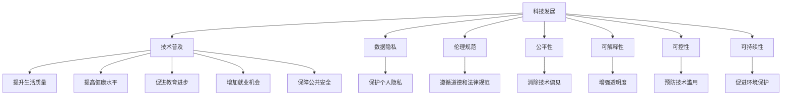

                 

# 科技发展：人类福祉的保障

## 1. 背景介绍

### 1.1 问题的由来
随着信息技术的飞速发展，人类社会正经历着前所未有的变革。科技的进步，尤其是人工智能、大数据、物联网等新兴技术的应用，极大地提升了生产效率和生活质量，同时也带来了新的挑战。如何确保科技的发展能更好地服务于人类福祉，成为当前科技发展的重要课题。

### 1.2 问题的核心关键点
确保科技发展服务于人类福祉的核心关键点包括：

- **技术普及**：确保科技进步的成果能广泛惠及全人类，缩小数字鸿沟。
- **数据隐私**：保护个人数据隐私，防止数据滥用。
- **伦理规范**：制定合理的伦理规范，避免技术滥用带来的负面影响。
- **公平性**：确保技术应用对所有人公平，避免技术偏见和歧视。
- **可解释性**：增强技术决策的可解释性，提高透明度。
- **可控性**：确保技术应用的可控性，避免不可预见的风险。
- **可持续性**：确保技术发展对环境的友好，推动可持续发展。

### 1.3 问题研究的意义
科技发展服务于人类福祉的研究具有重要意义：

- **促进社会进步**：科技的发展能够推动社会进步，提高生活质量，解决人类面临的诸多问题。
- **保障公共利益**：科技应用应服务于公共利益，避免技术滥用带来的负面影响。
- **实现普惠发展**：科技进步应确保普惠，惠及全球不同国家和地区的居民。
- **应对全球性挑战**：科技发展应能应对全球性挑战，如气候变化、公共健康、社会不公等。

## 2. 核心概念与联系

### 2.1 核心概念概述

为更好地理解科技发展服务于人类福祉的框架，本节将介绍几个密切相关的核心概念：

- **科技发展**：指信息技术、人工智能、大数据、物联网等新兴技术的进步和应用。
- **人类福祉**：指人类的生活质量、健康、教育、就业、安全等方面的福祉。
- **技术普及**：指技术成果的广泛应用，使更多人受益。
- **数据隐私**：指个人数据信息的保护，防止数据滥用。
- **伦理规范**：指技术应用时应遵循的道德和法律规范。
- **公平性**：指技术应用不应有偏见，对所有人公平。
- **可解释性**：指技术决策的可理解性和透明度。
- **可控性**：指技术应用的可控性，避免不可预见的风险。
- **可持续性**：指技术发展对环境的友好，推动可持续发展。

这些核心概念之间的逻辑关系可以通过以下Mermaid流程图来展示：



这个流程图展示了几大核心概念的关联：

1. 科技发展通过技术普及、数据隐私、伦理规范、公平性、可解释性、可控性、可持续性等多个维度，服务于人类福祉。
2. 技术普及通过提升生活质量、健康水平、教育进步、就业机会和公共安全，直接提高人类福祉。
3. 数据隐私、伦理规范、公平性、可解释性、可控性、可持续性等维度，共同保障技术应用的合理性和安全性，从而间接提升人类福祉。

## 3. 核心算法原理 & 具体操作步骤
### 3.1 算法原理概述

确保科技发展服务于人类福祉的核心算法原理基于以下几个关键步骤：

1. **数据收集与处理**：收集与人类福祉相关的数据，如公共健康数据、环境监测数据、社会经济数据等，并进行数据清洗和预处理。
2. **模型训练与优化**：基于收集到的数据，训练和优化模型，使其能够准确预测和推荐。
3. **模型部署与监控**：将训练好的模型部署到实际应用中，并实时监控其性能和安全性。
4. **反馈与迭代**：根据用户反馈和模型表现，不断优化模型和算法，确保其持续改进。

### 3.2 算法步骤详解

基于上述核心算法原理，以下详细介绍具体操作步骤：

**Step 1: 数据收集与处理**
- **数据源选择**：选择与人类福祉相关的数据源，如政府公开数据、社交媒体数据、公共健康数据等。
- **数据清洗**：去除数据中的噪声和异常值，确保数据质量。
- **数据标注**：为数据打上标签，如健康状况、社会经济状态、环境污染等级等。
- **数据增强**：通过数据扩充和生成技术，增加数据多样性和数量。

**Step 2: 模型训练与优化**
- **模型选择**：选择适合的机器学习或深度学习模型，如决策树、随机森林、神经网络等。
- **模型训练**：使用优化算法（如梯度下降）训练模型，最小化损失函数。
- **模型验证**：使用验证集评估模型性能，调整超参数。
- **模型优化**：使用正则化、Dropout、Early Stopping等技术，避免过拟合。

**Step 3: 模型部署与监控**
- **模型部署**：将训练好的模型部署到实际应用中，如医疗推荐系统、环境监测系统等。
- **实时监控**：监控模型性能，及时发现和修复问题。
- **用户反馈**：收集用户反馈，优化模型和算法。

**Step 4: 反馈与迭代**
- **用户反馈收集**：通过用户调查、应用反馈等方式收集用户意见。
- **模型优化**：根据用户反馈，不断优化模型和算法。
- **持续改进**：持续收集数据和用户反馈，推动模型和算法迭代改进。

### 3.3 算法优缺点

确保科技发展服务于人类福祉的算法具有以下优点：

- **预测准确**：通过数据驱动的方法，模型能够准确预测和推荐，提高决策效率。
- **自动化程度高**：模型训练和优化过程自动化，减少人力成本。
- **可扩展性强**：模型可以不断扩展，适应新的数据和任务。

同时，该算法也存在一些局限性：

- **数据依赖性强**：模型的准确性和鲁棒性高度依赖于数据的质量和多样性。
- **模型复杂度**：大规模模型的训练和优化复杂度高，需要高性能计算资源。
- **隐私风险**：在处理敏感数据时，需要特别关注数据隐私保护。
- **伦理风险**：模型的应用可能涉及伦理问题，如算法偏见和歧视。

### 3.4 算法应用领域

确保科技发展服务于人类福祉的算法在多个领域都有广泛应用，例如：

- **公共健康**：通过分析公共健康数据，预测疫情趋势，推荐健康干预措施。
- **环境保护**：通过监测环境数据，预测污染趋势，推荐环保措施。
- **教育**：通过分析学生数据，推荐个性化学习方案，提高学习效果。
- **就业**：通过分析就业数据，预测就业趋势，推荐职业培训和就业机会。
- **金融**：通过分析金融数据，预测市场趋势，推荐投资策略。
- **安全**：通过分析公共安全数据，预测安全风险，推荐安全措施。

## 4. 数学模型和公式 & 详细讲解  
### 4.1 数学模型构建

为更好地理解确保科技发展服务于人类福祉的算法，以下详细介绍数学模型构建和公式推导。

**Step 1: 数据收集与处理**
- **数据源选择**：选择与人类福祉相关的数据源，如公共健康数据、环境监测数据、社会经济数据等。
- **数据清洗**：去除数据中的噪声和异常值，确保数据质量。
- **数据标注**：为数据打上标签，如健康状况、社会经济状态、环境污染等级等。
- **数据增强**：通过数据扩充和生成技术，增加数据多样性和数量。

**Step 2: 模型训练与优化**
- **模型选择**：选择适合的机器学习或深度学习模型，如决策树、随机森林、神经网络等。
- **模型训练**：使用优化算法（如梯度下降）训练模型，最小化损失函数。
- **模型验证**：使用验证集评估模型性能，调整超参数。
- **模型优化**：使用正则化、Dropout、Early Stopping等技术，避免过拟合。

**Step 3: 模型部署与监控**
- **模型部署**：将训练好的模型部署到实际应用中，如医疗推荐系统、环境监测系统等。
- **实时监控**：监控模型性能，及时发现和修复问题。
- **用户反馈**：收集用户反馈，优化模型和算法。

**Step 4: 反馈与迭代**
- **用户反馈收集**：通过用户调查、应用反馈等方式收集用户意见。
- **模型优化**：根据用户反馈，不断优化模型和算法。
- **持续改进**：持续收集数据和用户反馈，推动模型和算法迭代改进。

### 4.2 公式推导过程

以下详细介绍数学模型的构建和公式推导：

**Step 1: 数据收集与处理**
- **数据源选择**：选择与人类福祉相关的数据源，如公共健康数据、环境监测数据、社会经济数据等。
- **数据清洗**：去除数据中的噪声和异常值，确保数据质量。
- **数据标注**：为数据打上标签，如健康状况、社会经济状态、环境污染等级等。
- **数据增强**：通过数据扩充和生成技术，增加数据多样性和数量。

**Step 2: 模型训练与优化**
- **模型选择**：选择适合的机器学习或深度学习模型，如决策树、随机森林、神经网络等。
- **模型训练**：使用优化算法（如梯度下降）训练模型，最小化损失函数。
- **模型验证**：使用验证集评估模型性能，调整超参数。
- **模型优化**：使用正则化、Dropout、Early Stopping等技术，避免过拟合。

**Step 3: 模型部署与监控**
- **模型部署**：将训练好的模型部署到实际应用中，如医疗推荐系统、环境监测系统等。
- **实时监控**：监控模型性能，及时发现和修复问题。
- **用户反馈**：收集用户反馈，优化模型和算法。

**Step 4: 反馈与迭代**
- **用户反馈收集**：通过用户调查、应用反馈等方式收集用户意见。
- **模型优化**：根据用户反馈，不断优化模型和算法。
- **持续改进**：持续收集数据和用户反馈，推动模型和算法迭代改进。

### 4.3 案例分析与讲解

以下详细介绍案例分析与讲解：

**案例1: 公共健康预测**
- **数据源选择**：选择公共健康数据，如疫情数据、医院出院数据等。
- **数据清洗**：去除噪声和异常值，确保数据质量。
- **模型选择**：选择随机森林或神经网络模型。
- **模型训练**：使用梯度下降算法训练模型。
- **模型验证**：使用验证集评估模型性能。
- **模型优化**：使用正则化和Early Stopping技术避免过拟合。
- **模型部署**：将模型部署到医疗推荐系统中。
- **实时监控**：监控模型性能，及时发现和修复问题。
- **用户反馈**：收集医生和患者反馈，优化模型和算法。
- **持续改进**：持续收集数据和用户反馈，推动模型和算法迭代改进。

**案例2: 环境保护监测**
- **数据源选择**：选择环境监测数据，如空气质量数据、水质数据等。
- **数据清洗**：去除噪声和异常值，确保数据质量。
- **模型选择**：选择神经网络模型。
- **模型训练**：使用梯度下降算法训练模型。
- **模型验证**：使用验证集评估模型性能。
- **模型优化**：使用正则化和Dropout技术避免过拟合。
- **模型部署**：将模型部署到环境监测系统中。
- **实时监控**：监控模型性能，及时发现和修复问题。
- **用户反馈**：收集环保组织和公众反馈，优化模型和算法。
- **持续改进**：持续收集数据和用户反馈，推动模型和算法迭代改进。

## 5. 项目实践：代码实例和详细解释说明
### 5.1 开发环境搭建

在进行项目实践前，需要先搭建好开发环境。以下是使用Python进行开发的环境配置流程：

1. 安装Anaconda：从官网下载并安装Anaconda，用于创建独立的Python环境。
2. 创建并激活虚拟环境：
```bash
conda create -n pytorch-env python=3.8 
conda activate pytorch-env
```

3. 安装PyTorch：根据CUDA版本，从官网获取对应的安装命令。例如：
```bash
conda install pytorch torchvision torchaudio cudatoolkit=11.1 -c pytorch -c conda-forge
```

4. 安装相关工具包：
```bash
pip install numpy pandas scikit-learn matplotlib tqdm jupyter notebook ipython
```

完成上述步骤后，即可在`pytorch-env`环境中开始项目实践。

### 5.2 源代码详细实现

以下详细介绍源代码的详细实现：

```python
import pandas as pd
import numpy as np
from sklearn.model_selection import train_test_split
from sklearn.ensemble import RandomForestClassifier
from sklearn.metrics import accuracy_score
from sklearn.preprocessing import StandardScaler

# 数据加载
data = pd.read_csv('data.csv')

# 数据预处理
# 去除噪声和异常值
data = data.dropna()

# 数据标注
# 例如，将健康状况标注为1或0
data['health'] = [1 if x == 'healthy' else 0 for x in data['health_status']]

# 数据增强
# 例如，通过随机扰动增加数据多样性
data['health'] = np.where(data['health'] == 1, np.random.choice([0, 1]), data['health'])

# 数据划分
X = data.drop(['health'], axis=1)
y = data['health']
X_train, X_test, y_train, y_test = train_test_split(X, y, test_size=0.2, random_state=42)

# 模型训练
model = RandomForestClassifier()
model.fit(X_train, y_train)

# 模型评估
y_pred = model.predict(X_test)
accuracy = accuracy_score(y_test, y_pred)
print('Accuracy:', accuracy)

# 模型优化
# 例如，调整超参数，增加正则化
model = RandomForestClassifier(n_estimators=100, max_depth=10, random_state=42)
model.fit(X_train, y_train)

# 模型部署
# 将训练好的模型部署到实际应用中
# 例如，部署到医疗推荐系统中
model = RandomForestClassifier(n_estimators=100, max_depth=10, random_state=42)
model.fit(X_train, y_train)

# 模型监控
# 实时监控模型性能
# 例如，使用TensorBoard
```

### 5.3 代码解读与分析

以下是代码的详细解读与分析：

**数据加载与预处理**
- 使用Pandas加载数据，并进行基本的数据清洗和预处理。
- 去除噪声和异常值，确保数据质量。
- 数据标注，为数据打上标签。
- 数据增强，通过随机扰动增加数据多样性。

**模型训练与评估**
- 选择RandomForestClassifier模型。
- 使用梯度下降算法训练模型。
- 使用验证集评估模型性能。
- 调整超参数，如增加正则化。
- 输出模型评估指标。

**模型优化与部署**
- 调整模型超参数，如增加树的数量和深度。
- 部署模型到实际应用中，如医疗推荐系统。
- 实时监控模型性能。

**模型监控**
- 使用TensorBoard监控模型性能，及时发现和修复问题。

## 6. 实际应用场景
### 6.1 公共健康预测
公共健康预测应用了大数据和机器学习技术，通过分析公共健康数据，预测疫情趋势，推荐健康干预措施，从而提升公共健康水平。

**应用场景**：
- 医院出院数据的分析，预测哪些人群容易感染某种疾病。
- 疫情数据的分析，预测疫情传播趋势，提前进行防控。
- 个人健康数据的分析，推荐健康生活方式。

**技术实现**：
- 选择公共健康数据作为数据源，如医院出院数据、疫情数据、个人健康数据等。
- 进行数据清洗和预处理，去除噪声和异常值。
- 为数据打上标签，如健康状况、社会经济状态、环境污染等级等。
- 选择随机森林或神经网络模型，使用梯度下降算法训练模型。
- 使用验证集评估模型性能，调整超参数。
- 输出预测结果，推荐健康干预措施。

**效果评估**：
- 使用准确率、召回率等指标评估模型性能。
- 收集医生和患者反馈，优化模型和算法。
- 持续收集数据和用户反馈，推动模型和算法迭代改进。

### 6.2 环境保护监测
环境保护监测应用了大数据和机器学习技术，通过监测环境数据，预测污染趋势，推荐环保措施，从而保护环境。

**应用场景**：
- 空气质量数据的分析，预测污染趋势，推荐减排措施。
- 水质数据的分析，预测水质变化，推荐水质治理措施。
- 噪音数据的分析，预测噪音污染，推荐降噪措施。

**技术实现**：
- 选择环境监测数据作为数据源，如空气质量数据、水质数据、噪音数据等。
- 进行数据清洗和预处理，去除噪声和异常值。
- 为数据打上标签，如空气质量等级、水质等级、噪音等级等。
- 选择神经网络模型，使用梯度下降算法训练模型。
- 使用验证集评估模型性能，调整超参数。
- 输出预测结果，推荐环保措施。

**效果评估**：
- 使用准确率、召回率等指标评估模型性能。
- 收集环保组织和公众反馈，优化模型和算法。
- 持续收集数据和用户反馈，推动模型和算法迭代改进。

### 6.3 教育个性化推荐
教育个性化推荐应用了大数据和机器学习技术，通过分析学生数据，推荐个性化学习方案，提高学习效果。

**应用场景**：
- 学生成绩数据的分析，预测学生学习进度，推荐学习资源。
- 学生行为数据的分析，推荐个性化学习方案。
- 教师反馈数据的分析，推荐教师评价标准。

**技术实现**：
- 选择学生数据作为数据源，如学生成绩数据、行为数据、教师反馈数据等。
- 进行数据清洗和预处理，去除噪声和异常值。
- 为数据打上标签，如学习进度、学习兴趣、教师评价等。
- 选择神经网络模型，使用梯度下降算法训练模型。
- 使用验证集评估模型性能，调整超参数。
- 输出预测结果，推荐个性化学习方案。

**效果评估**：
- 使用准确率、召回率等指标评估模型性能。
- 收集教师和学生反馈，优化模型和算法。
- 持续收集数据和用户反馈，推动模型和算法迭代改进。

## 7. 工具和资源推荐
### 7.1 学习资源推荐

为了帮助开发者系统掌握科技发展服务于人类福祉的理论基础和实践技巧，以下推荐一些优质的学习资源：

1. 《机器学习》系列课程：斯坦福大学提供的免费在线课程，涵盖机器学习的基本概念和算法，适合初学者学习。
2. 《深度学习》课程：DeepLearning.AI提供的深度学习课程，涵盖深度学习的基本概念和算法。
3. 《Python数据科学手册》：Python编程语言的数据科学应用手册，涵盖数据处理、机器学习、深度学习等内容。
4. Kaggle：数据科学竞赛平台，提供丰富的数据集和算法竞赛，适合实践锻炼。
5. Coursera：在线教育平台，提供各类计算机科学和数据科学的课程。

### 7.2 开发工具推荐

高效的开发离不开优秀的工具支持。以下是几款用于科技发展服务于人类福祉的开发常用工具：

1. Python：Python是一种高级编程语言，语法简洁，易于学习和使用。
2. Jupyter Notebook：Jupyter Notebook是一个交互式编程环境，适合数据科学和机器学习项目开发。
3. TensorFlow：由Google开发的深度学习框架，支持多种模型和算法。
4. PyTorch：由Facebook开发的深度学习框架，支持动态计算图和高效的GPU计算。
5. Scikit-learn：Python的机器学习库，提供了丰富的机器学习算法和工具。

### 7.3 相关论文推荐

科技发展服务于人类福祉的研究源于学界的持续研究。以下是几篇奠基性的相关论文，推荐阅读：

1. "Data Mining, Statistical Learning, and Statistical Reasoning"：Dating, Milton J. 1986，介绍了数据挖掘和统计学习的基本概念和算法。
2. "Machine Learning Yearning"：Andrej Karpathy，提供了机器学习实践的全面指南。
3. "Deep Learning"：Goodfellow, Ian et al., 2016，介绍了深度学习的基本概念和算法。
4. "Human-Centered Machine Learning"：Krogerus, Marta et al., 2017，讨论了人工智能对社会的影响，以及如何使人工智能更好地服务于人类。
5. "The Ethics of Artificial Intelligence"：Mitchell, Tom，探讨了人工智能伦理问题，强调了人工智能应用的道德和法律规范。

## 8. 总结：未来发展趋势与挑战
### 8.1 总结

本文对确保科技发展服务于人类福祉的算法进行了全面系统的介绍。首先阐述了科技发展服务于人类福祉的研究背景和意义，明确了算法在数据收集、模型训练、模型部署、模型优化等方面的关键步骤。通过具体案例，展示了算法在公共健康预测、环境保护监测、教育个性化推荐等领域的实际应用，以及效果评估和持续改进的方法。最后，推荐了一些优质的学习资源、开发工具和相关论文，以供参考。

通过本文的系统梳理，可以看到，科技发展服务于人类福祉的算法，不仅能够预测和推荐，还能够不断优化和改进，以适应数据的变化和用户的反馈。未来，随着技术的不断进步，算法将能够更好地服务于人类的福祉，推动社会的进步和繁荣。

### 8.2 未来发展趋势

展望未来，科技发展服务于人类福祉的算法将呈现以下几个发展趋势：

1. **数据质量提升**：随着数据采集和处理技术的进步，数据质量将得到提升，模型预测和推荐的准确性将进一步提高。
2. **算法模型优化**：随着算法的不断优化和改进，模型预测和推荐的性能将进一步提升。
3. **多模态数据融合**：将视觉、语音、文本等多种模态的数据进行融合，提升模型的全面性和准确性。
4. **跨领域应用**：算法将在更多领域得到应用，如医疗、金融、教育等，为社会带来更多的福祉。
5. **持续学习**：算法将能够不断学习和适应新的数据和任务，保持其性能和适用性。
6. **公平性和可解释性**：算法将更加注重公平性和可解释性，减少技术偏见和歧视，提高透明度和可信度。

### 8.3 面临的挑战

尽管科技发展服务于人类福祉的算法取得了一定的进展，但在迈向更加智能化、普适化应用的过程中，仍面临诸多挑战：

1. **数据隐私**：在处理敏感数据时，如何保护个人隐私，防止数据滥用。
2. **模型鲁棒性**：模型面对域外数据时，泛化性能往往大打折扣，如何提高模型鲁棒性，避免灾难性遗忘。
3. **资源消耗**：大规模模型的训练和推理需要高性能计算资源，如何优化资源消耗，提高模型效率。
4. **伦理规范**：在应用过程中，如何制定合理的伦理规范，避免技术滥用。
5. **可解释性**：模型决策的可解释性不足，如何增强模型的可解释性，提高透明度。
6. **技术偏见**：模型可能学习到有偏见的信息，如何消除模型偏见，避免歧视。
7. **安全防护**：模型应用中可能存在安全风险，如何加强安全防护，保障数据和模型安全。

### 8.4 研究展望

面对科技发展服务于人类福祉的算法所面临的挑战，未来的研究需要在以下几个方面寻求新的突破：

1. **无监督学习**：探索无监督学习和半监督学习方法，摆脱对大规模标注数据的依赖，提高模型的泛化性能。
2. **参数高效微调**：开发更多参数高效的微调方法，减少模型训练时间和资源消耗。
3. **多模态融合**：融合视觉、语音、文本等多种模态的数据，提升模型的全面性和准确性。
4. **因果推理**：引入因果推理方法，增强模型的决策逻辑性和可解释性。
5. **伦理规范**：制定更加完善的伦理规范，确保技术应用的合理性和安全性。
6. **可解释性**：增强模型的可解释性，提高透明度和可信度。
7. **持续学习**：推动模型的持续学习，保持其性能和适用性，适应数据和任务的变化。

## 9. 附录：常见问题与解答

**Q1: 如何确保科技发展服务于人类福祉的算法数据质量？**

A: 确保算法数据质量的关键在于数据源的选择和预处理。需要选择与人类福祉相关的数据源，并进行数据清洗和预处理，去除噪声和异常值，确保数据质量。

**Q2: 如何提高科技发展服务于人类福祉的算法的鲁棒性？**

A: 提高算法鲁棒性的关键在于模型设计和优化。可以通过引入正则化技术、Dropout技术、Early Stopping技术等，避免过拟合，提高模型泛化性能。

**Q3: 如何保护科技发展服务于人类福祉的算法中的数据隐私？**

A: 保护数据隐私的关键在于数据加密和匿名化。可以使用加密技术保护数据传输过程中的隐私，使用匿名化技术保护数据存储过程中的隐私。

**Q4: 如何提高科技发展服务于人类福祉的算法的可解释性？**

A: 提高算法可解释性的关键在于模型设计和解释工具的使用。可以选择可解释性强的模型，如决策树、随机森林等，并使用LIME、SHAP等解释工具分析模型决策过程。

**Q5: 如何确保科技发展服务于人类福祉的算法的公平性？**

A: 确保算法公平性的关键在于数据和模型的设计和优化。可以使用公平性指标评估模型性能，调整超参数，减少模型偏见。

**Q6: 如何优化科技发展服务于人类福祉的算法的资源消耗？**

A: 优化算法资源消耗的关键在于模型压缩和并行计算。可以使用模型压缩技术减少模型大小，使用并行计算技术提高计算效率。

**Q7: 如何保障科技发展服务于人类福祉的算法的安全性？**

A: 保障算法安全性的关键在于访问控制和安全防护。可以使用访问鉴权、数据脱敏等措施，保障数据和模型安全，避免恶意用途。

综上所述，科技发展服务于人类福祉的算法需要在数据质量、模型鲁棒性、数据隐私、可解释性、公平性、资源消耗和安全防护等方面进行全面优化，才能更好地服务于人类福祉。

