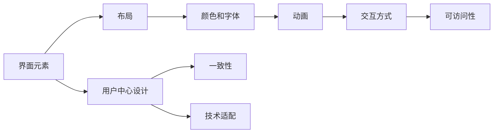

                 

# 移动应用UI/UX设计：Material Design与iOS设计规范

## 1. 背景介绍

在移动互联网的浪潮中，移动应用的UI/UX设计成为了吸引用户、提升用户体验的关键因素。随着技术的不断进步，各大平台也纷纷推出自己的设计规范和指南，以指导开发者进行高效的移动应用开发。Material Design（MD）和iOS设计规范是移动界面设计的两大重要参考框架，它们分别由Google和Apple推出，广泛应用于全球范围内的移动应用开发中。

### 1.1 问题由来
随着移动设备的功能越来越强大，用户对移动应用的交互体验也提出了更高的要求。传统的UI设计方法逐渐难以满足复杂多变的用户需求，各大平台也意识到规范化的设计指南对提升用户体验的重要性。因此，Google推出了Material Design，Apple推出了iOS设计规范，以规范移动应用的UI/UX设计，提升开发效率和用户体验。

### 1.2 问题核心关键点
- Material Design：一种设计语言，由Google在2014年推出，旨在为所有平台提供一致的设计体验。
- iOS设计规范：由Apple在2013年推出，主要用于指导iOS应用的UI/UX设计，强调简洁、优雅、高效的设计理念。
- 用户中心设计：将用户需求和体验放在首位，提升应用的用户满意度。
- 一致性：确保应用界面元素在不同设备上的风格一致。
- 交互性：通过动画、手势等交互方式提升用户的操作体验。
- 技术适配：考虑不同平台和设备的硬件性能，进行合理的UI设计。

## 2. 核心概念与联系

### 2.1 核心概念概述

为了更好地理解Material Design与iOS设计规范的差异和联系，我们首先需要了解一些关键的设计概念。

- 界面元素：包括按钮、输入框、列表等，是用户与应用的交互界面。
- 布局：通过网格、容器等布局方式，对界面元素进行合理排列。
- 颜色和字体：用于传达信息、增强美观度，需根据平台规范进行选色和排版。
- 动画：通过平滑的动画过渡，提升用户的视觉体验。
- 交互方式：如手势、点击等，增强用户的操作体验。
- 可访问性：确保所有用户都能方便地访问和操作应用。

通过这些概念，我们可以构建出一个全面的UI/UX设计框架，指导应用的开发。

### 2.2 核心概念原理和架构的 Mermaid 流程图



这个流程图展示了UI/UX设计的核心概念及其之间的联系：

1. 界面元素是设计的起点。
2. 布局、颜色和字体等元素设计需遵循设计规范。
3. 动画和交互方式提升用户体验。
4. 可访问性保障所有用户都能方便使用。
5. 用户中心设计、一致性和技术适配是设计的基础。

## 3. 核心算法原理 & 具体操作步骤

### 3.1 算法原理概述

Material Design和iOS设计规范均基于用户中心的设计理念，旨在通过合理的设计，提升应用的用户体验。它们主要关注以下几个方面：

- 一致性：确保应用界面元素在不同设备上的风格一致。
- 交互性：通过动画、手势等交互方式提升用户的操作体验。
- 可访问性：确保所有用户都能方便地访问和操作应用。
- 技术适配：考虑不同平台和设备的硬件性能，进行合理的UI设计。

### 3.2 算法步骤详解

#### 3.2.1 界面设计

界面设计是UI/UX设计的核心，主要包括以下步骤：

1. **定义设计目标**：明确应用的功能和用户需求，确定设计方向。
2. **草图设计**：通过手绘或工具绘制初步设计方案。
3. **原型设计**：使用工具如Sketch、Figma等进行高保真原型设计。
4. **用户反馈**：通过用户测试收集反馈，优化设计方案。
5. **最终设计**：根据反馈进行设计调整，输出最终的设计稿。

#### 3.2.2 颜色和字体设计

颜色和字体设计需要根据平台规范进行选择：

1. **颜色选择**：选择符合平台规范的颜色方案，如Google的Material Design色彩指南，包括主色、辅助色和强调色等。
2. **字体选择**：选择符合平台规范的字体方案，如Google的Roboto字体。
3. **一致性**：保持整个应用中的颜色和字体风格一致。

#### 3.2.3 动画和交互设计

动画和交互设计需要考虑用户的操作体验：

1. **动画设计**：设计平滑的动画过渡，提升用户的视觉体验。如Material Design中的涟漪效果。
2. **交互设计**：设计合理的交互方式，如手势、点击等。如iOS设计规范中的滑动和拖动。

#### 3.2.4 技术适配

技术适配需要考虑不同平台和设备的硬件性能：

1. **布局适配**：根据不同设备的屏幕尺寸，调整布局和元素大小。
2. **性能优化**：减少不必要的操作，优化渲染速度，提升应用性能。
3. **跨平台适配**：确保应用在iOS和Android上的一致性。

### 3.3 算法优缺点

Material Design和iOS设计规范各有优缺点：

#### 优点

- **一致性**：通过规范化的设计语言，提升应用的一致性。
- **用户体验**：关注用户操作体验，提升用户的满意度。
- **开发效率**：提供设计指南，加快开发进度。

#### 缺点

- **局限性**：规范可能限制了设计师的创意发挥。
- **复杂性**：需要设计师具备一定的设计规范理解能力。
- **兼容性**：不同平台和设备的适配需要额外的处理。

### 3.4 算法应用领域

Material Design和iOS设计规范广泛应用于以下几个领域：

- **移动应用**：提升应用的UI/UX设计，增强用户体验。
- **网页设计**：提供一致的UI/UX设计规范，提升网页体验。
- **产品设计**：指导产品设计的各个环节，提升产品的整体体验。
- **交互设计**：提升用户的操作体验，增强用户黏性。
- **用户研究**：指导用户测试和反馈收集，优化设计方案。

## 4. 数学模型和公式 & 详细讲解 & 举例说明

### 4.1 数学模型构建

为了更好地理解Material Design和iOS设计规范的数学模型，我们需要先了解一些基本的数学概念。

#### 4.1.1 界面元素

界面元素的设计需要考虑用户的交互体验，以下是一些基本的数学模型：

- **按钮设计**：按钮的尺寸、颜色、位置等需要进行数学建模，确保用户操作方便。
- **输入框设计**：输入框的大小、位置、颜色等需要进行数学建模，确保用户输入流畅。

#### 4.1.2 颜色和字体

颜色和字体设计需要遵循平台规范，以下是一些基本的数学模型：

- **颜色选择**：通过RGB、HSB等颜色模型选择符合平台规范的颜色方案。
- **字体选择**：通过字体大小、行间距、字间距等进行排版，确保文字清晰易读。

#### 4.1.3 动画和交互

动画和交互设计需要考虑用户的视觉体验，以下是一些基本的数学模型：

- **动画设计**：通过动画速度、位移、缓动等进行数学建模，确保动画流畅自然。
- **交互设计**：通过手势、点击等进行数学建模，确保用户操作便捷。

### 4.2 公式推导过程

#### 4.2.1 按钮设计

按钮的设计需要考虑用户的操作体验，以下是一些基本的公式推导：

1. **按钮尺寸**：按钮的尺寸需要根据用户的拇指大小进行计算，一般推荐最小尺寸为44x44像素。
2. **按钮间距**：按钮间距需要根据布局进行计算，一般推荐间距为8像素。

#### 4.2.2 颜色和字体

颜色和字体的设计需要遵循平台规范，以下是一些基本的公式推导：

1. **颜色选择**：通过RGB模型计算颜色值，确保颜色符合平台规范。
2. **字体选择**：通过字体大小、行间距、字间距等进行排版，确保文字清晰易读。

#### 4.2.3 动画和交互

动画和交互设计需要考虑用户的视觉体验，以下是一些基本的公式推导：

1. **动画设计**：通过动画速度、位移、缓动等进行数学建模，确保动画流畅自然。
2. **交互设计**：通过手势、点击等进行数学建模，确保用户操作便捷。

### 4.3 案例分析与讲解

#### 4.3.1 按钮设计案例

假设我们需要设计一个登录按钮，以下是一些基本的数学建模：

1. **按钮尺寸**：根据用户的拇指大小，计算出按钮的最小尺寸为44x44像素。
2. **按钮间距**：根据布局需求，计算出按钮之间的间距为8像素。

#### 4.3.2 颜色和字体案例

假设我们需要设计一个应用的标题，以下是一些基本的数学建模：

1. **颜色选择**：根据Google的Material Design色彩指南，选择符合平台规范的颜色方案。
2. **字体选择**：根据Google的Roboto字体，选择合适的字体大小、行间距、字间距等进行排版，确保文字清晰易读。

#### 4.3.3 动画和交互案例

假设我们需要设计一个应用的下拉刷新动画，以下是一些基本的数学建模：

1. **动画设计**：通过动画速度、位移、缓动等进行数学建模，确保动画流畅自然。
2. **交互设计**：设计合理的下拉刷新手势，增强用户的操作体验。

## 5. 项目实践：代码实例和详细解释说明

### 5.1 开发环境搭建

在进行项目实践前，我们需要准备好开发环境。以下是使用Xcode进行iOS应用开发的流程：

1. **安装Xcode**：从官网下载并安装Xcode。
2. **创建项目**：打开Xcode，选择创建新项目。
3. **配置项目**：根据项目需求进行配置，如添加界面、模块等。
4. **编写代码**：使用Swift等语言编写应用逻辑。
5. **调试和测试**：使用Xcode进行调试和测试，优化应用性能。

### 5.2 源代码详细实现

#### 5.2.1 界面设计

以下是一些基本的界面设计代码：

```swift
// 定义界面元素
let view1 = UIView(frame: CGRect(x: 50, y: 50, width: 200, height: 200))
let button = UIButton(type: .system)
button.frame = CGRect(x: 100, y: 100, width: 100, height: 50)
button.setTitle("登录", for: .normal)
button.addTarget(self, action: #selector(loginButtonTapped), for: .touchUpInside)
view.addSubview(button)
view.addSubview(view1)
```

#### 5.2.2 颜色和字体设计

以下是一些基本的代码实现：

```swift
// 定义颜色方案
let view1.backgroundColor = UIColor.white
let button.backgroundColor = UIColor.blue
let button.setTitleColor(UIColor.white, for: .normal)
```

#### 5.2.3 动画和交互设计

以下是一些基本的代码实现：

```swift
// 定义动画效果
UIView.animate(withDuration: 0.5, animations: {
    self.view1.transform = CGAffineTransform(scaleX: 1.5, y: 1.5)
}) { _ in
    UIView.animate(withDuration: 0.5, animations: {
        self.view1.transform = CGAffineTransform.identity
    })
}
```

### 5.3 代码解读与分析

#### 5.3.1 界面设计代码解读

```swift
// 定义界面元素
let view1 = UIView(frame: CGRect(x: 50, y: 50, width: 200, height: 200))
let button = UIButton(type: .system)
button.frame = CGRect(x: 100, y: 100, width: 100, height: 50)
button.setTitle("登录", for: .normal)
button.addTarget(self, action: #selector(loginButtonTapped), for: .touchUpInside)
view.addSubview(button)
view.addSubview(view1)
```

这段代码定义了界面元素和布局，通过创建UIView和UIButton对象，设置它们的frame和属性，将它们添加到主视图view中。

#### 5.3.2 颜色和字体代码解读

```swift
// 定义颜色方案
let view1.backgroundColor = UIColor.white
let button.backgroundColor = UIColor.blue
let button.setTitleColor(UIColor.white, for: .normal)
```

这段代码定义了颜色和字体，通过设置UIView的背景色和UIButton的背景色、标题颜色，确保界面元素的颜色和字体符合平台规范。

#### 5.3.3 动画和交互代码解读

```swift
// 定义动画效果
UIView.animate(withDuration: 0.5, animations: {
    self.view1.transform = CGAffineTransform(scaleX: 1.5, y: 1.5)
}) { _ in
    UIView.animate(withDuration: 0.5, animations: {
        self.view1.transform = CGAffineTransform.identity
    })
}
```

这段代码定义了动画效果，通过UIView.animate方法，设置动画的持续时间和变换效果，确保动画流畅自然。

### 5.4 运行结果展示

运行上述代码，可以展示出定义的界面元素、颜色和字体、动画和交互效果。通过Xcode进行调试和测试，可以优化应用性能，提升用户体验。

## 6. 实际应用场景

### 6.1 智能家居控制

智能家居控制应用需要具备简洁、优雅、高效的UI/UX设计，方便用户通过语音或手势进行控制。Material Design和iOS设计规范可以指导应用的界面设计，确保不同设备的风格一致，提升用户的体验。

### 6.2 健康监测

健康监测应用需要具备清晰、直观、易用的界面设计，方便用户监测健康数据。Material Design和iOS设计规范可以指导应用的界面设计，确保界面元素的颜色、字体、动画等符合平台规范，提升用户的视觉体验。

### 6.3 教育应用

教育应用需要具备简洁、易用、互动的界面设计，方便学生和教师进行互动。Material Design和iOS设计规范可以指导应用的界面设计，确保界面元素的一致性、交互性、可访问性等符合平台规范，提升用户的体验。

### 6.4 未来应用展望

随着移动设备的不断普及，移动应用的UI/UX设计将越来越重要。Material Design和iOS设计规范将继续引领移动应用的设计方向，提升用户的体验和满意度。未来，随着技术的不断进步，我们可以预见到更多的创新应用场景，如AR/VR应用、智能穿戴设备等，这些应用将更需要简洁、优雅、高效的UI/UX设计。

## 7. 工具和资源推荐

### 7.1 学习资源推荐

为了帮助开发者系统掌握Material Design与iOS设计规范的理论基础和实践技巧，这里推荐一些优质的学习资源：

1. **Google Material Design文档**：Google推出的官方文档，详细介绍了Material Design的设计理念和规范。
2. **Apple Human Interface Guidelines**：Apple推出的官方文档，详细介绍了iOS设计规范和最佳实践。
3. **Udacity课程**：Udacity推出的UI/UX设计课程，通过实际项目指导开发者掌握设计技能。
4. **Coursera课程**：Coursera推出的UI/UX设计课程，涵盖设计基础、原型设计、用户测试等环节。
5. **Smashing Magazine文章**：Smashing Magazine的文章，涵盖了Material Design和iOS设计规范的最新研究和实践案例。

通过对这些资源的学习实践，相信你一定能够快速掌握Material Design与iOS设计规范的精髓，并用于解决实际的UI/UX设计问题。

### 7.2 开发工具推荐

为了提高UI/UX设计的效率和质量，以下是几款常用的开发工具：

1. **Figma**：一款在线设计工具，支持多人协作，实时同步，适用于设计团队的设计工作。
2. **Sketch**：一款macOS平台的设计工具，支持多种格式输出，适用于专业设计师的设计工作。
3. **Adobe XD**：一款跨平台的设计工具，支持多种平台预览，适用于产品经理和UI设计师的设计工作。
4. **InVision**：一款原型设计和协作工具，支持动态交互，适用于设计团队的设计工作。
5. **Zeplin**：一款原型设计工具，支持多种设计规范输出，适用于设计团队的设计工作。

这些工具可以帮助设计师快速完成UI/UX设计，提升设计效率和质量。

### 7.3 相关论文推荐

Material Design和iOS设计规范的发展源于学界的持续研究。以下是几篇奠基性的相关论文，推荐阅读：

1. **Material Design论文**：Google在2014年推出的Material Design设计指南，详细介绍了Material Design的设计理念和规范。
2. **iOS设计规范论文**：Apple在2013年推出的iOS设计规范，详细介绍了iOS应用的UI/UX设计规范。
3. **Human Interface Guidelines论文**：Apple在2012年推出的Human Interface Guidelines设计规范，详细介绍了iOS应用的UI/UX设计规范。
4. **Interactive Elements论文**：Apple在2013年推出的Interactive Elements设计规范，详细介绍了iOS应用的交互设计规范。

这些论文代表了大语言模型微调技术的发展脉络。通过学习这些前沿成果，可以帮助研究者把握学科前进方向，激发更多的创新灵感。

## 8. 总结：未来发展趋势与挑战

### 8.1 研究成果总结

Material Design和iOS设计规范在提升移动应用的UI/UX设计方面起到了重要作用，成为业界广泛认可的设计标准。通过这些规范，设计师可以更方便地进行设计工作，提升应用的用户体验和满意度。

### 8.2 未来发展趋势

随着移动设备的不断普及，UI/UX设计的重要性将进一步提升。未来，UI/UX设计将更加注重用户体验、跨平台适配、技术优化等方面，为移动应用的发展提供更好的支持。

### 8.3 面临的挑战

尽管Material Design和iOS设计规范在UI/UX设计方面取得了显著成效，但在实际应用中仍面临一些挑战：

1. **复杂性**：设计规范需要设计师具备一定的理解能力，对新手来说可能较为复杂。
2. **创意限制**：设计规范可能限制了设计师的创意发挥，影响了设计的灵活性。
3. **跨平台适配**：不同平台和设备的适配需要额外的处理，增加了开发难度。

### 8.4 研究展望

为了应对这些挑战，未来的研究需要在以下几个方面寻求新的突破：

1. **简化设计规范**：通过设计简化工具和流程，提高设计师的工作效率。
2. **支持创意发挥**：在规范的基础上，提供更多的设计灵活性，提升设计的创意性和创新性。
3. **优化跨平台适配**：通过技术优化，提高跨平台适配的效果和效率。

这些研究方向的探索，必将引领UI/UX设计技术的不断发展，为移动应用的设计带来新的突破。面向未来，UI/UX设计技术还需要与其他技术进行更深入的融合，如人工智能、AR/VR等，共同推动移动应用的创新发展。

## 9. 附录：常见问题与解答

### 9.1 如何选择合适的界面元素？

A: 界面元素的选择需要根据应用的功能和用户需求进行设计。可以参考Material Design和iOS设计规范，选择合适的元素，确保用户的操作便捷和直观。

### 9.2 如何设计一致的布局？

A: 布局设计需要考虑应用的整体一致性，可以参考Material Design和iOS设计规范，使用网格、容器等布局方式，确保界面元素的一致性。

### 9.3 如何选择合理的颜色和字体？

A: 颜色和字体的选择需要遵循平台规范，可以参考Material Design和iOS设计规范，选择符合平台规范的颜色方案和字体方案，确保界面元素的颜色和字体风格一致。

### 9.4 如何设计平滑的动画效果？

A: 动画设计需要考虑用户的视觉体验，可以参考Material Design和iOS设计规范，使用平滑的动画过渡，确保动画流畅自然。

### 9.5 如何提升跨平台适配的效果？

A: 跨平台适配需要考虑不同平台和设备的硬件性能，可以参考Material Design和iOS设计规范，进行合理的UI设计，优化布局、颜色、字体等元素，确保应用的跨平台一致性。

---

作者：禅与计算机程序设计艺术 / Zen and the Art of Computer Programming

