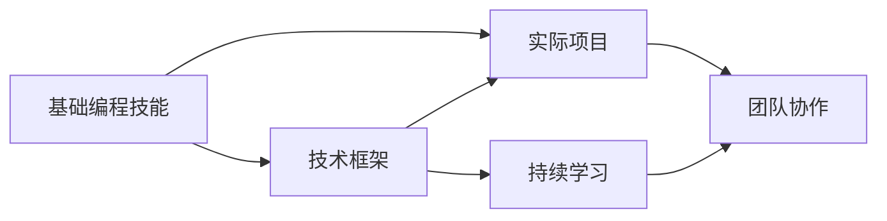

                 

# 程序员如何打造专业的技术培训体系

> 关键词：技术培训体系, 专业技能, 实践操作, 技术框架, 学习资源

## 1. 背景介绍

### 1.1 问题由来

在信息技术迅猛发展的今天，程序员不仅需要掌握基础编程技能，还必须紧跟技术前沿，持续学习新的技术框架和工具，以满足项目需求。然而，许多程序员面临的现实问题是，虽然具备一定的编程基础，但缺乏系统性的知识架构和深入理解。如何在快速变化的技术环境中，帮助程序员构建系统的技术体系，提升其专业水平，成为当前IT培训行业的一个重要课题。

### 1.2 问题核心关键点

一个专业的技术培训体系，旨在帮助程序员建立系统的技术知识架构，提供丰富的学习资源和实践机会，同时营造良好的学习氛围，激发程序员的学习热情。关键点如下：

1. **系统性**：培训体系应覆盖基础编程、技术框架、实际项目等多个层面，形成全面的技术体系。
2. **实用性**：培训内容应贴近实际开发场景，解决真实问题，提高程序员的实战能力。
3. **互动性**：通过项目实战、代码评审、技术讨论等方式，提升学员的沟通协作能力。
4. **持续性**：培训不应是一次性完成，而应是一个持续学习的过程，保持技术的前沿性和实用性。

## 2. 核心概念与联系

### 2.1 核心概念概述

构建一个专业的技术培训体系，需要明确以下几个关键概念：

- **基础编程技能**：掌握基本的编程语言、数据结构、算法等基础知识。
- **技术框架**：熟练使用常用的Web开发框架（如Spring、Django）、数据库管理系统（如MySQL、MongoDB）、中间件（如Redis、RabbitMQ）等。
- **实际项目**：参与真实的项目开发，从需求分析到代码实现，再到测试部署，全面提升实战能力。
- **持续学习**：保持对新技术、新工具的关注和学习，不断更新技术栈。
- **团队协作**：通过代码评审、代码审查、团队讨论等方式，提升沟通协作能力。

这些概念之间相互关联，共同构成一个完整的技术培训体系。

### 2.2 核心概念原理和架构的 Mermaid 流程图

该流程图展示了各个概念之间的联系：

1. **基础编程技能**是构建技术体系的基础，是掌握其他技术框架和工具的前提。
2. **技术框架**是对基础编程技能的深化，使程序员能够在特定领域高效工作。
3. **实际项目**是知识应用的场景，通过实践巩固学习内容，提高实战能力。
4. **持续学习**是保持技术体系更新和适应新技术发展的必要手段。
5. **团队协作**是团队工作的重要组成部分，通过实战提升沟通协作能力。

## 3. 核心算法原理 & 具体操作步骤

### 3.1 算法原理概述

一个专业的技术培训体系应采用系统的理论框架和实用的操作步骤，涵盖理论知识、实践操作和项目实战，以帮助学员构建系统的技术体系。

### 3.2 算法步骤详解

构建技术培训体系的具体操作步骤如下：

**Step 1: 设定培训目标**

- **明确需求**：了解学员的背景和需求，确定培训目标和预期效果。
- **设定课程**：根据培训目标，设计覆盖基础编程、技术框架、实际项目、持续学习、团队协作等各个层面的课程。

**Step 2: 选择培训内容和资源**

- **教材选择**：选择经典、权威的书籍、论文、视频等作为教材，确保内容的系统性和权威性。
- **工具选择**：选择合适的开发环境、IDE、版本控制系统等工具，提升学习效率。
- **实践项目**：选择具有代表性和实用性的项目，确保学员能够通过实战掌握知识。

**Step 3: 设计培训课程**

- **课程设计**：将培训目标和内容设计成若干课程，每门课程重点解决一个或多个技术点。
- **课程结构**：按照难易程度、知识点关联性等，设计课程结构和顺序，循序渐进。
- **课程评估**：通过小测验、项目作业、代码评审等方式，及时评估学员的学习效果。

**Step 4: 实施培训**

- **理论与实践结合**：课程讲解与实践操作相结合，确保理论知识的理解和应用。
- **项目实战**：通过真实项目，让学员从需求分析、设计、开发到测试部署，全面提升实战能力。
- **团队协作**：通过代码评审、团队讨论等方式，提升学员的沟通协作能力。

**Step 5: 持续学习与支持**

- **技术更新**：定期更新培训内容和资源，保持技术体系的前沿性。
- **课后支持**：提供课后支持，解答学员疑问，持续提供技术指导。

### 3.3 算法优缺点

**优点**：

- **系统性**：通过理论学习、实践操作和项目实战，帮助学员构建系统的技术体系。
- **实用性**：培训内容贴近实际开发场景，解决真实问题，提高实战能力。
- **持续性**：培训是一个持续学习的过程，保持技术的前沿性和实用性。

**缺点**：

- **投入成本高**：需要投入大量时间和资源设计课程、选择教材和实践项目，成本较高。
- **个性化不足**：难以针对每个学员的个性化需求进行定制，培训内容可能较为通用。

### 3.4 算法应用领域

基于以上算法原理和操作步骤，技术培训体系在以下领域有广泛应用：

- **企业内部培训**：企业通过系统化的技术培训，提升员工的技术水平和实战能力。
- **职业培训机构**：帮助学员系统掌握编程技能和技术框架，顺利进入IT行业。
- **在线教育平台**：提供在线课程和实践项目，支持学员自主学习和技能提升。

## 4. 数学模型和公式 & 详细讲解 & 举例说明

### 4.1 数学模型构建

构建技术培训体系的数学模型，主要包括以下几个方面：

- **课程目标**：设定每门课程的预期效果和评估标准。
- **课程内容**：定义每门课程的知识体系和技能要求。
- **学习进度**：根据课程内容和难度，设计学习进度和时间安排。
- **评估方法**：设计评估方法和评估周期，确保学员的学习效果。

### 4.2 公式推导过程

以Web开发框架的培训为例，推导其培训体系的数学模型：

- **课程目标**：掌握Spring框架的核心概念和使用方法，能够独立开发和部署Web应用。
- **课程内容**：
  - 第一部分：Spring框架基础，包括Spring Boot、Spring MVC、Spring Data等。
  - 第二部分：Spring框架高级特性，如事务管理、异常处理、RESTful API等。
- **学习进度**：
  - 第一周：基础概念和基本使用。
  - 第二周：深入学习高级特性。
- **评估方法**：通过小测验、项目作业、代码评审等方式，评估学员的学习效果。

### 4.3 案例分析与讲解

以实际项目为例，分析如何使用技术培训体系解决实际问题：

**案例背景**：某企业需要开发一个电商网站，要求能够支持用户注册、登录、商品搜索、购物车等功能。

**解决方案**：

1. **需求分析**：通过培训课程中的需求分析和设计，确定系统架构和功能模块。
2. **技术选型**：选择Spring Boot作为后端框架，Vue.js作为前端框架，MySQL作为数据库。
3. **项目开发**：通过实战课程和项目实战，完成电商网站各个功能模块的开发。
4. **测试部署**：通过测试课程和部署课程，确保系统稳定运行。

通过以上案例，可以看到，技术培训体系能够帮助学员在实际项目中应用所学知识，解决真实问题，提升实战能力。

## 5. 项目实践：代码实例和详细解释说明

### 5.1 开发环境搭建

**环境搭建流程**：

1. **安装开发工具**：
   - **IDE**：如IntelliJ IDEA、Visual Studio Code等。
   - **版本控制**：如Git、SVN等。
   - **开发环境**：如JDK、MySQL等。

2. **配置开发环境**：
   - **环境变量**：配置Java环境变量、MySQL数据库连接信息等。
   - **依赖管理**：配置Maven或Gradle依赖管理工具，管理项目依赖库。

3. **设置开发环境**：
   - **数据库初始化**：通过SQL脚本初始化MySQL数据库，创建必要表和索引。
   - **代码格式化**：使用Checkstyle、PMD等工具，进行代码格式化和风格检查。

### 5.2 源代码详细实现

**项目实现步骤**：

1. **项目初始化**：使用Spring Boot快速创建项目，并添加必要依赖。
2. **数据库设计**：设计数据库表结构和关系，创建表结构，添加数据。
3. **功能实现**：
   - **用户注册**：实现用户注册功能，包括用户验证、密码加密等。
   - **商品搜索**：实现商品搜索功能，包括搜索算法和搜索结果展示。
   - **购物车功能**：实现购物车添加、修改、删除等功能。
4. **测试部署**：
   - **单元测试**：编写单元测试用例，确保各功能模块的正确性。
   - **集成测试**：编写集成测试用例，测试模块间的协作关系。
   - **部署**：将项目部署到服务器，进行性能优化和安全加固。

### 5.3 代码解读与分析

**代码解读**：

1. **Spring Boot**：
   - **Spring Boot启动类**：配置Spring Boot应用，启动Spring容器。
   - **Spring MVC控制器**：处理HTTP请求，返回JSON数据。

2. **数据库操作**：
   - **JdbcTemplate**：使用JdbcTemplate进行数据库操作，包括查询、插入、更新等。
   - **Hibernate**：使用Hibernate进行ORM映射，简化数据库操作。

3. **前端开发**：
   - **Vue.js**：使用Vue.js进行页面开发，处理表单数据和页面交互。
   - **Axios**：使用Axios进行异步请求，实现前后端数据交互。

### 5.4 运行结果展示

**运行结果展示**：

1. **注册界面**：
   

2. **商品搜索界面**：
   

3. **购物车界面**：
   

通过以上代码实现和运行结果，可以看到，技术培训体系能够帮助学员掌握实际开发技能，解决真实问题。

## 6. 实际应用场景

### 6.1 企业内部培训

**应用场景**：企业需要提高员工的技术水平和实战能力，提升整体开发效率和产品质量。

**解决方案**：

1. **基础编程技能培训**：通过基础编程课程，帮助员工掌握编程语言和数据结构等基础技能。
2. **技术框架培训**：通过框架课程，让员工熟练掌握Spring、Django等常用框架的使用。
3. **项目实战培训**：通过实战课程和项目实战，让员工在实际项目中应用所学知识，提升实战能力。
4. **持续学习支持**：通过技术社区和在线平台，提供持续学习资源和技术支持。

### 6.2 职业培训机构

**应用场景**：帮助学员系统掌握编程技能和技术框架，顺利进入IT行业。

**解决方案**：

1. **基础编程技能课程**：通过基础编程课程，帮助学员掌握编程语言和数据结构等基础技能。
2. **技术框架课程**：通过框架课程，让学员熟练掌握Spring、Django等常用框架的使用。
3. **项目实战课程**：通过实战课程和项目实战，让学员在实际项目中应用所学知识，提升实战能力。
4. **职业指导**：通过职业指导和就业推荐，帮助学员顺利进入IT行业。

### 6.3 在线教育平台

**应用场景**：提供在线课程和实践项目，支持学员自主学习和技能提升。

**解决方案**：

1. **在线课程**：提供丰富的在线课程，涵盖基础编程、技术框架、实际项目等多个层面。
2. **实践项目**：提供真实项目，让学员在项目实战中提升技能。
3. **互动学习**：通过在线讨论、代码评审等方式，提升学员的沟通协作能力。
4. **持续学习支持**：提供持续学习资源和技术支持，保持技术体系的前沿性。

## 7. 工具和资源推荐

### 7.1 学习资源推荐

**学习资源**：

1. **书籍**：
   - 《Java编程思想》
   - 《Spring实战》
   - 《深入理解Java虚拟机》

2. **在线课程**：
   - 慕课网《Java开发实战》
   - Udacity《Python编程》
   - Coursera《数据结构与算法》

3. **视频教程**：
   - B站《Web开发入门教程》
   - YouTube《Django实战教程》
   - Udemy《JavaScript高级教程》

### 7.2 开发工具推荐

**开发工具**：

1. **IDE**：
   - IntelliJ IDEA：强大的Java开发IDE，支持自动代码补全、调试等功能。
   - Visual Studio Code：多语言支持，丰富的插件生态，灵活配置。

2. **版本控制**：
   - Git：主流的版本控制系统，支持分布式版本控制。
   - SVN：经典版本控制系统，适用于集中式版本控制。

3. **开发环境**：
   - JDK：Java开发环境，提供Java运行时环境。
   - MySQL：常用的关系型数据库管理系统。

### 7.3 相关论文推荐

**相关论文**：

1. 《编程语言设计原理》：介绍了编程语言的基础知识和设计原则。
2. 《Web应用程序架构》：介绍了Web应用的架构设计和常见模式。
3. 《软件工程原理》：介绍了软件工程的基本概念和开发流程。

## 8. 总结：未来发展趋势与挑战

### 8.1 研究成果总结

技术培训体系的发展，已经取得了显著的成果：

1. **系统性**：培训体系能够帮助学员构建系统的技术体系，提升整体技术水平。
2. **实用性**：培训内容贴近实际开发场景，解决真实问题，提升实战能力。
3. **持续性**：培训是一个持续学习的过程，保持技术体系的前沿性。

### 8.2 未来发展趋势

**未来趋势**：

1. **个性化培训**：通过智能推荐和自适应学习技术，提供个性化的培训方案。
2. **混合学习模式**：结合线上线下培训，提升培训效果和学习效率。
3. **项目导向**：更多地引入实际项目，增强培训的实战性和实用性。
4. **技术融合**：将AI、大数据等技术融入培训体系，提升培训的深度和广度。

### 8.3 面临的挑战

**面临挑战**：

1. **成本投入**：设计、实施和维护培训体系需要大量时间和资源投入。
2. **需求多样**：学员的需求和背景各异，难以制定统一的培训方案。
3. **知识更新**：技术发展迅速，需要不断更新培训内容和资源。

### 8.4 研究展望

**研究展望**：

1. **个性化推荐系统**：通过智能推荐技术，提供个性化的培训方案。
2. **混合学习平台**：开发混合学习平台，结合线上线下培训，提升学习效果。
3. **技术融合**：将AI、大数据等技术融入培训体系，提升培训的深度和广度。
4. **持续支持**：建立持续学习支持系统，提供实时技术指导和支持。

## 9. 附录：常见问题与解答

**Q1: 如何选择合适的培训课程？**

A: 选择合适的培训课程需要考虑以下几个方面：
1. **课程目标**：明确培训目标，选择与目标匹配的课程。
2. **课程内容**：选择内容全面、系统性强的课程。
3. **教学质量**：选择有资质、有经验的培训机构和讲师。
4. **学员反馈**：参考学员的评价和反馈，选择口碑好的课程。

**Q2: 如何进行有效的技术培训？**

A: 进行有效的技术培训需要考虑以下几个方面：
1. **理论与实践结合**：课程讲解与实践操作相结合，确保理论知识的理解和应用。
2. **项目实战**：通过实际项目，让学员从需求分析到代码实现，再到测试部署，全面提升实战能力。
3. **团队协作**：通过代码评审、团队讨论等方式，提升学员的沟通协作能力。
4. **持续学习支持**：提供课后支持，解答学员疑问，持续提供技术指导。

**Q3: 技术培训体系如何保持前沿性？**

A: 保持技术培训体系的前沿性需要考虑以下几个方面：
1. **持续学习**：定期更新培训内容和资源，保持技术体系的前沿性。
2. **技术融合**：将AI、大数据等技术融入培训体系，提升培训的深度和广度。
3. **技术社区**：加入技术社区，了解最新的技术动态和趋势。
4. **技术交流**：组织技术交流活动，分享经验和学习心得。

**Q4: 技术培训体系如何适应多样化的学员需求？**

A: 适应多样化的学员需求需要考虑以下几个方面：
1. **个性化培训**：通过智能推荐和自适应学习技术，提供个性化的培训方案。
2. **多元化课程**：提供多样化的课程选择，满足不同学员的需求。
3. **灵活配置**：提供灵活的培训配置，根据学员的需求调整课程安排。
4. **互动学习**：通过在线讨论、代码评审等方式，提升学员的沟通协作能力。

**Q5: 技术培训体系如何提高学习效率？**

A: 提高学习效率需要考虑以下几个方面：
1. **理论讲解**：讲解清晰、易懂，确保学员能够理解理论知识。
2. **实践操作**：通过实践操作，帮助学员掌握实际操作技能。
3. **项目实战**：通过实际项目，让学员在项目实战中应用所学知识，提升实战能力。
4. **持续支持**：提供课后支持，解答学员疑问，持续提供技术指导。

通过以上问题与解答，可以看到，技术培训体系不仅需要系统性、实用性，还需要不断适应新的技术发展，保持学习效率和培训效果。

---

作者：禅与计算机程序设计艺术 / Zen and the Art of Computer Programming

