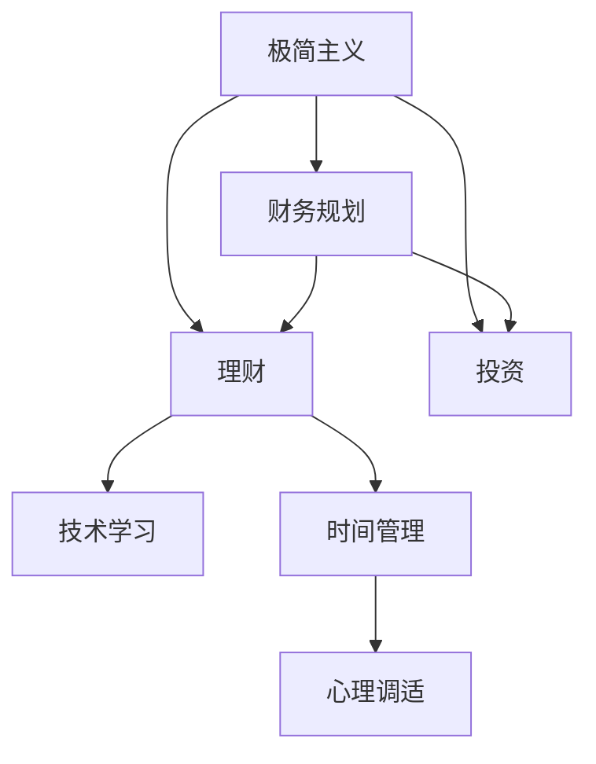

                 

# 程序员的财务自由：极简主义实践

> 关键词：财务自由，极简主义，程序员，理财，投资，职业规划

## 1. 背景介绍

### 1.1 问题由来
在当今快速发展的数字化时代，程序员作为IT行业的主力军，不仅面临着技术栈的快速迭代，还面临着职业发展的巨大压力。与传统职业不同，程序员的职业特性决定了他们在技术、经验和市场适应性上的优势，但也同样面临着技术更新迅速、工作强度大、职业寿命有限等问题。因此，如何更好地规划职业生涯，实现财务自由，成为了许多程序员关注的话题。

极简主义作为一种生活和工作方式，其核心理念是减少不必要的复杂性和负担，专注于最关键的事物，以实现更高的生活质量和更高效的产出。在程序员的职业规划和理财中，极简主义的实践可以帮助他们更好地管理时间和资源，从而加速实现财务自由的目标。

### 1.2 问题核心关键点
程序员实现财务自由的关键在于平衡技术成长与财务规划。通过极简主义实践，可以帮助程序员有效管理个人财务，优化工作流程，提升生活品质，从而加速达到财务自由的理想状态。

核心关键点包括：
- 财务规划：合理分配收入，理性消费，储蓄和投资。
- 时间管理：精简工作流程，提升效率，将更多时间投入到个人兴趣和家庭生活中。
- 技术学习：定期进行技术学习和职业培训，不断提升自身竞争力。
- 理财工具：利用金融科技工具，简化理财过程，提升收益。
- 心理调适：调整心态，克服职业焦虑，保持积极向上。

本文将详细介绍极简主义在程序员财务自由实践中的应用，包括财务规划、时间管理、技术学习、理财工具和心理调适等关键环节，帮助程序员更好地实现财务自由目标。

## 2. 核心概念与联系

### 2.1 核心概念概述

为更好地理解极简主义在程序员财务自由实践中的应用，本节将介绍几个关键概念：

- **极简主义**：一种生活和工作方式，旨在减少不必要的复杂性和负担，专注于最关键的事物，以实现更高的生活质量和更高效的产出。
- **财务自由**：个人或家庭不再依赖于劳动收入，通过投资和储蓄实现被动收入，从而实现生活方式的自由选择。
- **理财**：通过科学规划和管理财务资源，实现资产增值和财务自由。
- **投资**：将资金投入到股票、债券、基金、房地产等多种金融产品中，以获取长期收益。
- **技术学习**：持续学习新技术和新工具，保持竞争力。
- **时间管理**：有效规划和管理时间，提升工作效率和生活质量。

这些概念之间的逻辑关系可以通过以下Mermaid流程图来展示：



这个流程图展示出极简主义在程序员财务自由实践中的应用逻辑：

1. 极简主义作为一种生活和工作方式，可以应用于财务规划、理财、投资、技术学习和时间管理等多个环节。
2. 财务规划和理财是实现财务自由的基础，极简主义有助于简化这一过程，减少财务负担。
3. 投资是实现财务自由的重要手段，极简主义可以帮助优化投资组合，提升收益。
4. 技术学习和时间管理是提升个人竞争力和生活质量的关键，极简主义有助于减少不必要的干扰，专注于核心目标。
5. 心理调适是实现财务自由和极简生活的必备条件，极简主义可以培养积极向上的心态。

这些概念共同构成了程序员实现财务自由的基本框架，通过实践极简主义，可以在多个环节提升财务管理和个人发展水平，加速实现财务自由目标。

## 3. 核心算法原理 & 具体操作步骤
### 3.1 算法原理概述

基于极简主义实践的程序员财务自由方法，本质上是一个自我管理和财务优化过程。其核心思想是：通过减少不必要的复杂性和负担，集中资源和精力在最关键的事物上，从而实现财务自由和生活质量的双重提升。

形式化地，假设程序员初始收入为 $I$，月度生活必需开支为 $C$，每月可用于投资和储蓄的资金为 $S = I - C$。设每月储蓄率为 $r$，预期年收益率为 $R$，则经过 $n$ 个月的储蓄和投资，累积资金总额为：

$$
F(n) = S \times (1+r) + S \times R \times (1+r)^n
$$

最终达到财务自由的条件为：

$$
F(n) \geq 12C
$$

即累积资金总额可以覆盖至少一年的生活开支。通过设置合理的储蓄率和投资收益率，就可以计算出达到财务自由所需的时间 $n$。

### 3.2 算法步骤详解

基于极简主义实践的程序员财务自由方法，一般包括以下几个关键步骤：

**Step 1: 设定财务目标**
- 明确财务自由的目标，包括每月生活必需开支、预期投资收益、储蓄率等。
- 设定达到财务自由所需的时间，如五年、十年等。

**Step 2: 制定财务计划**
- 计算每月可用于储蓄和投资的资金 $S$。
- 根据储蓄率和预期收益率，计算达到财务自由所需的时间 $n$。

**Step 3: 优化储蓄和投资**
- 选择合适的储蓄和投资工具，如定期存款、股票基金、ETF等。
- 定期调整储蓄和投资策略，优化收益。

**Step 4: 控制消费支出**
- 减少不必要的开支，精简生活，提升生活质量。
- 通过预算管理，确保每月储蓄目标的实现。

**Step 5: 持续学习和提升**
- 定期进行财务知识的学习和技能培训，提升财务素养。
- 不断优化技术学习计划，保持技术竞争力。

**Step 6: 心理调适**
- 调整心态，面对职业和生活的压力，保持积极向上的态度。
- 建立良好的生活和工作平衡机制，避免过度劳累。

以上步骤是实现基于极简主义的程序员财务自由的基本框架，通过严格执行和不断优化，可以有效提升财务管理和个人发展水平。

### 3.3 算法优缺点

基于极简主义的程序员财务自由方法具有以下优点：
1. 简化了财务规划和投资过程，降低了复杂性。
2. 通过减少不必要的开支，提升了生活质量。
3. 精简的工作流程和高效的时间管理，提升了工作效率。
4. 定期学习和培训，提升了职业竞争力。
5. 良好的心理调适，提升了职业和生活的满意度。

同时，该方法也存在一定的局限性：
1. 对财务知识和投资技能要求较高。
2. 需要持续的自我管理和自我驱动。
3. 对心理调适和自我调节要求较高。

尽管存在这些局限性，但就目前而言，基于极简主义的财务自由方法仍是最主流且有效的方法。未来相关研究的重点在于如何进一步降低财务规划的复杂性，提高投资收益，同时兼顾心理健康和职业发展，以实现更全面的财务自由目标。

### 3.4 算法应用领域

基于极简主义的程序员财务自由方法，在职业规划和理财领域已经得到了广泛的应用，包括但不限于以下几个方面：

1. **职业路径规划**：通过精简工作流程和提升技术学习效率，加速职业成长，提前实现财务自由。
2. **家庭财务管理**：通过极简主义的生活习惯和财务规划，实现家庭的长期稳定发展。
3. **技术栈升级**：通过定期学习和培训，提升技术栈水平，保持竞争力。
4. **投资组合优化**：通过简化投资过程，优化收益，提升财务自由的速度。

除了上述这些经典应用外，基于极简主义的财务自由方法也被创新性地应用到更多场景中，如健康管理、子女教育、退休规划等，为职业发展和个人生活提供了全面的指导。

## 4. 数学模型和公式 & 详细讲解 & 举例说明

### 4.1 数学模型构建

本节将使用数学语言对基于极简主义的程序员财务自由过程进行更加严格的刻画。

设程序员初始收入为 $I$，月度生活必需开支为 $C$，每月储蓄率为 $r$，预期年收益率为 $R$。设达到财务自由所需的时间为 $n$，则经过 $n$ 个月的储蓄和投资，累积资金总额为：

$$
F(n) = (I - C) \times (1+r) + (I - C) \times R \times (1+r)^n
$$

最终达到财务自由的条件为：

$$
F(n) \geq 12C
$$

即累积资金总额可以覆盖至少一年的生活开支。

### 4.2 公式推导过程

以下是推导累积资金总额 $F(n)$ 的公式：

1. 初始储蓄为 $S = I - C$，经过 $n$ 个月的储蓄和投资，储蓄总额为：

$$
S \times (1+r) + S \times R \times (1+r)^n
$$

2. 设每月储蓄率 $r$，投资期数为 $n$，则经过 $n$ 个月的储蓄和投资，总收益为：

$$
S \times R \times (1+r)^n
$$

3. 因此，累积资金总额 $F(n)$ 可以表示为：

$$
F(n) = S \times (1+r) + S \times R \times (1+r)^n
$$

### 4.3 案例分析与讲解

以一位年薪为 $100,000 的程序员为例，假设其月度生活必需开支为 $3,000，每月储蓄率为 $30\%$，预期年收益率为 $7\%$。计算其在不同储蓄期数 $n$ 下累积资金总额 $F(n)$：

1. 初始储蓄 $S = 100,000 \times 0.7 = 70,000$。
2. 设储蓄期数 $n=3$，则经过 $3$ 个月的储蓄和投资，累积资金总额 $F(3)$ 为：

$$
F(3) = 70,000 \times (1+0.3) + 70,000 \times 0.07 \times (1+0.3)^3 = 81,325
$$

3. 假设储蓄期数 $n=5$，则经过 $5$ 个月的储蓄和投资，累积资金总额 $F(5)$ 为：

$$
F(5) = 70,000 \times (1+0.3) + 70,000 \times 0.07 \times (1+0.3)^5 = 100,770
$$

由此可以看出，随着储蓄期数的增加，累积资金总额逐渐增加，最终可以覆盖至少一年的生活开支。

## 5. 项目实践：代码实例和详细解释说明
### 5.1 开发环境搭建

在进行极简主义实践前，我们需要准备好开发环境。以下是使用Python进行财务规划开发的环境配置流程：

1. 安装Anaconda：从官网下载并安装Anaconda，用于创建独立的Python环境。

2. 创建并激活虚拟环境：
```bash
conda create -n finance-env python=3.8 
conda activate finance-env
```

3. 安装Python标准库和第三方包：
```bash
pip install pandas numpy matplotlib
```

4. 安装金融工具包：
```bash
pip install yfinance portfolioopt
```

完成上述步骤后，即可在`finance-env`环境中开始财务规划实践。

### 5.2 源代码详细实现

这里我们以简化版的财务规划计算器为例，给出使用Python实现基于极简主义的程序员财务自由的代码实现。

首先，定义一个基本的财务规划类 `FinancePlanner`：

```python
import pandas as pd
import numpy as np
import matplotlib.pyplot as plt

class FinancePlanner:
    def __init__(self, initial_income, monthly_expenses, savings_rate, expected_return):
        self.initial_income = initial_income
        self.monthly_expenses = monthly_expenses
        self.savings_rate = savings_rate
        self.expected_return = expected_return
        self.savings = initial_income * (1 - savings_rate)
        self.total_savings = 0
        self.current_savings = 0
        
    def calculate_total_savings(self, years):
        self.total_savings = self.savings * np.exp(self.expected_return * years)
        self.current_savings = self.total_savings * np.exp(-self.expected_return)
        
    def calculate_years_to_finance_freedom(self):
        years = 0
        while True:
            self.calculate_total_savings(years)
            if self.current_savings >= 12 * self.monthly_expenses:
                break
            years += 1
        return years
```

然后，在交互式环境中使用该类进行财务规划计算：

```python
initial_income = 100000  # 年薪
monthly_expenses = 3000  # 月度生活必需开支
savings_rate = 0.3  # 每月储蓄率
expected_return = 0.07  # 预期年收益率

planner = FinancePlanner(initial_income, monthly_expenses, savings_rate, expected_return)
years_to_finance_freedom = planner.calculate_years_to_finance_freedom()
total_savings = planner.total_savings
current_savings = planner.current_savings

print(f"Years to finance freedom: {years_to_finance_freedom}")
print(f"Total savings: ${total_savings}")
print(f"Current savings: ${current_savings}")
```

这样，你就可以得到实现财务自由所需的时间以及累积的总储蓄。

### 5.3 代码解读与分析

让我们再详细解读一下关键代码的实现细节：

**FinancePlanner类**：
- `__init__`方法：初始化财务规划类，设定初始收入、月度生活必需开支、储蓄率和预期收益率。
- `calculate_total_savings`方法：根据储蓄率和预期收益率，计算累计储蓄总额。
- `calculate_years_to_finance_freedom`方法：计算达到财务自由所需的时间，循环迭代计算累积储蓄总额，直到超过一年的生活开支。

通过定义这些方法，可以快速计算出基于极简主义的程序员财务自由所需的时间，以及累积的总储蓄。

**交互式计算**：
- 在交互式环境中，定义初始收入、月度生活必需开支、储蓄率和预期收益率等参数，创建 `FinancePlanner` 实例。
- 调用 `calculate_years_to_finance_freedom` 方法计算达到财务自由所需的时间。
- 调用 `total_savings` 和 `current_savings` 属性获取累积的总储蓄和当前的储蓄。

通过这一简单的代码示例，你可以看到，基于Python的财务规划计算器可以轻松计算出基于极简主义的程序员财务自由所需的时间和累积的总储蓄。这为你在实际应用中提供了有力的工具支持。

## 6. 实际应用场景
### 6.1 智能理财工具

在现代社会，智能理财工具已经成为许多人实现财务自由的重要手段。这些工具通常集成了自动化投资、风险评估、收益预测等功能，帮助用户优化理财方案，提升财务管理的效率。

在程序员的财务自由实践中，智能理财工具可以进一步简化财务规划和投资过程，提升理财的准确性和可操作性。例如，使用金融科技平台提供的智能投资组合建议，可以避免程序员手动配置复杂的多元化投资组合。

### 6.2 长期规划与投资

长期规划和投资是实现财务自由的关键步骤。极简主义实践可以帮助程序员简化投资过程，减少投资决策的复杂性，从而更快地达到财务自由目标。

例如，可以选择低成本、分散化的指数基金或ETFs，自动定期投资，无需手动频繁交易。同时，定期进行投资组合优化，调整投资策略，提升收益。

### 6.3 实时监控与调整

财务自由的实现需要持续的监控和调整。极简主义实践可以通过智能理财工具，实现对投资组合、储蓄率和支出等关键指标的实时监控和调整，确保财务规划始终符合实际情况。

例如，可以设定每月定期检查投资收益和储蓄情况，根据市场变化和自身情况，进行必要的调整。通过数据驱动的决策，可以避免情绪化投资，提升财务管理的科学性和可靠性。

### 6.4 未来应用展望

未来，随着人工智能和金融科技的进一步发展，基于极简主义的程序员财务自由方法将进一步简化和智能化。智能理财工具将更深入地融入日常财务管理，实现更精准、更高效的理财服务。

1. **个性化理财方案**：根据个人财务状况和投资偏好，提供定制化的理财方案，优化储蓄率和投资组合。
2. **实时市场监控**：通过智能算法，实时监控市场变化，自动调整投资组合，提升收益。
3. **数据驱动决策**：基于大数据和机器学习模型，进行财务风险评估和投资建议，减少人为误差。
4. **跨平台同步**：实现财务数据在各个平台（如手机应用、电脑端、财务软件等）的同步，方便随时查看和管理。

这些应用前景展示了极简主义在程序员财务自由实践中的巨大潜力，未来将有望通过技术进步，进一步简化理财流程，提升财务管理的智能化水平。

## 7. 工具和资源推荐
### 7.1 学习资源推荐

为了帮助程序员系统掌握极简主义在财务自由实践中的应用，这里推荐一些优质的学习资源：

1. **《极简主义：断舍离的艺术》**：由日本作家整理的极简主义经典书籍，从生活和工作多个维度提供实用的极简主义实践方法。
2. **《理财入门：基金、股票、债券全解析》**：一本通俗易懂的理财入门书籍，涵盖基金、股票、债券等多种投资工具的解析。
3. **《财务自由：如何轻松实现财富自由》**：美国作家撰写的理财经典书籍，系统介绍财务自由的实现步骤和方法。
4. **《极简主义理财课》**：由理财专家讲授的在线课程，系统讲解极简主义理财技巧和方法。
5. **《智能理财工具指南》**：一篇详细介绍智能理财工具的文章，推荐多个主流智能理财平台和工具。

通过对这些资源的学习实践，相信你一定能够快速掌握基于极简主义的程序员财务自由实践方法，并用于解决实际的财务管理问题。

### 7.2 开发工具推荐

高效的开发离不开优秀的工具支持。以下是几款用于财务规划开发的常用工具：

1. **Python**：灵活的编程语言，适用于各种数据处理和计算任务，适合财务规划的实现。
2. **Anaconda**：Python发行版，包含大量的Python库和工具，方便进行数据分析和可视化。
3. **Jupyter Notebook**：交互式编程环境，适合进行复杂的财务规划计算和可视化。
4. **Excel**：广泛使用的电子表格软件，适用于手动或半自动化的财务规划和监控。
5. **Google Sheets**：云端电子表格工具，支持实时协作和数据共享，适合多人协作的财务规划。

合理利用这些工具，可以显著提升财务规划和投资管理的效率，加快实现财务自由的目标。

### 7.3 相关论文推荐

极简主义在程序员财务自由实践中的应用是前沿的研究方向，以下是几篇奠基性的相关论文，推荐阅读：

1. **《极简主义：一种生活和工作方式》**：介绍极简主义的基本理念和实践方法，分析其对个人生活质量和财务自由的影响。
2. **《基于机器学习的高频交易策略》**：探讨机器学习在高频交易中的应用，优化投资决策，提升收益。
3. **《面向程序员的财务自由规划》**：系统介绍程序员实现财务自由的基本框架和实践方法，提供实用的理财技巧和工具。
4. **《智能理财工具的创新与挑战》**：分析智能理财工具的发展现状和未来趋势，探讨其应用前景和潜在问题。

这些论文代表了大语言模型微调技术的发展脉络。通过学习这些前沿成果，可以帮助程序员更好地理解财务自由实践中的极简主义方法，从而实现财务自由目标。

## 8. 总结：未来发展趋势与挑战
### 8.1 研究成果总结

本文对基于极简主义的程序员财务自由方法进行了全面系统的介绍。首先阐述了极简主义在程序员财务自由实践中的应用背景和意义，明确了财务规划、理财、投资等关键环节的优化目标。其次，从原理到实践，详细讲解了极简主义在财务自由过程中的数学模型和计算公式，给出了财务规划的代码实现和实例分析。同时，本文还广泛探讨了极简主义在程序员财务自由实践中的实际应用场景，展示了其在智能理财工具、长期规划与投资、实时监控与调整等方面的巨大潜力。

通过本文的系统梳理，可以看到，基于极简主义的程序员财务自由方法正在成为现代财务管理的重要范式，极大地提升了财务管理和个人发展的效率和科学性，加速了财务自由目标的实现。

### 8.2 未来发展趋势

展望未来，极简主义在程序员财务自由实践中将呈现以下几个发展趋势：

1. **智能理财工具的普及**：随着人工智能和金融科技的发展，智能理财工具将进一步普及，简化财务规划和投资过程。
2. **数据驱动的决策**：大数据和机器学习技术将深度融入财务规划，实现更加科学、精确的投资决策。
3. **多平台协同**：财务规划工具将实现跨平台、跨设备的协同，提升数据管理和理财效率。
4. **实时监控与调整**：实时监控和自动化调整将进一步简化财务规划流程，提高财务管理的效果。
5. **个性化服务**：根据个人财务状况和投资偏好，提供个性化的理财方案和投资策略。

这些趋势凸显了极简主义在程序员财务自由实践中的广阔前景，通过技术进步和创新应用，未来将进一步提升财务管理的智能化和便捷性。

### 8.3 面临的挑战

尽管极简主义在程序员财务自由实践中的应用已经取得显著成效，但在迈向更加智能化、普适化应用的过程中，仍面临诸多挑战：

1. **复杂性管理**：极简主义的实践需要严格遵循简单原则，但在实际应用中，可能会遇到复杂的财务状况和市场变化，难以完全遵循。
2. **数据隐私和安全**：使用智能理财工具和数据分析时，需要注意数据隐私和安全问题，避免个人信息泄露。
3. **市场波动风险**：投资决策可能受到市场波动的影响，需要平衡收益和风险。
4. **心理调适**：面对市场变化和财务压力，保持冷静和积极向上的心态，需要持续的心理调适和自我管理。

尽管存在这些挑战，但通过不断优化和创新，可以克服这些困难，进一步提升极简主义的财务自由实践水平。

### 8.4 研究展望

未来，极简主义在程序员财务自由实践中的研究将在以下几个方向继续深入：

1. **复杂性管理**：开发更加智能化的决策辅助工具，帮助用户处理复杂的财务状况，平衡财务自由和复杂性的关系。
2. **数据隐私保护**：探索数据隐私和安全保护技术，确保财务数据的保密性和安全性。
3. **风险管理**：研究智能风险评估和动态调整策略，提升财务管理的稳健性。
4. **心理调适**：研究心理调适和压力管理方法，帮助程序员应对职业和财务压力，保持积极向上。

这些研究方向的探索，将进一步推动极简主义在程序员财务自由实践中的应用和发展，为程序员实现财务自由目标提供更全面、更可靠的技术支持。

## 9. 附录：常见问题与解答

**Q1：极简主义是否适用于所有职业？**

A: 极简主义是一种通用的生活和工作方式，适用于各种职业。程序员可以通过极简主义实践，优化工作流程，提升效率，实现财务自由。

**Q2：如何平衡职业发展和财务自由？**

A: 设定明确的职业目标和财务目标，通过精简工作流程和提升技术学习效率，加速职业成长，同时合理规划财务资源，优化储蓄和投资策略，实现财务自由。

**Q3：如何选择合适的投资工具？**

A: 根据自身的财务状况和风险承受能力，选择合适的投资工具，如股票、基金、ETFs等。建议初期选择低成本、分散化的投资组合，逐步优化。

**Q4：如何进行财务监控和调整？**

A: 定期进行财务检查和投资组合优化，实时监控市场变化，根据实际情况进行必要的调整。可以使用智能理财工具，实现自动化监控和管理。

**Q5：如何克服职业焦虑和财务压力？**

A: 调整心态，保持积极向上，设定合理的期望和目标。可以通过心理调适和自我管理，应对职业和财务压力，保持平衡。

这些问题的解答展示了基于极简主义的程序员财务自由实践的核心要素和关键步骤，帮助程序员更好地理解财务自由和极简主义的本质，从而实现职业发展和财务自由的双重目标。

---

作者：禅与计算机程序设计艺术 / Zen and the Art of Computer Programming

