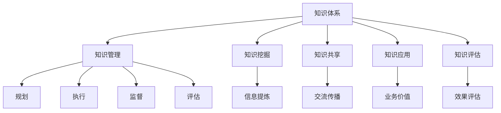

                 

## 1. 背景介绍

### 1.1 问题由来
在数字化转型加速的今天，管理者面临的挑战日益严峻。传统的管理模式和方法，在日益复杂和动态化的商业环境中显得力不从心。如何构建科学、系统、高效的知识体系，以适应快速变化的市场和环境，成为每个管理者必须直面的课题。

### 1.2 问题核心关键点
知识管理作为企业管理的重要组成部分，其核心在于构建和维护一个高效、合理、可持续的知识体系。这个体系不仅包括信息的获取、存储、共享，更重要的是如何将这些信息转化为驱动企业发展的知识和智慧。

### 1.3 问题研究意义
研究管理者构建知识体系的方法和工具，对于提升企业决策质量、优化运营效率、增强创新能力、降低运营风险具有重要意义：

1. **提升决策质量**：基于系统的知识体系，管理者能够更快地获取相关领域的前沿信息，更全面地理解问题的多方面因素，从而做出更加科学的决策。
2. **优化运营效率**：知识共享和复用能够减少重复劳动，提高员工的工作效率，增强企业的执行力和响应速度。
3. **增强创新能力**：知识体系的构建和维护本身就是一个创新的过程，通过不断学习、研究和实践，企业能够不断推出新的产品和服务，保持市场竞争力。
4. **降低运营风险**：系统化的知识管理能够及时发现和解决潜在问题，避免由于信息不对称导致的决策失误和运营风险。
5. **赋能人才发展**：知识体系不仅为员工提供学习资源，还能帮助他们更好地理解企业战略和文化，促进个人成长和职业发展。

## 2. 核心概念与联系

### 2.1 核心概念概述
为更好地理解管理者构建知识体系的方法和工具，本节将介绍几个密切相关的核心概念：

- **知识体系**：由组织内部各种信息（如文档、数据、技能、经验等）组成的系统化结构，旨在支持组织的学习、决策和创新。
- **知识管理**：通过规划、执行、监督和评估知识管理活动，使组织中的知识得以识别、收集、整理、共享、应用和保护的过程。
- **知识挖掘**：从大量原始数据中提炼出有价值的信息和知识，辅助企业做出科学决策。
- **知识共享**：通过知识交流和传播，使组织内部的知识得到更广泛的应用，提升整体的知识水平。
- **知识应用**：将知识应用于实际工作，转化为实际的业务价值，解决具体问题。
- **知识评估**：通过定期评估知识体系的效果，识别问题和改进空间，不断优化知识管理策略。

这些核心概念之间的逻辑关系可以通过以下Mermaid流程图来展示：



这个流程图展示了这个概念网络，揭示了知识体系构建过程中各个环节的紧密联系。

## 3. 核心算法原理 & 具体操作步骤

### 3.1 算法原理概述

管理者构建知识体系的核心算法原理，主要基于数据挖掘、信息检索和知识图谱等技术。其核心思想是通过收集、整理和分析组织内部的信息，构建一个结构化的知识库，使其成为支持组织决策和运营的知识基础。

具体而言，知识体系构建算法通常包括以下步骤：

1. **数据收集**：从不同来源（如内部系统、公开数据库、员工反馈等）收集相关数据。
2. **信息提炼**：通过文本挖掘、数据挖掘等技术，将原始数据提炼为有价值的信息。
3. **知识组织**：将提炼出的信息按照一定的结构进行组织，形成知识库。
4. **知识共享**：通过知识管理平台，实现知识在组织内部的共享和传播。
5. **知识应用**：将知识应用于实际业务中，支持决策和运营。
6. **知识评估**：定期评估知识体系的效果，发现问题并进行改进。

### 3.2 算法步骤详解

以下我们详细介绍知识体系构建的详细步骤：

**Step 1: 数据收集**
- 定义数据收集的目标和范围，确定需要收集的数据类型和来源。
- 使用爬虫、API、数据库查询等方式收集数据。
- 对收集到的数据进行清洗和预处理，去除噪声和冗余信息。

**Step 2: 信息提炼**
- 应用自然语言处理（NLP）技术，如分词、命名实体识别（NER）、情感分析等，对文本数据进行提炼。
- 使用机器学习算法，如聚类、分类、回归等，对结构化数据进行提炼。
- 利用数据可视化工具，如Tableau、Power BI等，对提炼出的信息进行可视化展示。

**Step 3: 知识组织**
- 设计知识库的结构，确定分类和标签体系。
- 使用知识管理软件，如Confluence、SharePoint等，创建和维护知识库。
- 定期更新知识库，确保其时效性和准确性。

**Step 4: 知识共享**
- 搭建知识共享平台，支持文档、视频、代码等知识的共享。
- 使用社交网络工具，如Slack、Teams等，促进知识在团队间的交流。
- 组织内部培训和研讨会，促进知识在组织内部的传播。

**Step 5: 知识应用**
- 在决策过程中，应用知识库中的信息进行支持。
- 在运营管理中，应用知识库中的最佳实践进行优化。
- 在产品开发中，应用知识库中的市场调研和技术分析。

**Step 6: 知识评估**
- 设定评估指标，如知识使用率、决策支持效果等。
- 定期收集评估数据，进行效果分析。
- 根据评估结果，发现问题和改进空间，优化知识管理体系。

### 3.3 算法优缺点

管理者构建知识体系的方法有以下优点：

- **提升决策质量**：系统化的知识体系提供全面、准确的信息支持，帮助管理者做出更科学、更全面的决策。
- **优化运营效率**：知识共享和复用减少了重复劳动，提高了运营效率。
- **增强创新能力**：知识体系的构建和维护本身就是一个创新的过程，推动企业的持续创新。
- **降低运营风险**：系统化的知识管理减少了信息不对称，降低了运营风险。
- **赋能人才发展**：知识体系为员工提供学习资源，促进个人成长和职业发展。

同时，该方法也存在一定的局限性：

- **初期投入大**：知识体系的构建和维护需要大量人力、物力和财力投入，初期成本较高。
- **更新频率高**：知识体系需要不断更新，以保持其时效性和准确性，维护成本较高。
- **复杂度高**：知识体系的构建和管理较为复杂，需要专业的知识和技能。
- **依赖技术**：知识体系的构建和管理依赖于先进的信息技术和工具。

尽管存在这些局限性，但知识体系构建仍然是提升企业管理水平的重要手段。未来，随着技术的不断进步和管理的不断创新，知识体系的构建将更加高效和智能，其应用也将更加广泛和深入。

### 3.4 算法应用领域

知识体系构建的方法已经广泛应用于各种管理场景中，例如：

- **战略管理**：通过知识体系支持企业战略规划和目标设定，确保战略的一致性和可执行性。
- **运营管理**：通过知识体系优化运营流程，提高运营效率和质量。
- **人力资源管理**：通过知识体系支持员工培训和发展，提升人力资源管理水平。
- **市场分析**：通过知识体系进行市场调研和数据分析，支持市场决策。
- **项目管理**：通过知识体系支持项目管理，提高项目执行效率和成功率。

除了上述这些经典应用外，知识体系构建还被创新性地应用于更多场景中，如客户关系管理、供应链管理、风险管理等，为企业带来更高的运营效率和竞争优势。

## 4. 数学模型和公式 & 详细讲解 & 举例说明

### 4.1 数学模型构建

知识体系构建的数学模型主要基于信息检索、知识图谱和推荐系统等技术。以下以信息检索为例，介绍知识体系构建的数学模型构建。

假设有一个包含$N$个文档的知识库，每个文档$d_i$包含$T_i$个词语，知识库的总词汇量为$V$。定义查询$q$与文档$d_i$之间的相关度为$R_{q,d_i}$，查询结果为$R$。信息检索的数学模型可以表示为：

$$
R = \sum_{i=1}^{N} w_i R_{q,d_i}
$$

其中$w_i$为文档$d_i$的权重，通常根据文档的相关性、更新时间等因素进行计算。

### 4.2 公式推导过程

对于信息检索模型，常用的相关度计算方法包括余弦模型、BM25模型等。这里以余弦模型为例，推导信息检索的相关度计算公式。

设查询$q$和文档$d_i$的向量表示分别为$q= \left(q_1, q_2, ..., q_T\right)$和$d_i=\left(d_{i1}, d_{i2}, ..., d_{iT}\right)$，则余弦模型下的相关度$R_{q,d_i}$可以表示为：

$$
R_{q,d_i} = \frac{q \cdot d_i}{\|q\| \|d_i\|}
$$

其中$\cdot$表示向量点乘，$\|q\|$和$\|d_i\|$分别为查询和文档向量的模长。

将余弦模型代入信息检索模型中，得：

$$
R = \sum_{i=1}^{N} w_i \frac{q \cdot d_i}{\|q\| \|d_i\|}
$$

这就是信息检索模型的数学表达，通过计算查询与文档的相关度，实现知识库的快速检索和定位。

### 4.3 案例分析与讲解

以电商平台为例，分析如何利用信息检索技术构建商品推荐系统。电商平台拥有海量的商品信息和用户行为数据，需要通过信息检索技术，从这些数据中提炼出有价值的信息，辅助商品推荐。

假设商品库中有$M$个商品，每个商品包含多个属性（如品牌、价格、评分等），用户的历史行为数据包含$U$个用户和每个用户的$K$个浏览记录。商品推荐系统的数学模型可以表示为：

$$
R = \sum_{i=1}^{M} w_i R_{u_i, p_i}
$$

其中$R_{u_i, p_i}$表示用户$u_i$对商品$p_i$的评分，$w_i$为商品$p_i$的权重。通过计算用户和商品的评分相关度，生成推荐结果。

## 5. 项目实践：代码实例和详细解释说明

### 5.1 开发环境搭建

在进行知识体系构建的实践前，我们需要准备好开发环境。以下是使用Python进行ElasticSearch开发的开发环境配置流程：

1. 安装ElasticSearch：从官网下载并安装ElasticSearch，确保其正常运行。
2. 安装Python客户端库：使用pip安装ElasticSearch的Python客户端库，如elasticsearch。
3. 搭建测试环境：在本地或云平台搭建ElasticSearch的测试环境，确保能够稳定访问。

### 5.2 源代码详细实现

下面以构建商品推荐系统为例，给出使用ElasticSearch进行信息检索的Python代码实现。

首先，我们需要定义商品和用户的数据模型：

```python
from elasticsearch import Elasticsearch

# 定义商品和用户的数据模型
class Product:
    def __init__(self, id, name, price, brand, score):
        self.id = id
        self.name = name
        self.price = price
        self.brand = brand
        self.score = score

class User:
    def __init__(self, id, clicks):
        self.id = id
        self.clicks = clicks

# 定义数据读取器
def read_products():
    products = []
    # 从数据库或文件中读取商品数据
    # ...
    return products

def read_users():
    users = []
    # 从数据库或文件中读取用户数据
    # ...
    return users
```

然后，定义信息检索函数：

```python
from elasticsearch import Elasticsearch
from elasticsearch_dsl import Search, Q

# 定义信息检索函数
def search_product(query, sort_by=None, score=False):
    es = Elasticsearch()
    
    # 构建查询条件
    query = Q('match', name=query)
    
    # 查询商品库
    s = Search(using=es)
    s = s.query(query)
    
    # 添加排序条件
    if sort_by:
        s = s.sort(sort_by, order='desc')
    
    # 获取查询结果
    results = s.execute()
    
    # 计算得分
    if score:
        scores = []
        for hit in results:
            scores.append(hit['score'])
        return results.hits, scores
    else:
        return results.hits, None
```

最后，启动信息检索流程：

```python
# 读取商品和用户数据
products = read_products()
users = read_users()

# 构建查询
query = '手机'

# 执行信息检索
results, scores = search_product(query)

# 输出查询结果
for hit in results:
    print(hit)
```

以上就是使用ElasticSearch构建商品推荐系统的完整代码实现。可以看到，ElasticSearch提供了强大的搜索功能，能够高效地检索知识库中的信息，满足推荐系统的需求。

### 5.3 代码解读与分析

让我们再详细解读一下关键代码的实现细节：

**Product和User类**：
- `Product`类：定义商品的基本属性，如ID、名称、价格、品牌和评分。
- `User`类：定义用户的基本属性，如ID和浏览记录。

**read_products和read_users函数**：
- `read_products`函数：从数据库或文件中读取商品数据，返回一个商品列表。
- `read_users`函数：从数据库或文件中读取用户数据，返回一个用户列表。

**search_product函数**：
- 使用ElasticSearch客户端连接到ElasticSearch服务器。
- 构建查询条件，如匹配商品名称。
- 执行查询，获取结果。
- 计算得分，返回查询结果和得分列表。

**启动信息检索流程**：
- 读取商品和用户数据。
- 构建查询。
- 执行信息检索。
- 输出查询结果。

可以看到，通过Python和ElasticSearch的结合，我们可以快速构建商品推荐系统，实现高效的查询和检索功能。

## 6. 实际应用场景

### 6.1 智能客服系统

智能客服系统通过构建知识库，能够快速响应客户咨询，提供准确、及时的服务。在实际应用中，智能客服系统可以采用以下方法：

1. **构建知识库**：从客服记录、FAQ文档、内部系统等渠道收集信息，构建知识库。
2. **信息检索**：在客户提出问题时，通过信息检索技术快速定位答案。
3. **多轮对话**：结合自然语言处理技术，实现多轮对话，解决复杂问题。

例如，某电商平台通过构建商品推荐系统，提高了客户满意度。在客户咨询时，智能客服系统能够快速查找商品信息，并提供推荐结果，大大提升了客户体验。

### 6.2 金融风险管理

金融风险管理需要处理大量的金融数据和市场信息。通过构建知识体系，能够实现更高效的风险评估和决策支持。

1. **数据收集**：从金融市场、新闻媒体等渠道收集数据。
2. **信息提炼**：使用NLP技术提炼出关键信息，如市场动向、政策变化等。
3. **知识组织**：将提炼出的信息按照金融产品和市场领域进行分类和组织。
4. **知识共享**：在金融团队中分享和传播知识，提高决策效率。

例如，某银行通过构建知识库，提高了风险评估的准确性。在市场波动时，风险管理团队能够快速获取相关数据和分析结果，做出科学决策，降低风险。

### 6.3 制造业供应链管理

制造业供应链管理需要处理大量的物流、库存和生产数据。通过构建知识体系，能够实现更高效的管理和优化。

1. **数据收集**：从ERP系统、物流系统等渠道收集数据。
2. **信息提炼**：使用数据挖掘技术提炼出生产、库存、物流等关键信息。
3. **知识组织**：将提炼出的信息按照供应链环节进行分类和组织。
4. **知识共享**：在供应链团队中分享和传播知识，提高管理效率。

例如，某制造企业通过构建知识库，优化了供应链管理。在生产计划调整时，能够快速获取相关数据和分析结果，降低库存和物流成本，提高生产效率。

### 6.4 未来应用展望

随着信息技术和知识管理技术的不断发展，基于信息检索的知识体系构建方法将在更多领域得到应用，为各行业带来变革性影响。

在智慧医疗领域，知识体系构建能够提升医疗决策质量，优化诊疗流程，推动医疗智能化发展。

在智能教育领域，知识体系构建能够支持个性化学习，提升教育质量，推动教育信息化进程。

在智慧城市治理中，知识体系构建能够提升城市管理效率，优化公共服务，推动智慧城市建设。

此外，在企业生产、社会治理、文娱传媒等众多领域，知识体系构建也将不断涌现，为各行各业带来更高的运营效率和更好的用户体验。

## 7. 工具和资源推荐

### 7.1 学习资源推荐

为了帮助开发者系统掌握知识体系构建的技术基础和实践技巧，这里推荐一些优质的学习资源：

1. **《信息检索》书籍**：系统介绍信息检索的理论基础和技术细节，是信息检索领域的经典教材。
2. **Coursera《信息检索》课程**：斯坦福大学开设的在线课程，深入浅出地讲解信息检索的各个环节，适合入门学习。
3. **arXiv论文**：大量最新的信息检索研究论文，涵盖各类前沿技术，适合深入研究。

通过对这些资源的学习实践，相信你一定能够快速掌握信息检索和知识体系构建的精髓，并用于解决实际的业务问题。

### 7.2 开发工具推荐

高效的开发离不开优秀的工具支持。以下是几款用于知识体系构建开发的常用工具：

1. **ElasticSearch**：强大的搜索和分析平台，支持大规模数据处理和实时查询。
2. **Solr**：Apache基金会提供的搜索服务，支持多种数据源和查询语言。
3. **Lucene**：Apache基金会提供的全文搜索引擎，支持文本检索和分析。
4. **TensorFlow**：用于深度学习的开源框架，支持复杂模型构建和训练。
5. **Keras**：用于深度学习的高级API，支持快速模型构建和训练。

合理利用这些工具，可以显著提升知识体系构建的开发效率，加快创新迭代的步伐。

### 7.3 相关论文推荐

知识体系构建的研究源于学界的持续研究。以下是几篇奠基性的相关论文，推荐阅读：

1. **《网页检索中的信息抽取》（Information Extraction in Web Retrieval）**：提出基于网页抽取的信息检索方法，提高了检索效果。
2. **《基于语义的Web信息检索》（Semantic Web Information Retrieval）**：提出基于语义的知识图谱技术，提升了检索的准确性和相关性。
3. **《深度学习在信息检索中的应用》（Deep Learning in Information Retrieval）**：介绍深度学习在信息检索中的应用，推动了信息检索技术的进步。

这些论文代表了大语言模型微调技术的发展脉络。通过学习这些前沿成果，可以帮助研究者把握学科前进方向，激发更多的创新灵感。

## 8. 总结：未来发展趋势与挑战

### 8.1 总结

本文对管理者构建知识体系的方法进行了全面系统的介绍。首先阐述了知识体系构建的背景和意义，明确了知识体系构建在提升决策质量、优化运营效率、增强创新能力、降低运营风险方面的独特价值。其次，从原理到实践，详细讲解了知识体系构建的数学原理和关键步骤，给出了知识体系构建的完整代码实例。同时，本文还广泛探讨了知识体系在智能客服、金融风险管理、制造业供应链管理等多个行业领域的应用前景，展示了知识体系构建的广阔应用空间。最后，本文精选了知识体系构建的各种学习资源，力求为读者提供全方位的技术指引。

通过本文的系统梳理，可以看到，知识体系构建已成为提升企业管理水平的重要手段。知识体系的构建和维护不仅需要先进的技术支持，还需要科学的管理策略和合理的运营机制。只有全面考虑这些因素，才能真正实现知识体系的价值，推动企业管理向更高的层次迈进。

### 8.2 未来发展趋势

展望未来，知识体系构建将呈现以下几个发展趋势：

1. **智能化**：结合AI技术，如自然语言处理、机器学习等，实现智能化的知识检索和应用。
2. **实时化**：通过实时数据处理和分析，实现知识体系的动态更新和维护。
3. **个性化**：根据用户需求和行为，实现个性化的知识推荐和应用。
4. **跨领域**：知识体系的构建将跨越多个领域，形成跨领域知识整合的能力。
5. **安全化**：结合数据安全和隐私保护技术，保障知识体系的安全性和可靠性。

以上趋势凸显了知识体系构建技术的广阔前景。这些方向的探索发展，必将进一步提升知识体系构建的效果，实现更加高效、智能的知识管理。

### 8.3 面临的挑战

尽管知识体系构建已经取得了显著进展，但在迈向更加智能化、实时化、个性化、跨领域化应用的过程中，它仍面临诸多挑战：

1. **数据质量瓶颈**：知识体系构建依赖于高质量的数据，但数据获取和处理往往面临较大的挑战。如何提高数据质量，降低数据获取成本，将是重要的研究方向。
2. **技术复杂度高**：知识体系构建涉及多种技术，如信息检索、知识图谱、数据挖掘等，需要多学科的综合知识。如何简化技术实现，降低技术门槛，将是重要的实践课题。
3. **知识共享困难**：知识体系的构建和管理依赖于组织的知识共享和协作，但在实际应用中，跨部门、跨团队的协作难度较大。如何促进知识共享，提升协作效率，将是重要的管理课题。
4. **知识更新频繁**：知识体系需要不断更新，以保持其时效性和准确性，但知识更新的成本较高。如何降低知识更新的频率，提高知识更新的效率，将是重要的优化方向。
5. **数据安全和隐私保护**：知识体系的构建和管理涉及大量敏感数据，如何保障数据安全和隐私保护，将是重要的技术课题。

正视知识体系构建面临的这些挑战，积极应对并寻求突破，将使知识体系构建迈向成熟，实现更加高效、智能的知识管理。相信随着学界和产业界的共同努力，知识体系构建必将在各行各业大放异彩，深刻影响人类的生产生活方式。

### 8.4 研究展望

面对知识体系构建所面临的种种挑战，未来的研究需要在以下几个方面寻求新的突破：

1. **自动化技术**：引入自动化技术，如机器学习、自然语言处理等，减少人工干预，提高知识体系的构建效率。
2. **跨领域融合**：将知识体系构建与外部知识库、规则库等专家知识结合，形成更加全面、准确的信息整合能力。
3. **智能推荐系统**：结合推荐算法，实现智能化的知识推荐，满足用户个性化需求。
4. **数据安全和隐私保护**：结合数据安全和隐私保护技术，保障知识体系的安全性和可靠性。
5. **跨学科研究**：结合管理、信息科学、计算机科学等多个学科的知识，形成跨学科的研究体系。

这些研究方向的探索，必将引领知识体系构建技术迈向更高的台阶，为构建安全、可靠、高效、智能的知识体系铺平道路。面向未来，知识体系构建技术还需要与其他人工智能技术进行更深入的融合，如知识表示、因果推理、强化学习等，多路径协同发力，共同推动知识管理系统的进步。只有勇于创新、敢于突破，才能不断拓展知识体系的边界，让知识体系构建技术更好地服务于企业的管理实践。

## 9. 附录：常见问题与解答

**Q1：知识体系构建是否适用于所有企业？**

A: 知识体系构建适用于大多数企业，特别是那些拥有复杂业务流程、海量数据和多个部门协作的企业。对于那些业务单一、数据量较小的企业，可以考虑采用简单的信息管理方式，如文档管理、共享文件夹等。

**Q2：知识体系构建需要多长时间？**

A: 知识体系的构建时间因企业规模和业务复杂度而异。对于中等规模的企业，知识体系的构建可能需要1-3个月的时间。对于大型企业，知识体系的构建可能需要半年至一年的时间。知识体系的构建是一个持续优化的过程，需要不断地收集、整理、更新和优化。

**Q3：知识体系构建的成本如何？**

A: 知识体系的构建成本包括数据收集和处理的成本、技术平台的成本、培训和维护的成本等。对于中小型企业，知识体系的构建成本可能较高。但对于大型企业，可以通过内部资源的整合和优化，降低构建成本。

**Q4：知识体系构建的维护成本如何？**

A: 知识体系的维护成本主要体现在数据更新、知识共享、系统运维等方面。对于中小型企业，知识体系的维护成本可能较高。但对于大型企业，可以通过建立专门的团队和流程，降低维护成本。

**Q5：知识体系构建对企业运营的影响如何？**

A: 知识体系的构建能够显著提升企业的运营效率和决策质量，降低运营风险，增强企业的市场竞争力。但知识体系的构建和维护需要投入大量资源，需要综合考虑企业的战略需求和实际状况，制定合理的知识管理体系。

以上是本文对管理者构建知识体系方法的系统介绍和总结。通过本文的系统梳理，可以看到，知识体系构建已成为提升企业管理水平的重要手段。知识体系的构建和维护不仅需要先进的技术支持，还需要科学的管理策略和合理的运营机制。只有全面考虑这些因素，才能真正实现知识体系的价值，推动企业管理向更高的层次迈进。

