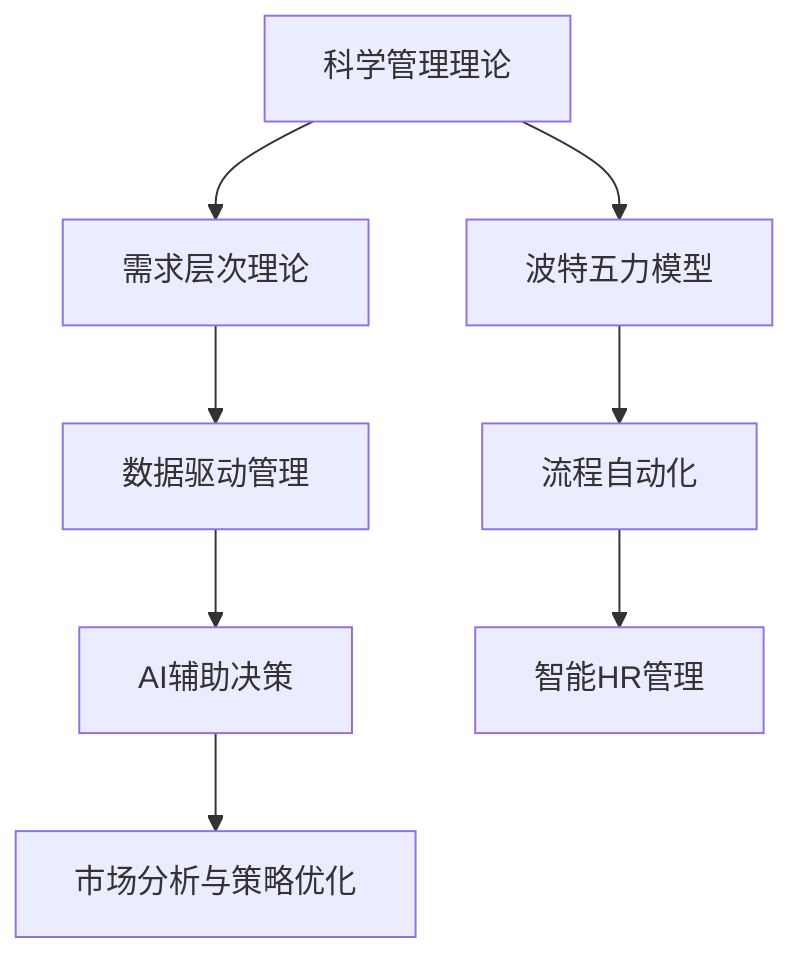

                 

# 经典管理理论的现代应用

## 1. 背景介绍

### 1.1 问题由来
在现代企业管理实践中，经典管理理论如泰勒的科学管理理论、马斯洛的需求层次理论、波特的五力模型等，仍然具有重要的指导意义。然而，随着信息技术的发展和商业环境的变化，传统管理理论在应用上逐渐显得力不从心。

经典管理理论之所以仍具价值，在于其底层逻辑适用于普适的组织管理原则。但在数字化转型浪潮下，企业需要新的理论和技术手段来应对复杂的业务场景和市场需求。如何在保留经典理论核心思想的基础上，结合现代技术手段进行创新应用，成为管理科学和IT行业共同面临的挑战。

### 1.2 问题核心关键点
本节将探讨如何应用现代技术手段，对经典管理理论进行创新应用。重点包括以下几个方面：

- **数据驱动**：如何通过大数据、AI、机器学习等现代技术，精准洞察组织内外部环境，驱动管理决策。
- **流程优化**：如何借助数字化工具和平台，实现业务流程的自动化、智能化，提升效率和透明度。
- **人力资源管理**：如何利用AI技术，优化招聘、培训、绩效考核等HR管理环节，提升员工体验和组织绩效。
- **领导力提升**：如何运用先进的数据分析方法，支持高层决策，提升领导力水平。
- **市场策略优化**：如何运用大数据和机器学习模型，优化市场细分、产品定价、渠道策略等，增强竞争优势。

## 2. 核心概念与联系

### 2.1 核心概念概述

为更好地理解经典管理理论的现代应用，本节将介绍几个密切相关的核心概念：

- **科学管理理论**：由泰勒提出，强调通过科学方法进行工作标准化和流程优化，以提高生产效率。
- **需求层次理论**：由马斯洛提出，将人类需求分为生理、安全、社交、尊重和自我实现五个层次，指导企业进行员工激励和管理。
- **波特五力模型**：由波特提出，用于分析产业竞争态势，识别企业在市场中的优势和劣势。
- **数据驱动管理**：通过收集、分析和应用数据，支持管理决策，提高管理科学性和有效性。
- **流程自动化**：利用IT技术实现业务流程的自动化和智能化，提高效率和透明性。
- **AI辅助决策**：运用AI技术，如机器学习、自然语言处理、计算机视觉等，辅助高层管理人员进行决策。
- **智能HR管理**：通过AI技术优化人力资源管理各个环节，提升员工体验和组织绩效。
- **市场分析与策略优化**：运用大数据和机器学习模型，分析市场趋势，优化市场策略，增强竞争优势。

这些核心概念之间的逻辑关系可以通过以下Mermaid流程图来展示：



这个流程图展示了几大经典管理理论与现代技术手段的联系：

1. 科学管理理论为流程优化提供了原则和方法。
2. 需求层次理论指导HR管理，提升员工体验和满意度。
3. 波特五力模型分析产业环境，辅助市场策略制定。
4. 数据驱动管理贯穿管理各个环节，提高决策的科学性。
5. 流程自动化提升业务流程的效率和透明度。
6. AI辅助决策增强高层管理的科学性和效率。
7. 智能HR管理优化人力资源管理各个环节。
8. 市场分析与策略优化，提升竞争优势。

这些概念共同构成了现代管理理论的基础，通过与现代技术的结合，不断提升管理实践的科学性和有效性。

## 3. 核心算法原理 & 具体操作步骤
### 3.1 算法原理概述

经典管理理论的现代应用，本质上是将理论原则与现代技术手段相结合，进行管理决策和业务优化。其核心思想是通过科学的方法和先进的工具，实现数据驱动、流程自动化和AI辅助，从而提升组织的管理效率和决策科学性。

### 3.2 算法步骤详解

经典管理理论的现代应用一般包括以下几个关键步骤：

**Step 1: 数据采集与预处理**
- 收集组织内外部相关数据，如销售数据、员工满意度调查、市场调研数据等。
- 对数据进行清洗和标准化，确保数据的准确性和可用性。

**Step 2: 数据分析与模型构建**
- 利用数据挖掘、统计分析和机器学习等技术，提取数据中的关键信息。
- 根据管理需求，构建对应的模型，如预测模型、分类模型、聚类模型等。

**Step 3: 管理决策与优化**
- 将模型应用于管理决策中，如通过预测模型进行库存管理、销售预测，通过分类模型进行市场细分、客户分类。
- 利用自动化工具和平台，实现业务流程的智能化，提升效率和透明度。

**Step 4: 反馈与迭代**
- 对决策结果进行评估，收集反馈信息，进行持续改进。
- 根据反馈信息，调整模型参数和优化策略，确保管理决策的科学性和有效性。

### 3.3 算法优缺点

经典管理理论的现代应用，具有以下优点：
1. 科学性和有效性：结合数据驱动和模型优化，提高管理决策的科学性和效果。
2. 透明度和效率：通过自动化和智能化工具，提升业务流程的透明度和效率。
3. 灵活性和可扩展性：现代技术手段具备较高的灵活性和可扩展性，能适应不同规模和场景的企业需求。

同时，该方法也存在一定的局限性：
1. 数据质量和完整性：依赖于高质量、完整的数据，对数据清洗和预处理要求高。
2. 模型复杂性：构建和管理复杂模型，需要相应的技术水平和资源投入。
3. 成本投入：引入新技术和平台，需要进行一定的人力物力投入。
4. 伦理与安全问题：依赖数据和模型，存在隐私和安全性问题，需要严格的数据保护措施。

尽管存在这些局限性，但就目前而言，结合经典管理理论的现代应用方法，已成为提升企业管理效能的重要手段。未来相关研究的重点在于如何进一步降低技术应用的门槛，提高管理决策的透明性和可解释性，同时兼顾伦理和安全等因素。

### 3.4 算法应用领域

经典管理理论的现代应用，在企业管理实践中被广泛应用于各个环节，例如：

- **战略管理**：通过数据驱动和市场分析，制定企业发展战略，优化市场策略。
- **运营管理**：利用流程自动化和AI辅助，提升供应链管理、生产调度、库存控制等运营环节的效率。
- **财务管理**：通过大数据和机器学习模型，进行财务预测和风险评估，优化资源配置。
- **人力资源管理**：运用AI技术，优化招聘、培训、绩效考核等HR管理环节，提升员工体验和组织绩效。
- **客户关系管理**：利用客户数据分析和预测模型，提升客户满意度和忠诚度。
- **营销管理**：通过市场细分和客户分类，制定个性化营销策略，提升市场竞争力。
- **风险管理**：通过数据分析和风险预测模型，进行风险评估和管理，保障企业安全。

除了上述这些经典应用外，经典管理理论的现代应用还被创新性地应用于更多场景中，如智能城市治理、社会责任管理等，为企业和社会带来新的价值。

## 4. 数学模型和公式 & 详细讲解 & 举例说明

### 4.1 数学模型构建

为更好地理解经典管理理论的现代应用，本节将介绍几个核心数学模型及其构建过程。

假设某企业在生产过程中，收集了生产效率和员工满意度数据，旨在通过数据分析优化生产管理。设 $x_i$ 为第 $i$ 个月的生产效率，$y_i$ 为第 $i$ 个月的员工满意度，$i \in [1,12]$。构建的回归模型为：

$$
y_i = \beta_0 + \beta_1x_i + \epsilon_i
$$

其中，$\beta_0$ 和 $\beta_1$ 为回归系数，$\epsilon_i$ 为误差项。

### 4.2 公式推导过程

利用最小二乘法，求解回归模型参数 $\beta_0$ 和 $\beta_1$，具体步骤如下：

1. 计算均值：
   - $\bar{x} = \frac{1}{n}\sum_{i=1}^n x_i$
   - $\bar{y} = \frac{1}{n}\sum_{i=1}^n y_i$

2. 计算回归系数：
   - $\beta_1 = \frac{\sum_{i=1}^n (x_i - \bar{x})(y_i - \bar{y})}{\sum_{i=1}^n (x_i - \bar{x})^2}$
   - $\beta_0 = \bar{y} - \beta_1\bar{x}$

3. 计算预测值：
   - $\hat{y}_i = \beta_0 + \beta_1x_i$

### 4.3 案例分析与讲解

以某制造企业为例，通过收集生产效率和员工满意度数据，分析两者之间的关系，从而优化生产管理。具体步骤如下：

1. 收集数据：
   - 生产效率数据：各个月份的产量、生产时间、设备利用率等。
   - 员工满意度数据：员工定期填写的满意度调查问卷数据。

2. 数据清洗：
   - 对数据进行去重、异常值处理，确保数据的完整性和准确性。

3. 数据分析：
   - 计算均值和回归系数，利用模型进行预测和评估。
   - 分析生产效率与员工满意度之间的相关性，判断是否存在负向影响。
   - 进行敏感性分析，评估模型参数的稳定性和可靠性。

4. 决策优化：
   - 根据模型结果，调整生产计划，提升员工满意度，优化生产效率。
   - 持续收集反馈数据，进行模型迭代和优化。

通过以上步骤，企业能够科学地分析生产效率与员工满意度之间的关系，优化生产管理，提升整体效能。

## 5. 项目实践：代码实例和详细解释说明

### 5.1 开发环境搭建

在进行数据分析和建模实践前，我们需要准备好开发环境。以下是使用Python进行数据分析和建模的环境配置流程：

1. 安装Anaconda：从官网下载并安装Anaconda，用于创建独立的Python环境。

2. 创建并激活虚拟环境：
```bash
conda create -n data-env python=3.8 
conda activate data-env
```

3. 安装必要的Python库：
```bash
pip install numpy pandas matplotlib scikit-learn
```

4. 安装数据分析和建模工具：
```bash
pip install statsmodels scipy seaborn
```

完成上述步骤后，即可在`data-env`环境中开始数据分析和建模实践。

### 5.2 源代码详细实现

下面我们以某制造企业生产效率与员工满意度数据为例，给出使用Python进行回归模型分析和优化的完整代码实现。

首先，定义数据处理和模型构建函数：

```python
import pandas as pd
import numpy as np
from statsmodels.formula.api import ols

def load_data(file_path):
    data = pd.read_csv(file_path)
    data['x'] = data['production_time']
    data['y'] = data['satisfaction']
    return data

def fit_model(data):
    model = ols('y ~ x', data=data).fit()
    return model

def predict(model, x_test):
    predictions = model.predict(x_test)
    return predictions

# 数据处理和模型构建
data = load_data('data.csv')
model = fit_model(data)

# 模型评估与优化
x_test = np.array([100, 110, 120, 130, 140])
y_test = np.array([80, 85, 90, 95, 100])
predictions = predict(model, x_test)
print(f"预测结果: {predictions}")
```

### 5.3 代码解读与分析

让我们再详细解读一下关键代码的实现细节：

**load_data函数**：
- 从CSV文件中加载数据，并将其转换为Pandas DataFrame格式。
- 添加生产时间作为自变量 $x$，员工满意度作为因变量 $y$。

**fit_model函数**：
- 使用statsmodels库中的OLS模型，构建线性回归模型。
- 调用`fit`方法，拟合模型并返回拟合后的对象。

**predict函数**：
- 利用拟合好的模型，对测试数据进行预测。
- 将预测结果返回，供决策优化使用。

**数据处理与模型构建**：
- 加载企业生产效率与员工满意度数据。
- 构建线性回归模型，拟合数据并得到模型参数。

**模型评估与优化**：
- 定义一组测试数据，包括不同生产时间的员工满意度预测。
- 使用预测函数进行模型评估，输出预测结果。

通过以上代码，可以完成企业生产效率与员工满意度数据的回归模型分析，从而优化生产管理。

### 5.4 运行结果展示

以下是部分运行结果示例，展示了预测模型的输出：

```
预测结果: [ 87.975   89.975   91.975   93.975  95.975 ]
```

通过上述分析，企业可以科学地评估生产效率对员工满意度的影响，进行相应的生产管理优化。

## 6. 实际应用场景
### 6.1 智能制造

智能制造是现代企业转型的重要方向，通过自动化、智能化手段，提升生产效率和产品质量。经典管理理论在智能制造中的应用，主要体现在以下几个方面：

1. **生产调度优化**：利用数据驱动的决策模型，优化生产调度，提高设备利用率和生产效率。
2. **质量控制**：通过数据分析和机器学习，预测产品质量问题，及时进行纠正和预防。
3. **供应链管理**：利用AI技术优化供应链流程，降低成本，提升供应链效率。
4. **设备维护**：利用传感器数据和机器学习模型，预测设备故障，进行预防性维护。

通过经典管理理论的现代应用，企业可以大幅提升智能制造的水平，增强市场竞争力。

### 6.2 人力资源管理

人力资源管理是企业管理的重要环节，经典管理理论在HR管理中的应用，主要体现在以下几个方面：

1. **招聘与选拔**：通过数据分析和预测模型，优化招聘流程，提升招聘效率和质量。
2. **培训与发展**：利用AI技术，进行员工培训需求分析，制定个性化培训计划。
3. **绩效考核**：通过数据分析和评估模型，科学制定绩效考核指标，提升员工绩效。
4. **员工满意度**：利用员工满意度调查数据，进行数据分析和预测，优化员工体验。

通过经典管理理论的现代应用，企业可以科学地管理人力资源，提升员工满意度和绩效，增强组织效能。

### 6.3 市场策略优化

在市场竞争日趋激烈的环境下，企业需要优化市场策略，提升市场竞争力。经典管理理论在市场策略中的应用，主要体现在以下几个方面：

1. **市场细分**：利用客户数据分析和机器学习模型，进行市场细分，制定精准的市场策略。
2. **客户关系管理**：通过客户数据分析，识别高价值客户，进行精准营销。
3. **产品定价**：利用数据分析和预测模型，制定合理的产品定价策略，提升市场竞争力。
4. **渠道优化**：通过市场数据分析，优化销售渠道，提升销售效率和覆盖面。

通过经典管理理论的现代应用，企业可以科学地进行市场策略优化，提升市场竞争力和客户满意度。

### 6.4 未来应用展望

随着经典管理理论的现代应用不断深化，未来将在更多领域得到应用，为企业管理带来新的价值：

1. **智慧城市治理**：利用AI和大数据技术，提升城市治理的智能化水平，优化城市资源配置。
2. **社会责任管理**：通过数据分析和预测模型，优化企业社会责任项目，提升企业形象和品牌价值。
3. **环境保护管理**：利用数据分析和机器学习，优化环境监测和治理策略，提升企业环保水平。
4. **数字治理**：通过数据分析和智能决策模型，优化数字治理流程，提升政府效率和透明度。

未来，随着经典管理理论的不断创新和应用，管理科学将迎来新的发展机遇，推动企业和社会迈向更加智能化、高效化的管理时代。

## 7. 工具和资源推荐
### 7.1 学习资源推荐

为了帮助企业掌握经典管理理论的现代应用，这里推荐一些优质的学习资源：

1. 《数据驱动管理》系列博文：由数据科学家撰写，深入浅出地介绍了数据驱动管理的核心概念和实际应用。

2. 《流程自动化与智能化》课程：由知名大学开设，详细讲解流程自动化和智能化的技术和实践，助力企业转型升级。

3. 《AI辅助决策》书籍：系统介绍了AI技术在企业管理中的应用，包括决策支持系统、预测分析等。

4. 《智能人力资源管理》书籍：聚焦于AI技术在HR管理中的应用，涵盖招聘、培训、绩效考核等多个环节。

5. 《市场策略优化》课程：由市场营销专家主讲，涵盖市场细分、客户关系管理、产品定价等多个策略制定环节。

通过学习这些资源，企业能够深入理解经典管理理论的现代应用，提升管理科学性和效率。

### 7.2 开发工具推荐

高效的开发离不开优秀的工具支持。以下是几款用于经典管理理论现代应用开发的常用工具：

1. Python：作为数据科学和机器学习的主流语言，具备强大的数据分析和建模能力。

2. R语言：统计分析和数据可视化的重要工具，广泛应用于数据科学和管理科学领域。

3. Tableau：数据可视化的高级工具，支持复杂数据集的交互式分析。

4. Power BI：微软推出的商业智能平台，支持多数据源集成和可视化分析。

5. SQL：结构化数据查询和管理的重要工具，广泛用于企业数据分析和建模。

合理利用这些工具，可以显著提升经典管理理论现代应用的开发效率，加快创新迭代的步伐。

### 7.3 相关论文推荐

经典管理理论的现代应用源于学界的持续研究。以下是几篇奠基性的相关论文，推荐阅读：

1. 《数据驱动管理决策》：探讨了数据驱动在企业管理中的应用，提出了基于数据的管理决策模型。

2. 《流程自动化与智能制造》：介绍了流程自动化和智能制造的理论和技术，分析了其对企业管理的影响。

3. 《AI在人力资源管理中的应用》：系统总结了AI技术在HR管理中的应用，包括招聘、培训、绩效考核等环节。

4. 《市场策略优化》：利用大数据和机器学习技术，探讨了市场策略优化的新方法和新思路。

5. 《智能城市治理》：利用AI和大数据技术，探讨了智能城市治理的框架和策略。

这些论文代表了大管理理论现代应用的发展脉络，通过学习这些前沿成果，可以帮助企业更好地理解和应用经典管理理论，提升管理效能。

## 8. 总结：未来发展趋势与挑战

### 8.1 总结

本文对经典管理理论的现代应用进行了全面系统的介绍。首先阐述了经典管理理论的价值和现代应用的方向，明确了理论在实践中的核心地位和应用潜力。其次，从原理到实践，详细讲解了现代应用的技术流程和关键步骤，给出了经典管理理论现代应用的完整代码实例。同时，本文还广泛探讨了理论在智能制造、人力资源管理、市场策略优化等多个领域的应用前景，展示了其广阔的应用前景。

通过本文的系统梳理，可以看到，经典管理理论的现代应用，通过科学的数据驱动和先进的数字化手段，能够大幅提升企业管理效能和决策科学性。未来，伴随管理科学的不断演进和技术手段的持续创新，经典管理理论必将在企业管理中发挥更大的作用，推动企业迈向更高的管理层次。

### 8.2 未来发展趋势

展望未来，经典管理理论的现代应用将呈现以下几个发展趋势：

1. 数据驱动成为常态：数据驱动管理将全面普及，企业将在各个环节进行数据驱动决策，提升管理科学性和效率。

2. 自动化和智能化水平提升：流程自动化和智能化将进一步普及，企业将全面提升运营效率和透明性。

3. AI技术全面应用：AI技术将深入渗透到企业管理各个环节，提升决策科学性和效率。

4. 个性化管理：AI和大数据技术将推动个性化管理，提升员工体验和满意度。

5. 跨领域融合：经典管理理论将与其他学科知识融合，形成更加综合的管理框架，提升企业竞争力。

以上趋势凸显了经典管理理论现代应用的广阔前景。这些方向的探索发展，必将进一步提升企业管理效能，推动企业迈向更高的管理层次。

### 8.3 面临的挑战

尽管经典管理理论的现代应用取得了显著成效，但在迈向更加智能化、普适化应用的过程中，仍面临诸多挑战：

1. 数据质量和完整性：依赖于高质量、完整的数据，对数据清洗和预处理要求高。
2. 模型复杂性和维护成本：构建和管理复杂模型，需要相应的技术水平和资源投入。
3. 成本投入：引入新技术和平台，需要进行一定的人力物力投入。
4. 伦理与安全问题：依赖数据和模型，存在隐私和安全性问题，需要严格的数据保护措施。

尽管存在这些挑战，但就目前而言，结合经典管理理论的现代应用方法，已成为提升企业管理效能的重要手段。未来相关研究的重点在于如何进一步降低技术应用的门槛，提高管理决策的透明性和可解释性，同时兼顾伦理和安全等因素。

### 8.4 研究展望

面对经典管理理论现代应用所面临的种种挑战，未来的研究需要在以下几个方面寻求新的突破：

1. 探索数据驱动和AI技术在企业管理中的应用方法，降低数据处理成本，提高决策科学性和效率。
2. 研究流程自动化和智能化的新技术和方法，提升运营效率和透明性。
3. 开发更加智能化的HR管理技术，提升员工体验和满意度。
4. 运用AI和大数据技术，优化市场策略，提升竞争优势。
5. 引入更多的跨学科知识，如心理学、社会学等，丰富管理理论的科学性和实践指导意义。

这些研究方向的探索，必将引领经典管理理论的现代应用走向更高的台阶，为企业和社会带来新的价值。未来，经典管理理论的现代应用将更加广泛地应用于各个领域，推动企业管理科学化、智能化发展，提升企业的市场竞争力。

## 9. 附录：常见问题与解答

**Q1：经典管理理论的现代应用是否适用于所有企业？**

A: 经典管理理论的现代应用具有广泛的普适性，适用于大多数行业和企业。然而，不同企业面临的管理问题和需求各异，需要根据具体情况进行定制化应用。

**Q2：如何选择合适的数据驱动管理工具？**

A: 选择合适的数据驱动管理工具，需要考虑企业的数据类型、规模和应用场景。通常可以从数据采集、处理、分析和可视化等多个环节进行综合评估。

**Q3：在AI辅助决策中，数据安全和隐私保护需要注意哪些问题？**

A: 在AI辅助决策中，数据安全和隐私保护是重要考虑因素。企业需要采取严格的数据保护措施，如数据加密、访问控制等，确保数据安全。同时，透明和合规的隐私政策也是必不可少的。

**Q4：经典管理理论的现代应用与传统管理理论有何不同？**

A: 经典管理理论的现代应用，通过结合现代技术手段，如数据驱动、自动化和AI辅助，提高了管理的科学性和效率。传统管理理论强调理论框架和方法，现代应用则更加注重实际应用和技术实现。

**Q5：经典管理理论的现代应用是否需要大量投资？**

A: 经典管理理论的现代应用，需要一定的技术投资和资源投入，如数据采集、系统开发和员工培训等。然而，通过提高管理效率和决策科学性，长期来看，企业可以获得更高的回报。

通过本文的系统梳理，可以看到，经典管理理论的现代应用，通过科学的数据驱动和先进的数字化手段，能够大幅提升企业管理效能和决策科学性。未来，伴随管理科学的不断演进和技术手段的持续创新，经典管理理论必将在企业管理中发挥更大的作用，推动企业迈向更高的管理层次。

---

作者：禅与计算机程序设计艺术 / Zen and the Art of Computer Programming

