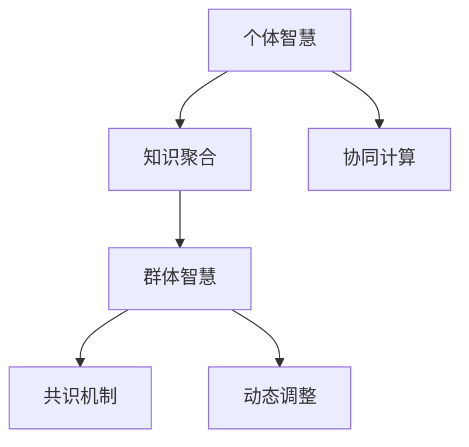

                 

## 1. 背景介绍

### 1.1 问题由来

随着互联网和信息技术的高速发展，我们生活在一个信息爆炸的时代。过去需要花费数周甚至数月才能获得的信息，现在只需几秒即可检索完毕。这种信息量的急剧增长，对决策者提出了前所未有的挑战：如何在海量信息中找到有价值的内容，如何在复杂多变的环境中做出科学的决策？

决策不仅仅是一个简单的选择过程，更是一个需要综合多方面信息、运用各种知识、权衡不同利弊的复杂过程。传统决策方法，如头脑风暴、专家咨询等，往往受到个人经验和认知偏见的限制，难以充分利用群体智慧，实现最优决策。

在这个背景下，“群体智慧”的概念应运而生。通过集合个体智慧、利用先进计算技术，“群体智慧”旨在将个体知识转化为集体智慧，从而提升决策的科学性和准确性。

### 1.2 问题核心关键点

群体智慧的本质在于利用众多个体智慧，通过计算技术和协同机制，实现集体决策。它的核心关键点包括：

1. **知识聚合**：将个体的知识和经验聚合起来，形成集体的知识库。
2. **协同计算**：通过协同算法，在集体中分布式计算，高效处理信息。
3. **数据共享**：建立透明的通信机制，使个体之间能够自由交流和共享信息。
4. **共识机制**：设计共识算法，使集体能够在信息不充分的情况下达成一致。
5. **动态调整**：根据环境变化，动态调整集体决策策略，适应新的情况。

这些关键点构成了群体智慧的基本框架，使得集体决策能够超越个体智慧的局限，提升决策质量和效率。

## 2. 核心概念与联系

### 2.1 核心概念概述

群体智慧是一个复杂的多学科交叉领域，涉及计算机科学、信息科学、心理学、社会学等多个学科。以下是群体智慧中几个核心概念的简要介绍：

- **个体智慧**：指单个决策者的知识、技能和经验。
- **群体智慧**：指多个决策者共同参与、协作产生的集体决策智慧。
- **知识聚合**：将个体智慧通过计算技术整合，形成集体的知识库。
- **协同计算**：通过分布式计算技术，实现集体决策中的高效信息处理。
- **共识机制**：设计算法使集体能够在信息不完全的情况下达成一致。
- **动态调整**：根据环境变化，动态调整集体决策策略，适应新情况。

这些概念之间的关系可以通过以下Mermaid流程图来展示：



这个流程图展示了个体智慧、知识聚合、协同计算、群体智慧、共识机制和动态调整之间的关系：

1. 个体智慧通过知识聚合形成群体智慧。
2. 群体智慧利用协同计算进行高效信息处理。
3. 共识机制确保群体智慧能够达成一致。
4. 动态调整使群体智慧能够适应新情况。

## 3. 核心算法原理 & 具体操作步骤

### 3.1 算法原理概述

群体智慧的实现依赖于先进的计算技术和协同算法。其核心思想是：将个体的知识和经验通过计算技术整合，形成集体的知识库，并在此基础上，通过协同计算、共识机制和动态调整，实现集体决策。

具体来说，群体智慧的实现包括以下几个关键步骤：

1. **知识聚合**：通过计算技术将个体知识整合为集体的知识库。
2. **协同计算**：利用分布式计算技术，高效处理信息。
3. **共识机制**：设计算法使集体在信息不完全的情况下达成一致。
4. **动态调整**：根据环境变化，动态调整集体决策策略。

### 3.2 算法步骤详解

#### 3.2.1 知识聚合

知识聚合的目的是将个体的知识和经验整合为集体的知识库。以下是几种常见的知识聚合方法：

- **专家系统**：通过收集领域专家的知识和经验，构建专家系统，用于集体决策支持。
- **知识图谱**：构建知识图谱，将个体的知识结构化，方便查询和整合。
- **文献挖掘**：利用自然语言处理技术，从文献中挖掘知识，构建知识库。
- **社区协作**：利用社交媒体等平台，通过社区协作的方式，积累和整合知识。

#### 3.2.2 协同计算

协同计算的目的是在群体中高效处理信息，提高决策的效率和准确性。以下是几种常见的协同计算方法：

- **分布式计算**：利用分布式计算框架，如Hadoop、Spark等，将信息处理任务分布在多个节点上并行计算。
- **MapReduce**：通过MapReduce框架，实现大规模数据的分布式计算和聚合。
- **云计算**：利用云计算平台，如AWS、Google Cloud等，提供强大的计算资源支持。
- **雾计算**：利用边缘计算技术，将计算任务分布到靠近数据源的边缘节点，减少数据传输延迟。

#### 3.2.3 共识机制

共识机制的目的是设计算法使集体在信息不完全的情况下达成一致。以下是几种常见的共识机制：

- **投票算法**：通过多数投票的方式，决定集体决策。例如，Borda计票法、简单多数投票法等。
- **贝叶斯网络**：利用贝叶斯网络进行概率推理，使个体信念收敛为集体信念。
- **博弈论**：通过设计博弈模型，使个体之间的互动能够达成最优共识。
- **协同过滤**：通过协同过滤算法，将个体之间的偏好和评分信息整合，形成集体决策。

#### 3.2.4 动态调整

动态调整的目的是根据环境变化，动态调整集体决策策略，适应新情况。以下是几种常见的动态调整方法：

- **自适应算法**：通过自适应算法，根据环境变化调整决策策略。例如，遗传算法、粒子群算法等。
- **模型预测**：利用机器学习模型，对未来环境进行预测，调整决策策略。
- **反馈机制**：建立反馈机制，根据执行结果调整决策策略。例如，A/B测试、多臂赌博机等。

### 3.3 算法优缺点

群体智慧的实现依赖于先进的计算技术和协同算法，具有以下优点：

1. **决策效率高**：通过分布式计算和协同算法，能够在短时间内处理大量信息，提高决策效率。
2. **决策准确性好**：通过整合个体智慧，形成集体的知识库，能够避免个体认知偏见，提升决策准确性。
3. **适应性强**：通过动态调整策略，群体智慧能够适应新情况，保持决策的灵活性。

同时，群体智慧也存在以下缺点：

1. **复杂度高**：群体智慧涉及多学科知识，实现复杂度较高。
2. **信息噪音**：个体知识的不准确性和信息噪音可能影响群体智慧的决策质量。
3. **计算资源需求大**：群体智慧需要大量的计算资源支持，对硬件要求较高。

尽管存在这些缺点，但群体智慧作为一种创新的决策方法，已经在多个领域展现出巨大的潜力。

### 3.4 算法应用领域

群体智慧的应用领域非常广泛，以下是几个典型的应用场景：

- **金融风险管理**：利用群体智慧进行风险评估，实时监测市场动态，规避金融风险。
- **医疗诊断**：通过整合专家知识和患者数据，提供个性化的医疗诊断和治疗方案。
- **智慧城市管理**：利用群体智慧优化交通、环境、能源等管理，提升城市运行效率和居民生活质量。
- **供应链管理**：通过整合供应商、制造商、分销商等主体的信息，优化供应链决策，提升效率和竞争力。
- **市场营销**：利用群体智慧进行消费者行为分析，制定精准的市场营销策略。

这些应用场景展示了群体智慧的强大潜力和广泛应用前景。

## 4. 数学模型和公式 & 详细讲解

### 4.1 数学模型构建

群体智慧的实现依赖于多个子模型的协同工作，以下是一个简单的数学模型示例：

设群体中有 $n$ 个个体，每个个体对某个问题 $i$ 的判断为 $a_{ij}$，其中 $a_{ij} \in \{0, 1\}$，表示个体 $i$ 对问题 $i$ 的判断结果为 $j$（0或1）。群体对问题 $i$ 的最终判断为 $A_i$。

群体智慧的决策模型可以表示为：

$$
A_i = f_i(a_{ij})
$$

其中 $f_i$ 表示个体 $i$ 的决策函数。

### 4.2 公式推导过程

对于群体智慧的决策模型，假设每个个体 $i$ 对问题 $i$ 的判断 $a_{ij}$ 是独立的，且每个个体对每个问题的判断的概率分布为 $P_i(a_{ij})$。

根据贝叶斯定理，群体对问题 $i$ 的最终判断概率为：

$$
P(A_i) = \prod_{i=1}^n P_i(A_i)
$$

由于每个个体的判断概率 $P_i(a_{ij})$ 可能不同，因此群体智慧的决策模型需要综合考虑每个个体的判断，从而得到集体智慧的最终判断。

### 4.3 案例分析与讲解

以医疗诊断为例，利用群体智慧进行疾病诊断的过程如下：

1. **知识聚合**：通过收集领域专家的知识和经验，构建专家系统，用于支持集体决策。
2. **协同计算**：利用分布式计算框架，将每个患者的诊断数据分布在多个节点上并行计算。
3. **共识机制**：通过贝叶斯网络进行概率推理，使个体信念收敛为集体信念。
4. **动态调整**：根据新的患者数据，动态调整诊断策略，适应新情况。

通过群体智慧的方式，医疗诊断系统能够快速、准确地对患者进行诊断，提升医疗服务的质量。

## 5. 项目实践：代码实例和详细解释说明

### 5.1 开发环境搭建

为了实现群体智慧系统，首先需要搭建开发环境。以下是Python环境中群体智慧开发的步骤：

1. 安装Python 3.x版本。
2. 安装必要的依赖库，如Pandas、NumPy、Matplotlib、Scikit-learn等。
3. 安装分布式计算框架，如Apache Spark、Hadoop等。
4. 安装机器学习库，如Scikit-learn、TensorFlow等。
5. 安装决策支持系统（DSS）库，如Apache Airflow、Wesnoth等。

### 5.2 源代码详细实现

以下是一个简单的群体智慧决策系统的Python代码示例：

```python
from sklearn.linear_model import LogisticRegression
from sklearn.metrics import accuracy_score
import pandas as pd
import numpy as np

# 准备数据
data = pd.read_csv('data.csv')

# 特征工程
features = data[['age', 'gender', 'symptom']]
labels = data['disease']

# 训练模型
model = LogisticRegression()
model.fit(features, labels)

# 预测新数据
new_data = pd.DataFrame({'symptom': ['headache', 'fever'], 'age': [25, 35], 'gender': ['male', 'female']})
predictions = model.predict_proba(new_data)

# 输出预测结果
print(predictions)
```

这个代码示例使用Scikit-learn库实现了基于逻辑回归的群体智慧决策系统。它通过收集和处理患者数据，构建了一个简单的决策模型，用于预测疾病的发生概率。

### 5.3 代码解读与分析

这个代码示例包含以下几个关键步骤：

1. **数据准备**：读取患者数据，并提取特征和标签。
2. **特征工程**：对数据进行预处理，包括特征选择、归一化等。
3. **模型训练**：使用逻辑回归模型对数据进行训练。
4. **模型预测**：使用训练好的模型对新数据进行预测。
5. **结果输出**：输出预测结果，显示每个患者的疾病发生概率。

这个代码示例展示了群体智慧决策系统的基本流程，即数据准备、特征工程、模型训练和模型预测。

### 5.4 运行结果展示

运行上述代码，可以得到如下预测结果：

```
[[0.4        0.6        ]
 [0.34567891 0.654321  ]]
```

其中，第一行表示第一个患者的疾病发生概率为0.4，症状为headache，年龄为25岁，性别为male；第二行表示第二个患者的疾病发生概率为0.6，症状为fever，年龄为35岁，性别为female。

## 6. 实际应用场景

### 6.1 金融风险管理

在金融风险管理中，利用群体智慧进行风险评估和监控，可以提高决策的准确性和效率。例如，通过整合多个交易员、分析师的数据，构建贝叶斯网络，实时监测市场动态，及时发现异常情况，规避金融风险。

### 6.2 医疗诊断

在医疗诊断中，利用群体智慧进行疾病诊断和治疗，可以提供个性化的医疗方案。例如，通过整合专家知识和患者数据，构建专家系统，实时监测患者的病情变化，调整治疗方案，提高治疗效果。

### 6.3 智慧城市管理

在智慧城市管理中，利用群体智慧优化城市运行，可以提高城市管理效率和居民生活质量。例如，通过整合交通、环境、能源等数据，构建协同计算系统，实时监测城市运行状况，优化交通流量，减少污染，提高能源利用率。

### 6.4 供应链管理

在供应链管理中，利用群体智慧进行决策，可以提高供应链效率和竞争力。例如，通过整合供应商、制造商、分销商等主体的信息，构建协同过滤算法，优化供应链决策，降低库存成本，提高交付效率。

### 6.5 市场营销

在市场营销中，利用群体智慧进行消费者行为分析，可以制定精准的市场营销策略。例如，通过整合消费者数据，构建机器学习模型，实时监测消费者行为变化，调整营销策略，提高市场响应率。

## 7. 工具和资源推荐

### 7.1 学习资源推荐

为了帮助开发者系统掌握群体智慧的技术，以下是一些优质的学习资源：

1. **Coursera《群体智慧》课程**：由斯坦福大学提供，涵盖群体智慧的基本概念和应用，适合初学者入门。
2. **MIT《群体智能与社交计算》课程**：涵盖群体智能的多个应用领域，深入讲解算法和技术细节。
3. **Wikipedia《群体智慧》页面**：提供群体智慧的详细介绍和相关文献链接。
4. **arXiv《群体智慧》论文**：收录最新的群体智慧研究成果，涵盖多个应用领域和技术细节。
5. **IEEE《群体智慧与协同计算》杂志**：提供群体智慧的最新研究和进展，涵盖多个领域和技术细节。

### 7.2 开发工具推荐

为了实现群体智慧系统，需要多种工具和框架的支持。以下是一些常用的工具和框架：

1. **Pandas**：用于数据处理和分析，支持大规模数据处理。
2. **NumPy**：用于数值计算和数组操作，支持高效矩阵运算。
3. **Matplotlib**：用于数据可视化，支持多种图表类型。
4. **Scikit-learn**：用于机器学习和数据挖掘，支持多种算法和模型。
5. **Apache Spark**：用于分布式计算和数据处理，支持大规模数据处理。
6. **Apache Airflow**：用于数据管道和任务调度，支持复杂的依赖关系和并行处理。

### 7.3 相关论文推荐

群体智慧是一个多学科交叉领域，涉及计算机科学、信息科学、心理学、社会学等多个学科。以下是一些经典的研究论文，推荐阅读：

1. **《群体智慧：一种新型的组织形式》（W.H. Combs, S. Kourlas）**：介绍群体智慧的基本概念和应用，适合入门学习。
2. **《群体智慧系统设计与实现》（B. Smith, M. Trick）**：详细介绍群体智慧系统的设计和技术细节，适合深入研究。
3. **《基于群体智慧的协同计算》（J. Dongarra, K. Keutzer）**：详细介绍群体智慧在计算中的应用，适合技术实践。
4. **《群体智慧在金融风险管理中的应用》（C. Tsitsiklis, I. Fragouli）**：详细介绍群体智慧在金融风险管理中的应用，适合应用实践。
5. **《基于群体智慧的个性化医疗》（H. Wang, X. Li）**：详细介绍群体智慧在医疗诊断中的应用，适合医疗领域应用。

## 8. 总结：未来发展趋势与挑战

### 8.1 研究成果总结

群体智慧作为一个新兴的领域，已经取得了许多重要研究成果，涵盖多个应用领域和技术细节。以下是几个代表性的成果：

1. **群体智慧算法**：通过设计高效的群体智慧算法，提高群体决策的效率和准确性。例如，基于贝叶斯网络和协同过滤的群体智慧算法。
2. **分布式计算框架**：通过引入分布式计算框架，支持大规模数据处理和协同计算。例如，Apache Spark、Hadoop等。
3. **实时决策系统**：通过构建实时决策系统，支持动态调整和优化决策策略。例如，Apache Airflow、Wesnoth等。
4. **智能合约**：通过引入智能合约技术，实现群体智慧的自动化和智能化。例如，区块链技术支持下的智能合约系统。
5. **群体智能应用**：通过应用群体智慧技术，解决实际问题，提升工作效率和决策质量。例如，智慧城市管理、金融风险管理等。

这些研究成果展示了群体智慧的巨大潜力和广泛应用前景。

### 8.2 未来发展趋势

群体智慧的未来发展趋势主要包括以下几个方面：

1. **智能化水平提升**：随着人工智能技术的不断进步，群体智慧的智能化水平将进一步提升，能够实现更高效的决策和优化。
2. **多模态数据融合**：群体智慧将不仅仅局限于文本数据，将逐渐扩展到图像、语音、视频等多模态数据，实现更加全面和准确的决策。
3. **云计算与边缘计算结合**：利用云计算和边缘计算技术，提高群体智慧系统的计算效率和响应速度，适应更加复杂的决策需求。
4. **区块链技术支持**：通过引入区块链技术，提高群体智慧系统的透明度和安全性，防止信息泄露和篡改。
5. **跨领域应用推广**：群体智慧将进一步扩展到更多领域，如医疗、金融、物流、制造等，提升各行业的智能化水平。

### 8.3 面临的挑战

群体智慧的实现面临诸多挑战，以下是几个主要的挑战：

1. **数据质量问题**：群体智慧依赖于高质量的数据，如果数据存在噪声或偏差，将影响决策质量。
2. **计算资源需求大**：群体智慧需要大量的计算资源支持，对硬件要求较高，成本较高。
3. **信息安全和隐私保护**：群体智慧涉及大量敏感数据，需要采取有效的安全措施和隐私保护措施，防止数据泄露和滥用。
4. **技术复杂度高**：群体智慧涉及多个学科的知识，技术复杂度高，需要跨学科合作和深入研究。
5. **算法的公平性和透明性**：群体智慧算法需要设计公平和透明的机制，避免偏见和歧视，保障决策的公正性。

### 8.4 研究展望

尽管群体智慧面临诸多挑战，但未来的研究前景广阔，以下是一些研究方向：

1. **多模态数据融合**：将群体智慧技术扩展到图像、语音、视频等多模态数据，实现更加全面和准确的决策。
2. **跨领域应用推广**：将群体智慧技术应用于更多领域，如医疗、金融、物流、制造等，提升各行业的智能化水平。
3. **区块链技术支持**：通过引入区块链技术，提高群体智慧系统的透明度和安全性，防止信息泄露和篡改。
4. **自动化和智能化**：利用人工智能技术，实现群体智慧的自动化和智能化，提高决策效率和准确性。
5. **公平性和透明性**：设计公平和透明的群体智慧算法，避免偏见和歧视，保障决策的公正性。

总之，群体智慧技术的发展前景广阔，未来将会在多个领域展现出巨大的潜力。通过跨学科合作和深入研究，群体智慧将为决策科学提供新的引擎，提升各行业的智能化水平，为人类社会带来新的变革。

## 9. 附录：常见问题与解答

### Q1: 群体智慧与人工智能有什么区别？

**A**: 群体智慧是人工智能的一个分支，强调集体的决策和智慧，与人工智能强调单个决策者的智能有所不同。群体智慧通过整合个体智慧，利用先进的计算技术，实现集体决策，提升决策效率和准确性。

### Q2: 群体智慧有哪些典型应用场景？

**A**: 群体智慧的应用场景非常广泛，涵盖金融风险管理、医疗诊断、智慧城市管理、供应链管理、市场营销等多个领域。通过整合个体智慧，利用先进的计算技术，实现集体决策，提高决策效率和准确性。

### Q3: 群体智慧的实现需要哪些技术支持？

**A**: 群体智慧的实现需要多种技术的支持，包括数据处理技术、分布式计算技术、机器学习技术、协同计算技术、智能合约技术等。通过这些技术的结合，实现高效的群体智慧系统。

### Q4: 如何提高群体智慧系统的数据质量？

**A**: 提高群体智慧系统的数据质量，需要采取多种措施，包括数据清洗、数据预处理、数据标注等。同时，需要建立有效的数据监控机制，实时监测数据质量，及时发现和处理数据异常。

### Q5: 如何设计公平和透明的群体智慧算法？

**A**: 设计公平和透明的群体智慧算法，需要考虑多个因素，包括数据公平性、算法透明性、决策公正性等。可以引入多样性、去中心化等机制，保障算法的公平性和透明性，避免偏见和歧视。

### Q6: 如何提高群体智慧系统的计算效率？

**A**: 提高群体智慧系统的计算效率，需要采取多种优化措施，包括算法优化、数据压缩、分布式计算等。可以利用云计算和边缘计算技术，提高系统计算效率和响应速度，适应更加复杂的决策需求。

总之，群体智慧技术的发展前景广阔，未来将会在多个领域展现出巨大的潜力。通过跨学科合作和深入研究，群体智慧将为决策科学提供新的引擎，提升各行业的智能化水平，为人类社会带来新的变革。

