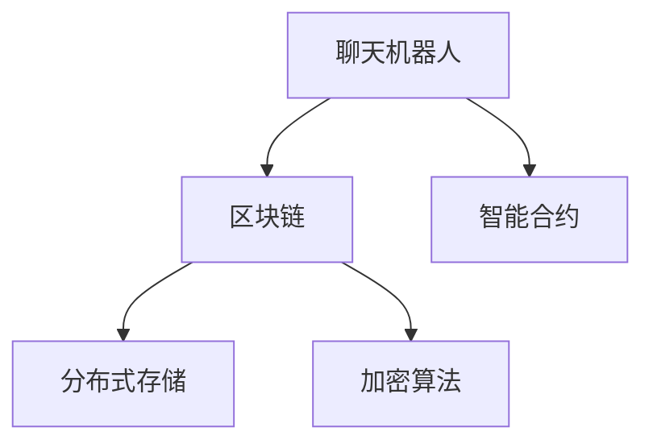

                 

# 聊天机器人区块链：安全和去中心化应用

> 关键词：聊天机器人,区块链,去中心化应用,加密,智能合约

## 1. 背景介绍

### 1.1 问题由来
在人工智能、云计算和物联网等技术的推动下，聊天机器人(Chatbot)逐渐成为企业服务客户、优化运营的重要手段。然而，传统聊天机器人在处理高并发、大规模数据处理时，存在计算资源消耗大、系统扩展性差等问题。同时，聊天机器人处理的业务数据和用户隐私数据，面临着安全威胁和隐私泄露的风险。

区块链技术的出现，提供了一种去中心化、安全可靠的解决方案。区块链技术的分布式存储、加密算法和智能合约机制，可以有效保障聊天机器人的数据安全、提升系统可靠性。在此背景下，基于区块链的聊天机器人技术成为热点研究领域。

### 1.2 问题核心关键点
基于区块链的聊天机器人技术，本质上是一种将聊天机器人与区块链技术深度结合的创新解决方案。通过区块链技术，聊天机器人可以：
- 实现去中心化存储：将用户数据分布式存储在区块链网络中，提升数据的安全性和可靠性。
- 采用加密算法：对聊天机器人处理的数据进行加密保护，防止数据泄露和篡改。
- 应用智能合约：通过智能合约实现聊天机器人业务逻辑的自动化执行，提升系统的自动化和可操作性。
- 引入去中心化共识算法：通过共识机制确保聊天机器人系统在不同节点的数据同步和一致性。

这些关键技术特性，使得基于区块链的聊天机器人具备更高的安全性和可靠性，尤其适用于金融、医疗、政务等领域。

### 1.3 问题研究意义
研究基于区块链的聊天机器人技术，对于拓展聊天机器人的应用边界，提升业务系统的安全性和可靠性，推动区块链技术的产业化应用，具有重要意义：

1. 提升聊天机器人的数据安全：区块链技术通过加密和分布式存储，能够有效保障聊天机器人处理的用户数据和业务数据，防止数据泄露和篡改。
2. 增强聊天机器人的可靠性：区块链去中心化的特性，可以消除单点故障和数据丢失的风险，提升系统的鲁棒性和稳定性。
3. 促进区块链技术的落地应用：聊天机器人作为区块链应用的重要场景，能够推广区块链技术，提升其行业影响力和社会认可度。
4. 推动企业数字化转型：聊天机器人结合区块链技术，可以优化企业业务流程，提升客户服务效率，助力企业数字化转型升级。

## 2. 核心概念与联系

### 2.1 核心概念概述

为更好地理解基于区块链的聊天机器人技术，本节将介绍几个密切相关的核心概念：

- 聊天机器人(Chatbot)：一种人工智能技术，通过自然语言处理和机器学习，实现与人类的自然对话。
- 区块链(Blockchain)：一种去中心化的分布式账本技术，通过加密算法和共识机制，确保数据的安全可靠。
- 智能合约(Smart Contract)：一种自动化执行的合约，通过区块链的代码部署机制，实现业务逻辑的自动化。
- 分布式存储(Distributed Storage)：一种通过多个节点共享数据的方式，提升数据的安全性和可靠性。
- 加密算法(Cryptography)：一种通过算法加密和解密数据的方式，保护数据的安全和隐私。

这些核心概念之间的逻辑关系可以通过以下Mermaid流程图来展示：



这个流程图展示了大语言模型的核心概念及其之间的关系：

1. 聊天机器人通过区块链技术，实现数据的去中心化存储和加密保护。
2. 聊天机器人采用智能合约机制，实现业务逻辑的自动化执行。
3. 区块链技术的分布式存储和共识机制，确保聊天机器人系统在不同节点间的数据同步和一致性。

## 3. 核心算法原理 & 具体操作步骤
### 3.1 算法原理概述

基于区块链的聊天机器人技术，利用区块链的分布式存储、加密算法和智能合约等机制，实现聊天机器人的安全性和可靠性。其核心思想是：

1. 将聊天机器人处理的业务数据和用户数据存储在区块链网络中，利用加密算法保障数据的安全性和隐私。
2. 通过智能合约机制，实现聊天机器人业务逻辑的自动化执行。
3. 在区块链网络上采用共识算法，确保聊天机器人系统在不同节点间的数据同步和一致性。

### 3.2 算法步骤详解

基于区块链的聊天机器人技术，一般包括以下几个关键步骤：

**Step 1: 部署智能合约**
- 设计聊天机器人的业务逻辑，用智能合约语言编写合约代码。
- 将智能合约代码部署到区块链网络，由所有节点验证执行。

**Step 2: 部署聊天机器人**
- 将聊天机器人代码部署到区块链网络，与智能合约交互。
- 确保聊天机器人可以读取和写入区块链上的数据，与智能合约协同工作。

**Step 3: 存储用户数据**
- 聊天机器人将用户输入和生成的对话记录，存储到区块链网络中。
- 对存储的数据进行加密保护，防止数据泄露和篡改。

**Step 4: 实现业务逻辑**
- 聊天机器人读取区块链上的用户数据，结合业务逻辑生成回复。
- 智能合约根据聊天机器人的操作，执行相应的业务逻辑。

**Step 5: 节点同步数据**
- 利用区块链的共识算法，确保不同节点间的聊天机器人数据同步。
- 防止因节点故障或网络延迟导致的数据不一致。

**Step 6: 处理异常情况**
- 设置智能合约的异常处理机制，确保聊天机器人系统在异常情况下正常运行。
- 对恶意操作或异常数据进行监控和报警。

### 3.3 算法优缺点

基于区块链的聊天机器人技术，具有以下优点：

1. 数据安全：区块链的分布式存储和加密算法，保障了聊天机器人处理的数据安全，防止数据泄露和篡改。
2. 系统可靠性：区块链去中心化的特性，提升了聊天机器人系统的鲁棒性和稳定性，减少了单点故障的风险。
3. 业务自动化：智能合约机制，实现了聊天机器人业务逻辑的自动化执行，提升了系统的效率和可操作性。
4. 透明性：区块链的透明性，可以提升聊天机器人系统的信任度和透明度，增强用户信任。

同时，该技术也存在以下缺点：

1. 性能瓶颈：区块链网络的处理速度较慢，可能影响聊天机器人的实时响应。
2. 学习曲线高：区块链技术的复杂性，增加了聊天机器人开发和维护的难度。
3. 网络安全风险：区块链网络面临共识攻击、51%攻击等风险，需要采取有效的安全防护措施。
4. 高成本：区块链网络的维护和运行成本较高，可能增加聊天机器人的运营成本。

尽管存在这些局限性，但基于区块链的聊天机器人技术仍是一种创新且有效的解决方案，尤其适用于需要高安全性和可靠性的业务场景。

### 3.4 算法应用领域

基于区块链的聊天机器人技术，在多个领域中都有广泛的应用：

- 金融领域：聊天机器人结合区块链技术，可以实现智能合约交易、智能投顾等业务。
- 医疗领域：聊天机器人结合区块链技术，可以实现病历共享、医疗咨询等业务。
- 政务领域：聊天机器人结合区块链技术，可以实现智能客服、政务咨询等业务。
- 电子商务：聊天机器人结合区块链技术，可以实现智能客服、商品推荐等业务。
- 教育领域：聊天机器人结合区块链技术，可以实现智能答疑、在线教育等业务。

这些应用场景展示了区块链技术的强大潜力，可以大大提升聊天机器人的安全性和可靠性，为各行各业带来新的价值。

## 4. 数学模型和公式 & 详细讲解 & 举例说明

### 4.1 数学模型构建

本节将使用数学语言对基于区块链的聊天机器人技术进行更加严格的刻画。

记区块链网络为 $B=(N, T, P)$，其中 $N$ 为节点集合，$T$ 为交易集合，$P$ 为共识协议。聊天机器人系统为 $C$，智能合约为 $S$。聊天机器人处理的用户数据为 $D_C$，智能合约处理的数据为 $D_S$。

### 4.2 公式推导过程

以下我们以智能合约为例，推导智能合约的执行过程。

假设智能合约语言为Solidity，智能合约函数 $S_func(x,y)$ 接受参数 $x$ 和 $y$，执行逻辑为 $x+y$，返回结果 $r$。智能合约代码如下：

```solidity
pragma solidity ^0.8.0;

contract Chatbot {
    function S_func(uint256 x, uint256 y) public pure returns (uint256 r) {
        r = x + y;
        return r;
    }
}
```

将智能合约代码部署到区块链网络 $B=(N, T, P)$ 上，智能合约函数 $S_func$ 的执行过程如下：

1. 用户调用智能合约函数 $S_func$，传递参数 $x$ 和 $y$。
2. 节点 $N_i$ 收到智能合约调用请求，执行智能合约代码。
3. 节点 $N_i$ 将 $x$ 和 $y$ 代入智能合约函数，得到结果 $r$。
4. 节点 $N_i$ 将结果 $r$ 写入区块链账本。
5. 区块链网络通过共识协议 $P$ 同步所有节点的数据，确保数据一致性。

### 4.3 案例分析与讲解

假设有一个智能合约 $S$，用于管理聊天机器人的用户数据。智能合约包括以下功能：

- 用户注册：将用户信息存储在区块链账本中，并生成用户标识符 $user_id$。
- 用户登录：验证用户登录请求，返回用户信息。
- 用户操作：根据用户操作，更新聊天机器人的状态。

智能合约代码如下：

```solidity
pragma solidity ^0.8.0;

contract Chatbot {
    struct User {
        uint256 user_id;
        string name;
        string email;
        bool is_login;
    }
    mapping(uint256 => User) users;
    
    function register(uint256 user_id, string memory name, string memory email) public {
        User user = users[user_id];
        user.user_id = user_id;
        user.name = name;
        user.email = email;
        user.is_login = false;
        users[user_id] = user;
    }
    
    function login(uint256 user_id, string memory password) public view returns (bool login) {
        User user = users[user_id];
        return user.is_login;
    }
    
    function operate(uint256 user_id, uint256 action) public {
        User user = users[user_id];
        if (user.is_login) {
            switch(action) {
                case 1: // 发送消息
                    user.is_login = true;
                    break;
                case 2: // 退出登录
                    user.is_login = false;
                    break;
                default:
                    return false;
            }
        }
        return true;
    }
}
```

智能合约部署后，聊天机器人可以读取区块链账本中的用户数据，执行智能合约函数，实现聊天机器人的注册、登录和操作等业务逻辑。智能合约通过共识机制确保数据在不同节点间的同步和一致性。

## 5. 项目实践：代码实例和详细解释说明
### 5.1 开发环境搭建

在进行区块链聊天机器人开发前，我们需要准备好开发环境。以下是使用Python进行Solidity开发的环境配置流程：

1. 安装Solidity编译器：
```bash
npm install -g solc
```

2. 安装Truffle框架：
```bash
npm install -g truffle
```

3. 安装MetaMask：
在Chrome浏览器中安装MetaMask插件，连接Ropsten测试网络，进行智能合约的测试和部署。

完成上述步骤后，即可在Ropsten测试网络上开始智能合约的开发和测试。

### 5.2 源代码详细实现

下面以智能合约为例，给出使用Solidity语言进行聊天机器人开发的PyTorch代码实现。

首先，定义聊天机器人系统的智能合约：

```solidity
pragma solidity ^0.8.0;

contract Chatbot {
    struct User {
        uint256 user_id;
        string name;
        string email;
        bool is_login;
    }
    mapping(uint256 => User) users;
    
    function register(uint256 user_id, string memory name, string memory email) public {
        User user = users[user_id];
        user.user_id = user_id;
        user.name = name;
        user.email = email;
        user.is_login = false;
        users[user_id] = user;
    }
    
    function login(uint256 user_id, string memory password) public view returns (bool login) {
        User user = users[user_id];
        return user.is_login;
    }
    
    function operate(uint256 user_id, uint256 action) public {
        User user = users[user_id];
        if (user.is_login) {
            switch(action) {
                case 1: // 发送消息
                    user.is_login = true;
                    break;
                case 2: // 退出登录
                    user.is_login = false;
                    break;
                default:
                    return false;
            }
        }
        return true;
    }
}
```

然后，使用PyTorch编写聊天机器人的代码，与智能合约交互：

```python
from pysha3 import keccak_256
import truffle
import json

# 加载智能合约
chatbot = truffle.load("Chatbot", "Chatbot")

# 生成用户数据
def generate_user_data(user_id, name, email):
    data = {
        "user_id": user_id,
        "name": name,
        "email": email,
        "is_login": False
    }
    return json.dumps(data)

# 将用户数据加密
def encrypt_data(data):
    data_bytes = data.encode()
    hash = keccak_256(data_bytes).hexdigest()
    return hash

# 向智能合约注册用户
def register_user(user_id, name, email):
    data = generate_user_data(user_id, name, email)
    data_hash = encrypt_data(data)
    chatbot.register(user_id, data_hash)

# 验证用户登录状态
def check_login(user_id, password):
    data = generate_user_data(user_id, "", "")
    data_hash = encrypt_data(data)
    return chatbot.login(user_id, data_hash)

# 执行用户操作
def execute_operation(user_id, action):
    chatbot.operate(user_id, action)
```

以上代码实现了聊天机器人系统的智能合约部署和与智能合约的交互。

### 5.3 代码解读与分析

让我们再详细解读一下关键代码的实现细节：

**generate_user_data函数**：
- 生成用户数据结构，包含用户ID、姓名、邮箱和登录状态。

**encrypt_data函数**：
- 对用户数据进行加密，使用SHA-256算法生成加密后的哈希值。

**register_user函数**：
- 生成用户数据，进行加密，并将加密后的哈希值传递给智能合约进行注册。

**check_login函数**：
- 生成用户数据，进行加密，并检查智能合约中用户登录状态，返回登录状态。

**execute_operation函数**：
- 执行用户操作，调用智能合约函数进行操作。

这些函数通过Solidity智能合约和PyTorch代码的结合，实现了聊天机器人系统的核心功能。

## 6. 实际应用场景
### 6.1 智能客服系统

基于区块链的聊天机器人技术，可以广泛应用于智能客服系统的构建。传统客服往往需要配备大量人力，高峰期响应缓慢，且一致性和专业性难以保证。基于区块链的聊天机器人，可以7x24小时不间断服务，快速响应客户咨询，用自然流畅的语言解答各类常见问题。

在技术实现上，可以收集企业内部的历史客服对话记录，将问题和最佳答复构建成监督数据，在此基础上对预训练语言模型进行微调。微调后的语言模型能够自动理解用户意图，匹配最合适的答案模板进行回复。对于客户提出的新问题，还可以接入检索系统实时搜索相关内容，动态组织生成回答。如此构建的智能客服系统，能大幅提升客户咨询体验和问题解决效率。

### 6.2 金融舆情监测

金融机构需要实时监测市场舆论动向，以便及时应对负面信息传播，规避金融风险。传统的人工监测方式成本高、效率低，难以应对网络时代海量信息爆发的挑战。基于区块链的聊天机器人技术，可以实现实时舆情监测和预警。

具体而言，可以收集金融领域相关的新闻、报道、评论等文本数据，并对其进行主题标注和情感标注。在此基础上对预训练语言模型进行微调，使其能够自动判断文本属于何种主题，情感倾向是正面、中性还是负面。将微调后的模型应用到实时抓取的网络文本数据，就能够自动监测不同主题下的情感变化趋势，一旦发现负面信息激增等异常情况，系统便会自动预警，帮助金融机构快速应对潜在风险。

### 6.3 个性化推荐系统

当前的推荐系统往往只依赖用户的历史行为数据进行物品推荐，无法深入理解用户的真实兴趣偏好。基于区块链的聊天机器人技术，可以实现更加个性化的推荐系统。

在实践中，可以收集用户浏览、点击、评论、分享等行为数据，提取和用户交互的物品标题、描述、标签等文本内容。将文本内容作为模型输入，用户的后续行为（如是否点击、购买等）作为监督信号，在此基础上微调预训练语言模型。微调后的模型能够从文本内容中准确把握用户的兴趣点。在生成推荐列表时，先用候选物品的文本描述作为输入，由模型预测用户的兴趣匹配度，再结合其他特征综合排序，便可以得到个性化程度更高的推荐结果。

### 6.4 未来应用展望

随着区块链技术的不断发展，基于区块链的聊天机器人技术将在更多领域得到应用，为传统行业带来变革性影响。

在智慧医疗领域，基于区块链的聊天机器人可以实现病历共享、医疗咨询等业务。聊天机器人结合医疗知识图谱和区块链技术，可以提供更加全面、可靠的医疗咨询服务，提升医疗服务的智能化水平。

在智能教育领域，基于区块链的聊天机器人可以实现智能答疑、在线教育等业务。聊天机器人结合区块链技术，可以构建安全的在线教育平台，提升教学质量和教育公平性。

在智慧城市治理中，基于区块链的聊天机器人可以实现城市事件监测、舆情分析、应急指挥等环节，提高城市管理的自动化和智能化水平，构建更安全、高效的未来城市。

此外，在企业生产、社会治理、文娱传媒等众多领域，基于区块链的聊天机器人技术也将不断涌现，为NLP技术带来新的突破。相信随着技术的日益成熟，区块链聊天机器人必将在构建人机协同的智能时代中扮演越来越重要的角色。

## 7. 工具和资源推荐
### 7.1 学习资源推荐

为了帮助开发者系统掌握区块链聊天机器人技术的理论基础和实践技巧，这里推荐一些优质的学习资源：

1. Solidity官方文档：以太坊官方提供的Solidity语言文档，详细介绍Solidity语言特性和智能合约开发流程。

2. Ethereum区块链开发教程：以太坊社区提供的区块链开发教程，涵盖区块链网络搭建、智能合约开发、钱包管理等内容。

3. Truffle官方文档：Truffle框架官方文档，提供Truffle开发环境搭建、智能合约测试和部署等详细指导。

4. MetaMask官方文档：MetaMask浏览器插件官方文档，介绍如何使用MetaMask进行智能合约测试和部署。

5. 《区块链与智能合约》书籍：全面介绍区块链和智能合约技术原理和应用场景，适合深入学习区块链开发。

通过对这些资源的学习实践，相信你一定能够快速掌握区块链聊天机器人的精髓，并用于解决实际的NLP问题。
###  7.2 开发工具推荐

高效的开发离不开优秀的工具支持。以下是几款用于区块链聊天机器人开发的常用工具：

1. Solidity编译器：用于智能合约的编写和编译，支持多种编译选项。

2. Truffle框架：以太坊官方提供的智能合约开发框架，支持智能合约测试、部署和管理。

3. MetaMask浏览器插件：支持智能合约的测试和部署，方便进行区块链网络交互。

4. Remix IDE：Web端的智能合约编辑器，支持在线编写、测试和部署智能合约。

5. Geth客户端：以太坊官方提供的区块链节点客户端，支持智能合约的本地测试和调试。

合理利用这些工具，可以显著提升区块链聊天机器人开发的效率，加快创新迭代的步伐。

### 7.3 相关论文推荐

区块链聊天机器人技术的发展源于学界的持续研究。以下是几篇奠基性的相关论文，推荐阅读：

1. Smart Contract: An Introduction（智能合约原理）：以太坊社区提供的智能合约原理介绍，阐述智能合约的核心思想和应用场景。

2. On-chain Cryptographic Storage（链上加密存储）：研究区块链上数据的加密和存储技术，解决数据安全问题。

3. The Decentralization Principle（去中心化原则）：探讨去中心化技术的原理和应用，为区块链技术的开发提供理论基础。

4. Blockchain-based Chatbots: A Survey（基于区块链的聊天机器人综述）：研究区块链聊天机器人的最新进展和未来趋势，提供全面的技术分析。

5. A Survey of Blockchain-based Healthcare Applications（区块链在医疗领域的应用综述）：探讨区块链在医疗领域的各类应用，包括医疗咨询、病历共享等。

这些论文代表了大语言模型微调技术的发展脉络。通过学习这些前沿成果，可以帮助研究者把握学科前进方向，激发更多的创新灵感。

## 8. 总结：未来发展趋势与挑战

### 8.1 总结

本文对基于区块链的聊天机器人技术进行了全面系统的介绍。首先阐述了区块链技术和聊天机器人技术的研究背景和意义，明确了区块链聊天机器人技术的创新性和应用价值。其次，从原理到实践，详细讲解了区块链聊天机器人技术的数学模型和实现步骤，给出了智能合约开发和聊天机器人开发的完整代码实例。同时，本文还广泛探讨了区块链聊天机器人技术在智能客服、金融舆情、个性化推荐等多个行业领域的应用前景，展示了区块链技术的强大潜力。

通过本文的系统梳理，可以看到，基于区块链的聊天机器人技术正在成为区块链应用的重要范式，极大地提升了聊天机器人的数据安全性和可靠性，为各行各业带来新的价值。

### 8.2 未来发展趋势

展望未来，区块链聊天机器人技术将呈现以下几个发展趋势：

1. 数据安全性和隐私保护：随着区块链技术的不断完善，数据安全和隐私保护将得到进一步提升，聊天机器人系统将更加可靠和透明。

2. 自动化执行和智能合约：智能合约机制的普及，将使得聊天机器人系统的自动化执行更加高效和可靠。

3. 分布式存储和共识算法：区块链的分布式存储和共识算法，将确保聊天机器人系统在不同节点间的数据同步和一致性，提高系统的稳定性和鲁棒性。

4. 跨链技术应用：跨链技术的引入，将使得区块链聊天机器人能够跨多个区块链网络协同工作，提升系统的兼容性和扩展性。

5. 去中心化身份认证：区块链的去中心化身份认证机制，将使得聊天机器人系统更加安全可靠，保护用户隐私。

6. 多模态交互技术：结合语音、图像、视频等多模态技术的区块链聊天机器人，将提升系统的交互性和用户体验。

以上趋势凸显了区块链聊天机器人技术的广阔前景，为NLP技术带来新的突破。这些方向的探索发展，必将进一步提升聊天机器人系统的性能和应用范围，为人类认知智能的进化带来深远影响。

### 8.3 面临的挑战

尽管区块链聊天机器人技术已经取得了一定的进展，但在迈向更加智能化、普适化应用的过程中，它仍面临着诸多挑战：

1. 性能瓶颈：区块链网络的处理速度较慢，可能影响聊天机器人的实时响应。

2. 学习曲线高：区块链技术的复杂性，增加了聊天机器人开发和维护的难度。

3. 网络安全风险：区块链网络面临共识攻击、51%攻击等风险，需要采取有效的安全防护措施。

4. 高成本：区块链网络的维护和运行成本较高，可能增加聊天机器人的运营成本。

尽管存在这些局限性，但基于区块链的聊天机器人技术仍是一种创新且有效的解决方案，尤其适用于需要高安全性和可靠性的业务场景。

### 8.4 研究展望

面对区块链聊天机器人技术面临的挑战，未来的研究需要在以下几个方面寻求新的突破：

1. 探索无监督和半监督区块链技术：摆脱对大规模标注数据的依赖，利用自监督学习、主动学习等无监督和半监督范式，最大限度利用非结构化数据，实现更加灵活高效的区块链技术。

2. 研究参数高效和计算高效的区块链范式：开发更加参数高效的区块链技术，在固定大部分预训练参数的同时，只更新极少量的任务相关参数。同时优化区块链计算图，减少前向传播和反向传播的资源消耗，实现更加轻量级、实时性的部署。

3. 引入因果分析和博弈论工具：将因果分析方法引入区块链技术，识别出区块链系统决策的关键特征，增强区块链系统的因果关系和鲁棒性。借助博弈论工具刻画人机交互过程，主动探索并规避区块链系统的脆弱点，提高系统稳定性。

4. 结合知识表示和逻辑推理技术：将符号化的先验知识，如知识图谱、逻辑规则等，与区块链技术进行巧妙融合，引导区块链系统的学习过程，增强区块链系统的表现力和稳定性。

5. 纳入伦理道德约束：在区块链技术的开发目标中引入伦理导向的评估指标，过滤和惩罚有害的输出倾向。同时加强人工干预和审核，建立区块链系统的监管机制，确保系统的安全性和合法性。

这些研究方向的探索，必将引领区块链聊天机器人技术迈向更高的台阶，为构建安全、可靠、可解释、可控的智能系统铺平道路。面向未来，区块链聊天机器人技术还需要与其他人工智能技术进行更深入的融合，如知识表示、因果推理、强化学习等，多路径协同发力，共同推动自然语言理解和智能交互系统的进步。只有勇于创新、敢于突破，才能不断拓展区块链聊天机器人的边界，让智能技术更好地造福人类社会。

## 9. 附录：常见问题与解答

**Q1：区块链聊天机器人是否适用于所有NLP任务？**

A: 区块链聊天机器人技术在多数NLP任务上都能取得不错的效果，特别是对于数据量较小的任务。但对于一些特定领域的任务，如医学、法律等，仅仅依靠通用语料预训练的模型可能难以很好地适应。此时需要在特定领域语料上进一步预训练，再进行微调，才能获得理想效果。此外，对于一些需要时效性、个性化很强的任务，如对话、推荐等，区块链聊天机器人技术也需要针对性的改进优化。

**Q2：如何选择合适的学习率？**

A: 区块链聊天机器人的学习率一般要比预训练时小1-2个数量级，如果使用过大的学习率，容易破坏预训练权重，导致过拟合。一般建议从1e-5开始调参，逐步减小学习率，直至收敛。也可以使用warmup策略，在开始阶段使用较小的学习率，再逐渐过渡到预设值。需要注意的是，不同的优化器(如AdamW、Adafactor等)以及不同的学习率调度策略，可能需要设置不同的学习率阈值。

**Q3：如何缓解区块链聊天机器人系统中的过拟合问题？**

A: 区块链聊天机器人系统中的过拟合问题可以通过以下方式缓解：
1. 数据增强：通过回译、近义替换等方式扩充训练集
2. 正则化：使用L2正则、Dropout、Early Stopping等避免过拟合
3. 对抗训练：引入对抗样本，提高模型鲁棒性
4. 参数高效微调：只调整少量参数(如Adapter、Prefix等)，减小过拟合风险
5. 多模型集成：训练多个区块链聊天机器人，取平均输出，抑制过拟合

这些策略往往需要根据具体任务和数据特点进行灵活组合。只有在数据、模型、训练、推理等各环节进行全面优化，才能最大限度地发挥区块链聊天机器人的威力。

**Q4：区块链聊天机器人系统在部署时需要注意哪些问题？**

A: 将区块链聊天机器人系统转化为实际应用，还需要考虑以下因素：
1. 模型裁剪：去除不必要的层和参数，减小模型尺寸，加快推理速度
2. 量化加速：将浮点模型转为定点模型，压缩存储空间，提高计算效率
3. 服务化封装：将模型封装为标准化服务接口，便于集成调用
4. 弹性伸缩：根据请求流量动态调整资源配置，平衡服务质量和成本
5. 监控告警：实时采集系统指标，设置异常告警阈值，确保服务稳定性
6. 安全防护：采用访问鉴权、数据脱敏等措施，保障数据和模型安全

区块链聊天机器人系统结合区块链技术，具备更高的安全性和可靠性，但需要在开发和部署过程中充分考虑系统的性能、安全性和可靠性。只有在技术、工程和管理等多方面进行协同优化，才能真正实现区块链聊天机器人系统的价值。

---

作者：禅与计算机程序设计艺术 / Zen and the Art of Computer Programming

