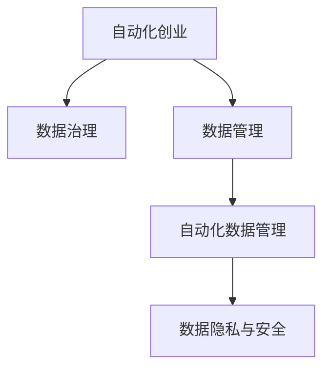

                 

# 自动化创业中的数据治理与管理

## 1. 背景介绍

随着技术进步和市场需求的快速变化，自动化创业成为了许多企业新的增长点。然而，自动化系统的成功实施离不开高效的数据治理与管理。数据是自动化系统的核心资源，对其进行科学管理和有效利用，才能充分发挥其价值，推动业务创新和效率提升。本文将深入探讨自动化创业中的数据治理与管理，旨在为相关从业人员提供实用的技术指导和思路参考。

## 2. 核心概念与联系

### 2.1 核心概念概述

为更好地理解自动化创业中的数据治理与管理，本节将介绍几个密切相关的核心概念：

- **自动化创业**：利用人工智能、机器学习等自动化技术，在创业项目中实现业务流程的自动化，以提升效率、降低成本，增强竞争力。
- **数据治理**：系统化地管理和优化数据资源，确保数据的准确性、完整性、一致性和安全性，以支持业务的正常运行和持续改进。
- **数据管理**：对数据的收集、存储、处理、分析等各个环节进行规划和管理，包括数据标准、数据质量、数据安全等方面。
- **自动化数据管理**：结合自动化技术，实现数据的自动收集、清洗、标注、存储和分析，提升数据处理的效率和准确性。
- **数据隐私与安全**：保护数据的个人隐私和敏感信息，确保数据在处理、存储、传输过程中的安全性。

这些概念之间的逻辑关系可以通过以下Mermaid流程图来展示：



这个流程图展示了我自动化创业中的数据治理与管理的核心概念及其之间的关系：

1. 自动化创业需要依赖高效的数据治理与管理。
2. 数据治理是数据管理的高级形式，强调系统化、标准化的数据管理方法。
3. 自动化数据管理结合了自动化的理念，提升数据处理的效率和准确性。
4. 数据隐私与安全是数据治理中的重要组成部分，确保数据的合法合规使用。

## 3. 核心算法原理 & 具体操作步骤
### 3.1 算法原理概述

在自动化创业中，数据治理与管理的核心算法主要包括以下几个方面：

- **数据收集与清洗**：从不同数据源收集数据，并进行去重、纠错、缺失值处理等预处理工作，确保数据的完整性和准确性。
- **数据标准化**：制定统一的数据标准，规范数据格式、命名规则等，提高数据的一致性和可比性。
- **数据存储与管理**：选择合适的数据存储方式，如关系型数据库、NoSQL数据库、分布式存储等，管理数据的存储和访问。
- **数据质量监控**：实时监控数据的质量指标，如数据一致性、准确性、完整性等，及时发现和修正数据问题。
- **自动化数据标注**：利用机器学习算法对数据进行标注，提升数据标注的效率和准确性。
- **数据隐私保护**：采用加密、匿名化、差分隐私等技术，保护数据的隐私和安全。

### 3.2 算法步骤详解

自动化创业中的数据治理与管理一般包括以下几个关键步骤：

**Step 1: 需求分析与规划**

- 确定自动化系统的业务目标和数据需求，明确需要哪些数据，以及数据的来源、格式和存储方式。
- 分析数据的质量问题，制定初步的数据治理方案。
- 选择合适的数据存储方式和管理系统，确保数据的有效管理和高效利用。

**Step 2: 数据收集与清洗**

- 从各个数据源收集数据，确保数据的完整性和覆盖率。
- 对收集到的数据进行清洗，去除重复、错误、无关的数据。
- 对缺失值进行处理，如填补、删除或插值。

**Step 3: 数据标准化**

- 制定统一的数据标准和规范，包括数据格式、命名规则、编码方式等。
- 对数据进行标准化处理，确保不同来源的数据能够无缝集成。
- 使用ETL工具进行数据转换，确保数据的一致性和可比性。

**Step 4: 数据存储与管理**

- 选择合适的数据存储方式，如关系型数据库、NoSQL数据库、分布式存储等。
- 设计数据访问和管理方式，确保数据的快速查询和高效使用。
- 采用数据分片和分区技术，提高数据访问的效率和扩展性。

**Step 5: 数据质量监控**

- 实时监控数据的质量指标，如数据一致性、准确性、完整性等。
- 使用数据质量监控工具，及时发现和修正数据问题。
- 定期进行数据审计和检查，确保数据质量。

**Step 6: 自动化数据标注**

- 选择合适的机器学习算法，对数据进行标注。
- 利用自动化标注工具，提高标注的效率和准确性。
- 结合人工审核，确保标注结果的可靠性。

**Step 7: 数据隐私保护**

- 采用加密、匿名化、差分隐私等技术，保护数据的隐私和安全。
- 制定数据隐私保护策略，确保数据的合法合规使用。
- 对数据访问进行权限控制，防止未经授权的数据泄露。

### 3.3 算法优缺点

自动化创业中的数据治理与管理方法具有以下优点：

- **提高数据质量**：通过规范化和清洗，提高数据的一致性和准确性。
- **提升效率**：自动化处理减少了人工干预，提高数据处理效率。
- **降低成本**：减少数据处理和维护的人力和时间成本。
- **保障数据安全**：采用隐私保护技术，确保数据的安全性和合规性。

同时，该方法也存在一定的局限性：

- **依赖数据源质量**：如果数据源本身存在问题，治理效果将大打折扣。
- **技术复杂度较高**：需要一定的技术积累和工具支持，实施成本较高。
- **数据隐私风险**：隐私保护技术需要妥善实施，否则可能引发隐私泄露等问题。

尽管存在这些局限性，但总体而言，自动化创业中的数据治理与管理方法在提升数据质量、提高处理效率和保障数据安全方面具有显著优势，是企业实现自动化业务创新和数据驱动决策的重要保障。

### 3.4 算法应用领域

自动化创业中的数据治理与管理技术，在多个领域都有广泛的应用，例如：

- **金融科技**：利用自动化数据管理技术，提升金融数据分析和风险控制效率。
- **智能制造**：结合自动化数据治理，优化生产流程，提高生产效率和产品质量。
- **电子商务**：通过自动化数据标注和隐私保护，提升用户数据分析和个性化推荐能力。
- **医疗健康**：利用自动化数据管理，提高医疗数据的质量和隐私保护水平。
- **智能交通**：通过数据治理和隐私保护，优化交通数据管理，提升智能交通系统性能。

除了上述这些经典领域外，数据治理与管理技术在更多新兴领域也有广泛应用，如智慧城市、智慧农业、智慧能源等，为各类自动化创业项目提供了坚实的技术支撑。

## 4. 数学模型和公式 & 详细讲解 & 举例说明

### 4.1 数学模型构建

在自动化创业中，数据治理与管理的数学模型主要包括以下几个方面：

- **数据质量模型**：用于评估数据的准确性、完整性、一致性和及时性。
- **数据隐私模型**：用于保护数据隐私，确保数据在处理、存储、传输过程中的安全。
- **数据标注模型**：用于自动标注数据，提升数据处理的效率和准确性。

### 4.2 公式推导过程

以下我们以数据质量模型为例，推导其数学公式及其计算过程。

假设有一组数据 $\{x_i\}_{i=1}^N$，其中 $x_i$ 为第 $i$ 个样本，$y_i$ 为该样本的真实标签。定义数据质量指标 $\text{score}(x_i)$，表示样本 $x_i$ 的质量评分，其计算公式为：

$$
\text{score}(x_i) = \frac{1}{n} \sum_{k=1}^n \text{loss}(x_i, y_k)
$$

其中 $\text{loss}(x_i, y_k)$ 为样本 $x_i$ 与真实标签 $y_k$ 之间的损失函数，如均方误差、交叉熵等。$n$ 为标注数据集的大小。

根据上述公式，数据质量模型可以表示为：

$$
\text{score} = \frac{1}{N} \sum_{i=1}^N \text{score}(x_i)
$$

通过计算所有样本的质量评分，可以综合评估数据的质量水平。

### 4.3 案例分析与讲解

假设有一家电商平台，需要利用自动化数据管理技术提升推荐系统的性能。平台收集了数百万用户的浏览、购买、评分数据，但是这些数据格式不一，质量参差不齐，影响推荐系统的效果。平台决定采用自动化数据治理方案，包括以下步骤：

1. **需求分析与规划**：确定需要收集哪些数据，如用户行为数据、商品信息数据、用户评分数据等，设计数据标准和规范。
2. **数据收集与清洗**：从不同数据源收集数据，进行去重、纠错、缺失值处理等预处理工作。
3. **数据标准化**：制定统一的数据标准和规范，对数据进行标准化处理，确保数据的一致性和可比性。
4. **数据存储与管理**：选择合适的数据存储方式，设计数据访问和管理方式，确保数据的快速查询和高效使用。
5. **数据质量监控**：实时监控数据的质量指标，及时发现和修正数据问题。
6. **自动化数据标注**：利用机器学习算法对数据进行标注，提升数据标注的效率和准确性。
7. **数据隐私保护**：采用加密、匿名化、差分隐私等技术，保护数据的隐私和安全。

通过以上步骤，平台实现了数据的高效治理与管理，提升了推荐系统的性能，吸引了更多用户，实现了业务增长。

## 5. 项目实践：代码实例和详细解释说明
### 5.1 开发环境搭建

在进行自动化创业中的数据治理与管理实践前，我们需要准备好开发环境。以下是使用Python进行PyTorch开发的环境配置流程：

1. 安装Anaconda：从官网下载并安装Anaconda，用于创建独立的Python环境。

2. 创建并激活虚拟环境：
```bash
conda create -n data-governance python=3.8 
conda activate data-governance
```

3. 安装PyTorch：根据CUDA版本，从官网获取对应的安装命令。例如：
```bash
conda install pytorch torchvision torchaudio cudatoolkit=11.1 -c pytorch -c conda-forge
```

4. 安装各类工具包：
```bash
pip install numpy pandas scikit-learn matplotlib tqdm jupyter notebook ipython
```

完成上述步骤后，即可在`data-governance`环境中开始数据治理与管理的实践。

### 5.2 源代码详细实现

下面我们以智能制造领域的数据治理与管理为例，给出使用PyTorch和Pandas进行数据清洗和标准化的代码实现。

首先，定义数据处理函数：

```python
import pandas as pd
import numpy as np

def clean_data(df):
    # 去除重复行
    df.drop_duplicates(inplace=True)
    
    # 处理缺失值
    df.fillna(method='ffill', inplace=True)
    
    # 处理异常值
    df = df[(df['value'] < 100) & (df['value'] > 0)]
    
    return df

# 读取数据
data = pd.read_csv('manufacturing_data.csv')

# 清洗数据
cleaned_data = clean_data(data)
```

然后，定义数据标准化函数：

```python
from sklearn.preprocessing import StandardScaler

def standardize_data(df):
    # 选择数值型特征
    numerical_features = ['value', 'temperature', 'pressure']
    
    # 标准化处理
    scaler = StandardScaler()
    df[numerical_features] = scaler.fit_transform(df[numerical_features])
    
    return df

# 标准化数据
standardized_data = standardize_data(cleaned_data)
```

最后，定义数据存储与访问函数：

```python
import sqlite3

def save_data_to_db(df, db_name='data.db'):
    # 连接数据库
    conn = sqlite3.connect(db_name)
    c = conn.cursor()
    
    # 创建表
    c.execute('''
        CREATE TABLE IF NOT EXISTS data (
            id INTEGER PRIMARY KEY,
            value REAL,
            temperature REAL,
            pressure REAL
        )
    ''')
    
    # 插入数据
    c.executemany('INSERT INTO data VALUES (?, ?, ?)', df.values.tolist())
    
    # 提交事务
    conn.commit()
    
    # 关闭连接
    conn.close()

# 保存数据
save_data_to_db(standardized_data)

# 读取数据
data = pd.read_sql_query('SELECT * FROM data', conn)
```

以上就是使用PyTorch和Pandas对数据进行清洗和标准化的代码实现。可以看到，通过Python的Pandas库和SQLite数据库，我们可以轻松地对数据进行高效的处理和管理。

### 5.3 代码解读与分析

让我们再详细解读一下关键代码的实现细节：

**clean_data函数**：
- 使用Pandas库的`drop_duplicates`方法去除重复行。
- 使用`fillna`方法填补缺失值，使用前向填充方法。
- 使用条件筛选保留数值在合理范围内的数据。

**standardize_data函数**：
- 选择数值型特征`value`、`temperature`、`pressure`。
- 使用Scikit-learn库的`StandardScaler`对特征进行标准化处理。

**save_data_to_db函数**：
- 使用SQLite库连接数据库，创建名为`data`的表，并将数据插入表中。
- 使用Pandas库的`read_sql_query`方法从数据库中读取数据。

这些代码示例展示了如何通过Python和SQLite库实现数据治理与管理的基本功能。在实际应用中，还需要考虑更多的数据治理细节，如数据源管理、数据质量监控、隐私保护等，但核心思想与代码实现类似。

## 6. 实际应用场景
### 6.1 智能制造

在智能制造领域，数据治理与管理技术可以显著提升生产效率和产品质量。通过自动化数据管理，实时监控生产过程中的各种数据，如温度、压力、设备状态等，进行实时调整和优化，可以避免生产异常，减少资源浪费，提高生产效率。

具体而言，可以采用以下步骤：

1. **数据收集与清洗**：从传感器、设备、监控系统等数据源收集生产数据，进行去重、纠错、缺失值处理等预处理工作。
2. **数据标准化**：制定统一的数据标准和规范，对数据进行标准化处理，确保数据的一致性和可比性。
3. **数据存储与管理**：选择合适的数据存储方式，设计数据访问和管理方式，确保数据的快速查询和高效使用。
4. **数据质量监控**：实时监控数据的质量指标，及时发现和修正数据问题。
5. **自动化数据标注**：利用机器学习算法对数据进行标注，提升数据标注的效率和准确性。
6. **数据隐私保护**：采用加密、匿名化、差分隐私等技术，保护数据的隐私和安全。

通过以上步骤，智能制造企业可以实现对生产数据的全面治理与管理，提升生产效率和产品质量，降低生产成本，增强竞争力。

### 6.2 智能交通

在智能交通领域，数据治理与管理技术可以优化交通流量、提升交通安全、减少交通拥堵。通过自动化数据管理，实时监控交通数据，如车辆位置、速度、交通信号等，进行实时调整和优化，可以优化交通流量，提高交通安全，减少交通拥堵。

具体而言，可以采用以下步骤：

1. **数据收集与清洗**：从交通监控系统、车载设备、GPS等数据源收集交通数据，进行去重、纠错、缺失值处理等预处理工作。
2. **数据标准化**：制定统一的数据标准和规范，对数据进行标准化处理，确保数据的一致性和可比性。
3. **数据存储与管理**：选择合适的数据存储方式，设计数据访问和管理方式，确保数据的快速查询和高效使用。
4. **数据质量监控**：实时监控数据的质量指标，及时发现和修正数据问题。
5. **自动化数据标注**：利用机器学习算法对数据进行标注，提升数据标注的效率和准确性。
6. **数据隐私保护**：采用加密、匿名化、差分隐私等技术，保护数据的隐私和安全。

通过以上步骤，智能交通系统可以实现对交通数据的全面治理与管理，优化交通流量，提升交通安全，减少交通拥堵，提高交通效率。

### 6.3 智慧医疗

在智慧医疗领域，数据治理与管理技术可以提升医疗数据分析和决策能力，提高医疗服务质量和效率。通过自动化数据管理，实时监控医疗数据，如患者信息、病情、诊疗记录等，进行实时分析与决策，可以提升医疗服务质量和效率，降低医疗成本。

具体而言，可以采用以下步骤：

1. **数据收集与清洗**：从医院信息系统、电子病历系统、实验室系统等数据源收集医疗数据，进行去重、纠错、缺失值处理等预处理工作。
2. **数据标准化**：制定统一的数据标准和规范，对数据进行标准化处理，确保数据的一致性和可比性。
3. **数据存储与管理**：选择合适的数据存储方式，设计数据访问和管理方式，确保数据的快速查询和高效使用。
4. **数据质量监控**：实时监控数据的质量指标，及时发现和修正数据问题。
5. **自动化数据标注**：利用机器学习算法对数据进行标注，提升数据标注的效率和准确性。
6. **数据隐私保护**：采用加密、匿名化、差分隐私等技术，保护数据的隐私和安全。

通过以上步骤，智慧医疗系统可以实现对医疗数据的全面治理与管理，提升医疗数据分析和决策能力，提高医疗服务质量和效率，降低医疗成本。

### 6.4 未来应用展望

随着自动化创业的不断深入，数据治理与管理技术将在更多领域得到应用，为各类自动化创业项目提供坚实的技术保障。未来，数据治理与管理技术将朝着以下几个方向发展：

1. **大数据与AI深度融合**：结合大数据技术，提升数据处理和分析能力，利用AI技术进行智能化决策。
2. **实时数据处理与分析**：实现实时数据采集、处理和分析，提升数据处理的效率和准确性。
3. **自动化与人工协同**：结合自动化技术与人工审核，提升数据治理的效率和准确性。
4. **多模态数据融合**：结合视觉、语音、文本等多种数据模态，进行全面数据治理与管理。
5. **隐私保护与安全保障**：采用隐私保护技术，确保数据的合法合规使用，提升数据安全水平。

未来，数据治理与管理技术将在提升数据质量、提高处理效率和保障数据安全方面发挥更大的作用，为各类自动化创业项目提供坚实的技术支撑。

## 7. 工具和资源推荐
### 7.1 学习资源推荐

为了帮助开发者系统掌握数据治理与管理的理论基础和实践技巧，这里推荐一些优质的学习资源：

1. 《数据治理与管理的最佳实践》系列博文：由数据治理专家撰写，深入浅出地介绍了数据治理与管理的最佳实践和前沿技术。
2. 《数据管理与治理基础》课程：由知名大学开设的在线课程，涵盖数据治理与管理的核心概念和实践方法。
3. 《数据治理与隐私保护》书籍：全面介绍了数据治理与隐私保护的理论和技术，适合深入学习。
4. 数据治理与管理的在线社区和论坛，如DataGovern.org、DataProtection101等，可以交流分享经验和最新进展。
5. 开源数据治理工具，如Apache Nifi、Informatica等，提供强大的数据处理和治理功能，适合实际应用。

通过对这些资源的学习实践，相信你一定能够快速掌握数据治理与管理的精髓，并用于解决实际的自动化创业项目中的数据问题。

### 7.2 开发工具推荐

高效的开发离不开优秀的工具支持。以下是几款用于数据治理与管理开发的常用工具：

1. Apache Nifi：开源的数据集成和流处理平台，支持数据的采集、处理、存储和分析。
2. Apache Informatica：企业级数据治理和集成平台，提供强大的数据治理和管理功能。
3. Apache Kafka：分布式流处理平台，支持实时数据采集和处理。
4. Apache Cassandra：分布式数据库系统，支持大规模数据存储和处理。
5. Apache Airflow：开源的工作流调度平台，支持数据处理流程的自动化调度和管理。

合理利用这些工具，可以显著提升数据治理与管理的开发效率，加快创新迭代的步伐。

### 7.3 相关论文推荐

数据治理与管理的发展源于学界的持续研究。以下是几篇奠基性的相关论文，推荐阅读：

1. "A Survey on Data Governance: Concepts, Challenges, and Approaches"：对数据治理的全面综述，涵盖数据治理的概念、挑战和解决方案。
2. "Data Governance in the Age of Big Data"：探讨大数据时代的数据治理方法，提出新的数据治理策略和技术。
3. "Data Quality Management: A Review of the State of the Art"：对数据质量管理的全面综述，涵盖数据质量管理的概念、技术和实践。
4. "Privacy-Preserving Data Governance: Challenges and Opportunities"：探讨数据隐私保护与数据治理的结合，提出新的数据隐私保护技术。
5. "Smart Manufacturing: Data Governance and Management"：探讨智能制造中的数据治理与管理，提出新的数据治理策略和技术。

这些论文代表了大数据治理与管理的发展脉络。通过学习这些前沿成果，可以帮助研究者把握学科前进方向，激发更多的创新灵感。

## 8. 总结：未来发展趋势与挑战
### 8.1 研究成果总结

本文对自动化创业中的数据治理与管理进行了全面系统的介绍。首先阐述了数据治理与管理在自动化创业中的重要性和应用场景，明确了数据治理与管理对自动化创业项目的支撑作用。其次，从原理到实践，详细讲解了数据治理与管理的数学模型和核心算法，给出了数据治理与管理的代码实例。最后，探讨了数据治理与管理在各个自动化创业领域的实际应用，展望了未来的发展趋势和挑战。

通过本文的系统梳理，可以看到，数据治理与管理技术在自动化创业项目中具有重要的地位和作用，是企业实现自动化业务创新和数据驱动决策的重要保障。未来，随着数据治理与管理技术的不断演进，自动化创业项目的数据处理能力和决策水平将得到显著提升，推动自动化创业向更智能化、普适化的方向发展。

### 8.2 未来发展趋势

展望未来，数据治理与管理技术将呈现以下几个发展趋势：

1. **大数据与AI深度融合**：结合大数据技术，提升数据处理和分析能力，利用AI技术进行智能化决策。
2. **实时数据处理与分析**：实现实时数据采集、处理和分析，提升数据处理的效率和准确性。
3. **自动化与人工协同**：结合自动化技术与人工审核，提升数据治理的效率和准确性。
4. **多模态数据融合**：结合视觉、语音、文本等多种数据模态，进行全面数据治理与管理。
5. **隐私保护与安全保障**：采用隐私保护技术，确保数据的合法合规使用，提升数据安全水平。

以上趋势凸显了数据治理与管理技术的广阔前景。这些方向的探索发展，必将进一步提升自动化创业项目的数据处理能力和决策水平，为智能化、普适化应用提供坚实的技术支撑。

### 8.3 面临的挑战

尽管数据治理与管理技术已经取得了瞩目成就，但在迈向更加智能化、普适化应用的过程中，它仍面临着诸多挑战：

1. **数据源多样化**：数据治理需要处理来自不同数据源的数据，数据源的多样性增加了数据治理的复杂性。
2. **数据质量参差不齐**：不同数据源的数据质量参差不齐，影响数据治理的效果。
3. **技术复杂度高**：数据治理与管理技术需要一定的技术积累和工具支持，实施成本较高。
4. **隐私保护风险**：隐私保护技术需要妥善实施，否则可能引发隐私泄露等问题。
5. **数据安全问题**：数据在处理、存储、传输过程中的安全问题需要持续关注。

尽管存在这些挑战，但总体而言，数据治理与管理技术在提升数据质量、提高处理效率和保障数据安全方面具有显著优势，是企业实现自动化业务创新和数据驱动决策的重要保障。

### 8.4 研究展望

面对数据治理与管理面临的种种挑战，未来的研究需要在以下几个方面寻求新的突破：

1. **大数据与AI深度融合**：结合大数据技术，提升数据处理和分析能力，利用AI技术进行智能化决策。
2. **实时数据处理与分析**：实现实时数据采集、处理和分析，提升数据处理的效率和准确性。
3. **自动化与人工协同**：结合自动化技术与人工审核，提升数据治理的效率和准确性。
4. **多模态数据融合**：结合视觉、语音、文本等多种数据模态，进行全面数据治理与管理。
5. **隐私保护与安全保障**：采用隐私保护技术，确保数据的合法合规使用，提升数据安全水平。

这些研究方向的探索，必将引领数据治理与管理技术迈向更高的台阶，为构建安全、可靠、可解释、可控的智能系统铺平道路。面向未来，数据治理与管理技术还需要与其他人工智能技术进行更深入的融合，如知识表示、因果推理、强化学习等，多路径协同发力，共同推动自然语言理解和智能交互系统的进步。只有勇于创新、敢于突破，才能不断拓展数据治理与管理的边界，让智能技术更好地造福人类社会。

## 9. 附录：常见问题与解答

**Q1：自动化创业中如何选择合适的数据治理工具？**

A: 选择合适的数据治理工具需要考虑以下几个因素：
1. 数据量大小：对于大数据量的场景，需要选择支持分布式存储和处理的工具。
2. 数据类型：不同类型的数据需要不同的处理方式，选择合适的工具可以提升处理效率。
3. 业务需求：根据自动化创业的具体需求，选择功能完善、易于集成的数据治理工具。
4. 成本预算：不同工具的实施成本不同，需要根据预算选择合适的工具。

**Q2：数据治理与管理中需要注意哪些关键点？**

A: 数据治理与管理中需要注意以下几个关键点：
1. 数据源管理：确保数据的来源合法合规，避免数据泄露和侵权。
2. 数据质量监控：实时监控数据的质量指标，及时发现和修正数据问题。
3. 数据隐私保护：采用加密、匿名化、差分隐私等技术，保护数据的隐私和安全。
4. 数据标准化：制定统一的数据标准和规范，对数据进行标准化处理，确保数据的一致性和可比性。
5. 数据治理流程：制定科学的数据治理流程，确保数据治理的规范性和效率。

**Q3：如何应对数据治理与管理中的数据质量问题？**

A: 应对数据治理与管理中的数据质量问题需要采取以下措施：
1. 数据清洗：去除重复、错误、无关的数据，处理缺失值。
2. 数据标准化：制定统一的数据标准和规范，对数据进行标准化处理。
3. 数据验证：通过自动验证和人工审核，确保数据的准确性和一致性。
4. 数据质量监控：实时监控数据的质量指标，及时发现和修正数据问题。
5. 数据治理流程：制定科学的数据治理流程，确保数据治理的规范性和效率。

**Q4：如何实现数据治理与管理的自动化？**

A: 实现数据治理与管理的自动化需要采取以下措施：
1. 使用自动化工具：利用ETL工具、数据清洗工具、数据标准化工具等，实现数据处理和管理的自动化。
2. 采用机器学习算法：利用机器学习算法进行数据标注和处理，提升数据处理的效率和准确性。
3. 结合人工审核：在自动化处理的基础上，结合人工审核，确保数据治理的效果。
4. 数据质量监控：实时监控数据的质量指标，及时发现和修正数据问题。

通过以上措施，可以实现数据治理与管理的自动化，提升数据处理和管理的效率和准确性。

**Q5：数据治理与管理中的数据隐私问题如何应对？**

A: 应对数据治理与管理中的数据隐私问题需要采取以下措施：
1. 数据加密：对数据进行加密处理，确保数据在传输和存储过程中的安全。
2. 数据匿名化：通过匿名化处理，去除个人身份信息，保护用户隐私。
3. 差分隐私：在数据处理过程中加入噪声，确保数据处理后的隐私安全。
4. 访问控制：对数据访问进行权限控制，防止未经授权的数据泄露。
5. 合规性检查：定期进行数据隐私合规性检查，确保数据处理的合法合规性。

通过以上措施，可以应对数据治理与管理中的数据隐私问题，保护用户隐私，确保数据处理的合法合规性。

---

作者：禅与计算机程序设计艺术 / Zen and the Art of Computer Programming

