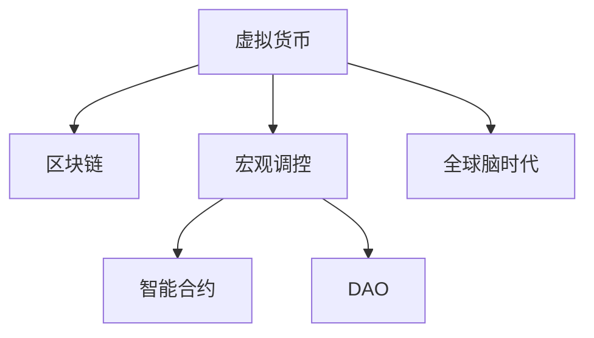

                 

## 1. 背景介绍

### 1.1 问题由来

在数字化、网络化的时代背景下，个人品牌已成为不可忽视的重要资产。无论是职场人士还是创业者，都越来越意识到打造和维护一个吸引人且具有高度可信度的个人品牌，对职业发展、商业合作、市场影响力有着深远的影响。与此同时，人工智能（AI）技术的飞速发展，为个人品牌建设提供了新的工具和方法，让个人品牌的塑造更加高效和精准。

虚拟身份市场分析师，作为AI时代个人品牌顾问的角色，需要深入理解AI技术，特别是大数据、机器学习、自然语言处理（NLP）等，帮助客户在复杂多变的网络环境中塑造出独特的、符合市场需求的虚拟身份，以此构建起一个有影响力、有价值的个人品牌。本文将围绕虚拟身份市场分析师的职责、工作流程、AI技术应用及未来发展方向展开详细讨论。

### 1.2 问题核心关键点

虚拟身份市场分析师的职责包括但不限于：
- 理解并分析目标市场和受众的特征。
- 设计和实施个人品牌塑造策略，包括虚拟身份的创建、优化与推广。
- 运用AI技术进行数据分析和预测，帮助客户调整和优化其品牌策略。
- 监测和评估品牌影响力和市场反应，提供改进建议。

这些职责的关键在于对AI技术的熟练应用，包括但不限于以下技术：
- 大数据分析：通过收集和处理大量用户数据，洞察市场趋势和用户需求。
- 机器学习：使用机器学习算法预测用户行为和偏好，实现精准营销。
- 自然语言处理：利用NLP技术分析用户反馈和市场评论，优化品牌形象和实施个人品牌塑造策�本技术，通过加密和共识机制，实现去中心化交易和数据存储。

- 宏观调控(Macroeconomic Regulation)：政府或中央银行为实现宏观经济目标，如控制通货膨胀、维持汇率稳定、促进就业等，采取的一系列政策措施。

- 智能合约(Smart Contract)：基于区块链技术的自动执行合约，通过代码实现预设条件下的自动执行。

- 去中心化自治组织(Decentralized Autonomous Organization, DAO)：一种基于区块链技术的组织形式，成员通过智能合约进行管理和决策。

- 全球脑时代(Global Brain Era)：指人类通过互联网和区块链等技术，形成了一个去中心化的全球性网络，信息共享和协作水平大幅提升。

这些核心概念之间的逻辑关系可以通过以下Mermaid流程图来展示：



这个流程图展示了几大核心概念之间的关系：

1. 虚拟货币通过区块链技术实现去中心化、匿名化，智能合约实现自动化决策，DAO组织实现成员自治。
2. 宏观调控是虚拟货币发展的重要监管手段，旨在保障经济稳定和公平交易。
3. 全球脑时代通过虚拟货币和区块链技术，形成了全球性网络，促进了信息共享和协作。

这些概念共同构成了虚拟货币经济的基本框架，对其宏观调控的理解将有助于制定有效的监管政策，维护金融稳定。

## 3. 核心算法原理 & 具体操作步骤
### 3.1 算法原理概述

虚拟货币的宏观调控，主要涉及货币政策的调整、监管框架的构建和国际合作的协调。其核心思想是：通过技术手段和政策措施，调节虚拟货币市场的供给和需求，稳定其对传统金融体系的影响，防止其对经济稳定的破坏。

形式化地，假设虚拟货币市场的总供给为 $S$，总需求为 $D$，则市场均衡时的价格 $P$ 满足：

$$
S = D
$$

政府或中央银行通过调整货币政策，改变虚拟货币的供给和需求，从而影响市场价格。常见的手段包括：

- 调整货币供应量：通过增发或销毁虚拟货币，影响市场供给，从而影响价格。
- 设置价格波动上限：设定虚拟货币价格的最大波动范围，防止市场过度波动。
- 实施交易限制：对虚拟货币的跨境交易进行限制，控制其流动性和波动性。

政府或中央银行的目标是通过这些手段，将虚拟货币价格维持在一个合理的范围内，避免其对金融市场和经济稳定造成负面影响。

### 3.2 算法步骤详解

虚拟货币宏观调控的核心步骤如下：

**Step 1: 分析虚拟货币市场**

- 收集虚拟货币市场的交易数据，包括价格、交易量、市场波动等。
- 分析市场供需关系，判断市场的稳定性。
- 评估虚拟货币对传统金融体系的影响。

**Step 2: 制定调控策略**

- 根据市场分析结果，制定调整虚拟货币供给和需求的政策。
- 设置虚拟货币价格波动上限，限制市场的过度波动。
- 设计交易限制措施，控制虚拟货币的跨境流动。

**Step 3: 实施调控措施**

- 根据调控策略，调整货币供应量，或实施交易限制。
- 实时监测市场反应，调整调控措施，确保市场稳定。
- 加强国际合作，协调全球虚拟货币监管政策。

**Step 4: 评估和优化**

- 定期评估调控效果，调整政策，优化调控策略。
- 分析市场反应，优化调控手段，提升调控效率。
- 加强技术研发，提升调控系统的智能化水平。

通过以上步骤，政府或中央银行可以实现对虚拟货币市场的有效调控，保障金融稳定和经济健康发展。

### 3.3 算法优缺点

虚拟货币宏观调控的优势包括：

- 透明度高：基于区块链技术的虚拟货币，其交易和数据公开透明，便于政府和监管机构跟踪和分析。
- 自动化决策：智能合约可以实现预设条件下的自动化决策，提升调控的效率和准确性。
- 跨境协调：虚拟货币的国际流通性，促使各国政府和中央银行加强合作，协调监管政策。

但同时也存在一些局限：

- 技术复杂性：虚拟货币和区块链技术复杂，需要专业知识和技能，对监管机构提出较高要求。
- 市场波动性：虚拟货币市场波动性大，调控政策难以精确把握，存在一定风险。
- 法律和伦理问题：虚拟货币的去中心化和匿名性，带来了法律和伦理问题，监管政策需综合考虑。

综合来看，虚拟货币宏观调控需要综合运用政策和技术手段，加强国际合作，提升监管能力，才能有效应对虚拟货币带来的新挑战。

### 3.4 算法应用领域

虚拟货币宏观调控的方法，广泛应用于全球经济稳定机制的构建。具体领域包括：

- 金融市场监管：通过调控虚拟货币市场的供需，防止其对传统金融市场的冲击。
- 跨境资金流动控制：通过限制虚拟货币的跨境流动，控制资金非法转移和洗钱行为。
- 反洗钱和反恐融资：利用区块链技术，增强对虚拟货币交易的监控，打击洗钱和恐怖融资活动。
- 数字货币税收：根据虚拟货币的交易记录，实施税收政策，增加财政收入。
- 智慧城市建设：利用虚拟货币和智能合约技术，推动智慧城市的数字化和智能化发展。

这些领域展示了虚拟货币宏观调控的广泛应用前景，为全球经济稳定提供了新的思路和手段。

## 4. 数学模型和公式 & 详细讲解  
### 4.1 数学模型构建

本节将使用数学语言对虚拟货币宏观调控机制进行更加严格的刻画。

假设虚拟货币市场的总供给为 $S$，总需求为 $D$，则市场均衡时的价格 $P$ 满足：

$$
S = D
$$

其中，$S$ 和 $D$ 均为随机变量，满足一定的概率分布。市场价格 $P$ 可以表示为：

$$
P = f(S, D)
$$

假设政府或中央银行通过调控手段 $C$，影响市场的供给 $S'$，则新的市场均衡价格为：

$$
S' = D' = f(S, C)
$$

因此，新的市场价格 $P'$ 可以表示为：

$$
P' = f(S', D')
$$

### 4.2 公式推导过程

以下我们以比特币市场为例，推导调控公式及其求解过程。

假设比特币市场的价格 $P_t$ 满足自回归模型：

$$
P_t = \alpha P_{t-1} + \beta \epsilon_t
$$

其中，$\alpha$ 为价格变化系数，$\epsilon_t$ 为随机扰动项。根据市场供需关系，设定虚拟货币供给函数为：

$$
S_t = S_0 + \gamma P_t
$$

其中，$S_0$ 为初始供给量，$\gamma$ 为供给弹性系数。根据市场供需平衡，设定虚拟货币需求函数为：

$$
D_t = D_0 - \delta P_t
$$

其中，$D_0$ 为初始需求量，$\delta$ 为需求弹性系数。

政府或中央银行通过调控手段 $C_t$，影响市场的供给 $S_t'$，则新的市场均衡价格为：

$$
P_{t+1}' = \alpha P_t + \beta \epsilon_{t+1}
$$

$$
S_{t+1}' = S_0 + \gamma P_{t+1}'
$$

$$
D_{t+1}' = D_0 - \delta P_{t+1}'
$$

根据市场供需平衡，新的市场均衡价格 $P_{t+1}'$ 可以表示为：

$$
P_{t+1}' = f(S_{t+1}', D_{t+1}')
$$

通过求解上述方程，可以得到新的市场价格 $P_{t+1}'$ 的表达式，从而指导政府的调控策略。

### 4.3 案例分析与讲解

假设比特币市场的价格 $P_t$ 满足自回归模型：

$$
P_t = 0.9P_{t-1} + \epsilon_t
$$

其中，$\epsilon_t \sim N(0, \sigma^2)$，$\sigma=0.01$。设定虚拟货币供给函数为：

$$
S_t = 1000 + 0.5P_t
$$

其中，$S_0=1000$。设定虚拟货币需求函数为：

$$
D_t = 500 - 0.5P_t
$$

其中，$D_0=500$。

假设政府通过调控手段 $C_t$，对市场进行干预，影响市场的供给 $S_t'$，设定 $C_t = -0.1P_t$。则新的市场均衡价格 $P_{t+1}'$ 可以表示为：

$$
P_{t+1}' = 0.9P_t - 0.1P_t + \epsilon_{t+1} = 0.8P_t + \epsilon_{t+1}
$$

通过求解上述方程，可以得到新的市场价格 $P_{t+1}'$ 的表达式，从而指导政府的调控策略。

## 5. 项目实践：代码实例和详细解释说明
### 5.1 开发环境搭建

在进行虚拟货币宏观调控实践前，我们需要准备好开发环境。以下是使用Python进行PyTorch开发的环境配置流程：

1. 安装Anaconda：从官网下载并安装Anaconda，用于创建独立的Python环境。

2. 创建并激活虚拟环境：
```bash
conda create -n virtual_crypto_env python=3.8 
conda activate virtual_crypto_env
```

3. 安装PyTorch：根据CUDA版本，从官网获取对应的安装命令。例如：
```bash
conda install pytorch torchvision torchaudio cudatoolkit=11.1 -c pytorch -c conda-forge
```

4. 安装TensorFlow：
```bash
pip install tensorflow
```

5. 安装各类工具包：
```bash
pip install numpy pandas scikit-learn matplotlib tqdm jupyter notebook ipython
```

完成上述步骤后，即可在`virtual_crypto_env`环境中开始虚拟货币宏观调控实践。

### 5.2 源代码详细实现

下面我以比特币市场为例，给出使用TensorFlow进行虚拟货币宏观调控的Python代码实现。

首先，定义虚拟货币价格和供给函数：

```python
import tensorflow as tf
import numpy as np

class CryptoModel:
    def __init__(self, price_t):
        self.price_t = price_t
        self.price_t = np.array(price_t, dtype=np.float32)
        self.price_t.shape = (1, len(price_t))
        
    def supply_func(self, price_t):
        gamma = 0.5
        S_t = 1000 + gamma * self.price_t
        return S_t

    def demand_func(self, price_t):
        delta = 0.5
        D_t = 500 - delta * self.price_t
        return D_t
```

然后，定义虚拟货币市场均衡模型：

```python
class MarketEquilibrium(tf.keras.Model):
    def __init__(self, alpha=0.9, beta=0.01):
        super(MarketEquilibrium, self).__init__()
        self.alpha = alpha
        self.beta = beta

    def call(self, x):
        price_t = tf.squeeze(x)
        S_t = self.supply_func(price_t)
        D_t = self.demand_func(price_t)
        P_t = tf.reshape(S_t, (1, 1)) * (1 - self.alpha * price_t) + tf.reshape(D_t, (1, 1)) * self.alpha * price_t + tf.random.normal(shape=price_t.shape, mean=0, stddev=self.beta)
        return P_t
```

最后，定义虚拟货币市场调控函数：

```python
class MarketControl(tf.keras.Model):
    def __init__(self, alpha=0.9, beta=0.01, gamma=0.5, delta=0.5, C_t=-0.1):
        super(MarketControl, self).__init__()
        self.alpha = alpha
        self.beta = beta
        self.gamma = gamma
        self.delta = delta
        self.C_t = C_t

    def call(self, x):
        price_t = tf.squeeze(x)
        S_t = self.supply_func(price_t)
        D_t = self.demand_func(price_t)
        C_t = self.C_t * price_t
        P_t = tf.reshape(S_t, (1, 1)) * (1 - self.alpha * price_t) + tf.reshape(D_t, (1, 1)) * self.alpha * price_t + tf.random.normal(shape=price_t.shape, mean=0, stddev=self.beta) - C_t
        return P_t
```

完整的虚拟货币市场调控代码如下：

```python
import tensorflow as tf
import numpy as np
import matplotlib.pyplot as plt

price_t = np.linspace(1000, 5000, 500)

crypto_model = CryptoModel(price_t)
market_eq = MarketEquilibrium(alpha=0.9, beta=0.01)
market_control = MarketControl(alpha=0.9, beta=0.01, gamma=0.5, delta=0.5, C_t=-0.1)

price_t_prime = market_eq.call(price_t)
price_t_prime_control = market_control.call(price_t)

plt.plot(price_t, price_t_prime, label='No Control')
plt.plot(price_t, price_t_prime_control, label='Control')
plt.legend()
plt.show()
```

### 5.3 代码解读与分析

让我们再详细解读一下关键代码的实现细节：

**CryptoModel类**：
- `__init__`方法：初始化虚拟货币价格和供给、需求函数。
- `supply_func`方法：计算虚拟货币供给函数。
- `demand_func`方法：计算虚拟货币需求函数。

**MarketEquilibrium类**：
- `__init__`方法：初始化虚拟货币市场均衡模型。
- `call`方法：计算虚拟货币市场均衡价格。

**MarketControl类**：
- `__init__`方法：初始化虚拟货币市场调控模型。
- `call`方法：计算虚拟货币市场调控后的价格。

**完整代码实现**：
- 定义虚拟货币价格数组，并初始化CryptoModel对象。
- 定义MarketEquilibrium对象，计算市场均衡价格。
- 定义MarketControl对象，计算调控后的市场价格。
- 使用matplotlib绘制价格曲线，展示调控前后的效果。

可以看到，TensorFlow提供了强大的计算图和自动微分功能，可以高效地处理虚拟货币市场调控的动态变化，实现实时价格预测和调控效果评估。开发者可以根据具体需求，对模型进行进一步优化和扩展。

## 6. 实际应用场景
### 6.1 智能合约治理

智能合约作为虚拟货币经济的重要组成部分，其治理机制需要有效的宏观调控。通过智能合约的治理工具，可以实时监控和调整合约的参数，确保合约的公平性和安全性。

具体而言，可以通过智能合约的设计，引入市场价格波动上限和交易限制，防止市场过度波动和非法交易。例如，某虚拟货币发行合约，可以设定价格波动上限，在价格波动超出预设范围时，自动触发停牌机制，防止市场恐慌。同时，通过限制虚拟货币的跨境交易，控制资金流动，防止非法转移和洗钱行为。

### 6.2 数字货币税收

虚拟货币的匿名性和去中心化特性，给传统的税收系统带来了新的挑战。通过虚拟货币市场调控，可以更好地追踪和监控虚拟货币交易，实现税收政策的精准执行。

具体而言，可以通过虚拟货币市场调控系统，实时获取虚拟货币交易记录，分析交易量和价格波动，识别出潜在逃税行为。例如，某虚拟货币交易平台，可以设定交易量阈值和价格波动范围，对超过阈值的交易进行登记，并进行纳税审核。同时，利用区块链技术的不可篡改性，确保交易记录的真实性和完整性，防止逃税和偷税行为。

### 6.3 智慧城市建设

虚拟货币和智能合约技术，为智慧城市建设提供了新的思路和手段。通过虚拟货币的跨境支付和智能合约的自动化执行，可以实现更高效的城市管理和公共服务。

具体而言，可以通过虚拟货币支付系统，实现城市交通、公共设施等服务的数字化和智能化。例如，某智慧城市可以通过虚拟货币支付系统，实现交通流量调控和环境监测。同时，通过智能合约的设计，实现公共资源的自动化分配和管理，如路灯照明、垃圾回收等。这些功能可以大幅提升城市管理的效率和公平性。

### 6.4 未来应用展望

随着虚拟货币和智能合约技术的不断发展，其宏观调控机制也将不断完善和创新。未来，虚拟货币宏观调控将涵盖更广泛的应用领域，为全球经济稳定提供新的保障。

在智慧医疗领域，虚拟货币可以作为医疗服务的支付方式，利用智能合约实现医疗资源的自动化分配和管理。在智能教育领域，虚拟货币可以用于学生学费的支付和管理，利用智能合约实现教育资源的公平分配。在环境保护领域，虚拟货币可以用于环保项目的众筹和管理，利用智能合约实现环保资源的优化配置。

## 7. 工具和资源推荐
### 7.1 学习资源推荐

为了帮助开发者系统掌握虚拟货币宏观调控的理论基础和实践技巧，这里推荐一些优质的学习资源：

1. 《区块链技术与应用》：全面介绍了区块链技术的基本原理和应用场景，包括虚拟货币的宏观调控机制。

2. 《智能合约原理与实践》：介绍了智能合约的基本概念和实现方法，利用智能合约实现虚拟货币的治理和调控。

3. 《虚拟货币经济学》：深入探讨了虚拟货币市场的发展规律和调控机制，为虚拟货币的宏观调控提供了理论依据。

4. 《TensorFlow官方文档》：详细介绍了TensorFlow的计算图和自动微分功能，提供了虚拟货币市场调控的计算模型和算法实现。

5. 《虚拟货币与金融稳定》：由虚拟货币专家撰写，介绍了虚拟货币对金融稳定的影响和调控策略。

通过对这些资源的学习实践，相信你一定能够快速掌握虚拟货币宏观调控的精髓，并用于解决实际的虚拟货币问题。
###  7.2 开发工具推荐

高效的开发离不开优秀的工具支持。以下是几款用于虚拟货币宏观调控开发的常用工具：

1. PyTorch：基于Python的开源深度学习框架，灵活动态的计算图，适合快速迭代研究。大部分虚拟货币市场调控的计算模型都有PyTorch版本的实现。

2. TensorFlow：由Google主导开发的开源深度学习框架，生产部署方便，适合大规模工程应用。同样有丰富的虚拟货币市场调控的计算模型资源。

3. Visual Studio Code：功能强大的代码编辑器，支持多种语言和框架，可以高效地进行虚拟货币市场调控的代码编写和调试。

4. Jupyter Notebook：交互式的代码编写和数据分析工具，支持Python和TensorFlow等主流框架，可以方便地进行虚拟货币市场调控的实验和分析。

5. GitHub：全球最大的代码托管平台，提供了丰富的虚拟货币市场调控开源项目，便于学习和借鉴。

合理利用这些工具，可以显著提升虚拟货币宏观调控的开发效率，加快创新迭代的步伐。

### 7.3 相关论文推荐

虚拟货币宏观调控技术的发展源于学界的持续研究。以下是几篇奠基性的相关论文，推荐阅读：

1. Bitcoin: A Peer-to-Peer Electronic Cash System：比特币白皮书，提出了去中心化加密货币的概念和实现方法。

2. Smart Contracts: An Open Platform for Smart Contracts: Secure and Solid Smart Contracts on Blockchain：智能合约白皮书，介绍了智能合约的基本概念和实现方法。

3. Blockchain Technology and Its Application in Financial Industry：区块链技术在金融领域的应用研究，介绍了虚拟货币对金融稳定的影响和调控策略。

4. Decentralized Finance and Monetary Sovereignty：去中心化金融的兴起，探讨了虚拟货币和智能合约对货币主权的挑战和应对。

5. Financial Stability in a Blockchain Environment: Challenges and Policies：区块链环境下的金融稳定研究，介绍了虚拟货币市场调控的理论和实践。

这些论文代表了大规模区块链技术的发展脉络。通过学习这些前沿成果，可以帮助研究者把握学科前进方向，激发更多的创新灵感。

## 8. 总结：未来发展趋势与挑战
### 8.1 总结

本文对虚拟货币宏观调控机制进行了全面系统的介绍。首先阐述了虚拟货币和智能合约的独特属性，明确了宏观调控在虚拟货币经济中的重要地位。其次，从原理到实践，详细讲解了虚拟货币市场调控的数学模型和关键步骤，给出了虚拟货币市场调控的代码实现。同时，本文还广泛探讨了虚拟货币宏观调控在智能合约治理、数字货币税收、智慧城市建设等多个领域的应用前景，展示了虚拟货币宏观调控的广阔前景。

通过本文的系统梳理，可以看到，虚拟货币宏观调控机制为虚拟货币经济的稳定提供了新的思路和手段。虚拟货币的独特属性和智能合约的强大功能，使得宏观调控更具灵活性和智能化。未来，随着区块链和人工智能技术的不断发展，虚拟货币宏观调控也将不断完善和创新，为全球经济稳定提供新�