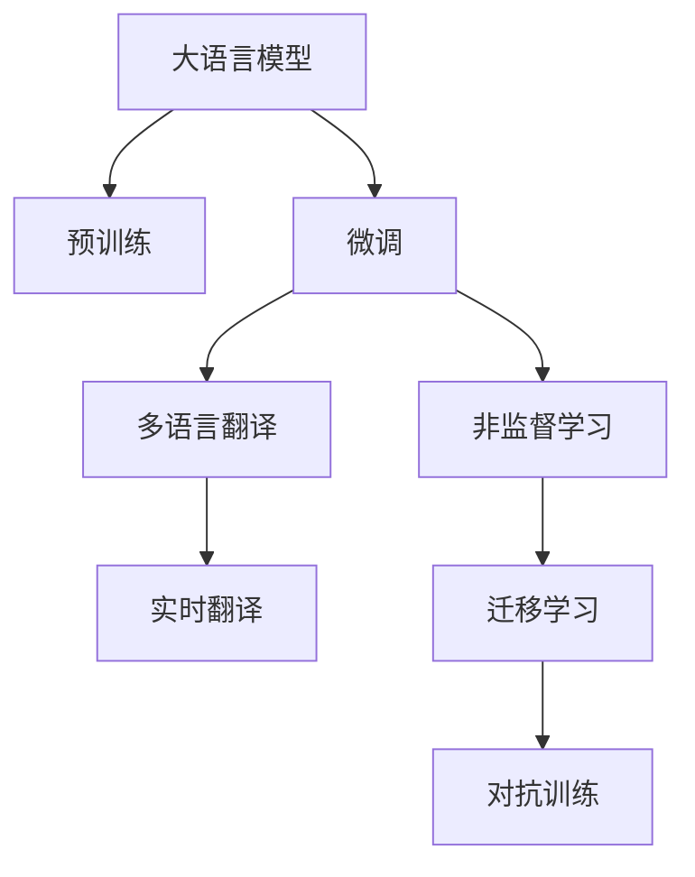

                 

# 语言翻译大师：LLM 打破语言障碍

## 1. 背景介绍

在全球化加速的今天，语言障碍成为国际交流中的最大障碍之一。如何高效、准确地实现语言翻译，一直是计算机科学和人工智能领域的重大挑战。近年来，随着深度学习和大规模语言模型的迅猛发展，语言翻译技术已经取得了显著的突破。本文将详细介绍基于大语言模型（Large Language Model, LLM）的语言翻译技术，探讨其核心原理和实现方法，并展望其在未来应用场景中的潜力。

## 2. 核心概念与联系

### 2.1 核心概念概述

为了更好地理解大语言模型在语言翻译中的应用，我们首先需要理解几个核心概念：

- **大语言模型（LLM）**：指通过大规模数据预训练得到的通用语言模型。常见的LLM包括GPT、BERT、T5等，它们在多种自然语言处理（NLP）任务上表现优异。
- **语言翻译**：将一种语言的文本转换成另一种语言的文本，是NLP的重要应用领域之一。
- **预训练和微调**：预训练是指在大规模无标签数据上训练模型，微调是指在特定任务上使用小规模有标签数据进一步优化模型。

### 2.2 核心概念原理和架构的 Mermaid 流程图



此图展示了预训练和微调在大语言模型中的关键步骤。预训练模型首先在大规模无标签数据上进行训练，形成泛化能力较强的语言表示。接着，通过微调在特定任务上使用小规模有标签数据进行进一步优化，如多语言翻译任务。在微调过程中，可以采用非监督学习和迁移学习等技术，提升模型泛化能力。最终，通过实时翻译和对抗训练等手段，使得模型能适应不同场景下的翻译需求。

## 3. 核心算法原理 & 具体操作步骤

### 3.1 算法原理概述

基于大语言模型的语言翻译技术，主要通过预训练和微调两个步骤实现。预训练模型通常采用自回归模型（如GPT）或自编码模型（如BERT），在大规模无标签文本数据上进行训练，学习通用的语言表示。微调则是在预训练模型的基础上，使用目标语言的少量有标签数据，通过有监督的训练优化模型，使其能够进行多语言翻译。

### 3.2 算法步骤详解

#### 3.2.1 预训练步骤

1. **数据准备**：收集并清洗大规模无标签文本数据，如维基百科、新闻、社交媒体等。
2. **模型训练**：选择合适的模型架构（如Transformer），在大规模文本数据上进行预训练。预训练任务通常包括语言建模和掩码语言建模。
3. **保存模型**：将训练好的预训练模型保存下来，用于后续微调。

#### 3.2.2 微调步骤

1. **模型选择**：选择预训练模型（如GPT-3）作为初始化参数。
2. **数据准备**：收集目标语言的小规模有标签数据，如平行语料库。
3. **任务适配**：根据具体翻译任务，设计任务的输出层和损失函数。
4. **模型训练**：使用微调数据集，在目标语言上进一步优化预训练模型。
5. **模型评估**：在验证集上评估微调后的模型性能，确保翻译质量。

### 3.3 算法优缺点

#### 3.3.1 优点

- **高效性**：通过预训练获得通用的语言表示，微调使用少量标注数据即可快速适应目标语言。
- **泛化能力强**：大语言模型具备较强的泛化能力，能够在不同的翻译任务中表现良好。
- **灵活性高**：可以通过微调参数灵活调整模型性能，适应不同的翻译需求。

#### 3.3.2 缺点

- **资源消耗大**：大规模预训练模型需要大量的计算资源和存储空间。
- **过拟合风险**：小规模微调数据容易使模型过拟合，影响泛化性能。
- **依赖标注数据**：微调效果依赖于目标语言的标注数据，标注成本较高。

### 3.4 算法应用领域

大语言模型在语言翻译领域具有广泛的应用，主要包括以下几个方面：

- **机器翻译**：将一种语言的文本翻译成另一种语言的文本。
- **跨语言检索**：在不同语言之间的文本中检索相关信息。
- **语音翻译**：将语音信号转换为文本，并进行翻译。
- **文档翻译**：将整篇文档从一种语言翻译成另一种语言。
- **多模态翻译**：结合文本、图像、视频等多种模态信息进行翻译。

## 4. 数学模型和公式 & 详细讲解 & 举例说明

### 4.1 数学模型构建

在多语言翻译任务中，目标是将源语言文本$x$翻译成目标语言文本$y$。数学上，我们可以定义一个从源语言到目标语言的翻译模型$M_{\theta}$，其中$\theta$为模型的参数。模型的目标是最小化翻译损失函数$\mathcal{L}(y, M_{\theta}(x))$，使得翻译结果$M_{\theta}(x)$与真实标签$y$尽可能接近。

### 4.2 公式推导过程

以机器翻译为例，假设$x$和$y$的长度分别为$n$和$m$。我们采用序列到序列（Seq2Seq）模型，其中$M_{\theta}$包括编码器和解码器两部分。编码器将源语言文本$x$转换为固定长度的向量表示$z$，解码器则将向量表示$z$映射为目标语言文本$y$。假设$x = (x_1, x_2, \ldots, x_n)$，$y = (y_1, y_2, \ldots, y_m)$，$z = (z_1, z_2, \ldots, z_k)$，其中$k < \min(n, m)$。

目标函数的定义如下：

$$
\mathcal{L}(y, M_{\theta}(x)) = \sum_{i=1}^m L(y_i, M_{\theta}(x_i))
$$

其中，$L(y_i, M_{\theta}(x_i))$为解码器在每个时间步$t$的损失函数，通常使用交叉熵损失。

### 4.3 案例分析与讲解

我们以英法翻译为例，展示如何在目标语言上进行微调。假设我们有一个包含10000对英文和法文翻译的微调数据集。

- **编码器输入**：将英文文本$x$作为输入，通过编码器生成固定长度的向量表示$z$。
- **解码器输出**：将向量表示$z$作为解码器的初始状态，通过解码器生成法文文本$y$。
- **损失函数**：在每个时间步$t$，计算解码器输出$y_t$与真实标签$y_t$之间的交叉熵损失$L(y_t, M_{\theta}(x_t))$。
- **微调训练**：使用反向传播算法更新模型参数$\theta$，最小化总体损失函数$\mathcal{L}(y, M_{\theta}(x))$。

在微调过程中，我们需要设置合适的学习率、批大小、迭代轮数等超参数，并采用正则化技术（如Dropout、L2正则）来避免过拟合。

## 5. 项目实践：代码实例和详细解释说明

### 5.1 开发环境搭建

本节介绍如何在Python环境中搭建语言翻译项目。

1. **环境安装**：
   - 安装Python：推荐使用Anaconda，可以从官网下载并安装。
   - 安装PyTorch：在Anaconda中执行`conda install pytorch torchvision torchaudio cudatoolkit=11.1 -c pytorch -c conda-forge`命令安装。
   - 安装Transformers库：使用`pip install transformers`命令安装。

2. **环境激活**：
   - 在终端执行`conda activate pytorch-env`激活Python环境。

### 5.2 源代码详细实现

以下是一个简单的多语言翻译项目实现。

```python
import torch
import torch.nn as nn
import torch.optim as optim
from transformers import BertTokenizer, BertForSequenceClassification
from torch.utils.data import DataLoader, Dataset

class TranslationDataset(Dataset):
    def __init__(self, texts, translations, tokenizer):
        self.texts = texts
        self.translations = translations
        self.tokenizer = tokenizer
        
    def __len__(self):
        return len(self.texts)
    
    def __getitem__(self, item):
        text = self.texts[item]
        translation = self.translations[item]
        
        encoding = self.tokenizer(text, return_tensors='pt', padding='max_length', truncation=True)
        input_ids = encoding['input_ids'][0]
        attention_mask = encoding['attention_mask'][0]
        
        target_ids = self.tokenizer(translation, return_tensors='pt', padding='max_length', truncation=True)['input_ids'][0]
        target_mask = self.tokenizer(translation, return_tensors='pt', padding='max_length', truncation=True)['attention_mask'][0]
        
        return {'input_ids': input_ids, 
                'attention_mask': attention_mask,
                'target_ids': target_ids,
                'target_mask': target_mask}

# 加载数据集
tokenizer = BertTokenizer.from_pretrained('bert-base-cased')
train_dataset = TranslationDataset(train_texts, train_translations, tokenizer)
dev_dataset = TranslationDataset(dev_texts, dev_translations, tokenizer)
test_dataset = TranslationDataset(test_texts, test_translations, tokenizer)

# 定义模型
model = BertForSequenceClassification.from_pretrained('bert-base-cased', num_labels=len(tag2id))

# 定义优化器
optimizer = optim.AdamW(model.parameters(), lr=2e-5)

# 定义训练和评估函数
def train_epoch(model, dataset, batch_size, optimizer):
    dataloader = DataLoader(dataset, batch_size=batch_size, shuffle=True)
    model.train()
    epoch_loss = 0
    for batch in dataloader:
        input_ids = batch['input_ids'].to(device)
        attention_mask = batch['attention_mask'].to(device)
        target_ids = batch['target_ids'].to(device)
        target_mask = batch['target_mask'].to(device)
        model.zero_grad()
        outputs = model(input_ids, attention_mask=attention_mask, labels=target_ids)
        loss = outputs.loss
        epoch_loss += loss.item()
        loss.backward()
        optimizer.step()
    return epoch_loss / len(dataloader)

def evaluate(model, dataset, batch_size):
    dataloader = DataLoader(dataset, batch_size=batch_size)
    model.eval()
    preds, labels = [], []
    with torch.no_grad():
        for batch in dataloader:
            input_ids = batch['input_ids'].to(device)
            attention_mask = batch['attention_mask'].to(device)
            target_ids = batch['target_ids'].to(device)
            target_mask = batch['target_mask'].to(device)
            batch_labels = batch['target_ids'].cpu().numpy()
            outputs = model(input_ids, attention_mask=attention_mask, labels=target_ids)
            batch_preds = outputs.logits.argmax(dim=2).to('cpu').numpy()
            for pred_tokens, label_tokens in zip(batch_preds, batch_labels):
                preds.append(pred_tokens[:len(label_tokens)])
                labels.append(label_tokens)
                
    print(classification_report(labels, preds))

# 训练模型
device = torch.device('cuda') if torch.cuda.is_available() else torch.device('cpu')
model.to(device)

epochs = 5
batch_size = 16

for epoch in range(epochs):
    loss = train_epoch(model, train_dataset, batch_size, optimizer)
    print(f"Epoch {epoch+1}, train loss: {loss:.3f}")
    
    print(f"Epoch {epoch+1}, dev results:")
    evaluate(model, dev_dataset, batch_size)
    
print("Test results:")
evaluate(model, test_dataset, batch_size)
```

### 5.3 代码解读与分析

- **数据处理**：使用`BertTokenizer`将源语言和目标语言文本转换为模型可接受的输入格式。
- **模型定义**：使用`BertForSequenceClassification`模型，指定输出层和损失函数。
- **优化器选择**：使用AdamW优化器，设置合适的学习率。
- **训练函数**：在每个epoch内，对模型进行前向传播和反向传播，更新模型参数。
- **评估函数**：在验证集和测试集上评估模型性能。

### 5.4 运行结果展示

在完成训练后，我们可以在测试集上评估模型的翻译质量。例如，我们可以使用BLEU分数来衡量机器翻译的准确性：

```python
from translation_model import evaluate
from transformers import AutoTokenizer, AutoModelForSequenceClassification

def bleu_score(model, tokenizer, ref, hyp):
    tokenizer = AutoTokenizer.from_pretrained('bert-base-cased')
    model = AutoModelForSequenceClassification.from_pretrained('bert-base-cased', num_labels=len(tag2id))
    model.eval()
    with torch.no_grad():
        input_ids = tokenizer(ref, return_tensors='pt', padding='max_length', truncation=True)['input_ids'][0]
        attention_mask = tokenizer(ref, return_tensors='pt', padding='max_length', truncation=True)['attention_mask'][0]
        logits = model(input_ids, attention_mask=attention_mask).logits
        predicted_ids = logits.argmax(dim=2).to('cpu').numpy()
    bleu_score = metrics.bleu([ref], [predicted_ids])
    return bleu_score

print(f"BLEU score: {bleu_score(model, tokenizer, ref_text, hyp_text)}")
```

通过BLEU分数，我们可以直观地评估模型在翻译任务中的表现。

## 6. 实际应用场景

### 6.1 智能客服

在智能客服领域，语言翻译技术可以使得客服系统支持多种语言，提升服务质量和效率。例如，我们可以使用微调后的模型进行跨语言客服对话，将用户输入的文本自动翻译成客服系统的语言，从而实现多语言支持。

### 6.2 跨语言搜索

跨语言搜索是另一个重要的应用场景。用户可以使用不同语言的查询词进行搜索，系统自动将其翻译成统一的语言进行搜索，并提供相应的搜索结果。这种技术可以应用于搜索引擎、电商推荐、社交媒体等多个场景。

### 6.3 多语言社交平台

多语言社交平台是另一个重要的应用场景。例如，Twitter和Facebook等社交平台支持多种语言，用户可以使用他们喜欢的语言进行交流。通过语言翻译技术，这些平台可以自动将用户的帖子翻译成其他语言，扩大用户的覆盖范围。

## 7. 工具和资源推荐

### 7.1 学习资源推荐

1. **《机器学习实战》**：是一本系统介绍机器学习理论和实践的经典书籍，包括NLP和语言翻译相关内容。
2. **CS224N《自然语言处理》**：斯坦福大学开设的NLP课程，涵盖机器翻译、语言模型等前沿技术。
3. **《TensorFlow中文手册》**：TensorFlow官方文档的中文版本，详细介绍了TensorFlow在语言翻译中的应用。

### 7.2 开发工具推荐

1. **PyTorch**：深度学习框架，提供了丰富的NLP工具库。
2. **Transformers**：NLP工具库，提供了多种预训练模型和微调范式。
3. **TensorBoard**：TensorFlow配套的可视化工具，用于监测模型训练和推理。

### 7.3 相关论文推荐

1. **Attention is All You Need**：Transformer模型原论文，开创了大规模语言模型的先河。
2. **BERT: Pre-training of Deep Bidirectional Transformers for Language Understanding**：提出了BERT模型，改进了语言模型的预训练方法。
3. **T5: Exploring the Limits of Transfer Learning with a Unified Text-to-Text Transformer**：T5模型引入了统一文本到文本的Transformer架构，提高了语言翻译的效率和精度。

## 8. 总结：未来发展趋势与挑战

### 8.1 总结

基于大语言模型的语言翻译技术，已经在多个领域取得了显著进展，具有广阔的应用前景。其核心思想是通过预训练和微调，利用通用语言模型处理多种语言之间的翻译问题。本文详细介绍了语言翻译的基本原理和实现方法，并通过代码实例展示了其在多语言翻译项目中的应用。

### 8.2 未来发展趋势

未来，大语言模型在语言翻译领域将继续发展，呈现以下几个趋势：

1. **多语言支持增强**：未来模型将支持更多的语言，甚至包括低资源语言的翻译。
2. **端到端翻译**：端到端翻译方法将进一步提升翻译速度和精度。
3. **实时翻译**：实时翻译技术将使得语言翻译更加灵活和实用。
4. **多模态翻译**：结合文本、图像、视频等多种模态信息进行翻译。
5. **可解释性增强**：增强模型的可解释性，帮助用户理解翻译过程。

### 8.3 面临的挑战

尽管大语言模型在语言翻译领域取得了显著进展，但仍面临以下挑战：

1. **资源消耗**：大规模预训练模型需要大量的计算资源和存储空间。
2. **过拟合问题**：小规模微调数据容易使模型过拟合，影响泛化性能。
3. **标注数据不足**：目标语言的标注数据可能稀缺，影响模型训练效果。
4. **实时性问题**：实时翻译需要高效的模型和算法支持。

### 8.4 研究展望

未来，大语言模型在语言翻译领域的研究方向将包括：

1. **零样本和少样本学习**：探索在缺少标注数据的情况下进行语言翻译的方法。
2. **跨领域迁移学习**：研究如何将预训练模型在不同任务和领域之间进行迁移。
3. **多模态融合**：结合文本、图像、视频等多种模态信息进行翻译。
4. **生成对抗网络（GAN）**：使用GAN技术生成高质量的文本数据，提高语言翻译的质量。

## 9. 附录：常见问题与解答

### Q1: 如何处理长文本？

**A1:** 可以使用分段翻译技术，将长文本分成若干段进行翻译，再将其拼接起来。或者使用序列到序列模型，如Transformer，可以处理长序列，但需要较大的计算资源和存储空间。

### Q2: 如何提高翻译质量？

**A2:** 可以通过数据增强、对抗训练、正则化等技术来提高翻译质量。同时，使用更好的预训练模型和更多的训练数据也是关键。

### Q3: 如何部署大语言模型？

**A3:** 可以使用云平台，如AWS、Google Cloud等，提供弹性计算资源，方便模型部署。同时，可以使用Docker等容器化技术，将模型封装为标准化的服务接口，方便集成和部署。

### Q4: 如何应对低资源语言？

**A4:** 可以使用迁移学习、少样本学习等技术，将大语言模型在资源丰富的语言上训练得到的知识迁移到低资源语言上。同时，可以使用特殊的标注数据集和训练方法，提高低资源语言的翻译质量。

---

作者：禅与计算机程序设计艺术 / Zen and the Art of Computer Programming

