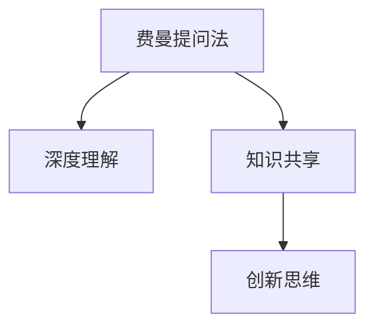

                 

# 费曼提问法提升团队创新能力

> 关键词：费曼提问法,创新,团队协作,思维训练,知识分享

## 1. 背景介绍

### 1.1 问题由来

费曼提问法（Feynman Technique），源自著名物理学家理查德·费曼的学习方法，强调通过提问来深入理解知识和技能。在信息爆炸的现代社会，获取知识变得触手可及，但如何有效掌握和应用知识，特别是将其转化为创新能力，成为企业和组织关注的焦点。团队创新能力的提升，不仅关系到企业核心竞争力的形成，更是推动科技进步和产业升级的关键因素。

### 1.2 问题核心关键点

费曼提问法通过不断的自我提问和他人提问，引导团队成员深入理解问题和解决方案，从而激发创新思维。具体而言，核心关键点包括：
1. **深度理解**：通过提问深入了解问题的本质和细节。
2. **知识共享**：通过提问促进团队成员之间的知识交流，消除信息孤岛。
3. **创新思维**：通过提问打破固有思维定势，激发新的解决方案。

### 1.3 问题研究意义

费曼提问法在提升团队创新能力方面具有重要意义：

1. **增强理解**：通过不断提问，促使成员深入理解问题，提升解决问题的能力。
2. **促进合作**：通过知识共享，增强团队成员之间的沟通协作，形成合力。
3. **激发创新**：打破常规思维，激发新的创意和解决方案，推动技术创新和产品迭代。
4. **提升效率**：通过有效提问，减少误解和沟通成本，提升项目执行效率。

## 2. 核心概念与联系

### 2.1 核心概念概述

为了更好地理解费曼提问法在团队创新中的应用，本节将介绍几个关键概念：

- **费曼提问法**：基于著名物理学家理查德·费曼的学习方法，强调通过提问来深入理解知识和技能。
- **深度理解**：指对问题或知识的深入、细致的思考和分析，力求理解其本质和细节。
- **知识共享**：指团队成员之间通过分享知识、经验和见解，促进信息的流通和利用。
- **创新思维**：指打破常规思维模式，寻求新的解决问题的方式和思路。

这些概念之间存在紧密的联系，共同构成了费曼提问法的核心内容。以下是一个Mermaid流程图，展示了这些概念之间的联系：

这个流程图展示了费曼提问法通过不断提问，促进深度理解、知识共享和创新思维，进而提升团队整体的创新能力。

## 3. 核心算法原理 & 具体操作步骤
### 3.1 算法原理概述

费曼提问法基于深度学习和认知科学的原理，通过不断提问和思考，帮助团队成员深化对问题和解决方案的理解，从而激发创新思维。其核心思想是：

1. **深度理解**：通过不断提出“为什么”和“如何”等问题，促使团队成员深入思考问题的本质和细节。
2. **知识共享**：通过提问和回答，促进团队成员之间的知识交流，消除信息孤岛，增强团队整体的认知能力。
3. **创新思维**：通过打破常规思维定势，鼓励团队成员从不同角度思考问题，寻求新的解决方案。

### 3.2 算法步骤详解

费曼提问法的实施步骤包括：

1. **自我提问**：团队成员独立思考，提出自己关于问题的所有疑问，力求深入理解问题的本质。
2. **他人提问**：团队成员之间相互提问，探讨各自的疑问和见解，促进知识共享和思维碰撞。
3. **共同解答**：团队成员共同探讨和解答提出的问题，形成共识，进一步加深理解和创新思路。
4. **反思总结**：团队成员对提问和解答的过程进行反思，总结经验教训，形成新的知识和技能。

### 3.3 算法优缺点

费曼提问法在提升团队创新能力方面具有以下优点：

1. **促进深度理解**：通过提问和解答，促使团队成员深入理解问题，提升解决问题的能力。
2. **增强知识共享**：通过提问和回答，促进团队成员之间的知识交流，消除信息孤岛。
3. **激发创新思维**：通过打破常规思维定势，激发新的创意和解决方案，推动技术创新和产品迭代。
4. **提升团队协作**：通过提问和解答，增强团队成员之间的沟通协作，形成合力。

同时，费曼提问法也存在一些局限性：

1. **时间成本高**：实施费曼提问法需要投入大量时间进行提问和解答，对工作效率有一定影响。
2. **依赖个人能力**：团队成员的提问能力直接决定了费曼提问法的效果，能力不足时可能难以达到预期效果。
3. **需要营造氛围**：费曼提问法的实施需要团队成员之间有良好的沟通氛围和信任关系，缺乏氛围可能导致效果打折扣。

### 3.4 算法应用领域

费曼提问法在多个领域得到了广泛应用，包括但不限于：

1. **技术研发**：帮助团队成员深入理解技术问题和需求，推动技术创新和产品迭代。
2. **项目管理**：通过提问和解答，增强团队成员对项目进度、风险和挑战的理解，提升项目管理效率。
3. **产品设计**：促进团队成员对用户需求和产品功能的深入思考，提升产品设计和用户体验。
4. **市场分析**：通过提问和讨论，增强团队对市场趋势和竞争环境的理解，制定更有效的市场策略。
5. **培训和教育**：用于培训和教育领域，帮助学员深入理解知识和技能，提升学习效果。

## 4. 数学模型和公式 & 详细讲解 & 举例说明

### 4.1 数学模型构建

费曼提问法不涉及具体的数学模型，其核心在于通过不断提问和解答，帮助团队成员深入理解问题和解决方案。因此，本文主要讨论如何通过提问和解答，促进团队成员的深度理解和知识共享。

### 4.2 公式推导过程

费曼提问法的实施过程不涉及复杂的数学推导，主要依赖于团队成员之间的互动和思考。以下是一个简化的提问和解答过程示例：

1. **自我提问**：假设团队成员甲在阅读一篇关于人工智能技术的研究论文时，提出了以下问题：
   - “什么是人工智能？”
   - “人工智能有哪些应用场景？”
   - “人工智能的现状和未来趋势是什么？”

2. **他人提问**：团队成员乙对甲的问题进行了回应，并提出了新的问题：
   - “人工智能有哪些常见的算法？”
   - “人工智能的应用场景如何与业务需求结合？”
   - “人工智能技术在当前行业中的挑战和机遇是什么？”

3. **共同解答**：甲和乙共同探讨和解答了上述问题，并讨论了人工智能的实际应用案例，形成了对人工智能的深入理解。

### 4.3 案例分析与讲解

以下是一个具体的案例分析：

假设一个软件开发团队在开发一个新的电子商务平台时，面临以下问题：

- 如何确保系统的高可用性和可靠性？
- 如何优化用户界面和用户体验？
- 如何处理大量并发请求？

团队成员甲在阅读相关文献时，提出了以下问题：
- “什么是高可用性和可靠性？”
- “有哪些方法可以提升系统的可用性和可靠性？”
- “如何在不同环境中测试和验证系统的可用性和可靠性？”

团队成员乙对甲的问题进行了回应，并提出了新的问题：
- “用户界面和用户体验的设计原则是什么？”
- “有哪些工具和技术可以提升用户界面和用户体验？”
- “如何衡量用户界面和用户体验的效果？”

通过不断的提问和解答，团队成员共同探讨了高可用性、可靠性和用户体验的设计和实现方法，最终形成了一个有效的解决方案，推动了项目的顺利进行。

## 5. 项目实践：代码实例和详细解释说明
### 5.1 开发环境搭建

为了实施费曼提问法，需要一个开放、协作的开发环境。以下是一些推荐的开发工具和环境：

1. **协作工具**：如Trello、Jira等，用于管理项目任务和进度。
2. **通信工具**：如Slack、Microsoft Teams等，便于团队成员之间的实时沟通和信息共享。
3. **文档管理工具**：如Confluence、Google Docs等，用于记录和分享知识。

### 5.2 源代码详细实现

费曼提问法的实施不需要编写具体的代码，但可以通过一些工具和平台进行支持和辅助。以下是一个简化的实施流程示例：

1. **创建项目任务**：在协作工具中创建项目任务，明确每个问题的细节和目标。
2. **提出和回答问题**：在协作工具中创建问题和答案，进行公开讨论。
3. **记录和分享知识**：将讨论和解答的内容记录在文档管理工具中，供后续参考。
4. **总结和反思**：在项目完成后，对提问和解答的过程进行总结，形成新的知识和技能。

### 5.3 代码解读与分析

由于费曼提问法的实施不涉及具体的代码，这里提供一个简单的示例，展示如何在协作工具中实施费曼提问法：

1. **创建任务**：在协作工具中创建任务，如在Trello中创建一个名为“提升系统可用性”的任务，描述问题的细节和目标。
2. **提出问题**：在任务卡片中添加问题，如“如何提升系统的可用性？”。
3. **回答和讨论**：其他团队成员可以在任务卡片中添加回答，并进行公开讨论，如“可以使用负载均衡技术提升系统的可用性。”
4. **总结和反思**：项目完成后，在文档管理工具中总结和记录讨论的过程和结果，如“通过使用负载均衡技术，系统的可用性提升了30%。”

### 5.4 运行结果展示

费曼提问法的运行结果主要体现在团队成员的深度理解、知识共享和创新思维上。以下是一个简化的示例：

- **深度理解**：团队成员对系统高可用性和可靠性的问题有了更深入的理解，明确了关键技术和方法。
- **知识共享**：团队成员通过讨论和解答，形成了对高可用性、可靠性和用户体验的理解和共识。
- **创新思维**：团队成员提出了新的解决方案和改进方法，推动了项目的成功实施。

## 6. 实际应用场景
### 6.1 软件开发

在软件开发过程中，费曼提问法可以用于技术研究和产品设计。团队成员通过不断提问和解答，深入理解技术细节和需求，推动技术创新和产品迭代。

### 6.2 市场营销

在市场营销中，费曼提问法可以帮助团队成员深入理解市场趋势和用户需求，制定更有效的市场策略。通过提问和解答，团队成员可以发现新的市场机会和用户痛点。

### 6.3 项目管理

在项目管理中，费曼提问法可以帮助团队成员理解项目进度、风险和挑战，提升项目管理效率。通过提问和解答，团队成员可以及时发现和解决问题，确保项目按时按质完成。

### 6.4 未来应用展望

随着技术的发展和应用的深入，费曼提问法将在更多领域得到应用，进一步提升团队创新能力：

1. **跨领域创新**：费曼提问法可以应用于不同领域，促进跨领域的知识交流和创新。
2. **自动化应用**：通过工具和平台的支持，费曼提问法可以自动化实施，提升效率和效果。
3. **国际合作**：费曼提问法可以促进国际团队之间的知识共享和协作，推动全球创新。

## 7. 工具和资源推荐
### 7.1 学习资源推荐

为了帮助团队成员掌握费曼提问法的核心思想和实施方法，推荐以下学习资源：

1. **《费曼学习法》**：理查德·费曼的传记，详细介绍了费曼的学习方法和思维方式。
2. **《深度工作》**：卡尔·纽波特的著作，探讨了如何通过深度工作提升学习和工作效率。
3. **Coursera《创新与创造力》课程**：由斯坦福大学教授讲授，介绍了如何通过提问和创新思维解决问题。
4. **TED Talk《How to Ask Better Questions》**：TED演讲，介绍了如何通过提问提升思考和沟通能力。
5. **《思维导图》**：介绍了思维导图工具的使用，帮助团队成员系统化地组织和梳理问题。

通过这些资源的学习和实践，团队成员可以更好地掌握费曼提问法，提升团队整体的创新能力。

### 7.2 开发工具推荐

以下是一些推荐的开发工具，可以帮助团队成员实施费曼提问法：

1. **协作工具**：如Trello、Jira、Asana等，用于管理项目任务和进度。
2. **通信工具**：如Slack、Microsoft Teams、Zoom等，便于团队成员之间的实时沟通和信息共享。
3. **文档管理工具**：如Confluence、Google Docs、Notion等，用于记录和分享知识。
4. **项目管理工具**：如JIRA、Trello、Asana等，用于跟踪项目进度和任务分配。
5. **代码托管平台**：如GitHub、Bitbucket等，用于协作开发和版本控制。

### 7.3 相关论文推荐

以下是一些推荐的相关论文，进一步了解费曼提问法的理论和应用：

1. **《The Art of Learning》**：沃尔特·克拉克的著作，详细介绍了费曼的学习方法和思考方式。
2. **《Ask, Listen, Learn》**：麦肯锡的报告，介绍了如何通过提问提升商业洞察力和创新能力。
3. **《Design Thinking: Understanding How Designers Think and Work》**：蒂姆·布朗的著作，介绍了设计思维的核心理念和应用方法。
4. **《The Creative Habit》**：朱莉娅·卡梅伦的著作，介绍了如何通过日常实践提升创造力和创新能力。
5. **《The War of Art》**：史蒂芬·柯维的著作，探讨了如何克服创造力的阻碍，提升创新能力。

## 8. 总结：未来发展趋势与挑战

### 8.1 总结

本文对费曼提问法在提升团队创新能力方面的应用进行了全面系统的介绍。首先，阐述了费曼提问法的基本概念和实施方法，明确了其核心思想和操作步骤。其次，通过数学模型和公式，详细讲解了费曼提问法的原理和应用过程。最后，通过项目实践和实际应用场景，展示了费曼提问法的广泛应用和实际效果。

### 8.2 未来发展趋势

展望未来，费曼提问法将在多个领域得到更广泛的应用，其发展趋势如下：

1. **跨领域应用**：费曼提问法将应用于更多领域，促进不同领域之间的知识交流和创新。
2. **自动化实施**：通过工具和平台的支持，费曼提问法可以自动化实施，提升效率和效果。
3. **国际合作**：费曼提问法可以促进国际团队之间的知识共享和协作，推动全球创新。
4. **大数据应用**：费曼提问法可以与大数据分析技术结合，帮助团队从海量数据中提取有价值的信息。
5. **多模态应用**：费曼提问法可以应用于多模态数据，提升跨模态创新能力。

### 8.3 面临的挑战

尽管费曼提问法在提升团队创新能力方面具有重要价值，但在实际应用中也面临一些挑战：

1. **时间成本高**：实施费曼提问法需要投入大量时间进行提问和解答，对工作效率有一定影响。
2. **依赖个人能力**：团队成员的提问能力直接决定了费曼提问法的效果，能力不足时可能难以达到预期效果。
3. **需要营造氛围**：费曼提问法的实施需要团队成员之间有良好的沟通氛围和信任关系，缺乏氛围可能导致效果打折扣。
4. **缺乏标准化**：费曼提问法需要根据具体问题进行调整和优化，缺乏标准化可能导致实施效果不一致。

### 8.4 研究展望

面对费曼提问法所面临的挑战，未来的研究需要在以下几个方面寻求新的突破：

1. **标准化实施**：制定费曼提问法的标准流程和步骤，提升实施的一致性和效果。
2. **自动化工具**：开发更多的自动化工具和平台，支持费曼提问法的快速实施和效果评估。
3. **多模态融合**：探索多模态数据和费曼提问法的结合，提升跨模态创新能力。
4. **情绪分析**：通过情绪分析技术，评估团队成员的提问态度和效果，提升互动质量。
5. **个性化优化**：根据团队成员的能力和经验，个性化优化提问和解答过程，提升效果和效率。

通过这些研究方向的探索，费曼提问法将不断优化和完善，成为提升团队创新能力的重要工具。

## 9. 附录：常见问题与解答

**Q1：费曼提问法是否适用于所有团队？**

A: 费曼提问法适用于任何具有协作性质的团队，但需要根据团队的具体情况进行调整。例如，对于团队规模较小、成员互动频繁的团队，费曼提问法的效果可能更明显。

**Q2：如何提升团队成员的提问能力？**

A: 提升团队成员的提问能力可以从以下几个方面入手：
1. **持续学习**：鼓励团队成员不断学习新知识和技能，拓宽思维广度。
2. **思维训练**：通过定期的思维训练和挑战，提升团队成员的思维深度和敏捷性。
3. **知识分享**：鼓励团队成员分享自己的经验和见解，互相启发和借鉴。
4. **反馈机制**：建立有效的反馈机制，及时反馈提问和解答的效果，不断改进。

**Q3：费曼提问法需要投入多少时间？**

A: 费曼提问法的时间投入因具体情况而异，一般建议每周安排固定时间进行讨论和解答。对于初期的实施，可能需要较长时间来培养团队成员的提问和解答习惯。

**Q4：费曼提问法是否适用于远程团队？**

A: 费曼提问法同样适用于远程团队。通过协作工具和通信工具，远程团队成员可以有效地进行提问和解答，促进知识共享和创新思维。

**Q5：费曼提问法是否适用于跨文化团队？**

A: 费曼提问法可以应用于跨文化团队，但需要考虑文化和语言的差异。通过选择合适的提问和解答方式，可以增强跨文化团队的沟通和协作。

---

作者：禅与计算机程序设计艺术 / Zen and the Art of Computer Programming

