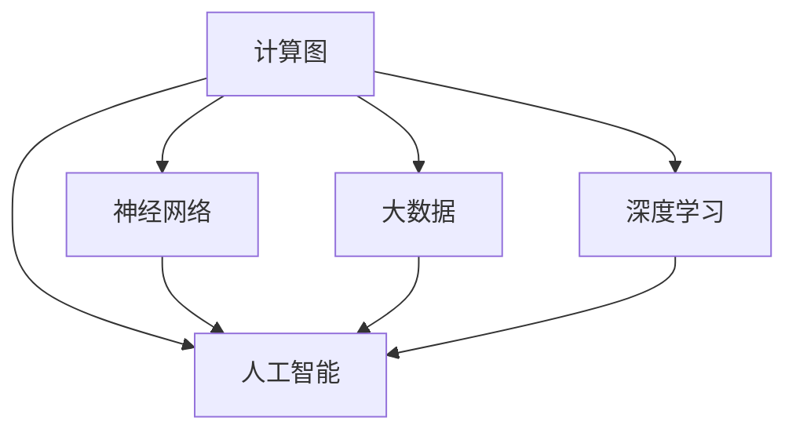

                 

# 释放人类创造力的源泉：人类计算的魅力

> 关键词：人类计算,创造力,人工智能,大数据,深度学习,神经网络,计算图,机器学习

## 1. 背景介绍

### 1.1 问题由来
在信息时代，人类正迎来前所未有的计算革命。从个人电脑的普及，到互联网的诞生，再到移动互联网和物联网的兴起，计算能力不断跨越新高度。这不仅极大提升了人类的生产效率，更带来了广泛的创新潜能。然而，人类计算不仅仅是技术迭代，更是一种深刻的思维变革。

### 1.2 问题核心关键点
要理解人类计算的魅力，我们必须关注几个核心关键点：

- 创造力的激发：人类计算赋予我们前所未有的创新能力，可以重新定义问题，开拓新领域。
- 数据分析的智能：数据驱动的决策成为可能，使我们能够从海量信息中提取智慧，指导行动。
- 多学科的交叉：计算机科学与其他学科（如生物、化学、社会科学等）的交叉融合，催生了新的知识领域。
- 个性化与自适应：通过大数据和机器学习，我们能够定制个性化的体验和推荐，增强用户体验。
- 智能与计算的结合：AI技术正在赋予计算以生命，使机器能够理解、生成和适应人类情感和行为。

### 1.3 问题研究意义
人类计算不仅仅是一个技术概念，更是一种引领未来发展的思维方式。它结合了人类智慧与机器智能，为我们探索未知世界、解决复杂问题提供了新的可能性。通过对人类计算的深入研究，我们可以洞察技术进步对社会、经济、文化等领域的深远影响，推动科技的持续创新。

## 2. 核心概念与联系

### 2.1 核心概念概述

为更好地理解人类计算的内涵和机制，本节将介绍几个关键概念：

- 计算图(Computation Graph)：计算图是一种数据结构，描述了计算过程的依赖关系和数据流向。在深度学习中，计算图通常以神经网络的形式呈现。
- 神经网络(Neural Network)：由大量人工神经元构成的计算模型，通过多层非线性变换实现复杂数据的抽象与表示。
- 大数据(Big Data)：指的是大规模、高复杂性的数据集，无法在传统计算机上处理。大数据分析依赖分布式计算和机器学习算法，从海量数据中提取有价值的信息。
- 深度学习(Deep Learning)：一种基于神经网络的机器学习技术，通过多层次的数据抽象实现对复杂模式的识别与学习。
- 人工智能(Artificial Intelligence)：使计算机模拟人类智能的行为，能够进行感知、学习、推理、规划等复杂任务。

这些核心概念之间的逻辑关系可以通过以下Mermaid流程图来展示：



这个流程图展示了几大核心概念之间的关联：

1. 计算图是神经网络的基础，通过计算图描述神经网络的计算过程。
2. 大数据为深度学习提供数据源，使得深度学习模型可以从海量数据中提取有效信息。
3. 深度学习是实现人工智能的核心技术，通过多层非线性变换实现对复杂模式的学习。
4. 人工智能应用广泛，涵盖语音识别、图像处理、自然语言处理等多个领域。

## 3. 核心算法原理 & 具体操作步骤
### 3.1 算法原理概述

人类计算的核心在于将人类的创造力与机器的计算能力相结合，通过数据和算法驱动创新。核心思想是：利用计算图和神经网络对海量数据进行智能分析，从中提炼出有用信息，以辅助人类决策和行动。

具体地，人类计算的过程可以分以下几个步骤：

1. 数据收集与处理：收集不同来源的数据，包括结构化数据、非结构化数据等，并进行清洗、转换和存储。
2. 模型训练与调优：基于计算图和神经网络构建深度学习模型，在标注数据上训练和调优，优化模型性能。
3. 推理与预测：使用训练好的模型对新数据进行推理与预测，输出有用的信息或决策。
4. 反馈与迭代：根据模型预测结果和实际效果，调整模型参数和策略，实现迭代优化。

### 3.2 算法步骤详解

下面详细描述一下人类计算的具体操作步骤：

**Step 1: 数据收集与预处理**
- 收集来自不同渠道的数据，如社交媒体、传感器、文本文档等。
- 清洗和转换数据，去除噪音和异常值，确保数据质量。
- 存储和管理数据，使用分布式文件系统（如Hadoop、Spark等）进行高效存储和查询。

**Step 2: 计算图构建与模型训练**
- 根据具体问题定义计算图，构建深度学习模型，选择适当的神经网络结构（如CNN、RNN、Transformer等）。
- 在标注数据上训练模型，使用交叉熵、均方误差等损失函数优化模型参数。
- 进行模型调优，调整超参数，如学习率、批大小、迭代轮数等。

**Step 3: 推理与预测**
- 使用训练好的模型对新数据进行推理与预测，生成结果。
- 对预测结果进行评估，如准确率、召回率、F1分数等。
- 将推理与预测结果应用于实际问题，如客户推荐、智能客服、市场分析等。

**Step 4: 反馈与迭代**
- 根据预测结果和实际效果，调整模型和策略。
- 持续收集新数据，重新训练模型，实现模型迭代优化。
- 通过A/B测试等方法，验证改进效果，确保模型性能持续提升。

### 3.3 算法优缺点

人类计算方法具有以下优点：
1. 高效性：通过机器自动化计算，大幅提升数据处理和分析效率，降低人力成本。
2. 深度学习模型具有强大的模式识别能力，可以从复杂数据中提取有用信息。
3. 模型可迭代优化，通过不断训练和调优，提升模型性能。
4. 应用广泛，可以应用于各个领域，如金融、医疗、教育、交通等。

同时，也存在一些局限性：
1. 对标注数据依赖较大，标注成本较高。
2. 模型解释性较差，难以理解模型的内部机制。
3. 计算复杂度较高，对计算资源要求高。
4. 模型泛化能力有待提升，对新数据适应性不强。

尽管存在这些局限性，但总体而言，人类计算方法已经在大数据和智能决策领域取得了显著效果，成为推动技术创新的重要驱动力。

### 3.4 算法应用领域

人类计算技术在多个领域得到广泛应用，具体包括：

- 自然语言处理(NLP)：如机器翻译、情感分析、文本分类等。通过深度学习模型对自然语言进行理解和生成。
- 计算机视觉(CV)：如目标检测、图像分割、人脸识别等。利用卷积神经网络(CNN)对图像进行特征提取和分类。
- 语音识别(Speech Recognition)：如自动语音转写、语音情感分析等。通过循环神经网络(RNN)对语音进行特征提取和识别。
- 推荐系统(Recommendation Systems)：如电商推荐、新闻推荐、视频推荐等。利用协同过滤、深度学习等技术，预测用户兴趣，提供个性化推荐。
- 金融分析(Financial Analysis)：如信用评估、市场预测、风险控制等。通过大数据分析，建立数学模型，进行财务决策。
- 医疗诊断(Medical Diagnosis)：如影像分析、病理诊断、电子病历分析等。利用深度学习模型对医疗图像和文本进行分析和诊断。

除了以上领域，人类计算技术还在智能制造、智慧城市、环境监测、交通管理等多个方面展现出广阔的应用前景。

## 4. 数学模型和公式 & 详细讲解  
### 4.1 数学模型构建

人类计算的核心数学模型是深度学习，以神经网络为基础，通过多层次的数据抽象，实现对复杂模式的识别与学习。

假设神经网络模型为 $M(x; \theta)$，其中 $x$ 为输入数据，$\theta$ 为模型参数。神经网络由多个层构成，每一层的输出作为下一层的输入。

常见的神经网络结构包括：

- 全连接神经网络(FCN)：每一层神经元都与下一层的所有神经元相连。
- 卷积神经网络(CNN)：通过卷积操作提取图像局部特征。
- 循环神经网络(RNN)：通过循环连接处理时间序列数据。
- 变换器(Transformer)：通过自注意力机制进行序列建模。

这些神经网络结构在不同类型的任务上表现出色，如CNN适用于图像处理，RNN适用于自然语言处理，Transformer适用于序列建模。

### 4.2 公式推导过程

以全连接神经网络为例，推导其前向传播和反向传播的计算公式：

设 $x \in \mathbb{R}^n$ 为输入向量，$W \in \mathbb{R}^{n \times m}$ 为权重矩阵，$b \in \mathbb{R}^m$ 为偏置向量。则前向传播计算为：

$$
h = \sigma(Wx + b)
$$

其中 $\sigma$ 为激活函数，通常使用ReLU或sigmoid。

反向传播计算损失函数对权重矩阵和偏置向量的梯度：

$$
\frac{\partial \mathcal{L}}{\partial W} = \frac{\partial \mathcal{L}}{\partial h} \frac{\partial h}{\partial W}
$$

$$
\frac{\partial \mathcal{L}}{\partial b} = \frac{\partial \mathcal{L}}{\partial h} \frac{\partial h}{\partial b}
$$

其中 $\frac{\partial \mathcal{L}}{\partial h}$ 为损失函数对输出向量的梯度，$\frac{\partial h}{\partial W}$ 和 $\frac{\partial h}{\partial b}$ 分别为权重矩阵和偏置向量对输出向量的偏导数。

### 4.3 案例分析与讲解

以图像分类为例，使用卷积神经网络(CNN)对手写数字进行分类：

假设手写数字图像为 $x \in \mathbb{R}^{28 \times 28}$，神经网络结构如图：

```
input layer (28x28)
convolutional layer (5x5)
pooling layer
convolutional layer (5x5)
pooling layer
fc layer
output layer (10)
```

前向传播计算过程如下：

1. 输入层：将图像展平为向量 $x \in \mathbb{R}^{784}$。
2. 卷积层：使用 $5 \times 5$ 的卷积核进行特征提取，生成特征图。
3. 池化层：通过最大池化操作，降维减少计算量。
4. 全连接层：将特征图展平为向量，与权重矩阵和偏置向量进行线性变换。
5. 输出层：使用softmax激活函数，输出每个数字的概率分布。

使用交叉熵损失函数对模型进行训练，计算公式为：

$$
\mathcal{L} = -\frac{1}{N} \sum_{i=1}^N \sum_{j=1}^{10} y_j \log p_j(x)
$$

其中 $y_j$ 为真实标签，$p_j(x)$ 为模型预测的概率。

## 5. 项目实践：代码实例和详细解释说明
### 5.1 开发环境搭建

在进行人类计算项目实践前，我们需要准备好开发环境。以下是使用Python进行TensorFlow开发的环境配置流程：

1. 安装Anaconda：从官网下载并安装Anaconda，用于创建独立的Python环境。

2. 创建并激活虚拟环境：
```bash
conda create -n tf-env python=3.8 
conda activate tf-env
```

3. 安装TensorFlow：从官网获取对应的安装命令，使用pip安装。例如：
```bash
pip install tensorflow==2.5
```

4. 安装TensorBoard：用于可视化训练过程，需要与TensorFlow版本匹配。

5. 安装numpy、matplotlib等常用库：
```bash
pip install numpy matplotlib
```

完成上述步骤后，即可在`tf-env`环境中开始人类计算项目实践。

### 5.2 源代码详细实现

这里我们以手写数字分类为例，给出使用TensorFlow实现CNN模型的代码实现。

```python
import tensorflow as tf
import numpy as np

# 定义模型
model = tf.keras.models.Sequential([
    tf.keras.layers.Conv2D(32, (3, 3), activation='relu', input_shape=(28, 28, 1)),
    tf.keras.layers.MaxPooling2D((2, 2)),
    tf.keras.layers.Flatten(),
    tf.keras.layers.Dense(10, activation='softmax')
])

# 编译模型
model.compile(optimizer='adam',
              loss=tf.keras.losses.SparseCategoricalCrossentropy(from_logits=True),
              metrics=['accuracy'])

# 训练模型
x_train = np.load('train_images.npy').astype(np.float32) / 255.0
y_train = np.load('train_labels.npy').astype(np.int32)
model.fit(x_train.reshape(-1, 28, 28, 1), y_train, epochs=10, batch_size=32)

# 评估模型
x_test = np.load('test_images.npy').astype(np.float32) / 255.0
y_test = np.load('test_labels.npy').astype(np.int32)
loss, accuracy = model.evaluate(x_test.reshape(-1, 28, 28, 1), y_test)
print(f'Test loss: {loss:.4f}, Test accuracy: {accuracy:.4f}')
```

以上代码实现了手写数字分类任务中的CNN模型训练和评估。可以看到，TensorFlow的高级API使得构建和训练深度学习模型变得非常简单。

### 5.3 代码解读与分析

让我们再详细解读一下关键代码的实现细节：

**模型定义**：
- 使用Sequential模型定义网络结构，包括卷积层、池化层、全连接层和输出层。
- 使用Conv2D实现卷积操作，使用MaxPooling2D实现池化操作，使用Dense实现全连接操作。
- 使用Softmax激活函数作为输出层，将输出转换为概率分布。

**模型编译**：
- 使用Adam优化器，指定交叉熵损失函数，使用准确率作为评估指标。
- 使用SparseCategoricalCrossentropy函数，指定从logits输出概率分布。

**模型训练**：
- 加载训练数据，将图像数据归一化到0-1之间。
- 使用fit函数进行模型训练，指定epoch数和batch大小。

**模型评估**：
- 加载测试数据，同样进行归一化。
- 使用evaluate函数进行模型评估，输出损失和准确率。

## 6. 实际应用场景
### 6.1 智能推荐系统

智能推荐系统是基于人类计算技术的典型应用之一。通过深度学习模型对用户行为数据进行建模，可以生成个性化的商品推荐、新闻推荐、视频推荐等，显著提升用户体验。

以电商推荐为例，可以使用协同过滤、深度学习等技术，建立用户-商品关联矩阵，进行冷启动和实时推荐。具体步骤如下：

1. 收集用户浏览、点击、购买等行为数据。
2. 使用TensorFlow构建深度学习模型，训练并调优。
3. 在新用户注册时，使用模型进行预估，生成推荐列表。
4. 根据用户反馈数据，不断优化模型，提升推荐效果。

### 6.2 医疗影像分析

医疗影像分析是另一个重要应用领域。通过深度学习模型对医学影像进行分析和诊断，可以显著提高医疗效率和准确性。

以乳腺癌检测为例，可以使用卷积神经网络(CNN)对乳腺X光片进行分类，步骤如下：

1. 收集大量乳腺X光片数据，标注为正常和异常。
2. 使用TensorFlow构建CNN模型，在标注数据上进行训练。
3. 在新患者数据上，使用训练好的模型进行分类，输出预测结果。
4. 根据医生反馈，调整模型参数，提升分类准确率。

### 6.3 智能客服系统

智能客服系统是基于人类计算技术的另一个重要应用。通过深度学习模型对客户问题进行理解与回答，可以大幅提高客服效率和质量。

以智能客服聊天机器人为例，可以使用Transformer模型进行对话生成。具体步骤如下：

1. 收集大量的客户问题和客服回答数据。
2. 使用Transformer模型，在标注数据上进行训练。
3. 在新客户问题上，使用模型生成回答。
4. 根据客户反馈，调整模型参数，提升生成质量。

### 6.4 未来应用展望

未来，人类计算技术将在更多领域得到应用，为人类生活带来更多便利与创新。以下是几个潜在的应用方向：

1. 个性化教育：通过深度学习模型分析学生学习行为，提供个性化学习建议。
2. 智能交通：通过深度学习模型分析交通数据，优化交通管理。
3. 环境保护：通过深度学习模型分析环境数据，提出环境保护策略。
4. 金融风控：通过深度学习模型分析交易数据，进行风险控制。
5. 智能制造：通过深度学习模型分析设备数据，优化生产流程。

## 7. 工具和资源推荐
### 7.1 学习资源推荐

为了帮助开发者系统掌握人类计算的理论基础和实践技巧，这里推荐一些优质的学习资源：

1. 《深度学习》课程：斯坦福大学开设的深度学习课程，详细介绍了深度学习的基本概念和经典模型。
2. TensorFlow官方文档：提供了TensorFlow的全面教程，包括模型构建、训练、评估等环节。
3. 《TensorFlow实战》书籍：详细介绍了TensorFlow的使用方法，涵盖模型构建、训练、部署等全流程。
4. Kaggle平台：提供大量数据集和竞赛，可以实践深度学习项目，提升实战能力。
5. arXiv：最新的学术论文资源库，可以跟踪深度学习领域的最新进展。

通过对这些资源的学习实践，相信你一定能够快速掌握人类计算的精髓，并用于解决实际的深度学习问题。

### 7.2 开发工具推荐

高效的开发离不开优秀的工具支持。以下是几款用于深度学习开发的高效工具：

1. TensorFlow：由Google主导开发的深度学习框架，支持多种平台和硬件，生产部署方便。
2. PyTorch：基于Python的开源深度学习框架，灵活易用，适用于研究与实验。
3. Keras：高层次的深度学习API，可以无缝集成TensorFlow和Theano，快速搭建模型。
4. TensorBoard：用于可视化训练过程，可以实时监测模型性能和指标。
5. Google Colab：谷歌提供的在线Jupyter Notebook环境，免费提供GPU/TPU算力，方便实验新模型。

合理利用这些工具，可以显著提升深度学习开发效率，加快创新迭代的步伐。

### 7.3 相关论文推荐

深度学习领域的研究成果层出不穷，以下是几篇奠基性的相关论文，推荐阅读：

1. AlexNet：在2012年ImageNet数据集上取得突破，开启了深度学习时代。
2. ResNet：提出了残差网络结构，解决了深度网络训练中的梯度消失问题。
3. Inception：提出了Inception模块，优化了卷积神经网络结构，提升了模型效率。
4. YOLO：提出了You Only Look Once结构，实时性好，适用于目标检测任务。
5. GAN：生成对抗网络，可以生成逼真的图像、视频等，具有广泛应用前景。

这些论文代表了大数据和深度学习的发展脉络。通过学习这些前沿成果，可以帮助研究者把握学科前进方向，激发更多的创新灵感。

## 8. 总结：未来发展趋势与挑战
### 8.1 研究成果总结

人类计算技术的快速发展，使我们能够从海量数据中提取有用信息，辅助人类决策。通过深度学习模型，我们在自然语言处理、计算机视觉、语音识别等领域取得了显著成果。未来，随着计算能力的提升和数据量的增加，人类计算将进一步拓展应用领域，提升人类生活质量。

### 8.2 未来发展趋势

未来，人类计算技术将呈现以下几个发展趋势：

1. 模型规模持续增大。随着算力成本的下降和数据规模的扩张，深度学习模型的参数量还将持续增长。超大模型具有更强的表征能力，能够处理更复杂的任务。
2. 多模态学习成为热点。深度学习模型将学习不同模态的数据，如视觉、音频、文本等，进行多模态融合，提升任务性能。
3. 自监督学习受到重视。自监督学习方法可以无需标注数据，从数据中学习特征，广泛应用在自然语言处理和计算机视觉等领域。
4. 联邦学习兴起。联邦学习可以在不泄露数据隐私的情况下，进行模型更新和优化，适用于分布式数据环境。
5. 强化学习结合。强化学习方法可以优化模型决策，应用于游戏、机器人等领域。

### 8.3 面临的挑战

尽管人类计算技术已经取得了瞩目成就，但在迈向更加智能化、普适化应用的过程中，它仍面临着诸多挑战：

1. 计算资源瓶颈。超大规模模型和复杂任务需要大量计算资源，现有的计算平台难以支撑。
2. 模型泛化能力不足。深度学习模型对新数据适应性不强，需要更多的先验知识进行指导。
3. 模型可解释性差。深度学习模型通常是"黑盒"系统，难以解释其内部机制。
4. 数据隐私问题。大数据分析涉及大量敏感信息，数据隐私和安全问题亟需解决。
5. 计算效率低下。深度学习模型计算复杂度高，推理速度慢，需要优化算法和硬件。

### 8.4 研究展望

针对人类计算技术面临的挑战，未来的研究需要在以下几个方面寻求新的突破：

1. 开发更高效的模型结构和算法。如模型剪枝、量化加速等技术，降低计算复杂度，提升推理速度。
2. 引入更多先验知识和专家信息。如知识图谱、逻辑规则等，与深度学习模型进行融合，提升模型泛化能力。
3. 加强模型解释性和可解释性研究。如可解释的深度学习、因果推理等方法，增强模型决策的透明性和可理解性。
4. 采用分布式计算和联邦学习技术。通过分布式计算平台和联邦学习，解决计算资源瓶颈和数据隐私问题。

这些研究方向的探索，必将引领人类计算技术迈向更高的台阶，为构建智能决策系统和智慧社会提供有力支持。

## 9. 附录：常见问题与解答

**Q1：深度学习与人类计算有何不同？**

A: 深度学习是人工智能的一个重要分支，基于神经网络模型对复杂数据进行学习，目的是让机器具备类似人类的智能能力。而人类计算则是结合人类的智慧与机器的计算能力，通过数据和算法驱动创新，目标是提升人类的决策能力和创造力。

**Q2：人类计算是否具有普遍适用性？**

A: 人类计算技术在多个领域都取得了显著效果，但不同领域的应用场景不同，需要针对性地设计和优化模型。例如，图像分类任务可以使用CNN模型，自然语言处理任务可以使用RNN或Transformer模型，这些模型需要在不同领域中进行适应性调整。

**Q3：人类计算的应用前景如何？**

A: 人类计算技术具有广阔的应用前景，涵盖自然语言处理、计算机视觉、语音识别、推荐系统等多个领域。随着计算能力的提升和数据量的增加，人类计算将进一步拓展应用范围，提升人类生活质量。

**Q4：如何优化深度学习模型的性能？**

A: 优化深度学习模型的性能可以从多个方面入手：1. 选择适当的模型结构和算法，如CNN、RNN、Transformer等。2. 调整超参数，如学习率、批大小、迭代轮数等。3. 进行数据增强，如回译、近义替换等。4. 采用正则化技术，如L2正则、Dropout等。5. 使用分布式计算和联邦学习技术，提升计算效率和模型泛化能力。

**Q5：深度学习模型的可解释性问题如何解决？**

A: 深度学习模型的可解释性问题是当前研究的热点之一。为了提高模型的可解释性，可以采用可解释的深度学习技术，如LIME、SHAP等，解释模型的决策过程。此外，引入因果推理等方法，也可以增强模型的可解释性。

综上所述，人类计算技术通过结合人类的智慧与机器的计算能力，能够从海量数据中提取有用信息，驱动创新。随着深度学习模型的不断发展，人类计算技术将在更多领域得到应用，推动人类社会的进步与发展。未来，我们需要在模型结构、算法、计算效率、可解释性等方面进行持续优化，以应对挑战，推动技术创新。

---

作者：禅与计算机程序设计艺术 / Zen and the Art of Computer Programming

