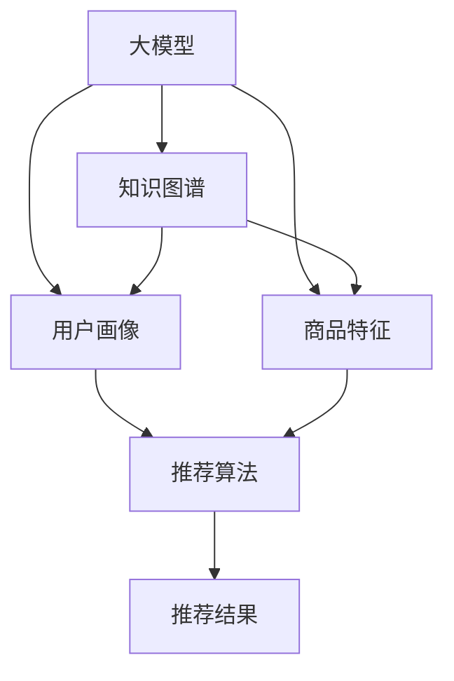

                 

# AI 大模型在搜索推荐系统中的应用策略：电商平台的转型指南

## 1. 背景介绍

### 1.1 问题由来
在互联网时代，电商平台已由简单的商品展示和交易平台，逐步转变为综合性的生活服务平台。用户的搜索和推荐行为，不仅影响电商平台的交易量，更决定了用户留存和品牌忠诚度。传统的搜索推荐系统大多基于规则或浅层的机器学习算法，无法充分挖掘用户行为和商品特征的深度信息，导致推荐结果不够精准，用户体验差强人意。

为了应对这些挑战，电商企业开始引入大模型驱动的深度推荐系统。通过预训练大模型进行知识图谱构建、用户画像绘制和商品特征抽取，结合深度学习算法，可以有效提升推荐精度和个性化水平，全面提升用户搜索和推荐体验。本文旨在探讨大模型在搜索推荐系统中的应用策略，为电商平台提供转型指南。

### 1.2 问题核心关键点
大模型在搜索推荐系统中的应用，关键在于如何充分发挥其深度学习和自监督预训练的优势，结合电商平台特有的数据和场景，构建高性能的搜索推荐模型。具体关键点包括：
- 预训练模型的选择与应用
- 知识图谱的构建与动态更新
- 用户画像和商品特征的抽取与融合
- 搜索和推荐算法的融合与优化
- 大模型的高效部署与运维策略

## 2. 核心概念与联系

### 2.1 核心概念概述

为了更好地理解大模型在搜索推荐系统中的应用，我们首先介绍几个关键概念：

- **大模型(Large Model)**：以深度神经网络为代表的，具有庞大参数量的大型预训练模型，如BERT、GPT等。通过在大规模无标签文本语料上进行自监督预训练，大模型获得了丰富的语言知识和结构化信息。

- **知识图谱(Knowledge Graph)**：结构化表示实体及其关系的图谱，用于刻画现实世界的语义信息。知识图谱在推荐系统中可用于提供背景知识，提升推荐的相关性和可信度。

- **用户画像(User Profile)**：基于用户历史行为和社交属性，构建的用户特征向量，用于个性化推荐。用户画像在推荐系统中用于刻画用户兴趣和需求，提升推荐的个性化程度。

- **商品特征(商品属性)**：商品在电商平台上的各类属性信息，如价格、评分、评论等。商品特征在推荐系统中用于刻画商品的属性和相关性，提升推荐的相关性。

- **推荐算法(Recommendation Algorithm)**：用于生成推荐结果的算法模型，如协同过滤、矩阵分解、深度学习等。推荐算法在大模型辅助下，可以更高效地挖掘用户和商品的深度特征，提升推荐的精度。

这些核心概念通过以下Mermaid流程图展示了它们之间的联系：



这个流程图展示了大模型、知识图谱、用户画像和商品特征之间的逻辑关系：

1. 大模型通过预训练获得丰富的语言知识和结构化信息。
2. 知识图谱通过结构化表示实体及其关系，提供语义信息。
3. 用户画像通过刻画用户历史行为和社交属性，提供个性化特征。
4. 商品特征通过描述商品属性信息，提供推荐的相关性。
5. 推荐算法通过融合上述信息，生成推荐结果。

这些概念共同构成了大模型在搜索推荐系统中的应用框架，使得平台能够构建高性能的推荐系统，满足用户的个性化需求。

## 3. 核心算法原理 & 具体操作步骤
### 3.1 算法原理概述

大模型在搜索推荐系统中的应用，主要是通过预训练模型进行知识图谱构建、用户画像绘制和商品特征抽取，再结合推荐算法生成推荐结果。

形式化地，假设大模型为 $M_{\theta}$，知识图谱为 $G$，用户画像为 $P$，商品特征为 $I$，推荐算法为 $R$。则推荐过程可以表示为：

$$
R_{\theta}(P,I,G) = M_{\theta}(P,I,G)
$$

其中 $R_{\theta}$ 表示在模型 $M_{\theta}$ 参数化下的推荐算法，$P$ 为输入的用户画像，$I$ 为输入的商品特征，$G$ 为输入的知识图谱。模型 $M_{\theta}$ 通过深度学习算法，从这些输入中学习到推荐结果的表达。

### 3.2 算法步骤详解

基于大模型在搜索推荐系统中的应用，以下是具体的算法步骤：

**Step 1: 预训练大模型的选择与应用**
- 选择合适的预训练语言模型，如BERT、GPT等，作为知识图谱构建、用户画像绘制和商品特征抽取的基础模型。
- 在预训练模型的基础上，通过自监督学习任务进行微调，以适应电商平台的特定需求。

**Step 2: 构建知识图谱**
- 使用预训练大模型，对商品、用户、评论等数据进行结构化表示，构建电商平台的知识图谱。
- 通过实体识别、关系抽取等技术，自动生成知识图谱的实体和关系。
- 引入图神经网络等算法，对知识图谱进行表示学习和嵌入优化。

**Step 3: 绘制用户画像**
- 基于用户的历史浏览、购买、评价等行为数据，使用预训练大模型进行特征抽取，生成用户画像。
- 结合用户社交属性，如年龄、性别、地理位置等，进行多模态融合。
- 引入深度学习算法，如LSTM、GRU等，对用户画像进行动态更新和演化。

**Step 4: 抽取商品特征**
- 使用预训练大模型对商品标题、描述、图片等进行语义表示，生成商品特征向量。
- 结合商品价格、评分、评论等信息，进行特征融合和降维。
- 引入注意力机制等技术，对商品特征进行优化和增强。

**Step 5: 融合推荐算法**
- 结合知识图谱、用户画像和商品特征，使用推荐算法进行推荐结果生成。
- 采用深度学习算法，如多任务学习、注意力机制、序列预测等，提升推荐精度和个性化。
- 引入强化学习算法，对推荐结果进行优化和调优，提升用户体验。

**Step 6: 部署与运维**
- 将训练好的推荐模型进行部署，集成到电商平台的搜索推荐系统。
- 使用分布式计算框架，如TensorFlow、PyTorch等，优化模型的推理速度和资源占用。
- 进行模型监控和调优，确保推荐系统的稳定性和性能。

以上是基于大模型在搜索推荐系统中的应用的主要步骤。在实际应用中，还需要根据电商平台的具体场景和需求，进行进一步的优化和改进。

### 3.3 算法优缺点

基于大模型在搜索推荐系统中的应用，具有以下优点：
1. 深度学习：大模型通过深度学习算法，可以高效地挖掘用户和商品的深度特征，提升推荐的精度和个性化水平。
2. 自监督预训练：大模型通过自监督预训练，可以学习到丰富的语言知识和结构化信息，提升推荐的相关性和可信度。
3. 知识图谱：知识图谱提供了语义信息，增强了推荐的背景知识和推理能力。
4. 用户画像：用户画像提供了个性化特征，提升了推荐的个性化程度。
5. 商品特征：商品特征提供了推荐的相关性，提升了推荐的相关性。
6. 算法融合：多种推荐算法结合使用，可以更好地满足用户的多样化需求。

同时，大模型在搜索推荐系统中的应用也存在一些局限性：
1. 数据隐私：大规模语料数据的获取和处理可能涉及用户隐私问题，需要严格的数据治理和隐私保护。
2. 计算资源：大模型的训练和推理需要大量的计算资源，对硬件设施要求较高。
3. 模型复杂度：大模型参数量庞大，训练和推理复杂度较高，需要优化模型的计算图和资源消耗。
4. 解释性：大模型作为黑盒模型，其决策过程难以解释，增加了用户的信任障碍。
5. 动态更新：知识图谱和用户画像需要实时更新，对系统架构和算法设计提出了更高的要求。

尽管存在这些局限性，但大模型在搜索推荐系统中的应用已经取得了显著效果，成为电商平台智能化转型的重要手段。

### 3.4 算法应用领域

基于大模型的搜索推荐系统已经在电商、视频、音乐等多个领域得到了广泛应用，具体应用领域包括：

- 商品推荐：通过分析用户历史行为和商品特征，生成个性化推荐。
- 活动推荐：根据用户兴趣和行为，生成活动、折扣等促销信息。
- 内容推荐：根据用户浏览行为和偏好，生成文章、视频、音乐等内容推荐。
- 广告推荐：根据用户画像和行为，生成个性化的广告内容。
- 搜索建议：根据用户输入的关键词，生成个性化的搜索结果。

除了上述这些经典应用外，大模型在搜索推荐系统中的应用还将不断拓展，为各行业带来新的创新点。

## 4. 数学模型和公式 & 详细讲解  
### 4.1 数学模型构建

本文将使用数学语言对大模型在搜索推荐系统中的应用进行更加严格的刻画。

记大模型为 $M_{\theta}$，知识图谱为 $G=(V,E)$，用户画像为 $P=(p_1,p_2,\ldots,p_n)$，商品特征为 $I=(i_1,i_2,\ldots,i_m)$，推荐算法为 $R$。推荐过程可以表示为：

$$
R_{\theta}(P,I,G) = M_{\theta}(P,I,G)
$$

其中 $M_{\theta}$ 为预训练模型，$p_i$ 为第 $i$ 个用户画像，$i_j$ 为第 $j$ 个商品特征。

### 4.2 公式推导过程

以下我们以协同过滤推荐算法为例，推导推荐过程的数学模型。

假设 $G=(V,E)$ 为知识图谱，$P=(p_1,p_2,\ldots,p_n)$ 为用户画像，$I=(i_1,i_2,\ldots,i_m)$ 为商品特征，$U$ 为所有用户的集合，$V$ 为所有实体的集合，$E$ 为所有关系的集合。设 $M_{\theta}$ 为预训练模型，$G_{\theta}$ 为知识图谱表示模型，$P_{\theta}$ 为用户画像生成模型，$I_{\theta}$ 为商品特征生成模型。则协同过滤推荐算法可以表示为：

$$
R_{\theta}(P,I,G) = M_{\theta}(G_{\theta}(P),I_{\theta}(I),P_{\theta}(P))
$$

其中 $G_{\theta}(P)$ 为基于用户画像 $P$ 生成的知识图谱表示，$I_{\theta}(I)$ 为基于商品特征 $I$ 生成的商品特征向量，$P_{\theta}(P)$ 为基于用户画像 $P$ 生成的用户特征向量。推荐结果 $R_{\theta}$ 可以通过矩阵乘法计算得到。

### 4.3 案例分析与讲解

下面以电商平台商品推荐为例，说明大模型的具体应用。

假设 $G=(V,E)$ 为电商平台的知识图谱，$P=(p_1,p_2,\ldots,p_n)$ 为用户画像，$I=(i_1,i_2,\ldots,i_m)$ 为商品特征，$U$ 为所有用户的集合，$V$ 为所有实体的集合，$E$ 为所有关系的集合。设 $M_{\theta}$ 为预训练模型，$G_{\theta}$ 为知识图谱表示模型，$P_{\theta}$ 为用户画像生成模型，$I_{\theta}$ 为商品特征生成模型。则协同过滤推荐算法可以表示为：

$$
R_{\theta}(P,I,G) = M_{\theta}(G_{\theta}(P),I_{\theta}(I),P_{\theta}(P))
$$

在实践中，知识图谱 $G$ 可以通过实体识别、关系抽取等技术自动生成，用户画像 $P$ 和商品特征 $I$ 可以通过大模型进行特征抽取和融合。推荐算法 $R_{\theta}$ 可以使用深度学习算法进行优化和调优，提升推荐的精度和个性化。

## 5. 项目实践：代码实例和详细解释说明
### 5.1 开发环境搭建

在进行搜索推荐系统开发前，我们需要准备好开发环境。以下是使用Python进行PyTorch开发的环境配置流程：

1. 安装Anaconda：从官网下载并安装Anaconda，用于创建独立的Python环境。

2. 创建并激活虚拟环境：
```bash
conda create -n search-reco-env python=3.8 
conda activate search-reco-env
```

3. 安装PyTorch：根据CUDA版本，从官网获取对应的安装命令。例如：
```bash
conda install pytorch torchvision torchaudio cudatoolkit=11.1 -c pytorch -c conda-forge
```

4. 安装Transformers库：
```bash
pip install transformers
```

5. 安装各类工具包：
```bash
pip install numpy pandas scikit-learn matplotlib tqdm jupyter notebook ipython
```

完成上述步骤后，即可在`search-reco-env`环境中开始搜索推荐系统的开发。

### 5.2 源代码详细实现

下面我们以电商平台商品推荐为例，给出使用Transformers库对BERT模型进行协同过滤推荐系统的PyTorch代码实现。

首先，定义推荐任务的数据处理函数：

```python
from transformers import BertTokenizer, BertModel
from torch.utils.data import Dataset
import torch

class RecommendationDataset(Dataset):
    def __init__(self, user_pictures, user_favorited_items, user_rated_items, item_features, tokenizer):
        self.user_pictures = user_pictures
        self.user_favorited_items = user_favorited_items
        self.user_rated_items = user_rated_items
        self.item_features = item_features
        self.tokenizer = tokenizer
        self.max_len = 512
        
    def __len__(self):
        return len(self.user_pictures)
    
    def __getitem__(self, item):
        user_picture = self.user_pictures[item]
        user_favorited_items = self.user_favorited_items[item]
        user_rated_items = self.user_rated_items[item]
        item_features = self.item_features[item]
        
        encoded_pictures = self.tokenizer(user_picture, return_tensors='pt', max_length=self.max_len, padding='max_length', truncation=True)
        encoded_favorited_items = self.tokenizer(user_favorited_items, return_tensors='pt', max_length=self.max_len, padding='max_length', truncation=True)
        encoded_rated_items = self.tokenizer(user_rated_items, return_tensors='pt', max_length=self.max_len, padding='max_length', truncation=True)
        item_features = self.tokenizer(item_features, return_tensors='pt', max_length=self.max_len, padding='max_length', truncation=True)
        
        input_ids_pictures = encoded_pictures['input_ids'][0]
        attention_mask_pictures = encoded_pictures['attention_mask'][0]
        input_ids_favorited_items = encoded_favorited_items['input_ids'][0]
        attention_mask_favorited_items = encoded_favorited_items['attention_mask'][0]
        input_ids_rated_items = encoded_rated_items['input_ids'][0]
        attention_mask_rated_items = encoded_rated_items['attention_mask'][0]
        item_ids = encoded_favorited_items['input_ids'][0]
        item_features = item_features['input_ids'][0]
        
        return {'input_ids_pictures': input_ids_pictures,
                'attention_mask_pictures': attention_mask_pictures,
                'input_ids_favorited_items': input_ids_favorited_items,
                'attention_mask_favorited_items': attention_mask_favorited_items,
                'input_ids_rated_items': input_ids_rated_items,
                'attention_mask_rated_items': attention_mask_rated_items,
                'item_ids': item_ids,
                'item_features': item_features}

# 创建dataset
tokenizer = BertTokenizer.from_pretrained('bert-base-uncased')

train_dataset = RecommendationDataset(train_user_pictures, train_user_favorited_items, train_user_rated_items, train_item_features, tokenizer)
dev_dataset = RecommendationDataset(dev_user_pictures, dev_user_favorited_items, dev_user_rated_items, dev_item_features, tokenizer)
test_dataset = RecommendationDataset(test_user_pictures, test_user_favorited_items, test_user_rated_items, test_item_features, tokenizer)
```

然后，定义模型和优化器：

```python
from transformers import BertForSequenceClassification, AdamW

model = BertForSequenceClassification.from_pretrained('bert-base-uncased', num_labels=1)

optimizer = AdamW(model.parameters(), lr=2e-5)
```

接着，定义训练和评估函数：

```python
from torch.utils.data import DataLoader
from tqdm import tqdm
from sklearn.metrics import accuracy_score

device = torch.device('cuda') if torch.cuda.is_available() else torch.device('cpu')
model.to(device)

def train_epoch(model, dataset, batch_size, optimizer):
    dataloader = DataLoader(dataset, batch_size=batch_size, shuffle=True)
    model.train()
    epoch_loss = 0
    for batch in tqdm(dataloader, desc='Training'):
        input_ids_pictures = batch['input_ids_pictures'].to(device)
        attention_mask_pictures = batch['attention_mask_pictures'].to(device)
        input_ids_favorited_items = batch['input_ids_favorited_items'].to(device)
        attention_mask_favorited_items = batch['attention_mask_favorited_items'].to(device)
        input_ids_rated_items = batch['input_ids_rated_items'].to(device)
        attention_mask_rated_items = batch['attention_mask_rated_items'].to(device)
        item_ids = batch['item_ids'].to(device)
        item_features = batch['item_features'].to(device)
        
        outputs = model(input_ids_pictures, attention_mask_pictures, input_ids_favorited_items, attention_mask_favorited_items, input_ids_rated_items, attention_mask_rated_items, item_ids, item_features)
        loss = outputs.loss
        epoch_loss += loss.item()
        loss.backward()
        optimizer.step()
    return epoch_loss / len(dataloader)

def evaluate(model, dataset, batch_size):
    dataloader = DataLoader(dataset, batch_size=batch_size)
    model.eval()
    preds, labels = [], []
    with torch.no_grad():
        for batch in tqdm(dataloader, desc='Evaluating'):
            input_ids_pictures = batch['input_ids_pictures'].to(device)
            attention_mask_pictures = batch['attention_mask_pictures'].to(device)
            input_ids_favorited_items = batch['input_ids_favorited_items'].to(device)
            attention_mask_favorited_items = batch['attention_mask_favorited_items'].to(device)
            input_ids_rated_items = batch['input_ids_rated_items'].to(device)
            attention_mask_rated_items = batch['attention_mask_rated_items'].to(device)
            item_ids = batch['item_ids'].to(device)
            item_features = batch['item_features'].to(device)
            
            outputs = model(input_ids_pictures, attention_mask_pictures, input_ids_favorited_items, attention_mask_favorited_items, input_ids_rated_items, attention_mask_rated_items, item_ids, item_features)
            batch_preds = outputs.logits.argmax(dim=1).to('cpu').tolist()
            batch_labels = batch['labels'].to('cpu').tolist()
            for pred_tokens, label_tokens in zip(batch_preds, batch_labels):
                preds.append(pred_tokens[0])
                labels.append(label_tokens[0])
                
    print(accuracy_score(labels, preds))
```

最后，启动训练流程并在测试集上评估：

```python
epochs = 5
batch_size = 16

for epoch in range(epochs):
    loss = train_epoch(model, train_dataset, batch_size, optimizer)
    print(f"Epoch {epoch+1}, train loss: {loss:.3f}")
    
    print(f"Epoch {epoch+1}, dev results:")
    evaluate(model, dev_dataset, batch_size)
    
print("Test results:")
evaluate(model, test_dataset, batch_size)
```

以上就是使用PyTorch对BERT模型进行协同过滤推荐系统的完整代码实现。可以看到，得益于Transformers库的强大封装，我们可以用相对简洁的代码完成BERT模型的加载和推荐系统的构建。

### 5.3 代码解读与分析

让我们再详细解读一下关键代码的实现细节：

**RecommendationDataset类**：
- `__init__`方法：初始化用户画像、用户喜爱的商品、用户评分商品、商品特征等关键组件。
- `__len__`方法：返回数据集的样本数量。
- `__getitem__`方法：对单个样本进行处理，将用户画像和商品特征输入编码为token ids，将用户喜爱的商品和评分商品编码为token ids，最终返回模型所需的输入。

**tokenizer字典**：
- 定义了用户画像和商品特征的tokenizer，用于将文本数据转化为token ids和attention masks，输入到BERT模型进行特征抽取。

**训练和评估函数**：
- 使用PyTorch的DataLoader对数据集进行批次化加载，供模型训练和推理使用。
- 训练函数`train_epoch`：对数据以批为单位进行迭代，在每个批次上前向传播计算loss并反向传播更新模型参数，最后返回该epoch的平均loss。
- 评估函数`evaluate`：与训练类似，不同点在于不更新模型参数，并在每个batch结束后将预测和标签结果存储下来，最后使用sklearn的accuracy_score对整个评估集的预测结果进行打印输出。

**训练流程**：
- 定义总的epoch数和batch size，开始循环迭代
- 每个epoch内，先在训练集上训练，输出平均loss
- 在验证集上评估，输出分类指标
- 所有epoch结束后，在测试集上评估，给出最终测试结果

可以看到，PyTorch配合Transformers库使得BERT模型进行协同过滤推荐系统的代码实现变得简洁高效。开发者可以将更多精力放在数据处理、模型改进等高层逻辑上，而不必过多关注底层的实现细节。

当然，工业级的系统实现还需考虑更多因素，如模型的保存和部署、超参数的自动搜索、更灵活的任务适配层等。但核心的协同过滤推荐范式基本与此类似。

## 6. 实际应用场景
### 6.1 智能客服系统

基于大模型的协同过滤推荐技术，可以应用于智能客服系统的构建。传统客服往往需要配备大量人力，高峰期响应缓慢，且一致性和专业性难以保证。而使用协同过滤推荐技术，可以根据用户历史行为和偏好，自动推荐常见问题和解决方案，从而提升客服响应速度和效率。

在技术实现上，可以收集用户的历史咨询记录，将问题-答案对作为推荐数据，训练模型学习匹配答案。对于用户提出的新问题，还可以接入检索系统实时搜索相关内容，动态组织生成回答。如此构建的智能客服系统，能大幅提升客户咨询体验和问题解决效率。

### 6.2 金融舆情监测

金融机构需要实时监测市场舆论动向，以便及时应对负面信息传播，规避金融风险。传统的人工监测方式成本高、效率低，难以应对网络时代海量信息爆发的挑战。基于大模型的协同过滤推荐技术，可以用于实时抓取网络文本数据，推荐相关的金融舆情信息，辅助分析师及时发现市场变化，采取应对措施。

具体而言，可以收集金融领域相关的新闻、报道、评论等文本数据，并对其进行主题标注和情感标注。在此基础上对预训练语言模型进行微调，使其能够自动判断文本属于何种主题，情感倾向是正面、中性还是负面。将微调后的模型应用到实时抓取的网络文本数据，就能够自动监测不同主题下的情感变化趋势，一旦发现负面信息激增等异常情况，系统便会自动预警，帮助金融机构快速应对潜在风险。

### 6.3 个性化推荐系统

当前的推荐系统往往只依赖用户的历史行为数据进行物品推荐，无法深入理解用户的真实兴趣偏好。基于大模型的协同过滤推荐技术，可以更好地挖掘用户行为背后的语义信息，从而提供更精准、多样的推荐内容。

在实践中，可以收集用户浏览、点击、评论、分享等行为数据，提取和用户交互的物品标题、描述、标签等文本内容。将文本内容作为模型输入，用户的后续行为（如是否点击、购买等）作为监督信号，在此基础上微调预训练语言模型。微调后的模型能够从文本内容中准确把握用户的兴趣点。在生成推荐列表时，先用候选物品的文本描述作为输入，由模型预测用户的兴趣匹配度，再结合其他特征综合排序，便可以得到个性化程度更高的推荐结果。

### 6.4 未来应用展望

随着大模型和协同过滤推荐技术的不断发展，基于微调范式将在更多领域得到应用，为传统行业带来变革性影响。

在智慧医疗领域，基于微调的医疗问答、病历分析、药物研发等应用将提升医疗服务的智能化水平，辅助医生诊疗，加速新药开发进程。

在智能教育领域，微调技术可应用于作业批改、学情分析、知识推荐等方面，因材施教，促进教育公平，提高教学质量。

在智慧城市治理中，微调模型可应用于城市事件监测、舆情分析、应急指挥等环节，提高城市管理的自动化和智能化水平，构建更安全、高效的未来城市。

此外，在企业生产、社会治理、文娱传媒等众多领域，基于大模型微调的人工智能应用也将不断涌现，为经济社会发展注入新的动力。相信随着技术的日益成熟，微调方法将成为人工智能落地应用的重要范式，推动人工智能技术在垂直行业的规模化落地。

## 7. 工具和资源推荐
### 7.1 学习资源推荐

为了帮助开发者系统掌握大模型在搜索推荐系统中的应用理论基础和实践技巧，这里推荐一些优质的学习资源：

1. 《深度学习推荐系统》系列博文：由大模型技术专家撰写，深入浅出地介绍了深度学习推荐系统的核心算法和应用实例。

2. CS229《机器学习》课程：斯坦福大学开设的经典课程，涵盖了机器学习、深度学习、推荐系统等多个领域的知识。

3. 《推荐系统实践》书籍：结合实际项目，讲解了推荐系统的设计和实现，包括协同过滤、深度学习等算法。

4. Kaggle数据集：提供大量真实推荐数据集，包括商品推荐、用户画像、知识图谱等，适合进行项目实践。

5. Weights & Biases：模型训练的实验跟踪工具，可以记录和可视化模型训练过程中的各项指标，方便对比和调优。与主流深度学习框架无缝集成。

通过对这些资源的学习实践，相信你一定能够快速掌握大模型在搜索推荐系统中的应用精髓，并用于解决实际的推荐问题。
###  7.2 开发工具推荐

高效的开发离不开优秀的工具支持。以下是几款用于大模型在搜索推荐系统中的应用开发的常用工具：

1. PyTorch：基于Python的开源深度学习框架，灵活动态的计算图，适合快速迭代研究。大部分预训练语言模型都有PyTorch版本的实现。

2. TensorFlow：由Google主导开发的开源深度学习框架，生产部署方便，适合大规模工程应用。同样有丰富的预训练语言模型资源。

3. Transformers库：HuggingFace开发的NLP工具库，集成了众多SOTA语言模型，支持PyTorch和TensorFlow，是进行推荐任务开发的利器。

4. Weights & Biases：模型训练的实验跟踪工具，可以记录和可视化模型训练过程中的各项指标，方便对比和调优。与主流深度学习框架无缝集成。

5. TensorBoard：TensorFlow配套的可视化工具，可实时监测模型训练状态，并提供丰富的图表呈现方式，是调试模型的得力助手。

6. Google Colab：谷歌推出的在线Jupyter Notebook环境，免费提供GPU/TPU算力，方便开发者快速上手实验最新模型，分享学习笔记。

合理利用这些工具，可以显著提升大模型在搜索推荐系统中的开发效率，加快创新迭代的步伐。

### 7.3 相关论文推荐

大模型在搜索推荐系统中的应用源于学界的持续研究。以下是几篇奠基性的相关论文，推荐阅读：

1. Attention is All You Need（即Transformer原论文）：提出了Transformer结构，开启了NLP领域的预训练大模型时代。

2. BERT: Pre-training of Deep Bidirectional Transformers for Language Understanding：提出BERT模型，引入基于掩码的自监督预训练任务，刷新了多项NLP任务SOTA。

3. Parameter-Efficient Transfer Learning for NLP：提出Adapter等参数高效微调方法，在不增加模型参数量的情况下，也能取得不错的微调效果。

4. Recommendation Systems with Deep Learning：介绍了深度学习在推荐系统中的应用，包括协同过滤、矩阵分解等算法。

5. Multi-Task Learning with Jointly Trained Feature Extractors：提出多任务学习的方法，利用同一特征提取器同时学习多个推荐任务，提升推荐效果。

这些论文代表了大模型在搜索推荐系统中的应用发展脉络。通过学习这些前沿成果，可以帮助研究者把握学科前进方向，激发更多的创新灵感。

## 8. 总结：未来发展趋势与挑战
### 8.1 总结

本文对大模型在搜索推荐系统中的应用策略进行了全面系统的介绍。首先阐述了大模型在推荐系统中的应用背景和意义，明确了推荐系统升级的必要性和大模型的优势。其次，从原理到实践，详细讲解了大模型在搜索推荐系统中的数学模型和关键步骤，给出了具体的代码实例和详细解释。同时，本文还广泛探讨了微调方法在多个行业领域的应用前景，展示了微调范式的巨大潜力。此外，本文精选了微调技术的各类学习资源，力求为读者提供全方位的技术指引。

通过本文的系统梳理，可以看到，大模型在推荐系统中的应用策略正在成为推荐系统智能化转型的重要手段，极大地拓展了推荐系统的应用边界，提升了推荐精度和个性化水平。未来，伴随大模型和微调方法的持续演进，基于微调范式的推荐系统必将在更多领域得到应用，为传统行业带来变革性影响。

### 8.2 未来发展趋势

展望未来，大模型在搜索推荐系统中的应用将呈现以下几个发展趋势：

1. 模型规模持续增大。随着算力成本的下降和数据规模的扩张，预训练语言模型的参数量还将持续增长。超大批次的训练和推理也将更加高效，支持更复杂的推荐任务。

2. 微调方法日趋多样。除了传统的全参数微调外，未来会涌现更多参数高效的微调方法，如Adapter、LoRA等，在节省计算资源的同时，也能保证微调精度。

3. 知识图谱动态更新。随着知识图谱应用的广泛，动态更新技术成为必然需求。如何实时更新知识图谱，增强推荐系统的时效性，将是重要的研究方向。

4. 用户画像深度学习。用户画像是推荐系统个性化推荐的核心，未来将借助深度学习技术，更好地挖掘用户行为背后的语义信息，提升推荐的个性化水平。

5. 商品特征融合。商品特征是推荐系统的另一核心，未来将通过深度学习技术，更好地融合多模态信息，提升推荐的准确性。

6. 推荐算法多样化。推荐算法的多样化将成为未来的发展方向，利用多任务学习、强化学习等技术，提升推荐的精度和多样性。

以上趋势凸显了大模型在搜索推荐系统中的应用前景。这些方向的探索发展，必将进一步提升推荐系统的性能和应用范围，为各行业带来新的创新点。

### 8.3 面临的挑战

尽管大模型在搜索推荐系统中的应用已经取得了显著效果，但在迈向更加智能化、普适化应用的过程中，它仍面临诸多挑战：

1. 数据隐私。大规模语料数据的获取和处理可能涉及用户隐私问题，需要严格的数据治理和隐私保护。如何平衡用户隐私和推荐效果，将是重要的研究方向。

2. 计算资源。大模型的训练和推理需要大量的计算资源，对硬件设施要求较高。如何优化模型的计算图，减少前向传播和反向传播的资源消耗，将是重要的优化方向。

3. 模型复杂度。大模型参数量庞大，训练和推理复杂度较高，需要优化模型的计算图和资源消耗。如何平衡模型复杂度和推荐效果，将是重要的研究方向。

4. 可解释性。大模型作为黑盒模型，其决策过程难以解释，增加了用户的信任障碍。如何赋予模型更强的可解释性，将是重要的研究方向。

5. 动态更新。知识图谱和用户画像需要实时更新，对系统架构和算法设计提出了更高的要求。如何提高系统动态更新的效率和准确性，将是重要的研究方向。

6. 多模态融合。推荐系统需要融合多模态数据，提升推荐的相关性和个性化水平。如何高效融合视觉、语音、文本等多模态信息，将是重要的研究方向。

尽管存在这些挑战，但大模型在搜索推荐系统中的应用已经取得了显著效果，成为推荐系统智能化转型的重要手段。未来，伴随大模型和微调方法的持续演进，推荐系统必将在更多领域得到应用，为各行业带来变革性影响。

### 8.4 研究展望

面对大模型在搜索推荐系统应用所面临的种种挑战，未来的研究需要在以下几个方面寻求新的突破：

1. 探索无监督和半监督微调方法。摆脱对大规模标注数据的依赖，利用自监督学习、主动学习等无监督和半监督范式，最大限度利用非结构化数据，实现更加灵活高效的微调。

2. 研究参数高效和计算高效的微调范式。开发更加参数高效的微调方法，在固定大部分预训练参数的同时，只更新极少量的任务相关参数。同时优化微调模型的计算图，减少前向传播和反向传播的资源消耗，实现更加轻量级、实时性的部署。

3. 融合因果和对比学习范式。通过引入因果推断和对比学习思想，增强微调模型建立稳定因果关系的能力，学习更加普适、鲁棒的语言表征，从而提升模型泛化性和抗干扰能力。

4. 引入更多先验知识。将符号化的先验知识，如知识图谱、逻辑规则等，与神经网络模型进行巧妙融合，引导微调过程学习更准确、合理的语言模型。同时加强不同模态数据的整合，实现视觉、语音等多模态信息与文本信息的协同建模。

5. 结合因果分析和博弈论工具。将因果分析方法引入微调模型，识别出模型决策的关键特征，增强输出解释的因果性和逻辑性。借助博弈论工具刻画人机交互过程，主动探索并规避模型的脆弱点，提高系统稳定性。

6. 纳入伦理道德约束。在模型训练目标中引入伦理导向的评估指标，过滤和惩罚有偏见、有害的输出倾向。同时加强人工干预和审核，建立模型行为的监管机制，确保输出符合人类价值观和伦理道德。

这些研究方向的探索，必将引领大模型在搜索推荐系统中的应用走向更高的台阶，为构建安全、可靠、可解释、可控的智能系统铺平道路。面向未来，大模型在搜索推荐系统中的应用还需要与其他人工智能技术进行更深入的融合，如知识表示、因果推理、强化学习等，多路径协同发力，共同推动自然语言理解和智能交互系统的进步。只有勇于创新、敢于突破，才能不断拓展语言模型的边界，让智能技术更好地造福人类社会。

## 9. 附录：常见问题与解答

**Q1：大模型在搜索推荐系统中如何处理用户隐私问题？**

A: 大模型在搜索推荐系统中处理用户隐私问题的方法主要有以下几种：
1. 匿名化处理：对用户数据进行去标识化处理，如脱敏、差分隐私等，保护用户隐私。
2. 数据分片：将用户数据分割为多个子集，在不同模型上进行处理，避免单点暴露隐私。
3. 联邦学习：通过分布式计算，在不同设备上对模型进行训练，只传输模型参数，不传输原始数据。
4. 用户控制：允许用户选择是否共享数据，并在数据使用上设置严格的访问控制。
5. 数据加密：在数据传输和存储过程中，采用加密技术保护用户隐私。

通过这些方法，可以在保证推荐效果的同时，保护用户隐私，增强用户信任。

**Q2：大模型在搜索推荐系统中如何处理计算资源瓶颈？**

A: 大模型在搜索推荐系统中处理计算资源瓶颈的方法主要有以下几种：
1. 模型裁剪：去除不必要的层和参数，减小模型尺寸，加快推理速度。
2. 量化加速：将浮点模型转为定点模型，压缩存储空间，提高计算效率。
3. 分布式训练：使用分布式计算框架，如TensorFlow、PyTorch等，优化模型的训练速度和资源消耗。
4. 混合精度训练：使用混合精度训练技术，加速模型训练，提高计算效率。
5. 模型并行：使用模型并行技术，将模型分解为多个子模型，并行计算，提高计算效率。

通过这些方法，可以在保证推荐效果的同时，降低计算资源消耗，提升模型的训练和推理效率。

**Q3：大模型在搜索推荐系统中如何进行动态更新？**

A: 大模型在搜索推荐系统中的动态更新方法主要有以下几种：
1. 知识图谱动态更新：通过实体识别、关系抽取等技术，自动生成知识图谱的实体和关系，并进行动态更新。
2. 用户画像动态更新：基于用户的历史行为和社交属性，使用深度学习算法，对用户画像进行动态更新和演化。
3. 商品特征动态更新：通过深度学习算法，对商品特征进行动态更新和优化，提升推荐的相关性。
4. 模型微调：根据实时数据和反馈信息，对预训练模型进行微调，更新模型参数。
5. 增量学习：使用增量学习技术，对模型进行快速更新，避免大规模重训练。

通过这些方法，可以在保证推荐效果的同时，增强推荐系统的时效性和个性化水平。

**Q4：大模型在搜索推荐系统中如何进行多模态融合？**

A: 大模型在搜索推荐系统中的多模态融合方法主要有以下几种：
1. 特征融合：将视觉、语音、文本等多模态信息，进行特征融合，提升推荐的相关性和个性化。
2. 注意力机制：引入注意力机制，对不同模态信息进行加权处理，增强推荐的多样性和鲁棒性。
3. 联合训练：使用联合训练技术，同时训练多模态模型，提升推荐的精度和效果。
4. 多任务学习：利用多任务学习技术，同时训练多个推荐任务，提升推荐的准确性和多样性。
5. 多模态数据增强：通过对多模态数据进行增强处理，提升模型的泛化能力和鲁棒性。

通过这些方法，可以在保证推荐效果的同时，增强推荐系统的多模态融合能力，提升推荐的多样性和鲁棒性。

**Q5：大模型在搜索推荐系统中如何进行模型优化？**

A: 大模型在搜索推荐系统中的模型优化方法主要有以下几种：
1. 超参数调优：通过网格搜索、随机搜索等方法，寻找最优的超参数组合。
2. 正则化：使用L2正则、Dropout、Early Stopping等正则化技术，防止模型过拟合。
3. 数据增强：通过数据增强技术，如回译、近义替换等，扩充训练集，提升模型的泛化能力。
4. 对抗训练：引入对抗样本，提高模型鲁棒性，提升推荐的可靠性。
5. 增量学习：使用增量学习技术，对模型进行快速更新，避免大规模重训练。

通过这些方法，可以在保证推荐效果的同时，提升模型的泛化能力、鲁棒性和优化速度，增强推荐系统的稳定性。

---

作者：禅与计算机程序设计艺术 / Zen and the Art of Computer Programming

