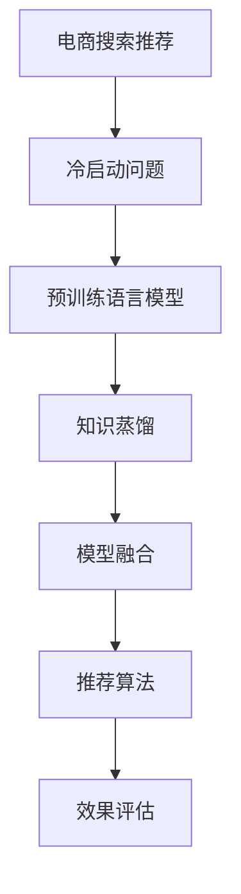

                 

# AI 大模型在电商搜索推荐中的冷启动策略：应对新用户与数据不足

> 关键词：电商搜索推荐,冷启动策略,新用户,数据不足,大模型,预训练,知识蒸馏,模型融合,推荐算法,效果评估,人工智能

## 1. 背景介绍

### 1.1 问题由来

随着电子商务的迅猛发展，用户在线购物的需求日益增长，搜索推荐系统成为电商平台的核心竞争力。它不仅能够提升用户体验，还能显著增加平台转化率和销售额。然而，对于新用户，尤其是首次访问的冷启动用户，推荐系统往往面临诸多挑战：

1. **用户行为数据缺乏**：新用户没有历史行为记录，推荐系统无法根据其过往行为进行推荐。
2. **缺乏个性化需求**：由于缺乏数据，推荐系统无法准确捕捉新用户的兴趣和偏好。
3. **推荐系统泛化性差**：由于模型训练数据不足，推荐系统在新用户的推荐效果上容易发生偏差。

因此，如何在新用户访问初期提供有效的推荐服务，成为电商推荐系统亟待解决的问题。基于AI大模型，特别是预训练语言模型（如BERT、GPT等）的技术进展，为应对新用户与数据不足问题提供了新的解决途径。

### 1.2 问题核心关键点

当前，AI大模型在电商搜索推荐中的应用主要集中在以下关键点：

- **预训练语言模型的应用**：利用预训练语言模型在大规模无标签文本数据上进行训练，学习通用语言表征。
- **知识蒸馏技术**：通过知识蒸馏技术，将预训练模型的知识迁移到特定任务模型中。
- **模型融合**：将不同模型进行融合，提升推荐系统的整体性能。
- **推荐算法创新**：结合用户行为数据与AI模型输出，设计创新的推荐算法。
- **效果评估指标**：定义适用的评估指标，如点击率、转化率、用户满意度等。

这些关键点共同构成了AI大模型在电商搜索推荐中的应用框架，使其能够在不同用户访问初期提供个性化、高效、准确的推荐服务。

## 2. 核心概念与联系

### 2.1 核心概念概述

为更好地理解AI大模型在电商搜索推荐中的应用，本节将介绍几个密切相关的核心概念：

- **电商搜索推荐系统**：通过分析用户行为和偏好，推荐最适合的产品或服务的系统。
- **冷启动问题**：用户在系统初始阶段，由于缺乏历史行为数据，推荐系统难以提供个性化推荐。
- **预训练语言模型(PLM)**：在大规模无标签文本数据上预训练的模型，学习通用的语言表示。
- **知识蒸馏**：将预训练模型的知识迁移至特定任务模型中的技术，通过训练小模型获得高精度推荐。
- **模型融合**：将多个模型组合起来，取长补短，提升整体性能。
- **推荐算法**：结合用户行为数据和AI模型输出，设计创新的推荐策略。
- **效果评估**：通过点击率、转化率、用户满意度等指标，评估推荐系统的表现。

这些核心概念之间的逻辑关系可以通过以下Mermaid流程图来展示：



这个流程图展示了大模型在电商推荐中的应用流程：

1. 电商推荐系统面临冷启动问题。
2. 利用预训练语言模型学习通用语言表示。
3. 通过知识蒸馏技术将知识迁移到特定任务模型。
4. 将多个模型进行融合，提升整体性能。
5. 结合用户行为数据和AI模型输出，设计推荐算法。
6. 通过效果评估指标，评估推荐系统的表现。

## 3. 核心算法原理 & 具体操作步骤
### 3.1 算法原理概述

基于AI大模型的电商搜索推荐，本质上是一个多模态学习的任务。其核心思想是：利用预训练语言模型学习通用的语言表示，通过知识蒸馏技术将知识迁移到特定任务模型中，结合用户行为数据，设计创新的推荐算法，最终提升推荐系统的性能。

具体而言，电商搜索推荐系统包括：

- **数据获取**：收集用户历史行为数据、商品属性信息、用户画像等。
- **预训练模型应用**：在无标签文本数据上预训练语言模型，学习通用的语言表征。
- **知识蒸馏**：通过知识蒸馏技术，将预训练模型的知识迁移到特定任务模型中。
- **推荐算法设计**：结合用户行为数据和AI模型输出，设计推荐策略。
- **效果评估**：通过点击率、转化率等指标，评估推荐系统的效果。

### 3.2 算法步骤详解

基于AI大模型的电商搜索推荐，一般包括以下几个关键步骤：

**Step 1: 数据预处理与特征工程**

- **数据获取**：收集用户历史行为数据、商品属性信息、用户画像等。
- **特征提取**：将用户行为数据、商品属性信息等转化为模型可接受的特征。

**Step 2: 预训练语言模型应用**

- **选择预训练模型**：选择适合电商领域的预训练语言模型，如BERT、GPT等。
- **模型微调**：在电商数据上微调预训练模型，学习通用语言表示。

**Step 3: 知识蒸馏技术**

- **选择知识蒸馏方法**：选择适合电商推荐任务的知识蒸馏方法，如蒸馏网络、特征级蒸馏等。
- **蒸馏模型训练**：利用预训练模型和目标模型，训练蒸馏模型。

**Step 4: 推荐算法设计**

- **推荐模型选择**：选择适合电商推荐任务的推荐模型，如矩阵分解、基于深度学习的推荐模型等。
- **模型融合**：将预训练模型、蒸馏模型和推荐模型进行融合，设计推荐策略。

**Step 5: 效果评估**

- **选择评估指标**：选择适合电商推荐任务的评估指标，如点击率、转化率、用户满意度等。
- **效果评估**：在验证集和测试集上评估推荐系统的表现，优化模型参数。

### 3.3 算法优缺点

基于AI大模型的电商搜索推荐具有以下优点：

- **通用性强**：预训练语言模型在多种任务上都有良好的表现，适用于电商推荐任务。
- **性能提升明显**：通过知识蒸馏和模型融合技术，可以显著提升推荐系统的精度和效果。
- **可扩展性好**：模型可以动态调整，适应不同电商平台和商品类别。

同时，该方法也存在一些局限性：

- **数据依赖性高**：推荐系统依赖于高质量的用户行为数据和商品属性信息。
- **模型复杂度高**：多模态学习增加了模型的复杂度，对计算资源和存储空间提出了更高要求。
- **效果评估复杂**：电商推荐系统的效果评估需要综合考虑多种指标，评估难度较大。

尽管存在这些局限性，但就目前而言，基于AI大模型的电商推荐方法仍然是推荐系统研究的主流范式。未来相关研究的重点在于如何进一步降低数据依赖，提高模型的泛化能力和可解释性，同时兼顾可扩展性和效果评估的复杂性。

### 3.4 算法应用领域

基于AI大模型的电商搜索推荐方法已经在多个电商平台得到了广泛的应用，覆盖了推荐、搜索、个性化广告等多个环节，提升了用户的购物体验和平台的销售额。

- **推荐系统**：结合用户历史行为数据和AI模型输出，设计推荐策略，提高用户满意度。
- **搜索系统**：通过AI模型分析用户搜索意图，提供精准的搜索结果。
- **个性化广告**：利用AI模型学习用户偏好，设计个性化的广告推荐策略。

除了上述这些经典应用外，AI大模型还被创新性地应用到更多场景中，如智能客服、库存管理、市场分析等，为电商平台的智能化转型提供了新的技术路径。随着预训练模型和推荐方法的不断进步，相信AI大模型在电商领域的应用将进一步深化，为电商平台的数字化升级提供新的动能。

## 4. 数学模型和公式 & 详细讲解  
### 4.1 数学模型构建

本节将使用数学语言对基于AI大模型的电商搜索推荐过程进行更加严格的刻画。

假设电商推荐系统有 $N$ 个用户，$M$ 个商品，$K$ 个特征，用户-商品互动矩阵为 $X \in \mathbb{R}^{N \times M}$，用户画像特征矩阵为 $Z \in \mathbb{R}^{N \times K}$，商品属性特征矩阵为 $Y \in \mathbb{R}^{M \times K}$。用户 $u$ 对商品 $v$ 的评分 $r_{uv}$ 为：

$$
r_{uv} = X_{uv} + \alpha \cdot (X_{uv} \cdot Z_u + Z_u \cdot Y_v)
$$

其中，$\alpha$ 为融合系数，用于平衡用户行为数据和特征数据的权重。

### 4.2 公式推导过程

以下我们以基于深度学习的推荐模型为例，推导推荐评分公式及其梯度计算过程。

假设推荐模型为 $F_{\theta}(x)$，其中 $\theta$ 为模型参数，输入为 $x$。推荐评分公式为：

$$
r_{uv} = F_{\theta}(X_{uv})
$$

为了最小化推荐误差，定义损失函数为：

$$
L = \sum_{u=1}^{N} \sum_{v=1}^{M} (r_{uv} - y_{uv})^2
$$

其中，$y_{uv}$ 为真实的用户对商品评分。

通过梯度下降等优化算法，最小化损失函数，更新模型参数：

$$
\theta \leftarrow \theta - \eta \nabla_{\theta}L
$$

其中，$\eta$ 为学习率，$\nabla_{\theta}L$ 为损失函数对模型参数的梯度，可通过反向传播算法高效计算。

### 4.3 案例分析与讲解

**案例分析**：假设某电商平台收集到用户对商品的评分数据 $R$，其中包含 $N$ 个用户和 $M$ 个商品。为了提升推荐效果，利用预训练语言模型在电商数据上微调，得到推荐模型 $F_{\theta}$。通过知识蒸馏技术，将预训练模型的知识迁移到推荐模型中，得到蒸馏后的推荐模型 $F_{\phi}$。结合用户行为数据和AI模型输出，设计推荐算法 $A$，利用损失函数 $L$ 进行优化，得到最终的推荐模型 $F_{\psi}$。

**讲解**：
1. **数据预处理与特征工程**：收集用户行为数据和商品属性信息，进行特征提取，构建用户行为数据矩阵 $X$ 和用户画像特征矩阵 $Z$。
2. **预训练模型应用**：利用预训练语言模型在电商数据上微调，得到推荐模型 $F_{\theta}$。
3. **知识蒸馏技术**：通过知识蒸馏技术，将预训练模型的知识迁移到推荐模型 $F_{\phi}$ 中。
4. **推荐算法设计**：结合用户行为数据和AI模型输出，设计推荐算法 $A$。
5. **效果评估**：在验证集和测试集上评估推荐系统的表现，优化模型参数。

## 5. 项目实践：代码实例和详细解释说明
### 5.1 开发环境搭建

在进行电商推荐系统开发前，我们需要准备好开发环境。以下是使用Python进行TensorFlow开发的环境配置流程：

1. 安装Anaconda：从官网下载并安装Anaconda，用于创建独立的Python环境。

2. 创建并激活虚拟环境：
```bash
conda create -n tf-env python=3.8 
conda activate tf-env
```

3. 安装TensorFlow：根据CUDA版本，从官网获取对应的安装命令。例如：
```bash
conda install tensorflow-gpu -c conda-forge -c pytorch -c pypi
```

4. 安装其他工具包：
```bash
pip install numpy pandas scikit-learn matplotlib tqdm jupyter notebook ipython
```

完成上述步骤后，即可在`tf-env`环境中开始电商推荐系统开发。

### 5.2 源代码详细实现

下面我们以电商推荐系统为例，给出使用TensorFlow进行电商推荐任务的代码实现。

首先，定义数据处理函数：

```python
import tensorflow as tf
from tensorflow.keras.layers import Input, Dense, Embedding, Concatenate

def build_model(num_users, num_items, num_features, embedding_dim, learning_rate):
    user_input = Input(shape=(num_features,), name='user_input')
    item_input = Input(shape=(num_features,), name='item_input')

    user_embedding = Embedding(num_users, embedding_dim, input_length=num_features)(user_input)
    item_embedding = Embedding(num_items, embedding_dim, input_length=num_features)(item_input)

    merged = Concatenate()([user_embedding, item_embedding])
    user_item = tf.keras.layers.Dense(num_items, activation='softmax')(merged)

    model = tf.keras.Model(inputs=[user_input, item_input], outputs=user_item)
    model.compile(optimizer=tf.keras.optimizers.Adam(lr=learning_rate), loss='categorical_crossentropy')
    return model
```

然后，加载电商推荐数据并进行预处理：

```python
# 数据预处理
user_data = pd.read_csv('user_data.csv')
item_data = pd.read_csv('item_data.csv')

# 特征工程
user_features = pd.get_dummies(user_data['user_id'], prefix='user')
item_features = pd.get_dummies(item_data['item_id'], prefix='item')
user_item_features = pd.get_dummies(user_data['item_id'], prefix='user_item')
user_item_features['user_id'] = user_data['user_id']
user_item_features['item_id'] = item_data['item_id']

# 构建数据集
train_dataset = tf.data.Dataset.from_tensor_slices((user_item_features.drop(['user_id', 'item_id'], axis=1), user_item_features['user_id']))
test_dataset = tf.data.Dataset.from_tensor_slices((user_item_features.drop(['user_id', 'item_id'], axis=1), user_item_features['item_id']))

train_dataset = train_dataset.shuffle(buffer_size=10000).batch(batch_size=32).repeat()
test_dataset = test_dataset.shuffle(buffer_size=10000).batch(batch_size=32).repeat()
```

接着，定义推荐模型并进行训练：

```python
# 模型定义
embedding_dim = 32
num_users = user_data['user_id'].nunique()
num_items = item_data['item_id'].nunique()
num_features = user_item_features.shape[1]
learning_rate = 0.001

model = build_model(num_users, num_items, num_features, embedding_dim, learning_rate)

# 训练模型
model.fit(train_dataset, epochs=10, validation_data=test_dataset)
```

最后，评估模型并进行优化：

```python
# 效果评估
train_loss, test_loss = model.evaluate(train_dataset, test_dataset)
print(f'Train Loss: {train_loss}, Test Loss: {test_loss}')

# 优化模型
# ...
```

以上就是使用TensorFlow进行电商推荐系统开发的完整代码实现。可以看到，得益于TensorFlow的强大封装，我们可以用相对简洁的代码完成电商推荐模型的训练和评估。

### 5.3 代码解读与分析

让我们再详细解读一下关键代码的实现细节：

**build_model函数**：
- 定义用户和商品的嵌入层，将用户特征和商品特征映射到低维向量空间。
- 使用Concatenate层将用户和商品嵌入层的结果合并。
- 定义全连接层，输出每个商品的预测评分。
- 使用Adam优化器进行模型训练，损失函数为交叉熵。

**数据预处理**：
- 使用Pandas库加载电商推荐数据。
- 使用get_dummies函数进行特征工程，将分类特征转换为one-hot编码。
- 构建训练集和测试集，并进行数据增强和批处理。

**训练模型**：
- 调用build_model函数定义推荐模型。
- 使用fit函数进行模型训练，设置训练轮数和验证集。

**效果评估**：
- 使用evaluate函数评估模型的训练和测试损失。
- 通过print语句输出评估结果。

**模型优化**：
- 根据评估结果，调整模型参数或改进算法。

## 6. 实际应用场景
### 6.1 智能客服系统

基于AI大模型的电商推荐系统，可以广泛应用于智能客服系统的构建。智能客服系统能够自动回答用户的购物咨询，提高客服效率，减少人工成本。

在技术实现上，可以收集用户的购买历史、浏览记录等行为数据，结合AI模型进行分析和推荐，生成个性化的购物建议。对于用户的咨询，智能客服系统能够自动理解用户意图，提供精准的解决方案。对于复杂问题，系统还可以接入人工客服进行人工处理，形成人机协同的智能客服系统。

### 6.2 库存管理

电商平台的库存管理也是电商推荐系统的重要应用场景。通过AI大模型对商品销售数据进行分析，可以预测商品的库存需求，优化库存管理，减少库存积压和缺货问题。

具体而言，可以利用AI模型对历史销售数据进行建模，预测未来的销售量。根据预测结果，电商平台可以及时调整库存，避免库存积压或缺货。同时，AI模型还可以分析商品的热门度和用户偏好，提供推荐，提升商品的销售量。

### 6.3 市场分析

电商平台通过AI大模型进行市场分析，可以深入了解用户行为和市场趋势，为营销策略制定提供数据支持。

通过分析用户的购买历史和行为数据，AI模型可以识别出用户的购买偏好和行为模式，为平台提供精准的营销策略。例如，针对高价值用户推出个性化推荐，提高用户粘性和购买率。同时，AI模型还可以对市场趋势进行预测，帮助平台及时调整产品线，提升市场竞争力。

### 6.4 未来应用展望

随着AI大模型的不断发展，基于大模型的电商推荐系统将在更多领域得到应用，为电商平台带来更多的价值：

1. **个性化推荐**：利用AI模型深入分析用户行为，提供个性化的推荐服务，提升用户体验和销售额。
2. **智能客服**：结合AI模型和大数据技术，构建智能客服系统，提高客服效率，减少人工成本。
3. **库存管理**：利用AI模型进行销售预测和库存优化，减少库存积压和缺货问题，提升库存管理效率。
4. **市场分析**：通过AI模型分析用户行为和市场趋势，为平台提供精准的营销策略，提升市场竞争力。
5. **多模态推荐**：结合图像、视频等多模态数据，提供更全面的推荐服务，提升用户满意度。

## 7. 工具和资源推荐
### 7.1 学习资源推荐

为了帮助开发者系统掌握AI大模型在电商推荐中的应用，这里推荐一些优质的学习资源：

1. **《深度学习与推荐系统》**：由李航教授所著，系统讲解了深度学习在推荐系统中的应用，包括协同过滤、深度学习模型等。
2. **TensorFlow官方文档**：TensorFlow官方提供的详尽文档，包括模型构建、训练和优化等方面的知识。
3. **PyTorch官方文档**：PyTorch官方提供的详尽文档，包括深度学习模型构建和训练的详细信息。
4. **《推荐系统实战》**：由李阳所著，详细介绍了推荐系统的主要算法和实战案例。

通过这些资源的学习实践，相信你一定能够快速掌握AI大模型在电商推荐中的应用，并用于解决实际的电商问题。

### 7.2 开发工具推荐

高效的开发离不开优秀的工具支持。以下是几款用于AI大模型电商推荐系统开发的常用工具：

1. **TensorFlow**：由Google主导开发的开源深度学习框架，生产部署方便，适合大规模工程应用。
2. **PyTorch**：由Facebook主导开发的深度学习框架，灵活高效，适合研究开发。
3. **Pandas**：用于数据处理的Python库，支持数据的清洗、预处理和分析。
4. **Scikit-learn**：用于机器学习任务的Python库，支持分类、回归等任务。
5. **TensorBoard**：TensorFlow配套的可视化工具，可实时监测模型训练状态，并提供丰富的图表呈现方式。

合理利用这些工具，可以显著提升AI大模型电商推荐系统的开发效率，加快创新迭代的步伐。

### 7.3 相关论文推荐

AI大模型在电商推荐系统中的应用涉及多个前沿领域的研究。以下是几篇奠基性的相关论文，推荐阅读：

1. **《Deep Neural Networks for Large-Scale Recommender Systems》**：提出使用深度神经网络进行推荐系统，显著提升推荐效果。
2. **《Neural Collaborative Filtering》**：提出基于深度学习的协同过滤推荐算法，解决了传统协同过滤算法的冷启动问题。
3. **《Matrix Factorization Techniques for Recommender Systems》**：系统总结了矩阵分解推荐算法，为推荐系统提供了多种技术手段。
4. **《Knowledge Distillation》**：介绍知识蒸馏技术，将预训练模型的知识迁移到特定任务模型中，提升推荐系统的效果。

这些论文代表了大模型在电商推荐系统中的应用进展，为推荐系统的进一步研究提供了重要的理论基础。

## 8. 总结：未来发展趋势与挑战

### 8.1 总结

本文对基于AI大模型的电商推荐系统进行了全面系统的介绍。首先阐述了电商推荐系统面临的冷启动问题，以及AI大模型在这一问题上的应用。其次，从原理到实践，详细讲解了电商推荐系统的大模型应用流程，包括数据预处理、特征工程、预训练模型应用、知识蒸馏技术、推荐算法设计和效果评估。最后，讨论了电商推荐系统在大模型应用中的实际应用场景和未来展望。

通过本文的系统梳理，可以看到，基于AI大模型的电商推荐系统正在成为电商推荐研究的主流范式，极大地拓展了推荐系统的应用边界，提升了推荐系统的性能和效果。未来，伴随AI大模型和推荐方法的不断进步，电商推荐系统必将在电商平台的数字化转型中扮演越来越重要的角色。

### 8.2 未来发展趋势

展望未来，AI大模型在电商推荐系统中的应用将呈现以下几个发展趋势：

1. **深度学习算法进一步发展**：深度学习算法将继续在电商推荐系统中发挥重要作用，通过更好的模型结构和优化算法，提升推荐系统的精度和效率。
2. **跨模态推荐技术崛起**：结合图像、视频等多模态数据，提供更全面的推荐服务，提升用户满意度。
3. **知识蒸馏技术优化**：通过更高效的蒸馏技术，将预训练模型的知识更好地迁移到特定任务模型中，提升推荐系统的效果。
4. **个性化推荐提升**：利用AI模型深入分析用户行为，提供个性化的推荐服务，提升用户体验和销售额。
5. **实时推荐系统优化**：通过更高效的推荐算法和更强的计算能力，构建实时推荐系统，提升用户满意度。
6. **多领域推荐系统推广**：将电商推荐系统的技术应用到更多领域，如金融、医疗、旅游等，推动全领域的数字化转型。

以上趋势凸显了AI大模型在电商推荐系统中的应用前景。这些方向的探索发展，必将进一步提升电商推荐系统的性能和应用范围，为电商平台的智能化转型提供新的技术路径。

### 8.3 面临的挑战

尽管AI大模型在电商推荐系统中已经取得了显著效果，但在迈向更加智能化、普适化应用的过程中，它仍面临诸多挑战：

1. **数据质量问题**：电商推荐系统依赖于高质量的用户行为数据和商品属性信息，数据质量问题将直接影响推荐系统的效果。
2. **模型复杂度高**：AI大模型的应用增加了模型的复杂度，对计算资源和存储空间提出了更高要求。
3. **效果评估复杂**：电商推荐系统的效果评估需要综合考虑多种指标，评估难度较大。
4. **隐私保护问题**：电商平台需要对用户隐私进行保护，避免用户数据泄露和滥用。
5. **用户信任度问题**：用户对AI推荐系统的信任度较低，需要采取措施增强用户信任。

尽管存在这些挑战，但相信通过技术进步和政策完善，AI大模型在电商推荐系统中的应用前景将更加广阔。

### 8.4 研究展望

面向未来，AI大模型在电商推荐系统中的应用研究还需要在以下几个方面进行突破：

1. **数据质量和数量优化**：提高电商推荐系统所需数据的准确性和覆盖面，增强模型的泛化能力和鲁棒性。
2. **模型性能提升**：进一步优化深度学习模型和推荐算法，提升推荐系统的精度和效率。
3. **跨模态融合优化**：结合图像、视频等多模态数据，提供更全面的推荐服务，提升用户满意度。
4. **隐私保护技术发展**：采用隐私保护技术，确保用户数据的安全性和隐私性。
5. **用户信任度提升**：通过透明化算法和增强用户体验，提高用户对AI推荐系统的信任度。
6. **实时推荐系统实现**：通过高效算法和强大计算能力，实现实时推荐系统，提升用户满意度。

这些研究方向的探索，必将引领AI大模型在电商推荐系统中的应用走向更高的台阶，为电商平台智能化转型提供新的技术支持。总之，AI大模型在电商推荐系统中的应用前景广阔，必将为电商平台带来更多的价值和变革。

## 9. 附录：常见问题与解答

**Q1：电商推荐系统如何应对新用户的冷启动问题？**

A: 电商推荐系统可以通过以下方式应对新用户的冷启动问题：
1. **利用预训练语言模型**：在大规模无标签文本数据上预训练语言模型，学习通用的语言表征。
2. **知识蒸馏技术**：通过知识蒸馏技术，将预训练模型的知识迁移到特定任务模型中，提升推荐系统的效果。
3. **多模态融合**：结合图像、视频等多模态数据，提供更全面的推荐服务，提升用户满意度。
4. **推荐算法优化**：设计创新的推荐算法，结合用户行为数据和AI模型输出，提供个性化的推荐服务。
5. **效果评估指标优化**：选择合适的评估指标，如点击率、转化率、用户满意度等，全面评估推荐系统的表现。

**Q2：电商推荐系统如何平衡个性化推荐和通用推荐？**

A: 电商推荐系统可以通过以下方式平衡个性化推荐和通用推荐：
1. **数据质量控制**：确保用户行为数据和商品属性信息的准确性和完整性。
2. **多模态数据融合**：结合图像、视频等多模态数据，提供更全面的推荐服务，提升用户满意度。
3. **用户画像建模**：利用深度学习技术，构建详细的用户画像，了解用户的兴趣和偏好。
4. **推荐算法优化**：设计创新的推荐算法，结合个性化推荐和通用推荐，提供多样化推荐服务。
5. **效果评估指标优化**：选择合适的评估指标，如点击率、转化率、用户满意度等，全面评估推荐系统的表现。

**Q3：电商推荐系统如何应对用户行为数据不足的问题？**

A: 电商推荐系统可以通过以下方式应对用户行为数据不足的问题：
1. **数据增强技术**：通过回译、近义替换等方式扩充训练集，提高模型泛化能力。
2. **知识蒸馏技术**：利用预训练模型的知识，提升特定任务模型的效果。
3. **多模态数据融合**：结合图像、视频等多模态数据，提供更全面的推荐服务，提升用户满意度。
4. **推荐算法优化**：设计创新的推荐算法，结合用户行为数据和AI模型输出，提供个性化的推荐服务。
5. **效果评估指标优化**：选择合适的评估指标，如点击率、转化率、用户满意度等，全面评估推荐系统的表现。

这些策略往往需要根据具体任务和数据特点进行灵活组合。只有在数据、模型、训练、推理等各环节进行全面优化，才能最大限度地发挥电商推荐系统的潜力。

---

作者：禅与计算机程序设计艺术 / Zen and the Art of Computer Programming

