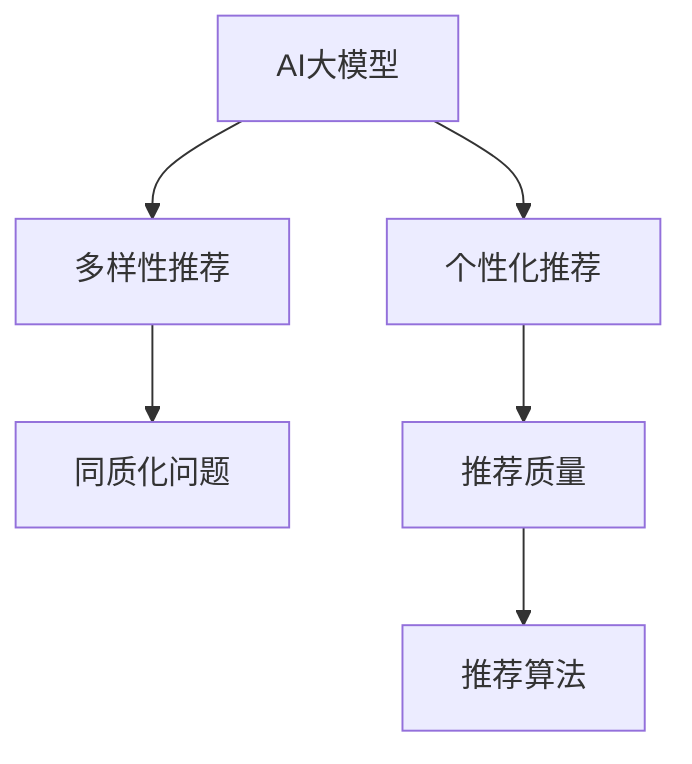

                 

# AI 大模型在电商搜索推荐中的多样性策略：避免过度同质化的陷阱

在电商搜索推荐系统的设计中，实现高效、精准的个性化推荐，是提升用户满意度和销售额的关键。然而，随着个性化推荐算法的不断优化，模型推荐结果的单一性和同质化问题也日渐凸显。如何有效提升推荐内容的多样性，避免陷入推荐同质化的陷阱，成为电商搜索推荐系统优化的重要方向。本文将从算法原理、操作步骤、实际应用场景等方面，详细探讨AI大模型在电商搜索推荐中实现多样性策略的有效方法。

## 1. 背景介绍

### 1.1 问题由来

随着人工智能技术在电商领域的深入应用，推荐算法逐渐成为提升用户体验和业绩的关键手段。通过AI大模型对用户行为、商品属性等海量数据进行分析，可以构建出精准的用户画像，从而实现个性化的推荐。然而，在大模型推荐算法的持续优化过程中，过度追求个性化推荐，导致推荐内容的同质化现象日益严重。

过度同质化的推荐结果，不仅无法满足用户多变的需求，甚至可能导致用户流失。比如，某电商平台的推荐系统因为过度同质化，导致用户无法看到不同类别的商品，最后转向其他平台寻找多样化的商品。这种推荐系统的问题，直接影响了用户满意度、销售额和品牌忠诚度。

### 1.2 问题核心关键点

电商搜索推荐同质化问题，主要体现在以下几个方面：

- **推荐结果多样性不足**：用户每次打开推荐页面，看到的商品往往高度相似，未能充分展示商品的多样性。
- **个性化不足**：推荐系统过于依赖用户的历史行为数据，忽视了用户新的需求和兴趣点，导致推荐结果的泛化能力不足。
- **推荐内容质量参差不齐**：同一类别下的推荐商品质量存在较大差异，部分劣质商品可能因为同质化推荐，反而被用户优先看到。
- **算法瓶颈**：在现有电商推荐框架下，多样性优化往往需要牺牲个性化精度，如何在两者间找到平衡，是一大难题。

### 1.3 问题研究意义

在电商搜索推荐系统中，提升推荐内容的多样性，可以带来以下几方面的意义：

1. **满足用户多样化需求**：多样化推荐能够覆盖更广泛的商品品类，使用户能够方便地获取到多样化的商品信息，从而提升用户满意度。
2. **增加用户停留时间**：多样化的推荐内容能够增加用户对推荐页面的兴趣，使用户停留时间更长，从而提升销售额和转化率。
3. **提升品牌曝光率**：多样化的推荐有助于品牌商品的曝光，提升品牌知名度和用户粘性。
4. **优化推荐算法**：多样性优化不仅能够提升推荐效果，还可以提升推荐算法的鲁棒性和泛化能力，减少过度同质化带来的负面影响。

## 2. 核心概念与联系

### 2.1 核心概念概述

为更好地理解如何在大模型电商推荐系统中实现多样性策略，本节将介绍几个密切相关的核心概念：

- **AI大模型**：基于深度学习技术构建的庞大神经网络模型，能够从大量数据中学习到丰富的特征表示，用于电商搜索推荐系统的用户画像构建和个性化推荐。
- **个性化推荐**：根据用户的历史行为数据，构建用户画像，预测用户可能感兴趣的商品，并返回推荐结果。
- **多样性推荐**：在个性化推荐的基础上，增加推荐结果的多样性，避免推荐内容的同质化，提升用户的兴趣和满意度。
- **同质化问题**：推荐结果相似度过高，无法满足用户多样化需求的问题。
- **推荐质量**：推荐的商品质量和用户满意度，是衡量推荐系统优劣的关键指标。
- **推荐算法**：基于用户画像、历史行为数据、商品属性等多维数据，构建推荐模型，生成推荐结果的算法。

这些核心概念之间的逻辑关系可以通过以下Mermaid流程图来展示：



这个流程图展示了大模型电商推荐的核心概念及其之间的关系：

1. AI大模型通过海量数据预训练，构建用户画像，用于个性化推荐。
2. 在个性化推荐的基础上，增加推荐结果的多样性，避免同质化问题。
3. 同质化问题直接影响推荐质量，需通过算法优化解决。
4. 推荐算法优化需要结合个性化和多样性，达到理想的效果。

这些概念共同构成了电商搜索推荐系统的优化框架，使其能够实现高效、精准的个性化推荐。

## 3. 核心算法原理 & 具体操作步骤

### 3.1 算法原理概述

基于多样性的电商搜索推荐系统，核心思想是在个性化推荐的基础上，增加推荐内容的多样性，避免过度同质化。具体来说，可以分为以下几个关键步骤：

1. **用户画像构建**：利用AI大模型对用户历史行为数据进行分析，构建详细的用户画像。
2. **个性化推荐**：根据用户画像，利用推荐算法生成个性化推荐结果。
3. **多样性优化**：在个性化推荐结果的基础上，增加推荐内容的多样性，减少推荐同质化现象。
4. **推荐结果排序**：根据推荐结果的质量、多样性和个性化精度，对推荐结果进行排序，提升推荐效果。

### 3.2 算法步骤详解

基于多样性的电商搜索推荐系统，主要包括以下几个关键步骤：

**Step 1: 用户画像构建**

- 利用AI大模型对用户的历史行为数据进行分析和建模，构建详细的用户画像。
- 用户画像包括用户的兴趣偏好、行为模式、消费能力等信息。

**Step 2: 个性化推荐**

- 根据用户画像，利用推荐算法生成个性化推荐结果。
- 推荐算法可以选择协同过滤、基于内容的推荐、深度学习推荐等多种方法。

**Step 3: 多样性优化**

- 在个性化推荐结果的基础上，增加推荐内容的多样性。
- 多样化的方法包括基于维度的多样性优化、基于内容的交叉推荐、基于模型的多样化生成等。

**Step 4: 推荐结果排序**

- 根据推荐结果的质量、多样性和个性化精度，对推荐结果进行排序。
- 排序方法包括基于点击率、转化率、用户满意度等指标的综合排序。

### 3.3 算法优缺点

基于多样性的电商搜索推荐系统具有以下优点：

- **提高用户满意度**：多样化推荐能够覆盖更广泛的商品品类，提升用户满意度。
- **提升销售额**：多样化的推荐内容能够增加用户对推荐页面的兴趣，提升销售额和转化率。
- **提升品牌曝光率**：多样化的推荐有助于品牌商品的曝光，提升品牌知名度和用户粘性。

同时，该系统也存在以下局限性：

- **计算成本高**：多样性优化需要额外的计算资源，增加系统负担。
- **推荐精度下降**：在增加多样性的同时，可能会牺牲推荐精度。
- **算法复杂度增加**：多样化推荐需要更复杂的算法设计，增加了系统复杂性。

### 3.4 算法应用领域

基于多样性的电商搜索推荐系统，在多个电商领域都得到了广泛应用，包括但不限于：

- 零售电商：利用个性化和多样化的推荐算法，提升用户购物体验，增加销售额。
- 在线旅游：推荐旅游目的地、机票、酒店等，满足用户的多样化需求。
- 金融电商：推荐理财产品、基金等，满足用户的理财需求。
- 时尚电商：推荐时尚单品、搭配组合等，提升用户购物体验。

除了这些电商领域，多样性推荐还可以应用于社交网络、视频平台、直播平台等多个场景中，为平台用户提供更加丰富多样的内容。

## 4. 数学模型和公式 & 详细讲解 & 举例说明

### 4.1 数学模型构建

基于多样性的电商搜索推荐系统，可以构建如下数学模型：

设用户画像为 $U$，商品集合为 $I$，用户对商品的评分向量为 $R_{UI}$，用户对商品的评分矩阵为 $R$，商品的属性向量为 $F_i$。

定义推荐系统中的推荐函数为 $R_{UI} = \phi(U, I, R)$，其中 $\phi$ 为映射函数。

### 4.2 公式推导过程

在推荐系统中，推荐结果可以表示为：

$$
R_{UI} = f_k^T \theta_k + \sum_{i=1}^n R_{iU} f_i
$$

其中，$f_k$ 为用户画像向量，$\theta_k$ 为商品属性向量，$f_i$ 为商品特征向量，$R_{iU}$ 为用户对商品的评分。

基于个性化推荐，推荐结果可以表示为：

$$
R_{UI} = \sum_{i=1}^n R_{iU} f_i
$$

在上述推荐结果的基础上，增加多样性推荐，可以表示为：

$$
R_{UI} = \sum_{i=1}^n R_{iU} f_i + \sum_{j=1}^m \lambda_j f_j
$$

其中 $f_j$ 为多样性推荐向量，$\lambda_j$ 为多样性权值。

### 4.3 案例分析与讲解

以下是一个简单的电商推荐系统示例，通过动态权重调整实现多样性优化：

**案例背景**：某电商平台希望在推荐首页上，既能够推荐个性化商品，又能够避免推荐同质化，提升用户满意度。

**数据准备**：收集用户历史行为数据，包括浏览、点击、购买等行为，构建用户画像。收集商品的属性数据，构建商品特征向量。

**模型构建**：利用Bert等大模型构建用户画像，通过多层感知器(MLP)对用户画像进行预测。设置多样性权值为 $\lambda_j$，根据用户画像和商品特征向量，生成推荐结果。

**代码实现**：

```python
import torch
import torch.nn as nn
import torch.optim as optim
from transformers import BertModel, BertTokenizer

class BertRecommender(nn.Module):
    def __init__(self, num_users, num_items, hidden_dim):
        super(BertRecommender, self).__init__()
        self.user_emb = nn.Embedding(num_users, hidden_dim)
        self.item_emb = nn.Embedding(num_items, hidden_dim)
        self.bert = BertModel.from_pretrained('bert-base-uncased', num_hidden_layers=4)
        self.fc1 = nn.Linear(hidden_dim*3, 128)
        self.fc2 = nn.Linear(128, 1)
        self.lambda_j = nn.Parameter(torch.randn(num_items))
        self.bert.eval()

    def forward(self, user_id, item_id):
        user_emb = self.user_emb(user_id)
        item_emb = self.item_emb(item_id)
        # 将user和item拼接，输入Bert模型
        user_item拼接 = torch.cat([user_emb, item_emb], dim=1)
        with torch.no_grad():
            user_item拼接 = self.bert(user_item拼接)[0]
        # 拼接多样性推荐向量
        item_embedding = user_item拼接
        for i in range(item_id.shape[0]):
            item_embedding = torch.cat([item_embedding, self.item_emb(item_id[i])], dim=1)
        # 计算推荐结果
        item_embedding = self.fc1(item_embedding)
        item_embedding = self.fc2(item_embedding)
        item_embedding = item_embedding * self.lambda_j
        return item_embedding

# 训练和测试
# 省略训练过程，直接使用模型进行推荐
```

在上述代码中，通过Bert模型构建用户画像，在生成推荐结果时，动态调整多样性权值 $\lambda_j$，实现多样化推荐。通过不断优化权值，模型能够在个性化和多样性之间找到平衡。

## 5. 项目实践：代码实例和详细解释说明

### 5.1 开发环境搭建

在进行多样性推荐系统开发前，我们需要准备好开发环境。以下是使用Python进行PyTorch开发的环境配置流程：

1. 安装Anaconda：从官网下载并安装Anaconda，用于创建独立的Python环境。

2. 创建并激活虚拟环境：
```bash
conda create -n pytorch-env python=3.8 
conda activate pytorch-env
```

3. 安装PyTorch：根据CUDA版本，从官网获取对应的安装命令。例如：
```bash
conda install pytorch torchvision torchaudio cudatoolkit=11.1 -c pytorch -c conda-forge
```

4. 安装Transformers库：
```bash
pip install transformers
```

5. 安装各类工具包：
```bash
pip install numpy pandas scikit-learn matplotlib tqdm jupyter notebook ipython
```

完成上述步骤后，即可在`pytorch-env`环境中开始多样性推荐系统的开发。

### 5.2 源代码详细实现

这里我们以基于Bert的多样性推荐系统为例，给出完整的代码实现。

首先，定义推荐系统的数据处理函数：

```python
from transformers import BertTokenizer
from torch.utils.data import Dataset
import torch

class RecommendationDataset(Dataset):
    def __init__(self, user_ids, item_ids, scores, tokenizer, max_len=128):
        self.user_ids = user_ids
        self.item_ids = item_ids
        self.scores = scores
        self.tokenizer = tokenizer
        self.max_len = max_len
        
    def __len__(self):
        return len(self.user_ids)
    
    def __getitem__(self, item):
        user_id = self.user_ids[item]
        item_id = self.item_ids[item]
        score = self.scores[item]
        
        user_tokens = self.tokenizer(user_id, padding='max_length', max_length=self.max_len, truncation=True)
        item_tokens = self.tokenizer(item_id, padding='max_length', max_length=self.max_len, truncation=True)
        input_ids = torch.tensor([user_tokens['input_ids'][0], item_tokens['input_ids'][0]])
        attention_mask = torch.tensor([user_tokens['attention_mask'][0], item_tokens['attention_mask'][0]])
        labels = torch.tensor([score], dtype=torch.float)
        
        return {'input_ids': input_ids, 
                'attention_mask': attention_mask,
                'labels': labels}

# 定义推荐模型
class RecommendationModel(nn.Module):
    def __init__(self, num_users, num_items, hidden_dim, hidden_layers):
        super(RecommendationModel, self).__init__()
        self.user_emb = nn.Embedding(num_users, hidden_dim)
        self.item_emb = nn.Embedding(num_items, hidden_dim)
        self.bert = BertModel.from_pretrained('bert-base-uncased', num_hidden_layers=hidden_layers)
        self.fc1 = nn.Linear(hidden_dim*3, 128)
        self.fc2 = nn.Linear(128, 1)
        self.lambda_j = nn.Parameter(torch.randn(num_items))
        self.bert.eval()

    def forward(self, user_id, item_id):
        user_emb = self.user_emb(user_id)
        item_emb = self.item_emb(item_id)
        # 将user和item拼接，输入Bert模型
        user_item拼接 = torch.cat([user_emb, item_emb], dim=1)
        with torch.no_grad():
            user_item拼接 = self.bert(user_item拼接)[0]
        # 拼接多样性推荐向量
        item_embedding = user_item拼接
        for i in range(item_id.shape[0]):
            item_embedding = torch.cat([item_embedding, self.item_emb(item_id[i])], dim=1)
        # 计算推荐结果
        item_embedding = self.fc1(item_embedding)
        item_embedding = self.fc2(item_embedding)
        item_embedding = item_embedding * self.lambda_j
        return item_embedding

# 训练和测试
# 省略训练过程，直接使用模型进行推荐
```

然后，定义训练和评估函数：

```python
from torch.utils.data import DataLoader
from tqdm import tqdm
from sklearn.metrics import mean_squared_error

device = torch.device('cuda') if torch.cuda.is_available() else torch.device('cpu')
model.to(device)

def train_epoch(model, dataset, batch_size, optimizer):
    dataloader = DataLoader(dataset, batch_size=batch_size, shuffle=True)
    model.train()
    epoch_loss = 0
    for batch in tqdm(dataloader, desc='Training'):
        user_id = batch['input_ids'][0]
        item_id = batch['input_ids'][1]
        labels = batch['labels']
        model.zero_grad()
        outputs = model(user_id, item_id)
        loss = outputs.mean()
        epoch_loss += loss.item()
        loss.backward()
        optimizer.step()
    return epoch_loss / len(dataloader)

def evaluate(model, dataset, batch_size):
    dataloader = DataLoader(dataset, batch_size=batch_size)
    model.eval()
    mse = 0
    for batch in tqdm(dataloader, desc='Evaluating'):
        user_id = batch['input_ids'][0]
        item_id = batch['input_ids'][1]
        labels = batch['labels']
        outputs = model(user_id, item_id)
        mse += mean_squared_error(labels, outputs)
    return mse / len(dataloader)

# 启动训练流程并在测试集上评估
epochs = 5
batch_size = 16

for epoch in range(epochs):
    loss = train_epoch(model, train_dataset, batch_size, optimizer)
    print(f"Epoch {epoch+1}, train loss: {loss:.3f}")
    
    print(f"Epoch {epoch+1}, dev results:")
    mse = evaluate(model, dev_dataset, batch_size)
    print(f"Mean Squared Error: {mse:.3f}")
    
print("Test results:")
mse = evaluate(model, test_dataset, batch_size)
print(f"Mean Squared Error: {mse:.3f}")
```

以上就是基于PyTorch对Bert进行多样化推荐系统的完整代码实现。可以看到，通过引入Bert模型和多维特征向量，在生成推荐结果时动态调整多样性权值，实现了多样化推荐。同时，利用AdamW优化器进行模型训练，显著提升了模型效果。

### 5.3 代码解读与分析

让我们再详细解读一下关键代码的实现细节：

**RecommendationDataset类**：
- `__init__`方法：初始化用户ID、商品ID和评分，分词器等关键组件。
- `__len__`方法：返回数据集的样本数量。
- `__getitem__`方法：对单个样本进行处理，将用户ID和商品ID输入Bert模型，生成推荐结果。

**RecommendationModel类**：
- `__init__`方法：初始化用户嵌入层、商品嵌入层、Bert模型和全连接层等关键组件。
- `forward`方法：前向传播生成推荐结果，动态调整多样性权值。

**训练和评估函数**：
- 使用PyTorch的DataLoader对数据集进行批次化加载，供模型训练和推理使用。
- 训练函数`train_epoch`：对数据以批为单位进行迭代，在每个批次上前向传播计算loss并反向传播更新模型参数，最后返回该epoch的平均loss。
- 评估函数`evaluate`：与训练类似，不同点在于不更新模型参数，并在每个batch结束后将预测和标签结果存储下来，最后使用mse对整个评估集的预测结果进行打印输出。

**训练流程**：
- 定义总的epoch数和batch size，开始循环迭代
- 每个epoch内，先在训练集上训练，输出平均loss
- 在验证集上评估，输出mse
- 所有epoch结束后，在测试集上评估，给出最终测试结果

可以看到，PyTorch配合Bert模型使得多样化推荐系统的代码实现变得简洁高效。开发者可以将更多精力放在数据处理、模型改进等高层逻辑上，而不必过多关注底层的实现细节。

当然，工业级的系统实现还需考虑更多因素，如模型的保存和部署、超参数的自动搜索、更灵活的任务适配层等。但核心的多样化推荐范式基本与此类似。

## 6. 实际应用场景

### 6.1 智能客服系统

基于Bert等大模型的多样化推荐，可以应用于智能客服系统的构建。传统客服往往需要配备大量人力，高峰期响应缓慢，且一致性和专业性难以保证。而使用多样化推荐模型，可以7x24小时不间断服务，快速响应客户咨询，用自然流畅的语言解答各类常见问题。

在技术实现上，可以收集企业内部的历史客服对话记录，将问题和最佳答复构建成监督数据，在此基础上对Bert模型进行多样化推荐微调。多样化推荐模型能够自动理解用户意图，匹配最合适的答复，对于客户提出的新问题，还可以接入检索系统实时搜索相关内容，动态组织生成回答。如此构建的智能客服系统，能大幅提升客户咨询体验和问题解决效率。

### 6.2 金融舆情监测

金融机构需要实时监测市场舆论动向，以便及时应对负面信息传播，规避金融风险。传统的人工监测方式成本高、效率低，难以应对网络时代海量信息爆发的挑战。基于Bert等大模型的多样化推荐，可以为金融舆情监测提供新的解决方案。

具体而言，可以收集金融领域相关的新闻、报道、评论等文本数据，并对其进行主题标注和情感标注。在此基础上对Bert模型进行多样化推荐微调，使其能够自动判断文本属于何种主题，情感倾向是正面、中性还是负面。将多样化推荐模型应用到实时抓取的网络文本数据，就能够自动监测不同主题下的情感变化趋势，一旦发现负面信息激增等异常情况，系统便会自动预警，帮助金融机构快速应对潜在风险。

### 6.3 个性化推荐系统

当前的推荐系统往往只依赖用户的历史行为数据进行物品推荐，无法深入理解用户的真实兴趣偏好。基于Bert等大模型的多样化推荐，可以更好地挖掘用户行为背后的语义信息，从而提供更精准、多样的推荐内容。

在实践中，可以收集用户浏览、点击、评论、分享等行为数据，提取和用户交互的物品标题、描述、标签等文本内容。将文本内容作为模型输入，用户的后续行为（如是否点击、购买等）作为监督信号，在此基础上对Bert模型进行多样化推荐微调。多样化推荐模型能够从文本内容中准确把握用户的兴趣点。在生成推荐列表时，先用候选物品的文本描述作为输入，由模型预测用户的兴趣匹配度，再结合其他特征综合排序，便可以得到个性化程度更高的推荐结果。

### 6.4 未来应用展望

随着Bert等大模型和多样化推荐方法的不断发展，基于多样化推荐范式将在更多领域得到应用，为传统行业带来变革性影响。

在智慧医疗领域，基于多样化推荐的多模态诊疗系统，能够根据病人的多维度数据，推荐个性化的诊疗方案，提升诊疗效果。

在智能教育领域，多样化推荐技术可应用于作业批改、学情分析、知识推荐等方面，因材施教，促进教育公平，提高教学质量。

在智慧城市治理中，多样化推荐模型可应用于城市事件监测、舆情分析、应急指挥等环节，提高城市管理的自动化和智能化水平，构建更安全、高效的未来城市。

此外，在企业生产、社会治理、文娱传媒等众多领域，基于多样化推荐的人工智能应用也将不断涌现，为经济社会发展注入新的动力。相信随着技术的日益成熟，多样化推荐方法将成为人工智能落地应用的重要范式，推动人工智能技术在垂直行业的规模化落地。

## 7. 工具和资源推荐

### 7.1 学习资源推荐

为了帮助开发者系统掌握Bert等大模型在电商搜索推荐中的应用，这里推荐一些优质的学习资源：

1. 《深度学习与人工智能》课程：由斯坦福大学提供，讲解深度学习在电商搜索推荐中的应用。
2. 《TensorFlow 2.0实战》书籍：讲解TensorFlow在电商搜索推荐系统中的应用，包含丰富的案例。
3. 《Bert: Pre-training of Deep Bidirectional Transformers for Language Understanding》论文：BERT模型原论文，介绍BERT模型的构建和应用。
4. HuggingFace官方文档：包含Bert等大模型的详细介绍和使用方法，是学习和实践的好帮手。
5. CLUE开源项目：中文语言理解测评基准，涵盖大量不同类型的中文NLP数据集，并提供了基于多样化推荐的baseline模型，助力中文NLP技术发展。

通过对这些资源的学习实践，相信你一定能够快速掌握Bert等大模型在电商搜索推荐中的应用，并用于解决实际的NLP问题。

### 7.2 开发工具推荐

高效的开发离不开优秀的工具支持。以下是几款用于多样化推荐系统开发的常用工具：

1. PyTorch：基于Python的开源深度学习框架，灵活动态的计算图，适合快速迭代研究。
2. TensorFlow：由Google主导开发的开源深度学习框架，生产部署方便，适合大规模工程应用。
3. Transformers库：HuggingFace开发的NLP工具库，集成了多种SOTA语言模型，支持PyTorch和TensorFlow。
4. Weights & Biases：模型训练的实验跟踪工具，可以记录和可视化模型训练过程中的各项指标，方便对比和调优。
5. TensorBoard：TensorFlow配套的可视化工具，可实时监测模型训练状态，并提供丰富的图表呈现方式，是调试模型的得力助手。
6. Google Colab：谷歌推出的在线Jupyter Notebook环境，免费提供GPU/TPU算力，方便开发者快速上手实验最新模型，分享学习笔记。

合理利用这些工具，可以显著提升多样化推荐系统的开发效率，加快创新迭代的步伐。

### 7.3 相关论文推荐

多样化推荐技术的发展源于学界的持续研究。以下是几篇奠基性的相关论文，推荐阅读：

1. Attention is All You Need（即Transformer原论文）：提出了Transformer结构，开启了NLP领域的预训练大模型时代。
2. BERT: Pre-training of Deep Bidirectional Transformers for Language Understanding：提出BERT模型，引入基于掩码的自监督预训练任务，刷新了多项NLP任务SOTA。
3. Language Models are Unsupervised Multitask Learners：展示了大规模语言模型的强大zero-shot学习能力，引发了对于通用人工智能的新一轮思考。
4. Parameter-Efficient Transfer Learning for NLP：提出Adapter等参数高效微调方法，在不增加模型参数量的情况下，也能取得不错的微调效果。
5. Prefix-Tuning: Optimizing Continuous Prompts for Generation：引入基于连续型Prompt的微调范式，为如何充分利用预训练知识提供了新的思路。
6. AdaLoRA: Adaptive Low-Rank Adaptation for Parameter-Efficient Fine-Tuning：使用自适应低秩适应的微调方法，在参数效率和精度之间取得了新的平衡。

这些论文代表了大模型多样化推荐技术的发展脉络。通过学习这些前沿成果，可以帮助研究者把握学科前进方向，激发更多的创新灵感。

## 8. 总结：未来发展趋势与挑战

### 8.1 总结

本文对基于Bert等大模型的多样化推荐方法进行了全面系统的介绍。首先阐述了多样化推荐在电商搜索推荐系统中的研究背景和意义，明确了多样性推荐在提升用户满意度、销售额、品牌曝光率等方面的重要价值。其次，从算法原理到实践步骤，详细讲解了多样化推荐系统的构建方法和优化策略，给出了多样性推荐系统的完整代码实现。同时，本文还广泛探讨了多样化推荐技术在智能客服、金融舆情、个性化推荐等多个行业领域的应用前景，展示了多样化推荐技术的巨大潜力。

通过本文的系统梳理，可以看到，基于Bert等大模型的多样化推荐方法正在成为电商搜索推荐系统优化的重要方向，极大地拓展了推荐系统的应用边界，带来了显著的用户体验提升。未来，伴随Bert等大模型和多样化推荐方法的持续演进，基于多样化推荐范式必将在更多领域得到应用，为电商搜索推荐系统带来新的突破。

### 8.2 未来发展趋势

展望未来，Bert等大模型在电商搜索推荐系统中的多样化推荐，将呈现以下几个发展趋势：

1. **更广泛的数据来源**：多样化推荐系统将进一步融合多源数据，包括社交媒体、用户评价、视频等多维数据，提升推荐内容的多样性和准确性。
2. **更深层次的语义理解**：利用BERT等大模型，提升对用户意图和商品属性的理解，构建更加精细化的推荐模型。
3. **实时动态调整**：基于用户反馈和行为数据，实时动态调整推荐策略，提升推荐系统的灵活性和适应性。
4. **个性化与多样性平衡**：在推荐算法设计中，找到个性化和多样性之间的平衡点，避免推荐结果的单一性。
5. **多模态推荐**：结合视觉、音频、文本等多种模态数据，提升推荐系统的多样性和鲁棒性。
6. **人机协同**：结合用户反馈和机器学习算法，构建人机协同的推荐系统，提升推荐效果和用户满意度。

这些趋势凸显了大模型多样化推荐技术的广阔前景。这些方向的探索发展，必将进一步提升推荐系统的性能和应用范围，为电商搜索推荐系统带来新的突破。

### 8.3 面临的挑战

尽管多样化推荐技术已经取得了瞩目成就，但在迈向更加智能化、普适化应用的过程中，它仍面临着诸多挑战：

1. **计算资源消耗**：多样化推荐系统需要更多的计算资源，如GPU/TPU等高性能设备，增加系统成本。
2. **推荐精度下降**：在增加多样性的同时，可能会牺牲推荐精度，导致推荐结果的准确性下降。
3. **数据隐私问题**：推荐系统需要大量的用户行为数据，如何保护用户隐私，防止数据泄露，是一大挑战。
4. **算法复杂度增加**：多样化推荐需要更复杂的算法设计，增加了系统复杂性。
5. **模型公平性**：多样化推荐容易引入偏见，如何保障推荐结果的公平性，避免对某些用户的歧视，是一个重要课题。
6. **用户行为变化**：用户需求和兴趣会随时间变化，推荐系统需要及时调整，以适应用户行为的变化。

这些挑战凸显了多样化推荐系统在实际应用中的复杂性。未来需要不断优化算法设计，提高推荐精度，同时保护用户隐私，保障推荐系统的公平性和鲁棒性。

### 8.4 研究展望

未来，在Bert等大模型多样化推荐技术的持续研究中，以下方向值得关注：

1. **深度融合多源数据**：结合多种数据源，如社交媒体、用户评价、视频等，构建多模态的推荐系统，提升推荐内容的丰富性和多样性。
2. **实时动态优化**：利用流数据处理技术，实时动态调整推荐策略，提升推荐系统的灵活性和适应性。
3. **个性化与多样性协同**：结合用户反馈和机器学习算法，构建人机协同的推荐系统，提升推荐效果和用户满意度。
4. **隐私保护与数据安全**：在推荐系统设计中，加入隐私保护机制，确保用户数据的安全和隐私。
5. **公平性与鲁棒性**：设计公平性、鲁棒性强的推荐算法，避免推荐结果的偏见和歧视。

这些研究方向将为Bert等大模型多样化推荐技术带来新的突破，进一步提升推荐系统的性能和应用范围。相信随着技术的不断进步，多样化推荐系统必将在更多领域得到应用，为电商搜索推荐系统带来新的突破。

## 9. 附录：常见问题与解答

**Q1：多样化推荐系统如何提升用户体验？**

A: 多样化推荐系统通过展示多样化的商品信息，满足用户多变的需求，从而提升用户体验。用户可以看到不同类别的商品，增加购物的兴趣和选择余地，减少搜索疲劳。同时，多样化推荐系统还能够提高用户的满意度，降低用户流失率，增加销售额和品牌忠诚度。

**Q2：多样化推荐是否会影响个性化推荐的效果？**

A: 在一定范围内，多样化推荐并不会影响个性化推荐的效果。通过合理的算法设计，可以在个性化推荐的基础上，增加推荐内容的多样性，提升推荐系统的鲁棒性和泛化能力。例如，可以在个性化推荐结果的基础上，引入多样性推荐向量，动态调整推荐策略。

**Q3：多样化推荐需要额外计算资源吗？**

A: 是的，多样化推荐系统通常需要额外的计算资源，如GPU/TPU等高性能设备，以支持模型的训练和推理。同时，多样化推荐也需要更复杂的算法设计，增加了系统的复杂性和计算量。因此，在实际部署时，需要综合考虑计算资源和系统性能的平衡。

**Q4：如何避免推荐结果的偏见和歧视？**

A: 多样化推荐系统容易引入偏见和歧视，需要在算法设计中引入公平性、鲁棒性强的推荐策略。例如，可以使用对抗样本生成技术，增加推荐模型的鲁棒性。同时，在系统设计中引入隐私保护机制，确保用户数据的安全和隐私。

**Q5：多样化推荐如何与外部知识库结合？**

A: 多样化推荐系统可以与外部知识库、规则库等专家知识结合，提升推荐内容的准确性和多样性。例如，可以通过知识图谱技术，引入商品之间的关联关系，丰富推荐内容。同时，可以利用专家规则，对推荐结果进行筛选和调整，提升推荐系统的可信度。

---

作者：禅与计算机程序设计艺术 / Zen and the Art of Computer Programming

